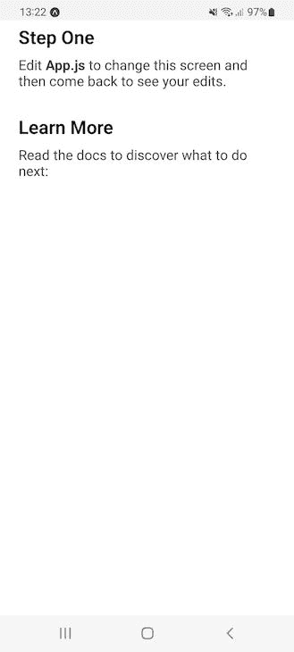
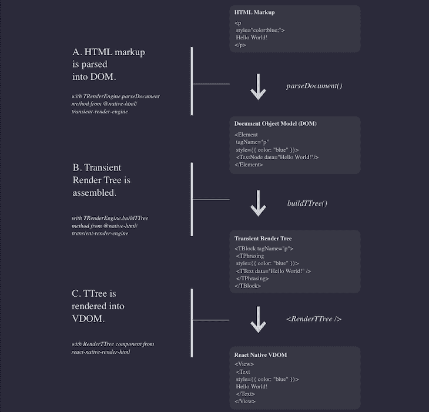
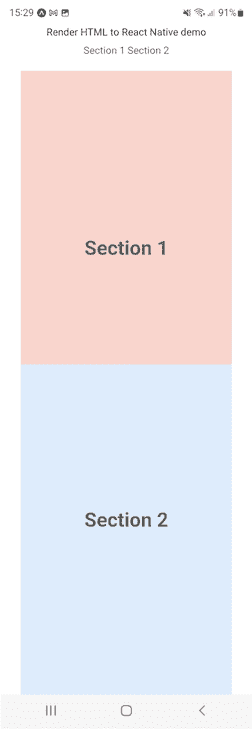

# 如何渲染 HTML 来反应原生

> 原文：<https://blog.logrocket.com/how-render-html-react-native/>

假设您想使用 React Native 将您的网站或 web 应用程序转换为移动应用程序，或者您有静态 HTML 代码，希望显示在应用程序中的任何特定页面上。你会怎么做？你会重新写一大堆代码吗？

当然不需要。您可以将 HTML 直接呈现到 React Native 中。哇哦。太神奇了。因此，在本文中，我们将学习如何使用`react-native-render-html`库来呈现 HTML，使其具有本地反应能力。让我们看看它是如何工作的。

向前跳:

本教程的一些先决条件包括在您的设备上安装 npm 和 Node.js，并对 React 和 React Native 有基本的了解。

## 设置我们的 React 本地项目

要开始本教程，我们需要设置一个 React 本地项目。我们将通过运行以下命令来实现这一点:

```
npx react-native init MyTestApp

```

现在让我们继续前进。创建项目后，我们将使用以下命令之一运行它一次，以检查一切是否按预期运行:

```
npm run android 
//or 
npm run ios

```

无论您使用的是虚拟设备还是 Android 或 iOS 设备，该应用程序都会根据您选择的配置进行构建并开始运行。

你可以修改`App.js`文件，在你的主页——你的应用程序的入口页面——看到变化。我修改了几行代码来检查它是否工作正常。如果一切顺利，您可以看到如下所示的主页:



## 使用`react-native-render-html`渲染 HTML 以反应本地

在本教程中，我们将使用`[react-native-render-html](https://www.npmjs.com/package/react-native-render-html)` [包](https://www.npmjs.com/package/react-native-render-html)将 HTML 渲染到 React 本地应用程序中。保留一些样本 HTML 代码，以便稍后在 React Native 应用程序中使用。

`react-native-render-html`库是一个开源组件，拥有超过 3000 个 GitHub stars 和 46 个贡献者。它获取你的 HTML，并在你的 iOS 或 Android 应用中呈现 100%的原生视图。

这个库支持我们在开发 web 应用程序时通常使用的所有文本 CSS 方法。除了文本，它还支持图像、锚标签和列表。

### 如何将 HTML 解析成 React Native

`react-native-render-html`文档使用下面的[数据流图](https://meliorence.github.io/react-native-render-html/docs/architecture)来演示这个工具如何将 HTML 解析为 React Native:



总之，首先，我们传递的 HTML 标记将被解析到 DOM 中。然后，基于输入组装瞬态渲染树。之后，TTree 被[渲染成虚拟 DOM](https://blog.logrocket.com/virtual-dom-react/) 。

要了解更多关于渲染如何工作的信息，[请参考文档](https://meliorence.github.io/react-native-render-html/docs/flow/rendering)。否则，让我们继续我们的实际例子。

### 将样式应用于元素

对于样式，您可以使用内嵌样式，如下所示:

```
<p style= "color: purple; font-size: 2rem;">

```

以上不会坏你的应用。它支持四个属性来定制元素样式:基本、id 样式、类样式和标签样式。

还有另一种处理样式的方法，那就是使用`mixedStyle`记录。基本上，`mixedStyle`是一个包含你所有 CSS 的对象；将从那里应用样式。请参见下面的示例:

```
//JavaScript
const mixedStyle = {
  body: {
    whiteSpace: 'normal',
    color: '#aaa'
  },
  p: {
    color: '#fff'
  }
}

```

为了在 HTML 渲染过程中使用您的自定义样式来反应本机，`react-native-render-html`库支持`tagsStyles`属性。您可以在该属性中传递您声明的样式，如下所示:

```
//JavaScript
<RenderHtml
  source={source}
  tagsStyles={mixedStyle}
/>

```

请记住，当向 React 本机应用程序呈现 HTML 和自定义样式时，React 本机样式将在构建时被忽略，并且不会被应用或反映。

有了`react-native-render-html`库，你就可以玩`htmlparser2`生态系统，这是用于 DOM 篡改的[。您可以在任何时间点处理 DOM。例如:](https://meliorence.github.io/react-native-render-html/docs/guides/dom-tampering)

```
import React from 'react';
import { useWindowDimensions } from 'react-native';
import RenderHtml from 'react-native-render-html';
import { removeElement, isTag } from 'domutils';

function onElement(element) {
  // Remove the first p from div which has class "parentDiv"
  if (element.attribs['class'] == 'parentDiv') {
    let i = 0;
    for (const p of element.children) {
      if (isTag(p) && i < 1) {
        removeElement(p);
        i++;
      }
    }
  }
}

const source = {
  html: `
    <div class="parentDiv">
      <p>para-1</p>
      <p>para-2</p>
      <p>para-3</p>
    </div>
  `
};

const domVisitors = {
  onElement: onElement
};

export default function App() {
  const { width } = useWindowDimensions();
  return (
    <RenderHtml
      contentWidth={width}
      source={source}
      domVisitors={domVisitors}
    />
  );
}

```

现在让我们使用外部库在应用程序中呈现 HTML 代码。为此，您需要修改`App.js`文件，如下所示:

```
//JavaScript - JSX
import type {Node} from 'react';
import {
  ScrollView,
  Text,
  View,
} from 'react-native';
import RenderHtml from 'react-native-render-html';

const source = {
  html: `
    <header style="max-width: 1200px;
      overflow: hidden;
      box-sizing: border-box;
      margin: 20px auto;
      text-align: center;">
      <nav style="padding: 20px 0 0;
          max-width: 400px;
          margin: 0 auto;">
          <a style="display: inline-block;
            color: #666666;
            text-decoration: none;
            font-size: 14px;
            cursor: pointer;" href="#section1">Section 1</a>
          <a style="display: inline-block;
            color: #666666;
            text-decoration: none;
            font-size: 14px;
            cursor: pointer;" href="#section1" href="#section2">Section 2</a>
      </nav>
    </header>
    <header style="display: none;
      position: fixed;
      width:100%,
      top: 0;
      background: #FFFFFF;
      margin: 0 -15px;
      width: 100%;
      border-bottom: 1px solid #CCCCCC;
      box-sizing: border-box;
      box-shadow: 0px 0px 10px 0 rgba(0, 0, 0, 0.5);
      opacity: 0.9;
      z-index: 100;">
      <div style="max-width: 1200px;
          padding: 15px 30px;
          margin: 0 auto;
          overflow: hidden;
          box-sizing: border-box;">
          <nav style="padding: 5px 0;
            max-width: 400px;
            float: right;
            text-align: right;">
            <a style="display: inline-block;
                color: #666666;
                text-decoration: none;
                font-size: 14px;
                cursor: pointer;" href="#section1">Section 1</a>
            <a style="display: inline-block;
                color: #666666;
                text-decoration: none;
                font-size: 14px;
                cursor: pointer;" href="#section2">Section 2</a>
          </nav>
      </div>
    </header>
    <div style="min-width: 300px;
      margin: 0 auto;
      height: 1000px;
      position: relative;
    ">
      <div style="min-height: 100px;position: relative; background: #ffd6cd; width=100vw;" id="section1">
          <h1 style="text-align: center;
            line-height: 500px;
            color: #666666;
            margin: 0;">Section 1</h1>
      </div>
      <div style="min-height: 100px;position: relative; background: #ddebfd; width=100vw;" id="section2">
          <h1 style="text-align: center;
            line-height: 500px;
            color: #666666;
            margin: 0;">Section 2</h1>
      </div>
    </div>
    </div>
  `
};
const App: () => Node = () => {
  return (
    <ScrollView contentInsetAdjustmentBehavior="automatic">
    <View>
      <Text style={{top:"3%", textAlign:"center"}}>
        Render HTML to React Native demo
      </Text>
      <RenderHtml
        source={source}
      />
    </View>
    </ScrollView>
  );
};
export default App;

```

从第 10 行开始，在`source`变量中，我们编写了 HTML 代码。这段代码由第 94 行的一个名为`RenderHtml`的方法呈现。我们必须提供我们的 HTML 作为源属性，包会处理剩下的。

为了演示从外部库呈现的 HTML 看起来与用 React Native 编写的代码一样，第 91 行使用默认的 React Native `<Text>`方法来显示文本。

由默认方法呈现的文本和从呈现 HTML 输出的文本应该如下所示:



## 探索`react-native-render-html`的替代方案

除了`react-native-render-html`库之外，还有一个将 web 组件渲染到 React 原生应用的选项— [React 原生 WebView](https://blog.logrocket.com/react-native-webview-a-complete-guide/) 。这种内置 webview 的现代跨平台替代方案对嵌入从整个 web 应用程序到简单 HTML 文件的任何内容都有很大的支持。

在这个库中，您可以找到与上面类似的模式。看看下面的例子:

```
//Javascript - JSX
import React, { Component } from 'react';
import { StyleSheet, Text, View } from 'react-native';
import { WebView } from 'react-native-webview';

// ...
class MyWebComponent extends Component {
  render() {
    return <WebView source={{ uri: 'https://reactnative.dev/' }} />;
  }
}

```

这个库有许多有用的功能，比如上传和下载文件、自定义 cookies、页面导航等等。查看这份[React Native WebView](https://blog.logrocket.com/react-native-webview-a-complete-guide/)完整指南，看看它是否是满足您需求的正确解决方案。

## 结论

由于 React 的流行，React Native 很受欢迎。如果您了解 React，那么使用 React Native 的原生支持，通过 React 创建一个移动应用程序是很简单的。

此外，您可能已经准备好了 HTML，并希望使用现有代码创建一个移动应用程序，而不是重写它以适应您的目标平台。使用上面讨论的方法之一，可以本地呈现 HTML 以本地反应。你不需要重新发明轮子来让它在 Android 或 IOS 应用中工作。

我曾经重写代码，使它成为一个本地应用程序，但是我知道了一些非常棒的库，可以用来展示我的 HTML。结果视图与本机视图相同，因此这种方法不会影响用户体验。

如果您想在 React 本机应用程序中直接呈现 HTML，请确保检查您想使用的库是否符合您的要求。如果你有任何问题，请在下面的评论中告诉我！

## [LogRocket](https://lp.logrocket.com/blg/react-native-signup) :即时重现 React 原生应用中的问题。

[](https://lp.logrocket.com/blg/react-native-signup)

[LogRocket](https://lp.logrocket.com/blg/react-native-signup) 是一款 React 原生监控解决方案，可帮助您即时重现问题、确定 bug 的优先级并了解 React 原生应用的性能。

LogRocket 还可以向你展示用户是如何与你的应用程序互动的，从而帮助你提高转化率和产品使用率。LogRocket 的产品分析功能揭示了用户不完成特定流程或不采用新功能的原因。

开始主动监控您的 React 原生应用— [免费试用 LogRocket】。](https://lp.logrocket.com/blg/react-native-signup)