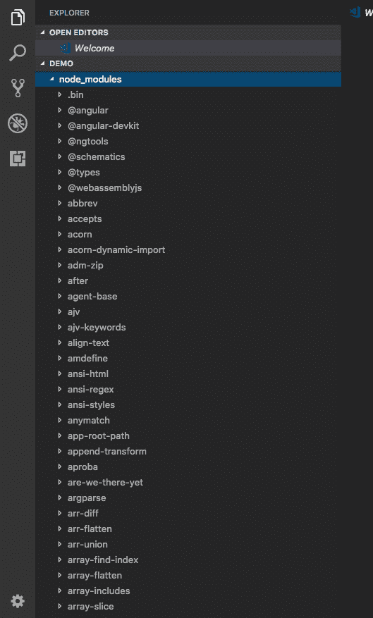

# 您的 web 应用程序的开源依赖项有多安全？

> 原文：<https://blog.logrocket.com/how-secure-are-your-web-applications-open-source-dependencies-aabf24653fad/>

最近发现的一次黑客攻击表明，至少有 1000 个运行在开源电子商务框架 Magento 上的网站在暴力攻击的帮助下遭到破坏。攻击者然后利用它来窃取信用卡凭据并安装加密货币挖掘恶意软件。这种利用开源软件(OSS)生态系统的攻击引发了一些关于任何 web 应用程序的开源依赖性的问题。

### 开源软件安全性的重要性

2015 年[调查](https://www.zdnet.com/article/its-an-open-source-world-78-percent-of-companies-run-open-source-software/)报告称，全球 78%的企业运行 OSS，19%间接使用 OSS。只有 3%的企业没有受到 OSS 的影响。大多数部署的 web 系统严重依赖于开源组件，因此暴露于各种困扰 web 的漏洞。

看门人可能会变得自满，因此最终用户有责任检查代码箱，无论是密封的还是开放的，以确保他们的部署是安全的。

Web 开发人员有时会犯严重依赖 OS 库和从身份验证到 UI 的一切依赖的错误。有些应用程序完全构建在 Magento、Drupal、Joomla 等开源平台之上。

所以，一个微小的漏洞确实会给使用该依赖的整个生态系统带来巨大的破坏。例如，这里列出了 Angular 的一些节点依赖关系。

这个列表实际上要大得多(实际模块数是 806)。大多数时候，我们很少意识到，当我们写一段代码时，我们实际上依赖于这么多的模块。

保护您的 web 应用程序不仅仅是为了防止未来的攻击，它还在于有一个可靠的策略来避免漏洞被披露的情况。

虽然开源依赖带来了安全威胁，但是它的开放性使它更加安全。任何人都可以检查。有了适当的工具和标准操作程序，最终用户就能够检查开源依赖项并确保安全性。

让我们来看看几种不同的方法来提高您的开源软件(OSS)库的 web 安全性。

### 使用工具检查依赖关系中的安全漏洞

不同的工具——包括免费的和商业的——在过去的几年中已经出现，它们可以帮助你管理依赖关系中的开源漏洞。

你可能已经知道最新版本的 npm 附带了 [npm 审计](https://docs.npmjs.com/cli/audit)。

以下是 npm 博客的摘录:

> npm audit 是一个新命令，可以对项目的依赖关系树进行即时安全审查。审核报告包含有关您的依赖关系中的安全漏洞的信息，并可以通过提供易于运行的 npm 命令和进一步故障排除的建议来帮助您修复漏洞。

与审计功能一起，npm audit 在您每次为项目安装新模块或更新现有模块时都会向您发出警报。它使用节点安全平台，该平台依赖于公共漏洞数据库，如 NIST 国家漏洞数据库(NVD)来报告依赖关系中的漏洞。

Node 不是您的主要环境？不要烦恼！您还可以使用其他工具来可靠地生成库的安全报告。

OWASP 的一个名为[依赖检查](https://www.owasp.org/index.php/OWASP_Dependency_Check)的开源命令行工具可以用来监控 PHP、Java、.Net 和 Ruby 代码。

或者，[OS index](https://ossindex.net/)有几个检查模块，并从多个来源获取漏洞报告。

除此之外，还有像 SourceClear、Hakiri 和 Snyk 这样的商业组织，它们使用从几个来源收集的专有漏洞数据库来促进代码的免费安全分析。

### 在使用依赖项之前，严格遵守安全规则和安全标准

应该有适当的政策来使开发团队对任何违反安全的行为负责。虽然这并不总是一个受欢迎的策略，但事实是，在将依赖项引入您的项目之前，开发人员和内部人员都必须证明不存在安全威胁。

强制执行一个策略，要求开发人员证明依赖项没有任何已知的漏洞，这是我们所需要的。开放网络应用安全项目是一个更新已知漏洞的好地方。

在决定将模块导入项目之前，您应该问自己以下几个问题:

1.  开源组件是处于积极开发状态还是过时了？
2.  问题跟踪器中是否有任何尚未解决的重大问题？
3.  组件是否经过测试并准备好投入生产？
4.  该组件是否有受欢迎的替代品？

### 持续监控您的开源组件

作为一名开发人员，你应该列出所有 OSS 依赖项的清单，并跟踪安全更新。

不言而喻，就像 Linus 的定律所说的那样，“很多人都在关注、讨论和更新 OSS 的状态”。有了这么多免费的帮助，跟踪事情比以前容易多了。但是，请记住，这不是一次性的事情。你必须不断地监控开源软件的依赖性。

除此之外，您还需要一种策略，从方法上检查是否出现了任何新的漏洞，然后尽快部署补丁。

例如，如果库正在开发中，你可以期待他们很快发布一个更新。如果没有，你应该在他们的追踪器中发起一个问题，或者通过自己修补漏洞并创建一个拉请求来做出贡献。

### 测试组件和依赖项

严格测试您所有的组件和 OSS 依赖项，寻找黑客代码和可能的入侵点。正确的测试和代码审查可能会让您远离麻烦，即使在某个依赖项中发现了漏洞。在一个环境中安全的依赖项在另一个环境中可能不安全。

如果您为您的组件和依赖项编写测试并进行严格的代码审查，您可以希望大多数(如果不是全部)漏洞被堵塞，并且应用程序对于生产是安全的。此外，一定要确保应用程序的每个输入都经过消毒。不同的代码对象可能需要对同一输入进行不同的净化。

### 构建内部工具，而不是不支持的(过期的)库

你还在使用不支持的、过期的 OSS 库吗？这可能不是一个好主意。考虑构建您自己的代码对象，并为该构建映射维护路径。

在开源世界中，库开发人员放弃项目是很常见的，这种依赖最终导致没有任何活跃的开发人员。如果它是一个对你的应用程序有安全隐患的依赖，你应该考虑转移到一个积极开发的类似组件，或者负责派生它并在它的基础上开发。

* * *

### 更多来自 LogRocket 的精彩文章:

* * *

这样，你可以重新利用过时的代码，然后把它还给 OSS 社区。这也将为你赢得作为一名开发人员(也可能是一个人)的尊重，并从长远来看提供更多的机会。

## 200 只显示器出现故障，生产中网络请求缓慢

部署基于节点的 web 应用程序或网站是容易的部分。确保您的节点实例继续为您的应用程序提供资源是事情变得更加困难的地方。如果您对确保对后端或第三方服务的请求成功感兴趣，

[try LogRocket](https://lp.logrocket.com/blg/node-signup)

.

[https://logrocket.com/signup/](https://lp.logrocket.com/blg/node-signup)

LogRocket 就像是网络和移动应用程序的 DVR，记录下用户与你的应用程序交互时发生的一切。您可以汇总并报告有问题的网络请求，以快速了解根本原因，而不是猜测问题发生的原因。

LogRocket 检测您的应用程序以记录基线性能计时，如页面加载时间、到达第一个字节的时间、慢速网络请求，还记录 Redux、NgRx 和 Vuex 操作/状态。

[Start monitoring for free](https://lp.logrocket.com/blg/node-signup)

.

* * *