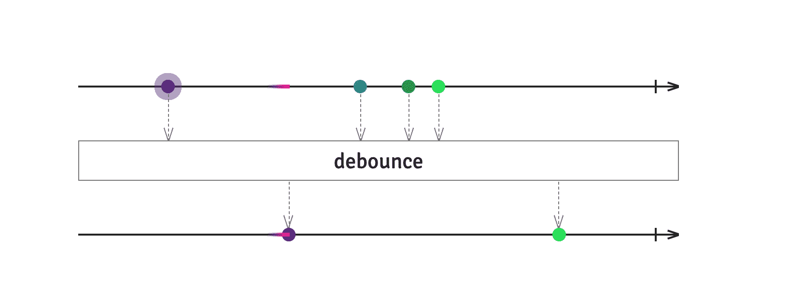

# 流如何简化你的生活

> 原文：<https://blog.logrocket.com/how-streams-can-simplify-your-life-494a4b247f36/>



在 web 开发领域，**流**(以及它们的构建模块，**可观察对象**)是一个越来越受欢迎的话题。像 [BaconJS](https://baconjs.github.io/) 和 [RxJS](https://rxjs.dev/guide/overview) 这样的库已经存在很多年了，RxJS 甚至被[用作 Angular 2+](https://auth0.com/blog/making-use-of-rxjs-angular/) 的基础。事实上，TC39 甚至提议在语言中加入本地观察点。

所以溪流是一件大事。但是……为什么呢？为什么那么多人关心溪流？

简而言之，基于流的方法极大地简化了几十年来导致偏头痛的几个问题。我们稍后将讨论这些问题以及流如何帮助解决这些问题，但在此之前，我想在这里播下一颗种子，提出一个总的主题，我希望你在我们继续时记住这个主题。

流解决的问题都是关于**发送、接收和处理数据。**这是我们的主题种子:在我看来，流提供的是视角的转变，从**询问数据**到**倾听数据**。

[](https://logrocket.com/signup/)

### 问题

这几乎是显而易见的，不值得一说(但我还是要说)——现代网络应用程序非常复杂。它们往往有一大堆或多或少独立的组件同时位于一个页面上，从各种来源请求数据，转换数据，以有趣的方式组合来自不同来源的数据，最终，如果一切顺利，将一些数据显示在屏幕上供用户查看。

顺便说一下，“数据源”不仅仅指“REST API”。数据可能来自各种地方:

*   用于从服务器进行实时更新的 Web 套接字连接
*   用户输入事件，如文本字段中的鼠标移动或键盘事件
*   [来自传感器](https://developer.mozilla.org/en-US/docs/Web/API/Sensor_APIs#Interfaces)的输入，如手机的陀螺仪或加速度计
*   来自网络工作者、iframes 或相关窗口的通信
*   从`[localStorage](https://developer.mozilla.org/en-US/docs/Web/API/Window/localStorage)` 或[索引的存储变化事件 DB](https://developer.mozilla.org/en-US/docs/Web/API/IndexedDB_API)

这样的例子不胜枚举(你可能会想到我遗漏了什么)。

所有这些复杂性可能很难管理。这里有一些经常出现的问题:

*   几个独立的组件同时使用一个数据源
*   组件需要监听来自其数据源的更新，并实时对其做出反应
*   应用程序的几个独立部分需要保持同步；来自单个数据源的更新应该尽可能即时地在任何地方得到反映
*   一个组件中的用户操作应该更新其他几个独立的组件，以便一个组件充当其他组件的数据源
*   每个组件使用一组不同的数据源，以独特的方式组合它们的输出，通常转换和合并来自这些源的数据以满足该组件的需求。每次从任何数据源进行更新后，都需要再次进行这种转换

Streams 可以轻松地处理所有这些问题，并且以一种易于理解的方式做到这一点。

### 什么是流？

在我们进入代码示例之前，让我们先谈一点理论，就一分钟。

这里调用的软件设计模式被称为[观察者模式](https://en.wikipedia.org/wiki/Observer_pattern)。在这个模式中，我们有两个重要的参与者:“观察者”和“主体”(也称为“可观察对象”)。顾名思义，观察者“观察”受试者，每当受试者发出任何数据，观察者都会发现。在代码中，这是通过主题保存当前正在观察他们的所有观察者的列表来完成的，每当他们有一些数据要传递时，他们就遍历该列表并对每个观察者调用一个特殊的方法，将数据作为参数传递。

观察者模式在软件中无处不在。这是所有发布/订阅交互背后的基本架构。你甚至可以把日常事件处理者想象成观察者。我认为这种模式如此流行的原因是显而易见的:当异步事件发生时，能够很容易地发现异步事件，并在任何可用的时候从数据源获取数据，而不需要轮询，这种能力非常强大。

流是比观察者和主体更高的抽象层。流使用也可以充当观察者的主体，观察其他主体来接收数据。每个主体观察其他人等待数据，对收到的数据进行某种处理，然后将一些数据发送给观察它的人。这些观察者主题使得构建长链数据处理器变得非常容易，这些处理器可以对数据做有趣的事情，并帮助我们的应用程序中需要数据的组件获得数据。

另一个值得一提的方面是，正如单个主体可以被多个观察者观察一样，单个观察者也可以观察多个主体。这使得能够以各种有趣的方式将不同来源的数据合并在一起。

花一点时间，想象把许多这些独立的观察者-主体联系在一起，然后退后一步，看大图。想想数据是如何在这个系统中从源流向目的地，与其他源的数据合并，分成支流，再与更多的数据汇合，创建有趣的路径，非常高效地将数据带到整个系统中需要它的地方。这个大画面就是我们所说的“流”。

### 代码示例

既然我们知道了理论，就让我们把它付诸实践吧。

对于您拥有的每个数据源，不管它是哪种类型的数据源，都要创建一个主题，并使它对任何需要来自该数据源的数据的组件可用。不同的 UI 框架以不同的方式促进了这一点，但是出于我们的目的，我们将把每个主题放在一个 JavaScript 模块中。然后，任何需要来自该源的数据的组件都可以导入主题。

> **注意:**对于这里的代码示例，我将使用 JavaScript 作为语言，使用 RxJS 作为流库，但这是任意的。RxJS 是我最熟悉的，但是还有其他的流库完成同样的事情，包括 JS 和其他语言。事实上，RxJS 只是一种叫做[react vex](http://reactivex.io/)的抽象规范的 JavaScript 实现，它在[各种语言](http://reactivex.io/languages.html)中都有实现。

假设我们需要定期轮询一个 API。我们可以创建一个 subject 来处理这个问题，使用 RxJS 的便利的`ajax`助手和`interval`函数，它创建一个 subject 在指定的时间间隔发出。(`pipe`操作符本质上是把你给它的操作符链接在一起，而`switchMap`从它接收的每一个数据比特中创建一个新的可观察对象，然后在创建下一个之前发出那个可观察对象的数据，但是不要在这里太纠结；这些是 RxJS 特有的，有点跑题)。

```
import {interval} from 'rxjs'
import {ajax} from 'rxjs/ajax'
Import {switchMap} from 'rxjs/operators'

// every 10 seconds, poll /api/updates
const apiSubject = interval(1000).pipe(
    switchMap(_ => ajax.getJSON('https://mysite.com/api/updates'))
)

export apiSubject
```

我们可以继续这样做，为每个返回主题的数据源创建一个模块。当需要在组件中使用来自这些来源的数据时，就像其他导入一样简单:

```
import {webSocket} from 'rxjs/webSocket'

const wsSubject = webSocket('ws://mysite.com:8081')

// if needed, we could do some pre-processing of websocket messages here

export wsSubject
```

这已经很有用了，让所有数据源通过一个公共接口生成数据。但是流的真正力量来自于我们可以通过链接那些观察者-主体来处理和操作数据的不可思议的容易。像 RxJS 这样的流库通过在它们的 subject 数据类型上提供“operator”方法使这变得非常容易，每个方法在内部观察 subject 并返回一个要观察的新 subject。

为了演示这一点，让我们想象一个非常简单的例子:一个聊天室应用程序。在这个场景中，上面的 web socket 可以用于实时聊天通知，API 可以用于来自服务器的不需要实时更新。(是的，我知道，您可以通过 web socket 来完成这两项工作，但是为了便于演示，我们先来看看这个)。

假设我们的服务器更新 API 返回两种东西:

*   每当列表发生变化时，服务器上人员的更新列表
*   应该出现在聊天室中供所有用户查看的临时服务器通知

假设从服务器收到的数据包是这样格式化的:

```
{
  "messages": [
    {"type": "who", "val": ["joe", "coolguy", "jane", "karla"]},
    {"type": "notice", "val": "Welcome to the server!"},
    {"type": "notice", "val": "Server maintenance scheduled for 5:00pm EST"}
  ]
}
```

我们需要通过更新用户列表来处理“谁”消息，并通过在聊天室显示来处理“通知”消息。完成第二个任务的一种方法可能是将通知视为用户消息，并给它们一个特殊的用户名，如“SERVER”。

现在假设从 web 套接字接收的消息是这样格式化的:

```
{
  "user": "joe",
  "message": "Hey, everyone!"
}
```

我们需要转换通知来匹配这种格式，并将通知消息与 web socket 消息结合起来发送到聊天室。幸运的是，对于 streams，这非常简单:

```
import apiSubject from 'api-subject'
import wsSubject from 'ws-subject'
import {merge, from} from 'rxjs'
import {filter, pluck, switchMap} from 'rxjs/operators'

const serverMessages = apiSubject.pipe(
    pluck('messages'), // grab the “messages” array from the server response
    switchMap(from) // create an observable from the array that emits one message at a time
)

// update the user list when the server sends a new one
serverMessages.pipe(
    filter(m => m.type === 'who'), // get just the 'who' messages
    pluck('val') // get the array of usernames from each 'who' message
).subscribe(function(userList) {
    // update the user list here
})

// transform the 'notice' messages to the same format as a websocket message
const notices = serverMessages.pipe(
    filter(m => m.type === 'notice'),
    pluck('val'),
    map(notice => ({ user: 'SERVER', message: val }))
)

// create a subject that observes both the server notices and the user messages from the websocket
merge(notices, wsSubject).subscribe(function(message) {
    // post the message to the chat room here
})
```

一点都不差！这段代码中不太明显的一点是，因为它被抽象在花哨的帮助器和操作符后面，这些帮助器和操作符(`webSocket`、`ajax`、`from`、`pluck`、`switchMap`、`filter`、`merge`)中的每一个都创建了一个观察前一个主题(或多个主题)的新主题！)在流中，对它接收到的每一位数据做一些事情，并向下游发送一些新的东西。特殊的`subscribe`方法创建了一个简单的观察器，它消耗从流的末尾出来的任何东西，但是它本身不能被观察到。

### 溪流如何解决我们的问题

现在我们已经了解了流的一些功能，让我们回到之前讨论过的问题列表，并确保每个问题都有答案。让我们一个一个来看:

*   几个独立的组件同时使用一个数据源。—将您的主题包装在一个模块中，将允许任何组件访问并订阅它
*   组件需要监听来自其数据源的更新，并实时对其做出反应。—这就是观察者模式的全部思想:只要一个主体发出数据，它的观察者就会发现它，并能实时做出反应
*   应用程序的几个独立部分需要保持同步；来自单个数据源的更新应该尽可能即时地在任何地方得到反映。—多个观察者可以观察同一个对象，因此保持不同组件同步很容易
*   一个组件中的用户操作应该更新其他几个独立的组件，这样一个组件就可以作为其他组件的数据源。这一个有一些可能的解决方案，取决于用例。我过去实现这一点的一种方法是创建一个带有主题的中央模块，该主题表示数据源，并允许组件向主题订阅和推送数据。在 RxJS 中，subject 类型有一个名为“next”的方法，可以调用该方法将一些数据传递给 Subject:

```
const mySubject = new Subject
mySubject.subscribe(console.log)
mySubject.next('Testing!') // logs 'Testing!' to the console
```

*   每个组件使用一组不同的数据源，以独特的方式组合它们的输出，通常转换和合并来自这些源的数据以满足该组件的需求。每次从任何数据源进行更新后，都需要再次进行这种转换。—我们看到了一个简单的例子，将 web socket 消息和服务器通知合并到一个流中。任何时候来自任何一个数据源的消息都会立即被推送到聊天室。这是一个非常简单的例子，但是希望您能看到如何扩展它来处理更复杂的情况。RxJS 除了处理来自多个流的组合数据的`merge`之外，还有几个函数，比如`combineLatest`、`zip`或`concat`。

### 我没说过的事情

这是对 streams 的一个相对较浅的探索，但是我希望我已经设法对 streams 能够提供的能力有所了解。它们可以极大地简化系统中的数据流，尤其是在处理需要同时交互和更新应用程序不同部分的多个数据源时。

但是因为我想让这个话题保持浅显，所以有很多事情我都没有讲。你如何处理流中的错误？你如何清理你的可观测量以防止内存泄漏？“热”和“冷”究竟是什么？所有这些都非常重要，如果你决定潜入溪流，它们应该是你首先要学的东西(嘿)，但这是我关注的部分:说服你潜入。我希望我做到了！

### 更多资源

如果你想更多地了解 streams 能为你做些什么，我希望你能这样做，这里有一些链接供进一步阅读/查看:

## 使用 [LogRocket](https://lp.logrocket.com/blg/signup) 消除传统错误报告的干扰

[](https://lp.logrocket.com/blg/signup)

[LogRocket](https://lp.logrocket.com/blg/signup) 是一个数字体验分析解决方案，它可以保护您免受数百个假阳性错误警报的影响，只针对几个真正重要的项目。LogRocket 会告诉您应用程序中实际影响用户的最具影响力的 bug 和 UX 问题。

然后，使用具有深层技术遥测的会话重放来确切地查看用户看到了什么以及是什么导致了问题，就像你在他们身后看一样。

LogRocket 自动聚合客户端错误、JS 异常、前端性能指标和用户交互。然后 LogRocket 使用机器学习来告诉你哪些问题正在影响大多数用户，并提供你需要修复它的上下文。

关注重要的 bug—[今天就试试 LogRocket】。](https://lp.logrocket.com/blg/signup-issue-free)