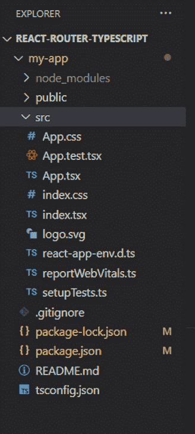
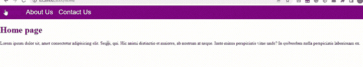
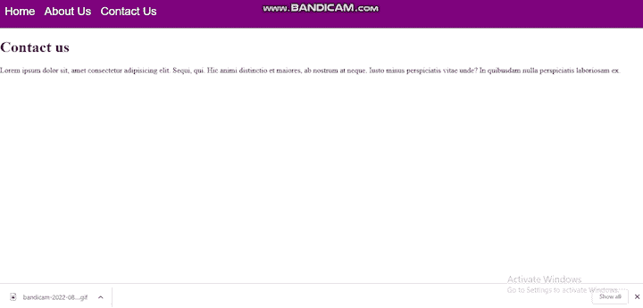

# 如何用 styled-components 设计 React 路由器链接

> 原文：<https://blog.logrocket.com/how-style-react-router-links-styled-components/>

CSS 是开发人员用来设计 web 应用程序并使其看起来漂亮的最常用工具之一。然而，在具有大量代码库的 web 应用程序中使用普通的 CSS 可能会非常耗时和费力。

应对这一挑战的一个有用的解决方案是名为 styled-components 的 CSS-in-JS 库。这个工具允许我们使用 JavaScript 而不是外部 CSS 文件以特定于组件的方式构建和管理我们的样式。

让我们看一个如何使用样式化组件的例子。在本例中，我们将使用 styled-components 和 TypeScript 来设计应用程序 navbar 中 React 路由器链接的样式。

以下是我们将要介绍的内容:

## 什么是样式组件？

styled-components 是一个 React 和 React 本地开发库。使用样式化组件，您可以在使用 CSS-in-JS 编写的应用程序中使用组件级样式。

像 styled-components 这样的 CSS-in-JS 库允许我们通过改变 CSS 样式应用于 React 组件的方式，以一种非常优雅和可重用的方式用 JavaScript 编写 CSS。

传统上，您会手动将 CSS 类分配给组件中的元素。相反，CSS-in-JS 库提供了基本的结构，用于将 CSS 样式的范围限定在组件的本地。这是使用不同的、自动生成的 CSS 类来完成的。

styled-components 基于标记的模板文字；在设计组件样式时，实际的 CSS 代码是在反斜线之间编写的。这允许开发人员从一个项目到下一个项目重用他们的 CSS 代码。

## 使用样式化组件的好处

在 React 应用中使用样式化组件有很多好处。通读下面的几个例子。

### 消除`className`错误

很难判断`className`是否在代码库中的其他地方使用过。这是因为每一个造型都与特定的组件相关联。

使用样式组件为你的样式提供了一个独一无二的`className`,并消除了与`className`重复、拼写错误和重叠相关的问题。

### 自动临界 CSS

使用 styled-components 可以帮助您跟踪页面上呈现的组件，并且只注入这些组件的样式。当与代码分割结合使用时，您的用户将加载尽可能少的代码。

### 简单的动态造型

无需手动管理几十个类，根据组件的道具或全局主题调整组件的样式就变得简单而直观。

### 更轻松的造型维护

通常，您必须搜索多个文件才能找到影响组件的样式。使用样式化组件，您可以通过`props`调用您想要的特定样式，而不是试图管理大量的`classNames`。

与传统的 CSS 不同，styled-components 还允许您对样式进行更改，而不会影响不相关的元素或 DOM 的行为。不管你的代码库有多大，样式化组件将保持你的样式。

### 将样式导入多个项目区域

当使用样式化组件时，无论您的代码库有多大，您都可以将您的样式导入到其他项目区域中。

虽然这在传统的 CSS 中也是可能的，但它会导致一个庞大的 CSS 代码库，这可能会变得非常混乱和难以导航。

## 为什么在 React 中使用 TypeScript？

TypeScript 是一种由微软创建和维护的免费开源编程语言。它是 JavaScript 的一个严格的[超集，增加了可选的静态类型](https://blog.logrocket.com/typescript-vs-flow-vs-proptypes/)和基于类的面向对象编程。

虽然您通常可以使用 JavaScript 为类似的任务编写代码，但是, [React 开发人员可以在几个方面从 TypeScript](https://blog.logrocket.com/using-typescript-with-react-tutorial-examples/) 中受益。

其中一个好处是，如果我们使用 TypeScript 来构建 React 应用程序，它们将更加可预测。TypeScript 可以在编译时将错误打印到终端，并且不允许代码编译，这使我们能够在运行时之前捕捉这些错误。

## 使用样式化组件来样式化 React 路由器链接

现在我们已经了解了我们将要使用的东西，让我们继续构建我们的项目。

### 我们项目的先决条件

为了跟进这个项目，我们应该对 React 有一个了解。我们还应该[知道 React 路由器如何工作](https://blog.logrocket.com/react-router-v6-future-reach-router/)。了解 TypeScript 更佳。

我还推荐使用样式化组件扩展，比如`[vscode-styled-components](https://github.com/styled-components/vscode-styled-components)`，但这是可选的。一个样式化组件扩展将使我们的编辑器能够识别我们的样式化组件 CSS，而不会将其视为行话。

### 创建 React 应用程序

为了创建我们的 React 应用程序，我们将打开终端并导航到我们希望安装项目的文件夹。运行以下代码:

```
 npx create-react-app my-app --template typescript

```

您可能会看到以下错误消息:

```
You are running create-react-app 4.0.3, which is behind the latest release (5.0.0). 
We no longer support global installation of Create React App

```

如果您看到这个错误消息，那是因为您是全局安装的。要解决这个问题，只需依次运行以下命令:

```
npm uninstall -g create-react-app
npx clear-npx-cache

```

现在您可以重新运行`create-react-app`代码了。如果您已经成功安装了 React with TypeScript 应用程序，您应该会看到如下结构:



到目前为止你和我在一起吗？我们继续吧。

### 删除我们的`src`文件夹中不需要的文件

接下来我们要做的是删除`src`文件夹中不需要的文件。这些文件包括`App.test.tsx`、`index.css`、`logo.svg`。

我们还想对我们的一些文件进行编辑。首先，删除`app.css`文件的内容，改为编写以下内容，以消除应用程序中的任何默认边距和填充:

```
.App {
  text-align: center;
}

body {
  margin: 0;
  padding: 0;
}

```

接下来，删除`App.tsx`的所有内容，除了我们导入 React 和导出 app 的地方。然后，添加以下内容以创建一个功能组件:

```
export interface AppProps {}

const App: React.FC<AppProps> = (props) => {
  return (
  <div></div>
  )
}

export default App;

```

最后，在我们的`index.js`中，去掉`import` `'./index.css`。

### 安装此项目所需的包

让我们继续安装我们将用于这个项目的包:`react-router-dom`和`styled-components`。首先，将目录更改为我们的应用程序:

```
cd my-app

```

接下来，让我们安装`react-router-dom`包和`styled components`包:

```
npm install react-router-dom
npm install styled-components

```

然后，您需要运行以下命令，以允许样式化组件使用 TypeScript:

```
npm install -D @types/styled-components

```

最后，让我们启动我们的应用程序:

```
npm start

```

我们已经做好了一切准备，让我们继续吧。

### 为 React 应用程序创建页面

在我们的`src`文件夹中，创建一个名为`pages`的文件夹。我们将为我们的链接创建四个页面来导航:`Home.tsx`、`About.tsx`、`Contact.tsx`和`Navbar.tsx`。

让我们从我们的主页、关于和联系人页面开始。我们还将创建一个功能组件，并在每个页面上添加一些虚拟文本。虚拟文本将用于`react-router`的导航目的。

您的`Home.tsx`文件的代码应该如下所示:

```
export interface HomePageProps {}

const HomePage: React.FC<HomePageProps> = props => {
    return (
        <div>
        <h1 >Home page</h1>
        <p>
          Lorem ipsum dolor sit, amet consectetur adipisicing elit. Sequi, qui.
          Hic animi distinctio et maiores, ab nostrum at neque. Iusto minus
          perspiciatis vitae unde? In quibusdam nulla perspiciatis laboriosam ex.
        </p>
      </div>
    )
}
export default HomePage

```

您的`Contact.tsx`文件的代码应该如下所示:

```
const ContactPage: React.FC=()=> {
    return (
        <div
        className="container text-center  bg-black"

      >
        <h1 className="heading">Contact us</h1>
        <p>
          Lorem ipsum dolor sit, amet consectetur adipisicing elit. Sequi, qui.
          Hic animi distinctio et maiores, ab nostrum at neque. Iusto minus
          perspiciatis vitae unde? In quibusdam nulla perspiciatis laboriosam ex.
        </p>
      </div>
    )
}
export default ContactPage

```

您的`About.tsx`文件的代码应该如下所示:

```
onst AboutPage: React.FC = () => {
    return (  
        <div className="container text-center">
        <h1>About Page</h1>
        <p>
          Lorem ipsum dolor sit amet consectetur adipisicing elit. Sint quasi
          debitis fuga deserunt, placeat qui optio totam perspiciatis error.
          Repudiandae, enim veniam. Dolorum officiis recusandae consequuntur
          veritatis magni aliquam itaque.
        </p>
      </div>
      )
}
export default AboutPage;

```

我们很快就会[创建我们的 React 导航条](https://blog.logrocket.com/creating-navbar-react/)。但是首先，让我们使用样式化组件为 navbar 创建样式化页面。

### 使用样式化组件添加和样式化导航栏链接

在我们的`src`文件夹中，创建一个名为`styles`的文件夹和一个名为`NavStyle`的文件。这个文件将包含 React 路由器链接的样式。在该文件中，复制并粘贴以下内容:

```
import {Link} from "react-router-dom";
import styled from "styled-components";

export const NavbarContainer= styled.nav
width: 100%;
height:50px;
background-color: purple;
display: flex;
flex-direction: column;
;

 export const NavbarLinkContainer = styled.div
     display: flex;

 export const NavbarLink = styled(Link)
 color:white;
 font-size: x-large;
 font-family: Arial, Helvetica, sans-serif;
 text-decoration: none;
 margin: 10px;
&:hover,
&:focus{
    color: blue;
}
&:active{
    color: red;
};

```

这个代码块完成了几件不同的事情。首先，我们从`styled-components`导入`styled`。我们还从`react-router-dom`导入了链接，让我们用样式化的组件来设计链接的样式。

它还包含一些基本的样式，比如将`display`设置为`flex`，将`color`设置为`white`，将`text-decoration`设置为无。我们将把这些样式分别导出到我们的导航栏中。

回到我们的`pages`文件夹，让我们创建名为`Navbar.tsx`的 navbar 文件，并将其粘贴到:

```
import React from "react";
import { Link } from "react-router-dom";
import {NavbarContainer,NavbarLinkContainer,NavbarLink} from '../styles/NavStyle';
export interface NavbarProps {}

const Navbar: React.FC<NavbarProps> = (props) => {
    return (
     <NavbarContainer>
        <NavbarLinkContainer>
            <NavbarLink className="nav-link active" to="/home">
              Home
            </NavbarLink>
            <NavbarLink className="nav-link" to="/about">
                About Us
            </NavbarLink>
            <NavbarLink className="nav-link" to="/contact">
                    Contact Us
            </NavbarLink>
            </NavbarLinkContainer>
        </NavbarContainer>
    )
}
export default Navbar;

```

你可能已经注意到我们在`react-router-dom`中使用了`NavbarLink`而不是链接组件。`NavbarLink`是相同的链接，但是已经应用了样式。这是因为在上一步中，我们导入了到我们的`NavStyle`文件的链接，并对它进行了一些样式化。

### 导入到`App.tsx`并声明我们的路线

既然我们已经添加并样式化了我们的链接，我们最后要做的事情就是将它们导入到我们的`App.tsx`并声明我们的路线。

首先，让我们将所有页面和路由包导入到我们的`App.tsx`文件中:

```
import { BrowserRouter, Routes,Route } from "react-router-dom"
import AboutPage from "./pages/About";
import HomePage from "./pages/Home";
import ContactPage from "./pages/Contact";
import Navbar from "./pages/Navbar"

```

接下来，让我们宣布我们的路线。在我们的`App.tsx`文件的`return()`中，删除我们之前写的`div`,并粘贴以下内容:

```
<BrowserRouter>
   <Navbar/>
   <Routes>
    <Route path='/' element={<HomePage/>}/>
    <Route path='home' element={<HomePage/>}/>
    <Route path='about' element={<AboutPage/>}/>
    <Route path='contact' element={<ContactPage/>}/>
   </Routes>
   </BrowserRouter>

```

### 添加悬停和聚焦效果

对于一些额外的样式，让我们添加一个悬停效果，一个焦点效果，还有一个活动效果。悬停、聚焦和活动选择器的代码被添加到我们的`Navstyle.tsx`文件中:

```
&:hover,
&:focus{
    color: blue;
};
&:active{
    color: red;
};

```

然后，我们将这段代码粘贴到我们的`NavbarLink`中；它应该是这样的:

```
 export const NavbarLink = styled(Link)`
 color:white;
 font-size: x-large;
 font-family: Arial, Helvetica, sans-serif;
 text-decoration: none;
 margin: 10px;
&:hover,
&:focus{
    color: blue;
};
&:active{
    color: red;
};
@media(max-width: 700px) {
        display: none;
}
 `

```

我们现在可以在浏览器中查看我们的结果:



你可以[在我的 GitHub 库](https://github.com/oyedeletemitope/stylesing-react-router-link-with-styled-components)中获得完整的代码。

让我们把我们的项目向前推进一步，在导航栏上添加一个汉堡菜单，使它更具响应性。

汉堡包菜单将是手机的默认视图，但我们的标准导航将仍然是桌面的默认视图。汉堡菜单比标准导航条占用更少的空间，从而使网页更整洁。

首先，我们将把所有的样式从我们的`Navstyle.tsx`导入到我们的`Navbar.tsx`中，这样我们就不用来回切换了。

```
import {NavbarContainer,NavbarLinkContainer,NavbarLink,ButtonLink,ExtendedNavbar,NavbarLinkExtended} from '../styles/NavStyle';

```

我们的下一个任务是制作一个名为`ButtonLink`的按钮，点击时显示一个扩展的菜单列表。`ButtonLink`替换所有的链接。将以下代码添加到我们的`Navstyle.tsx`文件中:

```
export const ButtonLink = styled("button")`
    width: 70px;
    height: 50px;
    background: none;
    border: none;
    color: white;
    font-size: 45px;
    cursor: pointer;
`

```

在这里，我们给`ButtonLink`一个 70px 的`width`，`height`50px，没有`background`，没有`border`，白色文本的`font``-``size`为 45px。我们还指定`cursor`应该是一个指针。

现在，让我们将刚刚创建的`ButtonLink`添加到我们的`Navbar.tsx`中，就在“联系我们”的`NavbarLink`关闭链接之后。

```
<ButtonLink>&#8801;</ButtonLink>

```

注意，我们将`ButtonLink`命名为 Unicode。Unicode 将代表我们的汉堡按钮。

接下来，让我们添加功能，这样当我们的屏幕变小时，链接就会消失，只显示我们的汉堡菜单。为此，让我们在我们的`Navstyles.tsx`中为我们的`ButtonLink`样式添加一个媒体查询:

```
 @media(min-width: 700px) {
        display: none;

```

我们试图通过媒体查询实现的是，每当屏幕宽度大于 700 像素时，汉堡菜单将不显示。

现在，让我们也添加一个媒体查询到我们的`NavbarLink`:

```
@media(max-width: 700px) {
        display: none;
}

```

这个媒体的质疑正好相反，说 navbar 链接不应该显示的是`max``-``width`是 700px。

接下来，我们要使汉堡包菜单起作用，这样当我们点击按钮时链接就会出现。为此，我们需要 React `usestate`、`useEffect`和`useLocation`钩子。我们将使用`useState`来表示按钮的状态，而`useEffec` t 和`useLocation`钩子将在状态改变时更新状态。

让我们导入挂钩:

```
import { useState, useEffect,} from "react";
import { useLocation } from "react-router-dom";

```

首先，让我们在我们的`us``eE``ffect`中设置我们的`useLocation`,以便每当我们的 URL 路径改变时更新我们的状态:

```
const location = useLocation();
  useEffect(() => {
    setExtendNavbar(false);
  }, [location]);

```

接下来，我们将创建一个名为`extendNavbar`的状态:

```
const [extendNavbar, setExtendNavbar] = useState(false)

```

这只是表示按钮的状态:

```
<ButtonLink onClick={()=>{
                    setExtendNavbar((curr)=>!curr);
                }}>{extendNavbar ? <>&#10005;</>: <>&#8801;</>}</ButtonLink>
<
```

我们正在做以下事情:

*   给我们的按钮一个`onC``lick`功能。这意味着每当我们点击一个按钮时，我们希望将我们的`extendNavbar`状态设置为与当前状态相反的状态。换句话说，如果它是打开的，我们设置它关闭，反之亦然
*   更新我们的`ButtonLink`代码。`onClick`事件表明，当我们的按钮状态改变时，Unicode 也会改变

接下来，我们想要改变我们的`NavbarContainer`的高度，以便在我们点击按钮时适合扩展的容器。我们可以通过向样式化组件添加道具来做到这一点，但是首先，我们需要定义我们的原型:

```
type NavbarProps= {
    extend:boolean;
}

```

然后，我们可以修改我们的`Navstyle.tsx`文件中的`NavbarContainer`:

```
export const NavbarContainer= styled("nav")<NavbarProps>`
width: 100%;
height:${(props)=>(props.extend? "100vh": "60px")};
background-color: purple;
display: flex;
flex-direction: column;

@media(min-width:700px){
    height: 60px;
}
`;

```

现在，让我们将我们的`navbarContainer`中的属性设置为等于`e``xtendNavbar`状态。

```
<NavbarContainer extend={extendNavbar}>

```

我们还想创建和样式我们的汉堡导航菜单，`ExtendedNavbar`，和我们的汉堡链接，`navbarlinkextended`。

对于`ExtendedNavbar`:

```
export const ExtendedNavbar = styled("div")`
    display: flex;
    flex-direction: column;
    align-items: center;
    @media (min-width:700px){
        display: none;
}
`

```

使用我们的`ExtendedNavbar`中的媒体查询，汉堡菜单不会显示，除非它的宽度小于 700 像素

对于`NavbarLinkextended`:

```
export const NavbarLinkExtended= styled(Link)`
  color:white;
  font-size: x-large;
  font-family: Arial, Helvetica, sans-serif;
  text-decoration: none;
  margin: 10px;
 &:hover,
&:focus{
    color: blue;
};
&:active{
    color: red;
};
  `

```

接下来，我们需要带来我们的`ExtendedNavbar`。我们还希望它包括我们的链接，并只在我们点击链接时显示。

为此，在`N``avb``a``rLinkContainer`结束标签后添加以下代码:

```
 {extendNavbar ? <>&#10005;</> : <>&#8801;</>}
        </ButtonLink>
      </NavbarLinkContainer>
      {extendNavbar && (
        <ExtendedNavbar>
          <NavbarLinkExtended className="nav-link active" to="/home">
            Home
          </NavbarLinkExtended>
          <NavbarLinkExtended className="nav-link" to="/about">
            About Us
          </NavbarLinkExtended>
          <NavbarLinkExtended className="nav-link" to="/contact">
            Contact Us
          </NavbarLinkExtended>
        </ExtendedNavbar>
      )}

```

我们在这里所做的是只在链接被点击时显示我们的`ExtendedNavbar`。因此，一旦我们点击切换按钮，我们的`ExtendedNavbar`就会显示；当我们再次点击它时，它就消失了。

我们完了！

如果您有问题，这里是`Navbar.tsx`文件的完整代码:

```
import React from "react";
import { useState, useEffect } from "react";
import { useLocation } from "react-router-dom";
import {
  NavbarContainer,
  NavbarLinkContainer,
  NavbarLink,
  ButtonLink,
  ExtendedNavbar,
  NavbarLinkExtended,
} from "../styles/NavStyle";
const Navbar: React.FC = () => {
  // ..
  const location = useLocation();
  useEffect(() => {
    setExtendNavbar(false);
  }, [location]);
  // ..
  const [extendNavbar, setExtendNavbar] = useState(false);
  return (
    <NavbarContainer extend={extendNavbar}>
      <NavbarLinkContainer>
        <NavbarLink className="nav-link active" to="/home">
          Home
        </NavbarLink>
        <NavbarLink className="nav-link" to="/about">
          About Us
        </NavbarLink>
        <NavbarLink className="nav-link" to="/contact">
          Contact Us
        </NavbarLink>
        <ButtonLink
          onClick={() => {
            setExtendNavbar((curr) => !curr);
          }}
        >
          {extendNavbar ? <>&#10005;</> : <>&#8801;</>}
        </ButtonLink>
      </NavbarLinkContainer>
      {extendNavbar && (
        <ExtendedNavbar>
          <NavbarLinkExtended className="nav-link active" to="/home">
            Home
          </NavbarLinkExtended>
          <NavbarLinkExtended className="nav-link" to="/about">
            About Us
          </NavbarLinkExtended>
          <NavbarLinkExtended className="nav-link" to="/contact">
            Contact Us
          </NavbarLinkExtended>
        </ExtendedNavbar>
      )}
    </NavbarContainer>
  );
};
export default Navbar;

```

这里是`Navstyle.tsx`文件的完整代码:

```
import { Link } from "react-router-dom";
import styled from "styled-components";
type NavbarProps = {
  extend: boolean;
};
export const NavbarContainer = styled("nav")<NavbarProps>`
  width: 100%;
  height: ${(props) => (props.extend ? "100vh" : "60px")};
  background-color: purple;
  display: flex;
  flex-direction: column;
  @media (min-width: 700px) {
    height: 60px;
  }
`;
export const NavbarLinkContainer = styled("div")`
  display: flex;
`;
export const NavbarLink = styled(Link)`
  color: white;
  font-size: x-large;
  font-family: Arial, Helvetica, sans-serif;
  text-decoration: none;
  margin: 10px;
  &:hover,
  &:focus {
    color: blue;
  }
  &:active {
    color: red;
  }
  @media (max-width: 700px) {
    display: none;
  }
`;
export const NavbarLinkExtended = styled(Link)`
  color: white;
  font-size: x-large;
  font-family: Arial, Helvetica, sans-serif;
  text-decoration: none;
  margin: 10px;
  &:hover,
  &:focus {
    color: blue;
  }
  &:active {
    color: red;
  }
`;
export const ButtonLink = styled("button")`
  width: 70px;
  height: 50px;
  background: none;
  border: none;
  color: white;
  font-size: 45px;
  cursor: pointer;
  @media (min-width: 700px) {
    display: none;
  }
`;
export const ExtendedNavbar = styled("div")`
  display: flex;
  flex-direction: column;
  align-items: center;
  @media (min-width: 700px) {
    display: none;
  }
`;

```

### 成品

让我们在浏览器中查看最终结果:



你可以在我的 GitHub 库中获得这个全响应导航条的[代码。](https://github.com/oyedeletemitope/React-Router-styling-with-styled-components)

## 结论

让我们回顾一下我们讨论的内容。

我们介绍了样式化组件，并讨论了使用这个库的好处。我们还研究了为什么将 TypeScript 与 React 一起使用会给我们带来优势。我们使用我们对 styled-components 和 TypeScript 的[知识来设计 React 路由器链接，我们还通过为移动视图创建一个汉堡菜单来使 navbar 具有响应性。](https://blog.logrocket.com/using-styled-components-in-typescript-a-tutorial-with-examples/)

那很有趣！如果你觉得这有帮助，请分享！

## 使用 [LogRocket](https://lp.logrocket.com/blg/signup) 消除传统错误报告的干扰

[](https://lp.logrocket.com/blg/signup)

[LogRocket](https://lp.logrocket.com/blg/signup) 是一个数字体验分析解决方案，它可以保护您免受数百个假阳性错误警报的影响，只针对几个真正重要的项目。LogRocket 会告诉您应用程序中实际影响用户的最具影响力的 bug 和 UX 问题。

然后，使用具有深层技术遥测的会话重放来确切地查看用户看到了什么以及是什么导致了问题，就像你在他们身后看一样。

LogRocket 自动聚合客户端错误、JS 异常、前端性能指标和用户交互。然后 LogRocket 使用机器学习来告诉你哪些问题正在影响大多数用户，并提供你需要修复它的上下文。

关注重要的 bug—[今天就试试 LogRocket】。](https://lp.logrocket.com/blg/signup-issue-free)