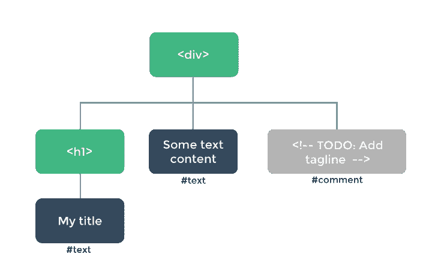

# 虚拟 DOM 如何在 Vue.js - LogRocket 博客中工作

> 原文：<https://blog.logrocket.com/how-the-virtual-dom-works-in-vue-js/>

## 介绍

Vue.js 是一个 JavaScript 框架，以其快速的加载速度和易于扩展而闻名。它的一些特性可以直接联系到它使用虚拟 DOM 来更新实际的 DOM。

理解虚拟 DOM 并不是学习 Vue.js 的要求，但它肯定可以帮助初学 Vue 的开发人员开始理解幕后发生的一些事情。

## 大教堂本身

```
<!DOCTYPE html>
<html>
<head>
<title>Page Title</title>
</head>
<body>
<h1>This is a Heading</h1>
<p>This is a paragraph.</p>
</body>
</html>

```

在我们讨论 Vue.js 虚拟 DOM 之前，理解 DOM 本身是什么很重要。文档对象模型(DOM)是一种将所有标记语言(您的 HTML)视为连接节点的接口。它可以被视为存储在树状结构中的标记元素的对象接口。

DOM 允许我们编写和改变元素的样式，甚至改变元素本身。这是通过在文档的头和主体中添加、修改或删除元素标记或 CSS 样式来实现的，因为它们被表示为节点和对象。这就是 HTML DOM 的工作方式——那么为什么 Vue 会有另一个 DOM 呢？



### 为什么传统的 DOM 是不够的

所以 DOM 一切都很好。然而，随着应用程序的增长——这意味着要遍历更多的节点、更多的元素以及更多的与这些元素通信的脚本 DOM 增长得更慢，并且消耗了大量的处理能力。

尝试执行搜索甚至更新 DOM 变得很困难，最终会影响应用程序的性能。这就是创建虚拟 DOM 的原因。

## Vue.js 虚拟 DOM

Vue.js 团队构建了虚拟 DOM，作为传统 DOM 的一种抽象；这是一个 HTML DOM 的“精简”版本，但是拥有超能力。虚拟 DOM 更智能，因此它找到了比传统 DOM 更高效的方法。

实现这一点的主要方法是通过各种 diff 算法来避免在对文档进行任何新的更改或更新后重新呈现整个 DOM。仅仅这一点就在很大程度上提高了效率和资源管理，因为 DOM API 被调用的频率降低了。

根据解释，虚拟 DOM 位于实际 DOM 和 Vue 实例之间。

```
new Vue({
 el: '#app',
 data: {
   text: 'hi LogRocket'
 },
 render(createElement) {
   return createElement(
    'h1',
    { attrs: { id: 'headers' } },
  this.text
  );
 }
});

```

这会在渲染时返回以下元素:

```
<div id=’app’>
 <h1 id=’headers’>hi LogRocket</h1>
</div>

```

你看到 Vue 虚拟 DOM 是由 Vue 组件组成的，这些组件是扩展 Vue 实例的 JavaScript 对象。Vue 之所以使用虚拟 DOM，是因为与实际的 DOM 相比，虚拟 DOM 在速度和效率上有着天壤之别。虚拟 DOM 的大小也比实际的 DOM 小，因此非常高效。

### 它是如何工作的

让我们使用一个包含条件语句的表单来展示虚拟 DOM 是如何工作的:

```
<form>
 <div>
 <div class=”form-group” :class=”{‘form-group — error’: $v.name.$error }”>
 <label class=”form__label”>Full Name</label>
 <input class=”form__input” v-model.trim=”$v.name.$model”/>
 </div>
  <span class=”error” v-if=”!$v.name.required”>Field is required</span>
 </div>
</form>

```

注意上面的代码块有一个`span`和一个`v-if`语句，当没有输入名字时，显示一个`error`类。在这段代码中，如果您没有在指示“字段是必需的”的框中键入名称，则会出现一条小横线如果`v-if`条件返回`true`，虚拟 DOM 中的变化将是有条件地添加这个`span`元素。

在读取这一行之前，实际的 DOM 和虚拟的 DOM 将读取相同的内容；满足这个条件后，现在在两种状态之间进行比较(在实际 DOM 和虚拟 DOM 中)，这个比较将输出一个修改补丁，这些修改将应用于实际 DOM，而无需重新呈现它。通过这种方式，两个 DOM 立即恢复原样。

### 如何将虚拟 DOM 挂载到 HTML 元素中

您可能没有注意到，但是每当您为新项目运行 Vue.js 命令时，比如 hello world:

```
vue create hello-world

```

您会看到，默认情况下，您已经在使用 Vue 的虚拟 DOM 你可以在查看`main.js`文件时确认这一点。它应该类似于下面的代码块:

```
import Vue from 'vue'
import App from './App'

new Vue({
  el: '#app',
  components: { App }
});

```

你可以看到这里的元素是任何 ID 为`App`的元素，通常是`App.vue`文件中的`App`组件。在任何组件中，您都可以通过使用`el`选项来明确地定位您选择的元素，并且它会被挂载到 HTML DOM 中。

## 一些教训

看到 Vue.js 中的虚拟 DOM 在幕后发生的事情令人耳目一新。同样重要的是要认识到，我们编写的任何代码都是由虚拟 DOM 解析的，而我们的模板部分中的指令甚至事件并不会以这种方式在实际的 DOM 中结束。

Vue 利用它们，处理它们，创建的补丁就是实际的 DOM。您可以在浏览器中轻松检查您的应用程序，以确认您不会看到任何指令。

## 结论

这篇文章概述了虚拟 DOM 在 Vue.js 中是如何工作的，并附有一些插图以及如何挂载它。我希望在读完这篇文章后，你能欣赏你每天创建 Vue 项目时所使用的东西背后的概念。黑客快乐！

## 像用户一样体验您的 Vue 应用

调试 Vue.js 应用程序可能会很困难，尤其是当用户会话期间有几十个(如果不是几百个)突变时。如果您对监视和跟踪生产中所有用户的 Vue 突变感兴趣，

[try LogRocket](https://lp.logrocket.com/blg/vue-signup)

.

[](https://lp.logrocket.com/blg/vue-signup)[https://logrocket.com/signup/](https://lp.logrocket.com/blg/vue-signup)

LogRocket 就像是网络和移动应用程序的 DVR，记录你的 Vue 应用程序中发生的一切，包括网络请求、JavaScript 错误、性能问题等等。您可以汇总并报告问题发生时应用程序的状态，而不是猜测问题发生的原因。

LogRocket Vuex 插件将 Vuex 突变记录到 LogRocket 控制台，为您提供导致错误的环境，以及出现问题时应用程序的状态。

现代化您调试 Vue 应用的方式- [开始免费监控](https://lp.logrocket.com/blg/vue-signup)。