# 如何用 Nginx 加速 web 应用部署

> 原文：<https://blog.logrocket.com/how-to-accelerate-web-app-deployment-nginx/>

Web 服务器在 web 应用程序的功能中起着关键作用，控制着对用户请求的响应速度。

[Nginx](https://www.nginx.com/) 是一个稳定、高性能的 web 服务器，主要用于[负载均衡](https://docs.nginx.com/nginx/admin-guide/load-balancer/http-load-balancer/)、[反向代理](https://docs.nginx.com/nginx/admin-guide/web-server/reverse-proxy/)和[缓存](https://docs.nginx.com/nginx/admin-guide/content-cache/content-caching/)。可以配置为[邮件代理服务器](https://docs.nginx.com/nginx/admin-guide/mail-proxy/mail-proxy/)和 [HTTP 服务器](https://www.nginx.com/resources/wiki/)。它有一个[非线程和事件驱动的](https://www.nginx.com/blog/inside-nginx-how-we-designed-for-performance-scale/)架构，这意味着它使用异步和非阻塞模型。简单来说，Nginx web 服务器显著减少了 web 应用的页面加载时间。

在本文中，我们将比较两种流行的 web 服务器的特性、优势和效率:Nginx 和 [Apache](https://www.apache.org) 。我们还将研究 Nginx 的结构，以及如何使用它来加速 Node.js 应用程序的部署。对于开发人员来说，手动将 web 应用程序的实例部署到服务器上可能是单调且耗时的。Nginx 通过自动化许多通常手动处理的应用程序开发任务来加速 web 应用程序的部署。

事不宜迟，我们开始吧。

## 先决条件

要遵循本教程，请确保您具备以下条件:

> **注意，**本教程使用了 Ubuntu 20.04 操作系统和 Node.js v10.19.0

## Nginx 架构概述

许多 web 服务器依赖于单线程机制。这有一些缺点，其中之一是在处理 CPU 密集型应用程序方面的不足。当多个线程在一个单线程机制的进程中运行时，每个代码或指令将被单独和顺序地处理。线程会消耗大量内存，因此以这种方式处理它们必然会导致应用程序性能下降和页面加载时间增加。

然而，Nginx 使用非线程的、事件驱动的架构，这使得它能够并发和异步地处理多个请求。Nginx 使用一个主进程来读取和验证配置，以及绑定端口。主进程产生子进程，如缓存加载器进程、缓存管理器进程和工作进程。

另一方面，工作进程以非阻塞方式处理传入的请求，并且可以通过在指令上设置一个`auto`参数来轻松配置，如下所示:

```
worker_processes auto;

```

下图说明了 Nginx 主进程和几个工作进程以及用户请求和响应:

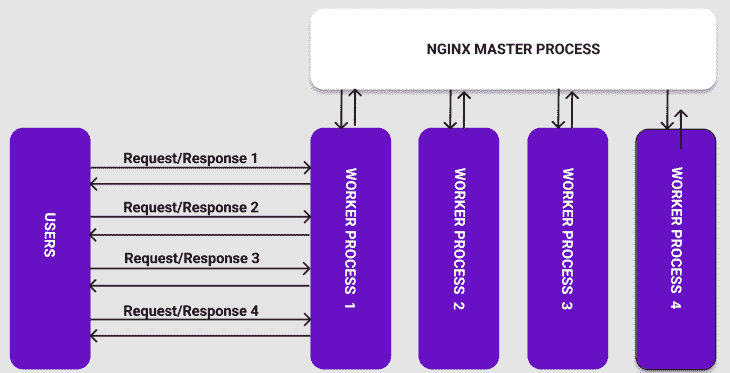

主进程负责启动和维护工作进程的数量。通过工作进程，Nginx 可以处理成千上万的网络连接或请求。

## Nginx 比 Apache 好吗？

根据 W3 Techs 最近的全球调查，33.0%的网站使用 Nginx，而 31.1%的网站使用 Apache。尽管这两种 web 服务器都非常流行，但它们有一些影响其功能和性能的关键差异。

在确定 Nginx 或 Apache 是否适合您的网站时，需要记住两个考虑因素:客户端请求和静态内容服务。

### 客户请求

Apache 使用位于其配置文件中的内置[多处理模块](https://httpd.apache.org/docs/2.4/mpm.html) (prefork 和 worker MPMs)来处理客户端请求。有了这些模块，每个线程和进程一次处理一个连接或请求。对于流量较少或并发请求数量较少的应用程序，Apache 通常是一个不错的选择。

Nginx 使用其事件驱动的异步非阻塞工作进程来处理客户端请求，该进程可以同时处理数千个连接或请求。Nginx 可能是高流量应用程序或一次收到大量请求的应用程序的好选择。

### 静态内容服务

Nginx 能够比 Apache 更快地提供静态内容(T2 ),因为它的反向代理(T4)特性。为了用 Apache 提供静态内容，您必须向它的`http.conf`文件和您的项目目录添加一个简单的配置。

既然我们已经回顾了 Nginx 和 Apache 之间的一些关键差异，那么让我们继续进行动手演示，学习如何使用 Nginx 自动部署 web 应用程序。

## 动手演示:使用 Nginx 加速应用部署

为了用 Nginx web 服务器部署我们的应用程序，我们将首先在`[/etc/Nginx/Nginx.conf](https://www.nginx.com/resources/wiki/start/topics/examples/full/)`文件中进行一些配置。

配置文件由几个[上下文](https://docs.nginx.com/nginx/admin-guide/basic-functionality/managing-configuration-files/#contexts)组成，用于定义处理客户端请求的指令:

*   主上下文
*   事件上下文
*   HTTP 上下文
*   服务器上下文
*   位置上下文
*   上游环境
*   邮件上下文

## 入门指南

让我们从安装 Nginx 开始:

首先，在终端中，更新包存储库:

```
sudo apt-get update

```

接下来，通过运行以下命令安装 Nginx:

```
sudo apt-get install Nginx

```

运行这段代码后，系统会提示您一个问题，询问您是否要继续。通过键入`Y`并按下`Enter`进行确认。

现在，您应该会在屏幕上看到以下内容:

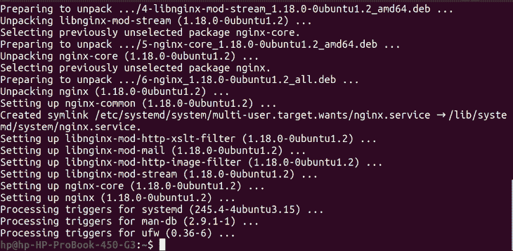

安装完成后，下一步是启用防火墙:

```
sudo ufw enable

```

运行以上命令后，您应该会看到以下激活消息:


要确认安装成功，请运行以下命令:

```
Nginx -v

```

这将使您登录到我们刚刚安装的 Nginx 版本:


要查看防火墙上可用的应用程序列表，请运行以下命令:

```
sudo ufw app list

```

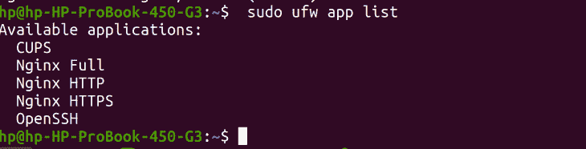

注意屏幕上记录的`Nginx Full`、`Nginx HTTP`、`Nginx HTTPS`。这意味着端口 80 和端口 443 都已添加。

`Nginx HTTP`打开端口 80，这是 Nginx 监听的默认端口。`Nginx HTTPS`打开端口 443，用于转移网络流量和保护连接。`Nginx Full`将允许两个港口。

现在，使用以下命令启用两个端口:

```
sudo ufw allow 'Nginx Full'

```

接下来，运行类似的命令来允许 HTTP 和 HTTPS:

```
sudo ufw allow 'Nginx HTTP'
```

```
sudo ufw allow 'Nginx HTTPS'

```

您会注意到为`Nginx Full`和`Nginx HTTP`添加了`allow`规则:

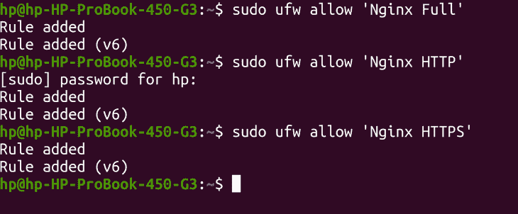

使用以下命令检查状态并确认`Nginx Full`、`Nginx HTTP`和`Nginx HTTPS`都已被允许:

```
sudo ufw status

```

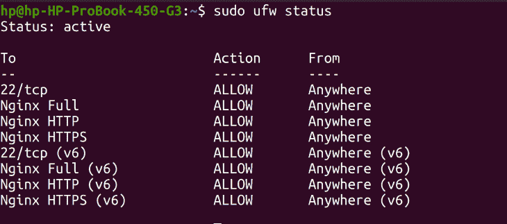

您还可以使用以下命令检查 Nginx 服务器的状态:

```
sudo systemctl status Nginx

```

运行这段代码后，您应该会看到`Nginx.service`以`active`状态运行。你还可以看到`master process`号、`process ID`号和`main PID`号正在运行:

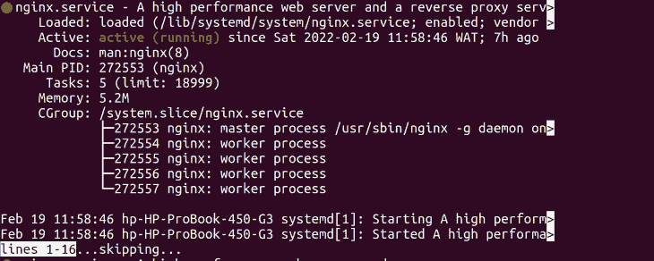

这证实了您的 Nginx 服务器正在成功运行。

对于本教程，您将使用一个简单的 [Node.js 应用程序](https://github.com/debemenitammy/Log_Node_App)。

首先，从 GitHub 克隆应用程序:

```
git clone https://github.com/debemenitammy/Log_Node_App.git

```

接下来，安装依赖项:

```
npm install

```

现在，在您选择的代码编辑器中打开应用程序。在应用程序的目录中运行以下命令:

```
nodemon app.js

```

应用程序在`port 3000`运行，如终端窗口所示:

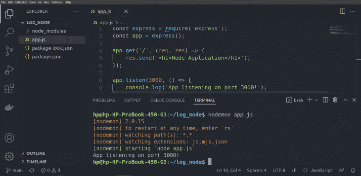

现在，您有了一个本地运行的应用程序。在继续之前，确保您已经在操作系统中设置了一个 [OpenSSH](https://www.openssh.com/) 服务器和 [ssh 密钥](https://www.ssh.com/academy/ssh/key)。此外，请准备好您的域名和主机，因为您将在教程中使用它。

## 配置 Nginx 将域名指向服务器

在这一步中，您将添加更多配置来将您的域名指向服务器。首先，你需要在你的主机提供商 [DNS](https://g.co/kgs/D9wBJd) 中创建一个记录。然后，您需要使用安全 shell 协议和您的服务器的 IP 地址通过以下命令登录到您的服务器:

```
ssh [email protected]<your_ip_address>

```

运行此代码后，您将登录:

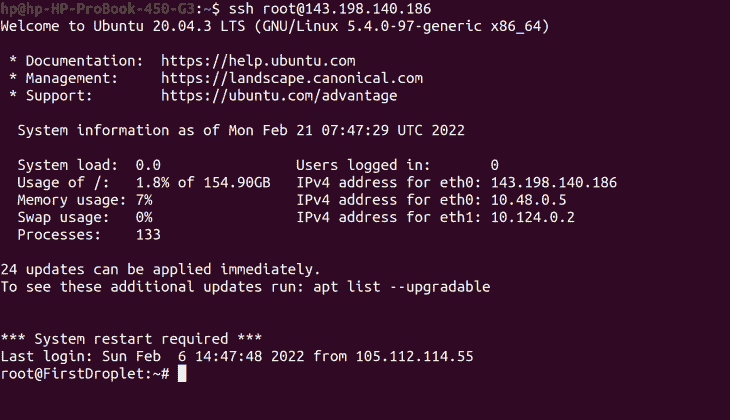

更新软件包存储库，并在服务器上安装节点和 npm:

```
sudo apt update
curl -sL https://deb.nodesource.com/setup_16.x -o nodesource_setup.sh
sudo apt install nodejs
sudo apt install npm

```

接下来，确认安装成功:

```
node -version
npm -version

```

现在，通过创建一个保存应用程序的目录，将应用程序添加到服务器。在提示符下，创建目录`test`和`cd`，如下所示:


接下来，用以下命令从 GitHub 克隆应用程序:

```
git clone https://github.com/debemenitammy/Log_Node_App.git

```

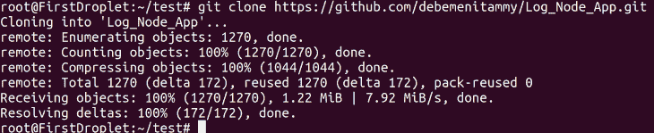

此时，应用程序已经成功地克隆到服务器上，但是仍然需要添加依赖项和节点模块。要将依赖项`cd`安装到应用程序`Log_Node_App`中，如下所示:

```
cd Log_Node_App
npm install

```

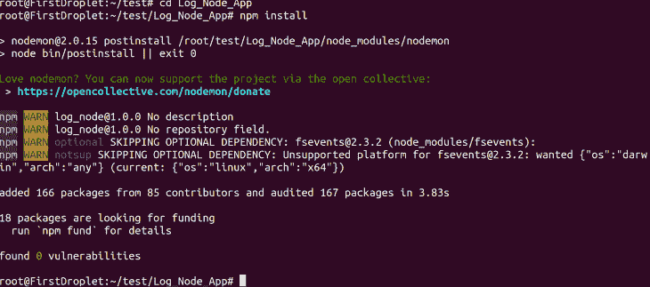

现在，运行应用程序:

```
node app.js

```

您会注意到应用程序正在`port 3000`上运行:


在浏览器中，导航到以下 URL: `<your_ip_address>:3000`，用服务器的 IP 地址替换占位符。

您的浏览器应该显示该应用程序:

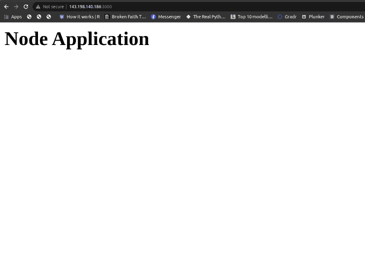

使用`Control+C`结束应用程序。

如果您希望您的应用程序在后台运行，您可以安装生产流程管理器(PM2):

```
npm install -g pm2

```

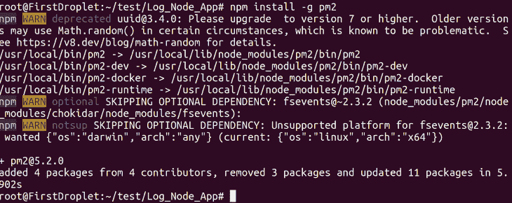

安装 PM2 后，使用以下命令开始在后台运行应用程序:

```
pm2 start app.js

```

您应该会看到以下带有`online`状态的显示，表明应用程序已经开始在后台运行:

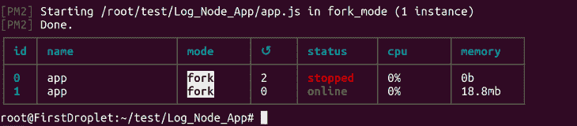

要确认应用程序正在运行，请使用以下 URL 刷新您的浏览器:`<your_ip_address>:3000`。

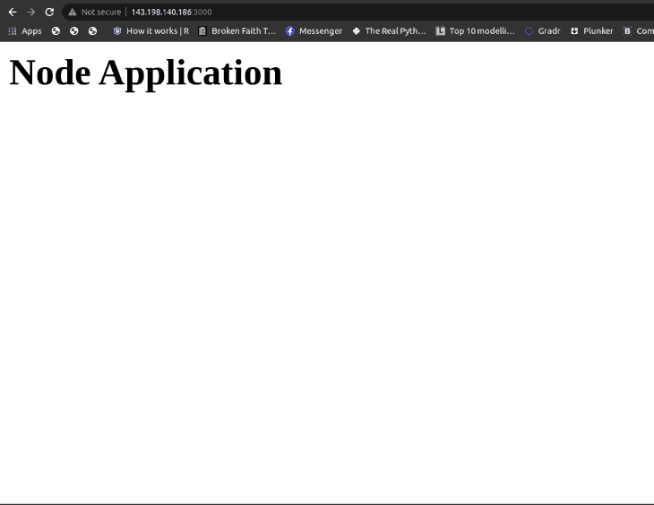

每当您想检查与 PM2 一起运行的应用程序的状态时，请使用以下命令:

```
pm2 status

```

该命令的输出与之前使用的`pm2 start app.js`命令的输出相同。注意绿色的`online`状态:

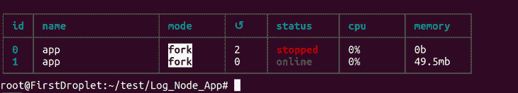

要确保应用程序在任何重新启动时都能运行，请使用以下命令:

```
pm2 startup ubuntu

```

该命令将以下内容记录到终端:

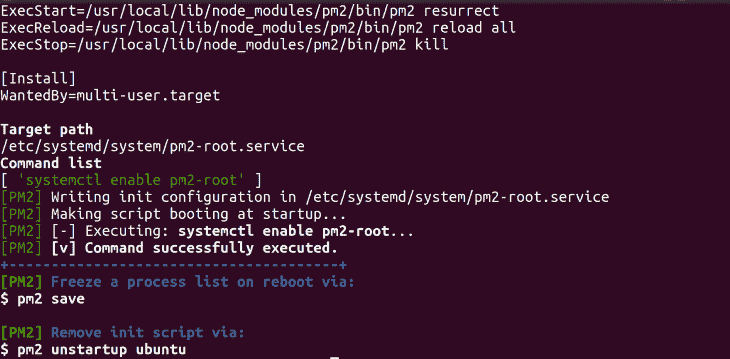

使用以下代码启用防火墙并允许`ssh`:

```
ufw enable
ufw allows ssh

```

现在，确认防火墙已经启用:

```
ufw status

```

接下来，您需要设置您的应用程序在`port 80`上运行，这是 HTTP 端口，也是 Nginx 的默认端口。运行以下命令:

```
ufw allow http

```


要允许应用程序也在 HTTPS 上运行，请使用以下命令:

```
ufw allow https

```


现在，查看允许的端口:

```
ufw status

```

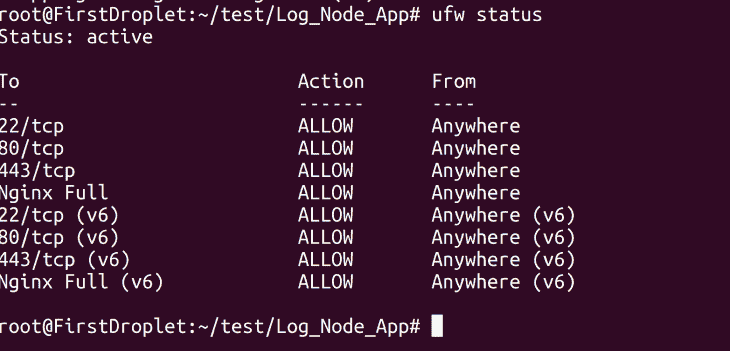

端口 443 和端口 80 已被成功允许。接下来，您将把 Nginx 设置为一个反向代理服务器，以便让运行在端口 3000 上的应用程序运行在端口 80 上。

## 将 Nginx 配置为应用程序的反向代理

使用 Nginx，您可以通过运行服务器的 IP 地址来访问您的应用程序。

此时，您已经安装了 Nginx，并且可以访问位于`/etc/Nginx/sites-available/default`的默认配置文件。

要编辑此配置文件，请运行以下命令:

```
sudo nano /etc/Nginx/sites-available/default

```

运行此代码后，文件将以默认配置打开:

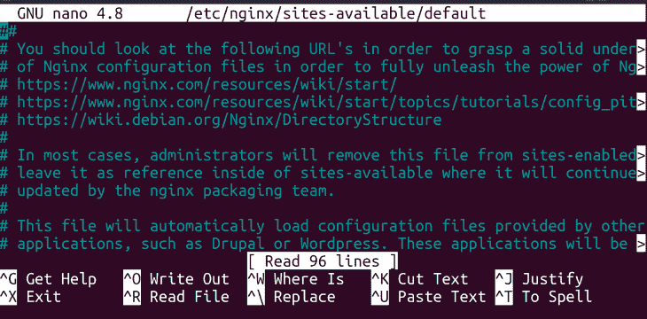

接下来，滚动配置文件，越过`server`块，直到到达`location`块:

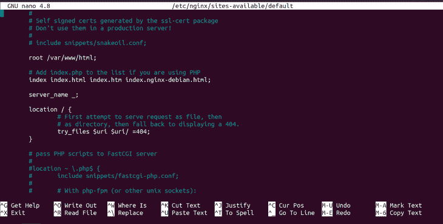

在`location`块中，添加以下配置:

```
proxy_pass http://localhost:3000; 
proxy_http_version 1.1;
proxy_set_header Upgrade $http_upgrade;
proxy_set_header Connection 'upgrade';
proxy_set_header Host $host;
proxy_cache_bypass $http_upgrade;

```

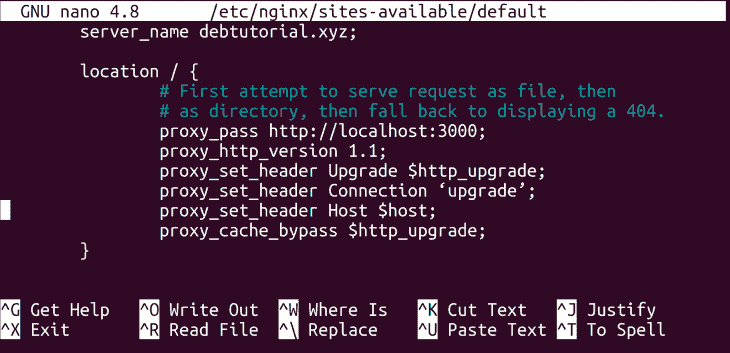

这些配置表明您正在将 Nginx 设置为反向代理，以确保当访问端口 80 时，它将加载在端口 3000 上运行的应用程序。

现在，将您的域名添加到`server_name`中，设置 Nginx 应该在您的端口设置旁边查找什么。如果您希望 Nginx 使用空名称作为服务器名称，那么您可以将`server_name`保留为默认名称。

在`server`块中，添加您的域名，如下所示:

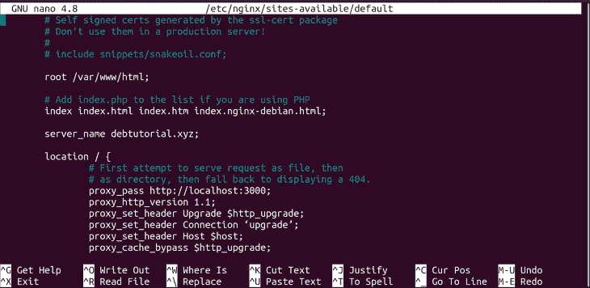

要保存对 Nginx 配置文件所做的更改，使用 **CTR + X** 命令，并在提示符下键入 **yes** 。接下来，当出现提示时，按 enter 键保存配置文件:

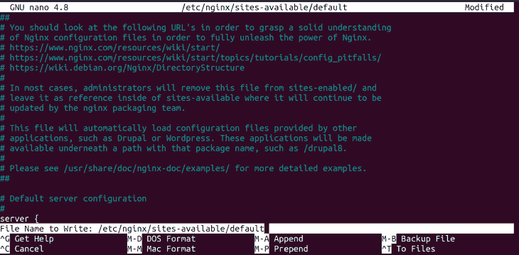

每当您向 Nginx 添加配置时，建议运行以下命令来检查配置是否成功:

```
sudo Nginx -t

```

该命令的输出表明配置文件测试成功:

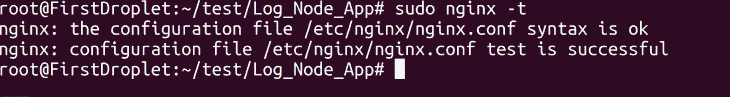

现在，您可以重新启动服务以应用您对配置所做的更改。然后，Nginx 将关闭以前的工作进程，并启动新的工作进程。

使用以下命令重新启动服务:

```
sudo service Nginx restart

```

该命令不会将任何输出记录到终端。

现在 Nginx 服务已经重新启动，您可以检查添加到 Nginx 的所有配置是否都成功工作。在浏览器中添加服务器的 IP 地址，如下所示:

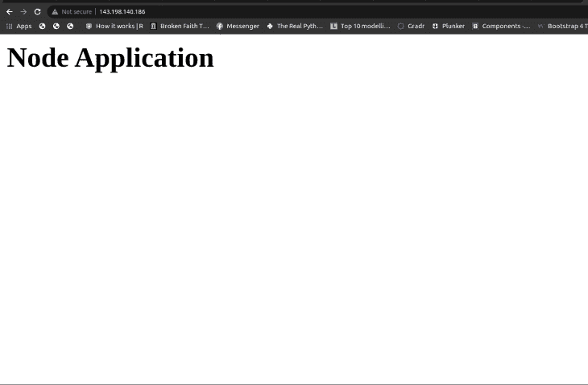

从上面的浏览器窗口截图中，您可以看到应用程序正在服务器的 IP 地址上运行。

您已经成功设置了 Nginx 来部署您的应用程序！

## 结论

在本教程中，我们演示了如何使用 Nginx 在 DevOps 中加速 Node.js 应用程序的部署。我们还回顾了 Nginx 和 Apache 之间的一些关键差异，并讨论了如何确定哪种 web 服务器最适合给定的应用程序。

我们讲述了如何将域名指向服务器的 IP 地址，以及如何将 Nginx 设置为反向代理服务器，在服务器的 IP 地址上呈现应用程序。

既然您已经看到了 Nginx 如何自动完成许多通常由开发人员处理的任务，那么请尝试用 Nginx 配置您自己的应用程序。编码快乐！

## 使用 [LogRocket](https://lp.logrocket.com/blg/signup) 消除传统错误报告的干扰

[](https://lp.logrocket.com/blg/signup)

[LogRocket](https://lp.logrocket.com/blg/signup) 是一个数字体验分析解决方案，它可以保护您免受数百个假阳性错误警报的影响，只针对几个真正重要的项目。LogRocket 会告诉您应用程序中实际影响用户的最具影响力的 bug 和 UX 问题。

然后，使用具有深层技术遥测的会话重放来确切地查看用户看到了什么以及是什么导致了问题，就像你在他们身后看一样。

LogRocket 自动聚合客户端错误、JS 异常、前端性能指标和用户交互。然后 LogRocket 使用机器学习来告诉你哪些问题正在影响大多数用户，并提供你需要修复它的上下文。

关注重要的 bug—[今天就试试 LogRocket】。](https://lp.logrocket.com/blg/signup-issue-free)