# 如何在 Ubuntu 18.04 上使用 GitLab CI/CD 自动部署 Vue 应用程序

> 原文：<https://blog.logrocket.com/how-to-auto-deploy-a-vue-application-using-gitlab-ci-cd-on-ubuntu/>

## 先决条件

*   命令行的基本知识
*   码头工人的基本知识
*   版本控制的基础知识
*   安装在您本地机器上的节点的最新版本

## 在本地机器上安装 Vue

首先，您将安装`vue-cli`。它是一个命令行工具，使您能够快速构建新的 Vue 应用程序。运行以下命令在本地机器上安装`vue-cli`:

```
npm install -g @vue/cli
```

这将获取运行`vue-cli`所需的所有依赖项，您可以通过运行以下命令来验证其安装:

```
vue
```

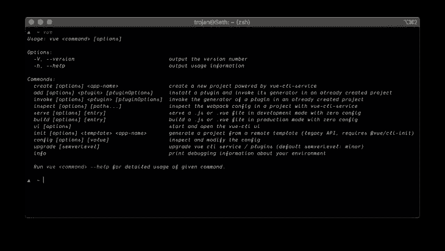

## 创建 Vue 应用程序

在这一步，您将使用`vue-cli` create 命令创建一个新的应用程序，这将帮助我们用必要的插件搭建我们的应用程序。运行以下命令创建一个新的 Vue 应用程序:

```
vue create vue-demo
```

系统将提示您选择一个预设，保留默认预设，然后按 enter 键继续。

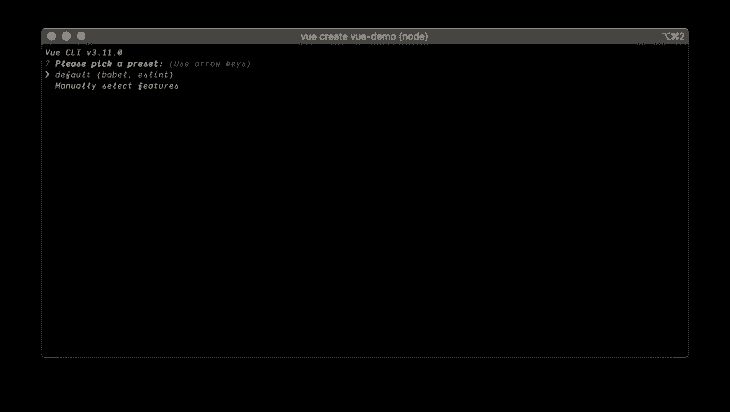

完成后，将目录切换到由`vue-cli`创建的`vue-demo`文件夹，并运行:

```
npm run serve
```

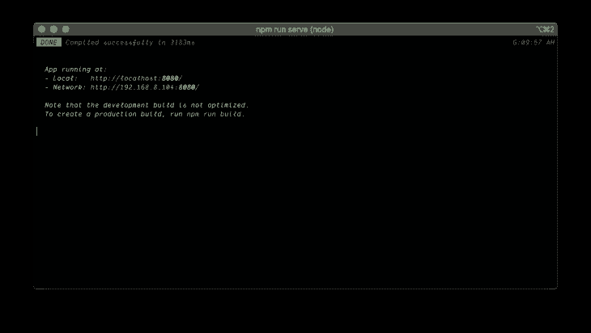

这将使您的 Vue 应用程序可以通过端口 8080 在本地主机上访问。请访问 [http://localhost:8080](http://localhost:8080) 查看您的申请。

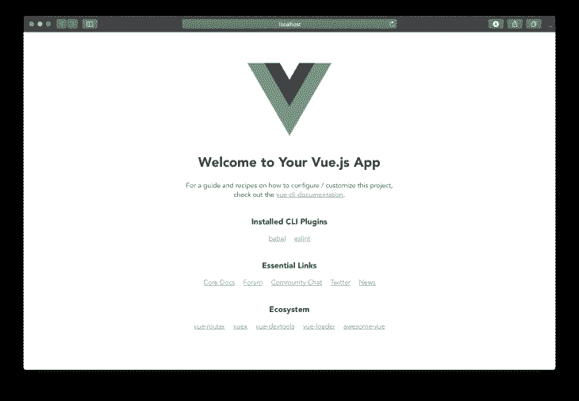

## Set up GitLab

现在，您将把您的 Vue 应用程序推送到 GitLab 存储库中。前往 [GitLab 的网站](https://gitlab.com)并登录您的帐户，或者创建一个帐户(如果您还没有)。

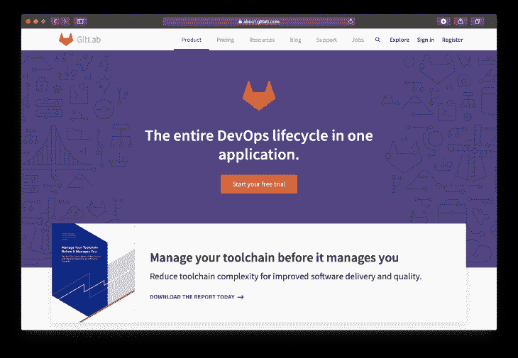

接下来，创建一个新项目。在 GitLab 仪表板的右上角，您会看到一个带有文本`New project`的绿色按钮。点击它。

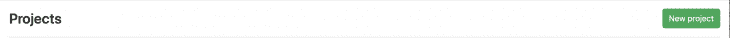

一个新的屏幕将会出现，要求你给这个项目起一个名字。将项目命名为`vue-demo`，您可以将项目描述留空，它可以是公共的或私有的存储库。不要勾选最后一个复选框。

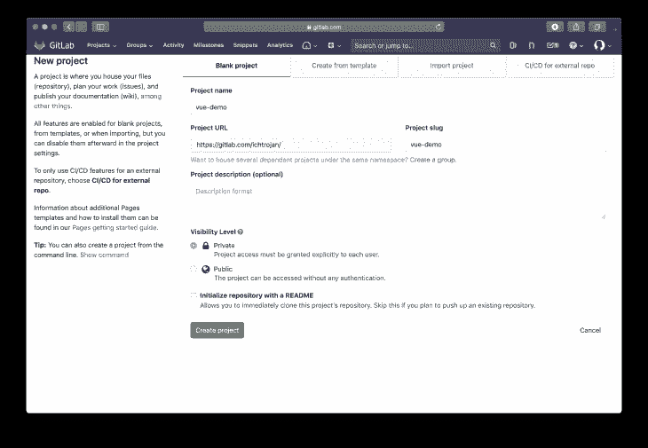

您需要在本地将您的`vue-demo`应用程序与远程存储库相关联。为此，请转到终端，确保您位于应用程序的目录中，并运行以下命令:

```
git init
git remote add origin [email protected]:<your-gitlab-username>/vue-demo.git
git add .
git commit -m "Initial commit"
git push -u origin master
```

> **注意**:用你实际的 GitLab 用户名替换`<your-gitlab-username>`。

如果您以前配置过密码，系统会提示您输入 GitLab 密码或通过 SSH 进行验证。完成后，访问 Gitlab 上的`vue-demo`项目仪表板，你所有的源文件应该都在。

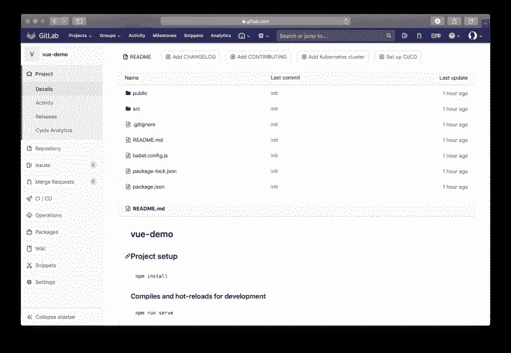

## 配置管道

在这一步中，我们将使用 Docker 和 GitLab CI 配置我们的管道。使用您喜欢的文本编辑器或 IDE，创建一个名为`Dockerfile`的新文件，不带任何扩展名，并粘贴以下内容:

```
FROM node:lts-alpine as build-stage
WORKDIR /app
COPY package*.json ./
RUN npm install
COPY . .
RUN npm run build

# production stage
FROM nginx:stable-alpine as production-stage
COPY --from=build-stage /app/dist /usr/share/nginx/html
EXPOSE 80
CMD ["nginx", "-g", "daemon off;"]
```

这个 Docker 配置提取节点 alpine 映像，该映像将用于构建我们的生产应用程序，第二阶段提取 Nginx alpine 映像，该映像将用于从第一阶段复制的构建代码库。

接下来，创建一个`.gitlab-ci.yml`。这将允许 GitLab 将我们的更改部署到服务器上。这个配置文件创建了与服务器的通信。它包含每次代码推送时应该在服务器上执行的操作和命令。将以下内容复制并保存到您的`.gitlab-ci.yml`文件中:

```
image: docker
services:
  - docker:dind
stages:
  - deploy
step-deploy-prod:
  stage: deploy
  script:
    - docker build -t app/vue-demo .
    - docker run -d -p 80:80 --rm --name todoapp app/vue-demo
```

将这些文件提交并推送到远程存储库:

```
git add .
git commit -m "Pipeline Configurations"
git push
```

下一步，我们将配置我们的服务器，使其与 GitLab 的 CI/CD 一起工作。

## 配置服务器

在这一步，你需要一台运行 Ubuntu 的服务器。你可以在[数字海洋](https://digitalocean.com)上注册并快速配置 Ubuntu 服务器。

## SSH 到您的服务器

通过运行以下命令 SSH 到您的服务器:

```
ssh [email protected]<server-ip>
```

> **注意** : SSH 程序在 windows 上可能有所不同

## 安装 GitLab 转轮

[GitLab Runner](https://docs.gitlab.com/runner) 作为 GitLab 和你的远程服务器之间的接口。运行以下命令来安装 GitLab Runner:

```
curl -L https://packages.gitlab.com/install/repositories/runner/gitlab-runner/script.deb.sh | sudo bash
sudo apt-get install gitlab-runner
sudo gitlab-runner start
```

这将在您的服务器上安装并启动 GitLab Runner。

## 注册管道

若要注册管道，请运行以下命令:

```
sudo gitlab-runner register
```

您将返回如下提示:

```
Please enter the gitlab-ci coordinator URL (e.g. https://gitlab.com/):
```

键入`[https://gitlab.com/](https://gitlab.com/)`并按下`Enter`。下一个提示将是:

```
Please enter the gitlab-ci token for this runner:
```

您可以从您的`vue-demo`项目仪表板中获取令牌，方法是将鼠标悬停在左侧导航器部分的`Settings`上，另一个子菜单会显示一堆选项，单击`CI / CD`。


接下来，点击跑步者选项上的`Expand`按钮。


选项展开后，您将看到您的令牌，复制它，返回到您的服务器 SSH 终端，粘贴它并按下`Enter`键。

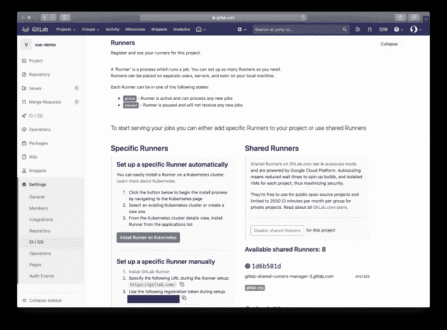

要跳过所有这些程序，可以直接访问`[https://gitlab.com/<username>/vue-demo/-/settings/ci_cd](https://gitlab.com/<username>/vue-demo/-/settings/ci_cd)`。

> 注意:`<username>`应该是你的 gitlab 用户名

接下来，将要求您输入跑步者的描述和标签，如下所示:

```
Please enter the gitlab-ci description for this runner:
```

和

```
Please enter the gitlab-ci tags for this runner (comma separated):
```

按`Enter`键跳过这些。接下来，将提示您以下信息:

```
Please enter the executor: ssh, virtualbox, kubernetes, docker, docker-ssh, shell, docker+machine, docker-ssh+machine, custom, parallels:
```

输入`shell`并按回车键。至此，您已经在您的服务器上成功注册了一个 GitLab Runner。

## 安装 Docker

您可以通过运行以下命令快速安装 docker:

```
sudo snap install docker
```

这将很快在你的机器上安装 Docker。接下来，我们需要通过运行以下命令为 Docker 设置权限:

```
sudo groupadd docker
sudo usermod -aG docker $USER
```

像这样重新启动服务器:

```
reboot
```

重新登录并运行:

```
sudo usermod -aG docker gitlab-runner
```

这将把 GitLab Runner 添加到 Docker 组。

## 将 GitLab Runner 添加到 sudoers

要将 GitLab Runner 添加到 sudoers 列表中，请运行:

```
sudo nano /etc/sudoers
```

将以下内容粘贴到文件的末尾:

```
gitlab-runner ALL=(ALL) NOPASSWD: ALL
```

保存并退出 nano。

## 核查信息

要验证您的信息，请运行:

```
sudo nano /etc/gitlab-runner/config.toml
```

它应该包含这样的内容:

```
...
[[runners]]
  url = "https://gitlab.com/"
  token = "XXXXXXXXX"
  executor = "shell"
  [runners.custom_build_dir]
  [runners.ssh]
    user = "<SERVER ACCOUNT USERNAME>"
    host = "<SERVER IP ADDRESS>"
  [runners.cache]
    [runners.cache.s3]
    [runners.cache.gcs]
...
```

如果`user`和`host`属性详细信息与您的服务器不匹配，您可以在以下部分进行更正:

```
...
[runners.ssh]
  user = "<SERVER ACCOUNT USERNAME>"
  host = "<SERVER IP ADDRESS>"
...
```

如果它不在文件中，将它与正确的凭证一起添加，保存并退出文件。重新启动 GitLab Runner:

```
sudo gitlab-runner restart
```

## 测试部署

在这一步中，您将运行管道来查看您的应用程序是否将部署在服务器上。

从您的项目 GitLab 的仪表板中进入管道菜单。

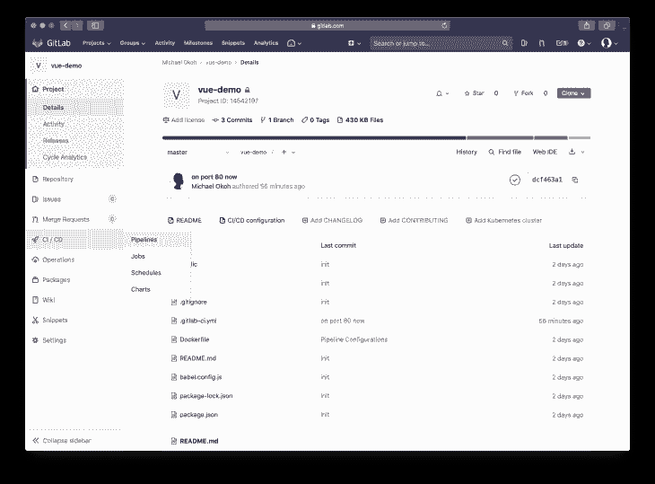

点击`Run Pipeline`。

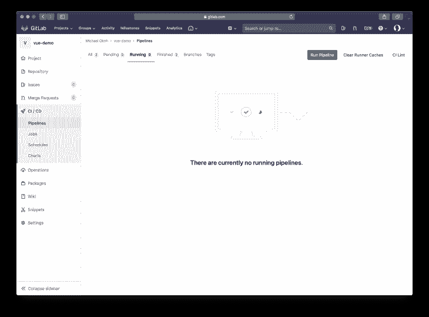

选择要部署的分支，默认为`master`。点击`Run Pipeline`。

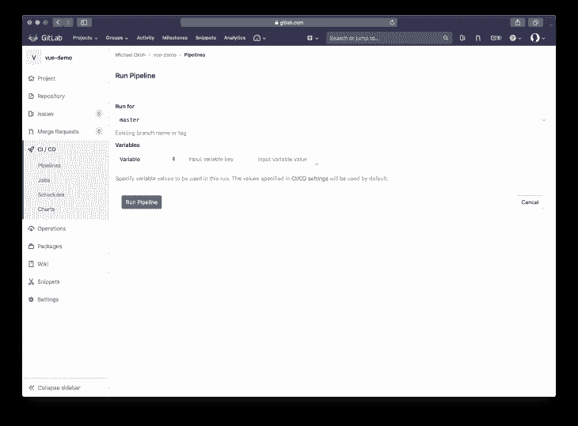

您的应用程序部署将开始。

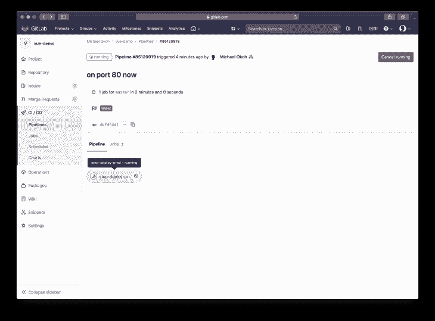

点击`step-deploy-....`按钮查看流程。

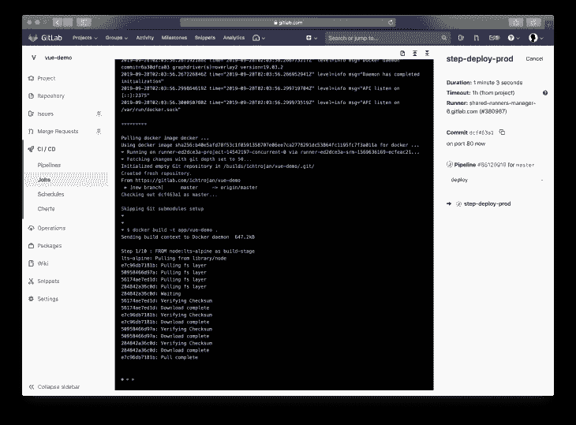

一旦部署成功，您将看到一条`Job succeeded`消息。如果失败，回顾所有的步骤以确保你没有错过任何东西。在您的浏览器上访问您的服务器 IP 地址，您将看到 Vue 登录页面，这意味着您的应用程序部署成功。

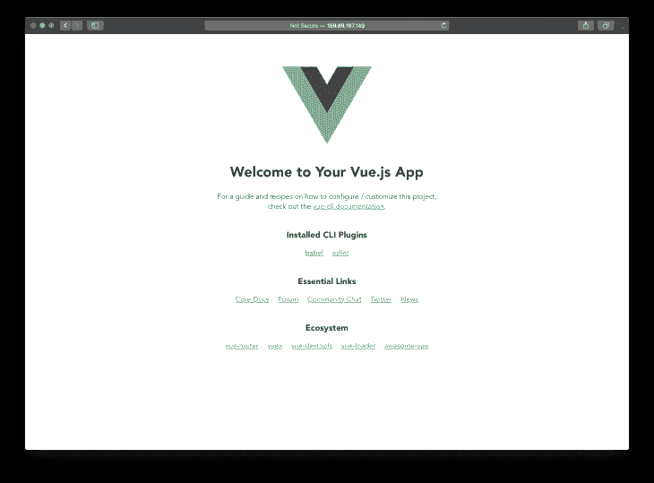

您的应用程序将在每次推送到`master`分支时自动构建和部署自己。

## 结论

在本教程中，您成功创建了一个 Vue 项目，编写了 Docker 和 GitLab CI 配置，使用 Docker、GitLab Runner(以及必要的权限)配置了一个服务器，并在 GitLab 上配置了一个管道。这样，您就可以在将来配置其他项目了。

## 像用户一样体验您的 Vue 应用

调试 Vue.js 应用程序可能会很困难，尤其是当用户会话期间有几十个(如果不是几百个)突变时。如果您对监视和跟踪生产中所有用户的 Vue 突变感兴趣，

[try LogRocket](https://lp.logrocket.com/blg/vue-signup)

.

[](https://lp.logrocket.com/blg/vue-signup)[https://logrocket.com/signup/](https://lp.logrocket.com/blg/vue-signup)

LogRocket 就像是网络和移动应用程序的 DVR，记录你的 Vue 应用程序中发生的一切，包括网络请求、JavaScript 错误、性能问题等等。您可以汇总并报告问题发生时应用程序的状态，而不是猜测问题发生的原因。

LogRocket Vuex 插件将 Vuex 突变记录到 LogRocket 控制台，为您提供导致错误的环境，以及出现问题时应用程序的状态。

现代化您调试 Vue 应用的方式- [开始免费监控](https://lp.logrocket.com/blg/vue-signup)。