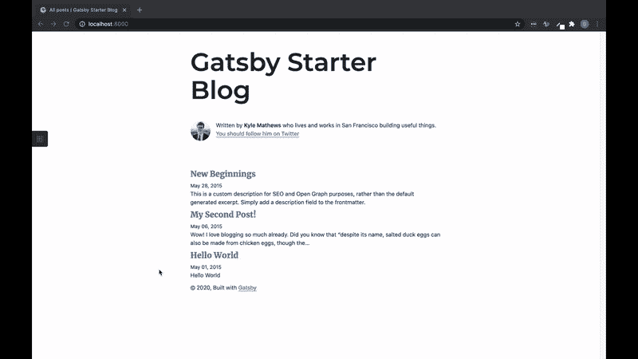
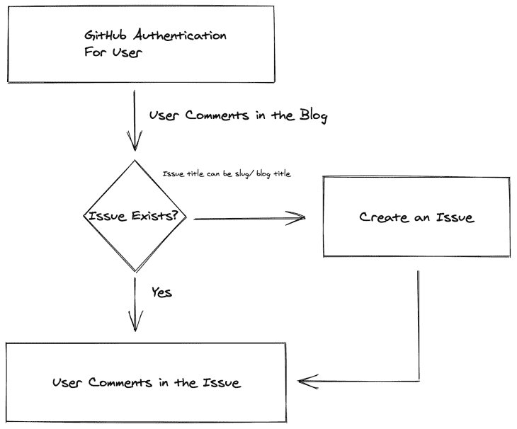
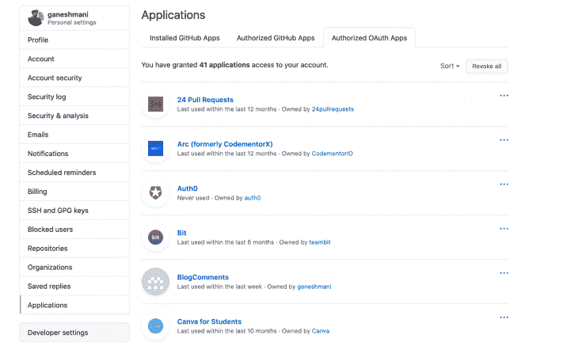
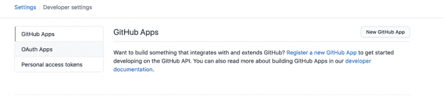
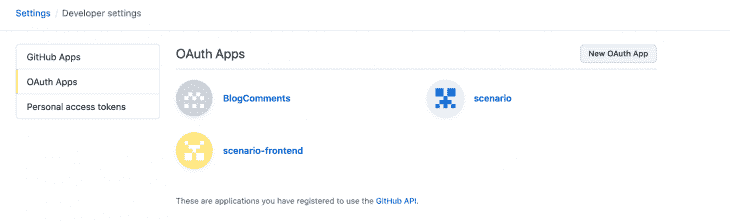
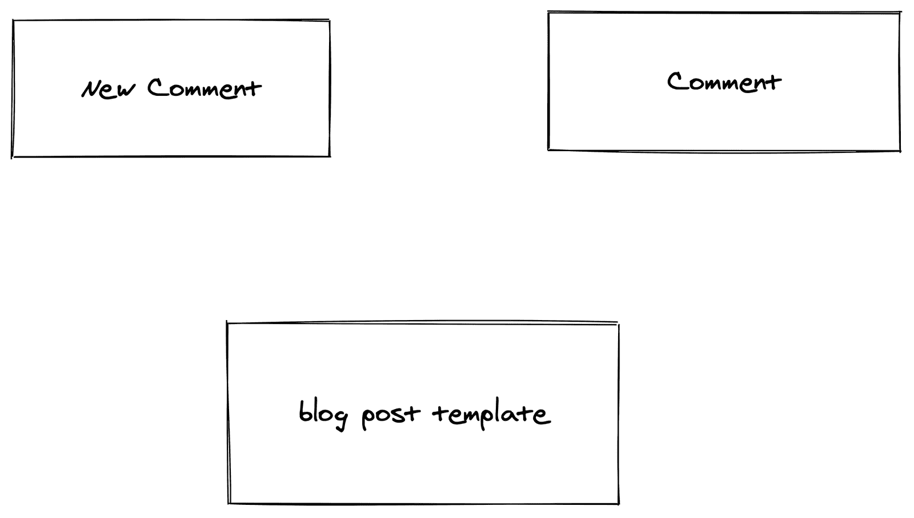
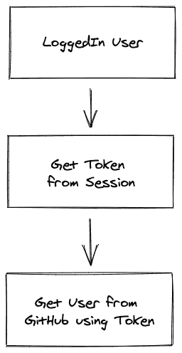

# 如何使用 GitHub Issues - LogRocket 博客为盖茨比建立评论系统

> 原文：<https://blog.logrocket.com/how-to-build-a-comment-system-for-gatsby-using-github-issues/>

评论系统起着重要的作用，因为它们使你能够与你的博客读者互动。如果你想给你的博客添加评论系统，可以使用付费服务，如 [Commento](https://commento.io/) 和 [Disqus](https://disqus.com/) ，但是在本文中，你将学习如何使用 GitHub Issues 为 Gatsby 博客构建评论系统。

在进入教程之前，让我们先看一个演示和我们的评论系统的工作流程:

## 

正如你在这个演示 GIF 中看到的，我们可以在博客中发表评论。我们的评论将存储在 GitHub Issues 中。现在，让我们来看看构建这样的东西所必需的工作流:



这个工作流程可以分为三个步骤。

1.  当用户访问博客时，我们检查用户是否通过了 GitHub 的认证。如果有，用户可以直接评论。如果用户没有通过身份验证，那么用户需要登录才能在博客上发表评论。
2.  当用户点击评论按钮时，我们还需要检查是否有问题存在于博客段落、标题或该博客的独特属性中。如果问题不存在，我们需要创建一个新问题。
3.  最后，我们将评论发布到 GitHub Issues，这样它就会出现在我们的博客评论中。

## 构建 GitHub 认证

首先，我们需要为我们的评论系统建立 GitHub 认证。有不同的方法可以实现这一点，但是我们将使用带有 [Passport.js](http://www.passportjs.org/) 的定制服务器来处理认证，而不是在 Gatsby 本身中构建它，因为这是处理用户会话的简单而安全的方法。

让我们创建一个带有 Passport.js GitHub 身份验证的自定义服务器。

```
npm init --yes
npm install express body-parser cors express-session passport passport-github

```

之后，创建 App.js 并添加以下代码:

```
const express = require("express");
const bodyParser = require("body-parser");
const passport = require("passport");
const session = require("express-session");
const cors = require("cors");
const app = express();
const CLIENT_URL = process.env.CLIENT_URL || "http://localhost:8000";
app.use(cors({ credentials: true, origin: CLIENT_URL }));
app.use(bodyParser.json());
app.use(bodyParser.urlencoded({ extended: false }));
app.use(
  session({
    resave: true,
    saveUninitialized: true,
    secret: "123456",
  })
);
app.use(passport.initialize());
app.use(passport.session());
require("./passport");
app.get("/", (req, res) => {
  console.log("user", req.user);
  res.send("Welcome");
});
app.get("/token", (req, res) => {
  if (req.user) {
    res.status(200).json({ user: req.user });
  } else {
    res.status(200).json({ user: null });
  }
});
app.get("/auth/github", (req, res, next) => {
  req.redirect_url = req.query.url;
  passport.authenticate("github", { state: JSON.stringify(req.query.url) })(
    req,
    res,
    next
  );
});
app.get(
  "/auth/github/callback",
  passport.authenticate("github", { failureRedirect: "/login" }),
  function (req, res) {
    const redirect_url = JSON.parse(req.query.state);
    // Successful authentication, redirect home.
    res.redirect(redirect_url);
  }
);
const PORT = process.env.PORT || 4000;
app.listen(PORT, () => {
  console.log(`Server is running on PORT ${PORT}`);
});

```

这里，我们有三个端点:`/auth/github`、`/auth/github/callback`和`/token`。它们处理 Passport.js GitHub 身份验证和 Passport 身份验证回调和令牌，后者根据浏览器中存储的 cookies 返回用户信息。

接下来，创建一个文件 Passport.js 来配置 Passport。

```
const passport = require("passport");
const GitHubStrategy = require("passport-github").Strategy;
passport.use(
  new GitHubStrategy(
    {
      clientID: <YOUR APP CLIENT ID>,
      clientSecret: <YOUR APP CLIENT SECRET>,
      callbackURL: "http://localhost:4000/auth/github/callback",
      passReqToCallback: true,
      scope: ["public_repo", "repo"],
    },
    function (req, accessToken, refreshToken, profile, cb) {
      const user = {
        id: profile.id,
        name: profile.username,
        imageUrl: profile.photos[0].value,
        token: accessToken,
      };
      return cb(null, user);
    }
  )
);
passport.serializeUser(function (user, fn) {
  fn(null, user);
});
passport.deserializeUser(function (user, fn) {
  fn(null, user);
});

```

我们现在需要客户机 ID 和客户机密码来进行配置。

为此，进入 GitHub 设置，然后点击**开发者设置:** 

接下来，点击 ****OAuth 应用:**** 

最后点击 ****新建 OAuth app:**** 

在此之后，您可以创建一个新的应用程序，并为其获取凭据。我们现在有了评论系统的服务器，所以让我们在 Gatsby 博客中构建一个评论部分。我将使用 [Gatsby Starter Blog](https://github.com/gatsbyjs/gatsby-starter-blog) 在其上构建评论系统。

下面是盖茨比评论系统内部的技术工作流程:



首先，我们有一个`New Comment`组件来发布对 GitHub 问题的评论。然后，我们有`Comment`，它呈现了来自 GitHub 问题的每个组件。`New Comment`和`Comment`都应该在`templates/blog-post.js`内部，它呈现每个博客。

接下来，在`src`目录`Comment/newComment.js`中创建一个组件，并添加以下代码:

```
import React, { useState, useEffect } from "react"
import { getLoginUrl } from "../../utils/auth"
import { renderMarkdown, processRenderedMarkdown } from "../../utils/github"
import avatar from "./avatar.svg"
import ReactMarkdown from "react-markdown"

const NewComment = ({ user, pageUrl, onCommentSubmit }) => {
  const [comment, setComment] = useState("")
  const [activeTab, setActiveTab] = useState(0)
  const [markDown, setMarkDown] = useState(null)
  const onCommentChange = e => {
    setComment(e.target.value)
  }
  const onPreviewClick = async () => {
    setActiveTab(1)
    const markdownComment = await renderMarkdown(comment)
    setMarkDown(markdownComment)
  }
  const onNewCommentSubmit = () => {
    onCommentSubmit(comment)
    setComment("")
  }
  return (
    <article className="timeline-comment">
      {user ? (
        <a
          className="avatar"
          target="_blank"
          tabindex="-1"
          href={user.html_url}
        >
          
        </a>
      ) : (
        
      )}
      <form className="comment" acceptCharset="UTF-8" action="javascript:">
        <header className="new-comment-header tabnav">
          <div className="tabnav-tabs" role="tablist">
            <button
              type="button"
              className="tabnav-tab tab-write"
              role="tab"
              onClick={() => setActiveTab(0)}
              aria-selected={activeTab === 0}
            >
              Write
            </button>
            <button
              type="button"
              className="tabnav-tab tab-preview"
              role="tab"
              onClick={() => onPreviewClick()}
              aria-selected={activeTab === 1}
            >
              Preview
            </button>
          </div>
        </header>
        <div className="comment-body">
          <textarea
            className="form-control"
            placeholder="Leave a comment"
            aria-label="comment"
            value={comment}
            onChange={onCommentChange}
            disabled={!user}
          >
            {activeTab === 1 && markDown ? markDown : null}
          </textarea>
          <div className="markdown-body" style={{ display: "none" }}></div>
        </div>
        <footer className="new-comment-footer">
          <a
            className="text-link markdown-info"
            tabindex="-1"
            target="_blank"
            href="https://guides.github.com/features/mastering-markdown/"
          >
            <svg
              className="octicon v-align-bottom"
              viewBox="0 0 16 16"
              version="1.1"
              width="16"
              height="16"
              aria-hidden="true"
            >
              <path
                fill-rule="evenodd"
                d="M14.85 3H1.15C.52 3 0 3.52 0 4.15v7.69C0 12.48.52 13 1.15
              13h13.69c.64 0 1.15-.52 1.15-1.15v-7.7C16 3.52 15.48 3 14.85 3zM9 11H7V8L5.5 9.92 4
              8v3H2V5h2l1.5 2L7 5h2v6zm2.99.5L9.5 8H11V5h2v3h1.5l-2.51 3.5z"
              ></path>
            </svg>
            Styling with Markdown is supported
          </a>
          {user ? (
            <button
              onClick={e => onNewCommentSubmit()}
              className="btn btn-primary"
              type="submit"
            >
              Comment
            </button>
          ) : (
            <a
              className="btn btn-primary"
              href={`${getLoginUrl(pageUrl)}`}
              target="_top"
              hidden=""
            >
              Sign in to comment
            </a>
          )}
        </footer>
      </form>
    </article>
  )
}
export default NewComment

```

先从组件道具说起。在这里，我们有`user`、`pageUrl`和`onCommentSubmit`。我们将首先根据`user`属性检查用户是否通过了身份验证。

如果用户通过了身份验证，我们将允许他们发表评论。如果不是这样，那么我们将禁用文本区域和评论按钮。

```
 {user ? (
            <button
              onClick={e => onNewCommentSubmit()}
              className="btn btn-primary"
              type="submit"
            >
              Comment
            </button>
          ) : (
            <a
              className="btn btn-primary"
              href={`${getLoginUrl(pageUrl)}`}
              target="_top"
              hidden=""
            >
              Sign in to comment
            </a>
  )}

```

当用户点击 **`Sign in to comment`** 时，他们将被重定向到我们的服务器 URL passport . js authentic ation。让我们将这个组件导入到`templates/blog-post.js`中来呈现带有按钮的`new Comment`文本框。

```
import React, { useState, useEffect } from "react"
import { Link, graphql } from "gatsby"
import Bio from "../components/bio"
import Layout from "../components/layout"
import SEO from "../components/seo"
import { rhythm, scale } from "../utils/typography"
import NewComment from "../components/Comment/newComment"
import {
loadUser,
} from "../utils/github"
import { loadToken } from "../utils/auth"

const BlogPostTemplate = ({ data, pageContext, location }) => {
const [user, setUser] = useState(null)

const post = data.markdownRemark
const siteTitle = data.site.siteMetadata.title
const { previous, next,slug } = pageContext
const url = typeof window !== "undefined" ? window.location.href : ""

return (
<Layout location={location} title={siteTitle}>
<SEO
title={post.frontmatter.title}
description={post.frontmatter.description || post.excerpt}
/>
<article>
<header>
<h1
style={{
marginTop: rhythm(1),
marginBottom: 0,
}}
>
{post.frontmatter.title}
</h1>
<p
style={{
...scale(-1 / 5),
display: `block`,
marginBottom: rhythm(1),
}}
>
{post.frontmatter.date}
</p>
</header>
<section dangerouslySetInnerHTML={{ __html: post.html }} />
<hr
style={{
marginBottom: rhythm(1),
}}
/>
<footer>
<Bio />
</footer>
</article>
<NewComment user={user} pageUrl={url} onCommentSubmit={onCommentSubmit} />
<nav>
<ul
style={{
display: `flex`,
flexWrap: `wrap`,
justifyContent: `space-between`,
listStyle: `none`,
padding: 0,
}}
>
<li>
{previous && (
<Link to={previous.fields.slug} rel="prev">
← {previous.frontmatter.title}
</Link>
)}
</li>
<li>
{next && (
<Link to={next.fields.slug} rel="next">
{next.frontmatter.title} →
</Link>
)}
</li>
</ul>
</nav>
</Layout>
)
}

export default BlogPostTemplate

export const pageQuery = graphql`
query BlogPostBySlug($slug: String!) {
site {
siteMetadata {
title
}
}
markdownRemark(fields: { slug: { eq: $slug } }) {
id
excerpt(pruneLength: 160)
html
frontmatter {
title
date(formatString: "MMMM DD, YYYY")
description
}
}
}
`

```

如果您仔细观察，您会注意到我们将`user` props 传递给这个组件，因为我们需要获取登录的用户信息。



我们的方法是添加以下代码:

```
useEffect(() => {
    const fetchUser = async () => {
      await loadToken()
      const user = await loadUser()
      const issue = await loadIssueByTerm(slug)
      setUser(user)
    }
    fetchUser()
  }, [])

```

在这里，我们将通过连接我们的服务器从会话中接收一个令牌。

```
export const token = { value: null, code: null }
export const BACKEND_API = "http://localhost:4000"
// tslint:disable-next-line:variable-name
export function getLoginUrl(redirect_uri) {
  return `http://localhost:4000/auth/github?url=${redirect_uri}`
}
export async function loadToken() {
  if (token.value) {
    return token.value
  }
  const url = `${BACKEND_API}/token`
  const response = await fetch(url, {
    method: "GET",
    mode: "cors",
    credentials: "include",
  })
  if (response) {
    const t = await response.json()
    if (t.user) {
      token.value = t.user.token
      return t.user.token
    }
  }
  return null
}

```

一旦我们得到令牌，我们就可以从 GitHub 获取用户详细信息。

```
export const loadUser = () => {
  if (token.value === null) {
    return Promise.resolve(null)
  }
  return githubFetch(githubRequest("user")).then(response => {
    if (response.ok) {
      return response.json()
    }
    return null
  })
}

const githubRequest = (relativeUrl, init) => {
  init = init || {}
  init.mode = "cors"
  init.cache = "no-cache" // force conditional request
  const request = new Request(GITHUB_API + relativeUrl, init)
  request.headers.set("Accept", GITHUB_ENCODING__REACTIONS_PREVIEW)
  if (!/^search\//.test(relativeUrl) && token.value !== null) {
    request.headers.set("Authorization", `token ${token.value}`)
  }
  return request
}

const githubFetch = request => {
  return fetch(request).then(response => {
    if (response.status === 401) {
      token.value = null
    }
    if (response.status === 403) {
      response.json().then(data => {
        if (data.message === "Resource not accessible by integration") {
          //   window.dispatchEvent(new CustomEvent("not-installed"))
        }
      })
    }
    if (
      request.method === "GET" &&
      [401, 403].indexOf(response.status) !== -1 &&
      request.headers.has("Authorization")
    ) {
      request.headers.delete("Authorization")
      return githubFetch(request)
    }
    return response
  })
}

```

现在，让我们看看如果 GitHub 不存在，如何发布评论和创建 GitHub 问题。在`templates/blog-post.js,`中添加以下代码:

```
  const [issue, setIssue] = useState({}) 

  useEffect(() => {
    const fetchUser = async () => {
      await loadToken()
      const user = await loadUser()
      const issue = await loadIssueByTerm(slug)
      setUser(user)

      if (issue) {
        setIssue(issue)
        if (issue && issue.comments > 0) {
          const comments = await loadComments(issue.number)
          setComments(comments)
        }
      }
    }
    fetchUser()
  }, [])

const onCommentSubmit = async value => {
    let issueResult
    if (Object.keys(issue).length === 0) {
      issueResult = await createIssue(
        slug,
        url,
        post.frontmatter.title,
        post.frontmatter.description,
        "comment"
      )
      setIssue(issueResult)
    }
    const comment = await postComment(
      Object.keys(issue).length !== 0 ? issue.number : issueResult.number,
      value
    )
    const comments = await loadComments(
      Object.keys(issue).length > 0 ? issue.number : issueResult.number
    )
    setComments(comments)
  }

```

现在，我们将加载`issueByTerm`，这是我们的博客 slug。

```
      const issue = await loadIssueByTerm(slug)

```

在`utils/github.js`内添加该功能:

```
export function loadIssueByTerm(term) {
  const q = `"${term}" type:issue in:title repo:ganeshmani/nodecli-forms`
  const request = githubRequest(
    `search/issues?q=${encodeURIComponent(q)}&sort=created&order=asc`
  )
  return githubFetch(request)
    .then(response => {
      if (!response.ok) {
        throw new Error("Error fetching issue via search.")
      }
      return response.json()
    })
    .then(results => {
      if (results.total_count === 0) {
        return null
      }
      if (results.total_count > 1) {
        // tslint:disable-next-line:no-console
        console.warn(`Multiple issues match "${q}".`)
      }
      term = term.toLowerCase()
      for (const result of results.items) {
        if (result.title.toLowerCase().indexOf(term) !== -1) {
          return result
        }
      }
      // tslint:disable-next-line:no-console
      console.warn(
        `Issue search results do not contain an issue with title matching "${term}". Using first result.`
      )
      return results.items[0]
    })
}

```

我们将从 GitHub 获取问题，并将其存储在组件状态中。当用户点击`comment`按钮时，我们调用函数`onCommentSubmit`。

在这里，我们将检查问题是否存在。如果没有，我们就制造问题。

```
if (Object.keys(issue).length === 0) {
      issueResult = await createIssue(
        slug,
        url,
        post.frontmatter.title,
        post.frontmatter.description,
        "comment"
      )
      setIssue(issueResult)
}

```

`CreateIssue`会是这样的:

```
export function createIssue(issueTerm, documentUrl, title, description, label) {
  const url = `https://api.github.com/repos/<USERNAME>/<REPO NAME>/issues`
  const request = new Request(url, {
    method: "POST",
    body: JSON.stringify({
      title: issueTerm,
      body: `# ${title}\n\n${description}\n\n[${documentUrl}](${documentUrl})`,
    }),
  })
  request.headers.set("Accept","application/vnd.github.squirrel-girl-preview")
  request.headers.set("Authorization", `token ${token.value}`)
  return fetch(request).then(response => {
    if (!response.ok) {
      throw new Error("Error creating comments container issue")
    }
    return response.json()
  })
}

```

之后，在 GitHub 问题上发表评论:

```
//it comes inside onCommentSubmit
await postComment(
      Object.keys(issue).length !== 0 ? issue.number : issueResult.number,
      value
    )
    const comments = await loadComments(
      Object.keys(issue).length > 0 ? issue.number : issueResult.number
    )
    setComments(comments)

```

`postComment`和`loadComments`功能是:

```
export function postComment(issueNumber, markdown) {
  const url = `repos/<USERNAME>/<REPO NAME>/issues/${issueNumber}/comments`
  const body = JSON.stringify({ body: markdown })
  const request = githubRequest(url, { method: "POST", body })
  const accept = `application/vnd.github.VERSION.html+json,application/vnd.github.squirrel-girl-preview`
  request.headers.set("Accept", accept)
  return githubFetch(request).then(response => {
    if (!response.ok) {
      throw new Error("Error posting comment.")
    }
    return response.json()
  })
}
function commentsRequest(issueNumber) {
  const url = `repos/<USERNAME>/<REPO NAME>/issues/${issueNumber}/comments`
  const request = githubRequest(url)
  const accept = `application/vnd.github.VERSION.html+json,application/vnd.github.squirrel-girl-preview`
  request.headers.set("Accept", accept)
  return request
}
export function loadComments(issueNumber) {
  const request = commentsRequest(issueNumber)
  return githubFetch(request).then(response => {
    if (!response.ok) {
      throw new Error("Error fetching comments.")
    }
    return response.json()
  })
}

```

现在，我们已经将评论发布到 GitHub Issues 并加载了它。让我们在博客中发表评论。

在`templates/blog-post.js`中添加以下代码:

```
 {Object.keys(issue).length > 0 &&
        comments &&
        comments.map(comment => {
          return <Comment comment={comment} />
        })}

```

现在，创建一个组件`Comment/index.js`并添加以下代码:

```
import React from "react"
import moment from "moment"
const displayAssociations = {
  COLLABORATOR: "Collaborator",
  CONTRIBUTOR: "Contributor",
  MEMBER: "Member",
  OWNER: "Owner",
  FIRST_TIME_CONTRIBUTOR: "First time contributor",
  FIRST_TIMER: "First timer",
  NONE: "",
}
const Comment = ({ comment }) => {
  return (
    <div>
      <article className="timeline-comment">
        <a
          className="avatar"
          href={comment.user.html_url}
          target="_blank"
          tabindex="-1"
        >
          
        </a>
        <div className="comment">
          <header className="comment-header">
            <span className="comment-meta">
              <a
                className="text-link"
                href={comment.user.html_url}
                target="_blank"
              >
                <strong>{comment.user.login}</strong>
              </a>
              commented
              <a className="text-link" href={comment.html_url} target="_blank">
                {moment(comment.created_at).fromNow()}
              </a>
            </span>
            <div className="comment-actions">
              <span className="author-association-badge">
                {displayAssociations[comment.author_association]}
              </span>
            </div>
          </header>
          <div
            dangerouslySetInnerHTML={{ __html: comment.body_html }}
            className="markdown-body markdown-body-scrollable"
          ></div>
          <div
            className="comment-footer"
            reaction-count="14"
            // reaction-url="https://api.github.com/repos/taniarascia/comments/issues/comments/668954710/reactions"
          >
            <details className="details-overlay details-popover reactions-popover">
              <summary tabindex="-1">
                <svg
                  className="octicon"
                  style={{ marginRight: "3px" }}
                  viewBox="0 0 7 16"
                  version="1.1"
                  width="7"
                  height="16"
                  aria-hidden="true"
                >
                  <path
                    fillRule="evenodd"
                    d="M4 4H3v3H0v1h3v3h1V8h3V7H4V4z"
                  ></path>
                </svg>
                <svg
                  className="octicon"
                  viewBox="0 0 16 16"
                  version="1.1"
                  width="16"
                  height="16"
                  aria-hidden="true"
                >
                  <path
                    fillRule="evenodd"
                    d="M8 0C3.58 0 0 3.58 0 8s3.58 8 8 8 8-3.58 8-8-3.58-8-8-8zm4.81 12.81a6.72 6.72 0 0 1-2.17 1.45c-.83.36-1.72.53-2.64.53-.92 0-1.81-.17-2.64-.53-.81-.34-1.55-.83-2.17-1.45a6.773 6.773 0 0 1-1.45-2.17A6.59 6.59 0 0 1 1.21 8c0-.92.17-1.81.53-2.64.34-.81.83-1.55 1.45-2.17.62-.62 1.36-1.11 2.17-1.45A6.59 6.59 0 0 1 8 1.21c.92 0 1.81.17 2.64.53.81.34 1.55.83 2.17 1.45.62.62 1.11 1.36 1.45 2.17.36.83.53 1.72.53 2.64 0 .92-.17 1.81-.53 2.64-.34.81-.83 1.55-1.45 2.17zM4 6.8v-.59c0-.66.53-1.19 1.2-1.19h.59c.66 0 1.19.53 1.19 1.19v.59c0 .67-.53 1.2-1.19 1.2H5.2C4.53 8 4 7.47 4 6.8zm5 0v-.59c0-.66.53-1.19 1.2-1.19h.59c.66 0 1.19.53 1.19 1.19v.59c0 .67-.53 1.2-1.19 1.2h-.59C9.53 8 9 7.47 9 6.8zm4 3.2c-.72 1.88-2.91 3-5 3s-4.28-1.13-5-3c-.14-.39.23-1 .66-1h8.59c.41 0 .89.61.75 1z"
                  ></path>
                </svg>
              </summary>
            </details>
          </div>
        </div>
      </article>
    </div>
  )
}
export default Comment

```

现在你应该有一个简单的使用 GitHub Issues 的 Gatsby 博客评论系统了。这是一个为你的博客获得评论系统的简单版本，但是我们可以给它添加更多的功能。例如，您可以在您的博客中添加反应和垃圾邮件过滤。

如果你想在本教程的基础上构建这些特性，请在评论中告诉我。

## 使用 [LogRocket](https://lp.logrocket.com/blg/signup) 消除传统错误报告的干扰

[](https://lp.logrocket.com/blg/signup)

[LogRocket](https://lp.logrocket.com/blg/signup) 是一个数字体验分析解决方案，它可以保护您免受数百个假阳性错误警报的影响，只针对几个真正重要的项目。LogRocket 会告诉您应用程序中实际影响用户的最具影响力的 bug 和 UX 问题。

然后，使用具有深层技术遥测的会话重放来确切地查看用户看到了什么以及是什么导致了问题，就像你在他们身后看一样。

LogRocket 自动聚合客户端错误、JS 异常、前端性能指标和用户交互。然后 LogRocket 使用机器学习来告诉你哪些问题正在影响大多数用户，并提供你需要修复它的上下文。

关注重要的 bug—[今天就试试 LogRocket】。](https://lp.logrocket.com/blg/signup-issue-free)