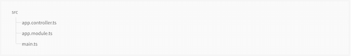
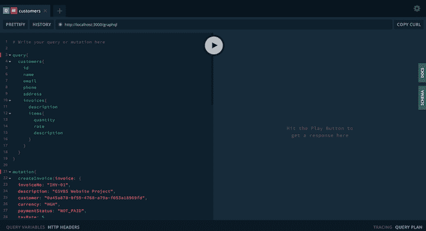

# 如何用 NestJS 构建一个 GraphQL API

> 原文：<https://blog.logrocket.com/how-to-build-a-graphql-api-with-nestjs/>

[NestJS](https://nestjs.com/) 是一个 TypeScript Node.js 框架，帮助你构建企业级的、高效的、可伸缩的 Node.js 应用。它支持 RESTful 和 GraphQL API 设计方法。

在之前的一篇文章中，我们介绍了如何使用 NestJS 构建 RESTful APIs。在本教程中，我们将演示如何使用 NestJS 来利用 GraphQL APIs 的强大功能。

GraphQL 是一种用于 API 的查询语言，也是一个用现有数据完成这些查询的运行时。它为 API 中的数据提供了一个完整的、可理解的描述，使客户能够准确地要求他们需要的东西，使 API 更容易随时间发展，并有助于使用强大的开发工具。

Nest 提供了两种构建 GraphQL APIs 的方法:[代码优先和模式优先](https://blog.logrocket.com/code-first-vs-schema-first-development-graphql/)。代码优先的方法包括使用 TypeScript 类和 decorators 来生成 GraphQL 模式。使用这种方法，您可以将数据模型类作为模式重用，并用`@ObjectType()` decorator 修饰它，Nest 将从您的模型自动生成模式。模式优先的方法包括使用 GraphQL 的[模式定义语言(SDL)](https://graphql.org/learn/schema/) 定义模式，然后通过匹配模式中的定义来实现服务。

## 设置

### 安装 NestJS

开始一个 Nest 项目很简单。Nest 提供了一个 CLI，您可以使用它来生成一个新项目。如果您已经安装了 [npm](https://www.npmjs.com/get-npm) ，那么您可以使用下面的命令创建一个新的嵌套项目。

```
 npm i -g @nestjs/cli
nest new project-name

```

Nest 将使用`project-name`创建一个项目目录，并添加一些样板文件。



### 添加 GraphQL

在幕后，Nest 使用 [Apollo](https://www.apollographql.com/) GraphQL 服务器实现将 GraphQL 用于 Nest 应用程序。为了向我们的 Nest 项目添加 API，我们需要安装 Apollo Server 和其他 GraphQL 依赖项。

```
$ npm i --save @nestjs/graphql graphql-tools graphql apollo-server-express

```

安装完依赖项后，您现在可以将`GraphQLModule`导入到`AppModule`中。

```
//src/app.module.ts

import { Module } from '@nestjs/common';
import { GraphQLModule } from '@nestjs/graphql';

@Module({
  imports: [
    GraphQLModule.forRoot({}),
  ],
})
export class AppModule {}

```

是 Apollo 服务器的包装器。它提供了一个静态方法`forRoot()`，用于配置底层的 Apollo 实例。`forRoot()`方法接受传递给 Apollo 服务器构造函数的[选项](https://www.apollographql.com/docs/apollo-server/api/apollo-server/#constructor-options-lt-ApolloServer-gt)列表。

### 添加数据库

嵌套是数据库不可知的；它允许与任何数据库、[对象文档映射器(ODM)](https://www.tutorialspoint.com/phalcon/phalcon_object_document_mapper.htm) 或对象关系映射器(ORM)集成。出于本指南的目的，我们将使用 PostgreSQL 和 [TypeORM](https://blog.logrocket.com/how-build-graphql-api-typegraphql-typeorm/) 。Nest 团队建议将 TypeORM 与 Nest 一起使用，因为它是 TypeScript 可用的最成熟的 ORM。因为它是用 TypeScript 编写的，所以它与 Nest 框架集成得很好。Nest 提供了用于处理 TypeORM 的`@nestjs/typeorm`包。

让我们安装这些依赖项

```
$ npm install --save @nestjs/typeorm typeorm pg

```

一旦安装过程完成，我们就可以使用`TypeOrmModule`连接到数据库。

```
// src/app.module.ts

import { Module } from '@nestjs/common';
import { AppController } from './app.controller';
import { AppService } from './app.service';
import { GraphQLModule } from '@nestjs/graphql';
import { TypeOrmModule } from '@nestjs/typeorm'
@Module({
  imports: [
    GraphQLModule.forRoot({
      autoSchemaFile: 'schema.gql'
    }),
    TypeOrmModule.forRoot({
      type: 'postgres',
      host: 'localhost',
      port: 5432,
      username: 'godwinekuma',
      password: '',
      database: 'invoiceapp',
      entities: ['dist/**/*.model.js'],
      synchronize: false,
    }),
  ],
  controllers: [AppController],
  providers: [AppService],
})
export class AppModule { }

```

## 下决心者

[解析器](https://www.apollographql.com/docs/tutorial/resolvers/)提供将 GraphQL 操作(查询、变异或订阅)转换成数据的指令。它们要么返回我们在模式中指定的数据类型，要么返回对该数据的承诺。`@nestjs/graphql`包使用用于注释类的 decorators 提供的元数据自动生成一个解析器映射。为了演示如何使用包特性来创建 GraphQL API，我们将创建一个简单的 invoice API。

为了构建我们的 API，我们将使用代码优先的方法。

### 对象类型

对象类型是 GraphQL 模式最基本的组成部分。它是可以从服务中获取的字段集合，每个字段声明一种类型。定义的每个对象类型代表 API 中的一个域对象。例如，我们的示例发票 API 需要能够获取客户及其发票的列表，因此我们应该定义`Customer`和`Invoice`对象类型来支持该功能。

由于我们使用代码优先的方法，我们将使用 TypeScript 类定义模式，然后使用 [TypeScript 装饰器](https://blog.logrocket.com/a-practical-guide-to-typescript-decorators/)来注释这些类的字段。

```
// src/invoice/customer.model.ts

import { Entity, Column, PrimaryGeneratedColumn, CreateDateColumn, UpdateDateColumn, OneToMany } from 'typeorm';
import { ObjectType, Field } from '@nestjs/graphql';
import { InvoiceModel } from '../invoice/invoice.model';
@ObjectType()
@Entity()
export class CustomerModel {
  @Field()
  @PrimaryGeneratedColumn('uuid')
  id: string;
  @Field()
  @Column({ length: 500, nullable: false })
  name: string;
  @Field()
  @Column('text', { nullable: false })
  email: string;
  @Field()
  @Column('varchar', { length: 15 })
  phone: string;
  @Field()
  @Column('text')
  address: string;
  @Field(type => [InvoiceModel], { nullable: true })
  @OneToMany(type => InvoiceModel, invoice => invoice.customer)
  invoices: InvoiceModel[]
  @Field()
  @Column()
  @CreateDateColumn()
  created_at: Date;
  @Field()
  @Column()
  @UpdateDateColumn()
  updated_at: Date;
}

```

注意，我们用来自`@nestjs/graphql`的`@ObjectTpye()`修饰了这个类。装饰器告诉 Nest 这个类是一个对象类。

### 田

我们上面的`CustomerModel`类中的每个属性都用`@Field()`装饰器来装饰。Nest 要求我们在模式定义类中显式使用`@Field()`装饰器来提供关于每个字段的 GraphQL 类型和可选性的元数据。

字段的 GraphQL 类型可以是标量类型，也可以是其他对象类型。GraphQL 自带了一组默认的[标量类型](https://graphql.org/learn/schema/#scalar-types):`Int`、`String`、`ID`、`Float`和`Boolean`。`@Field()`装饰器接受可选的类型函数(例如，type = > Int)和可选的选项对象。

当字段是数组时，我们必须在`@Field()` decorator 的 type 函数中手动指明数组类型，如下所示。

```
 @Field(type => [InvoiceModel])
  invoices: InvoiceModel[]

```

现在我们已经创建了`CustomerModel`对象类型，让我们定义`InvoiceModel`对象类型。

```
// src/invoice/invoice.model.ts

import { CustomerModel } from './../customer/customer.model';
import { Entity, Column, PrimaryGeneratedColumn, CreateDateColumn, UpdateDateColumn, JoinColumn, ManyToOne, ChildEntity } from 'typeorm';
import { ObjectType, Field } from '@nestjs/graphql';
export enum Currency {
  NGN = "NGN",
  USD = "USD",
  GBP = "GBP",
  EUR = " EUR"
}
export enum PaymentStatus {
  PAID = "PAID",
  NOT_PAID = "NOT_PAID",
}
@ObjectType()
export class Item{
  @Field()
  description: string;
  @Field()
  rate: number;
  @Field()
  quantity: number 
}
@ObjectType()
@Entity()
export class InvoiceModel {
  @Field()
  @PrimaryGeneratedColumn('uuid')
  id: string;
  @Field()
  @Column({ length: 500, nullable: false })
  invoiceNo: string;
  @Field()
  @Column('text')
  description: string;
  @Field(type => CustomerModel)
  @ManyToOne(type => CustomerModel, customer => customer.invoices)
  customer: CustomerModel;
  @Field()
  @Column({
    type: "enum",
    enum: PaymentStatus,
    default: PaymentStatus.NOT_PAID
  })
  paymentStatus: PaymentStatus;
  @Field()
  @Column({
    type: "enum",
    enum: Currency,
    default: Currency.USD
  })
  currency: Currency;
  @Field()
  @Column()
  taxRate: number;
  @Field()
  @Column()
  issueDate: string;
  @Field()
  @Column()
  dueDate: string;
  @Field()
  @Column('text')
  note: string;
  @Field( type => [Item])
  @Column({
    type: 'jsonb',
    array: false,
    default: [],
    nullable: false,
  })
  items: Item[];
  @Column()
  @Field()
  taxAmount: number;
  @Column()
  @Field()
  subTotal: number;
  @Column()
  @Field()
  total: string;
  @Column({
    default: 0
  })
  @Field()
  amountPaid: number;
  @Column()
  @Field()
  outstandingBalance: number;
  @Field()
  @Column()
  @CreateDateColumn()
  createdAt: Date;
  @Field()
  @Column()
  @UpdateDateColumn()
  updatedAt: Date;
}

```

### GraphQL 特殊对象类型

我们已经看到了如何用 Nest 定义对象类型。但是 GraphQL 中有两种特殊类型:`Query`和`Mutation`。这些对象充当其他对象类型的父对象，并且很特殊，因为它们定义了其他对象的入口点。每个 GraphQL API 都有一个`Query`类型，可能有也可能没有`Mutation`类型。

我们的发票 API 应该有一个类似下面的查询。

```
type Query {
  customer: CustomerModel
  invoice: InvoiceModel
}

```

创建了应该存在于我们的图中的对象之后，我们现在可以定义我们的 resolver 类来为我们的客户端提供一种与我们的 API 进行交互的方式。在代码优先方法中，解析器类既定义解析器函数，又生成`Query`类型。为了创建一个解析器，我们将创建一个使用解析器函数作为方法的类，并用`@Resolver()`装饰器来装饰这个类。

```
//src/customer/customer.resolver.ts

import { InvoiceModel } from './../invoice/invoice.model';
import { InvoiceService } from './../invoice/invoice.service';
import { CustomerService } from './customer.service';
import { CustomerModel } from './customer.model';
import { Resolver, Mutation, Args, Query, ResolveField, Parent } from '@nestjs/graphql';
import { Inject } from '@nestjs/common';
@Resolver(of => CustomerModel)
export class CustomerResolver {
  constructor(
    @Inject(CustomerService) private customerService: CustomerService,
    @Inject(InvoiceService) private invoiceService: InvoiceService
  ) { }
  @Query(returns => CustomerModel)
  async customer(@Args('id') id: string): Promise<CustomerModel> {
    return await this.customerService.findOne(id);
  }
  @ResolveField(returns => [InvoiceModel])
  async invoices(@Parent() customer) {
    const { id } = customer;
    console.log(customer);
    return this.invoiceService.findByCustomer(id);
  }
  @Query(returns => [CustomerModel])
  async customers(): Promise<CustomerModel[]> {
    return await this.customerService.findAll();
  }
}

```

`@Resolver()` decorator 接受一个可选参数，用于指定字段解析器函数的父函数。在上面的例子中，我们创建了`CustomerResolver`，它定义了一个查询解析器函数和一个字段解析器函数。为了指定该方法是一个查询处理程序，我们用`@Query()`装饰器对该方法进行了注释。我们使用`@ResolveField()`来注释解析`CustomerModel`的`invoices`字段的方法。`@Args()`装饰器用于从请求中提取参数，以便在查询处理程序中使用。

### 图 QL 操场

既然我们已经创建了 graph 服务的入口点，我们可以通过 playground 查看我们的 GraphQL API。playground 是一个图形化的、交互式的、浏览器内置的 GraphQL IDE，默认情况下，它与 GraphQL 服务器位于同一个 URL 上。要访问操场，我们需要运行我们的 GraphQL 服务器。

运行以下命令启动服务器。

```
npm start

```

在服务器运行的情况下，打开您的网络浏览器并导航至`[http://localhost:3000/graphql](http://localhost:3000/graphql)`查看操场。



## 突变

我们已经介绍了如何从 GraphQL 服务器检索数据，但是修改服务器端数据又如何呢？变异方法用于修改 GraphQL 中的服务器端数据。

从技术上讲，可以实现一个`Query`来添加服务器端数据。但是通常的惯例是用`@Mutations()`装饰器注释任何导致数据写入的方法。装饰者告诉 Nest，这样的方法是用于数据修改的。

让我们将新的`createCustomer()`添加到解析器中。

```
  @Mutation(returns => CustomerModel)
  async createCustomer(
    @Args('name') name: string,
    @Args('email') email: string,
    @Args('phone', { nullable: true }) phone: string,
    @Args('address', { nullable: true }) address: string,
  ): Promise<CustomerModel> {
    return await this.customerService.create({ name, email, phone, address })
  }

```

`createCustomer()`已经用`@Mutations()`修饰，表示它修改或添加了新数据。

如果一个突变需要将一个对象作为参数，我们将需要创建一个特殊的名为`InputType`的对象，然后作为参数传递给方法。要声明一个输入类型，使用`@InputType()`装饰器。

```
import { PaymentStatus, Currency, Item } from "./invoice.model";
import { InputType, Field } from "@nestjs/graphql";
@InputType()
class ItemDTO{
    @Field()
    description: string;
    @Field()
    rate: number;
    @Field()
    quantity: number
}
@InputType()
export class CreateInvoiceDTO{
@Field()
customer: string;
@Field()    
invoiceNo: string;
@Field()
paymentStatus: PaymentStatus;
@Field()
description: string;
@Field()
currency: Currency;
@Field()
taxRate: number;
@Field()
issueDate: Date;
@Field()
dueDate: Date;
@Field()
note: string;
@Field(type => [ItemDTO])
items: Array<{ description: string; rate: number; quantity: number }>;
}

 @Mutation(returns => InvoiceModel)
  async createInvoice(
    @Args('invoice') invoice: CreateInvoiceDTO,
  ): Promise<InvoiceModel> {
    return await this.invoiceService.create(invoice)
  }

```

## 结论

我们演示了如何使用代码优先的方法通过 Nest 构建 GraphQL API。你可以在 [GitHub](https://github.com/GodwinEkuma/invoice-app) 上找到这里分享的完整版示例代码。

要了解关于模式优先方法和其他最佳实践的更多信息，请查看 [Nest 文档](https://docs.nestjs.com/graphql/quick-start)。

## [LogRocket](https://lp.logrocket.com/blg/typescript-signup) :全面了解您的网络和移动应用

[](https://lp.logrocket.com/blg/typescript-signup)

LogRocket 是一个前端应用程序监控解决方案，可以让您回放问题，就像问题发生在您自己的浏览器中一样。LogRocket 不需要猜测错误发生的原因，也不需要向用户询问截图和日志转储，而是让您重放会话以快速了解哪里出错了。它可以与任何应用程序完美配合，不管是什么框架，并且有插件可以记录来自 Redux、Vuex 和@ngrx/store 的额外上下文。

除了记录 Redux 操作和状态，LogRocket 还记录控制台日志、JavaScript 错误、堆栈跟踪、带有头+正文的网络请求/响应、浏览器元数据和自定义日志。它还使用 DOM 来记录页面上的 HTML 和 CSS，甚至为最复杂的单页面和移动应用程序重新创建像素级完美视频。

## 监控生产中失败和缓慢的 GraphQL 请求

虽然 GraphQL 有一些调试请求和响应的特性，但确保 GraphQL 可靠地为您的生产应用程序提供资源是一件比较困难的事情。如果您对确保对后端或第三方服务的网络请求成功感兴趣，

[try LogRocket](https://lp.logrocket.com/blg/graphql-signup)

.

[](https://lp.logrocket.com/blg/graphql-signup)[https://logrocket.com/signup/](https://lp.logrocket.com/blg/graphql-signup)

LogRocket 就像是网络和移动应用的 DVR，记录下你网站上发生的每一件事。您可以汇总并报告有问题的 GraphQL 请求，以快速了解根本原因，而不是猜测问题发生的原因。此外，您可以跟踪 Apollo 客户机状态并检查 GraphQL 查询的键值对。

LogRocket 检测您的应用程序以记录基线性能计时，如页面加载时间、到达第一个字节的时间、慢速网络请求，还记录 Redux、NgRx 和 Vuex 操作/状态。

[Start monitoring for free](https://lp.logrocket.com/blg/graphql-signup)

.

[Try it for free](https://lp.logrocket.com/blg/typescript-signup)

.