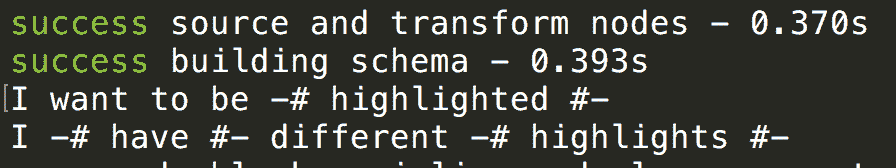
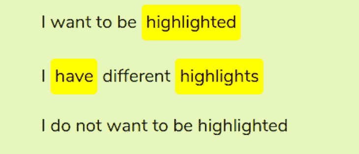

# 如何为你的 Gatsby 博客建立一个 Markdown 插件

> 原文：<https://blog.logrocket.com/how-to-build-a-markdown-plugin-for-your-gatsby-blog/>

自从 [Markdown](https://www.markdownguide.org/) 的出现，写文章(和一般的文本)有了新的转变。在以前，你要么必须直接使用 HTML，要么只能使用在线文本编辑器提供的文本编辑选项。但是现在，任何支持 Markdown 内容的服务都让写作变得更加容易。

Gatsby 和其他几个框架支持 Markdown。这些降价文件可用于创建网页或博客。此外，Gatsby 允许开发人员创建称为插件的工具，这些工具可以连接到 Markdown 文件并修改输出的 HTML。

在本文中，您将学习如何为您的 Gatsby 博客构建一个 Markdown 插件。例如，我们将构建一个文本突出显示插件，这样当它找到您在文本周围定义的特定语法时，它会将其处理成一个样式化的 HTML，将文本显示为突出显示。这是我的网站上的插件[——特别是文字“分享代码和功能”。](https://dillionmegida.com/p/react-render-props-simplified/)

请注意，您并不局限于本文中使用的示例。这篇文章的目的只是教你如何构建一个 Markdown 插件。您可以使用本文中的知识来构建其他优秀的插件，并为其他开发人员开源。

## 盖茨比和博客的降价

Markdown 提供了一种特殊的语法，可以方便地创建文档。减价内容的结果通常是 HTML，但根据使用的工具不同，结果也可能不同。

例如，下面的 HTML…

```
<h2>I am a header</h2>
<p>I am a paragraph</p>
<code>
   <pre>
     console.log('I am JavaScript')
  </pre>
</code>


```

…可通过以下降价内容实现:

```
# I am a header

I am a paragraph

```
console.log('I am JavaScript')
```

[!This is not an image](https://google.com)
```

因为处理 Markdown 内容后的最终结果是 HTML，所以使用 Markdown 成为编写常规内容的无缝过程。

Gatsby 是一个静态站点生成器，用于创建不同的 web 应用程序，包括博客。该框架支持 Markdown，这使得开发人员可以更容易地在 Markdown 文件中编写博客，并将其转换为成熟的页面。本文并不关注 Gatsby 如何创建这些页面，所以查看他们的[文档](https://www.gatsbyjs.com/blog/2017-07-19-creating-a-blog-with-gatsby/)以获得更多信息。

## 降价的抽象语法树

一般来说，所有的编程语言都有语法。任何语言的语法都显示了该语言是如何工作的以及它所支持的关键字。这种语法可以用一棵[抽象语法树](https://en.wikipedia.org/wiki/Abstract_syntax_tree) (AST)来表示，它显示了从源代码中捕获的树中的每个节点。

降价文件有自己的抽象语法树。您可以在这个 [live AST explorer](https://astexplorer.net/) 中进行试验。该树显示了 Markdown 文件中每个关键字的含义以及它们如何映射到相应的 HTML 元素。

让我们回顾一下下面的降价文本:

```
# I am a header
I am a paragraph
```
console.log('I am JavaScript')
``` 
```

现在，这是来自实时浏览器的上述降价文件的语法树:

```
{
  "type": "root",
  "children": [
    {
      "type": "heading",
      "depth": 1,
      "children": [
        {
          "type": "text",
          "value": "I am a header",
        }
      ],
    },
    {
      "type": "paragraph",
      "children": [
        {
          "type": "text",
          "value": "I am a paragraph",
        }
      ],
    },
    {
      "type": "code",
      "lang": null,
      "meta": null,
      "value": "console.log('I am JavaScript')",
    }
  ],
} 
```

请注意，上面列出的第一个 Markdown 文件是为了显示 HTML 的重要部分而总结的，但是您可以在 live viewer 中找到完整的信息。

在这个 Markdown 内容中，树将它的每个部分分解成节点，每个节点有不同的类型、值等等。

## gatsby-transformer-remark，降价修改背后的工具

`[gatsby-transformer-remark](https://www.gatsbyjs.com/plugins/gatsby-transformer-remark/)`是盖茨比团队打造的插件。这个插件的目的是将 Markdown 内容解析成最终的 HTML。该插件使用抽象语法树来实现这一点。

从 Markdown 接收 AST，允许其他插件修改内容。本质上，生成最终的 HTML 是插件和`gatsby-transformer-remark`的共同努力。

## 构建文本高亮插件

就像其他 Markdown 插件一样，文本高亮插件将挂钩 Markdown 文件，并将部分(或全部)内容修改为 HTML，这些内容将包含在最终的 HTML 中。

对于这个插件，我们希望连接到 Markdown 文件，获取一个匹配我们将要定义的语法的文本或段落，并用一个包含一些样式的元素替换它，使它高亮显示。

实现这一点的手动方法是将元素直接添加到降价内容中:

```
# I am a header
I want <span class='highlight'>this text</span> highlighted. 
```

但是手动将元素添加到 Markdown 文件中，以突出显示文章中的每一个文本，或者跨几篇文章，可能会很繁琐。那么，为什么不让它变得更简单呢？

在我们的插件中，我们将使用以下语法:

`I want -# this text #- highlighted`

注意`-#`和`#-`是开始和结束符号。在这里，我们的插件将挑选每一个匹配该语法的字符串，并将其格式化为:

```
I want <span class="highlight">this text</span> 
```

或者

```
I want <span style="...styles">this text</span> 
```

如果使用类名方法，类名可以在全局样式表中使用。如果使用 style 方法，它将应用内联样式。

## 设置环境

理想情况下，这个插件将是一个独立的项目。然而，我们不想不断地部署到 [npm](https://www.npmjs.com/) ，更新项目中已安装的插件，并测试直到我们满意为止。

谢天谢地，Gatsby 允许使用[本地插件](https://www.gatsbyjs.com/docs/creating-a-local-plugin/)。这意味着插件将与 Gatsby 项目共存，我们可以直接测试它。

如果你有一个已经存在的 Gatsby 博客来测试这个插件，那么你已经准备好了。如果没有，快速克隆这个 [repo (Gatsby starter blog)](https://www.gatsbyjs.com/starters/gatsbyjs/gatsby-starter-blog) 并安装所需的依赖项。

下一步是在项目的根目录下创建一个插件文件夹。当 Gatsby 构建它的文件时，在检查`node_modules`之前，它首先检查这个文件夹以查看指定的插件是否存在。

在插件文件夹中，创建一个以插件命名的新文件夹。我叫它`gatsby-remark-text-highlighter`。

在您的终端中，将您的当前目录更改到该文件夹并运行`npm init`。回答问题，您将获得为您创建的`package.json`。

* * *

### 更多来自 LogRocket 的精彩文章:

* * *

为了让这个插件工作，我们需要两个依赖项: [unist-util-visit](https://www.npmjs.com/package/unist-util-visit) 和 [< mdast-util-to-string](https://www.npmjs.com/package/mdast-util-to-string) 。前者用于访问(挂钩)所有节点，就像我们在 Markdown 文件中的抽象语法树中看到的那样，而后者用于获取节点的文本内容。

运行:

```
npm install unist-util-visit mdast-util-to-string --save 
```

在 Gatsby 中，你必须添加每个用于`gatsby-config.js`的插件。因此:

```
module.exports = {
  plugins: [
    {
      resolve: `gatsby-transformer-remark`,
      options: {
        plugins: [
          {
            resolve: `gatsby-remark-text-highlighter`,
            options: {}
          },
        ]
      }
    }
  ]
} 
```

这个插件是作为`gatsby-transformer-remark`的一个插件添加的，而不是在根目录，因为，如前所述，这个插件是由它驱动的。

## 开发插件

创建`index.js`文件并添加以下内容:

```
const visit = require("unist-util-visit")
const toString = require("mdast-util-to-string")

module.exports = ({ markdownAST }, options) => {
  const {useDefaultStyles = true, className = ""} = options;

  visit(markdownAST, "paragraph", (node) => {
    // do something with paragraph
  });
} 
```

使用我们从这个插件中公开的函数来修改降价内容。它传递一个充满选项的对象(我们只关心`markdownAST`)和一个`options`(在`gatsby-config.js`中指定)作为参数。

从`options`参数中，我们描述了两个属性:`useDefaultStyles`，它指定是否应该使用这个插件创建的样式，以及`className`，它指定将被添加到元素中的类。

通过`visit`(从`unist-util-visit`导出的函数)，我们可以访问 Markdown 文件的`markdownAST` (Markdown 抽象语法树)中的所有段落，并应用回调函数。回调函数被赋予节点参数。

接下来的步骤是定义语法。Regex 将用于语法，以便我们可以选择匹配它的字符串。以下是正则表达式:

```
const syntax = /-#.*#-/ 
```

上面的正则表达式将匹配出现的每个文本，如下所示:

```
-# The cat caught the mouse #-
I want to be -# highlighted #-. I -# mean #- it. 
```

综上所述，我们有:

```
const visit = require("unist-util-visit")
const toString = require("mdast-util-to-string")

module.exports = ({ markdownAST }, options) => {
  visit(markdownAST, "paragraph", (node) => {
    let para = toString(node)
    const syntax = /-#((?!#-).)*#-/ig
    const matches = para.match(syntax);

    if (matches !== null) {
      console.log(para);
    }
  });
} 
```

正则表达式匹配任何有`-#`和`#-`但中间没有`-#`的字符串。`(?!#-)`将有助于挑选出高亮单词的多个实例。

由于`visit`访问每个段落，我们需要添加子句`matches !== null`来确保我们只修改我们需要的段落。

为了测试这一点，打开您的 Gatsby 博客，快速创建一个新的 Markdown 文件(或一个现有的文件)并添加:

```
I want to be -# highlighted #-

I -# have #- different -# highlights #-

I do not want to be highlighted 
```

现在在你的终端中运行`gatsby` develop，你会看到`I want to be -# highlighted #-`和`I -# have #- different -# highlights #-`登录到终端。下面是截图:



Screenshot of texts logged to the console that match the syntax.

既然我们已经确认我们获取了正确的文本，接下来要做的就是格式化它。下面是剩余的代码:

```
const visit = require("unist-util-visit")
const toString = require("mdast-util-to-string")
module.exports = ({ markdownAST }, options) => {
  const {useDefaultStyles = true, className = ""} = options;
  visit(markdownAST, "paragraph", node => {
    let para = toString(node)

    const syntax = /-#((?!#-).)*#-/ig
    const matches = para.match(syntax)

    if (matches !== null) {
      let style = null
      if (useDefaultStyles) {
        style = `
          display:inline-block;
          padding:5px;
          background-color:yellow;
          color:black;
          border-radius: 5px;
        `
      }

      // remove #- and -#
      const removeSymbols = text => text.replace(/-#/g, "").replace(/#-/g, "")

      const putTextInSpan = text =>
        `<span
          ${useDefaultStyles && style ? ` style='${style}'` : ""}
          ${className !== "" ? `class='${className}'` : ""}
        >${removeSymbols(text)}</span>`

      matches.map(match => {
        para = para.replace(match, putTextInSpan(match))
      })
      para = '<p>' + para + '</p>'
      node.type = "html"
      node.children = undefined
      node.value = para
    }
  })
  return markdownAST
} 
```

要使用在最后一个`gatsby develop`之后添加到插件中的新更改，您需要首先运行`gatsby clean`，因为 Gatsby 缓存了插件。

如上面的代码所示:

*   如果`useDefaultStyles`是`true`，则指定内联样式
*   匹配语法的文本放在一个没有符号的`span`元素中
*   映射`matches`数组中的文本，每个匹配语法的文本都放在一个没有符号的 span 元素中
*   如果给`className`一个值，那么`span`元素接收该值作为类
*   `node`的`type`改为 html，`children`未定义，`value`为格式化段落

现在再次运行`gatsby develop`。以下是使用默认样式的网页结果:



Here’s the live view of highlighted text.

## 进一步的步骤

我们也可以应用自定义样式。用`options`属性扩展我们的插件使它更具可重用性。在`gatsby-config`中，添加以下内容:

```
{
  resolve: `gatsby-remark-text-highlighter`,
  options: {
    useDefaultStyles: false,
    className: 'text-highlight'
  } 
```

在全局样式表或附加到博客的任何样式表中，您可以添加如下内容:

```
.text-highlight {
  padding: 10px;
  border-radius: 10px;
  background-color: purple;
  color: white;
} 
```

## 部署插件

您不能将这个插件部署到 npm，因为我已经部署了它，并且因为库必须有唯一的名称。你可以选择用不同的名字命名你的插件，或者，更好的是，构建另一个不存在的插件，就像你对其他 npm 库所做的那样:

```
npm login
npm publish 
```

现在，你的插件可以被任何项目使用。没有人需要在他们的项目中创建一个插件文件夹，因为 Gatsby 将在生产中使用你的插件。

您可以在[源代码](https://github.com/dillionmegida/gatsby-remark-text-highlighter)中找到完整的代码，欢迎您投稿！

## 结论

在本文中，我们了解了什么是 Markdown，以及 Gatsby 如何通过允许我们挂钩并格式化 Markdown 文件来扩展其功能。我们还创建了一个文本高亮插件，展示了创建 Markdown 插件的理想方法。

文本高亮插件可能看起来很简单，但是它应该为你提供足够的洞察力来构建你自己的插件。

在创建[Gatsby-remark-liquid-tags](https://www.gatsbyjs.com/plugins/gatsby-remark-liquid-tags/)时，我也使用了这里列出的方法。如果你愿意，请随时查看并投稿。

## 使用 [LogRocket](https://lp.logrocket.com/blg/signup) 消除传统错误报告的干扰

[](https://lp.logrocket.com/blg/signup)

[LogRocket](https://lp.logrocket.com/blg/signup) 是一个数字体验分析解决方案，它可以保护您免受数百个假阳性错误警报的影响，只针对几个真正重要的项目。LogRocket 会告诉您应用程序中实际影响用户的最具影响力的 bug 和 UX 问题。

然后，使用具有深层技术遥测的会话重放来确切地查看用户看到了什么以及是什么导致了问题，就像你在他们身后看一样。

LogRocket 自动聚合客户端错误、JS 异常、前端性能指标和用户交互。然后 LogRocket 使用机器学习来告诉你哪些问题正在影响大多数用户，并提供你需要修复它的上下文。

关注重要的 bug—[今天就试试 LogRocket】。](https://lp.logrocket.com/blg/signup-issue-free)