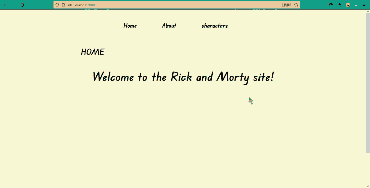
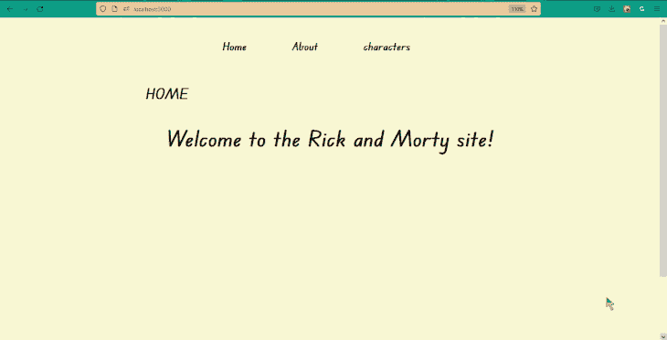
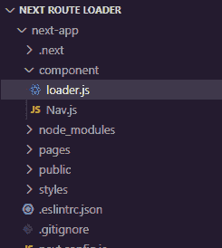
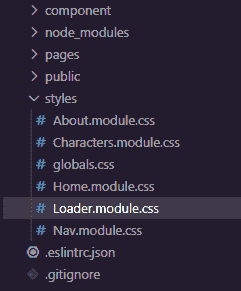
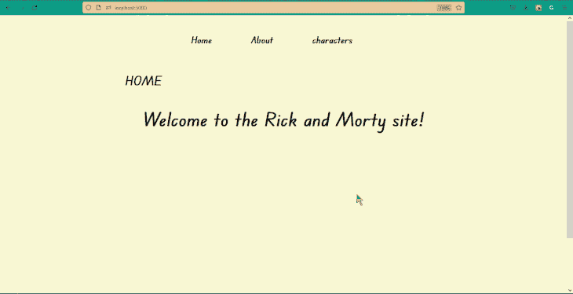
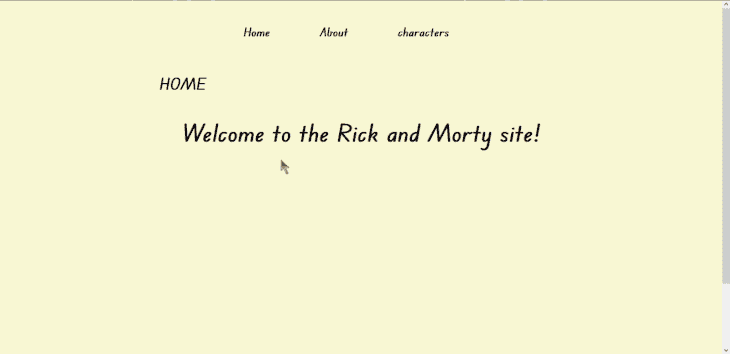
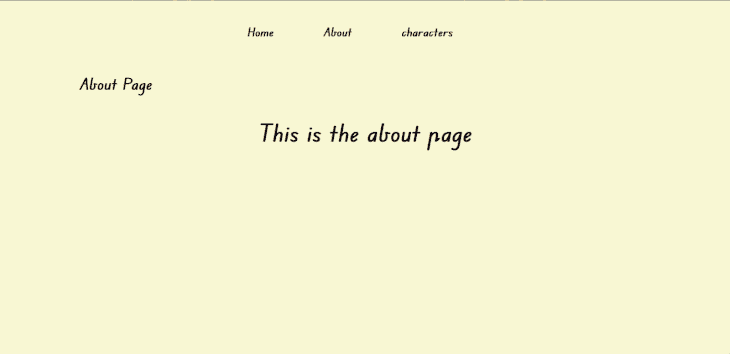
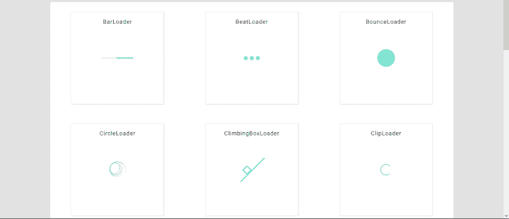
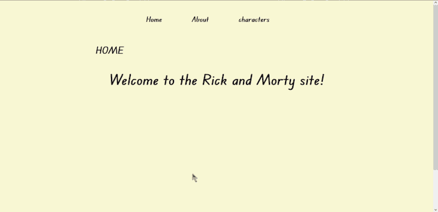

# 如何在 Next.js 中构建进度条指示器

> 原文：<https://blog.logrocket.com/how-to-build-a-progress-bar-indicator-in-next-js/>

在过去几年中，Next.js 进一步确立了其作为基于 React 的最受欢迎的后端框架的地位。最近的几个更新增强或增加了这个框架的现有特性。一个例子是它能够在服务器端和客户端呈现页面，以及它的集成路由系统，这使得这些呈现器之间的导航无缝。

然而，这些渲染器之间的转换并不像您预期的那样平稳。Next.js 需要一点时间在页面之间路由，特别是到服务器端呈现的页面，因为这些页面是根据请求呈现的。每当用户试图转到另一个页面时，网站可能会暂时冻结，这可能会导致糟糕的用户体验。

本教程将通过演示在 Next.js 应用程序中更改路线时如何构建和显示进度条指示器来解决这个问题。我们将使用自定义 CSS 创建一个版本的加载器组件，我们还将展示如何使用第三方库来添加动画。

## 内容

## 先决条件

要跟随本教程，您需要以下内容:

## 什么是 Next.js 路由器事件？

路由器事件是事件监听器，允许我们通过`Router`对象跟踪 Next.js 中的路由更改。该对象提供了一些属性，我们可以使用这些属性来监听 Next.js 路由器中发生的不同事件，并基于这些事件执行某些操作。

例如，如果我们想在每次用户点击链接并导航到另一个页面时将`"route is changing"`记录到控制台，我们可以使用`"routeChangeStart"` **路由器**事件，如下所示:

```
  Router.events.on("routeChangeStart", (url)=>{
    console.log(“route is changing”)
    })  

```

当一条路线开始改变时,`routeChangeStart`事件触发。它返回一个回调函数，我们可以用它来运行代码和动作。正如您在上面的代码中看到的，该事件触发了一个回调函数，该函数将`"route is changing"`字符串记录到控制台。

以下是一些受支持的 Next.js 路由器事件的列表:

*   `routeChangeStart`:当路线开始改变时触发
*   `routeChangeComplete`:路线变更完成时触发
*   `routeChangeError`:当改变路线时发生错误或取消路线装载时触发
*   `beforeHistoryChange`:在改变路由器的路由历史之前触发

访问 [Next.js 文档](https://nextjs.org/docs/api-reference/next/router#routerevents)以了解关于这些路由器事件的更多信息。

## 入门指南

我假设您已经建立了一个 Next.js 项目。如果没有，您可以派生出[示例项目的 CodeSandbox](https://codesandbox.io/s/gallant-browser-obriew?file=/styles/About.module.css) 来跟进。

本教程中使用的示例项目是一个简单的 Next.js 应用程序，基于情景喜剧 *Rick 和 Morty* 。示例应用程序有三个页面:主页、关于和角色。前两个页面是客户端呈现的，而字符页面是服务器端呈现的。



在字符页面中，我们使用`getServerSideProps`函数从 [Rick 和 Morty API](https://rickandmortyapi.com) 获取并显示数据:

```
const Characters = ({ data }) => {
    return (  
        <div className={styles.container}>
        ...
        </div>
    );
}

export default Characters;

export async function getServerSideProps() {
    const delay = (s) => new Promise(resolve => setTimeout(resolve, s))
    const res = await fetch("https://rickandmortyapi.com/api/character")
    await delay(2000)
    const data = await res.json();

    return {
        props: {data}
    }
}

```

字符页面是在初始加载时预先生成的，但是获取请求只有在用户单击路线时才完成。这样，只有当请求完成时，页面的内容才会显示给用户，这可能需要一些时间。



我们将使用 Next.js 路由器事件显示一个进度条指示器，而不是让用户对这几秒钟内发生的事情一无所知。

出于这个原因，我们使用`delay`承诺为获取过程添加了 2s 延迟，如下面的代码所示:

```
const delay = (s) => new Promise(resolve => setTimeout(resolve, s))
 ...
await delay(2000)
 ...

```

当我们进入角色页面时，这个`delay`会给我们时间展示进度指示器。

要完成设置，请在您的终端中运行以下命令来安装两个第三方库，NProgress 和 React Spinners，我们将在本教程的后面使用它们。

```
npm i  --save nprogress react-spinners

```

这些库是动画进度条提供程序；我们将在本文后面详细讨论它们。

## 创建加载器组件

接下来，我们需要创建一个组件来包装进度指示器元素。

首先创建一个组件文件夹，并在其中添加一个`Loader.js`文件。



现在，打开`loader.js`文件并添加以下代码:

```
const Loader = () => {
    return (
        <div className={styles.wrapper}>
            <div className={styles.loader}>

      </div>
        </div>
     );
}

export default Loader;

```

代码包含两个`div`标签、一个`wrappe` r div 和一个嵌套的`loader` div。如果你计划用 CSS 创建一个自定义的进度条指示器，这些元素将会派上用场。

接下来，导航到项目根文件夹中的`styles`文件夹，并为加载器组件创建一个新的 CSS 模块。



在模块内，添加以下代码:

```
.wrapper{
    width: 100%;
    height: 100vh;
    position: absolute;
    top: 0;
    left: 0;
    background-color: rgb(0, 0, 0, 0.3);
    backdrop-filter: blur(10px);
    display: flex;
    justify-content: center;
    align-items: center;
    z-index: 99;
}

/*code for custom loading icon*/

.loader{
    border: 10px solid #f3f3f3;
    border-radius: 50%;
    border-top: 10px solid #505050;
    width: 60px;
    height: 60px;
    animation: spin 2s linear infinite;
}

@keyframes spin {
    0% { transform: rotate(0deg); }
    100% { transform: rotate(360deg); }
}

```

上面的代码将使`wrapper` div 使用背景过滤器占据整个视口，并将每个子元素(在本例中为`loader` div)置于`wrapper`的中心。

***注意，***T5`loader`*选择器内的 CSS 属性都是为自定义 CSS 进度条指示器；如果您更喜欢使用 NProgress 或 React Spinners 库，请忽略这一点*

现在，回到`loader.js`组件，在代码块的顶部导入 CSS 模块，如下所示:

```
import styles from '../styles/Loader.module.css'

```

接下来，我们将继续创建路由器事件。

## 创建路由器事件(`routeChangeStart`、`routeChangeComplete`和`routeChangeError`)

由于我们将在每个页面路径上显示进度条指示器，而不是在一个特定的路径上，我们将直接在`_app.js`组件中调用路由器事件监听器。

* * *

### 更多来自 LogRocket 的精彩文章:

* * *

如果您的项目没有`_app.js`组件，请转到`pages`文件夹，创建一个新的`_app.js`文件，并添加以下代码:

```
import '../styles/globals.css'

function MyApp({ Component, pageProps }) {
  return ( <Component {...pageProps} /> )
}

export default MyApp

```

Next.js 将使用`_app.js`组件来初始化我们项目中的页面。我们可以覆盖它并控制初始化。

接下来，在`_app.js`组件中导入`Router`对象、`useState`和`useEffect`钩子，如下所示:

```
import Router from 'next/router'
import { useState, useEffect } from 'react';

```

随着`Router`对象的导入，我们可以开始声明事件了。

我们希望能够跟踪路线何时开始改变、已经改变，以及在改变路线或取消路线装载时何时发生错误。因此，我们将分别订阅`routeChangeStart`、`routeChangeComplete`和`routeChangeError`事件。

首先，使用我们之前导入的`useState`钩子创建一个`isLoading`状态变量，并传递给它一个默认的布尔值`false`。

```
  const [isLoading, setIsLoading] = useState(false);

```

然后，调用`useEffect`钩子，并在其回调函数中添加`routeChangeStart`事件监听器。

```
useEffect(() => {
    Router.events.on("routeChangeStart", (url)=>{

    });

}, [Router])

```

接下来，在事件的回调函数中将`isLoading`状态变量的值设置为`true`，如下所示:

```
Router.events.on("routeChangeStart", (url)=>{
    setIsLoading(true)
  });   

```

现在，在第一个事件监听器下面再创建两个`Router`事件监听器，一个用于`routeChangeComplete`，一个用于`routeChangeError`:

```
  Router.events.on("routeChangeComplete", (url)=>{
    setIsLoading(false)
  });

  Router.events.on("routeChangeError", (url) =>{
    setIsLoading(false)
  }); 

```

当路线完全改变或发生错误时，`routeChangeComplete`和`routeChangeError`事件将负责结束由`routeChangeStart`事件发起的装载会话。

完成上述步骤后，您的`useEffect`函数应该如下所示:

```
useEffect(() => {
    Router.events.on("routeChangeStart", (url)=>{
      setIsLoading(true)
    });

    Router.events.on("routeChangeComplete", (url)=>{
      setIsLoading(false)
    });

    Router.events.on("routeChangeError", (url) =>{
      setIsLoading(false)
    });

  }, [Router])

```

现在我们有了一个对 Next.js 路由器内部发生的不同事件做出反应的状态。

接下来，我们将导入我们之前创建的加载器组件，并基于`isLoading`变量的状态呈现它。

```
import Router from 'next/router'
import { useState, useEffect } from 'react';
import Loader from '../component/loader';

function MyApp({ Component, pageProps }) {

  const [isLoading, setIsLoading] = useState(false);

  useEffect(() => {

    ...

  }, [Router])

  return (
    <>
      {isLoading && <Loader/>}
      <Component {...pageProps} />
    </>
  )
}

export default MyApp

```

我们在这里做的事情是不言自明的。我们导入加载器组件，并有条件地将其呈现给视图。

如果您使用我们之前创建的定制 CSS 加载器，当您尝试在应用程序中路由时，您应该会看到类似于下面显示的加载屏幕。



## 添加动画

上一节中显示的进度指示器是使用自定义 CSS 构建的。现在，让我们尝试使用两个库添加动画:NProgress 和 React Spinners。

### 使用进度

NProgress 是一个轻量级的库，它让我们在视口顶部显示真实的涓滴动画来指示加载进度，而不是使用动画加载图标。

要使用 NProgress，在`_app.js`组件中导入`NProgress`函数，如下所示:

```
import NProgress from 'nprogress'

```

这个函数有一组方法，我们可以用来显示和配置进度条动画。以下是一些可用的方法:

*   `start`:显示进度条
*   `set`:设定一个百分比
*   `inc`:增加一点
*   `done`:完成进度
*   `configure`:配置首选项

参见 [NProgress 官方文档](https://ricostacruz.com/nprogress/)了解这些方法的更多信息。

接下来，在`routeChangeStart`和`routeChangeComplete`事件回调中分别调用函数的`start()`和`done()`方法:

```
Router.events.on("routeChangeStart", (url)=>{
    Nprogress.start()
  })

Router.events.on("routeChangeComplete", (url)=>{
      Nprogress.done(false)
    });

```

最后，我们将通过下面的 CDN 链接将 NProgress 相关的 CSS 添加到我们的项目中:

```
<link rel="stylesheet" href="https://cdnjs.cloudflare.com/ajax/libs/nprogress/0.2.0/nprogress.min.css" integrity="sha512-42kB9yDlYiCEfx2xVwq0q7hT4uf26FUgSIZBK8uiaEnTdShXjwr8Ip1V4xGJMg3mHkUt9nNuTDxunHF0/EgxLQ==" crossorigin="anonymous" referrerpolicy="no-referrer" />  

```

为此，从 Next.js 导入`Head`组件，并在声明中嵌套 CDN 链接，如下所示:

```
  ...
import Head from "next/head"

function MyApp({ Component, pageProps }) {

  ...

  return (
    <>
      <Head>
        <link rel="stylesheet" ... />
      </Head>
      <Component {...pageProps} />
    </>
  )
}

```

如果保存进度并在浏览器中单击某条路线，您应该会在视口顶部看到一个进度条和一个旋转图标，如下所示。



要禁用视窗右上角的旋转图标，调用`configure`方法，并向其传递一个具有`showSpinner`属性且值设置为`false`的对象。

```
Nprogress.configure({showSpinner: false});

```

现在，如果您保存代码并返回浏览器，旋转图标应该会消失。



### 使用反应微调器

[React Spinners](https://www.davidhu.io/react-spinners/) 是一个轻量级的库，由一组基于 React 的进度指示器组成。该库提供了各种动画加载图标，可用于指示加载进度。



进度指示器作为组件从库中公开。这些组件接受我们可以用来定制它们的速度、大小、装载状态和颜色的道具。

要使用 React 微调器，请返回到`loader.js`组件并导入一个微调器组件，如下所示:

```
import {HashLoader} from 'react-spinners'

```

您可以从[产品页面](https://www.davidhu.io/react-spinners/)中选择和配置您喜欢的微调器。

接下来，将 spinner 组件嵌套在`wrapper` div 中并保存您的进度。

```
<div className={styles.wrapper}>
      <HashLoader
       color="#eeeeee"
       size={80}
       />
</div>

```

现在，如果你回到浏览器，当你在页面之间浏览时，你应该会看到一个非常生动的加载图标。



## 结论

在本文中，我们介绍了 Next.js 路由器事件，并演示了如何使用它们来跟踪路由活动和显示进度条指示器。

我们演示了如何创建一个加载器组件，该组件根据路由器发出的事件呈现一个进度条指示器，还使用 NProgress 和 React Spinners 库添加了定制的加载器。

## [LogRocket](https://lp.logrocket.com/blg/nextjs-signup) :全面了解生产 Next.js 应用

调试下一个应用程序可能会很困难，尤其是当用户遇到难以重现的问题时。如果您对监视和跟踪状态、自动显示 JavaScript 错误、跟踪缓慢的网络请求和组件加载时间感兴趣，

[try LogRocket](https://lp.logrocket.com/blg/nextjs-signup)

.

[](https://lp.logrocket.com/blg/nextjs-signup)[](https://lp.logrocket.com/blg/nextjs-signup)

LogRocket 就像是网络和移动应用的 DVR，记录下你的 Next.js 应用上发生的一切。您可以汇总并报告问题发生时应用程序的状态，而不是猜测问题发生的原因。LogRocket 还可以监控应用程序的性能，报告客户端 CPU 负载、客户端内存使用等指标。

LogRocket Redux 中间件包为您的用户会话增加了一层额外的可见性。LogRocket 记录 Redux 存储中的所有操作和状态。

让您调试 Next.js 应用的方式现代化— [开始免费监控](https://lp.logrocket.com/blg/nextjs-signup)。