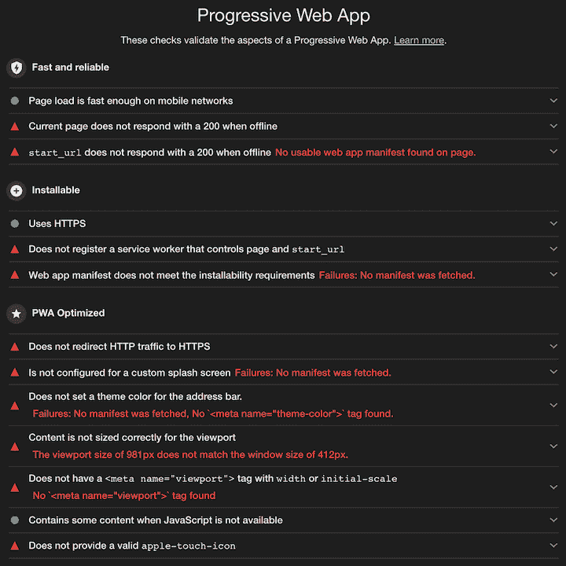
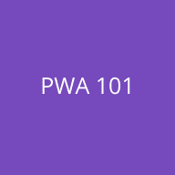
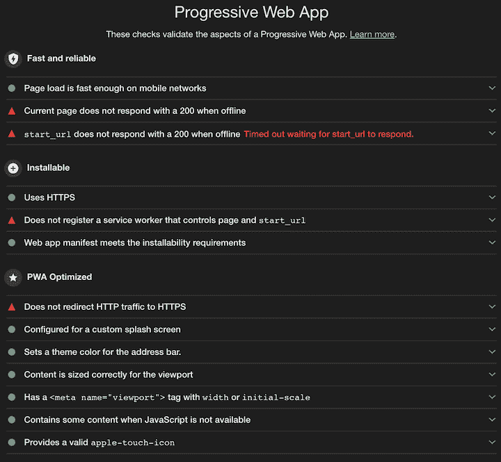
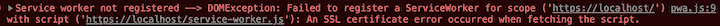
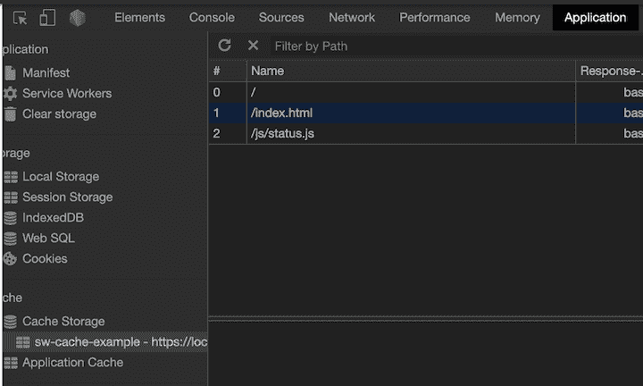
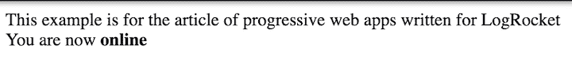
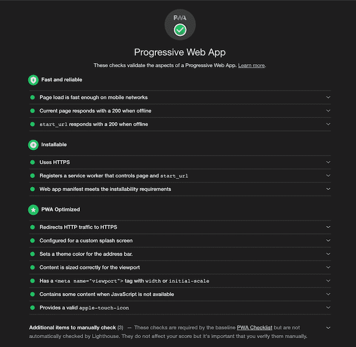

# 如何用 Node.js - LogRocket Blog 构建渐进式 web app (PWA)

> 原文：<https://blog.logrocket.com/how-to-build-a-progressive-web-app-pwa-with-node-js/>

形象化渐进式 web 应用程序(PWA)的一种方法是将其与行为和感觉像移动应用程序的 web 技术进行比较。例如，大多数移动应用程序都有闪屏来通知用户它正在加载，离线时保持某种功能，并快速工作，因为用户需要的大部分资源在他们下载应用程序时已经在手机上了。

在本教程中，我们将演示如何构建一个具有离线功能并符合所有 Google Lighthouse 检查的 PWA。

## 项目设置

在我们开始之前，让我们概述一些要求。请注意，这些要求只是为了本教程的目的；您可以混合、搭配和交换它们中的任何一种，以满足您的需求和目标。

对于这个项目，您需要:
–node . js 来运行服务器
–Express 来运行 HTTP 服务器
–node mon 来调试服务器
–Chrome 来检查网站并调试您的 PWA
–OpenSSL 来生成自签名证书(稍后将详细介绍)

### 文件夹

```
project-folder
  |_certs
  |_public
    |_images
    |_js
```

### 文件

```
project-folder
  |_certs
  |_public
    |_images
    |_js
      |_pwa.js
    |_index.html
  |_package.json
  |_server.js

```

### `package.json`

用`npm init`生成`package.json`并填空题。把包裹拿走，然后前往`npm install express nodemon`。在`package.json`中，添加剧本`"server-debug": "nodemon --inspect server.js"`。

### `server.js`

创建一个基本的 HTTP 服务器，以便在浏览器中连接到本地主机后生成您的`index.html`。

```
const express = require('express')
const path = require('path')

const httpPort = 80

const app = express()

app.use(express.static(path.join(__dirname, 'public')))

app.get('/', function(req, res) {
  res.sendFile(path.join(__dirname, 'public/index.html'))
})

app.listen(httpPort, function () {
  console.log(`Listening on port ${httpPort}!`)
})

```

### `public/index.html`

```
<html>
  <body>
    <span>This example is for the article of progressive web apps written for LogRocket</span>
    <br>
    <span>You are now</span> <span><b class="page-status">online</b></span>
    <script src="/js/pwa.js"></script>
  </body>
</html>

```

### `public/js/pwa.js`

```
document.addEventListener('DOMContentLoaded', init, false);
function init() {
  console.log('empty for now')
}

```

在浏览器中，访问`[http://localhost](http://localhost)`以查看仅包含初始信息的页面。`Right-click→inspect`在控制台上查看您的日志。

## 建设公共工程部

现在你已经建立了一个基本的页面，你如何让谷歌把它识别为一个功能齐全的 PWA？

再次检查并选择审计选项卡，然后选择渐进式 Web 应用程序，并运行审计。您应该会得到这样的结果:



如你所见，大部分结果是红色的。我们将继续努力，直到每一个都变成绿色。

有些已经是绿色的了，因为:

*   加载页面不到 10 秒钟
*   即使 JavaScript 不可用，页面也会显示一些文本
*   因为我们使用的是本地主机，所以即使没有 HTTPS，页面也会被检查

## 添加清单

添加清单将解决可安装性标准以及缺少闪屏的问题。

### `public/js/pwa.webmanifest`

```
{
  "name": "Progressive Web App example",
  "short_name": "pwa-tutorial",
  "description": "Progressive Web App example to be used in conjuction with the article in LogRocket",
  "icons": [
    {
      "src": "/../images/splash-screen.png",
      "sizes": "512x512",
      "type": "image/png"
    }
  ],
  "start_url": "/",
  "display": "fullscreen",
  "theme_color": "#764ABC",
  "background_color": "#764ABC"
}

```

### `public/index.html`

```
<html>
  <head>
    <link rel="manifest" href="/js/pwa.webmanifest">
  </head>
  <body>
    <span>This example is for the article of progressive web apps written for LogRocket</span>
    <br>
    <span>You are now</span> <span><b class="page-status">online</b></span>
    <script src="/js/pwa.js"></script>
  </body>
</html>

```

### `public/images/splash-screen.png`

您还需要在 images 文件夹中添加一个 512×512 的图像。称之为`splash-screen.png`。


现在，与清单和闪屏相关联的红色复选标记应该是绿色的。

当用户在他们的手机上打开 PWA，按下“添加到主屏幕”，并使用下载到他们手机上的应用程序打开 PWA 时，这个闪屏开始播放。

## 优化您的 PWA

让我们继续进行简单的检查，例如主题颜色、显示应用程序何时在 iOS 设备上使用的图标，以及确保应用程序响应的视口。

### `public/index.html`

```
<html>
  <head>
    <link rel="manifest" href="/js/pwa.webmanifest">
    <link rel="apple-touch-icon" href="/images/apple-touch.png">
    <meta name="viewport" content="width=device-width, initial-scale=1">
    <meta name="theme-color" content="#764ABC"/>
  </head>
  <body>
    <span>This example is for the article of progressive web apps written for LogRocket</span>
    <br>
    <span>You are now</span> <span><b class="page-status">online</b></span>
    <script src="/js/pwa.js"></script>
  </body>
</html>

```

### `public/images/apple-touch.png`

下面是 iOS 设备上显示的图标。应该是 192×192。



完成这些更改后，再次运行 Lighthouse。你应该会看到更多的绿色标记。



在 PWA 优化下仍有一个红色标记:所有 PWA 必须与 HTTPS 一起使用。这个需求要求使用诸如服务人员之类的技术来确保页面是本地主机还是 HTTPS。

我通常通过在反向代理上添加 SSL 来消除这个错误。这意味着我总是在本地将该标准标记为红色，但出于本教程的目的——只是为了满足看到所有绿色检查——我们将生成一个自签名证书，并将服务器更改为重定向到 HTTPS。

要生成自签名证书，请转到`certs`文件夹，并在命令行上运行以下命令。

```
openssl req -x509 -out localhost.crt -keyout localhost.key \
  -newkey rsa:2048 -nodes -sha256 \
  -subj '/CN=localhost' -extensions EXT -config <( \
   printf "[dn]\nCN=localhost\n[req]\ndistinguished_name = dn\n[EXT]\nsubjectAltName=DNS:localhost\nkeyUsage=digitalSignature\nextendedKeyUsage=serverAuth")

```

这将创建您丢失的文件。现在你可以更新你的服务器了。

### `server.js`

```
const express = require('express')
const path = require('path')
const fs = require('fs')
const https = require('https')

const httpPort = 80
const httpsPort = 443
const key = fs.readFileSync('./certs/localhost.key');
const cert = fs.readFileSync('./certs/localhost.crt');

const app = express()
const server = https.createServer({key: key, cert: cert }, app);

app.use((req, res, next) => {
  if (!req.secure) {
    return res.redirect('https://' + req.headers.host + req.url);
  }
  next();
})

app.use(express.static(path.join(__dirname, 'public')))

app.get('/', function(req, res) {
  res.sendFile(path.join(__dirname, 'public/index.html'))
})

app.listen(httpPort, function () {
  console.log(`Listening on port ${httpPort}!`)
})

server.listen(httpsPort, function () {
  console.log(`Listening on port ${httpsPort}!`)
})

```

我们正在做的是在端口 80 (HTTP)上创建一个服务器，在端口 443 (HTTPS)上创建一个服务器。每当您尝试使用 [http://localhost](http://localhost) 访问 localhost 时，http 就会被触发，中间件会检查连接(HTTPS)是否安全。如果不是，那么它会按照预期进行重定向。

下一步是让应用程序即使在失去连接的情况下也能工作。为此，我们将使用服务人员。

## 服务人员

一个[服务工作器](https://blog.logrocket.com/every-website-deserves-a-service-worker/)是一段 JavaScript 代码，它处理您选择保存以备将来请求的资产和数据的缓存。

要让服务人员正常工作，您必须遵守一些规则:

```
- It only works with valid HTTPS or http://localhost
- It only grabs requests within its scope
- It only has access to the files on its folder or “below”

```

为了扩大范围，想象下面的结构。

```
/public
  |_drinks
    |_drinks-service-worker.js
    |_drinks.js
    |_coffee
      |_coffee.js
      |_coffee-service-worker.js
    |_tea
      |_tea.js
      |_tea-service-worker.js

```

对于这个例子，茶和咖啡服务人员只有在调用他们各自文件夹中的文件时才会触发，例如`tea.js`或`coffee.js`。另一方面，不管你叫什么，饮料服务人员都会被触发；它的范围是它的文件夹和“下面”中的所有内容

因为它是一个工作者，所以它不能访问 DOM——这意味着，在一个服务工作者文件中，你不能访问任何东西，比如说，`document.querySelector`。

要注册您的员工，首先检查浏览器是否兼容。如果是，添加注册和错误函数。

### `public/js/pwa.js`

```
document.addEventListener('DOMContentLoaded', init, false);
function init() {
  if ('serviceWorker' in navigator) {
    navigator.serviceWorker.register('/service-worker.js')
      .then((reg) => {
        console.log('Service worker registered -->', reg);
      }, (err) => {
        console.error('Service worker not registered -->', err);
      });
  }
}

```

### `public/service-worker.js`

```
self.addEventListener('install', function(event) {
  console.log('used to register the service worker')
})

self.addEventListener('fetch', function(event) {
  console.log('used to intercept requests so we can check for the file or data in the cache')
})

self.addEventListener('activate', function(event) {
  console.log('this event triggers when the service worker activates')
})

```

对于您的服务人员，您不需要其他事件，但是为了方便起见，它们是`message`、`sync`和`push`。

因为安装是当您尝试注册一个软件时触发的第一件事，所以将您的事件更改为以下内容，并指定您想要保存在缓存中的文件。

```
const CACHE_NAME = 'sw-cache-example';
const toCache = [
  '/',
  '/index.html',
];

self.addEventListener('install', function(event) {
  event.waitUntil(
    caches.open(CACHE_NAME)
      .then(function(cache) {
        return cache.addAll(toCache)
      })
      .then(self.skipWaiting())
  )
})

```

添加`skipWaiting`用于更新软件时，以避免用户离开页面。

要查看您的服务人员，请再次检查页面。在 Chrome DevTools 中，在应用程序选项卡中，您可以看到您的服务人员的当前状态，将页面设置为离线以进行测试(剧透:它还不会做任何事情)。检查当前缓存，如果要重新启动，请清除所有内容。

您可能还记得，服务人员需要有效的 HTTPS 证书。因此，您可能会发现以下错误。



避免这种情况的一种方法是通过命令行运行 Chrome，并为 [https://localhost](https://localhost) 添加一个标志。

```
/Applications/Google\ Chrome.app/Contents/MacOS/Google\ Chrome --user-data-dir=/tmp/foo --ignore-certificate-errors --unsafely-treat-insecure-origin-as-secure=https://localhost

```

这应该会产生一个更令人愉快的记录。


每当我们更新我们的服务人员时，我们都希望旧的服务人员被删除，而不是将他们留在客户端的浏览器中。转到您的`activate`事件，将其更改为以下内容。

```
self.addEventListener('activate', function(event) {
  event.waitUntil(
    caches.keys()
      .then((keyList) => {
        return Promise.all(keyList.map((key) => {
          if (key !== CACHE_NAME) {
            console.log('[ServiceWorker] Removing old cache', key)
            return caches.delete(key)
          }
        }))
      })
      .then(() => self.clients.claim())
  )
})

```

这样可以确保旧的服务人员被删除，并要求您新安装的软件从现在开始使用。

那就剩下我们去取了。我们还没有使用我们的缓存文件，所以是时候更新我们的 fetch 事件了。

```
self.addEventListener('fetch', function(event) {
  event.respondWith(
    fetch(event.request)
      .catch(() => {
        return caches.open(CACHE_NAME)
          .then((cache) => {
            return cache.match(event.request)
          })
      })
  )
})

```

这将检查页面上发出的每个请求。如果在缓存中找到了匹配项——以`localhost/`为例，因为我们已经缓存了它——它将使用缓存的版本。

在这种情况下，`/`就是`index.html`文件，它将包含其他资源，比如`/js/pwa.js`。这不在您的缓存中，因此将向服务器发出一个普通请求来获取该文件的依赖项。

我们可以在缓存中存储尽可能多的内容，但是请记住，每个浏览器都有一个很大的限制。以我的经验来看，安全值不超过 50MB，这在 web 上，是相当多的。

这三个事件都完成后，就应该创建一个文件，以便在客户端失去连接并使用纯服务人员时，将页面状态从 online 更改为 offline。

### `public/js/status.js`

```
document.addEventListener('DOMContentLoaded', init, false);

function init() {
  if (!navigator.onLine) {
    const statusElem = document.querySelector('.page-status')
    statusElem.innerHTML = 'offline'
  }
}

```

### `public/index.html`

```
<html>
  <head>
    <link rel="manifest" href="/js/pwa.webmanifest">
    <link rel="apple-touch-icon" href="/images/apple-touch.png">
    <meta name="viewport" content="width=device-width, initial-scale=1">
    <meta name="theme-color" content="#764ABC"/>
  </head>
  <body>
    <span>This in an examples for here article of progressive web apps that can be found in LogRocket</span>
    <br>
    <span>You are now</span> <span><b class="page-status">online</b></span>
    <script src="/js/pwa.js"></script>
    <script src="/js/status.js"></script>
  </body>
</html>

```

### `public/service-worker.js`

```
const CACHE_NAME = 'sw-cache-example';
const toCache = [
  '/',
  '/index.html',
  '/js/status.js',
];

self.addEventListener('install', function(event) {
  event.waitUntil(
    caches.open(CACHE_NAME)
      .then(function(cache) {
        return cache.addAll(toCache)
      })
      .then(self.skipWaiting())
  )
})

self.addEventListener('fetch', function(event) {
  event.respondWith(
    fetch(event.request)
      .catch(() => {
        return caches.open(CACHE_NAME)
          .then((cache) => {
            return cache.match(event.request)
          })
      })
  )
})

self.addEventListener('activate', function(event) {
  event.waitUntil(
    caches.keys()
      .then((keyList) => {
        return Promise.all(keyList.map((key) => {
          if (key !== CACHE_NAME) {
            console.log('[ServiceWorker] Removing old cache', key)
            return caches.delete(key)
          }
        }))
      })
      .then(() => self.clients.claim())
  )
})

```

上面的代码添加了一个状态文件来检查浏览器是否在线，如果不在线，就改为离线。我们在软件的`index.html`和缓存中都包含了这个文件，所以它可以离线使用。

要全部尝试，重新加载页面，在 DevTools 应用程序选项卡上，查看缓存中的文件。



如果连接正常，您应该会看到以下内容:



如果选择脱机选项，您应该会看到状态发生变化。


您应该会在控制台上看到一些错误，因为我们没有添加清单和其他`index.html`需要的文件——这不会影响离线模式下的任何事情，但如果这很麻烦，您需要做的就是将它们添加到缓存中。

最后，为了确保 Lighthouse 中的一切都是绿色的，在没有离线检查的情况下运行应用程序。您应该会得到类似如下的结果:



祝贺您——您刚刚构建了您的第一个 PWA，所有标准都在 Lighthouse 中检查过了！

## 和睦相处

PWAs 的兼容性无处不在，因为我们谈论的不仅仅是一种技术，而是一个元素生态系统，如服务人员、web 应用清单、通知、推送和添加到主屏幕，其中每一项都有完全不同的兼容性。

也就是说，服务人员通常会得到很好的支持。另一方面，web app manifest 的兼容性要差得多，在本文撰写之时，它还不适用于 Firefox 或 Safari。

总是检查聚合填充，如果没有，确保在浏览器没有实现该技术时有一个后备。

## 公共福利援助的利与弊

Twitter 和阿里巴巴等公司通过[转向 PWAs](https://pwa.rocks/)提高了参与度，其他许多公司也进行了转换。

根据我的经验和个人阅读，以下是与 PWAs 相关的优点和缺点的简短列表。

在优点方面，PWAs:

*   在第一次访问网站后速度很快，因为很多资产都被缓存了
*   易于在现有网站上逐步实现
*   使用更少的数据，因为许多资产被缓存
*   是独立的技术，这意味着当你只需要一两种技术时，你不会被 10 种技术的库所束缚。例如，您可以在不使用通知的情况下使用服务人员

一些缺点:

*   第一次访问页面会很慢，因为它必须将文件和数据下载到缓存中
*   添加到主屏幕功能很少使用，至少据我所知是这样
*   不同浏览器之间的支持差异很大，这取决于您使用的技术。例如，服务人员有很好的支持，但 web 应用程序清单没有，因此从一开始就很难确定哪些是可以安全使用的，哪些是需要多填充的

## 结论

实现 PWA 技术值得吗？我会说是的。一个网站，即使离线，也应该有可访问的信息。例如，如果您运行一个新闻网站，您可以让您的用户选择离线查看他们喜爱的新闻，或者在感兴趣的事情发生时通知他们，比如对他们购物车中的商品进行促销。

你对 PWAs 有什么看法？你喜欢更自然的方法吗？你用它造过什么东西吗？

可以在 [GitHub](https://github.com/daspinola/pwa-101) 上参考本教程使用的代码。

## 200 只显示器出现故障，生产中网络请求缓慢

部署基于节点的 web 应用程序或网站是容易的部分。确保您的节点实例继续为您的应用程序提供资源是事情变得更加困难的地方。如果您对确保对后端或第三方服务的请求成功感兴趣，

[try LogRocket](https://lp.logrocket.com/blg/node-signup)

.

[](https://lp.logrocket.com/blg/node-signup)[https://logrocket.com/signup/](https://lp.logrocket.com/blg/node-signup)

LogRocket 就像是网络和移动应用程序的 DVR，记录下用户与你的应用程序交互时发生的一切。您可以汇总并报告有问题的网络请求，以快速了解根本原因，而不是猜测问题发生的原因。

LogRocket 检测您的应用程序以记录基线性能计时，如页面加载时间、到达第一个字节的时间、慢速网络请求，还记录 Redux、NgRx 和 Vuex 操作/状态。

[Start monitoring for free](https://lp.logrocket.com/blg/node-signup)

.