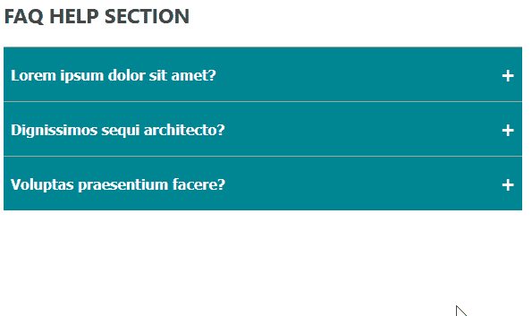
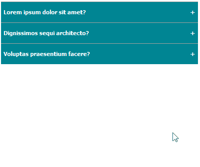
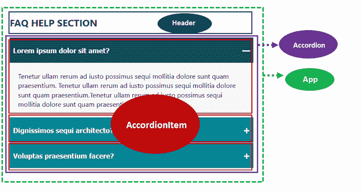
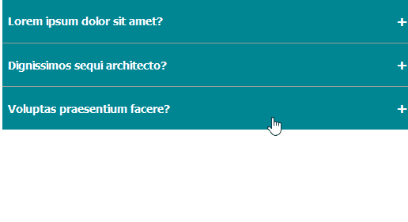

# 如何从零开始构建一个 React 手风琴菜单

> 原文：<https://blog.logrocket.com/how-to-build-a-react-accordion-menu-from-scratch/>

折叠菜单也称为扩展面板，是一种允许用户在 UI 中隐藏和显示内容之间切换的功能。

垂直堆叠的面板包含最重要的信息，当单击面板时，它会展开以显示更多相关内容，这一概念称为渐进式披露。

手风琴式菜单体现了渐进的公开，提供了一个干净的用户界面，最大限度地减少了滚动，特别是在较小的屏幕上，这对移动设备是有益的。

在本教程中，我们将介绍如何通过创建一个 FAQ 应用程序在 React 中从头开始构建一个折叠菜单。我们将创建两种不同的手风琴类型。首先，允许一次一个扩展的选项如下图所示:



另一个允许多重扩展，如下所示:



## 入门指南

在开始本教程之前，确保你已经对 React [和 Node.js 安装](https://reactjs.org/)有了基本的了解。你可以在这里看到[的最终项目](https://ibaslogic.github.io/react-accordion-menu/)。

现在，让我们开始吧。

## 创建新的 React 项目

从您想要保存项目的目录运行以下命令(例如，`cd Desktop`):

```
npx create-react-app react-accordion-menu

```

一旦项目生成，用代码编辑器打开它并运行`npm start`来启动开发服务器。

## React 中的项目架构

为了组织我们的项目，我们将把项目布局分成四个独立的单元，称为组件。

父组件`App`拥有两个直接的子组件`Header`和`Accordion`。`Accordion`捧个人`AccordionItem`。



让我们为每个组件创建一个文件。首先，删除`src`文件夹中的所有文件，并创建一个新的`index.js`文件以防止分页。

接下来，在`src`中创建一个名为`components`的文件夹，并添加以下文件:`App.js`、`Accordion.js`、`AccordionItem.js`和`Header.js`。

在`App.js`中，添加以下起始代码:

```
const App = () => {
  return (
    <div className="container">
      Header and Accordion here
    </div>
  )
}

export default App

```

注意，我们在`div`容器中包含了`className`来将 CSS 样式应用于元素。因此，让我们在`src`文件夹中创建一个`app.css`文件来保存我们的应用 CSS 样式，从这里复制 [CSS 样式，并将其添加到`app.css`文件中。](https://github.com/Ibaslogic/react-accordion-menu/blob/main/startingStyles.css)

现在，进入`src/index.js`文件，并像这样渲染`App`组件:

```
import React from "react";
import ReactDOM from "react-dom";

import App from "./components/App";
// styles
import "./app.css";

ReactDOM.render(
  <React.StrictMode>
    <App />
  </React.StrictMode>,
  document.getElementById("root")
);

```

保存所有文件，并在前端看到呈现的`App`内容。

## 创建折叠式标题组件

`Header`组件只呈现标题内容。因此，让我们简单地在`components/Header.js`文件中添加以下代码:

```
const Header = () => {
  return (
    <h1 className="heading">
      FAQ help section 
    </h1>
  ) 
};

export default Header;

```

保存文件。然后，导入`components/App.js`文件中的组件:

```
import Header from "./Header";

const App = () => {
  return (
    <div className="container">
      <Header />
    </div>
  );
};

export default App;

```

保存文件以查看呈现在前端的标题文本。

## 在 React 中创建折叠组件

设计中的`Accordion`组件持有个人`AccordionItem`。`AccordionItem`是一个保存标题和下拉内容的组件。

要创建标题和下拉内容，在`src`文件夹中创建一个`data.js`文件，并添加以下内容:

```
export const faqs = [
  {
    question: "Lorem ipsum dolor sit amet?",
    answer:
      "Tenetur ullam rerum ad iusto possimus sequi mollitia dolore sunt quam praesentium. Tenetur ullam rerum ad iusto possimus sequi mollitia dolore sunt quam praesentium.Tenetur ullam rerum ad iusto possimus sequi mollitia dolore sunt quam praesentium.",
  },
  {
    question: "Dignissimos sequi architecto?",
    answer:
      "Aperiam ab atque incidunt dolores ullam est, earum ipsa recusandae velit cumque. Aperiam ab atque incidunt dolores ullam est, earum ipsa recusandae velit cumque.",
  },
  {
    question: "Voluptas praesentium facere?",
    answer:
      "Blanditiis aliquid adipisci quisquam reiciendis voluptates itaque.",
  },
];

```

这里，我们创建了一个名为`faqs`的对象数组。我们必须遍历这些数据来显示单个的`faqs`项目。然后，保存文件。

在 React 中，数据通过 props 从父组件流向子组件。在这种情况下，我们在`Accordion`父组件中导入数据，遍历它，并将其传递给`AccordionItem`组件。

打开`components/Accordion.js`文件，添加以下代码以导入数据:

```
import { faqs } from "../data";
import AccordionItem from "./AccordionItem";

const Accordion = () => {
  return (
    <ul className="accordion">
      {faqs.map((faq, index) => (
        <AccordionItem key={index} faq={faq} />
      ))}
    </ul>
  );
};

export default Accordion;

```

现在我们可以通过`faq`属性访问`AccordionItem`组件中的数据。

接下来，我们必须保存文件并将`Accordion`导入到`App.js`文件中:

```
// ...
import Accordion from "./Accordion";

const App = () => {
  return (
    <div className="container">
      {/* ... */}
      <Accordion />
    </div>
  );
};

// ...

```

在`components/AccordionItem.js`文件中，添加以下代码来访问`question`和`answer`道具的数据，以便在我们的 JSX 标记中使用它们:

```
const AccordionItem = ({ faq }) => {
  const { question, answer } = faq;
  return (
    <li className="accordion_item">
      <button className="button">
        {question}
        <span className="control">—</span>
      </button>
      <div className="answer_wrapper">
        <div className="answer">{answer}</div>
      </div>
    </li>
  );
};

export default AccordionItem;

```

再次保存文件后，应用程序的常见问题部分现在看起来像这样:


### 切换折叠面板

让我们从实现一次打开一个面板的逻辑开始。

### 一次展开一个折叠面板

我们可以使用`AccordionItem`的索引来实现这个特性。通过获取被点击的`AccordionItem`组件的索引，我们可以定义一个返回布尔值的逻辑来动态切换面板。我们还将使用该值来设置活动面板的样式。

在我们的设置中，`Accordion`组件保存索引值，因此它可以保存状态来管理和处理点击事件。

* * *

### 更多来自 LogRocket 的精彩文章:

* * *

在`components/Accordion.js`文件中，让我们添加`useState()`:

```
import { useState } from "react";
// ...

const Accordion = () => {

  const [clicked, setClicked] = useState("0");

  return (
    // ...
  );
};

export default Accordion;

```

在`AccordionItem`组件中，我们将向面板添加一个点击事件来触发切换。当用户单击折叠面板时，我们必须接触持有状态的组件来更新状态值，然后更新动态显示或隐藏折叠面板的逻辑。

为此，我们必须了解如何在 React 中引发和处理事件。我们将从`AccordionItem`子组件引发一个事件，并在`Accordion`父组件中处理它。
所以让我们更新一下`components/AccordionItem.js`文件，加入一个`onClick`和`onToggle`道具:

```
const AccordionItem = ({ faq, onToggle }) => {
 const { question, answer } = faq;
 return (
  <li className="accordion_item">
   <button className="button" onClick={onToggle}>
    {question}
    <span className="control">—</span>
   </button>
   <div className="answer_wrapper">
    <div className="answer">{answer}</div>
   </div>
  </li>
 );
};

export default AccordionItem;

```

在`component/Accordion.js`文件中，让我们确保将`onToggle` prop 传递给`<AccordionItem />`并添加`handleToggle`处理程序，这样我们就有了:

```
// ...
const Accordion = () => {
 const [clicked, setClicked] = useState("0");

 const handleToggle = (index) => {
  if (clicked === index) {
   return setClicked("0");
  }
  setClicked(index);
 };

 return (
  <ul className="accordion">
   {faqs.map((faq, index) => (
    <AccordionItem
     onToggle={() => handleToggle(index)}
     // ...
    />
   ))}
  </ul>
 );
};

export default Accordion;

```

`handleToggle`处理程序接收被点击面板的索引并更新状态值。这样，我们可以通过向`AccordionItem`实例添加一个`active`道具来检测哪个面板是活动的，如下所示:

```
<AccordionItem
 onToggle={() => handleToggle(index)}
 active={clicked === index}
 // ...
/>

```

保存文件。在`components/AccordionItem.js`中，让我们使用`active` prop，它返回一个布尔值来动态地将一个类名添加到活动面板中，并对其进行样式化。

```
const AccordionItem = ({ faq, onToggle, active }) => {
 const { question, answer } = faq;
 return (
  <li className={`accordion_item ${active ? "active" : ""}`}>
   <button className="button" onClick={onToggle}>
    {question}
    <span className="control">{active ? "—" : "+"} </span>
   </button>
   <div className={`answer_wrapper ${active ? "open" : ""}`}>
    <div className="answer">{answer}</div>
   </div>
  </li>
 );
};

export default AccordionItem;

```

如果`active`返回`true`，我们添加`active`类来样式化面板，还添加`open`类来显示下拉列表内容。

现在我们可以更新 CSS 文件来容纳动态类名。打开`src/app.css`文件，在底部添加以下样式:

```
/* activate toggle */
.accordion_item.active .button {
  background-color: #105057;
}
.answer_wrapper {
  height: 0;
  overflow: hidden;
}
.answer_wrapper.open {
  height: auto;
}

```

保存所有文件，测试应用程序，它应该工作。



### 实现转换开关

为了使折叠面板平滑地切换，我们将添加一个 CSS `transition`属性来在给定的持续时间内添加平滑的过渡效果。

让我们更新`.answer_wrapper`以包含`transition` CSS 属性:

```
.answer_wrapper {
  /* ... */
  transition: height ease 0.2s;
}

```

如果我们保存文件并测试我们的项目，除非我们将内容`height`从`auto`更改为一个明确的值，比如`100px`:

```
.answer_wrapper.open {
  height: 100px;
}

```

然而，这对于动态内容是不实际的，因为使用固定的高度对于内容来说可能太大或太小。为了纠正这个问题，我们可以使用`scrollHeight`来动态设置下拉内容的高度。

### 使用 DOM `scrollHeight`

DOM `scrollHeight`属性允许我们根据内容的数量来测量元素的高度。

在 React 中，我们可以通过 [`useRef`钩子](https://blog.logrocket.com/usestate-vs-useref/)访问 DOM 元素，以获得其内容高度。

打开`AccordionItem.js`文件，导入`useRef`钩子，像这样:

```
import { useRef } from "react";

const AccordionItem = ({ faq, active, onToggle }) => {
  // ...

  const contentEl = useRef();

  return (
    <li className={`accordion_item ${active ? "active" : ""}`}>
      {/* ... */}
      <div ref={contentEl} className="answer_wrapper">
        <div className="answer">{answer}</div>
      </div>
    </li>
  );
};

// ...

```

注意我们如何将一个`ref`属性传递给包含下拉内容的目标元素。我们还从下拉内容元素中删除了`open`类名。我们现在可以使用`style`属性中的`scrollHeight`动态添加显式内容高度:

```
<div
  ref={contentEl}
  className="answer_wrapper"
  style={
    active
      ? { height: contentEl.current.scrollHeight }
      : { height: "0px" }
  }
> 
  <div className="answer">{answer}</div>
</div>

```

再次保存文件后，从`app.css`文件中删除该样式，因为它现在是多余的:

```
.answer_wrapper.open {
  height: auto;
}

```

现在测试应用程序，看看切换折叠面板时的平滑过渡效果。

### 一次展开多个折叠面板

对于这个 accordion 类型，我们将简单地使用切换布尔状态值的结果。在这里，我们不必像在单个扩展中那样使用 accordion 索引来定义任何逻辑。

`components/Accordion.js`文件看起来会像这样:

```
import { faqs } from "../data";
import AccordionItem from "./AccordionItem";

const Accordion = () => {
  return (
    <ul className="accordion">
      {faqs.map((faq, index) => (
        <AccordionItem key={index} faq={faq} />
      ))}
    </ul>
  );
};

export default Accordion;

```

而`components/AccordionItem.js`看起来会是这样:

```
import { useState } from "react";
import { useRef } from "react";

const AccordionItem = ({ faq }) => {

  const [clicked, setClicked] = useState(false);
  const contentEl = useRef();

  const { question, answer } = faq;

  const handleToggle = () => {
    setClicked((prev) => !prev);
  };

  return (
    <li className={`accordion_item ${clicked ? "active" : ""}`}>
      <button className="button" onClick={handleToggle}>
        {question}
        <span className="control">{clicked ? "—" : "+"} </span>
      </button>

      <div
        ref={contentEl}
        className="answer_wrapper"
        style={
          clicked
            ? { height: contentEl.current.scrollHeight }
            : { height: "0px" }
        }
      >
        <div className="answer">{answer}</div>
      </div>
    </li>
  );
};

export default AccordionItem;

```

保存文件并测试您的项目。你可以在 [CodeSandbox](https://codesandbox.io/s/cocky-brook-7i5eel?file=/src/components/Accordion.js) 上亲自尝试一下。

## 结论

通过学习如何创建平滑过渡的折叠菜单，您现在可以在自己的 React 项目中实现它。

如果你有任何问题或贡献，请在评论区分享。你可以从[这个 GitHub 库](https://github.com/Ibaslogic/react-accordion-menu)中找到项目源代码。

## 使用 LogRocket 消除传统反应错误报告的噪音

[LogRocket](https://lp.logrocket.com/blg/react-signup-issue-free)

是一款 React analytics 解决方案，可保护您免受数百个误报错误警报的影响，只针对少数真正重要的项目。LogRocket 告诉您 React 应用程序中实际影响用户的最具影响力的 bug 和 UX 问题。

[ ](https://lp.logrocket.com/blg/react-signup-general) [  ](https://lp.logrocket.com/blg/react-signup-general) [LogRocket](https://lp.logrocket.com/blg/react-signup-issue-free)

自动聚合客户端错误、反应错误边界、还原状态、缓慢的组件加载时间、JS 异常、前端性能指标和用户交互。然后，LogRocket 使用机器学习来通知您影响大多数用户的最具影响力的问题，并提供您修复它所需的上下文。

关注重要的 React bug—[今天就试试 LogRocket】。](https://lp.logrocket.com/blg/react-signup-issue-free)