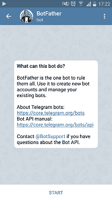
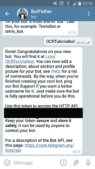
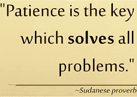

# 如何建立一个电报 OCR 机器人日志火箭博客

> 原文：<https://blog.logrocket.com/how-to-build-a-telegram-ocr-bot/>

## 介绍

在本教程中，我们将构建一个能够执行光学字符识别(OCR)的[电报](https://telegram.org/)聊天机器人。Telegram 是一款基于云的移动和桌面消息应用，专注于安全性和速度。[光学字符识别(OCR)](https://en.wikipedia.org/wiki/Optical_character_recognition) 是以电子方式从图像、视频或任何类型的文档中提取文本的过程。

为了构建这个电报机器人，我们将使用 Node.js 和以下模块 [telegraf](https://github.com/telegraf/telegraf) 、[node-tesserac-ocr](https://github.com/zapolnoch/node-tesseract-ocr)、 [node-ffmpeg](https://github.com/damianociarla/node-ffmpeg) 、 [dotenv](https://github.com/motdotla/dotenv) 和 [Axios](https://github.com/axios/axios) 。

*   是一个电报机器人框架，使得机器人的开发变得简单明了
*   `node-tesseract-ocr`是[宇宙魔方 OCR](https://github.com/tesseract-ocr/tesseract) API 的 Node.js 包装器。`Tesseract`是一个 OCR 引擎，能够从各种媒体格式中提取文本。我们将使用这个模块从图像中提取文本
*   `node-ffmpeg`是节点的 [FFmpeg](https://github.com/FFmpeg/FFmpeg) 模块。这个库提供了一组函数和实用程序来抽象 FFmpeg 的命令行用法。FFmpeg 是处理多媒体内容(如音频、视频、字幕和相关元数据)的库和工具的集合。我们将使用这个模块从视频中提取一帧，这样我们就可以使用 Tesseract 从该帧中提取文本
*   `dotenv`是一个 Node.js 模块，将环境变量从`.env`文件加载到`process.env`中。我们将使用这个模块来存储我们的 bot 凭证
*   `axios`是一个为浏览器和 Node.js 提供基于 promise 的 HTTP 客户端的模块。我们将使用该模块将图像下载到位于我们服务器的文件夹中

在本教程结束时，您将拥有一个能够从发送给它的图像和视频中提取文本的机器人。

## 先决条件

为了完成本教程，您需要:

## 理解我们的机器人逻辑

在本教程中，我们将使用`telegraf`来构建我们的机器人，`telegraf`允许我们创建两种类型的机器人:

*   **能够处理简单交互的简单机器人**:这类机器人主要响应用户命令。例如，每当用户发送一条消息说`ping`时，一个机器人就会回复一条消息说`pong`
*   能够与用户进行不同类型对话的复杂机器人:例如，能够与用户就天气、足球、音乐等进行对话的机器人。

我们的 OCR 机器人属于复杂类型，为了构建它，我们将把机器人逻辑分成`scenes`。你可以认为`scenes`是机器人和用户之间可能发生的不同的独立对话，场景中的命令只有在用户进入特定场景时才可用。我们将把我们的机器人分成两个独立的场景`imageScene`和`videoScene.`

`imageScene`将驻留在`imageScene.js`文件中。在这个场景中，用户将要求机器人从图像中提取文本。工作流程将是:

*   机器人要求用户发送图像
*   用户发送图像
*   机器人使用`tesseract`从接收到的图像中提取文本
*   机器人将提取的文本返回给用户

`videoScene`将驻留在`videoScene.js`文件中，这个场景是用户将要求机器人从视频中的一帧提取文本，工作流将是:

*   机器人要求用户发送帧位置
*   机器人保存帧位置，然后要求用户发送视频
*   用户发送视频
*   机器人使用保存的帧位置，通过`ffmpeg`提取并保存帧，然后机器人使用`tesseract`从图像中提取文本
*   机器人将提取的文本返回给用户

当用户向 Telegram bot 发送文件时，文件存储在 Telegram 的服务器中，而不是我们的服务器中，为了获得用户发送的文件，我们将创建一个名为`fileManager.js`的脚本，该脚本将负责下载和删除用户发送的文件。

我们将把负责执行 OCR 的代码放在一个名为`ocr.js`的文件中，这个文件将包含执行 OCR 的方法，以及从视频中提取特定帧的方法。

假设用户输入进入了`imageScene`或`videoScene`，我们将有一个名为`main.js`的文件负责运行我们的机器人。

在本节中，我们讨论了我们的 bot 逻辑，在下一步中，我们将创建我们的工作目录。

## 创建我们的工作目录

在这一步中，我们将为 bot 创建一个工作目录，并安装必要的库。

打开终端窗口，编写以下命令:

```
mkdir ocr-bot && cd ocr-bot
```

使用上面的命令，我们已经创建了名为`ocr-bot`的工作目录，并将目录更改为它。

在终端中运行以下命令:

```
mkdir -p scenes tmp/{images,videos}
```

使用上面的命令，我们创建了以下目录:

*   这是我们将为我们的机器人存储所有`scenes`的地方
*   `tmp`，这是我们临时存储发送到机器人的文件的地方，`images`子目录是存储图像的地方，`videos`子目录是存储视频的地方

在终端中运行以下命令:

```
npm init -y
```

使用上面的命令，我们已经创建了一个新的节点项目，现在是时候安装必要的依赖项来制作我们的 bot 了。

在终端中运行以下命令:

```
npm install telegraf node-tesseract-ocr ffmpeg dotenv axios --save
```

在本节中，我们已经创建了工作目录，创建并激活了节点项目，并安装了必要的库。下一步，我们将注册我们的机器人。

## 注册我们的机器人

在这一步中，我们将在`telegram`中注册我们的机器人，为了做到这一点，我们首先需要联系[机器人父亲](https://telegram.me/BotFather)，这是一个用于创建新的机器人帐户和管理现有机器人的机器人。

打开你喜欢的[电报客户端](https://telegram.org/)，搜索`@BotFather`，开始聊天。发送`/newbot`命令，并遵循机器人父亲发送的指令:



选择您的 bot 名称和用户名后，您将收到一条包含您的访问令牌的消息:



在终端窗口中创建一个名为`.env`的文件:

```
nano .env
```

我们将使用上面创建的`.env`文件来存储 BotFather 发送的访问令牌和您为 bot 选择的用户名。

将以下内容添加到`.env`文件中:

```
bot_token = "Your bot token"
```

在本节中，我们已经使用 BotFather 注册了我们的 bot，并将我们的 bot 凭证保存到一个`.env`文件中。下一步，我们将创建负责运行 bot 的文件。

## 创建主文件

在这一步中，我们将创建我们的主 bot 文件，这个文件将被称为`main.js`。在这个文件中，我们将导入必要的模块来创建和管理一个机器人。

在终端中运行以下命令:

```
nano main.js
```

在`main.js`文件中添加以下代码:

```
const Telegraf = require('telegraf')
const session = require('telegraf/session')
const Stage = require('telegraf/stage')
const Markup = require('telegraf/markup')
require('dotenv').config()
```

在上面的代码块中，我们已经要求使用`telegraf`模块及其类来创建和管理机器人，我们还要求使用`dotenv`模块来将我们的`BOT_TOKEN`存储在`.env`文件中。

在`main.js`文件的底部添加以下代码:

```
const imageScene = require('./scenes/imageScene').imageScene
const videoScene = require('./scenes/videoScene').videoScene

const bot = new Telegraf(process.env.BOT_TOKEN)
const stage = new Stage([imageScene, videoScene])
bot.use(session())
bot.use(stage.middleware())
```

在上面的代码块中，我们需要我们的机器人`scenes` ( `imageScene`和`videoScene`)，然后我们使用机器人父亲发送的`BOT_TOKEN`，创建一个新的`bot`实例，并将其分配给一个名为`bot`的变量。在创建了一个新的`bot`实例后，我们创建了一个新的`Stage`对象，并将其分配给一个名为`stage`的变量。在这个对象中，我们为我们的机器人存储了`scenes`。最后，我们将`session`和`stage`对象传递给了`bot`。

在`main.js`文件的底部添加以下代码:

```
bot.start((ctx) => {
    let userFirstName = ctx.message.from.first_name
    let message = ` Hello master ${userFirstName}, i am OCR bot your humble servant. \n
    Where would you like to extract text from ?`

    let options = Markup.inlineKeyboard([
        Markup.callbackButton('Extract from 🖼️', 'extractFromImage'),
        Markup.callbackButton('Extract from 🎬', 'extractFromVideo'),
    ]).extra()
    ctx.reply(message, options)
})

bot.action('extractFromImage', Stage.enter('imageScene'))
bot.action('extractFromVideo', Stage.enter('videoScene'))

bot.launch()
```

在上面的代码块中，我们创建了当用户发送包含命令`/start`的消息时负责响应用户的方法。一旦该命令被触发，代码将检索用户的名字，并将其存储在一个名为`userFirstName`的变量中。

使用`userFirstName`，我们创建一条消息，问候并询问用户他们想从哪里提取文本。在这个消息中，我们传递用户可以选择的可用选项，这些选项将驻留在一个`inlineKeyboard`中(这就是我们如何使用`telegraf`在同一行中创建按钮)。

* * *

### 更多来自 LogRocket 的精彩文章:

* * *

可用选项有从图像中提取文本或从视频中提取文本；如果用户选择这些选项中的一个，就会触发一个`bot.action`。如果用户选择`Extract from 🖼️`选项，机器人将进入`imageScene`，如果用户选择`Extract from 🎬`，机器人将进入`videoScene`。

最后，我们通过调用`bot.launch()`方法来启动我们的机器人。`main.js`现在应该如下所示:

```
const Telegraf = require('telegraf')
const session = require('telegraf/session')
const Stage = require('telegraf/stage')
const Markup = require('telegraf/markup')
require('dotenv').config()

const imageScene = require('./scenes/imageScene').imageScene
const videoScene = require('./scenes/videoScene').videoScene

const bot = new Telegraf(process.env.BOT_TOKEN)
const stage = new Stage([imageScene, videoScene])
bot.use(session())
bot.use(stage.middleware())

bot.start((ctx) => {
    let userFirstName = ctx.message.from.first_name
    let message = ` Hello master ${userFirstName}, i am OCR bot your humble servant. \n
    Where would you like to extract text from ?`

    let options = Markup.inlineKeyboard([
        Markup.callbackButton('Extract from 🖼️', 'extractFromImage'),
        Markup.callbackButton('Extract from 🎬', 'extractFromVideo'),
    ]).extra()
    ctx.reply(message, options)
})

bot.action('extractFromImage', Stage.enter('imageScene'))
bot.action('extractFromVideo', Stage.enter('videoScene'))

bot.launch()
```

在这一节中，我们已经创建了我们的 bot，为`/start`命令添加了一个监听器，它将为用户提供输入`scene`的选择，然后我们启动了我们的 bot。下一步，我们将创建负责管理`imageScene`的文件。

## 创建`imageScene`

在这一步中，我们将创建一个场景，当用户想要从图像中提取文本时，该场景负责管理与用户的交互。为此，我们必须创建一个名为`imageScene.js`的文件。

在终端中运行以下命令导航到`scenes`目录:

```
cd scenes
```

现在运行以下命令来创建`imageScene.js`文件:

```
nano imageScene.js
```

在`imageScene.js`文件中添加以下代码:

```
const WizardScene = require('telegraf/scenes/wizard')
const Composer = require('telegraf/composer')

const fileManager = require('../fileManager')
const OCR = require('../ocr')
```

在上面的代码块中，我们需要来自`telegraf`的`WizardScene`和`Composer`。我们将使用`WizardScene`创建一个`scene`对象，使用`Composer`为`scene`创建`steps`。使用`WizardScene`时，我们将`scene`的代码逻辑分为`steps`。

最后，我们需要`fileManager.js`和`ocr.js`文件，并将它们分配给`fileManager`和`ocr`对象。请注意，我们还没有创建这些文件，但是我们将在本教程的后面创建它们。

将以下代码添加到`imageScene.js`文件的底部:

```
const step1 = (ctx) => {
    ctx.reply('Send me the image')
    return ctx.wizard.next()
}
```

在上面的代码块中，我们创建了`step1`，当机器人进入`imageScene`时，这一步将首先运行，在这一步中，机器人要求用户发送包含用户想要提取的文本的图像，然后通过调用`ctx.wizard.next()`进入下一步。

将以下代码添加到`imageScene.js`文件的底部:

```
const step2 = new Composer()

step2.on('photo', async (ctx) => {
    ctx.reply('I have received the image please wait while i extract the text')
    let photos = ctx.update.message.photo
    const { file_id: fileId } = photos[photos.length - 1]
    const { file_unique_id: fileUniqueId } = photos[photos.length - 1]
    const fileUrl = await ctx.telegram.getFileLink(fileId);
    let imagePath = await fileManager.downloadFile(fileUrl, fileUniqueId, 'Image')
});
```

在上面的代码块中，我们创建了`step2`，并为其添加了一个监听器，该监听器将监听任何包含用户使用`on('photo',...)`发送的图像的传入消息。

当机器人接收到包含图像的消息时，机器人向用户发送消息说图像已被接收，机器人将从消息中提取图像的`fileId`和`fileUniqueId`值。我们使用`fileId`来获取存储在电报服务器中的图像链接，然后我们将图像链接存储在一个名为`fileUrl`的变量中。

我们将`fileUrl`和`fileUniqueId`传递给`fileManager`中的`downloadFile()`方法。该方法将下载图像，然后返回图像在本地存储的路径。在`downloadFile()`方法返回后，我们将图像的路径存储在一个名为`imagePath`的变量中。

将以下代码添加到`step2.on('photo',…)`的底部:

```
step2.on('photo', async (ctx) => {
    . . .

    let text = await OCR.extractText(imagePath)
    fileManager.deleteFile(imagePath)
    if (text != 'Empty') {
        ctx.replyWithHTML(`The extracted text is: \n <b>${text}</b>`)
    } else {
        ctx.reply(`Sorry we couldn't extract any text from the image`)
    }
    ctx.reply('Lets try this again , please send me another image')
    const currentStepIndex = ctx.wizard.cursor
    return ctx.wizard.selectStep(currentStepIndex)
});
```

在上面的代码块中，我们将`imagePath`传递给了`OCR`中的`extractText()`方法。`extractText()`将从位于`imagePath`的图像中提取文本，然后返回提取的文本。

在`extractText()`方法返回后，我们将提取的文本存储在一个名为`text`的变量中。我们通过将`imagePath`传递给`fileManager`中的`deleteFile()`方法来删除存储的图像。

删除图像后，我们检查`text`是否不等于`Empty`。如果是这种情况，机器人会向用户发送一个回复，其中包含粗体格式的提取文本(`telegraf`允许我们使用`.replyWithHTML()`方法将 HTML 发送回用户。)如果不是这样，机器人会要求用户发送另一张图像。

最后，我们检索当前步骤，将其存储在一个名为`currentStepIndex`的变量中，并通过使用`wizard.selectStep()`使机器人保持在同一步骤中。这样，用户可以发送另一个图像，而不必渲染这个场景。

将以下代码添加到`imageScene.js`文件的底部:

```
step2.command('cancel', (ctx) => {
    ctx.reply('Bye bye')
    return ctx.scene.leave()
})

const imageScene = new WizardScene('imageScene',
    (ctx) => step1(ctx),
    step2,
)

module.exports = { imageScene }
```

在上面的代码块中，我们在`step2`中添加了一个命令`/cancel`的监听器，它将发送一个回复说`Bye`，然后离开`imageScene`。我们创建了`imageScene`对象，并添加了之前创建的所有步骤。最后，我们导出了`imageScene`，这样我们就可以在`main.js`文件中使用它。

`imageScene.js`应该如下所示:

```
const WizardScene = require('telegraf/scenes/wizard')
const Composer = require('telegraf/composer')

const fileManager = require('../fileManager')
const OCR = require('../ocr')

const step1 = (ctx) => {
    ctx.reply('Send me the image')
    return ctx.wizard.next()
}

const step2 = new Composer()

step2.on('photo', async (ctx) => {
    ctx.reply('I have received the image please wait while i extract the text')
    let photos = ctx.update.message.photo
    const { file_id: fileId } = photos[photos.length - 1]
    const { file_unique_id: fileUniqueId } = photos[photos.length - 1]
    const fileUrl = await ctx.telegram.getFileLink(fileId);
    let imagePath = await fileManager.downloadFile(fileUrl, fileUniqueId, 'Image')

    let text = await OCR.extractText(imagePath)
    fileManager.deleteFile(imagePath)
    if (text != 'Empty') {
        ctx.replyWithHTML(`The extracted text is: \n <b>${text}</b>`)
    } else {
        ctx.reply(`Sorry we couldn't extract any text from the image`)
    }
    ctx.reply('Lets try this again , please send me another image')
    const currentStepIndex = ctx.wizard.cursor
    return ctx.wizard.selectStep(currentStepIndex)
});

step2.command('cancel', (ctx) => {
    ctx.reply('Bye bye')
    return ctx.scene.leave()
})

const imageScene = new WizardScene('imageScene',
    (ctx) => step1(ctx),
    step2,
)

module.exports = { imageScene }
```

在这一节中，我们已经创建了`imageScene`和当用户想要从图像中提取文本时管理与用户交互所需的所有方法。下一步，我们将创建`videoScene`。

## 创建`videoScene`

在这一步中，我们将创建一个场景，当用户想要从视频中提取文本时，该场景负责管理与用户的交互。为此，我们必须创建一个名为`videoScene.js`的文件。

仍然在`scenes`目录中，通过运行以下命令创建一个名为`videoScene.js`的新文件:

```
nano videoScene.js
```

在`videoScene.js`文件中添加以下代码:

```
const Composer = require('telegraf/composer')
const WizardScene = require('telegraf/scenes/wizard')

const fileManager = require('../fileManager')
const OCR = require('../ocr')
```

在上面的代码块中，我们需要来自`telegraf`的`WizardScene`和`Composer`。我们还需要`fileManager.js`和`ocr.js`文件，就像创建`imageScene`时一样。请注意，我们将在本教程的后面创建这两个文件。

将以下代码添加到`videoScene.js`文件的底部:

```
const step1 = (ctx)=>{
    ctx.replyWithHTML('Send me the exact frame where you want to extract the text in the format <code>hh:mm:ss</code>. Example: <code>00:00:50</code> \n If you want to extract text from multiple frames use <code>,</code> to separate them. Example: <code>00:00:30,00:00:34</code> ')
    return ctx.wizard.next()
}
```

在上面的代码块中，我们创建了`videoScene`的`step1`。当机器人进入这个场景时，这个步骤将首先运行。首先，机器人要求用户发送一条消息，包含视频中他们想要从中提取文本的帧位置。用户发送的消息应该是下面的格式`hh:mm:ss`，其中`hh`代表视频中的小时，`mm`代表视频中的分钟，`ss`代表视频中的`seconds`。例如，如果用户希望在视频到达 30 秒标记时从视频中的一帧中提取文本，他们应该发送包含以下文本的消息:`00:00:30`。

如果用户想要从多个框架中提取文本，他们可以通过使用`,`来分隔框架的位置。例如，如果用户想在 30 秒和 34 秒的时候从视频中提取文本，他们应该发送下面的文本`00:00:30,00:00:34`。

最后，机器人通过调用`ctx.wizard.next()`进入下一步。

将以下代码添加到`videoScene.js`文件的底部:

```
const step2 = new Composer()
step2.on('text',(ctx)=>{
    let message = ctx.update.message.text.toLowerCase()
    if(message.includes(':')){
        let frames = message.includes(',') ?  message.split(',') : [message]
        ctx.scene.session.state.frames = frames
        ctx.reply('I know where to look for the images , now please send me the video')
        return ctx.wizard.next()
    }else if (message.includes('cancel')){
        leaveScene(ctx)
    }else{
        const currentStepIndex = ctx.wizard.cursor
        ctx.replyWithHTML('sorry but i am waiting for a message in the following format <code>hh:mm:ss</code>')
        return ctx.wizard.selectStep(currentStepIndex)
    }
})

step2.command('cancel',(ctx) => leaveScene(ctx))
```

在上面的代码块中，我们创建了`step2`并添加了一个`text`侦听器，这个侦听器将通过调用`on('text',...)`来侦听任何包含文本的传入消息。当收到包含文本的消息时，我们检查该消息是否是`step1`中描述的格式。如果是这样，我们将图像或图像在视频中的位置保存在一个名为`scene.session.state`对象中的`frames`的变量中。如果消息包含`/cancel`命令，那么我们离开`videoScene`。如果消息既不包含`step1`中描述的格式，也不包含`/cancel`命令，那么我们要求用户以正确的格式发送消息，并通过使用`wizard.selectStep()`保持在相同的步骤中。最后，我们为`/cancel`命令添加了一个监听器，它将通过调用`leaveScene()`方法退出当前场景。

将以下代码添加到`videoScene.js`文件的底部:

```
const step3 = new Composer()
step3.on('video', async (ctx) => {
    ctx.reply('I have received the video please wait while i extract the text')
    let video = ctx.update.message.video
    const currentStepIndex = ctx.wizard.cursor
    const { file_id: fileId } = video
    const { file_unique_id: fileUniqueId } = video
    const fileUrl = await ctx.telegram.getFileLink(fileId);
    let videoPath = await fileManager.downloadFile(fileUrl, fileUniqueId, 'Video')
})

```

在上面的代码块中，我们创建了`step3`并添加了一个监听器，它将通过使用`.on('video')`监听任何包含视频的传入消息。就像我们在`imageScene`中所做的一样，首先，机器人向用户发送一条消息，告诉用户视频已被接收。然后，我们提取下载 Telegram 服务器中存储的视频所需的值，并将其传递给`fileManager`中的`downloadFile()`方法。一旦视频被下载，视频的路径将被存储在一个名为`videoPath`的变量中。

将以下代码添加到`step3.on('video',…)`的底部:

```
step3.on('video', async (ctx) => {
    . . .

    let frames = ctx.scene.session.state.frames
    let promises = []
    for(let i=0; i<frames.length;i++){
        promises.push(OCR.videoOCR(videoPath,fileUniqueId,frames[i]))
    }
    const data = await Promise.all(promises)
    data.forEach(item =>{
        let text = item.text
        let frame = item.frame
        if (text != 'Empty') {
            ctx.replyWithHTML(`The text extracted from the frame at the video length <b>${frame}</b> is : \n <b>${text}</b>`)
        } else {
            ctx.replyWithHTML(`Sorry we couldn't extract any text from the frame at the video length <b>${frame}</b>`)
        }
    })
})
```

在上面的代码块中，我们从`ctx.scene.session.state`中检索我们想要从中提取文本的帧的位置，并将其存储在一个名为`frames`的变量中。我们遍历存储在`frames`中的值，对于其中的每个值，我们获取该值并将其与`videoPath`和`fileUniqueId`一起传递给`ocr`中的`videoOCR()`方法。`videoOCR()`方法将返回一个包含从给定帧中提取的`text`和提取文本的`frame`的对象数组。一旦`videoOCR()`方法返回，我们将返回值存储在一个名为`data`的变量中。最后，我们遍历`data`中的对象，对于找到的每个对象，我们将`text`和`frame`发送给用户。

将以下代码添加到`step3.on('video',…)`的底部:

```
step3.on('video', async (ctx) => {
    . . .

    fileManager.deleteFile(videoPath)
    ctx.reply('Lets try this again, send me the frames')
    return ctx.wizard.selectStep(1)
})
```

在上面的代码块中，我们删除了下载的视频，然后我们要求用户发送帧，以便从另一个视频中提取文本，并使用`ctx.wizard.selectStep()`方法返回到`step2`。

将以下代码添加到`videoScene.js`文件的底部:

```
step3.on('text', async (ctx) => {
    let message = ctx.update.message.text.toLowerCase()
    if(message.includes('cancel')){
        leaveScene()
    }else{
        console.log(Object.keys(ctx.update.message))
        const currentStepIndex = ctx.wizard.cursor
        ctx.reply('sorry but i am waiting for a video')
        return ctx.wizard.selectStep(currentStepIndex)
    }
});
```

在上面的代码块中，我们向`step3`添加了一个监听器，它将通过使用`.on('text',...)`监听任何包含文本的消息。如果消息包含字符串`cancel`，那么我们将退出场景。如果消息包含其他文本，机器人将告诉用户机器人正在等待视频，然后留在当前场景中。

将以下代码添加到`videoScene.js`文件的底部:

```
const leaveScene = (ctx) =>{
    ctx.reply('Bye !!!')
    return ctx.scene.leave()
}

const videoScene = new WizardScene('videoScene',
    (ctx) => step1(ctx),
    step2,
    step3
)

module.exports = { videoScene }
```

在上面的代码块中，我们创建了`leaveScene()`方法，该方法将向用户发送消息说`Bye`并退出当前场景。在创建了`leaveScene()`方法之后，我们创建了`videoScene`对象并添加了之前创建的所有步骤。最后，我们导出了`videoScene`，这样我们就可以在`main.js`文件中使用它。

`videoScene.js`应该如下所示:

```
const Composer = require('telegraf/composer')
const WizardScene = require('telegraf/scenes/wizard')
const fileManager = require('../fileManager')
const OCR = require('../ocr')

const step1 = (ctx)=>{
    ctx.replyWithHTML('Send me the exact frame where you want to extract the text in the format <code>hh:mm:ss</code>. Example: <code>00:00:50</code> \n If you want to extract text from multiple frames use <code>,</code> to separate them. Example: <code>00:00:30,00:00:34</code> ')
    return ctx.wizard.next()
}

const step2 = new Composer()
step2.on('text',(ctx)=>{
    let message = ctx.update.message.text.toLowerCase()
    if(message.includes(':')){
        let frames = message.includes(',') ?  message.split(',') : [message]
        ctx.scene.session.state.frames = frames
        ctx.reply('I know where to look for the images , now please send me the video')
        return ctx.wizard.next()
    }else if (message.includes('cancel')){
        leaveScene(ctx)
    }else{
        const currentStepIndex = ctx.wizard.cursor
        ctx.replyWithHTML('sorry but i am waiting for a message in the following format <code>hh:mm:ss</code>')
        return ctx.wizard.selectStep(currentStepIndex)
    }
})

step2.command('cancel',(ctx) => leaveScene(ctx))

const step3 = new Composer()
step3.on('video', async (ctx) => {
    ctx.reply('I have received the video please wait while i extract the text')
    let video = ctx.update.message.video
    const currentStepIndex = ctx.wizard.cursor
    const { file_id: fileId } = video
    const { file_unique_id: fileUniqueId } = video
    const fileUrl = await ctx.telegram.getFileLink(fileId);
    let videoPath = await fileManager.downloadFile(fileUrl, fileUniqueId, 'Video')
    let frames = ctx.scene.session.state.frames
    let promises = []
    for(let i=0; i<frames.length;i++){
        promises.push(OCR.videoOCR(videoPath,fileUniqueId,frames[i]))
    }
    const data = await Promise.all(promises)
    data.forEach(item =>{
        let text = item.text
        let frame = item.frame
        if (text != 'Empty') {
            ctx.replyWithHTML(`The text extracted from the frame at the video length <b>${frame}</b> is : \n <b>${text}</b>`)
        } else {
            ctx.replyWithHTML(`Sorry we couldn't extract any text from the frame at the video length <b>${frame}</b>`)
        }
    })

    fileManager.deleteFile(videoPath)
    ctx.reply('Lets try this again, send me the frames')
    return ctx.wizard.selectStep(1)
})
step3.on('text', async (ctx) => {
    let message = ctx.update.message.text.toLowerCase()
    if(message.includes('cancel')){
        leaveScene()
    }else{
        const currentStepIndex = ctx.wizard.cursor
        ctx.reply('sorry but i am waiting for a video')
        return ctx.wizard.selectStep(currentStepIndex)
    }
});

const leaveScene = (ctx) =>{
    ctx.reply('Bye !!!')
    return ctx.scene.leave()
}
const videoScene = new WizardScene('videoScene',
    (ctx) => step1(ctx),
    step2,
    step3
)
module.exports = { videoScene }
```

在本节中，我们创建了`videoScene`，当用户想要从视频中提取文本时，它负责管理与用户的交互。下一步，我们将创建`fileManager.js`文件。

## 创建文件管理器

在这一步，我们将创建`fileManager.js`，这个文件将包含管理用户发送的文件所需的方法。

在终端中运行以下命令，返回到我们项目的根目录并创建`fileManager.js`:

```
cd .. && nano fileManager.js
```

在`fileManager.js`文件中添加以下代码:

```
const fs = require('fs')
const path = require('path')
const axios = require('axios')
```

在上面的代码块中，我们需要下载用户发送的文件所需的模块，然后将它们保存在`tmp`目录中。

将以下代码添加到`fileManager.js`文件的底部:

```
const downloadFile = async (fileUrl, fileUniqueId, type) => {
  const fileDir = type === 'Image' ? 'images' : 'videos'
  const splitFileUrl = fileUrl.split('.')
  const fileFormat = splitFileUrl[splitFileUrl.length - 1]
  const fileName = `${fileUniqueId}.${fileFormat}`
  const filePath = path.resolve(__dirname, `tmp/${fileDir}`, fileName)
  const writer = fs.createWriteStream(filePath)

  return axios({
    method: 'get',
    url: fileUrl,
    responseType: 'stream',
  }).then(response => {

    return new Promise((resolve, reject) => {
      response.data.pipe(writer);
      let error = null;
      writer.on('error', err => {
        error = err;
        writer.close();
        reject(err);
      });
      writer.on('close', () => {
        if (!error) {
          resolve(writer.path);
        }
      });
    });
  });
}
```

在上面的代码块中，我们创建了`downloadFile()`方法，它将负责从 Telegram 的服务器下载文件，并根据文件类型将它们存储在`tmp/images`或`tmp/videos`目录中。

首先，我们做一个字符串比较，看看文件`type`是否等于`Image`，以确定文件将保存在哪个`tmp`子目录中。然后，我们将该值存储在`fileDir`变量中。

我们拆分`fileUrl`来确定文件格式，并将其存储在`fileFormat`变量中。我们将`fileUniqueId`和`fileFormat`连接在一起，创建了`fileName`。我们使用带有`fileDir`和`fileFormat`变量的`path`模块来创建`filePath`。我们使用`fs`模块创建一个文件`writer`。

将以下代码添加到`downloadFile()`方法的底部:

```
const downloadFile = async (fileUrl, fileUniqueId, type) => {
  . . .

  return axios({
    method: 'get',
    url: fileUrl,
    responseType: 'stream',
  }).then(response => {
    return new Promise((resolve, reject) => {
      response.data.pipe(writer);
      let error = null;
      writer.on('error', err => {
        error = err;
        writer.close();
        reject(err);
      });
      writer.on('close', () => {
        if (!error) {
          resolve(writer.path);
        }
      });
    });
  });
}
```

在上面的代码块中，首先，我们使用模块`axios`下载文件，然后我们使用`writer`将文件保存在`filePath`中。最后，当`writer`完成保存文件时，我们将`filePath`返回给调用`downloadFile()`方法的方法。

将以下代码添加到`fileManager.js`文件的底部:

```
const deleteFile = (filePath) => {
  fs.unlink(filePath, (err) => {
    if (err) {
      return
    }
    console.log('file deleted')
  })
}

module.exports = { downloadFile, deleteFile }
```

在上面的代码块中，我们创建了`deleteFile()`方法，这个方法将负责删除下载的文件，然后我们导出了`downloadFile()`和`deleteFile()`方法。

`fileManager.js`文件应该是这样的:

```
const fs = require('fs')
const path = require('path')
const axios = require('axios')

const downloadFile = async (fileUrl, fileUniqueId, type) => {
  const fileDir = type === 'Image' ? 'images' : 'videos'
  const splitFileUrl = fileUrl.split('.')
  const fileFormat = splitFileUrl[splitFileUrl.length - 1]
  const fileName = `${fileUniqueId}.${fileFormat}`
  const filePath = path.resolve(__dirname, `tmp/${fileDir}`, fileName)
  const writer = fs.createWriteStream(filePath)

  return axios({
    method: 'get',
    url: fileUrl,
    responseType: 'stream',
  }).then(response => {

    return new Promise((resolve, reject) => {
      response.data.pipe(writer);
      let error = null;
      writer.on('error', err => {
        error = err;
        writer.close();
        reject(err);
      });
      writer.on('close', () => {
        if (!error) {
          resolve(writer.path);
        }
      });
    });
  });
}

const deleteFile = (filePath) => {
  fs.unlink(filePath, (err) => {
    if (err) {
      return
    }
    console.log('file deleted')
  })
}

module.exports = { downloadFile, deleteFile }
```

在本节中，我们在`fileManager.js`文件中创建了负责管理用户发送的文件的方法，在下一步中，我们将创建负责执行 OCR 的文件。

## 创建 OCR 文件

在这一步中，我们将创建负责在图像和视频中执行 OCR 的文件。

仍然在我们项目的根目录中，通过运行以下命令创建一个名为`ocr.js`的文件:

```
nano ocr.js
```

在`ocr.js`文件中添加以下代码:

```
const tesseract = require("node-tesseract-ocr")
const ffmpeg = require('ffmpeg')
const path = require('path')
const fileManager = require('./fileManager')
```

在上面的代码块中，我们需要库来管理用户发送的文件，从视频中提取帧，从图像中提取文本。

将以下代码添加到`ocr.js`文件的底部:

```
let extractText = async (imagePath) => {
    let extractedText = 'Empty'
    const config = {
        lang: "eng",
        oem: 1,
        psm: 3,
    }

    await tesseract.recognize(imagePath, config)
        .then(text => {
            console.log("Text :", text)
            extractedText = text
        })
        .catch(err => {
            console.log("Error:", err.message)
        })

    return extractedText
}
```

在上面的代码块中，我们创建了一个名为`extractText`的方法，它将负责提取位于`imagePath`中的图像中的文本。

我们通过创建一个名为`extractedText`的变量来开始这个方法，这个变量将存储从图像中提取的文本，然后我们创建一个名为`config`的对象，这个对象将保存我们在试图识别图像中的文本时将传递给`tesseract`的选项。

我们向`config`对象添加以下属性:

*   `lang`告诉宇宙魔方图像中的文本是哪种语言
*   `oem`告诉宇宙魔方它应该使用的算法类型
*   `psm`控制自动页面分割模式(页面分割是将扫描的页面分成列和块，然后分类为半色调、图形或文本的过程)

在创建了`config`对象后，我们将它和`imagePath`一起传递给`tesseract.recognize()`方法，以便识别图像中的文本，然后我们将文本存储在`extractedText`变量中，然后我们将`extractedText`返回给调用`extractText()`的方法。

将以下代码添加到`ocr.js`文件的底部:

```
let videoOCR = async (videoPath, fileUniqueID, frame) => {
  let extractedText = 'Empty'
  let data = {text : extractedText, frame: frame}
  const imageName = `${fileUniqueID}.jpg`
  const imagePath = path.resolve(__dirname, 'tmp/images', imageName)
}
```

在上面的代码块中，我们创建了一个名为`videoOCR`的方法，该方法将负责提取视频中的一帧，将该帧保存为图像，然后调用`extractText()`方法并将图像路径传递给它，然后由`extractText()`提取文本并将其返回给`videoOCR()`。

我们通过创建一个名为`extractedText`的变量和一个名为`data`的对象来开始这个方法，变量将存储从图像中提取的文本，对象将存储`extractedText`和`frame`。我们使用传递给这个方法的`fileUniqueID`并创建`imageName`。我们使用`path`模块和`imageName`来创建`imagePath`。

将以下代码添加到`videoOCR()`方法的底部:

```
let videoOCR = async (videoPath, fileUniqueID, frame) => {
  . . .

  try {
    let process = new ffmpeg(videoPath);
    return await process.then(video => {
      return new Promise((resolve, reject) => {
        video.addCommand('-ss', frame)
        video.addCommand('-vframes', '1')
        video.save(imagePath, async (err, file) => {
          if (!err) {
            extractedText = await extractText(imagePath)
            fileManager.deleteFile(imagePath)
            data.text = extractedText
            resolve(data);
          } else {
            console.log('Error: ' + err)
            reject(data);
          }
        })
      });
    })
  } catch (err) {
    console.log(err.code)
    console.log(err.msg)
    return data
  }
}
```

在上面的代码块中，我们使用`ffmpeg`模块来检索位于`videoPath`中的视频中的一帧。我们通过传递`frame`变量来提取帧，这个变量和`-ss`标志一起传递给这个方法，和`-vframes`标志一起的`'1'`传递给`addCommand()`方法。

`-ss`标志代表视频中我们想要寻找的位置，`-vframes`标志代表我们想要的帧数。得到帧后，我们使用`video.save()`方法将帧保存为图像保存在`imagePath`中。

一旦该帧被保存为图像，我们获取`imagePath`并将其传递给`extractText()`方法，该方法将从`imagePath`中的图像中提取文本，然后将其返回。在`extractText()`方法返回后，我们将返回的文本存储在`extractedText`变量中，然后更新`extractedText`值和`data`对象。

最后，我们将`data`对象返回给调用`videoOCR()`的方法。`ocr.js`文件应该是这样的:

```
const tesseract = require("node-tesseract-ocr")
const ffmpeg = require('ffmpeg')
const path = require('path')
const fileManager = require('./fileManager')
let extractText = async (imagePath) => {
    let extractedText = 'Empty'
    const config = {
        lang: "eng",
        oem: 1,
        psm: 3,
    }
    await tesseract.recognize(imagePath, config)
        .then(text => {
            extractedText = text
        })
        .catch(err => {
            console.log("Error:", err.message)
        })
    return extractedText
}

let videoOCR = async (videoPath, fileUniqueID, frame) => {
  let extractedText = 'Empty'
  let data = {text : extractedText, frame: frame}
  const imageName = `${fileUniqueID}.jpg`
  const imagePath = path.resolve(__dirname, 'tmp/images', imageName)

  try {
    let process = new ffmpeg(videoPath);
    return await process.then(video => {
      return new Promise((resolve, reject) => {
        video.addCommand('-ss', frame)
        video.addCommand('-vframes', '1')
        video.save(imagePath, async (err, file) => {
          if (!err) {
            extractedText = await extractText(imagePath)
            fileManager.deleteFile(imagePath)
            data.text = extractedText
            resolve(data);
          } else {
            console.log('Error: ' + err)
            reject(data);
          }
        })
      });
    })
  } catch (err) {
    console.log(err.code)
    console.log(err.msg)
    return data
  }
}

module.exports = { extractText, videoOCR }
```

我们现在已经完成了机器人的创建。在下一部分，我们将与它互动。

## 运行我们的机器人

在这一步，我们将运行我们的机器人，并通过电报与它对话。通过在终端运行以下命令启动我们的机器人:

```
node main.js
```

现在我们的 bot 正在运行，打开您的 Telegram 客户端，添加您通过添加`@your_bot_username`创建的 bot。然后通过发送`/start`或点击`start`按钮(如果有的话)与它开始对话。

点击`Extract from 🖼️`按钮，我们将进入`imageScene`。

这是我们发送给机器人的第一张图片:



这是输出结果:

```
"Patience is the key
which solves all
problems.”

~Sudanese proverb
```

这是我们发送给机器人的第二张图片:


这是输出结果:

```
Patience

mats
(e-\naeeraecyelel ites
that things can
happen ina

Co lhicirnime) felis
than the one
you have in
your mind
```

这是我们发送给机器人的第三张图片:


这是输出结果:

```
Be patient.

Some things
take time.
```

正如你在上面的输出中看到的，我们的机器人能够从我们发送给它的三张图片中的两张中提取文本。这是因为我们在试图从中提取文本之前没有对任何图像进行处理。如果是这种情况，我们将从所有三个图像中提取文本，但这超出了本教程的范围。

从图像中提取文本后，我们发送了`/cancel`命令来退出`imageScene`。然后，我们发送`/start`命令来显示可用选项，并选择`Extract from 🎬`选项，从而进入`videoScene`。

然后，我们发送了以下消息，其中包含了我们要从中提取文本的视频帧的位置:`00:00:50,00:01:42,00:02:34`。

在发送了帧的位置后，我们将这个视频发送给机器人。我们发送的视频取自 YouTube 上的[谜语频道](https://www.youtube.com/channel/UC7CyQGwsqZC2_jXEGVECEdg)频道。

以下是我们在`00:00:50`中提取的文本:

```
Riddle 1

Voiceless it cries,
Wingless flutters,
Toothless bites,
Mouthless mutters.

What am |?
```

以下是我们在`00:01:42`中提取的文本:

```
Riddle 2

This thing all things devours;
Birds, beasts, trees, flowers;
Gnaws iron, bites steel;
Grinds hard stones to meal;
Slays king, ruins town,
And beats mountain down.

What am |?
```

以下是我们在`00:02:34`中提取的文本:

```
Riddle 3

What walks on four feet in the morning,
Two in the afternoon,

And three at night?
```

你可以在视频[中点击](https://www.youtube.com/watch?v=DF8sJeRgtug&t=4s)观看机器人的动作。

我们能够成功提取视频中所有 3 个选定帧的文本。

## 结论

在本教程中，我们学习了如何使用`telegraf`模块创建一个能够从图像和视频中提取文本的电报机器人。这个模块允许我们构建一个复杂的机器人，而不必花太多时间学习整个 Telegram API。

为了从图像中提取文本，我们已经学习了如何使用`node-tesseract-ocr`模块，但是由于我们还需要从视频中的帧中提取文本，我们学习了如何使用`node-ffmpeg`模块，该模块允许我们从视频中提取帧，然后将它们保存为图像。

## 使用 [LogRocket](https://lp.logrocket.com/blg/signup) 消除传统错误报告的干扰

[](https://lp.logrocket.com/blg/signup)

[LogRocket](https://lp.logrocket.com/blg/signup) 是一个数字体验分析解决方案，它可以保护您免受数百个假阳性错误警报的影响，只针对几个真正重要的项目。LogRocket 会告诉您应用程序中实际影响用户的最具影响力的 bug 和 UX 问题。

然后，使用具有深层技术遥测的会话重放来确切地查看用户看到了什么以及是什么导致了问题，就像你在他们身后看一样。

LogRocket 自动聚合客户端错误、JS 异常、前端性能指标和用户交互。然后 LogRocket 使用机器学习来告诉你哪些问题正在影响大多数用户，并提供你需要修复它的上下文。

关注重要的 bug—[今天就试试 LogRocket】。](https://lp.logrocket.com/blg/signup-issue-free)