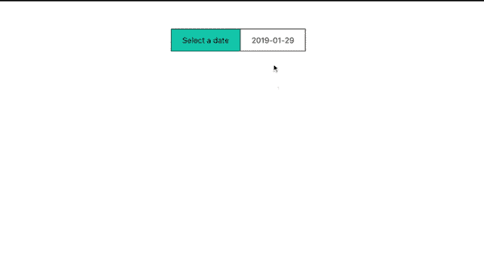
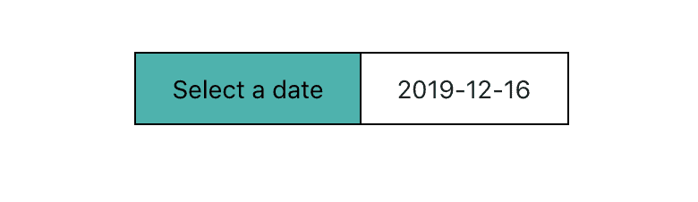
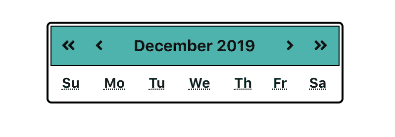
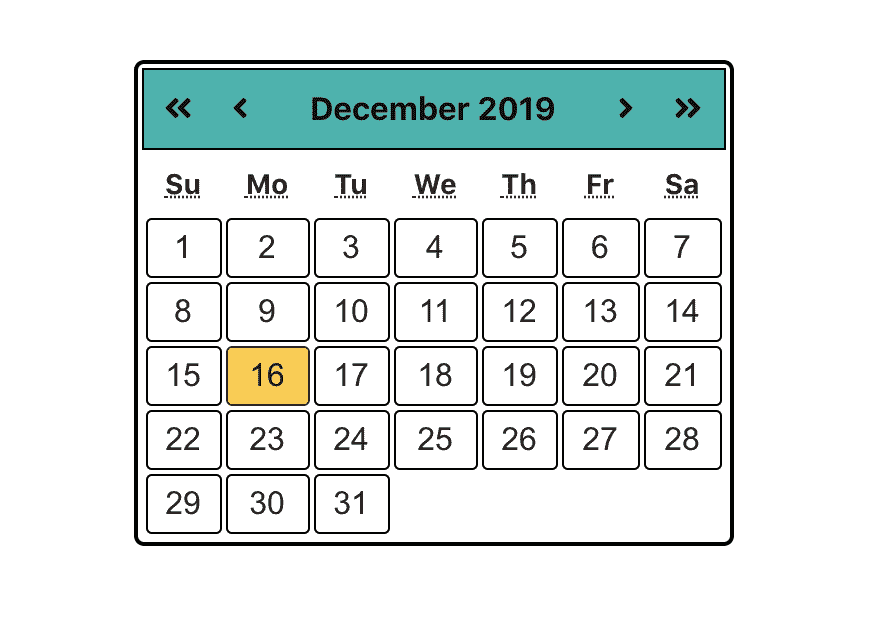

# 如何在 React - LogRocket 博客中构建一个可访问的 datepicker 组件

> 原文：<https://blog.logrocket.com/how-to-build-an-accessible-date-picker-component-in-react/>

## 介绍

Web accessibility(也称为 *a11y* )是指设计、编码和创建可供所有人使用的网站和 Web 工具。目前，有许多网站和工具存在可访问性障碍，这对一些用户构成了挑战。为了建立一个更易访问的网站，将易访问性放在产品开发的最前面是很重要的。

[网页内容可访问性指南](https://www.w3.org/WAI/intro/wcag) (WCAG)提供了创建可访问网站和工具的共享标准，以满足国际个人、组织和政府的需求。

您可以从基于 WCAG 的[A11Y 项目](https://a11yproject.com/checklist/)、 [Wuhcag](https://www.wuhcag.com/wcag-checklist/) 和 [WebAim](https://webaim.org/standards/wcag/checklist) 中找到清单，您可以在构建易访问产品时将其用作参考点。

在本文中，我们将构建一个利用可访问性准则的可访问的 datepicker 组件。下面是一个简短的演示，展示了组件成品的外观:



## 先决条件

本文假设你熟悉 [React](https://reactjs.org/) 。在我们开始构建日期选择器之前，确保您的机器上已经安装了[节点](https://nodejs.org/en/)、[纱线](https://yarnpkg.com/)或 [npm](https://npmjs.com/) 。如果没有，您可以在提供的链接中找到如何安装它们的说明。我们将使用 [create-react-app](https://github.com/facebook/create-react-app) 来引导我们的项目。create-react-app 文档建议使用`npm uninstall -g create-react-app`卸载以前通过`npm install -g create-react-app`全局安装的版本，以确保[npx](https://www.npmjs.com/package/npx)(NPM 版本 5.2+附带的包运行器工具)始终使用最新版本。

## 入门指南

让我们来看看如何创建我们的项目。您可以使用下面突出显示的三个可用选项中的任何一个来创建您的项目。

**npx:**

```
$ npx create-react-app accessible-datepicker
```

**NPM**(NPM 6+中有`npm init <initializer>`)**:**

```
$ npm init react-app accessible-datepicker
```

**纱线** ( `[yarn create <starter-kit-package>](https://yarnpkg.com/lang/en/docs/cli/create/)`有纱线 0.25+) **:**

```
$ yarn create react-app my-app
```

创建完项目文件夹后，您可以打开并运行它:

```
cd accessible-datepicker
npm start //or
yarn start
```

这将在开发模式下运行应用程序，您可以使用链接 [http://localhost:3000/](http://localhost:3000/) 在浏览器中查看它。

## 安装附加依赖项

由于许多 CSS 框架的组件中内置了可访问性，我们现在将避免使用它们。这将使我们能够理解如何在没有框架帮助的情况下构建可访问的组件。

我们将需要几个库来帮助我们构建 datepicker 组件。 [date-fns](https://date-fns.org/) 用于操作日期， [react-fontawesome](https://github.com/FortAwesome/react-fontawesome) 用于图标， [lodash](https://lodash.com/) 用于操作一些数据， [react-axe](https://github.com/dequelabs/react-axe) 用于测试应用程序的可访问性，并在开发和调试时将结果直接报告给控制台。

要安装它们，请运行以下命令:

```
$ yarn add date-fns lodash @fortawesome/fontawesome-svg-core @fortawesome/free-solid-svg-icons @fortawesome/react-fontawesome react-axe
```

一旦安装了依赖项，通过将下面的代码添加到`src/index.js`来设置 react -axe。

```
import axe from 'react-axe';

if (process.env.NODE_ENV !== 'production') {
  axe(React, ReactDOM, 1000);
}
```

## 组件设置

我们的 datepicker 应用程序将有三个组成部分，即:

1.  将成为应用程序主要组件的应用程序组件
2.  应用程序加载时将显示当前日期并提示用户选择日期的 datepicker 组件
3.  日历组件将显示一个日历，用户可以导航和选择日期

```
# Navigate to source directory
$ cd src/
#Create new files
$ touch calendar.js datepicker.js
```

## 易接近

在本文中，我们将重点关注通过使用适当的对比度、键盘导航和[可访问的富互联网应用程序(ARIA)](https://www.w3.org/WAI/standards-guidelines/aria/) 来使组件可访问。 [Color safe](http://colorsafe.co/) 是一个很棒的网站，它允许你根据 [WCAG 关于对比度的指导方针](http://colorsafe.co/)为给定的背景色生成可访问的文本颜色。

您将在本文中遇到的 ARIA 语义包括:

*   角色，例如应用程序、按钮、网格、网格单元
*   咏叹调标签
*   咏叹调精选

角色定义了一种用户界面元素。`aria-label`属性用于定义标记当前元素的字符串，并在文本标签在屏幕上不可见的情况下使用。另一方面，Aria-selected 表示小部件的当前“选中”状态。

我们稍后将讨论的日历导航可以使用与特定动作相关的键来管理。

| 键 | 行为 |
| --- | --- |
| 左边的 | 将焦点向左移动一个单元格(前一天) |
| 对吧 | 将焦点向右移动一个单元格(下一天) |
| 向上 | 将焦点上移一个单元格(上周的同一天) |
| 向下 | 将焦点下移一个单元格(下周的同一天) |
| 页上移 | 将焦点移动到上一个表格的相似单元格(上个月的同一天) |
| 下一页 | 将焦点移到下一个表格的相似单元格(下个月的同一天) |
| 主页 | 将焦点移到网格中的第一个单元格(每月的第一天) |
| 结束 | 将焦点移到网格中的最后一个单元格(一个月的最后一天) |
| Ctrl +向上翻页 | 将焦点移到上一年的同一天 |
| Ctrl +向下翻页 | 将焦点移到下一年的同一天 |
| 输入/空格 | 选择焦点单元格(天) |
| 转义字符 | 关闭日历 |

应用程序组件

## 这将根据 state 中的布尔值有条件地呈现 datepicker 组件和 calendar 组件。我们在 state 中有两个布尔值，`showDatepicker`和`showCalendar`，分别用来切换日期选择器和日历的可见性。

当日期选择器可见时，日历将不可见，反之亦然。我们还将有一个状态值`date`,我们将初始化为当前日期，当用户在日历上选择一个不同的日期时，它可以被改变。让我们看看这看起来像什么开始。将以下代码添加到`src/app.js`:

当用户单击 datepicker 时，应该关闭 datepicker 并显示日历。我们将创建一个组件方法`toggleCalendar`来做这件事。我们将添加另外两个方法`handleSelectDate`来更新用户选择的日期，添加`closeCalendar`来从日历切换到日期选择器，而不改变当前选择的日期。代码看起来会像这样:

```
import React, { useState } from 'react';
import { format } from 'date-fns';
import './App.css';

const App = () => {
  const [showDatepicker, setShowDatePicker] = useState(true);
  const [showCalendar, setShowCalendar] = useState(false);
  const [date, setDate] = useState(format(new Date(), "yyyy-MM-dd"));

  return (
    <div className="App" role="application">
      {showDatepicker && (
        <div>Datepicker</div>
      )}
      {showCalendar && (
        <div>Calendar</div>
      )}
    </div>
  );
}
export default App;
```

我们现在已经完成了 app 组件的基本设置，现在可以开始构建子组件了。

```
const toggleCalendar = (e) => {
   setShowDatePicker(false);
   setShowCalendar(true);
 }
 const handleSelectDate = (date) => {
   setDate(date);
   setShowDatePicker(true);
   setShowCalendar(false);
 }
 const closeCalendar = () => {
   setShowDatePicker(true);
   setShowCalendar(false);
 }
```

datepicker 组件

## datepicker 组件将显示提示用户选择日期和当前选定日期的文本。它将接收`date`和`handleSelect`属性，分别显示当前日期和切换日历可见性。

出于样式的考虑，我选择使用 div 元素，而不是按钮或输入等更直观的元素。为了允许用户使用 tab 键参与日期选择器，我们需要给 div 一个`tabindex="0"`属性。用户应该能够通过按下`Enter`或`Space`键盘键来使用日期选择器显示日历。我们可以通过使用`OnKeyPress`事件监听器监听按键来实现这一点。

一旦按下一个键，我们需要在继续之前验证它是`Enter`键还是`Space`键。对于视觉用户，点击日期选择器应该切换日历。我们的`src/datepicker.js`文件应该是这样的:

让我们继续将 datepicker 组件导入到我们的`src/app.js`文件中，并传递给它相关的属性:

```
import React from 'react';
import './App.css';
const Datepicker = ({ date, handleSelect }) => {
  const handleKeyPress = (e) => {
    const charCode = e.charCode
    if(charCode === 13 || charCode === 32) {
      handleSelect();
    }
  }
  return (
    <div
      className="datepicker"
      tabIndex="0"
      onClick={handleSelect}
      onKeyPress={handleKeyPress}
      role="button"
      aria-label="Datepicker"
    >
      <div>
        Select a date
      </div>
      <div aria-label="Selected date">
        {date}
      </div>
    </div>
  );
}
export default Datepicker;
```

我们也给`src/App.css`加点风格吧。只要你遵循对比原则，你就可以随心所欲地设计它。您会注意到，我已经为所有元素添加了一个焦点样式:

```
...
import Datepicker from "./datepicker";
const App = () => {
  ....
  return (
    <div className="App" role="application">
      {showDatepicker && (
        <Datepicker date={date} handleSelect={toggleCalendar}/>
      )}
      {showCalendar && (
        <div>Calendar</div>
      )}
    </div>
  );
}
export default App;
```

下图显示了我们的应用程序重新加载后的样子:

```
.App {
  text-align: center;
  display: flex;
  justify-content: center;
  padding-top: 50px;
}
*:focus {
  outline: 2px solid #d71ef7;
}
.datepicker {
  display: flex;
  flex-direction: row;
  border: 1px solid black;
  cursor: pointer;
}
.datepicker > div {
  padding: 10px 20px;
}
.datepicker > div:nth-child(1) {
  border-right: 1px solid black;
  background-color: #00b5ad;
  color: #000000;
}
```

日历组件



Datepicker unfocused


Datepicker focused

## 当 calendar 组件完成时，它应该显示一个网格，该网格从显示当前所选日期的月份开始，并且可以导航到不同的日期。第一步是构建日历标题，它将包含导航到上个月、上一年、下个月和下一年的图标。

它还将显示当前选择的月份和年份。现在，我们将创建一个只包含一周中各天名称的表。使用 date-fns，我们将能够添加能够从当前选择的日期中增加或减去一个月或一年的方法。

我们将使用从 app 组件传递的日期属性创建一个新的 date 对象，并将其存储在 state 中。这将用于稍后生成日历。我们日历组件的初始代码应该如下所示:

当任何一个图标按钮被聚焦时按下一个键，我们将用事件和回调来调用`handleKeyPress`。它将检查被按下的键是 enter 还是 space，然后执行回调。

```
import React, { useState } from 'react';
import {
  format,
  startOfMonth,
  subMonths,
  addMonths,
  subYears,
  addYears,
  getDaysInMonth,
  getDay,
  endOfMonth,
  setDate,
  getDate,
  isEqual,
  subWeeks,
  addWeeks,
  subDays,
  addDays
} from 'date-fns';
import { chunk } from 'lodash';
import { FontAwesomeIcon } from '@fortawesome/react-fontawesome';
import { faAngleLeft, faAngleRight, faAngleDoubleLeft, faAngleDoubleRight } from '@fortawesome/free-solid-svg-icons'
import './App.css';
const Calendar = ({ date, handleSelectDate, closeCalendar }) => {
  const[selectedDate,setSelectedDate] = useState(new Date(date));
  const setPreviousMonth = () => {
    const previousMonth = subMonths(selectedDate, 1);
    setStartDate(startOfMonth(previousMonth));
  }
  const setNextMonth = () => {
    const nextMonth = addMonths(selectedDate, 1);
    setStartDate(startOfMonth(nextMonth));
  }
  const setPreviousYear = () => {
    const previousYear = subYears(selectedDate, 1);
    setStartDate(startOfMonth(previousYear));
  }
  const setNextYear = () => {
    const nextYear = addYears(selectedDate, 1);
    setStartDate(startOfMonth(nextYear));
  }
  const handleKeyPress = (e,cb) => {
    const charCode = e.charCode
    if(charCode === 13 || charCode === 32) {
      cb();
    }
  }

  return (
    <div className="calendar">
      <div className="title">
        <div className="icons">
          <div
            className="iconContainer"
            tabIndex="0"
            onClick={setPreviousYear}
            onKeyPress={(e) => handleKeyPress(e,setPreviousYear)}
            role="button"
            aria-label="Previous year"
          >
            <FontAwesomeIcon icon={ faAngleDoubleLeft } />
          </div>
          <div
            className="iconContainer"
            tabIndex="0"
            onClick={setPreviousMonth}
            onKeyPress={(e) => handleKeyPress(e,setPreviousMonth)}
            role="button"
            aria-label="Previous month"
          >
            <FontAwesomeIcon icon={ faAngleLeft } />
          </div>
        </div>
        <div className="month" role="heading">
          <b>
            {format(selectedDate, "MMMM yyyy")}
          </b>
        </div>
        <div className="icons">
          <div
            className="iconContainer"
            tabIndex="0"
            onClick={setNextMonth}
            onKeyPress={(e) => handleKeyPress(e,setNextMonth)}
            role="button"
            aria-label="Next year"
          >
            <FontAwesomeIcon icon={ faAngleRight } />
          </div>
          <div
            className="iconContainer"
            tabIndex="0"
            onClick={setNextYear}
            onKeyPress={(e) => handleKeyPress(e,setNextYear)}
            role="button"
            aria-label="Next year"
          >
            <FontAwesomeIcon icon={ faAngleDoubleRight } />
          </div>
        </div>
      </div>
      <table
        id="grid"
        tabIndex="0"
        role="grid"
        aria-label="Month"
      >
        <thead>
          <tr role="row">
            <th className="header" role="columnheader" aria-label="Sunday"><abbr title="Sunday">Su</abbr></th>
            <th className="header" role="columnheader" aria-label="Monday"><abbr title="Monday">Mo</abbr></th>
            <th className="header" role="columnheader" aria-label="Tuesday"><abbr title="Tuesday">Tu</abbr></th>
            <th className="header" role="columnheader" aria-label="Wednesday"><abbr title="Wednesday">We</abbr></th>
            <th className="header" role="columnheader" aria-label="Thursday"><abbr title="Thursday">Th</abbr></th>
            <th className="header" role="columnheader" aria-label="Friday"><abbr title="Friday">Fr</abbr></th>
            <th className="header" role="columnheader" aria-label="Saturday"><abbr title="Saturday">Sa</abbr></th>
          </tr>
        </thead>
        <tbody>
        </tbody>
      </table>
    </div>
  );
}
export default Calendar;
```

一旦我们导入我们的日历组件并传递给它适当的道具，我们的`App.js`文件就完成了。

当您重新加载应用程序并单击日期选择器时，它将显示一个尚未填充日期的日历。

```
import React, { useState } from 'react';
import { format } from 'date-fns';
import Datepicker from "./datepicker";
import Calendar from "./calendar";
import './App.css';
const App = () => {
  const [showDatepicker, setShowDatePicker] = useState(true);
  const [showCalendar, setShowCalendar] = useState(false);
  const [date, setDate] = useState(format(new Date(), "yyyy-MM-dd"));
  const toggleCalendar = (e) => {
    setShowDatePicker(false);
    setShowCalendar(true);
  }
  const handleSelectDate = (date) => {
    setDate(date);
    setShowDatePicker(true);
    setShowCalendar(false);
  }
  const closeCalendar = () => {
    setShowDatePicker(true);
    setShowCalendar(false);
  }
  return (
    <div className="App" role="application">
      {showDatepicker && (
        <Datepicker date={date} handleSelect={toggleCalendar}/>
      )}
      {showCalendar && (
        <Calendar date={date} handleSelectDate={handleSelectDate} closeCalendar={closeCalendar} />
      )}
    </div>
  );
}
export default App;
```



生成一个月中的日期

## 现在我们有了日历头和星期几，下一步是生成那个月的星期几。日历将使用我们在 state 中初始化的日期生成。我们需要知道一个月有多少天，以及第一天和最后一天是哪一天。

如果上个月的第一天之前或下个月的最后一天之后有任何一天是该周，我们将需要添加空值来填写该周。这将给我们一个长度是 7 的倍数(一周的天数)的数组。

然后，我们可以使用 lodash 的 chunk 实用程序方法来创建一个数组数组，其中每个数组都是一个月中的一周，每个月都有几天:

一旦我们有了生成的周和日期，我们需要呈现数据。每行代表一周，每列代表一周中的一天。每个单元格将显示一个月中相应的一天，对于我们用来填写星期的空天，将创建空单元格。当前选择的日期将被突出显示:

```
const generateMonth = () => {
    const daysInMonth = getDaysInMonth(selectedDate);
    const startWeekday = getDay(startOfMonth(selectedDate));
    const endWeekday = getDay(endOfMonth(selectedDate));
    const gridDays = chunk([
      ...Array.from({ length: startWeekday }).fill(null),
      ...Array.from({ length: daysInMonth }, (_,i) => setDate(selectedDate, i+1)),
      ...Array.from({ length: (6-endWeekday) }).fill(null)
    ], 7);
    return gridDays;
  }
```

重新加载应用程序后，您将会看到每个月的日期都已填充:

```
{generateMonth().map((week,i) => (
      <tr className="week" key={`week-${i}`} role="row">
        {week.map((day,i) => (
          day
            ?
            <td
              className={`cell${isEqual(selectedDate, day) ? ' active' : ''}`}
              key={`day-cell-${i}`}
              onClick={() => handleDateSelection(day)}
              role="gridcell"
              aria-selected={isEqual(selectedDate, day)}
            >
              {getDate(day)}
            </td>
            :
            <td className="empty" key={`day-cell-${i}`}>&nbsp;</td>
        ))}
      </tr>
    ))}
```



您可能注意到我们的 table 元素有一个`tabindex="0"`属性。这使得它可以集中注意力，并使用键盘按键来导航日期。除了 accessibility 部分下的 key/action 表之外，我们还需要定义一些使用键盘按键导航日历的附加规则。

当用户按左键并且当前选择的日期是该月的第一天时，他们将被带到上个月的最后一天

1.  当用户按下右键，并且当前选择的日期是该月的最后一天时，他们将被带到下个月的第一天
2.  当用户按下 up 并且当前所选日的对应日在上个月中时，它们将被带到上个月的对应日
3.  当用户按下并且当前所选日的对应日在下个月中时，它们将被带到下个月的对应日
4.  当用户按 Page Up 和 Page Down(分别导航到上一个月和下一个月)或 Ctrl + Page Up 和 Ctrl + Page Up(分别导航到上一年和下一年的类似日期)时，如果没有对应的日期，例如不同日期的月份或闰年，则它们将被带到该月的最后一天。
5.  幸运的是，date-fns 处理了这些边缘情况，我们不需要担心它们。一个`onKeyDown`事件监听器将在表被聚焦时监听按键。

需要注意的是，某些浏览器上的某些按键组合(例如，Control + Page Up)已经被用作浏览器快捷方式，可能会离开页面。用户可能需要禁用快捷方式。或者，您可以使用 shift 键代替 control 键。让我们将事件处理程序添加到表元素中:

`handleTableKeyPress`方法将处理按键，然后调用执行相应操作的函数。让我们添加处理键盘导航所需的组件方法:

```
<table
  id="grid"
  tabIndex="0"
  onKeyDown={handleTableKeyPress}
  role="grid"
  aria-label="Month"
>
  ...
</table>
```

最后，将以下样式添加到`App.css`:

```
const setPreviousDay = () => {
  const previousDay = subDays(selectedDate, 1);
  setSelectedDate(previousDay);
}
const setNextDay = () => {
  const nextDay = addDays(selectedDate, 1);
  setSelectedDate(nextDay);
}
const setPreviousWeek = () => {
  const previousWeek = subWeeks(selectedDate, 1);
  setSelectedDate(previousWeek);
}
const setNextWeek = () => {
  const nextWeek = addWeeks(selectedDate, 1);
  setSelectedDate(nextWeek);
}
const setDatePreviousMonth = () => {
  setSelectedDate(subMonths(selectedDate, 1));
}
const setDateNextMonth = () => {
  setSelectedDate(addMonths(selectedDate, 1));
}
const setDatePreviousYear = () => {
  setSelectedDate(subYears(selectedDate, 1));
}
const setDateNextYear = () => {
  setSelectedDate(addYears(selectedDate, 1));
}
const setMonthStart = () => {
  setSelectedDate(startOfMonth(selectedDate));
}
const setMonthEnd = () => {
  setSelectedDate(endOfMonth(selectedDate));
}
const handleTableKeyPress = (e) => {
  const keyCode = e.keyCode;
  // Check if control key was pressed
  // const control = e.ctrlKey;
  // Use shift key to prevent browser shortcut conflicts
  const control = e.shiftKey;
  switch(keyCode) {
    case 13: //Enter
      handleSelectDate(format(selectedDate, "yyyy-MM-dd"));
      return;
    case 27: //Esc
      closeCalendar();
      return;
    case 32: //Space
      handleSelectDate(format(selectedDate, "yyyy-MM-dd"));
      return;
    case 33: //Page Up
      control ? setDatePreviousYear() : setDatePreviousMonth();
      return;
    case 34: //Page Down
      control ? setDateNextYear() : setDateNextMonth();
      return;
    case 35: //End
      setMonthEnd();
      return;
    case 36: //Home
      setMonthStart();
      return;
    case 37: //Left
      setPreviousDay();
      return;
    case 38: //Up
      setPreviousWeek();
      return;
    case 39: //Right
      setNextDay();
      return;
    case 40: //Down
      setNextWeek();
      return;
    default:
      return;
  }
}
const handleDateSelection = (date) => {
  const dateString = format(date, "yyyy-MM-dd");
  handleSelectDate(dateString);
}
```

就是这样！！我们在 React 中构建了一个可访问的 datepicker 组件。

```
.calendar {
  width: 300px;
  display: flex;
  flex-direction: column;
  border: 2px solid black;
  padding: 2px;
  border-radius: 5px;
}
.title {
  display: flex;
  flex-direction: row;
  justify-content: space-between;
  font-size: 16px;
  background-color: #00b5ad;
  padding: 10px 0;
  border: 1px solid black;
}
.icons {
  display: flex;
  flex-direction: row;
}
.iconContainer {
  padding: 0 10px;
  cursor: pointer;
}
.month {
  padding: 0 15px;
}
.header {
  height: 30px;
}
.cell {
  border: 1px solid black;
  border-radius: 3px;
  height: 30px;
  font-family: arial, helvetica, sans-serif;
  font-size: 16px;
}
.cell:hover {
  background-color: #fc3;
  border-color: #800;
}
.cell.active {
  background-color: #fc3;
  border-color: #800;
}
```

后续步骤

## 您可能已经注意到，我们没有遵循一些最佳实践，例如适当的验证。这些可以自己加。日历组件非常庞大，可以分成更小的子组件。您还可以尝试不同的颜色组合和不同的对比度，看看这对应用程序有什么影响。你可以在 [GitHub](https://github.com/jkithome/accessible-datepicker) 上找到这篇文章的代码。

结论

## 这是关于如何构建一个可访问的日期选择器。在 React 中构建其他类型的组件时，可以遵循相同的原则。人们可以添加更多的考虑因素，使我们构建的任何工具都易于每个人使用。

作为开发人员、项目经理和企业家，我们有责任确保建立一个欢迎所有人的生态系统。我希望你和我将继续使我们的项目、站点和工具更容易访问。

使用 LogRocket 消除传统反应错误报告的噪音

## 是一款 React analytics 解决方案，可保护您免受数百个误报错误警报的影响，只针对少数真正重要的项目。LogRocket 告诉您 React 应用程序中实际影响用户的最具影响力的 bug 和 UX 问题。

[LogRocket](https://lp.logrocket.com/blg/react-signup-issue-free)

自动聚合客户端错误、反应错误边界、还原状态、缓慢的组件加载时间、JS 异常、前端性能指标和用户交互。然后，LogRocket 使用机器学习来通知您影响大多数用户的最具影响力的问题，并提供您修复它所需的上下文。

[ ](https://lp.logrocket.com/blg/react-signup-general) [  ](https://lp.logrocket.com/blg/react-signup-general) [LogRocket](https://lp.logrocket.com/blg/react-signup-issue-free)

关注重要的 React bug—[今天就试试 LogRocket】。](https://lp.logrocket.com/blg/react-signup-issue-free)

Focus on the React bugs that matter — [try LogRocket today](https://lp.logrocket.com/blg/react-signup-issue-free).