# 如何用 Strapi、Vue.js 和 Flutterwave 建立一个电子商务网站

> 原文：<https://blog.logrocket.com/how-to-build-an-ecommerce-site-with-strapi-vue-js-and-flutterwave/>

构建电子商务应用程序为您提供了学习如何处理来自远程数据源的数据的机会，但更重要的是，如何有意识地构建与不同服务通信的 web 应用程序。

上周末，我在我的“学习”工具列表中找到了一个新工具。它叫做 [Strapi](https://strapi.io/) 。我喜欢学习这个工具，因为我更加了解它提供的所有功能。作为一名前端开发人员，我对自己构建后端服务的速度感到兴奋，这些服务可以毫不费力地与我的前端应用程序进行通信。这就是为什么我决定与你分享我所学到的东西，希望你和我一样觉得有帮助(如果你还没有使用这个工具的话)。

在本教程中，您将学习如何使用 Vue.js、Strapi 和 Flutterwave 构建一个迷你电子商务应用程序。


## 工具作业

为了完成本教程，我们将使用以下工具:

*   Vue.js —用于构建用户界面的轻量级渐进式 JavaScript 框架
*   Strapi —一个完全用 JavaScript 构建的开源无头内容管理系统
*   [Flutterwave](https://flutterwave.com/) —一个在线支付网关，让顾客可以在世界任何地方支付你的产品

## 先决条件

在我们开始之前，有一些事情需要注意:

*   你的电脑上应该已经安装了 [Node.js](https://nodejs.org/en/download/)
*   你应该有一个关于 [Flutterwave](https://flutterwave.com/) 的账户
*   你应该非常熟悉 [Vue.js](https://vuejs.org/) 和 JavaScript
*   你应该安装[Postman](https://www.postman.com/)——一个用于与 HTTP APIs 交互的谷歌 Chrome 工具

## 入门指南

现在我们已经做好了准备，让我们来谈谈如何构建这个产品。首先，我们将使用 Strapi 创建一个`/products`端点。这个端点将返回我们将在我们的电子商务商店销售的产品列表。之后，我们将构建一个 Vue.js 客户端向客户呈现这些产品，最后，我们将集成 Flutterwave 以允许客户为我们的产品付费。

## 创建一个 Strapi 项目

创建 Strapi 项目的最快和最推荐的方法是通过 Strapi CLI。根据具体情况，您可以使用`yarn`或`npx`来完成此操作。打开终端窗口并运行命令:

```
yarn create strapi-app VueStrap --quickstart
#OR
npx create-strapi-app VueStrap --quickstart
```

`--quickstart`标志将使用 SQLite 数据库建立项目。如果您打算使用不同的数据库创建一个新项目，可以省略该标志，CLI 将提示您选择首选数据库。

## 开始项目

如果您使用`--quickstart`标志创建了项目，该项目将在浏览器的端口`1337`上自动启动，但是，如果您选择了自定义数据库，您可以运行以下命令来启动该项目:

```
yarn develop
#OR
npm run develop
```

现在，如果您在浏览器上导航到`localhost:1337/admin`，您将看到一个允许您创建第一个管理员用户的表单。填写后点击`Ready to start`:

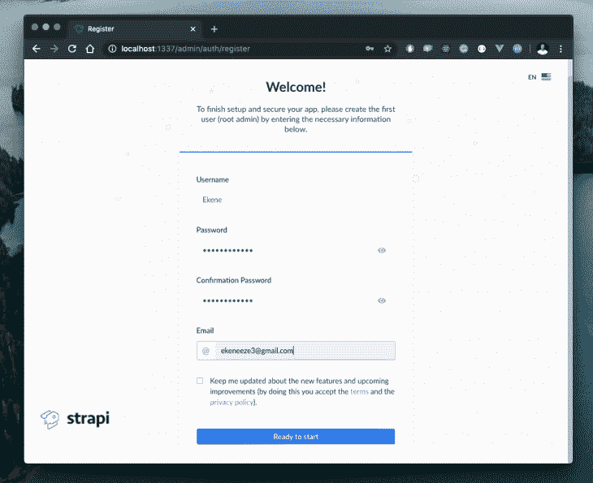

这将启动管理区，您可以在这里为我们的商店创建所需的产品:

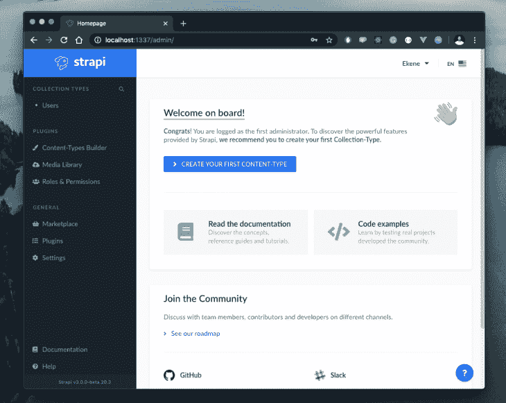

按照设计，我们希望创建一个`/products`端点，我们可以调用它来返回产品列表。为此，通过单击蓝色大按钮创建一个`Product`内容类型，并像这样填写表单:

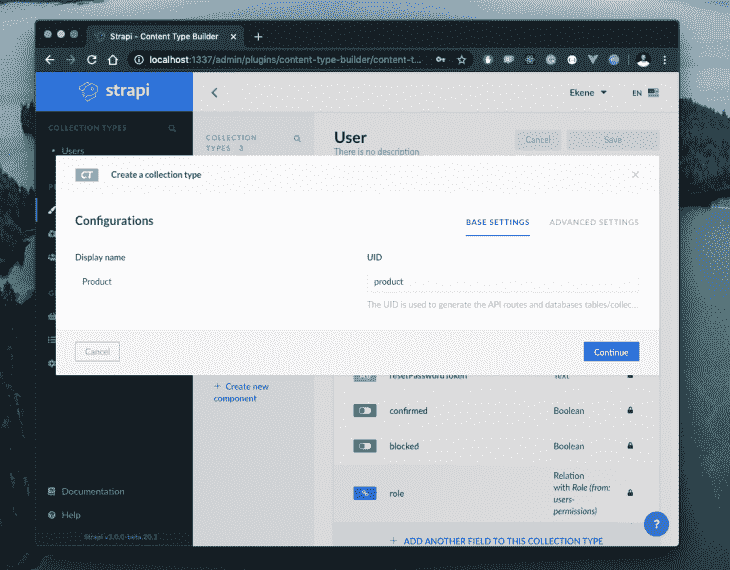

点击`Continue`，将显示一个新部分，要求您为此端点创建字段。在我们的例子中，我们只有四个字段:

*   标题
*   描述
*   价格
*   图像

我们需要两个标题和描述的文本字段，一个价格的数字字段和一个产品图像的媒体字段。以下是我们填充字段的方式:

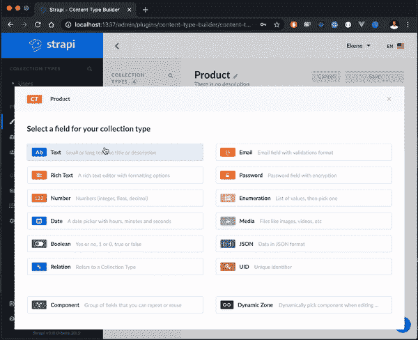

添加我们指定的所有字段后，当您单击*完成*时，您可以预览包含所有添加字段的产品端点:

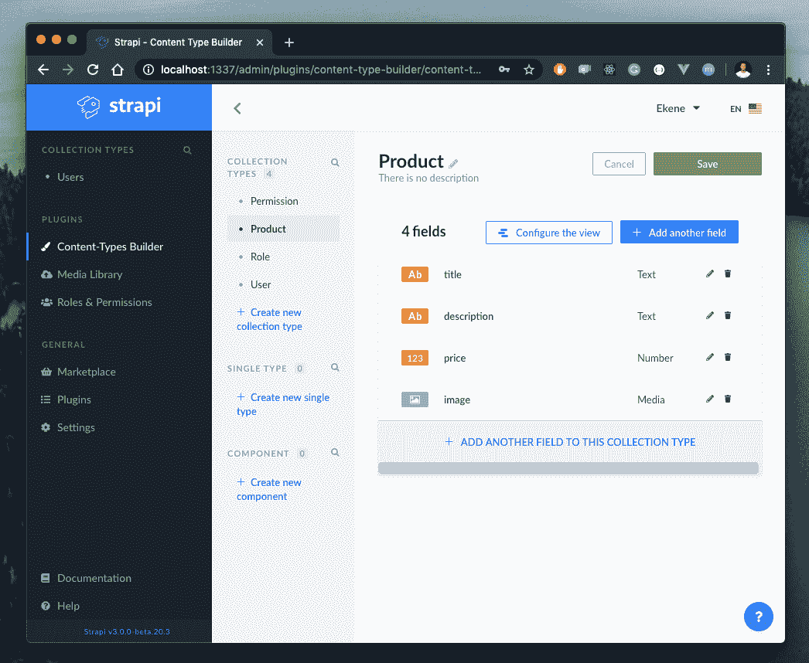

就这样，我们创建了一个功能性的`/products`端点，我们可以用它来创建我们希望在商店展示的产品。让我们快速保存这个集合，并向其中添加一些产品:

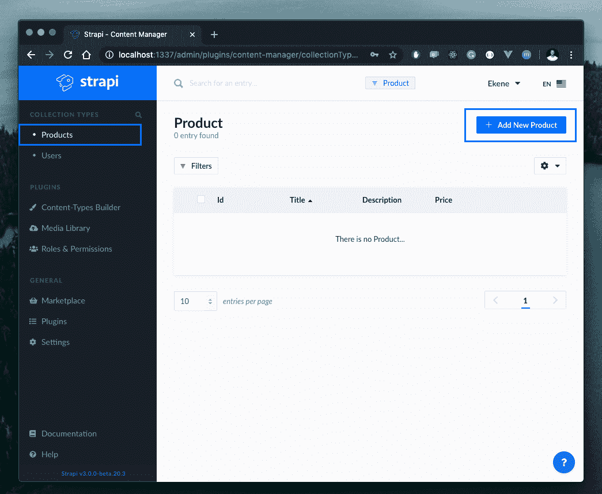

点击侧边栏上的*产品*集合，然后点击*添加新产品*开始添加您的产品:

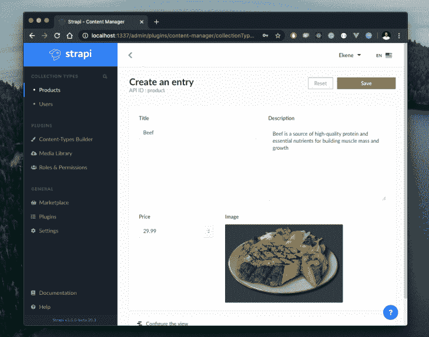

保存此产品，并对您想放在商店中的所有产品重复同样的过程。最终，我的产品看起来是这样的:

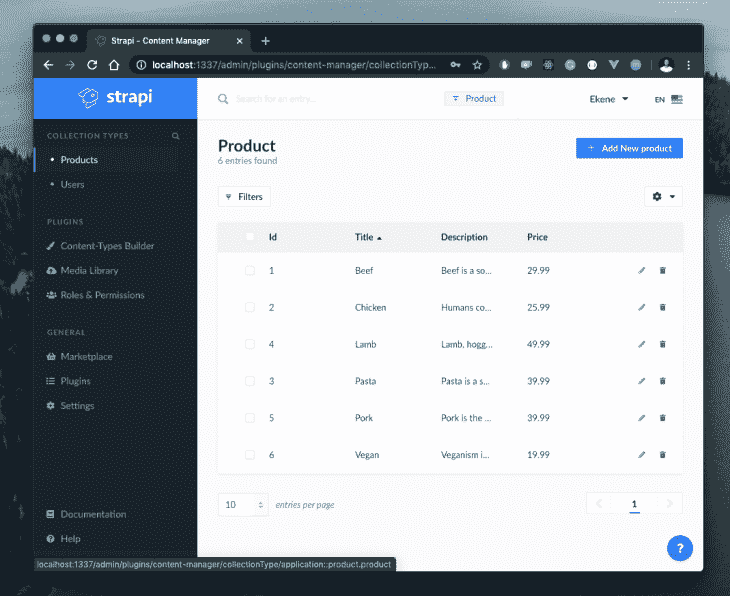

就是这样！我们刚刚创建了一个功能完整的`/products`端点，我们可以从客户端调用它来检索我们在这里创建的所有产品的列表。

最后，让我们更新用户角色和权限部分，以正确管理对此端点的访问。此时，如果我们试图访问`/products`端点，我们将会得到一个禁止的错误:

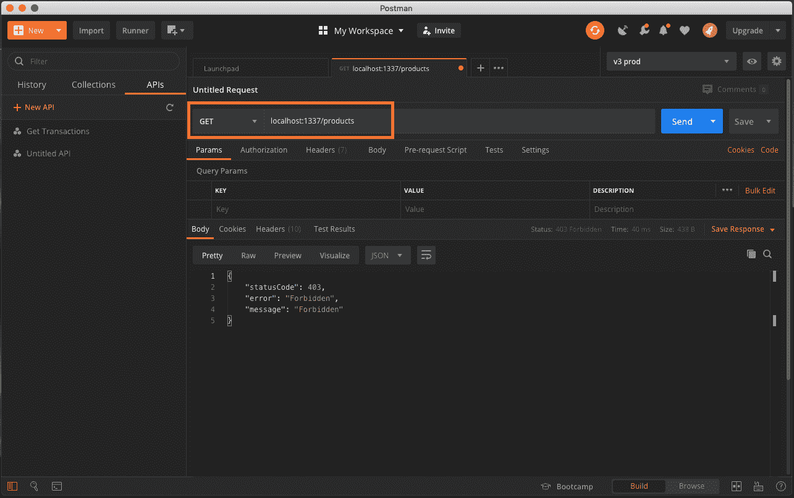

发生这种情况是因为我们没有授权该公共用户访问该端点。要管理访问权限，请使用侧边栏上的角色和权限按钮，选择`public`并选中您希望授予公共用户访问权限的复选框:

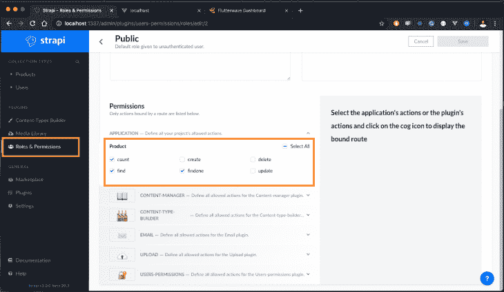

这样，每个公共用户现在都可以在我们的端点上访问所选的操作。

让我们用 Postman 再次测试一下。如果您安装了应用程序，向`localhost:1337/products`端点发出 GET 请求:

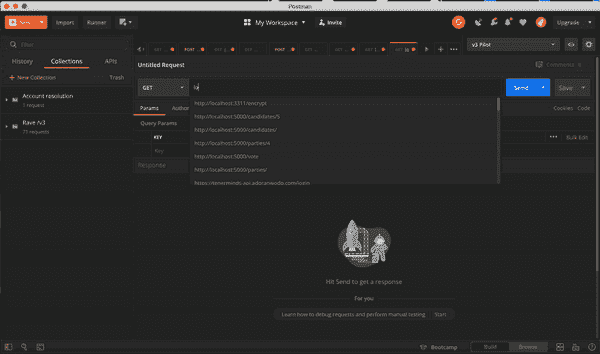

瞧啊。现在我们得到了产品。

## 应用程序设置视图

现在我们已经准备好了端点，让我们创建客户机来使用我们在服务器上准备的数据，并向客户显示这些产品。为此，我们将使用 [Vue CLI](https://cli.vuejs.org/) 工具来搭建一个新的 Vue 项目。如果您尚未安装 Vue CLI，请运行以下命令:

```
npm install -g @vue/cli-service-global
#OR
yarn global add @vue/cli-service-global
```

要创建并启动新的 Vue 项目，请运行以下命令:

```
#create a new Vue project:
vue create vue-strapi

#navigate into the newly created app and start the dev server:
cd vue-strapi && npm run serve
```

该项目将于`localhost:8080`在您的浏览器上直播。

## 式样

作为个人偏好，我在使用 Vue.js 应用程序时使用 [BootstrapVue](https://bootstrap-vue.org/) 。安装[引导程序](https://getbootstrap.com/)，引导程序如下:

```
npm i bootstrap bootstrap-vue
```

现在，您可以通过如下所示的主入口文件使引导包在项目中可用:

```
// main.js
import Vue from "vue";
import App from "./App.vue";
import "bootstrap/dist/css/bootstrap.css";
import "bootstrap-vue/dist/bootstrap-vue.css";
import BootstrapVue from "bootstrap-vue";
  Vue.config.productionTip = false;
  Vue.use(BootstrapVue);
  new Vue({
    render: (h) => h(App),
  }).$mount("#app");
```

## 去拿产品

默认情况下，我们的 Vue 项目有一个`HelloWorld`组件。删除该组件并创建一个新的`Meals`组件来处理与我们的 Strapi 项目的 API 通信:

```
# src/components/Meals.vue
<script>
export default {
  data() {
    return {
      meals: [],
    };
  },
  mounted() {
    fetch("http://localhost:1337/products")
      .then((res) => res.json())
      .then((data) => {
        this.meals = data;
      });
  }
};
</script>
```

这里，我们使用 Vue 的`mounted()`生命周期方法和原生浏览器 API fetch 在应用加载时调用`/products`端点。我们还定义了一个`meals`数据属性来接收来自 API 的响应，并用它填充 UI。接下来，让我们使用 BootstrapVue 的 UI 组件和 Vue 指令在我们的膳食组件中呈现产品细节:

```
# src/components/Meals.vue
<template>
  <b-container>
    <div v-if="meals.length">
      <b-row>
        <div v-bind:key="meal.index" v-for="meal in meals">
          <b-col l="4">
            <b-card
              v-bind:img-src="`http://localhost:1337/uploads/beef_b538baa14d.png`"
              v-bind:title="meal.title"
              img-alt="Image"
              img-top
              tag="article"
              style="max-width: 20rem;"
              class="mb-2"
            >
              <b-card-text>{{ `${meal.description}` }}</b-card-text>
              <span>
                <strong>Price: ${{ `${meal.price}` }} </strong>
              </span>
              <b-button @click="placeOrder" variant="primary">Order meal</b-button>
            </b-card>
          </b-col>
        </div>
      </b-row>
    </div>
    <div v-else>
      <h5>Fetching meals . . .</h5>
    </div>
  </b-container>
</template>
```

使用`meals`数据属性，我们迭代并呈现从端点返回的各个产品，以分别显示产品标题、描述、价格和图片。您可能还注意到，我对所有产品都使用了一个图像，而不是对每个产品呈现相关的图像。我想在完成本教程之前解决这个问题，但我认为这对你来说可能是一个巨大的挑战。解析数据响应中的图像 URL，并自己动态显示每个产品的图像，当您完成后，可以随意分享您的代码或[向这个回购](https://github.com/kenny-io/Vue-strapi-client)发送 PR。

## 更新应用程序组件

现在我们已经准备好了`Meals`组件，让我们更新`App.vue`组件来呈现我们刚刚定义的`Meals`组件:

```
// src/App.vue
<template>
  <div>
    <br />
    <Meals />
  </div>
</template>
<script>
import Meals from "./components/Meals";
export default {
  name: "App",
  components: {
    Meals,
  },
};
</script>
<style>
#styles here
</style>
```

当您保存并在浏览器上检查时，您现在应该看到应用程序像预期的那样工作:

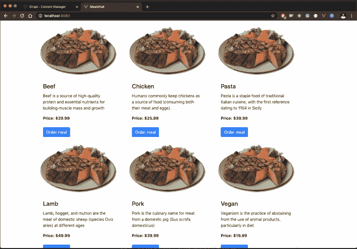

## 添加导航栏

因为我们正在构建一个迷你电子商务应用程序，所以确保它看起来尽可能接近真实的 web 应用程序是有意义的。谢天谢地，BootstrapVue 只需几个步骤就能实现这一点。在`components`文件夹中创建一个新的`Navbar.vue`组件，并用下面的代码片段更新它:

```
#src/components/navbar.vue
<template>
  <div>
    <b-navbar toggleable="lg" type="dark" variant="info">
      <b-navbar-brand href="#">MealsHub</b-navbar-brand>
      <b-navbar-toggle target="nav-collapse"></b-navbar-toggle>
      <b-collapse id="nav-collapse" is-nav>
        <b-navbar-nav class="ml-auto">
          <b-nav-form>
            <b-form-input
              size="sm"
              class="mr-sm-2"
              placeholder="Search"
            ></b-form-input>
            <b-button size="sm" class="my-2 my-sm-0" type="submit"
              >Search</b-button
            >
          </b-nav-form>
          <b-nav-item-dropdown right>
            <template v-slot:button-content>
              <em>User</em>
            </template>
            <b-dropdown-item href="#">Profile</b-dropdown-item>
            <b-dropdown-item href="#">Sign Out</b-dropdown-item>
          </b-nav-item-dropdown>
        </b-navbar-nav>
      </b-collapse>
    </b-navbar>
  </div>
</template>
<script></script>
```

这是一个 BootstrapVue navbar 组件，除了让我们的电子商务商店看起来更真实之外，它什么也没做。如果您使用此导航栏更新\ `App.vue`组件，并在呈现`Meals`组件之前呈现它，我们的商店将呈现类似如下的新外观:

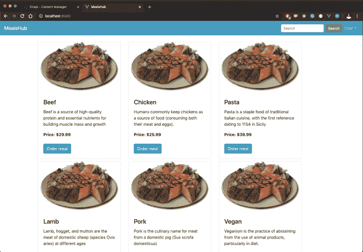

## 使用 Flutterwave 实现支付

Flutterwave 为世界各地的客户提供了最简便的支付和收款方式。此外，集成指令非常简单，进入门槛非常低，您很快就会看到这一点。

在[先决条件](https://paper.dropbox.com/doc/Build-an-e-commerce-site-with-Strapi-Vue.js-and-Flutterwave-DMuLXNEgLAG5YlXLjurxr#:uid=031084841222808316161964&h2=Prerequisites)中，我提到你需要一个 Flutterwave 账户，如果你还没有，在这里创建一个[免费账户](https://dashboard.flutterwave.com/)。当你这样做时，登录到你的仪表板，将你的帐户切换到沙盒模式。然后导航到侧边栏上的*设置*，选择 API 选项卡并复制您的公钥:

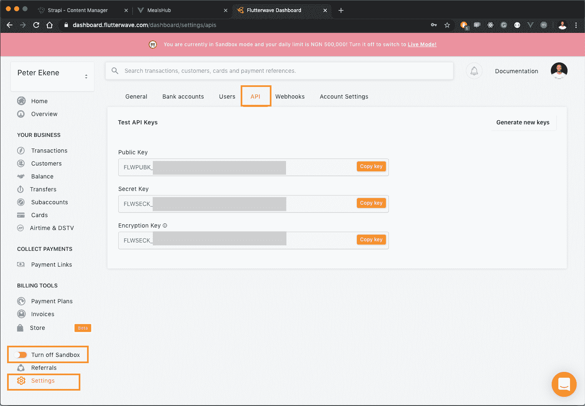

这就是建立个人 Flutterwave 帐户所需的全部内容。接下来，将 Flutterwave 添加到我们的 Vue 应用程序中。打开`Meals`组件，创建 Flutterwave 的内联结帐模式的实例，并使用 Vue 的`created()`生命周期方法将其附加到 DOM:

```
// src/components/Meals.vue
    <script>
    export default {
      data() {
        return {
          meals: [],
        };
      },
      mounted() {
        //Fetch products
      },
      created() {
        const script = document.createElement("script");
        script.src = "https://checkout.flutterwave.<wbr>com/v3.js";
        document.getElementsByTagName("head")[0].appendChild(script);
      },
    };
    </script>
```

接下来，我们定义了当点击*点餐*按钮时激活 Flutterwave 结账模式的`placeOrder()`函数。我们将使用 Vue 的方法属性这样做:

```
// src/components/Meals.vue
<script>
export default {
  data() {
    return {
      meals: [],
    };
  },
  methods: {
    placeOrder() {
      window.FlutterwaveCheckout({
        public_key: "INSERT YOUR PUBLIC KEY",
        tx_ref: "new-sale"+ new Date(),
        amount: 29.99,
        currency: "USD",
        country: "NG",
        payment_options: "card",
        customer: {
          email: "[email protected]",
          phone_number: "+234702909304",
          name: "Ekene Eze",
        },
        callback: function(data) {
          console.log(data);
        },
        onclose: function() {},
        customizations: {
          title: "MealsHub",
          description: "Payment for selected meal",
          logo: "http://localhost:1337/uploads/beef_b538baa14d.png",
        },
      });
    },
  },
  mounted() {
    fetch("http://localhost:1337/products"){
          // Fetch products
    });
  },
  created() {
      // Install Flutterwave
  },
};
</script>
```

通过`FlutterwaveCheckout`功能，您可以定义客户提供的支付参数。这包括要收取的金额、向客户收取的货币、要启用的付款选项等。该函数还接受一个客户和一个定制对象，以在结帐模式上提供更多的定制，并允许您存储关于付款客户的更多信息。

此时，如果您单击“订购餐食”按钮，将会加载 Flutterwave 结账模式来完成订单付款:

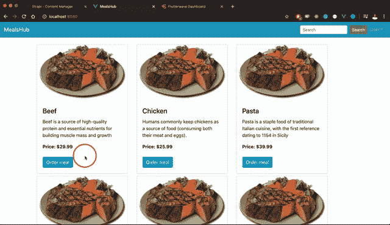

## 结论

在这个项目中，我们使用 Vue.js、Strapi 和 Flutterwave 构建了一个迷你电子商务应用程序。使用 Strapi，我们能够快速构建一个返回产品列表和一些细节的`/products`端点。通过 Vue，我们构建了使用我们用 Strapi 创建的产品的客户端，以允许我们商店中的用户查看我们的产品并与之交互。最后，我们集成了 Flutterwave，允许客户在世界任何地方支付这些产品的费用。有关这些工具的更多资源，请访问 [Flutterwave](https://developer.flutterwave.com/v3.0/docs) 、 [Strapi](https://strapi.io/documentation/3.0.0-beta.x/getting-started/introduction.html) 和 [Vue.js](https://vuejs.org/v2/guide/) 的文档。

## 像用户一样体验您的 Vue 应用

调试 Vue.js 应用程序可能会很困难，尤其是当用户会话期间有几十个(如果不是几百个)突变时。如果您对监视和跟踪生产中所有用户的 Vue 突变感兴趣，

[try LogRocket](https://lp.logrocket.com/blg/vue-signup)

.

[](https://lp.logrocket.com/blg/vue-signup)[https://logrocket.com/signup/](https://lp.logrocket.com/blg/vue-signup)

LogRocket 就像是网络和移动应用程序的 DVR，记录你的 Vue 应用程序中发生的一切，包括网络请求、JavaScript 错误、性能问题等等。您可以汇总并报告问题发生时应用程序的状态，而不是猜测问题发生的原因。

LogRocket Vuex 插件将 Vuex 突变记录到 LogRocket 控制台，为您提供导致错误的环境，以及出现问题时应用程序的状态。

现代化您调试 Vue 应用的方式- [开始免费监控](https://lp.logrocket.com/blg/vue-signup)。

## [LogRocket](https://lp.logrocket.com/blg/ecommerce-signup) :看看用户为什么不完成你的电子商务流程中的一个步骤的技术和 UX 原因。

[](https://lp.logrocket.com/blg/ecommerce-signup)

LogRocket 就像是一个网络和移动应用程序和网站的 DVR，记录你的电子商务应用程序上发生的一切。LogRocket 没有猜测用户不转化的原因，而是主动揭示了阻止你转化的根本原因，比如 JavaScript 错误或死点击。LogRocket 还可以监控应用的性能，报告客户端 CPU 负载、客户端内存使用等指标。

开始主动监控您的电子商务应用程序— [免费试用](https://lp.logrocket.com/blg/ecommerce-signup)。