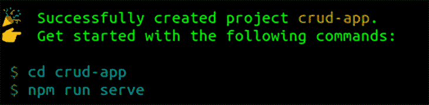
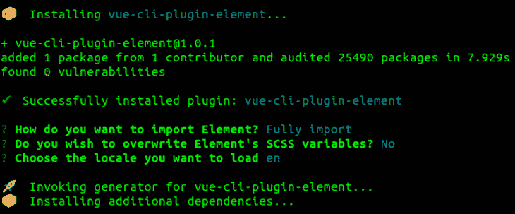
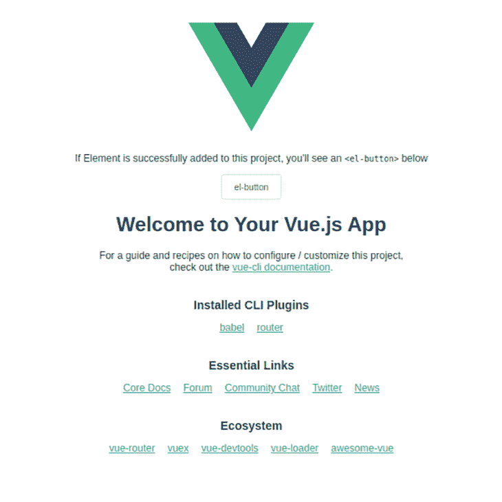
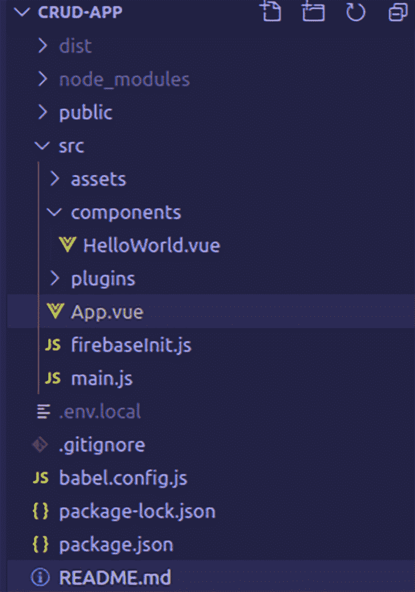
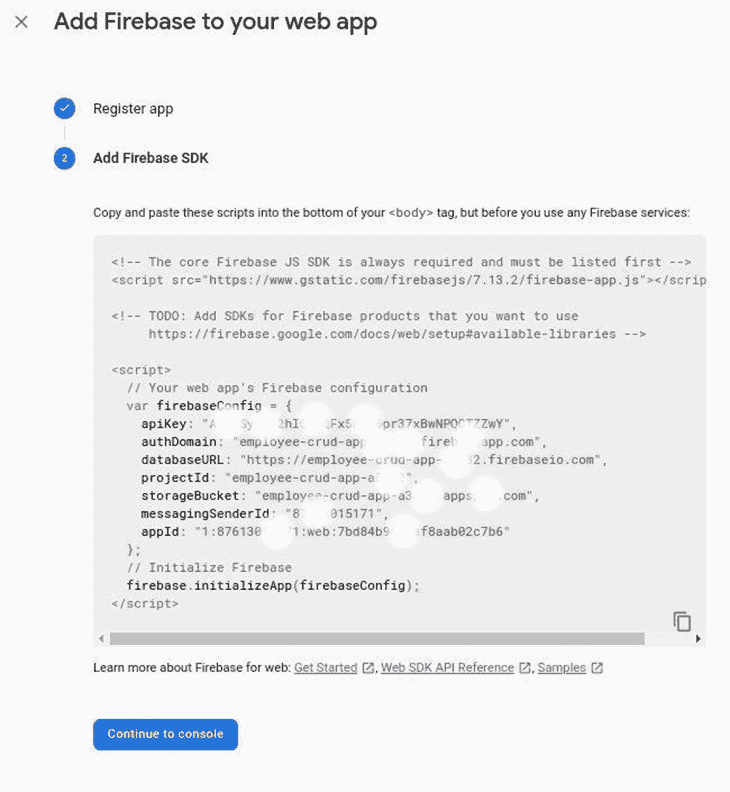
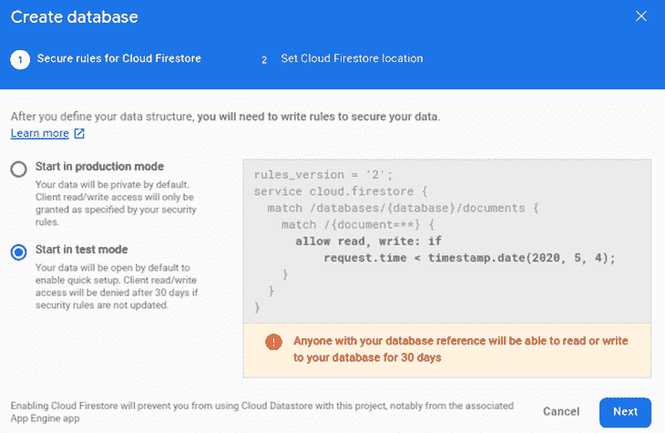
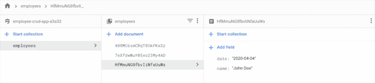
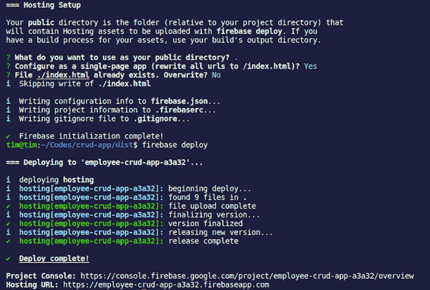
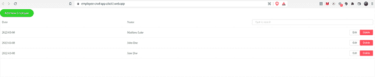

# 如何使用 Cloud Firestore 和 Vuefire 构建和部署 Vue.js 应用程序

> 原文：<https://blog.logrocket.com/how-to-build-deploy-vue-js-app-with-cloud-firestore-vuefire/>

***编者按*** *:本帖于 2022 年 3 月 2 日更新，将 Vuefire 作为一种配置 Vue 3 应用程序和 Firebase 的方法，并改进了示例 Vue 和 Firebase 部署的配置。*

如今，前端工程师可以轻松地构建接口并实现其功能，而无需为开发后端或应用编程接口(API)而头疼。

Vue.js 是一个轻量级框架，用于构建交互式用户界面和单页应用程序。在本教程中，我们将演示两种方法来构建具有创建、读取、更新、删除(CRUD)功能的 Vue.js 应用程序，并使用 Cloud Firestore 存储数据。以下是我们将涵盖的内容的完整列表:

如果您愿意，也可以将这个应用程序部署到 Firebase。

### 什么是 Firebase？

Firebase 是 Google 提供的后端即服务(BaaS ),包括数据库、ML 工具包、云功能、认证、托管、云存储等等。Firebase 抽象了构建健壮且可伸缩的后端系统的复杂性，使开发人员能够专注于构建应用程序的客户端。

### 什么是云 Firestore？

对于我们的 CRUD 应用程序，我们将重点关注使用云 Firestore 进行数据存储。 [Cloud Firestore](https://firebase.google.com/docs/firestore) 是一个 NoSQL 数据库，以文档的形式存储数据，这些文档被整理成集合，并支持客户端或服务器端的集成。云 Firestore 文档包含各种字段，可以保存任何数据类型，并支持非常快速的读或写操作。

### 什么是 Vuefire？

Vuefire 是一个轻量级的包装器，处理 Vue/Vuex 和 Firebase 数据库之间的实时绑定，如实时数据库或云 Firestore。它有一些内置的逻辑，总是保持本地数据与远程 Firebase 数据库同步。

## 先决条件

要跟随本教程，您需要:

*   Vue.js 的基础知识
*   [节点](https://nodejs.org/en/download/)和 [npm](https://www.npmjs.com/get-npm) 已安装
*   一个谷歌账户
*   [Vue.js CLI](https://cli.vuejs.org/) 安装(`npm install -g @vue/cli`)
    *   您可以使用`vue --version`确认您的 Vue.js CLI 版本
*   为了部署(`npm install -g firebase-tools`)而安装的 [Firebase 工具 CLI](https://github.com/firebase/firebase-tools)
    *   您需要使用`firebase login`登录您的谷歌账户

## 创建我们的 Vue.js 应用程序

设置一个 Vue 项目将创建文件并安装构建用户界面所需的依赖项。执行以下命令:

```
vue create crud-app

```

在显示的交互式屏幕上配置您的 Vue 项目。只需选择默认配置的默认(Babel，ESLint)预设即可。

完成后，您应该会看到一个新的`crud-app`目录。



使用`cd crud-app`切换到`crud-app`目录，或者在代码编辑器中打开该文件夹。

### 添加元素用户界面

为了在创建的 Vue.js 项目中设置元素 UI，我们将使用它的 Vue.js 插件。执行下面的命令在`crud-app`目录中安装元素 UI。

```
vue add element

```

按如下方式配置设置:

1.  选择`Fully import`
2.  因为你不必覆盖元素的 SCSS 变量，输入`N`
3.  对于`locale` **，**选择`en`
    

我们现在已经完成了 Vue.js 和元素 UI 的设置。

要启动开发服务器，请执行以下命令。

```
npm run serve

```

您应该会在浏览器上看到类似如下的输出:





现在让我们继续设置和集成 Firebase 后端。

## 设置 firebase 项目和云风暴

要开始使用 Firebase，请按照下面的步骤创建一个 Firebase 项目。(注意:Firebase 项目链接到一个 Google 云平台项目。)

1.  访问 [Firebase 控制台](https://console.firebase.google.com/u/0/?pli=1)并使用您的 Google 帐户登录
2.  点击**添加项目**
3.  点击**继续**创建项目(您可以关闭分析，因为我们不需要它们进行演示)
    
4.  点击网页图标， **< / >**
5.  对于应用程序昵称，输入您想要的任何名称，然后单击**下一步**
6.  当您的 Firebase 配置显示时，复制`scripts`标签
    中的内容

**创建 Firestore 数据库**

1.  点击**数据库**，然后在**云火店**下，点击**创建数据库**
2.  在测试模式下设置[安全规则](https://firebase.google.com/docs/rules/get-started)
    
3.  选择一个位置，点击**下一个**
4.  创建一个雇员集合并添加一些随机文档(可选)
    

## 用 Vue.js 配置 Firebase

在使用云 Firestore 之前，您需要在 Vue 项目上设置 [Firebase 客户端](https://firebase.google.com/docs/firestore/client/libraries)。
安装 Firebase JS 客户端并更新`crud-app`目录中的依赖项。

```
npm install firebase --save

```

在`src`目录下创建一个具有相似内容的名为`firebaseInit.js`的新文件。

```
// src/firebaseInit.js
import firebase from "firebase";

// Your web app's Firebase configuration
var firebaseConfig = {
  apiKey: "AIzaSyC9J2hIQ1XQFZZZZZZZZZZZZZZZZZ",
  authDomain: "employee-crud-ZZZZZZZZZ.firebaseapp.com",
  databaseURL: "https://employee-crud-ZZZZZZ.firebaseio.com",
  projectId: "employee-crud-XXXXXXXX",
  storageBucket: "employee-crud-ZZZZZ.appspot.com",
  messagingSenderId: "8761301111111",
  appId: "1:87613015171:web:e60ee5139c5ZZZZZZZ"
};

// Initialize Firebase
export default firebase.initializeApp(firebaseConfig);

```

将`firebaseConfig`对象替换为之前在 Firebase 应用程序安装过程中复制的对象。

## 使用元素 UI 创建 UI

Vue.js 使用单文件组件，允许你在一个`.vue`文件中构建一个完整的用户界面——包括布局、功能和风格。对于本教程，您只需要修改`src/App.vue`文件。你现在可以清除`App.vue`文件的内容，因为它很快就会被替换。

我们将使用一个名为 [Element UI](https://element.eleme.io/#/en-US) 的设计库，它提供了许多可重用的组件，使得构建界面更快。出于我们的目的，我们将使用一个基本数据表来列出来自数据库的所有文档。

popover 输入用于创建和编辑文档，而按钮用于触发删除。

```
<template>
  <!-- eslint-disable -->
  <div>
    <el-popover
      placement="bottom"
      title="New Employee"
      width="200"
      trigger="click"
    >
      <el-input
        placeholder="John Doe"
        v-model="name"
        @blur="createEmployee(name, date)"
      ></el-input>
      <el-button round slot="reference" type="success"
        >Add New Employee</el-button
      >
    </el-popover>
    <el-table
      :data="
        employeesData.filter(
          (data) =>
            !search || data.name.toLowerCase().includes(search.toLowerCase())
        )
      "
      style="width: 100%;"
    >
      <el-table-column label="Date" prop="date"> </el-table-column>
      <el-table-column label="Name" prop="name"> </el-table-column>
      <el-table-column align="right">
        <template slot="header" :slot-scope="scope">
          <el-input v-model="search" size="mini" placeholder="Type to search" />
        </template>
        <template slot-scope="scope">
          <el-popover
            placement="bottom"
            title="Edit Employee"
            width="200"
            trigger="click"
          >
            <el-input
              placeholder="John Doe"
              v-model="scope.row.name"
              @blur="updateEmployee(scope.row.id, scope.row.name, date)"
            ></el-input>
            <el-button size="mini" slot="reference">Edit</el-button>
          </el-popover>
          <el-button
            size="mini"
            type="danger"
            @click="deleteEmployee(scope.row.id)"
            >Delete</el-button
          >
        </template>
      </el-table-column>
    </el-table>
  </div>
</template>

<script>

export default {
  name: 'app',
  data(){
    return {
      name: '',
      employeesData: []
    }
  }
}
</script>

```

界面现在应该看起来像下面的截图。


## 在我们的 Vue.js 应用中集成云 Firestore CRUD 方法

在本节中，我们将在 Vue.js 应用程序中集成 Cloud Firestore for CRUD operations。下面是一些解释这种方法如何工作的节选片段。

您需要导入初始化的 Firebase 应用程序，并在`src/App.vue`中创建一个云 Firestore 实例。

```
import firebase from "./firebaseInit";
const db = firebase.firestore();

```

### `create`方法

下面的方法在云 Firestore 集合上创建一个新文档。

```
    createEmployee(name, date) {
        db.collection("employees")
          .add({ date: date, name: name })
          .then(() => {
            console.log("Document successfully written!");
          })
          .catch((error) => {
            console.error("Error writing document: ", error);
          });
    }

```

`name`和`date`的值作为新文档保存在`employees`集合中。

### `read`方法

此方法用于从云 Firestore 集合中获取所有文档。

```
    readEmployees() {
      let employeesData = [];
      db.collection("employees")
        .get()
        .then((querySnapshot) => {
          querySnapshot.forEach((doc) => {
           employeesData.push({
              id: doc.id,
              name: doc.data().name,
              date: doc.data().date,
            });
            console.log(doc.id, " => ", doc.data());
          });
          return employeesData
        })
        .catch((error) => {
          console.log("Error getting documents: ", error);
        });
    }
>
```

这将遍历 Cloud Firestore 集合中的所有文档，并将它们的数据和`id`写入`employeesData`变量。

### `update`方法

`update`方法用于编辑 Cloud Firestore 集合中的现有文档。

```
    updateEmployee(id, name, date) {
      db.collection("employees")
        .doc(id)
        .update({
          name: name,
          date: date,
        })
        .then(() => {
          console.log("Document successfully updated!");
        })
        .catch((error) => {
          console.error("Error updating document: ", error);
        });
    }

```

带有传递的`id`的文档将在 Cloud Firestore 集合上用我们在方法调用期间传递的`name`和`date`的新值进行更新。

### `delete`方法

`delete`方法删除 Cloud Firestore 集合中存在的文档。

```
    deleteEmployee(id) {
      db.collection("employees")
        .doc(id)
        .delete()
        .then(() => {
          console.log("Document successfully deleted!");
        })
        .catch((error) => {
          console.error("Error removing document: ", error);
        });
    }

```

带有已通过的`ID`的文档将从云 Firestore 集合中删除。

如前所述，我们的函数都包含在`methods()`部分，使用的变量列在`data()`部分。然后我们调用`mounted()`生命周期钩子中的`readEmployees()`方法，因为我们希望在应用程序加载后读取所有文档。

现在，您可以用下面的代码片段更新`src/App.vue`文件的`<script>`部分:

```
<!-- src/App.vue -->
<! ... >
<script>
import firebase from "./firebaseInit";
const db = firebase.firestore();
export default {
  data() {
    return {
      name: "",
      date: new Date().toISOString().slice(0, 10),
      employeesData: [],
      search: "",
    };
  },
  methods: {
    createEmployee(name, date) {
      if (name != "") {
        db.collection("employees")
          .add({ date: date, name: name })
          .then(() => {
            console.log("Document successfully written!");
            this.readEmployees();
          })
          .catch((error) => {
            console.error("Error writing document: ", error);
          });
        this.name = "";
      }
    },
    readEmployees() {
      this.employeesData = [];
      db.collection("employees")
        .get()
        .then((querySnapshot) => {
          querySnapshot.forEach((doc) => {
            this.employeesData.push({
              id: doc.id,
              name: doc.data().name,
              date: doc.data().date,
            });
            console.log(doc.id, " => ", doc.data());
          });
        })
        .catch((error) => {
          console.log("Error getting documents: ", error);
        });
    },
    updateEmployee(id, name, date) {
      db.collection("employees")
        .doc(id)
        .update({
          name: name,
          date: date,
        })
        .then(() => {
          console.log("Document successfully updated!");
          this.readEmployees();
        })
        .catch((error) => {
          // The document probably doesn't exist.
          console.error("Error updating document: ", error);
        });
    },
    deleteEmployee(id) {
      db.collection("employees")
        .doc(id)
        .delete()
        .then(() => {
          console.log("Document successfully deleted!");
          this.readEmployees();
        })
        .catch((error) => {
          console.error("Error removing document: ", error);
        });
    },
  },
  mounted() {
    this.readEmployees();
  },
};
</script>

```

我们完事了。

## 在我们的 Vue.js 应用中集成 Vuefire

Vuefire 提供了另一种绑定到我们的云 Firestore 数据库的方法。使用这种方法，您提供了要绑定的状态的键，而 Vuefire 负责剩下的事情！

Vuefire 能够查询和修改数据，就像我们在上一节中编写的自定义 CRUD 方法一样。在`crud-app`目录下安装 Vuefire npm 包，如下所示:

```
npm install vuefire --save

```

要使用 Vuefire 提供的 Firestore 插件，请修改`src/main.js`文件，并将以下粗体代码行添加到您的文件中:

```
// src/main.js

import Vue from 'vue'
import App from './App.vue'
import './plugins/element.js'

import { firestorePlugin } from 'vuefire'
Vue.use(firestorePlugin);

Vue.config.productionTip = false
new Vue({
  render: h => h(App),
}).$mount('#app')

```

您还需要将初始化的 Firebase 应用程序导入到`src/App.vue`:

```
import firebase from "./firebaseInit";
const db = firebase.firestore();

```

### Vuefire CRUD 操作

我们来讨论一下 Vuefire 执行 CRUD 操作的方式。为了查询数据，我们可以使用`firestore`属性来映射我们的 Firestore 数据库，以便可以访问它。我们可以使用下面的代码片段从远程数据库中执行读取操作:

```
// src/App.vue
// ...

<script>
import firebase from "./firebaseInit";
const db = firebase.firestore();
export default {
  name: 'app',
  data(){
    return {
      name: '',
      employeesData: []
    }
  },
  firestore: {
    employeesData: db.collection('employees')
  }
}
</script>

```

在从远程数据库读取数据时，Vuefire 还提供了对数据进行排序和过滤的选项。

对于修改数据，诸如从数据库中写入、更新和删除数据之类的操作可以包装到我们可以使用引用调用的方法中。以下代码片段执行数据修改；这些方法以粗体字符格式化:

```
// src/App.vue
// ...

<script>
import firebase from "./firebaseInit";
const db = firebase.firestore();
export default {
  name: "app",
  data() {
    return {
      name: "",
      employeesData: [],
    };
  },
  firestore: {
    employeesData: db.collection("employees"),
  },
  methods: {
    createEmployee(name) {
      this.$firestoreRefs.cities.add({
        name: name,
        date: new Date().toISOString().slice(0, 10),
      });
    },
    updateEmployee(employee) {
      const employee = { id: id, name: name, date: date };
      this.$firestoreRefs.employee.update({ name: employee.name }).then(() => {
        console.log("Employee updated!");
      });
    },
    deleteEmployee(id) {
      const employee = { id: id, name: name, date: date };
      this.$firestoreRefs.employee.doc(employee.id).delete();
    },
  },
};
</script>

```

要了解更多关于使用 Vuefire 修改数据的信息，请查看官方文档[这里](https://vuefire.vuejs.org/vuefire/writing-data.html)。

## 部署我们的 Vue.js 应用程序

Firebase 允许您部署静态文件——但是首先，您必须构建您的资产。在`crud-app`目录中，运行以下命令。

```
npm run build && cd dist

```

接下来，初始化 Firebase 并完成以下步骤。

```
firebase init

```

1.  将“托管”定义为要为文件夹设置的 Firebase CLI 功能
2.  对于项目设置，选择`Use an existing project`
3.  导航并选择我们之前创建的项目
4.  将公共目录设置为:`.`
5.  对于`Configure as a single-page app (rewrite all urls to /index.html)`，选择`Yes`
6.  对于`File ./index.html already exists. Overwrite?`,选择`No`

要进行部署，请执行以下命令。

```
firebase deploy

```



您可以在此访问部署的应用[。](https://employee-crud-app-a3a32.web.app/)



## 结论

现在，您应该已经具备了使用 Vue.js 构建一个简单的客户端应用程序和使用 Firebase 构建数据存储和托管应用程序所需的基本工具。你可以在 [GitHub](https://github.com/Timtech4u/employee-crud) 上找到完整的源代码，也可以访问应用的[演示。](https://employee-crud-app-a3a32.web.app/)

要了解更多信息，请查看以下资源。

## 像用户一样体验您的 Vue 应用

调试 Vue.js 应用程序可能会很困难，尤其是当用户会话期间有几十个(如果不是几百个)突变时。如果您对监视和跟踪生产中所有用户的 Vue 突变感兴趣，

[try LogRocket](https://lp.logrocket.com/blg/vue-signup)

.

[](https://lp.logrocket.com/blg/vue-signup)[https://logrocket.com/signup/](https://lp.logrocket.com/blg/vue-signup)

LogRocket 就像是网络和移动应用程序的 DVR，记录你的 Vue 应用程序中发生的一切，包括网络请求、JavaScript 错误、性能问题等等。您可以汇总并报告问题发生时应用程序的状态，而不是猜测问题发生的原因。

LogRocket Vuex 插件将 Vuex 突变记录到 LogRocket 控制台，为您提供导致错误的环境，以及出现问题时应用程序的状态。

现代化您调试 Vue 应用的方式- [开始免费监控](https://lp.logrocket.com/blg/vue-signup)。