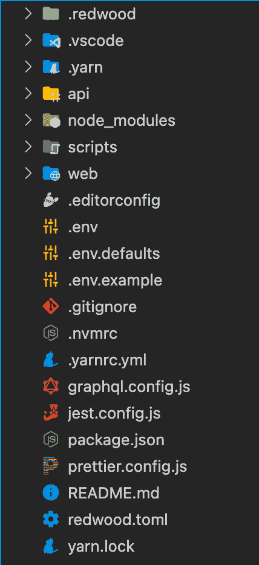
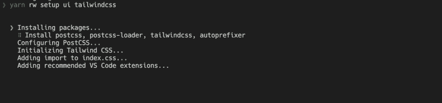
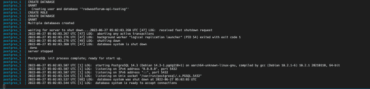
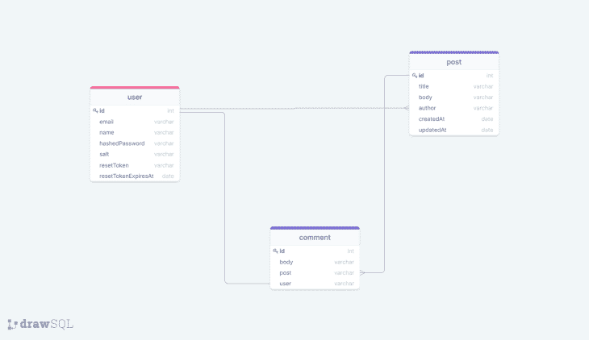
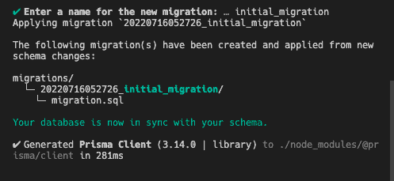
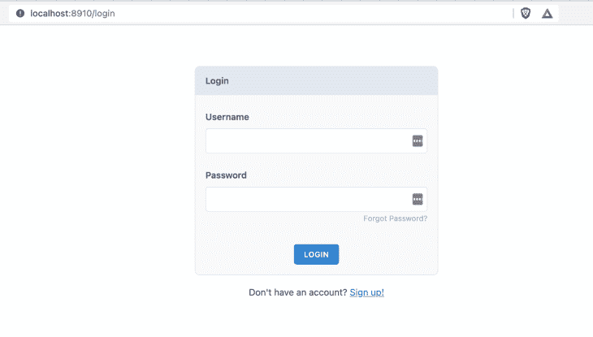

# 如何在 RedwoodJS 中搭建全栈 app

> 原文：<https://blog.logrocket.com/how-to-build-full-stack-app-redwoodjs/>

在本指南中，我们将介绍如何使用 RedwoodJS 构建全栈应用。

您可能已经看过很多关于使用 x framework (or)技术构建全栈应用的教程和指南，但是，RedwoodJS 在某些方面是不同的和有益的，包括:

1.  RedwoodJS 包括 [Typescript](https://blog.logrocket.com/tag/typescript/) 、GraphQL、Prisma 和一个测试框架
2.  初创公司可以构建产品并制作原型，因为它提供了认证、授权和 CRUD 操作等模块。我们需要做的就是为我们的需求设计业务逻辑
3.  CLI 是 RedwoodJS 最好的特性之一；它使开发过程更快更容易

在这里，我们将建立一个论坛来了解 RedwoodJS 应用程序是如何构建的。它包含了帮助你理解所有框架功能的所有功能。

我们将要构建的功能有:

*   登录和注册
*   创建、阅读和更新帖子
*   评论系统
*   基于用户的帖子访问

除了 RedwoodJS，我们还将使用 Typescript 进行类型检查，使用 TailwindCSS 进行样式设置。

### 目录

### 红木安装和设置

RedwoodJS 使用 [yarn](https://classic.yarnpkg.com/en/docs/install#mac-stable) 作为包管理器。安装完成后，您可以使用以下命令创建一个新项目:

```
yarn create redwood-app --ts ./redwoodblog

```

它搭建了所有的模块来构建一个全栈应用。在这里，您可以看到 RedwoodJS 应用程序的完整结构。



有三个主要目录。他们是`api`、`scripts`和`web`。我们来详细讨论一下。

*   `.redwood`:包含应用程序的内部版本。
*   `api`:服务于应用程序的后端。它主要包含`db`，服务于应用程序的数据库模式。所有后端功能将在`src`目录中
    *   包含你所有的后台代码。它包含五个目录，如下所示:
        *   `directives`:包含 GraphQL [模式指令](https://www.graphql-tools.com/docs/schema-directives)来控制对 GraphQL 查询的访问
        *   `functions` : RedwoodJS 将 GraphQL API 作为无服务器函数运行。它自动生成`graphql.ts`；您可以在其上添加额外的无服务器功能
        *   `graphql`:包含用模式定义语言(SDL)编写的 GraphQL 模式
        *   `lib`:包含后端 API 中所有可重用的函数。例如，身份验证
        *   `services`:包含与您的数据相关的业务逻辑。它运行与 API 相关的功能并返回结果

### 设置尾翼 CSS

安装 TailwindCSS 很简单；在根目录中运行以下命令:

```
yarn rw setup ui tailwindcss

```



要确认 TailwindCSS 的安装，请转到`web/src/index.css`并查看该文件中的 Tailwind 类。

## 连接数据库

为了连接 Postgres 数据库，我们将使用 Docker 进行本地开发。

(注意:要安装 Docker，请参见 Docker 官方网站上的[文档](https://docs.docker.com/engine/install/))

在根目录中创建`docker-utils/postgres-database.sh`,并添加以下脚本:

```
#!/bin/bash

set -e
set -u

function create_user_and_database() {
        local database=$1
        echo "  Creating user and database '$database'"
        psql -v ON_ERROR_STOP=1 --username "$POSTGRES_USER" <<-EOSQL
            CREATE USER $database;
            CREATE DATABASE $database;
            GRANT ALL PRIVILEGES ON DATABASE $database TO $database;
EOSQL
}

if [ -n "$POSTGRES_MULTIPLE_DATABASES" ]; then
        echo "Multiple database creation requested: $POSTGRES_MULTIPLE_DATABASES"
        for db in $(echo $POSTGRES_MULTIPLE_DATABASES | tr ',' ' '); do
                create_user_and_database $db
        done
        echo "Multiple databases created"
fi 
```

这个脚本实现了一个在 Postgres 中创建用户和数据库的函数。一旦创建了脚本，就可以使用`docker-compose up`来运行 Postgres 数据库。

创建`docker-compose.yml`并添加以下代码:

```
version: "3.6"
services:
  postgres:
    image: postgres
    restart: unless-stopped

```

如果您想基于环境创建不同版本的`docker-compose up`，您也可以这样做。为此，创建`docker-compose.override.yml`并添加以下代码:

```
version: "3"
services:
  postgres:
    image: postgres
    environment:
      - POSTGRES_USER=api
      - POSTGRES_PASSWORD=development_pass
      - POSTGRES_MULTIPLE_DATABASES="redwoodforum-api","redwoodforum-api-testing"
    volumes:
      - ./docker-utils:/docker-entrypoint-initdb.d
      - redwoodforum_api_data:/data/postgres
    ports:
      - 5440:5432
volumes:
  redwoodforum_api_data: {}

```

添加脚本后，可以使用以下命令运行数据库:

```
docker-compose up

```



要将 Redwood 应用程序连接到 Postgres，请将 Prisma 配置更改为 PostgreSQL 提供程序，并在环境变量中添加数据库 URL。

转到`api/db/schema.prisma`，将数据库提供商更改为`postgresql`。在你的. env 中添加`DATABASE_URL`。

```
DATABASE_URL=postgres://api:[[email protected]](/cdn-cgi/l/email-protection):5440/redwoodforum-api 
```

## 设计数据库

正如你在演示中看到的，我们想建立一个论坛。但是，在我们实现该功能之前，我们希望用户能够在我们的应用程序中完成以下关键工作:

*   用户可以登录/注册该应用程序
*   一旦用户登录，他们可以在论坛中创建帖子
*   用户可以对任何帖子发表评论，所有者可以删除任何评论
*   用户可以查看他们的帖子，并进入主页查看所有帖子

让我们为应用程序设计一个 ER 图。



这里我们有`user`、`post`和`comment`模式。

`user`和`post`是一对多关系，`post`和`comment`是一对多关系，`comment`和`user`是一对一关系。

现在我们有了应用程序的 ER 图。让我们为数据库创建模式。为此，请访问`api/db/schema.prisma`。

(注:RedwoodJS 使用 Prisma 作为数据库。如果你是 Prisma world 的新手，查看他们的[文档](https://www.prisma.io/docs/getting-started)了解更多信息)

现在，在 Prisma 文件中创建模式:

```
model User {
  id           Int            @id @default(autoincrement())
  email        String         @unique
  name         String?
  hashedPassword     String
  salt String
  resetToken String?
  resetTokenExpiresAt DateTime?
  posts   Post[]
  comments Comment[]
}

model Post {
  id           Int            @id @default(autoincrement())
  title        String
  body         String
  comments     Comment[]
  author     User    @relation(fields: [authorId], references: [id])
  authorId   Int
  createdAt    DateTime  @default(now())
  updatedAt    DateTime  @default(now())
}

model Comment {
  id     Int    @id @default(autoincrement())
  body   String
  post   Post   @relation(fields: [postId], references: [id])
  postId Int
  author User   @relation(fields: [authorId], references: [id])
  authorId Int
  createdAt DateTime @default(now())
  updatedAt DateTime @default(now())
}

```

如您所见，我们在`User`、`Post`和`Comment`模式之间有一个关系。

在 Prisma 中定义一段关系很简单。可以参考[文档](https://www.prisma.io/docs/concepts/components/prisma-schema/relations/one-to-many-relations)了解更多细节。

一旦您在 Prisma 中定义了一个模式，您必须运行迁移以在 Postgres 中将这些模式创建为一个表。

## 棱镜迁移

Prisma 的一个特点是可以针对不同阶段管理迁移。这里，我们将只为开发运行迁移。为此，您可以使用以下命令:

```
yarn redwood prisma migrate dev

```



要检查迁移是否成功，您可以进入 Prisma Studio 并查看迁移后的所有表格。通过访问 [http://localhost:5555](http://localhost:5555) ，可以看到所有的表和每个表中的列。

```
yarn redwood prisma studio

```

现在，我们有了 API 和前端的数据库和模式，让我们为应用程序创建身份验证。

## 证明

RedwoodJS 提供了开箱即用的身份验证。一个简单的 CLI 命令将为您提供让身份验证正常工作所需的一切。

```
yarn rw setup auth dbAuth

```

它将创建一个`auth.ts`无服务器函数，检查 cookie 是否存在于数据库中以及令牌是否过期。然后，它将基于此的响应返回给客户端。

它还创建了`lib/auth.ts`来处理一些功能，比如从会话中获取当前用户、检查是否经过身份验证、要求身份验证等等。

到目前为止，我们已经有了 API 和数据库的认证功能。让我们为登录、注册和忘记密码创建页面。然后，您可以使用该命令来搭建登录、注册和忘记密码页面。

```
yarn rw g dbAuth

```

它将创建所有用于身份验证的页面。您可以在`web/src/pages`查看这些页面。


为了设计页面的样式，您可以使用源代码中的组件，并根据您的喜好对它们进行定制。以下是实现中的完整登录页面:



为了连接登录和注册功能的 API，RedwoodJS 提供了钩子来完成所有的功能。

```
import { useAuth } from '@redwoodjs/auth'

// provides login and signup functionality out of the box
const { isAuthenticated, signUp, logIn, logOut } = useAuth()

```

在表单`onSubmit`函数中，我们可以使用那个`signup`和`logIn`来发出 API 请求并发送有效载荷。

```
const onSubmit = async (data) => {
    const response = await signUp({ ...data })

    if (response.message) {
      toast(response.message)
    } else if (response.error) {
      toast.error(response.error)
    } else {
      // user is signed in automatically
      toast.success('Welcome!')
    }
  }

```

一旦用户注册或登录，您就可以使用`currentUser`跨应用程序访问用户信息。

```
const { currentUser } = useAuth()

```

现在，我们让用户登录到应用程序。接下来，让我们构建发布和评论的功能。

一旦用户登录，他们就进入主页，在那里我们需要显示论坛中的所有帖子。然后，用户可以创建新帖子并更新帖子。

要实现清单页面，请使用主页组件创建一个路由，并从 API 获取数据以在客户端显示。

幸运的是，RedwoodJS 提供了为我们生成所有实现的脚手架。假设您想要搭建所有页面，包括 GraphQL 后端实现，您可以使用以下命令:

```
yarn redwood g scaffold post

```

它将为帖子模型生成页面、SDL 和服务。你可以在他们的[文档](https://redwoodjs.com/docs/cli-commands)中参考所有的 RedwoodJS 命令。

因为我们要定制页面。让我们只支持 SDL 和服务业。使用此命令:

```
yarn redwood g sdl --typescript post

```

它将在`graphql/posts.sdl.ts`和`services/posts`中创建 post 域文件——让我们在 web 上创建页面。

即使我们定制了页面和组件，我们也不需要从头开始创建一切。相反，我们可以使用脚手架，并根据我们的需求对其进行修改。

让我们使用这个命令创建一个**主页**:

```
yarn redwood g page home

```

它将创建一个主页并将该页面添加到`Routes.tsx`中。现在，您已经有了基本的主页组件。

现在，要在主页上列出所有的文章，您需要从 API 获取数据并在页面上显示。为了使这个过程更容易，RedwoodJS 提供了细胞。单元格是一种声明性的数据获取方法——它执行 GraphQL 查询并管理其生命周期。

要生成单元格，请使用以下命令:

```
yarn rw generate cell home

```

它将创建一个 GraphQL 查询及其生命周期:

```
import type { FindPosts } from 'types/graphql'

import { Link } from '@redwoodjs/router'
import type {
  CellSuccessProps,
  CellFailureProps,
  CellLoadingProps,
} from '@redwoodjs/web'

export const QUERY = gql`
  query FindPosts {
    posts {
      id
      title
      body
      comments {
        id
      }
      createdAt
      updatedAt
    }
  }
`

export const Loading: React.FC<CellLoadingProps> = () => <div>Loading...</div>

export const Empty = () => <div>No posts found</div>

export const Failure = ({ error }: CellFailureProps) => (
  <div>Error loading posts: {error.message}</div>
)

export const Success = ({ posts }: CellSuccessProps<FindPosts>) => {
  return (
    <div>
      <ul>
        {posts.map((post) => (
          <li key={post.id}>
            {' '}
            <Link to={`/posts/${post.id}`}>
              <div className="p-2 my-2 rounded-lg shadow cursor-pointer">
                <h4 className="text-xl font-medium">{post.title}</h4>

                <p>{post.body}</p>
              </div>
            </Link>
          </li>
        ))}
      </ul>
    </div>
  )
}

```

### 受保护的路线

为了保护 RedwoodJS 应用程序中的路线，您可以使用来自`@redwoodjs/router`的`Private`并将所有内容包装在路线中。

```
<Private unauthenticated="login">
        <Set wrap={NavbarLayout}>
          <Set wrap={ContainerLayout}>
            <Route path="/new" page={NewpostPage} name="newpost" />
            <Set wrap={SidebarLayout}>
              <Route path="/" page={HomePage} name="home" />
              // routes come here
            </Set>
          </Set>
        </Set>
</Private>

```

## 创建帖子

要创建新帖子，请使用以下命令搭建新帖子页面:

```
yarn redwood g page newpost /new

```

如果您想定制路由 URL，您可以在这里将其作为参数传递。RedwoodJS 根据提供的名称添加路线。RedwoodJS 提供了现成的表单和验证，

```
import {
  FieldError,
  Form,
  Label,
  TextField,
  TextAreaField,
  Submit,
  SubmitHandler,
} from '@redwoodjs/forms'

```

一旦用户提交了表单，您就可以调用 GraphQL 变体来创建帖子。

```
const CREATE_POST = gql`
  mutation CreatePostMutation($input: CreatePostInput!) {
    createPost(input: $input) {
      id
    }
  }
`
const onSubmit: SubmitHandler<FormValues> = async (data) => {
    try {
      await create({
        variables: {
          input: { ...data, authorId: currentUser.id },
        },
      })
      toast('Post created!')
      navigate(routes.home())
    } catch (e) {
      toast.error(e.message)
    }
  }

```

## 帖子详细信息

创建一个帖子详细信息页面和单元格，用于获取数据以查看帖子详细信息。你可以按照我们之前的流程来做。

```
yarn redwood g page postdetails

```

这将在`routes.tsx`中创建页面和路径。要在路由中传递 URL 参数，可以像这样修改它:

```
<Route path="/posts/{id:Int}" page={PostDetails} name="postdetails" />

```

您可以将 ID 作为道具传递到组件中。然后，创建一个单元格来获取文章的详细信息，并将其呈现在组件内部。

```
yarn redwood g cell post

```

添加以下代码以获取特定帖子的数据和评论:

```
import type { FindPosts } from 'types/graphql'
import { format } from 'date-fns'
import { useAuth } from '@redwoodjs/auth'
import type {
  CellSuccessProps,
  CellFailureProps,
  CellLoadingProps,
} from '@redwoodjs/web'

export const QUERY = gql`
  query FindPostDetail($id: Int!) {
    post: post(id: $id) {
      id
      title
      body
      author {
        id
      }
      comments {
        id
        body
        author {
          id
          name
        }
        createdAt
      }
      createdAt
      updatedAt
    }
  }
`

export const Loading: React.FC<CellLoadingProps> = () => <div>Loading...</div>

export const Empty = () => <div>No posts found</div>

export const Failure = ({ error }: CellFailureProps) => (
  <div>Error loading posts: {error.message}</div>
)

export const Success = ({ post }: CellSuccessProps<FindPosts>) => {
  const { currentUser } = useAuth()

  return (
    <div>
      <div>
        <h2 className="text-2xl font-semibold">{post.title}</h2>
        <p className="mt-2">{post.body}</p>
      </div>

      <div className="mt-4 ">
        <hr />
        <h3 className="my-4 text-lg font-semibold text-gray-900">Comments</h3>
        {post.comments.map((comment) => (
          <div
            key={comment.id}
            className="flex justify-between sm:px-2 sm:py-2 border rounded-lg"
          >
            <div className="my-4 flex-1  leading-relaxed">
              <strong>{comment.author.name}</strong>{' '}
              <span className="text-xs text-gray-400">
                {format(new Date(comment.createdAt), 'MMM d, yyyy h:mm a')}
              </span>
              <p>{comment.body}</p>
            </div>
            {currentUser && currentUser.id === post.author.id && (
              <div className="m-auto">
                <button
                  type="button"
                  className="focus:outline-none text-white bg-red-700 hover:bg-red-800 focus:ring-4 focus:ring-red-300 font-medium rounded-lg text-sm px-5 py-2.5 mr-2 mb-2 dark:bg-red-600 dark:hover:bg-red-700 dark:focus:ring-red-900"
                >
                  Delete
                </button>
              </div>
            )}
          </div>
        ))}
      </div>
    </div>
  )
}

```

这里需要注意的一点是检查登录用户是否是文章作者的条件。在这种情况下，我们提供了一个删除评论的选项。

## 基于用户的访问

为了在应用程序内部提供基于用户的访问，可以使用`useAuth`钩子获取当前用户，并向其添加条件。例如，要显示用户创建的帖子列表，您可以使用当前用户 ID 获取作者的帖子。

```
const { currentUser } = useAuth()

```

`MyPostCell.tsx`

```
import { Link } from '@redwoodjs/router'
import type { FindPosts } from 'types/graphql'
import type {
  CellSuccessProps,
  CellFailureProps,
  CellLoadingProps,
} from '@redwoodjs/web'

export const QUERY = gql`
  query FindMyPosts($id: Int!) {
    user: user(id: $id) {
      id
      name
      posts {
        id
        title
        body
      }
    }
  }
`

export const Loading: React.FC<CellLoadingProps> = () => <div>Loading...</div>

export const Empty = () => <div>No posts found</div>

export const Failure = ({ error }: CellFailureProps) => (
  <div>Error loading posts: {error.message}</div>
)

export const Success = ({ user }: CellSuccessProps<FindPosts>) => {
  return (
    <div>
      <ul>
        {user.posts.map((post) => (
          <li key={post.id}>
            {' '}
            <Link to={`/posts/${post.id}`}>
              <div className="shadow rounded-lg p-2 my-2 cursor-pointer">
                <h4 className="text-xl font-medium">{post.title}</h4>

                <p>{post.body}</p>
              </div>
            </Link>
          </li>
        ))}
      </ul>
    </div>
  )
}

```

## 结论

RedwoodJS 提供了开箱即用的一切。这完全是基于我们的需求来构建应用程序。一些重要的概念是单元、页面、Prisma 模式和迁移，以及理解系统如何工作。

一旦你理解了 RedwoodJS，你就可以用很少的时间构建一个全栈应用，就像我们在这篇文章中看到的那样。你可以在这里找到这个教程[的源代码。](https://github.com/ganeshmani/fullstack-redwoodjs-tutorial)

## 您是否添加了新的 JS 库来提高性能或构建新特性？如果他们反其道而行之呢？

毫无疑问，前端变得越来越复杂。当您向应用程序添加新的 JavaScript 库和其他依赖项时，您将需要更多的可见性，以确保您的用户不会遇到未知的问题。

LogRocket 是一个前端应用程序监控解决方案，可以让您回放 JavaScript 错误，就像它们发生在您自己的浏览器中一样，这样您就可以更有效地对错误做出反应。

[](https://lp.logrocket.com/blg/javascript-signup)[https://logrocket.com/signup/](https://lp.logrocket.com/blg/javascript-signup)

[LogRocket](https://lp.logrocket.com/blg/javascript-signup) 可以与任何应用程序完美配合，不管是什么框架，并且有插件可以记录来自 Redux、Vuex 和@ngrx/store 的额外上下文。您可以汇总并报告问题发生时应用程序的状态，而不是猜测问题发生的原因。LogRocket 还可以监控应用的性能，报告客户端 CPU 负载、客户端内存使用等指标。

自信地构建— [开始免费监控](https://lp.logrocket.com/blg/javascript-signup)。