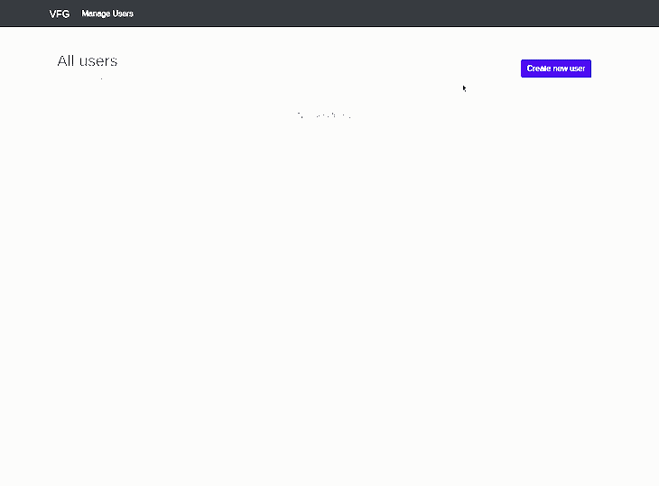
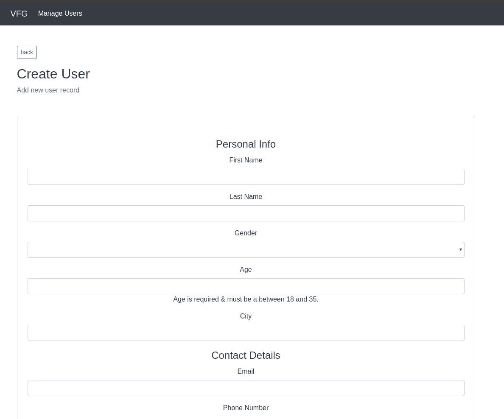
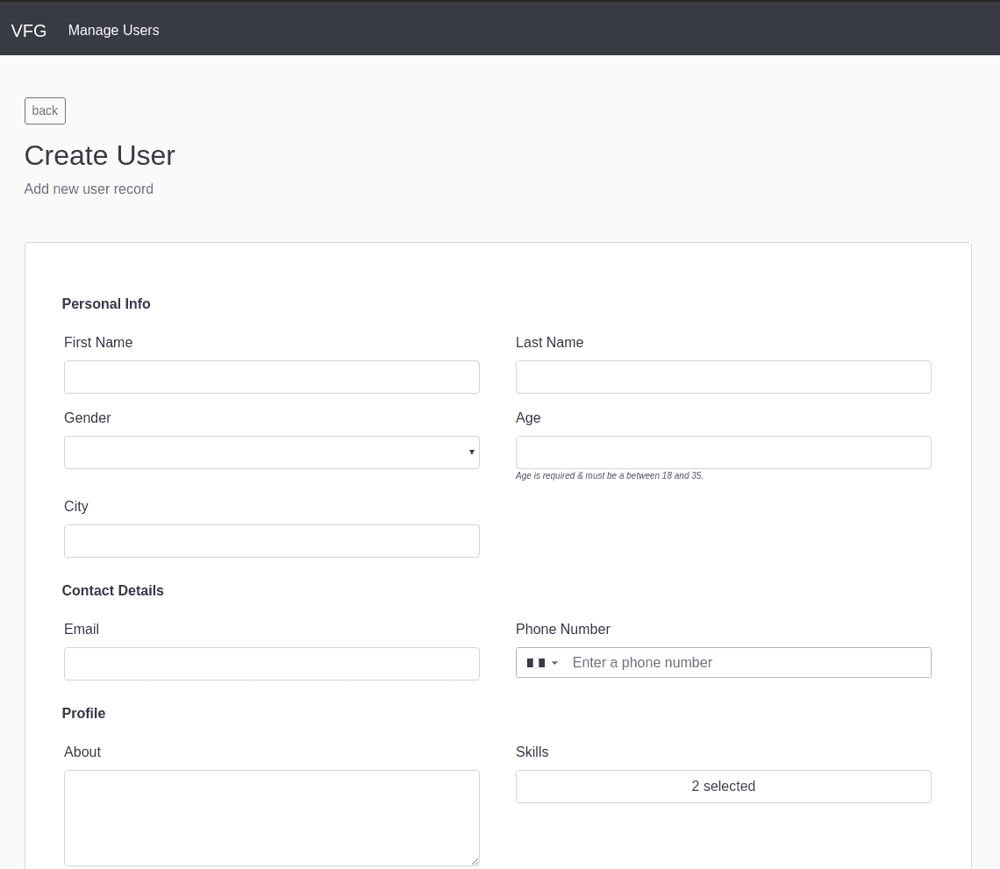

# 如何使用 vue-form-generator - LogRocket 博客构建可重用的表单

> 原文：<https://blog.logrocket.com/how-to-build-reusable-forms-using-vue-form-generator/>

当开发小规模或大规模的应用程序时，表单输入是从用户那里收集数据的主要来源。

随着我们的应用程序越来越大，我们发现需要重用捕获相似数据的表单，而不是通过重复违反 [DRY 原则](https://en.wikipedia.org/wiki/Don%27t_repeat_yourself)的表单来创建冗余文件。为了应对这种增长或保持我们的代码库干净，我们将利用 [vue-form-generato](https://github.com/vue-generators/vue-form-generator) r 包。

vue-form-generator 是 vue.js 的一个基于模式的表单生成器组件，可用于创建基于数据模型或模式的反应式表单。它支持 21 种字段类型，有一个内置的表单验证器，可以很容易地定制，高度可扩展，并且是轻量级的。

为了测试这个库，我们将创建一个简单的用户管理应用程序，演示如何对用户记录执行 CRUD 操作。我们还将探索一些基本的 Vue 表单生成器特性，如定制、验证、扩展等。这些基本特性将使我们能够学习如何通过基于数据模型生成可重用的表单组件来更好地管理表单。

## 先决条件

要学习本教程，需要具备以下条件:

1.  您选择的 IDE，例如 [Visual Studio 代码](https://code.visualstudio.com/)
2.  安装在您电脑上的 [Node.js](https://nodejs.org/en/) (最小节点 v10x)
3.  基本了解 JavaScript 和 [Vue](https://vuejs.org/)
4.  安装在您电脑上的 Vue CLI

## 装置

如果尚未安装，您可以使用此命令在 PC 上安装 Vue CLI:

```
npm install @vue/cli -g

```

现在用这个命令创建一个新的 Vue 项目:

```
vue create user-management-app
```

接下来，将目录更改为新创建的项目:

```
cd user-management-app
```

安装 vue 表单生成器:

```
npm install vue-form-generator
```

让我们安装完成项目所需的附加包。

*   `axios`进行 API 调用
*   `vue-router`在我们的应用中处理路线功能
*   `vue-tel-input`获取功能国家代码和电话号码输入

通过运行以下命令安装这些依赖项:

```
npm install axios vue-router vue-tel-input
```

我们的`package.json`中的`dependencies`对象应该是这样的:

```
"dependencies": {
  "axios": "^0.19.2",
  "core-js": "^3.6.4",
  "vue": "^2.6.11",
  "vue-form-generator": "^2.3.4",
  "vue-router": "^3.1.6",
  "vue-tel-input": "^4.3.0"
}
```

## 入门指南

出于演示的目的，本文构建了一个 [node-express 后端](https://repl.it/@enkaypeter/user-management-api)。这个基于 express 的服务器将帮助我们执行 CRUD 操作。

在本教程结束时，我们将构建一个看起来像下面的 GIF 的应用程序:



## 设置

让我们将包添加到我们的应用程序中，有两种方法可以将包添加到我们的项目中，可以手动添加，也可以直接导入到项目中。

手动的话，你需要下载压缩的包，打开它，从`/dist`文件夹中添加`vfg.css`和`vfg.js`文件到你的项目中。

对于这个项目，我们将使用导入选项。为此，您将把包添加到您的`main.js`文件中，这样表单组件可以在我们的应用程序中重用:

```
// src/main.js

import Vue from 'vue'
import App from './App.vue'
import VueFormGenerator from 'vue-form-generator'

Vue.use(VueFormGenerator);

Vue.config.productionTip = false;

new Vue({
  render: h => h(App),
}).$mount('#app');
```

## 添加引导

为了在我们的应用程序中获得一些预定义的样式，我们将通过内容交付网络(CDN)添加引导程序，如下所示:

```
// public/index.html

<!DOCTYPE html>
<html lang="en">
  <head>
    ...
    <link href="https://stackpath.bootstrapcdn.com/bootstrap/4.4.1/css/bootstrap.min.css" rel="stylesheet">
    ...
  </head>
</html>
```

接下来，我们将通过更新`src/App.vue`将导航条添加到我们的应用程序中，如下所示:

```
// src/App.js

<template>
  <div id="app">
    <nav class="navbar navbar-expand-lg navbar-dark bg-dark">
      <div class="container">
        <a class="navbar-brand" href="#">VFG</a>
        <button class="navbar-toggler" type="button"
                data-toggle="collapse"
                data-target="#navbarNavDropdown"
                aria-controls="navbarNavDropdown"
                aria-expanded="false"
                aria-label="Toggle navigation">
          <span class="navbar-toggler-icon"></span>
        </button>
        <div class="collapse navbar-collapse" id="navbarNavDropdown">
          <ul class="navbar-nav">
            <li class="nav-item active">
              <a class="nav-link" href="#">Manage Users <span class="sr-only">(current)</span></a>
            </li>
          </ul>
        </div>
      </div>
    </nav>
    <div class="container my-5">
      <router-view/>
    </div>
  </div>
</template>

...
```

## 配置 Vue 路由器

在本节中，我们将通过在我们的`src`目录中创建一个`router`文件夹来为我们的应用程序配置路由，如下所示:

```
$ mkdir src/router && touch src/router/index.js
```

`index.js`文件将包含我们所有的路由逻辑和配置。我们将为我们的应用程序创建如下路线:

```
// src/router/index.js

import Vue from 'vue'
import Router from 'vue-router'
import Users from '../pages/Users'
import CreateUser from '../pages/CreateUser'
import EditUser from '../pages/EditUser'

Vue.use(Router)

export default new Router({
  routes: [
    {
      path: '/',
      name: 'Users',
      component: Users
    },
    {
      path: '/create',
      name: 'CreateUser',
      component: CreateUser
    },
    {
      path: '/edit/:id',
      name: 'EditUser',
      component: EditUser
    }
  ]
})
```

> 在上面的代码片段中，我们已经导入了几个尚未创建的组件。这些组件将随着我们的进展而创建。

为了将我们的路由引导到我们的应用程序，我们将把它添加到 Vue 实例中，如下面的代码片段所示:

```
// src/main.js

...

import router from './router'

...

new Vue({
  render: h => h(App),
  router, // add the router config to vue instance
}).$mount('#app');
```

在接下来的部分中，我们将通过在`src`目录中创建一个`pages`文件夹来创建之前导入到我们的`src/router/index.js`文件中的组件。这是我们存储所有路由器视图的地方。

## 用户列表视图

对于我们的用户列表视图，我们将创建一个名为`Users.vue`的文件，并添加下面的代码片段:

```
// src/pages/Users.vue

<template>
    <div class="container">
        <div class="d-flex justify-content-between align-items-center">
            <div class="d-flex flex-column align-items-start">
                <h2>All users</h2><span class="text-muted">list of all users</span>
            </div>
            <router-link to="/create" class="btn btn-primary">Create new user</router-link>
        </div>
        <div class="table-responsive mt-5 bg-white">
            <div class="text-center" v-if="isLoading">Fetching Users</div>
            <table v-if="!isLoading && users.length" class="table">
                <thead>
                <tr>
                    <th>SN</th>
                    <th>First Name</th>
                    <th>Last Name</th>
                    <th>Email</th>
                    <th>Phone Number</th>
                    <th></th>
                </tr>
                </thead>
                <tbody>
                <tr v-for="(user, index) in users" :key="index">
                    <td>{{index+1}}</td>
                    <td>{{user.first_name}}</td>
                    <td>{{user.last_name}}</td>
                    <td>{{user.email}}</td>
                    <td>{{user.phone_number}}</td>
                    <td>
                        <div class="button-group">
                            <button class="btn btn-sm">view</button>
                            <router-link :to="`/edit/${user.id}`" class="btn btn-sm btn-secondary">edit</router-link>
                        </div>
                    </td>
                </tr>
                </tbody>
            </table>
            <div class="text-center" v-if="!isLoading && !users.length">No users found</div>
        </div>
    </div>
</template>

<script>
import axios from 'axios'

export default {
  name: 'Users',
  mounted () {
    this.fetchUsers()
  },
  data () {
    return {
      users: [],
      isLoading: true
    }
  },
  methods: {
    async fetchUsers () {
      try {
        this.users = (await axios.get('https://user-management-api.enkaypeter.repl.co/users')).data
      } catch (e) {
        console.log(e)
        alert(e.message)
      }
      this.isLoading = false
    }
  }

}
</script>

<style scoped></style>
```

在上面的代码片段中，我们创建了一个列表视图，显示我们用户的记录细节。我们还创建了一个链接到`create users`表单的`Create new user`按钮。

## 用户创建表单

在我们继续创建用户表单之前，让我们回顾一下将在表单实现中使用的`vue-form-generator`组件的一些属性。

**模式**:模式对象是我们定义表单字段的地方。这些表单域可以分组，也可以不分组。对于我们的`create user form`,我们将使用分组表单字段。要了解更多关于不同模式格式的信息，你可以访问[文档](https://vue-generators.gitbook.io/vue-generators/component/schema)。

**Options**:Vue 表单组件的选项，这些选项可以用来定义如何在表单上运行验证。

**模型**:模型是一个本地 JSON 对象。如果字段值发生变化，`VueFormGenerator`将修改此模型。

**标签**:这个属性可以用来改变域和组的主 HTML 元素包装器，默认值是一个`fieldset`。

现在我们已经熟悉了一些基本的`vue-form-generator`属性，让我们创建我们的用户表单模式。为此，我们将创建一个名为`forms`的文件夹，其中包含我们的表单模式`userFromSchema.js`，如下所示:

```
$ mkdir src/forms && touch src/forms/userFromSchema.js
```

完成后，我们将 vue-form-generator 导入到一个模式文件中，如下所示:

```
// src/forms/userFormSchema.js

import VueFormGenerator from 'vue-form-generator'

export default {
  groups: []
}

...
```

我们的表格将由四个组组成，即个人信息、联系方式、个人资料和登录信息，如下面的子部分所定义。

## 个人信息

该组包含用于收集用户个人信息的表单字段，并对每个字段进行基本验证，如下所示:

```
// src/forms/userFormSchema.js
...

  {
      legend: 'Personal Info',
      fields: [
        {
          type: 'input',
          inputType: 'text',
          label: 'First Name',
          model: 'first_name',
          required: true,
          validator: ['string', 'required']
        },
        {
          type: 'input',
          inputType: 'text',
          label: 'Last Name',
          model: 'last_name',
          required: true,
          validator: ['string', 'required']
        },
        {
          type: 'select',
          label: 'Gender',
          model: 'gender',
          values: [
            {id: 'male', name: 'Male'},
            {id: 'female', name: 'Female'}
          ],
          selectOptions: {
            noneSelectedText: 'Choose One'
          },
          required: true,
          validator: ['string', 'required']
        },
        {
          type: 'input',
          inputType: 'number',
          label: 'Age',
          model: 'age',
          required: true,
          hint: 'Age is required & must be a between 18 and 35.',
          validator: ['number', 'required'],
          min: 18,
          max: 35
        },
        {
          type: 'input',
          inputType: 'text',
          label: 'City',
          model: 'city',
          required: true,
          validator: ['string', 'required']
        }
      ]
    }

...
```

## 联系方式

此部分包含收集用户电子邮件地址和电话号码的表单字段。该部分包含一个名为`tel-input`的自定义输入字段。我们将在这篇文章的“如何添加自定义输入字段”部分详细讨论这是如何定义的。

```
// src/forms/userFormSchema.js
...

  {
      legend: 'Contact Details',
      fields: [
        {
          type: 'input',
          inputType: 'email',
          label: 'Email',
          model: 'email',
          required: true,
          validator: VueFormGenerator.validators.email
        },
        {
          type: 'tel-input',
          label: 'Phone Number',
          model: 'phone_number'
        }
      ]
    }
...
```

## 轮廓

顾名思义，这个组包含我们将用来收集用户资料信息的表单字段。文本区域用于收集关于用户的信息，清单用于收集用户的技能。

```
// src/forms/userFormSchema.js
...

  {
      legend: 'Profile',
      fields: [
        {
          type: 'textArea',
          inputType: 'textArea',
          rows: 4,
          label: 'About',
          model: 'about',
          required: true,
          validator: ['string', 'required']
        },
        {
          type: 'checklist',
          label: 'Skills',
          model: 'skills',
          values: ['Javascript', 'VueJS', 'CSS3', 'HTML5'],
          multiSelect: true,
          multi: true,
          required: true,
          validator: ['array', 'required'],
          selectOptions: {
            noneSelectedText: 'Choose One'
          }
        }
      ]
    }
...
```

## 登录详细信息

该组用于收集用户的建议用户名和密码。该组还包含自定义验证规则，这将在本文的“如何添加自定义验证规则”一节中阐述。

```
// src/forms/userFormSchema.js
...
  {
      legend: 'Login Details',
      fields: [
        {
          type: 'input',
          inputType: 'text',
          label: 'Username',
          model: 'username',
          required: true,
          validator: ['string', 'required']
        },
        {
          type: 'input',
          inputType: 'password',
          label: 'Password',
          model: 'password',
          required: true,
          validator: ['strongPassword', 'required']
        }
      ]
    }
...
```

这四个组组成了我们的`create user form`模式，并将决定我们的表单域将如何呈现。要了解它们是如何组合在一起的，你可以查看 GitHub 上的[项目库](https://github.com/enkaypeter/user-management-app/blob/master/src/forms/userFormSchema.js)。

## 自定义 vue 表单生成器

预定义的输入类型和字段有时不能满足要求，因为不是每个表单都是通用的。因此，vue-form-generator 可以添加定制的输入类型和内置的定制特性。

在本节中，我们将了解如何添加自定义输入类型，以及如何为表单字段添加自定义验证规则。

### 如何添加自定义输入字段

在位于`src/forms/userFormSchema.js`的`Contact Details`组中，我们正在添加自定义字段`tel-input`，如下所示:

```
...

{
          type: 'tel-input',
          label: 'Phone Number',
          model: 'phone_number'
}

...
```

为了创建这个字段，我们将在`components`文件夹中创建一个文件`tel-input.vue`，并添加下面的代码片段:

```
// src/components/tel-input.vue

<template>
    <vue-tel-input v-model="value"></vue-tel-input>
</template>

<script>
import { VueTelInput } from 'vue-tel-input'
import { abstractField } from 'vue-form-generator'

export default {
  name: 'TelephoneInput',
  mixins: [abstractField],
  components: {VueTelInput}
}
</script>
```

完成后，我们需要将`tel-input`组件注册为`src/main.js`文件中的全局组件，如下所示:

```
// src/main.js
...
Vue.component('field-tel-input', TelInput)
...
```

## 如何添加自定义验证规则

正如在`Login Details`组中看到的，我们添加了一个`strongPassword`验证规则。这是因为我们希望定义适合我们应用需求的自定义密码验证规则:

```
...

{
          type: 'input',
          inputType: 'password',
          label: 'Password',
          model: 'password',
          required: true,
          validator: ['strongPassword', 'required']
}

...
```

为了创建这个规则，我们将打开我们的`main.js`文件，并像这样更新`Vue.use(VueFormGenerator);`:

```
// src/main.js
...

Vue.use(VueFormGenerator, {
  validators: {
    strongPassword: (value, field, model) => {
      let regex = /^(?=.*[a-z])(?=.*[A-Z])(?=.*\d)[a-zA-Z\d]{5,}$/

      if (!regex.test(value)) {
        return [ 'Password should be a minimum five characters, at least one uppercase letter, ' +
        'one lowercase letter and one number']
      } else {
        return []
      }
    }
  }
})

...
```

在上面的代码片段中，我们使用 regex 来检查我们的密码是否至少有五个字符，至少有一个大写字母、一个小写字母和一个数字。

## 创建用户组件

我们实现的下一步将是添加包含创建表单的用户创建页面。我们将使用下面的代码片段在`pages`文件夹中创建一个名为`CreateUser.vue`的文件:

```
<template>
    <div class="container">
        <div class="d-flex justify-content-start     mb-3">
            <router-link to="/" class="btn btn-sm btn-outline-secondary">back</router-link>
        </div>
        <div class="d-flex justify-content-between align-items-center">
            <div class="d-flex flex-column align-items-start">
                <h2>Create User</h2><span class="text-muted">Add new user record</span>
            </div>
        </div>
        <div class="card pl-4 pt-5 pb-5 pr-4 mt-5">
            <form action="" @submit.prevent="submitUserDetails">
                <vue-form-generator tag="div" :schema="schema" :options="formOptions" :model="model" />
                <div class="d-flex justify-content-end mt-3 pr-4">
                    <button type="submit" class="btn btn-primary btn-lg">
                        {{ isSaving ? 'Saving...' : 'Submit'}}
                    </button>
                </div>
            </form>
        </div>
    </div>
</template>

<script>
import userFormSchema from '../forms/userFormSchema'
import axios from 'axios'

export default {
  name: 'CreateUser',
  mounted () {
  },
  data () {
    return {
      model: {
        first_name: '',
        last_name: '',
        gender: '',
        skills: ['Javascript', 'VueJS'],
        email: '',
        age: '',
        phone_number: '',
        city: '',
        about: '',
        username: '',
        password: ''
      },
      schema: userFormSchema,
      formOptions: {
        validateAfterChanged: true
      },
      isSaving: false
    }
  },
  methods: {
    async submitUserDetails () {
      try {
        await axios.post('https://user-management-api.enkaypeter.repl.co/users', {
          ...this.model
        })
        alert('Saved Successfully')
      } catch (e) {greate
        console.log(e)
        alert(e.message)
      }
    }
  }
}
</script>

<style></style>
```

正如在上面的代码片段中看到的，我们正在导入前面创建的`userFormSchema`来帮助确定我们的表单字段将如何呈现，以及`axios`来帮助我们进行 API 调用。

* * *

### 更多来自 LogRocket 的精彩文章:

* * *

然后，我们在组件的`data`方法中添加了一个`model`属性，用于从表单中获取输入数据。

最后，我们将`formOptions`属性添加到我们的数据方法中。将`validateAfterChanged`设置为`true`将指示 vue-form-generator 在每次字段更改时验证我们的表单。

## 用户编辑表单

该文件与我们的用户创建表单非常相似，只是字段是根据从用户列表视图中选择的用户记录预先填充的。

我们将通过在`pages`文件夹中创建名为`EditUser.vue`的新文件来创建我们的`EditUser`视图，如下所示:

```
<template>
    <div class="container">
        <div class="d-flex justify-content-start     mb-3">
            <router-link to="/" class="btn btn-sm btn-outline-secondary">back</router-link>
        </div>
        <div class="d-flex justify-content-between align-items-center">
            <div class="d-flex flex-column align-items-start">
                <h2>Edit User</h2><span class="text-muted">Edit new user record</span>
            </div>
        </div>
        <div class="card pl-4 pt-5 pb-5 pr-4 mt-5">
            <form action="" @submit.prevent="updateUserDetails">
                <vue-form-generator tag="div" :schema="schema" :model="model" />
                <div class="d-flex justify-content-end mt-3 pr-4">
                    <button class="btn btn-primary btn-lg">
                        {{ isSaving ? 'Saving...' : 'Update'}}
                    </button>
                </div>
            </form>
        </div>
    </div>
</template>

<script>
    import userFormSchema from '../forms/userFormSchema'
    import axios from 'axios'

    export default {
        name: 'EditUser',
        mounted () {
            this.fetchUser(this.$route.params.id)
        },
        data () {
            return {
                model: {},
                schema: userFormSchema,
                id: this.$route.params.id,
                isSaving: false
            }
        },
        methods: {
            async fetchUser () {
                try {
                    this.model = (await axios.get(`https://user-management-api.enkaypeter.repl.co/users/${this.id}`)).data
                } catch (e) {
                    console.log(e);
                    alert(e.message)
                }
            },
            async updateUserDetails () {
                this.isSaving = true;
                try {
                    await axios.put(`https://user-management-api.enkaypeter.repl.co/users/${this.id}`, this.model);
                    alert('User details updated')
                } catch (e) {
                    console.log(e);
                    alert(e.message)
                }
                this.isSaving = false
            }
        }
    }
</script>

<style></style>
```

上面的组件包含两个方法；`fetchUse()`和`updateUserDetails()`。

`fetchUser`方法根据用户的`id`获取用户的记录，而`updateUserDetails`更新用户的详细信息。

让我们休息一下，测试一下我们的应用程序，看看它是什么样子的。为此，让我们在项目目录中运行下面的代码:

```
$ npm run serve
```

如果一切顺利，当您访问显示的 URL 时，应该会看到如下所示的页面:



现在我们已经有了一个运行的应用程序，接下来我们要做的就是通过设计来增加表单的美感。

## 造型模板生成器

vue-form-generator 是引导友好的，并且有一些开箱即用的默认样式。要使用其默认样式，您可以将此文件`vue-form-generator/dist/vfg.css`导入到您的应用程序中。您还可以使用该文件作为起点来修改表单的外观。

对于本教程，我们将编写我们的自定义样式。这将帮助我们更好地理解如何设计组件的样式。

用以下样式替换`src/App.vue`中的样式部分:

```
<style>
  body {
    background-color: #fafafa !important;
  }

  #app {
    font-family: 'Avenir', Helvetica, Arial, sans-serif;
    -webkit-font-smoothing: antialiased;
    -moz-osx-font-smoothing: grayscale;
    text-align: center;
    color: #2c3e50;
  }

  .vue-form-generator > div{
    display: flex;
    justify-content: space-between;
    flex-wrap: wrap;
    flex-grow: 1;
  }

  .form-group{
    display: flex;
    flex-direction: column;
    align-items: flex-start;
    padding: 0 2%;
    width: 50%;
  }

  .field-wrap, .wrapper{
    width: 100%;
  }

  .dropList{
    z-index: 10;
    background-color: #FFF;
    position: relative;
    width: 40%;
    top: 5px;
    right: 12px;
  }

  legend{
    margin: 10px 0 20px 18px;
    font-size: 16px;
    font-weight: bold;
    text-align: left;
  }

  .hint{
    font-size: 10px;
    font-style: italic;
    color: purple;
  }

  .help-block{
    color: red;
  }
</style>
```

在我们应用样式后，我们应该会看到类似下图的东西:


## 结论

在本文中，我们学习了如何在我们的 Vue 应用程序中创建和管理可重用的表单，方法是使用 [vue-form-generator](https://github.com/vue-generators/vue-form-generator) 包基于表单组件的数据模型生成表单组件，这些组件可以在不同的场合重用。

以下每个片段的源代码都可以在 [GitHub](https://github.com/enkaypeter/user-management-app) 上找到。你可以随意复制它，叉它，或者提交一个问题。

这里有一个到 vue 表单生成器文档的链接，它有更多的例子和详细的解释。

## 像用户一样体验您的 Vue 应用

调试 Vue.js 应用程序可能会很困难，尤其是当用户会话期间有几十个(如果不是几百个)突变时。如果您对监视和跟踪生产中所有用户的 Vue 突变感兴趣，

[try LogRocket](https://lp.logrocket.com/blg/vue-signup)

.

[](https://lp.logrocket.com/blg/vue-signup)[https://logrocket.com/signup/](https://lp.logrocket.com/blg/vue-signup)

LogRocket 就像是网络和移动应用程序的 DVR，记录你的 Vue 应用程序中发生的一切，包括网络请求、JavaScript 错误、性能问题等等。您可以汇总并报告问题发生时应用程序的状态，而不是猜测问题发生的原因。

LogRocket Vuex 插件将 Vuex 突变记录到 LogRocket 控制台，为您提供导致错误的环境，以及出现问题时应用程序的状态。

更新您调试 Vue 应用程序的方式- [开始免费监控](https://lp.logrocket.com/blg/vue-signup)。