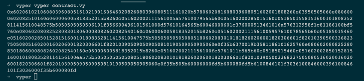
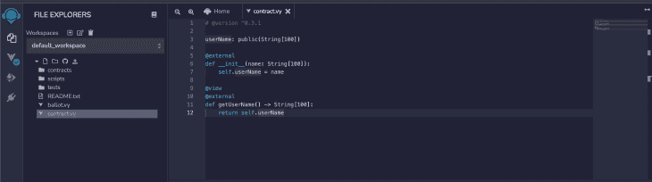
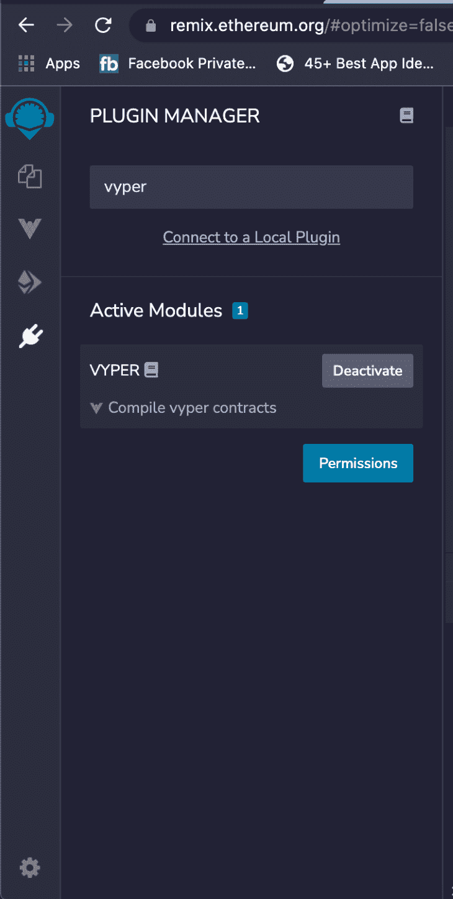
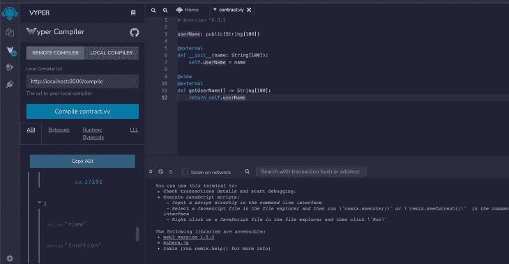
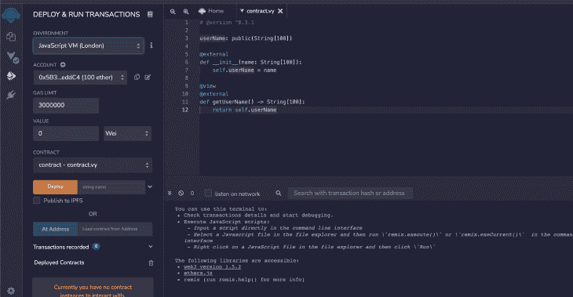
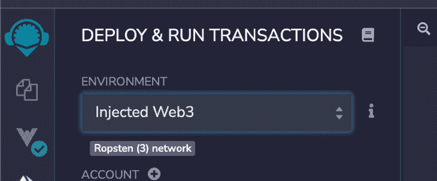
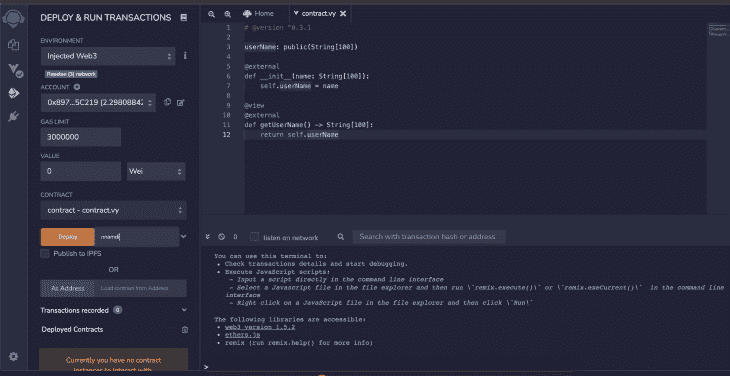
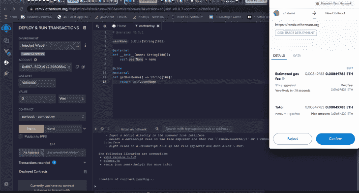
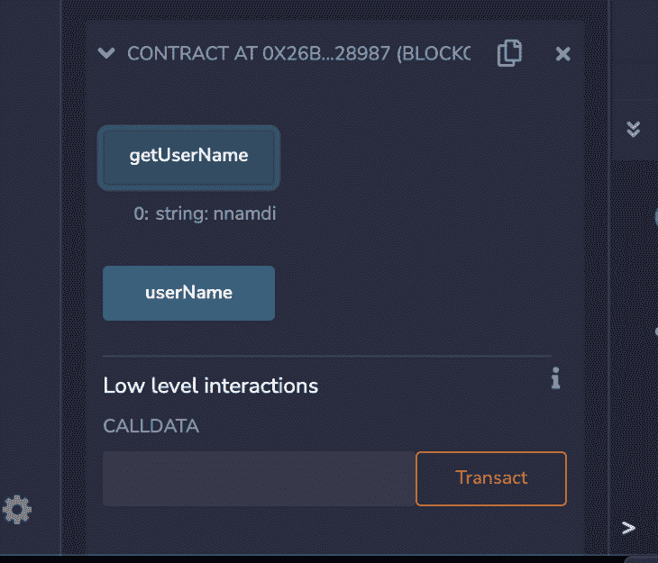

# 如何使用 Vyper 构建安全的智能合约

> 原文：<https://blog.logrocket.com/how-to-build-secure-smart-contracts-using-vyper/>

更多的编程语言被编写出来与 Solidity 竞争只是时间问题。Vyper 类似于 Solidity，但它是以更现代的方式编写的。

在本教程中，我们将带您了解如何使用 Vyper 构建智能合约。

## Vyper 是什么？

Vyper 是一种 pythonic 语言，类似于 Solidity，但以更现代的方式编写。它用于编写在[以太坊虚拟机](https://ethereum.org/learn/#ethereum-basics)上运行的智能合同。

仅次于 Solidity，Vyper 是开发者第二大最受欢迎的契约编程语言选择。从它的名字，我们可以很容易地推断出它是基于 Python 语言的。

Vyper 是一种强类型语言，这意味着我们只能使用一种类型的数据；任何数据类型都不能代替另一种数据类型。

## 为什么使用 Vyper 而不是 Solidity？

你为什么会选择 Vyper 来编写智能合同，而不是更知名和广泛使用的 [Solidity](https://blog.logrocket.com/writing-smart-contracts-solidity/) ？Vyper 的杀手级功能推动了其受欢迎程度和采用率的快速上升。这些独特的功能旨在缓解开发人员在 Solidity 中编写智能合同时通常面临的一些问题。

新加坡国立大学计算学院的研究发现[许多智能合同都有缺陷，并且可能会不可预测地执行](https://arxiv.org/pdf/1802.06038.pdf)。

具体来说，研究人员发现，一些智能合同向从未存放过醚、提供过数据或拥有合同的任意地址分发醚。这些合同被称为挥霍合同。

相比之下，根据这项研究，当契约被耗尽乙醚、遭到攻击或出现紧急情况时，可以被所有者终止的契约被称为自杀契约。贪婪合约是那些锁定醚，并由于错误而缺乏发送它们的指令的合约。

然后是死后契约，当它们被杀死时，确实驻留在以太坊区块链中，但是继续接收事务，即使事务不能调用契约代码。这些锁定了合约余额中的醚。

Vyper 旨在帮助您避免这些问题。Vyper 的特点是对数组和算术运算进行边界和溢出检查。它还使您能够计算精确的气体消耗上限，并支持有符号整数和十进制定点数。

你可以在[官方 Vyper 文档](https://vyper.readthedocs.io/en/stable/index.html)中阅读更多关于 Vyper 的独特特性、原则和目标——包括安全性、语言和编译器的简单性以及可审计性。

简而言之，Vyper 通过收紧给予开发人员的自由漫游，消除了与挥霍、自杀、贪婪和死后合同相关的问题。

了解了基础知识之后，让我们来看一下使用 Vyper 构建智能合同的过程。

## 安装 Vyper

首先，我们需要[安装 Vyper](https://vyper.readthedocs.io/en/latest/installing-vyper.html) 。为此，我们需要 Python 3.6 或更高版本。你可以从 [Python 网站](https://www.python.org/downloads/)下载 Python 二进制文件。

我们还需要`pip`包管理器。要安装它，我们可以使用以下命令:

```
sudo apt-get install python3-pip

```

或者，您可以从[这里](https://bootstrap.pypa.io/get-pip.py)下载一个脚本，然后运行以下命令:

```
python3 get-pip.py

```

确保在您的机器上全局安装了`pip` [软件包管理器](https://pip.pypa.io/en/stable/installation/):

```
pip

```

如果我们得到`command not found`，我们需要手动设置路径指向我们的`pip`安装文件夹。

对于 Mac 用户，您可以通过在`~/.bashrc`文件中添加下面一行来实现这一点:

```
export PATH="$PATH:/Users/chidumennamdi/Library/Python/3.8/bin"

```

我们通过在终端中键入`pip`来测试`pip`命令是否有效。

接下来，我们使用`pip`命令安装 Vyper:

```
pip install vyper

```

## 用 Vyper 编写智能合同

在我们的演示中，我们将构建一个可以存储和显示用户名的智能契约。为了测试我们的智能契约，我们将使用 [Ropsten Testnet](https://ropsten.etherscan.io/) 。这将使我们能够[在部署到以太坊主网之前，用虚拟以太网](https://blog.logrocket.com/complete-guide-blockchain-testing/)测试我们的智能合约。

首先，我们需要安装[元掩码](https://metamask.io/)。MetaMask 是一个浏览器扩展，使您能够与以太坊区块链进行交互。

如果您尚未注册元掩码，可以通过单击浏览器右上角的元掩码徽标来注册。这将打开一个新标签。

注册并登录，然后点击下拉菜单，选择 [Ropsten 测试网络](https://vyper.readthedocs.io/en/latest/installing-vyper.html)。一系列字母数字旁边有一个复制图标。这是你以太坊钱包的地址。复制这个地址；我们将用它来获得免费的 Eth。

访问 [Ropsten 以太坊水龙头](https://faucet.ropsten.be/)并将地址粘贴到文本框中。点击标有**的按钮发送测试乙醚给我**获得免费乙醚。

回到我们的元掩码，我们将在帐户中看到 0.3Eth。现在，我们可以编写和部署我们的智能契约了。

Vyper 程序是以扩展名为`.vy`的文件编写的。让我们来分解一下 Vyper 中智能合约的结构。

智能合同包含:

*   Version pragma，它指定智能协定的版本，并确保协定由正确的版本编译
*   状态变量，用于存储智能协定的状态。它们是在智能协定中的函数之外声明的，并且具有初始值。这些状态变量通过`self`对象来访问
*   函数，是用于对智能合约执行操作的可执行代码单元。它们可以在内部或外部可见，接受参数并返回值
*   事件，在 EVM 的记录通道中被触发和记录
*   接口，该接口用于指定智能协定使用的功能
*   结构，它定义了状态变量的类型。

我们将编写一个简单的契约来保存用户名，并使用户能够检索它。

我们将在这个文件夹中创建一个文件夹`vyper_contract`和一个文件`contract.vy`。

* * *

### 更多来自 LogRocket 的精彩文章:

* * *

将以下代码粘贴到`contract.vy`文件中:

```
# @version ^0.3.1

userName: public(String[100])

@external
def __init__(name: String[100]):
    self.userName = name

@view
@external
def getUserName() -> String[100]:
    return self.userName

```

第一行`# @version ^0.3.1`是告诉 [Vyper 编译器](https://vyper.readthedocs.io/en/latest/compiling-a-contract.html#compiling-a-contract)使用版本 0.3.1 编译智能合约的编译指令。

代码的第二位是一个状态变量`userName`，它保存了用户的名字。

我们看到一个`@external`正在被使用；这告诉 Vyper 该函数是一个外部函数，即可以从外部调用该函数。

`__init__`函数是智能契约的构造函数。部署智能合约时会调用它。

`getUserName`函数中的`@view`告诉 Vyper 该函数不会改变区块链的状态，也就是说，它只从区块链中读取状态。这个`getUserName`函数返回`userName`状态变量，这是用户的名字。

## 编译我们的智能合同

我们将使用`vyper`命令编译我们的智能契约:

```
vyper contract.vy

```

我们将在终端中看到一个十六进制字符串。这是智能合约的字节码。



接下来，运行 Vyper 服务器，`vyper-server`。这将在 [http://localhost:8000](http://localhost:8000/) 上启动一个服务器；我们将在 Remix 中使用这个 URL 进行远程编译和部署。


我们将使用 Remix IDE 来[远程编译我们的智能合约并部署它](https://ethereum.stackexchange.com/questions/96747/how-to-deploy-a-vyper-smart-contract-remix-fails-to-compile)。导航到 [Remix IDE](https://remix.ethereum.org/) ，创建一个名为`contract.vy`的新文件，将上面的代码粘贴到文件中。



接下来，我们将在 Remix IDE 中安装 Vyper 插件，点击侧边栏中的 socket 图标，然后搜索“vyper”



点击出现的项目上的**激活**。然后，点击 Vyper 图标并按下**编译合同. vy** 按钮。您应该看到这个:



## 部署我们的智能合同

我们现在将部署我们的智能合约。

点按边栏中的以太坊图标:



从**环境**下拉菜单中，选择**注入的 Web3** 。它下面的一个小 UI 将改变到我们连接的 Ropseten Testnet。



点击**部署**，在**部署**按钮旁边输入你的名字。



点击 **Deploy** 按钮将会出现 MetaMask UI。



点击**确认**，您的 Vyper 智能合约将被部署到 Ropsten Testnet。


## 测试部署的智能合约

以上是我们部署的智能合同。我们可以与它交互来调用我们的 Remix 浏览器 IDE 中的方法，或者在 [Ropsten Ethereum 水龙头](https://faucet.ropsten.be/)上查看部署的契约。

点击位于 0x26… 下拉菜单的**合同。我们将看到我们的函数和状态变量:`getUserName`和`userName`。**

让我们点击`getUserName`:



它返回“nnamdi”，即我们在部署期间传递给构造函数的字符串。这个动作在契约中被称为`getUserName`函数。

恭喜你！如果您已经做到这一步，那么您已经成功地测试和部署了您的 Vyper 智能合约。

## 结论

在本教程中，我们向您介绍了 Vyper 以及 Vyper 旨在解决的问题，即挥霍、自杀、贪婪和死后契约。

接下来，我们演示了如何安装 Vyper，并构建了一个简单的智能契约，可以存储和显示用户名。我们学习了如何使用 Vyper 和 Remix】部署智能合约，以及如何与之交互。

## 加入像 Bitso 和 Coinsquare 这样的组织，他们使用 LogRocket 主动监控他们的 Web3 应用

影响用户在您的应用中激活和交易的能力的客户端问题会极大地影响您的底线。如果您对监控 UX 问题、自动显示 JavaScript 错误、跟踪缓慢的网络请求和组件加载时间感兴趣，

[try LogRocket](https://lp.logrocket.com/blg/web3-signup)

.

[](https://lp.logrocket.com/blg/web3-signup)[https://logrocket.com/signup/](https://lp.logrocket.com/blg/web3-signup)

LogRocket 就像是网络和移动应用的 DVR，记录你的网络应用或网站上发生的一切。您可以汇总和报告关键的前端性能指标，重放用户会话和应用程序状态，记录网络请求，并自动显示所有错误，而不是猜测问题发生的原因。

现代化您调试 web 和移动应用的方式— [开始免费监控](https://lp.logrocket.com/blg/web3-signup)。