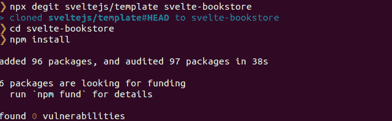
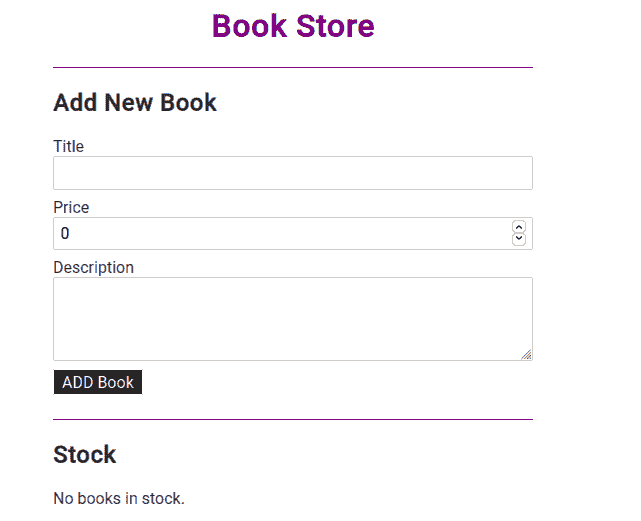
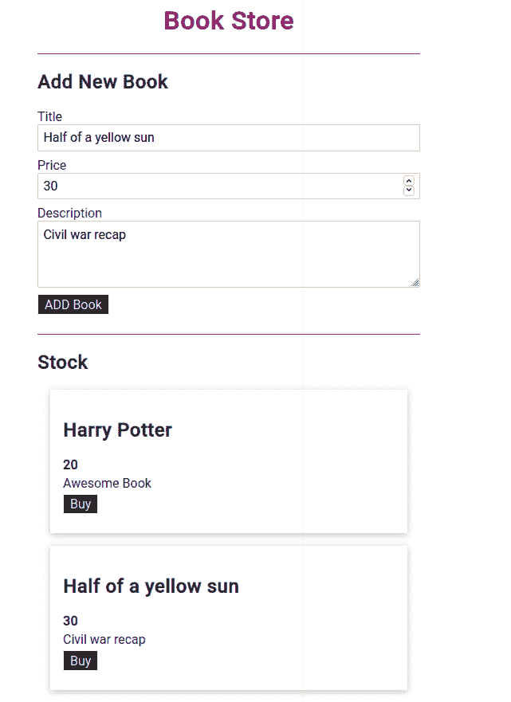
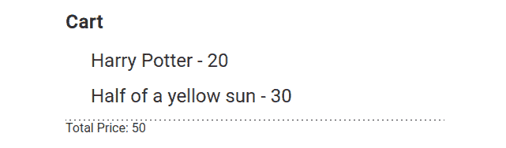

# 如何建立一个简单的应用程序

> 原文：<https://blog.logrocket.com/how-to-build-simple-svelte-js-app/>

***编者按:*** *本文最后更新于 2022 年 6 月 28 日，以反映关于 SvelteKit 和 Svelte Native 的更新信息。*

在 JavaScript 的世界里，几乎每天都有新的框架发布。总的来说，它们背后的思想是相似的，没有什么显著的改进。现代基于 UI 组件的框架和库包括 React、Vue 和 Angular 等等。

在本文中，我们将探索 Svelte，它采用不同的方法来构造用户界面。例如，我们将构建一个书店应用程序来跟踪可用的书名。我们还将探索是什么让 Svelte 有别于其他框架。

要阅读本文，您需要以下内容:

*   您机器上安装的 Node.js ≥v6.x
*   npm 安装在您的计算机上
*   熟悉 HTML、CSS 和 JavaScript

你也可以访问完整的[源代码](https://gitlab.com/robjoeol/svelte-bookstore)。我们开始吧！

## 什么是苗条？

Svelte 是一个前端 web 开发框架，由 Rich Harris 于 2016 年发布。Svelte 是一种全新的构建用户界面的方法，可以用来开发一小部分界面或整个应用程序。我们既可以开始用 Svelte 构建我们的应用程序，也可以逐渐将它集成到现有的应用程序中。

## 用 Svelte 构建书店应用程序

### 入门指南

有几种方法可以让你苗条起来并开始一个项目。在本教程中，我们将使用软件搭建工具 [degit](https://github.com/Rich-Harris/degit) 。要开始，请运行以下命令:

```
npx degit sveltejs/template {project name }

```

在这种情况下，我们将项目命名为`svelte-bookstore`:

```
npx degit sveltejs/template svelte-bookstore

```

导航到项目目录:

```
cd svelte-bookstore

```

安装所需的依赖项:

```
npm install

```

最后，启动应用程序:

```
npm run dev

```



上面的代码创建了一个样板文件“Hello，World！”申请。`main.js`文件是 app 的入口点。它初始化`App`组件，并传递给它一个名为`name`的道具:

```
import App from './App.svelte';
const app = new App({
    target: document.body,
    props: {
        name: 'world'
    }
});
export default app;

```

`App`组件写入`App.svelte`中。请记住，Svelte 中的组件是以`.svelte`扩展名保存的。prop `name`在`script`部分被声明为一个常规变量，但是它前面有一个`export`语句，将它标记为一个 prop。它在 HTML 中用花括号括起来:

```
<script>
    export let name;
&lt;/script>
<style>
    h1 {
        color: purple;
    }
</style>
<h1>Hello {name}!</h1>

```

## 在 Svelte 中创建动态的`Book`组件

当创建组件时，有一些关于 Svelte 的事情是值得注意的。首先，样式的作用域在组件中，所以一个组件中的`div`样式不会影响另一个组件中的另一个`div`。此外，我们可以定义动态连接的函数。

在本节中，我们将使用 Svelte 创建一个动态事件，并将`book.svelte`组件与`app.svelte`和 passing props 链接起来。第一步是设置`Book`组件并导出变量，这些变量可以从`app.svelte`中的父标签设置:

```
<script>
    export let bookTitle;
    export let bookPrice;
    export let bookDescription;
</script>
<style>
    div{
        margin: 1rem;
        box-shadow: 0 2px 8px rgba(0, 0, 0, 0.26)
    }
    h1{
        font-size: 1.25rem;
        margin: 0.25rem 0;
    }
    h2{
        font-size: 1rem;
        margin: 0.25rem 0;
        color: aqua;
    }
    p{
        margin: 0.25rem 0;
    }
    button{
        font : larger;
        padding: 0.15rem 0.5rem;
        background-color: #1b1a1a;
        border: 1px solid  aliceblue ;
        cursor: pointer;
        color: white;
    }
&lt;/style>

<div>
    <h2> {bookTitle} </h2>
    <p> {bookPrice}</p>
    <p> {bookDescription}</p>
    <button> Add </button>
</div>

```

在上面的代码块中，我们有在标签中使用的变量，这些变量的值来自于`app.svelte`。大多数动态操作都发生在这段代码中。

在`app.svelte`文件中，我们导入了`Book`组件，我们将在其中进行大量的动态操作:

```
<script>
    import Book from './book.svelte'
    let title = '';
    let price = 0;
    let description = '';
    function setTitle(event){
        title = event.target.value;
    }
</script>
<style>
    h1 {
        color: purple;

    }
    section{
        margin: auto;
        width :30rem;

    }
    label,input,textarea{width: 100%}
</style>
<section>
    <div> 
        <label for="title">Title</label>
        <input type="text" id="title" value={title} on:input={setTitle}/>
    </div>
    <div>
        <label for="price">Price</label>
        <input type="number" id="price" value={price} bind:value={price}/>
    </div>
    <div>
        <label for="description">Description</label>
        <textarea rows="3" id="description" bind:value ={description}/>
    </div>
</section>
<Book bookTitle={title} bookPrice={price} bookDescription={description}/>

```

从上面的代码块中，我们看到在我们的`script`标签中，我们也设置了变量来清空`" "`。这些值会自动更新。还要注意`setTitle`函数，它用于设置一个标题，指向在`on:`中调用它的对象。

我们调用不带括号的函数，因为我们不想立即执行它。相反，我们试图建立一个引用，以便 Svelte 可以在每次击键时调用该函数。

我们使用`on:`来添加事件监听器。我们可以用它来监听输入事件，并使用花括号来显示动态输入。我们拥有的函数使用双向绑定，因此，我们可以使用`bind`操作符在其他标签上使用它，它将 value 属性绑定到变量。我们这样做也是为了描述。

最后，我们通过使用花括号`{}`传递变量`title`、`price`和`description`，将变量作为道具传递给`Book`组件。

## 以纤细的方式显示图书信息

现在我们有了一个在输入值时更新的卡，下一步是确保我们能够向书店添加书籍。我们要做的第一件事是使我们的按钮成为一个独立的组件，以便能够在其他两个组件中使用它。我们通过创建`button.svelte`并将其分别导入到`book`和`app`组件中来实现:

```
<style>
  button{
        font : larger;
        padding: 0.15rem 0.5rem;
        background-color: #1b1a1a;
        border: 1px solid  aliceblue ;
        cursor: pointer;
        color: white;
    }

</style>

<button on:click >
    <slot/>
</button>

```

按钮标签中的`on:click`属性用于触发转发事件到使用按钮的组件，并将处理该事件。让我们看一个例子:

```
app.svelte
<Button on:click={addBook}>ADD Book</Button>

```

上面的命令使用了一个`addBook`功能，该功能允许按钮向数组中添加一本新书:

```
let books =[]

function addBook(){
        const newBook = {
            title : title,
            price : price,
            description: description
        };
        books = books.concat(newBook)
    }

```

上面的代码存在于脚本标签中。它从表单中调用书的所有属性，并将它们连接起来。我们使用 concat 变量，因为 push 不会改变 book 变量。它只改变数组，但是将 concat 赋给一个新值会触发一个变化。

我们现在有一系列的书籍，使用 Svelte 给我们的特殊标记有条件地显示:

```
{#if books.length === 0}
    <p>
       No books in stock. 
    </p>
{:else}
    {#each books as book}
        <Book bookTitle={book.title} bookPages={book.price} bookDescription={book.description}/>
    {/each}
{/if}

```

如果数组为空，将显示`No books in stock`。



用户更新后，它会在卡上显示信息:



Add new book

## 以苗条的方式添加购物车

要将购物车添加到我们的书店应用程序中，我们必须制作另一个名为`purchase.svelte`的组件。在脚本标签中，我们想要导出`books`变量，这样它就可以被`book`标签更新，方法是将信息作为道具传递给`app.svelte`:



Adding cart to bookstore

在`app.svelte`中，我们在脚本中添加了一个空数组来存放购买的书籍。为了将书籍添加到这些购买中，我们将使用`Book`组件中的购买按钮，将`purchaseBook`函数添加到脚本中，并使用`on:{purchaseBook}`绑定到该按钮。

然后，我们使用 Svelte 自定义库中的创建调度功能。最后，我们可以通过添加`on:buy ={purchaseBook}`将函数链接到 Book 标签。该事件从我们的`purchaseBook`函数发出。

## 苗条和反应的区别

开发人员可以使用 Svelte 和 React 来有效地构建 web 应用程序。然而，尽管它们服务于相同的总体目的，但它们的工作方式却有明显的不同。

### 编译器与虚拟 DOM

Svelte 和 React 之间的一个本质区别是，Svelte 更像一个编译器，而 React 则像一个 JavaScript 库。Svelte 的大部分工作都是在编译阶段完成的。因此，当您的程序在 DOM 中运行时，没有额外的框架代码被注入到浏览器中。作为一个编译器，Svelte 可以提供其他框架无法提供的特性，比如编译时可访问性检查。

### 句法

当谈到它的语法时，Svelte 坚持接近人们熟悉的 HTML、CSS 和 JavaScript 的约定，这使得它比 React 更容易理解和学习。Svelte 严格遵循经典的 web 开发模型，并且只引入了一些 HTML 扩展，这使得它更容易学习。

为了演示，这里有一个用细长字体编写的`Counter`组件:

```
//language: JavaScript

//Counter.svelte

<script>
  let count = 0;

  function handleClick() {
    count += 1;
  }
</script>

<button on:click={handleClick}>{count}</button>

```

与 Svelte 不同，React 有自己的语法，称为 [JSX](https://reactjs.org/docs/introducing-jsx.html) ，允许我们在 JavaScript 代码中编写 HTML。这种模式违背了传统惯例，学习起来可能会很混乱。下面是 React 中相同的`Counter`组件:

```
//language: JavaScript

import { useState } from "react";

const Counter = () => {
  const [count, setCount] = useState();

  const handleClick = () => {
    setCount((count) => count + 1);
  };

  return <button onClick={handleClick}>{count}</button>;
};

export default Counter;

```

### 式样

关于 Svelte 的另一个很棒的特性是，它通过将样式作用于组件来提供灵活的样式。因此，我们不必费心编写独特的类，因为 Svelte 会在编译阶段生成它们。在`<p>`元素出现在多个组件中的场景中，我们不需要附加不同的类来避免 CSS 冲突。

### 学习曲线

学习 Svelte 相对于其他框架的一个优势是 Svelte 的学习曲线比较浅。具有基本 HTML、CSS 和 JavaScript 知识的 Web 开发人员应该很快掌握 Svelte 的细节，并能够开始构建 web 应用程序。

### 苗条越来越受欢迎

苗条越来越受欢迎，这些数字不会说谎。

2021 年，68%的开发者对学习苗条感兴趣。随着 [Rich Harris 搬到 Vercel](https://twitter.com/Rich_Harris/status/1458822051263823875?s=20&t=mJm5FXZtCRKnyqdKqEGRlg) 和 Svelte 现在有了 Vercel 生态系统的资金和社区支持，这个数字肯定会增加。一项额外的研究显示，从 2019 年到 2021 年，苗条身材的使用[从 8%增加到 20%](https://2021.stateofjs.com/en-US/libraries/front-end-frameworks),增长了 150%。Svelte 是那些想在未来学习的[框架的开发者的首选。](https://tsh.io/state-of-frontend/#which-of-the-following-frameworks-would-you-like-to-learn-in-the-future)

## 苗条生态系统中的框架

### 苗条套装

Svelte 生态系统正在快速发展，在 Svelte 之上已经建立了其他几个框架。首先，2021 年 3 月发布的 [SvelteKit](https://kit.svelte.dev/) 是一个更新的框架，取代了 [Sapper](https://sapper.svelte.dev/) 。这是[构建苗条应用程序的最快方式](https://blog.logrocket.com/exploring-sveltekit-the-newest-svelte-based-framework/)，它还带有高级功能，如服务器端渲染、代码分割、基于文件的路由和离线支持。SvelteKit 相当于 Svelte 的 Next.js。

### 苗条的本地人

再比如[svelite Native](https://svelte-native.technology/)，可以让 svelite 开发者轻松构建原生 Android 和 iOS 应用。2019 年 2 月发布的《苗条的原生》，[结合了原生剧本和苗条](https://blog.logrocket.com/svelte-native-vs-react-native/)的精华。

## 结论

在这篇文章中，我们通过创建一个书店应用程序学习了苗条的基本知识。我们回顾了苗条生态系统的最新发展，并了解了为什么公司和开发团队越来越多地在他们的生产工作流程中采用苗条。

为了更深入的了解，一定要查看一下 [Svelte 的交互文档](https://svelte.dev/tutorial/basics)。编码快乐！

## 使用 [LogRocket](https://lp.logrocket.com/blg/signup) 消除传统错误报告的干扰

[](https://lp.logrocket.com/blg/signup)

[LogRocket](https://lp.logrocket.com/blg/signup) 是一个数字体验分析解决方案，它可以保护您免受数百个假阳性错误警报的影响，只针对几个真正重要的项目。LogRocket 会告诉您应用程序中实际影响用户的最具影响力的 bug 和 UX 问题。

然后，使用具有深层技术遥测的会话重放来确切地查看用户看到了什么以及是什么导致了问题，就像你在他们身后看一样。

LogRocket 自动聚合客户端错误、JS 异常、前端性能指标和用户交互。然后 LogRocket 使用机器学习来告诉你哪些问题正在影响大多数用户，并提供你需要修复它的上下文。

关注重要的 bug—[今天就试试 LogRocket】。](https://lp.logrocket.com/blg/signup-issue-free)

## [LogRocket](https://lp.logrocket.com/blg/react-signup-general) :全面了解您的生产 React 应用

调试 React 应用程序可能很困难，尤其是当用户遇到难以重现的问题时。如果您对监视和跟踪 Redux 状态、自动显示 JavaScript 错误以及跟踪缓慢的网络请求和组件加载时间感兴趣，

[try LogRocket](https://lp.logrocket.com/blg/react-signup-general)

.

[ ](https://lp.logrocket.com/blg/react-signup-general) [](https://lp.logrocket.com/blg/react-signup-general) 

LogRocket 结合了会话回放、产品分析和错误跟踪，使软件团队能够创建理想的 web 和移动产品体验。这对你来说意味着什么？

LogRocket 不是猜测错误发生的原因，也不是要求用户提供截图和日志转储，而是让您回放问题，就像它们发生在您自己的浏览器中一样，以快速了解哪里出错了。

不再有嘈杂的警报。智能错误跟踪允许您对问题进行分类，然后从中学习。获得有影响的用户问题的通知，而不是误报。警报越少，有用的信号越多。

LogRocket Redux 中间件包为您的用户会话增加了一层额外的可见性。LogRocket 记录 Redux 存储中的所有操作和状态。

现代化您调试 React 应用的方式— [开始免费监控](https://lp.logrocket.com/blg/react-signup-general)。