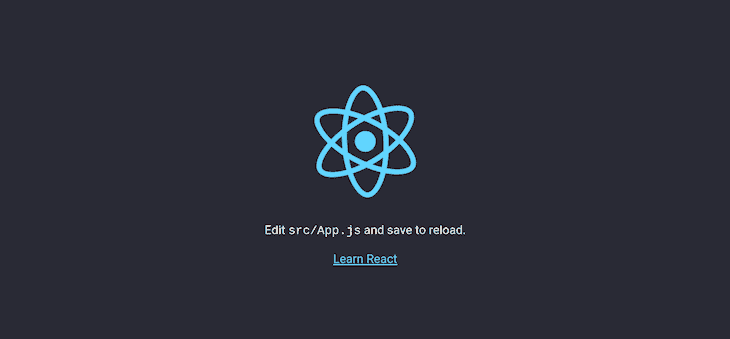
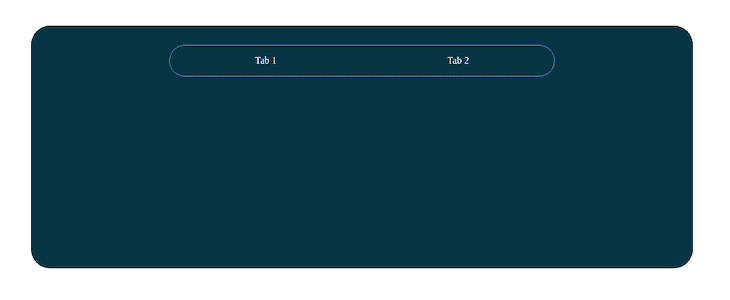
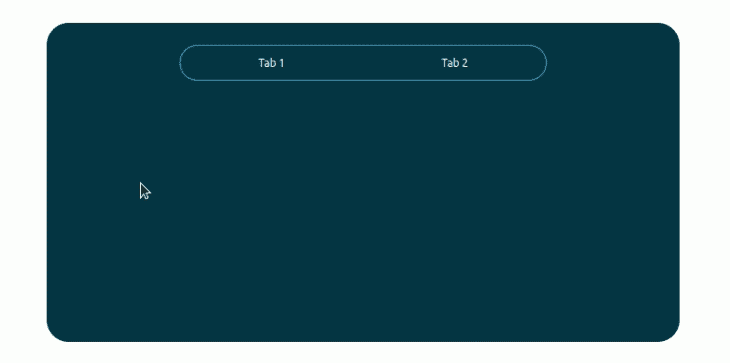
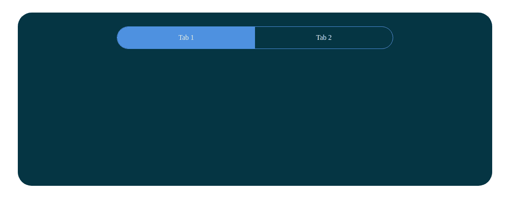
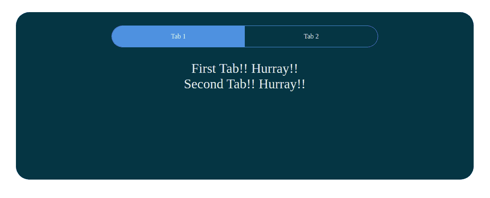
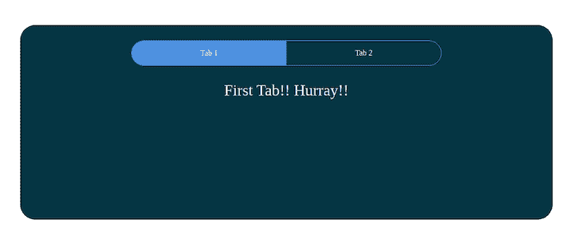
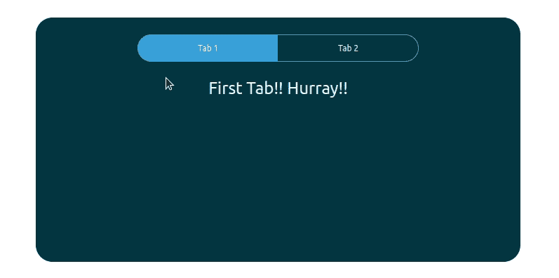
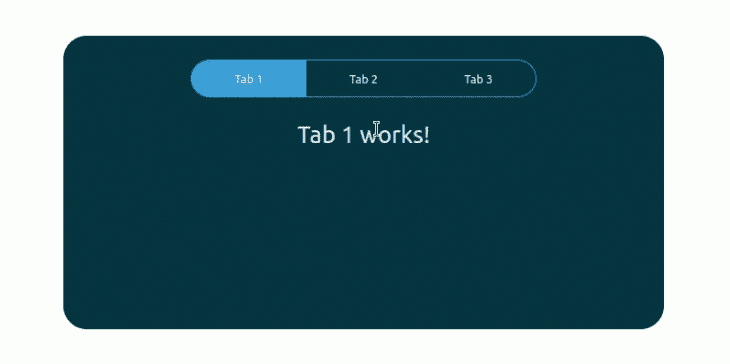
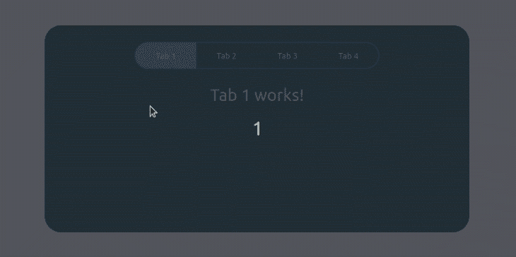
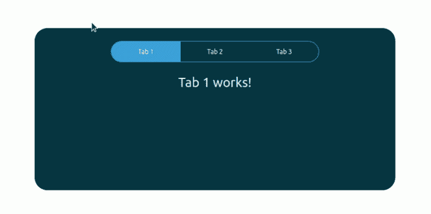

# 如何在 React 中构建标签组件

> 原文：<https://blog.logrocket.com/how-to-build-tab-component-react/>

选项卡是向用户呈现和显示子部分的用户界面组件；它们将内容分类以便于访问，并通过节省空间使您的应用程序看起来更整洁。选项卡是一种流行的 UI 组件，作为开发人员，理解如何实现它们是非常重要的。

本文将向您展示如何在 React 中构建一个选项卡组件，并创建处理选项卡切换的函数。

我们将涵盖:

## 先决条件

为了跟随本教程，您需要在您的机器上安装 Node.js。您还应该具备以下方面的工作知识:

*   半铸钢ˌ钢性铸铁(Cast Semi-Steel)
*   Java Script 语言
*   反应
*   反应钩

## 启动 React 项目

让我们为本教程建立一个新的示例项目。首先，我们需要使用 [Create React App](https://blog.logrocket.com/create-react-app-a-quick-setup-guide-b812f0aad03c/) 创建一个新项目。在终端中运行以下命令:

```
npx create-react-app tab-component-sample

```

上述命令将下载运行 React 应用程序所需的所有包，并使用默认的 Create React 应用程序模板搭建一个新的 React 应用程序。

接下来，使用下面的命令将您的目录更改为新创建的应用程序的目录:

```
cd tab-component-sample

```

使用以下代码启动本地开发服务器，查看 CRA 示例 web 应用程序:

```
npm start

```

现在，打开一个新的选项卡，并呈现 CRA 中包含的示例模板。如果没有自动打开，打开你的浏览器，输入 [http://localhost:3000/](http://localhost:3000/) 。



## 在 React 中创建选项卡组件

在 React 应用程序中创建选项卡组件之前，我们需要删除 CRA 样板文件。在 source 文件夹中，找到`App.css`和`Index.css`文件并清除那里写的样式(我们将创建自己的)。

打开`App.js`文件，删除用 app 类名包装在 div 中的所有内容，并删除导入 SVG 徽标的行:

```
import logo from './logo.svg';

```

清理后的`App.js`文件应该是这样的:

```
import './App.css';
function App() {
  return (
    <div className="App">             
    </div>
  );
}
export default App;

```

在您的`src`文件夹中，创建一个名为`Components`的新文件夹，它将存放我们将要创建的组件。然后创建另一个名为`TabComponent`的子文件夹，它将存放`Tabs.js`文件:

```
src
    +-- Components
      +-- TabComponent
        +-- Tabs.js

```

现在，将以下代码添加到`Tab.js`文件中，以显示我们正在导出它:

```
import React from "react";
const Tabs = () => {
  return (
    <div className="Tabs">
      <p>Hello Tab works</p>
    </div>
  );
};
export default Tabs;

```

接下来，我们需要将`Tabs.js`文件导入到`App.js`文件中:

```
import "./App.css";
import Tabs from "./Components/TabComponent/Tabs";
function App() {
  return (
    <div className="App">
      <Tabs />
    </div>
  );
}
export default App;

```

如果您这边没有显示，请确认您正在正确导入和导出组件。

将以下代码添加到您的`Tabs.js`文件中:

```
`import React from "react";
const Tabs = () => {
  return (
    <div className="Tabs">
      {/* Tab nav */}
      <ul className="nav">
        <li>Tab 1</li>
        <li>Tab 2</li>
      </ul>
      <div className="outlet">
        {/* content will be shown here */}
      </div>
    </div>
  );
};
export default Tabs;

```

在上面的代码中，我们将两个部分包装在父选项卡的`div`中:`nav`和`outlet`。`nav`处理选项卡之间的导航，而`outlet`将呈现活动选项卡的内容。

在你的浏览器里查看的时候会很难看，没有任何意义，但是我们后面会添加一些 CSS。

下一步是为每个选项卡创建组件。在本指南中，我们将首先创建两个选项卡，然后扩展代码以支持许多选项卡。首先，让我们编写代码来构建两个选项卡组件。

在`Components`文件夹中，新建一个文件夹，命名为`AllTabs`。然后，创建两个文件，分别命名为`FirstTab.js`和`SecondTab.js`:

```
src
    +-- Components
      +-- AllTabs
        +-- FirstTab.js
        +-- SecondTab.js

```

`firstTab.js`文件包含需要在第一个选项卡上显示的内容的代码，而`secondTab.js`包含应该在第二个选项卡上显示的内容:

```
// FirstTab.js

import React from "react";
const FirstTab = () => {
  return (
    <div className="FirstTab">
      <p>First Tab!! Hurray!!</p>
      {/* First tab content will go here */}
    </div>
  );
};
export default FirstTab;

// SecondTab.js

import React from "react";
const SecondTab = () => {
  return (
    <div className="SecondTab">
      <p>Second Tab!! Hurray!!</p>
      {/* Second  tab content will go here */}
    </div>
  );
};
export default SecondTab;

```

这就是我们目前所需要的。让我们继续造型。

## 设置 React 选项卡组件的样式

我们需要添加一些到目前为止我们已经创造了的[造型。出于本指南的考虑，我们将在`App.css`文件中编写所有的样式。您可以为每个组件创建单独的样式文件，但是不要忘记导入它们。](https://blog.logrocket.com/the-best-styling-in-react-tutorial-youve-ever-seen-676f1284b945/)

首先，让我们删除浏览器添加到元素中的默认样式，因为我们想自己控制边距和填充。使用 CSS 中的星号选择器，我们可以选择 web 应用程序中的每个元素，并按照我们喜欢的方式设计它们的样式。

我们将所有边距和填充重置为零，并为每个元素提供一个`border-box`的`box-sizing`，包括元素宽度的所有填充和边框:

```
/* Remove browser defaults */
* {
 box-sizing: border-box;
 padding: 0;
 margin: 0;
}
...

```

现在让我们来设计我们的`App.js`包装器。这是一个演示应用程序，所以它将是一个占据整个屏幕宽度和高度的单一页面。我们还需要应用程序中的所有元素都位于中间:

```
// Style App.js wrapper
.App {
 width: 100vw;
 height: 100vh;
 display: flex;
 align-items: center;
 justify-content: center;
 overflow: hidden;
}
...

```

接下来，让我们设计我们的`Tabs`组件。造型会很简单；只需添加一些空白和填充空间和背景颜色，使其看起来更好:

```
/* Tab Container */
.Tabs {
 width: 80%;
 height: auto;
 min-height: 400px;
 background: #053742;
 margin: 3.5rem auto 1.5rem;
 padding: 2rem 1rem;
 color: #E8F0F2;
 border-radius: 2rem;
 @media (max-width: 769px) {
  padding: 2rem 0;
 }
}
...

```

接下来，我们需要区分导航按钮和选项卡主体，以便用户可以快速看到导航器并在选项卡之间切换:

```
/* Tab Navigation */
ul.nav {
  width: 60%;
  margin: 0 auto 2rem;
  display: flex;
  align-items: center;
  justify-content: space-between;
  border: 1px solid #39A2DB;
  border-radius: 2rem;
  padding-left: 0px;
  @media (max-width: 768px) {
    width: 90%;
  }
}
ul.nav li {
  width: 50%;
  padding: 1rem;
  list-style: none;
  text-align: center;
  cursor: pointer;
  transition: all 0.7s;
  border-bottom-left-radius: 2rem;
  border-top-left-radius: 2rem;
}
ul.nav li:nth-child(2) {
  border-radius: 0;
  border-bottom-right-radius: 2rem;
  border-top-right-radius: 2rem;
}
ul.nav li:hover {
  background: rgba(50, 224, 196, 0.15);
}
ul.nav li.active {
  background: #39A2DB;
}
...

```

最后，让我们来设计一下演示选项卡的内容。在本文中，我们将使用一个`p`标签元素来显示虚拟数据:

```
/* First and Second Tab Styles */
.FirstTab p,
.SecondTab p {
  font-size: 2rem;
  text-align: center;
}

```

这是您最终的`App.css`文件的样子:

```
// App.css

/* Remove browser defaults */
* {
  box-sizing: border-box;
  padding: 0;
  margin: 0;
}
// Style App.js wrapper
.App {
  width: 100vw;
  height: 100vh;
  display: flex;
  align-items: center;
  justify-content: center;
  overflow: hidden;
}

/* Tab Container */
.Tabs {
  width: 80%;
  height: auto;
  min-height: 400px;
  background: #053742;
  margin: 3.5rem auto 1.5rem;
  padding: 2rem 1rem;
  color: #E8F0F2;
  border-radius: 2rem;
  @media (max-width: 769px) {
    padding: 2rem 0;
  }

}

/* Tab Navigation */
ul.nav {
  width: 60%;
  margin: 0 auto 2rem;
  display: flex;
  align-items: center;
  justify-content: space-between;
  border: 1px solid #39A2DB;
  border-radius: 2rem;
  @media (max-width: 768px) {
    width: 90%;
  }
}
ul.nav li {
  width: 50%;
  padding: 1rem;
  list-style: none;
  text-align: center;
  cursor: pointer;
  transition: all 0.7s;
  border-bottom-left-radius: 2rem;
  border-top-left-radius: 2rem;
}
ul.nav li:nth-child(2) {
  border-radius: 0;
  border-bottom-right-radius: 2rem;
  border-top-right-radius: 2rem;
}
ul.nav li:hover {
  background: rgba(50, 224, 196, 0.15);
}
ul.nav li.active {
  background: #39A2DB;
}

/* First and Second Tab Styles */
.FirstTab p,
.SecondTab p {
  font-size: 2rem;
  text-align: center;
}

```

在浏览器上重新加载页面，您应该会看到类似下图的内容:



在浏览器上重新加载页面，您应该会看到类似于以下预览的内容:



选项卡还不会切换内容，但由于我们添加了 CSS 代码，它们将呈现悬停动画。让我们添加代码来实现选项卡切换逻辑。

## 使用`useState`进行 React 选项卡状态管理

当你浏览上面的样式时，你会注意到我们有一个特定的活动标签样式，但是我们怎么知道哪个标签是活动的呢？为此，我们将使用 React 钩子`useState`来管理我们的状态。你可以在这里阅读更多关于 [React 钩子和状态管理的内容。](https://blog.logrocket.com/react-hooks-state-management/)

首先，我们需要从 React 库中导入`useState`钩子，并从`Tabs.js`文件中设置默认的活动选项卡:

```
import React, { useState } from "react";
const Tabs = () => {
  const [activeTab, setActiveTab] = useState("tab1");
   // ... the previous codes
}
export default Tabs;

```

接下来，我们将检查选项卡是否是活动的，并向其添加`active`类。否则，我们将删除`active`类:

```
// Tab nav       
      <ul className="nav">
        <li className={activeTab === "tab1" ? "active" : ""}>Tab 1</li>
        <li className={activeTab === "tab2" ? "active" : ""}>Tab 2</li>
      </ul>

```

当您从浏览器中查看它时，它应该是这样的:



选项卡 1 有背景色，因为它是活动选项卡。现在，让我们告诉 React DOM 当选项卡处于活动状态时要显示什么内容。

首先，我们需要将第一个和第二个选项卡文件导入到选项卡组件中。

```
import FirstTab from "../AllTabs/FirstTab";
import SecondTab from "../AllTabs/SecondTab";

```

现在，将导入的组件添加到`outlet` div:

```
<div className="outlet">
  <FirstTab />
  <SecondTab />
</div>

```

当您打开浏览器时，您会看到一点混乱(两个选项卡的内容都显示在选项卡 1 上),但不要担心，我们很快就会创建秩序。



正如我们检查 nav 以设置一个活动的类到活动的 nav 链接，我们将实现同样的方法到`outlet`:

```
<div className="outlet">
  {activeTab === "tab1" ? <FirstTab /> : <SecondTab />}
</div>

```

我们在这里做的是告诉 React DOM 仅在活动选项卡为`"tab1"`时显示第一个选项卡。否则，它会显示第二个选项卡。



## 创建一个函数来处理 React 中的制表符切换

当你点击任何一个标签，什么都不会发生。让我们改变这一点。

这个函数将告诉 React DOM 当一个选项卡处于活动状态时我们想要呈现哪个选项卡的内容:

```
  //  Functions to handle Tab Switching
  const handleTab1 = () => {
    // update the state to tab1
    setActiveTab("tab1");
  };
  const handleTab2 = () => {
    // update the state to tab2
    setActiveTab("tab2");
  };

```

这是相当干净和简单的；您甚至可以将它写在一行中，但是为了简单起见，我们就这样吧。

那么代码在做什么呢？第一个函数在被调用时将活动标签状态设置和更新为`"tab1"`，第二个函数对`"tab2"`做同样的事情。

下一步是将这些函数标记到我们的导航链接上，以便在单击相应的导航链接时被调用和执行:

```
{/* Tab nav */}
<ul className="nav">
  <li
    className={activeTab === "tab1" ? "active" : ""}
    onClick={handleTab1}
  >
    Tab 1
  </li>
  <li
    className={activeTab === "tab2" ? "active" : ""}
    onClick={handleTab2}
  >
    Tab 2
  </li>
</ul>

```

请看下面经过上述修改的 Tabs.js 组件的完整源代码:

```
import React, { useState } from "react";
import FirstTab from "../AllTabs/FirstTab";
import SecondTab from "../AllTabs/SecondTab";

const Tabs = () => {
  const [activeTab, setActiveTab] = useState("tab1");
  //  Functions to handle Tab Switching
  const handleTab1 = () => {
    // update the state to tab1
    setActiveTab("tab1");
  };
  const handleTab2 = () => {
    // update the state to tab2
    setActiveTab("tab2");
  };
  return (
    <div className="Tabs">
      <ul className="nav">
        <li
          className={activeTab === "tab1" ? "active" : ""}
          onClick={handleTab1}
        >
          Tab 1
        </li>
        <li
          className={activeTab === "tab2" ? "active" : ""}
          onClick={handleTab2}
        >
          Tab 2
        </li>
      </ul>

      <div className="outlet">
        {activeTab === "tab1" ? <FirstTab /> : <SecondTab />}
      </div>
    </div>
  );
};
export default Tabs;
```

就是这样！现在，您可以通过单击标签各自的导航链接来切换标签，如下所示:



## 扩展代码以支持更多选项卡

如果我们需要扩展显示第三个标签页的代码怎么办？添加另一个选项卡有两种主要方法。我们可以用新的选项卡内容创建另一个组件，就像我们用相同的代码结构创建`SecondTab`组件一样。

我们可以重构我们的项目来支持许多选项卡组件。如果我们为每个选项卡创建一个新的组件，并遵循现有的代码结构，那么源代码会因为重复的代码而变得不太容易管理。因此，我们可以重构现有的项目来支持许多选项卡。

我们需要使用下面的 CSS 代码片段来使现有的 CSS 代码灵活地显示两个以上的选项卡。

```
ul.nav li:first-child {
  border-bottom-left-radius: 2rem;
  border-top-left-radius: 2rem;
}

ul.nav li:last-child {
  border-bottom-right-radius: 2rem;
  border-top-right-radius: 2rem;
}

```

上面的 CSS 代码片段只设计了第一个和最后一个制表符的半径，而不管我们使用了多少个制表符。用下面的 CSS 代码替换您的`App.css`文件内容。

```
/* Remove browser defaults */
* {
  box-sizing: border-box;
  padding: 0;
  margin: 0;
}

/* Style App.js wrapper */
.App {
  width: 100vw;
  height: 100vh;
  display: flex;
  align-items: center;
  justify-content: center;
  overflow: hidden;
}

/* Tab Container */
.Tabs {
  width: 80%;
  height: auto;
  min-height: 400px;
  background: #053742;
  margin: 3.5rem auto 1.5rem;
  padding: 2rem 1rem;
  color: #E8F0F2;
  border-radius: 2rem;
  @media (max-width: 769px) {
    padding: 2rem 0;
  }

}

/* Tab Navigation */
ul.nav {
  width: 60%;
  margin: 0 auto 2rem;
  display: flex;
  align-items: center;
  justify-content: space-between;
  border: 1px solid #39A2DB;
  border-radius: 2rem;
  padding-left: 0px;
  @media (max-width: 768px) {
    width: 90%;
  }
}

ul.nav li {
  width: 50%;
  padding: 1rem;
  list-style: none;
  text-align: center;
  cursor: pointer;
  transition: all 0.7s;
}

ul.nav li:first-child {
  border-bottom-left-radius: 2rem;
  border-top-left-radius: 2rem;
}

ul.nav li:last-child {
  border-bottom-right-radius: 2rem;
  border-top-right-radius: 2rem;
}

ul.nav li:hover {
  background: rgba(50, 224, 196, 0.15);
}

ul.nav li.active {
  background: #39A2DB;
}

/* Tab Content Styles */
.TabContent {
  font-size: 2rem;
  text-align: center;
}

```

现在，我们将通过创建两个新组件来重构 JavaScript 代码结构:

*   *   `TabNavItem`:表示选项卡导航项的组件
    *   `TabContent`:显示每个标签的内容，我们可以传递任何内容作为子组件

在现有的`Components`目录中创建一个名为`V2`的目录来存储新组件。将以下代码添加到`Components/TabNavItem.js`中，以定义`TabNavItem`组件。

```
import React from "react";
const TabNavItem = ({ id, title, activeTab, setActiveTab }) => {

 const handleClick = () => {
   setActiveTab(id);
 };

return (
   <li onClick={handleClick} className={activeTab === id ? "active" : ""}>
     { title }
   </li>
 );
};
export default TabNavItem;

```

上面的组件使用 HTML `li`元素呈现了一个选项卡导航项目。这里，我们根据`activeTab`属性和当前选项卡标识符动态设置活动 CSS 类。同样，我们使用`setActiveTab`回调来切换当前选择的选项卡。

接下来，将下面的代码添加到`Components/TabContent.js`文件中，以定义`TabContent`组件。

```
import React from "react";

const TabContent = ({id, activeTab, children}) => {
 return (
   activeTab === id ? <div className="TabContent">
     { children }
   </div>
   : null
 );
};

export default TabContent;

```

注意，我们根据`id`和`activeTab`属性有条件地渲染组件。此外，我们通过使用`{ children }`模板语法来呈现组件中提供的所有子组件。

现在，动态选项卡组件的原子构建块已经准备好了。让我们通过使用新创建的(V2)组件来重构现有的`Tab`组件源。将以下代码添加到`Components/Tabs.js`文件中:

```
import React, { useState } from "react";
import TabNavItem from "../V2/TabNavItem";
import TabContent from "../V2/TabContent";

const Tabs = () => {
  const [activeTab, setActiveTab] = useState("tab1");

  return (
    <div className="Tabs">
      <ul className="nav">
        <TabNavItem title="Tab 1" id="tab1" activeTab={activeTab} setActiveTab={setActiveTab}/>
        <TabNavItem title="Tab 2" id="tab2" activeTab={activeTab} setActiveTab={setActiveTab}/>
        <TabNavItem title="Tab 3" id="tab3" activeTab={activeTab} setActiveTab={setActiveTab}/>
      </ul>

      <div className="outlet">
        <TabContent id="tab1" activeTab={activeTab}>
          <p>Tab 1 works!</p>
        </TabContent>
        <TabContent id="tab2" activeTab={activeTab}>
          <p>Tab 2 works!</p>
        </TabContent>
        <TabContent id="tab3" activeTab={activeTab}>
          <p>Tab 3 works!</p>
        </TabContent>
      </div>
    </div>
  );
};

export default Tabs;

```

检查你的浏览器。您将看到三个工作选项卡，如下图所示。



你还记得之前我提到过我们要实现一个可管理的源代码，而不是写重复的代码吗？下面是添加第四个选项卡有多简单。将下面一行添加到导航容器中，紧接在第三个选项卡的导航项之后。

```
<TabNavItem title="Tab 4" id="tab4" activeTab={activeTab} setActiveTab={setActiveTab}/>
```

接下来，在第三个选项卡的内容之后添加选项卡内容，如下所示。

```
<TabContent id="tab4" activeTab={activeTab}>
 <p>tab4 works!</p>
</TabContent>

```

查看浏览器中的第四个选项卡。



此外，您也可以重用以前的`FirstTab`和`SecondTab`组件。例如，看看下面的代码:

```
import React, { useState } from "react";
import FirstTab from "../AllTabs/FirstTab.js";
import SecondTab from "../AllTabs/SecondTab.js";
import TabNavItem from "../V2/TabNavItem";
import TabContent from "../V2/TabContent";

const Tabs = () => {
  const [activeTab, setActiveTab] = useState("tab1");

  return (
    <div className="Tabs">
      <ul className="nav">
        <TabNavItem title="Tab 1" id="tab1" activeTab={activeTab} setActiveTab={setActiveTab}/>
        <TabNavItem title="Tab 2" id="tab2" activeTab={activeTab} setActiveTab={setActiveTab}/>
      </ul>

      <div className="outlet">
        <TabContent id="tab1" activeTab={activeTab}>
          <FirstTab/>
        </TabContent>
        <TabContent id="tab2" activeTab={activeTab}>
          <SecondTab/>
        </TabContent>
      </div>
    </div>
  );
};

export default Tabs;

```

上面的代码将显示来自`FirstTab`和`SecondTab`组件的内容。


## 使用 react-tabs 库创建选项卡

在这个阶段，您已经知道如何在没有第三方库的情况下从头开始创建 React 选项卡组件。但是，我们必须编写代码，通过管理选项卡组件状态来显示和设置当前选择的选项卡。

从头开始实现选项卡组件给了我们充分的灵活性和自由，但对于构建现代快速应用程序开发文化来说，这可能是一项耗时的任务。

因此，您可以使用全功能库在 React 应用程序中创建选项卡组件。 [react-tabs](https://github.com/reactjs/react-tabs) 库是创建选项卡组件的常用库。

现在，我们将使用 react-tabs 库重新创建以前的应用程序。首先，用`npm install react-tabs`安装 react-tabs 库。接下来，将以下内容添加到`App.js`。

```
import { Tab, Tabs, TabList, TabPanel } from "react-tabs";
import "./App.css";

function App() {
 return (
   <div className="App">
     <Tabs className="Tabs">
       <TabList>
         <Tab>Tab 1</Tab>
         <Tab>Tab 2</Tab>
         <Tab>Tab 3</Tab>
       </TabList>
<TabPanel>
         <p>Tab 1 works!</p>
       </TabPanel>
       <TabPanel>
         <p>Tab 2 works!</p>
       </TabPanel>
       <TabPanel>
         <p>Tab 3 works!</p>
       </TabPanel>
     </Tabs>
   </div>
 );
}

export default App;

```

注意，这里我们从 react-tabs 库中导入了一些预构建的组件，以使我们的选项卡组件工作。该库将自动生成标签标识符，所以我们不需要使用像`prop`这样的`id`。

如果您现在检查浏览器，您会注意到选项卡缺少 CSS 样式。这是因为当前的`App.css` CSS 类没有与库的内部 CSS 类正确映射。因此，通过添加以下内容来更新`App.css`文件:

```
/* Remove browser defaults */
* {
  box-sizing: border-box;
  padding: 0;
  margin: 0;
}

/* Style App.js wrapper */
.App {
  width: 100vw;
  height: 100vh;
  display: flex;
  align-items: center;
  justify-content: center;
  overflow: hidden;
}

/* Tab Container */
.Tabs {
  width: 80%;
  height: auto;
  min-height: 400px;
  background: #053742;
  margin: 3.5rem auto 1.5rem;
  padding: 2rem 1rem;
  color: #E8F0F2;
  border-radius: 2rem;
}

.react-tabs {
  -webkit-tap-highlight-color: transparent;
}

.react-tabs__tab-list {
  width: 60%;
  margin: 0 auto 2rem;
  display: flex;
  align-items: center;
  justify-content: space-between;
  border: 1px solid #39A2DB;
  border-radius: 2rem;
  padding-left: 0px;
}

.react-tabs__tab {
  width: 50%;
  padding: 1rem;
  list-style: none;
  text-align: center;
  cursor: pointer;
  transition: all 0.7s;
}

.react-tabs__tab--selected {
  background: #39A2DB;
}

.react-tabs__tab--disabled {
  color: GrayText;
  cursor: default;
}

.react-tabs__tab:hover {
  background: rgba(50, 224, 196, 0.15);
}

.react-tabs__tab:first-child {
  border-bottom-left-radius: 2rem;
  border-top-left-radius: 2rem;
}

.react-tabs__tab:last-child {
  border-bottom-right-radius: 2rem;
  border-top-right-radius: 2rem;
}

.react-tabs__tab-panel {
  display: none;
}

.react-tabs__tab-panel--selected {
  display: block;
  font-size: 2rem;
  text-align: center;
}

```



## 结论

干得好，走了这么远！在本指南中，我们构建了一个 React 选项卡组件，使用 React 挂钩来管理我们的活动选项卡状态，并创建了简单的函数来控制和处理选项卡切换。此外，我们重构了选项卡组件代码库以支持许多选项卡，并使用 react-tabs 库来加速 react 选项卡组件的开发。

## 使用 LogRocket 消除传统反应错误报告的噪音

[LogRocket](https://lp.logrocket.com/blg/react-signup-issue-free)

是一款 React analytics 解决方案，可保护您免受数百个误报错误警报的影响，只针对少数真正重要的项目。LogRocket 告诉您 React 应用程序中实际影响用户的最具影响力的 bug 和 UX 问题。

[ ](https://lp.logrocket.com/blg/react-signup-general) [  ](https://lp.logrocket.com/blg/react-signup-general) [LogRocket](https://lp.logrocket.com/blg/react-signup-issue-free)

自动聚合客户端错误、反应错误边界、还原状态、缓慢的组件加载时间、JS 异常、前端性能指标和用户交互。然后，LogRocket 使用机器学习来通知您影响大多数用户的最具影响力的问题，并提供您修复它所需的上下文。

关注重要的 React bug—[今天就试试 LogRocket】。](https://lp.logrocket.com/blg/react-signup-issue-free)