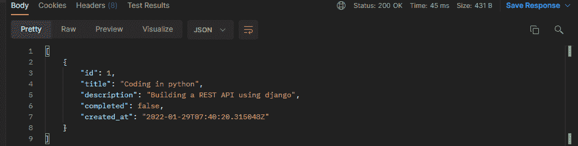

# 如何用 Django REST 框架构建 vue . js app-log rocket 博客

> 原文：<https://blog.logrocket.com/how-to-build-vue-js-app-django-rest-framework/>

大多数应用程序都是由 web APIs 驱动的，这些 API 包含其他应用程序可以访问和操作的数据，以满足它们的需求。只有当您的应用程序具有允许用户与原始 API 数据交互的接口时，这个 API 对用户才有意义。

创建这样的现代 web 应用程序需要现代的 web 解决方案。在本文中，我们将讨论如何在 Django 中创建一个 API，并设置一个 Vue.js 接口来使用它。我们将构建一个方便的全栈“待办事项”应用程序，它使用基于 Django 的 API 和交互式 Vue 接口。这将有望教会你许多全栈 web 编程的关键概念。

## 目录

## 先决条件

要学习本教程，必须具备以下条件:

*   编写和运行 Python 脚本的工作知识
*   JavaScript 的工作知识
*   [Python](https://blog.logrocket.com/frustrations-in-python/) 和 [Node.js](https://blog.logrocket.com/optimize-node-js-performance-with-clustering/) 安装完毕，准备使用
*   [邮差](https://www.postman.com/downloads/)安装在你的电脑上

## 为什么要用 Vue.js 和 Django REST 框架？

Vue 是最流行的 JavaScript 前端框架之一。它帮助创建接口，并可以处理 API 数据。选择使用 Vue 的一些原因包括:

首先是应用程序的反应能力，它允许你自动适应变化并更新用户界面。Vue 允许你把注意力集中在你的页面上你想要反应的组件上。这样，当状态改变时，它可以准确地知道哪些组件需要重新呈现。而不是重新呈现整个页面组件。

其次是可扩展性和灵活性。Vue 适用于所有项目规模，从小边项目到大型企业级 app。它使您能够逐步扩展，然后逐步添加您需要构建的工具和功能。

最后，还有组件的可重用性。这允许您创建组件，这些组件被注入到页面的多个部分中的任何位置。

Django 是一个基于 Python 的框架，用于构建 web 应用程序。 [Django REST 框架](https://blog.logrocket.com/django-rest-framework-build-an-api-in-15-minutes/)在 Django 之上工作。它是一个库，我们可以用最少的代码快速有效地构建基于 web 的 API。

## 建立 Django 项目

在建立这个 Django 项目时，我们将使用一个虚拟环境。虚拟环境有助于为不同的项目分离不同的 Python 环境。假设您有多个依赖于单个包的项目，比如 Django。每个项目可能使用不同版本的 Django，所以如果您升级了那个包，它可能会破坏您项目的代码库。

虚拟环境帮助您隔离每个项目的环境。这样，每个项目将只运行它们需要的依赖项、包和特定版本。

继续创建一个项目文件夹，您希望您的 Django 项目放在其中。打开一个指向创建的目录的终端。然后使用以下命令创建一个虚拟环境:

```
python3 -m venv django_rest_api

```

一旦该过程完成，`cd`到创建的`django_rest_api`目录:

```
cd django_rest_api

```

现在，激活虚拟环境。如果您在 Windows 上，使用命令`django_rest_api/Scripts/activate`，或者如果您在 Linux 或 MacOS 上，使用`source django_rest_api/bin/activate`。

设置好之后，继续将 Django 安装到您的环境中:

```
python -m pip install django

```

现在我们可以初始化并启动 Django REST 项目了:

```
django-admin startproject django_rest_api_tasks

```

这将导致创建一个具有以下文件结构的新目录:

*   `django_rest_api_tasks`，顶层项目文件夹
*   `django_rest_api_tasks/django_rest_api_tasks`，用于管理应用程序的较低级别的项目文件夹
*   `manage.py`，项目的命令中心文件

下一步是启动一个 app。Django 有“项目”和“应用”，两者略有不同。项目是封装应用程序的高级单元。它可以包含多个应用程序，但一个应用程序只属于一个项目。

应用程序是代表特定模块的较低级单元。例如，在我们的项目中，我们将创建一个名为`tasks`的应用程序。为此，将目录更改为`django_rest_api_tasks`文件夹，如下所示:

```
cd django_rest_api_tasks

```

运行一个`startapp`来创建`tasks`应用程序:

```
python manage.py startapp tasks

```

通过运行上面的命令，将在`django_rest_api_tasks`目录中创建一个`tasks`文件夹。继续将`tasks`添加到`django_rest_api_tasks/settings.py`文件的`INSTALLED_APPS`列表中:

```
INSTALLED_APPS = [
    'tasks'
]

```

我们现在可以开始设置 Django REST API 了。

## 创建任务模型

首先，我们将定义任务模型的结构。这定义了`tasks`应用程序将处理什么数据。通过导航到`tasks/models.py`文件创建一个任务模型，并添加以下代码:

```
from django.db import models

# Create your models here.
class Task(models.Model):
    #title
    title = models.CharField(max_length=100)
    description = models.TextField(blank=True, null=True) #description
    completed = models.BooleanField(default=False)
    #completed
    created_at = models.DateTimeField(auto_now_add=True) #created_at

    def __str__(self):
        #return the task title
        return self.title

```

这将建立一个带有`title`、`description`、`completed`和`created_at`值的任务。运行`migrations`命令，将上述任务模型初始化到`sqlite`数据库中:

```
python manage.py makemigrations tasks

```

运行上面的命令后，在`tasks`文件夹中，在`migrations`下，你会有一个`0001_initial.py`文件。

要将这些模型修改添加到`sqlite`数据库中，我们需要使用命令`migrate`:

```
python manage.py migrate

```

这将在父`django_rest_api_tasks`文件夹内生成一个`db.sqlite3`文件。要查看一切是否正常工作，请使用以下命令启动外壳:

```
python manage.py shell

```

在 shell 环境中，导入`Task`模型:

```
from tasks.models import Task

```

实例化`Task`模型:

```
t = Task(title="Coding in Python",description="Building a REST API using django")

```

保存实例化的记录:

```
t.save()

```

获取保存的记录:

```
Task.objects.all()

```

这将为您提供以下输出:

```
<QuerySet [<Task: Coding in Python>]>

```

如果您得到了上述响应，则数据库工作正常，您可以使用以下命令退出 shell:

```
exit()

```

## 添加 Django REST 框架

首先，我们必须安装 Django REST 框架，然后才能构建这个 Django REST API:

```
python -m pip install djangorestframework

```

安装完成后，在`django_rest_api_tasks/settings.py`上，将`rest_framework`添加到已安装应用列表中:

```
INSTALLED_APPS = [
    'tasks',
    'rest_framework'
]

```

在`tasks` app 目录下，创建一个`serializers.py`文件。在这个文件中，我们将为 API 定义如下的`model`和`fields`:

```
from rest_framework import routers,serializers,viewsets
from .models import Task
class TaskSerializer(serializers.HyperlinkedModelSerializer):
    class Meta:
        model = Task
        fields = ['id', 'title', 'description', 'completed', 'created_at']

```

下一步是设置 API 将要处理的各种 CRUD 操作请求。

## 为 Django REST API 设置 CRUD 操作

API 包括创建、读取、更新和删除操作。我们需要对待办事项列表 REST API 设置这些操作。导航到`tasks/views.py`文件并遵循以下步骤:

首先，添加以下导入:

```
# parsing data from the client
from rest_framework.parsers import JSONParser
# To bypass having a CSRF token
from django.views.decorators.csrf import csrf_exempt
# for sending response to the client
from django.http import HttpResponse, JsonResponse
# API definition for task
from .serializers import TaskSerializer
# Task model
from .models import Task

```

接下来，我们将处理获取和创建任务的传入请求:

```
@csrf_exempt
def tasks(request):
    '''
    List all task snippets
    '''
    if(request.method == 'GET'):
        # get all the tasks
        tasks = Task.objects.all()
        # serialize the task data
        serializer = TaskSerializer(tasks, many=True)
        # return a Json response
        return JsonResponse(serializer.data,safe=False)
    elif(request.method == 'POST'):
        # parse the incoming information
        data = JSONParser().parse(request)
        # instanciate with the serializer
        serializer = TaskSerializer(data=data)
        # check if the sent information is okay
        if(serializer.is_valid()):
            # if okay, save it on the database
            serializer.save()
            # provide a Json Response with the data that was saved
            return JsonResponse(serializer.data, status=201)
            # provide a Json Response with the necessary error information
        return JsonResponse(serializer.errors, status=400)

```

现在，我们可以处理更新和删除任务的传入请求:

```
@csrf_exempt
def task_detail(request, pk):
    try:
        # obtain the task with the passed id.
        task = Task.objects.get(pk=pk)
    except:
        # respond with a 404 error message
        return HttpResponse(status=404)  
    if(request.method == 'PUT'):
        # parse the incoming information
        data = JSONParser().parse(request)  
        # instanciate with the serializer
        serializer = TaskSerializer(task, data=data)
        # check whether the sent information is okay
        if(serializer.is_valid()):  
            # if okay, save it on the database
            serializer.save() 
            # provide a JSON response with the data that was submitted
            return JsonResponse(serializer.data, status=201)
        # provide a JSON response with the necessary error information
        return JsonResponse(serializer.errors, status=400)
    elif(request.method == 'DELETE'):
        # delete the task
        task.delete() 
        # return a no content response.
        return HttpResponse(status=204) 

```

接下来，在为`tasks` app 指定的目录中准备一个`urls.py`文件，并在其中包含以下代码块:

```
from django.urls import path 
from totasks import views

# define the urls
urlpatterns = [
    path('tasks/', views.tasks),
    path('tasks/<int:pk>/', views.task_detail),
]

```

从上面，我们定义了两个 URL:

1.  `tasks/`用于提取和添加任务
2.  `/tasks/<int:pk>/`用于删除和更新带有动态 ID 的任务

如下更新`django_rest_api_tasks/urls.py`以公开这些任务 URL:

```
from django.contrib import admin
from django.urls import path,include

urlpatterns = [
    # for tasks
    path('api/', include('tasks.urls')),
    # for admin side
    path('admin/', admin.site.urls),
]

```

我们的 API 现在已经完全设置好了！要测试它，使用如下所示的`runserver`命令运行 Django 开发服务器:

```
python manage.py runserver

```

导航到您的邮递员并输入 URL `[http://localhost:8000/api/ts/](http://localhost:8000/api/ts/)`。然后执行 GET 请求来获取任务。您的回答应该类似于您在这里看到的内容:



## 设置 CORS API 策略

因为我们将使用客户端应用程序与 Django REST API 通信，所以我们需要设置一个跨源资源共享(CORS) API 策略。

这里有 Django REST API 和 Vue 客户端应用程序。这些应用程序运行在不同的网址上，因此，它们有不同的来源。具有相似协议、域和端口的 URL 被认为是同源的。在这种情况下，REST API 运行在端口 8000 上，因此我们不能使用该端口来运行 Vue 客户端应用程序。我们将不得不访问端口 8000，并向 REST API 发出请求以访问不同的任务端点，我们将不得不使用不同的端口来访问浏览器中的 Vue 应用程序。

在这种情况下，应用程序的 URL 将有不同的来源。浏览器安全防止向不同的来源发出请求；同源策略是用来描述这种限制的术语。本质上，它阻止流氓网站访问不同来源的敏感数据。

在 API 上下文中，您可以让其他来源访问您的一些 API 数据。因此，您必须使用 CORS 来共享您的资源。

要为我们的 REST API 设置 CORS，首先使用以下命令停止开发服务器并安装`django-cors-headers`包:

```
python -m pip install django-cors-headers

```

然后，在`django_rest_api_tasks/django_rest_api_tasks/settings.py`文件上，将`corsheaders`添加到已安装应用列表中:

```
INSTALLED_APPS = [
    'django.contrib.admin',
    'django.contrib.auth',
    'django.contrib.contenttypes',
    'django.contrib.sessions',
    'django.contrib.messages',
    'django.contrib.staticfiles',
    'tasks',
    'rest_framework',
    'corsheaders'
]

```

在同一个文件中，更新`MIDDLEWARE`,如下所示:

```
MIDDLEWARE = [

    'django.contrib.sessions.middleware.SessionMiddleware',
    'django.middleware.common.CommonMiddleware',
    'corsheaders.middleware.CorsMiddleware',
    'django.contrib.auth.middleware.AuthenticationMiddleware',
    'django.middleware.csrf.CsrfViewMiddleware',
    'django.contrib.messages.middleware.MessageMiddleware',
    'django.middleware.clickjacking.XFrameOptionsMiddleware',
    'django.middleware.security.SecurityMiddleware',   
]

```

对于本文，我们不会列出任何特定的来源。我们将向任何其他来源提供完整的 API 访问权限。因此，将以下行添加到同一个文件中:

```
CORS_ALLOW_ALL_ORIGINS = True

```

最后，使用`runserver`命令再次运行开发服务器:

```
python manage.py runserver

```

## 设置 Vue.js 客户端应用程序

继续创建一个新目录，并将其命名为`client`。要设置基本的 Vue 应用程序，您需要在电脑上安装 Vue CLI。

要安装 Vue CLI，请运行:

```
npm install -g @vue/cli

```

在`client`文件夹中，打开命令提示符并输入以下命令，为您的项目创建一个 Vue 样板实例:

```
vue create django_tasks_client

```

在出现的菜单中选择`default`，等待 CLI 完成应用程序设置。应用程序完成后，导航到新创建的文件夹:

```
cd django_tasks_client

```

此外，我们将安装 Axios 来处理客户机和 Django REST 服务器之间的通信:

```
npm install axios

```

现在，您可以启动开发服务器来测试一切是否按预期运行:

```
npm run serve

```

您应该能够通过将`[http://localhost:8080](http://localhost:8080)`加载到您的浏览器来访问默认的登录页面。

### 获取任务

现在我们将创建 Vue 组件，允许我们对 API 执行 CRUD 操作。

在项目的`src/components`目录中创建一个新的`Tasks.vue`文件。在该文件中添加以下代码。

首先，渲染视图:

```
<template>
    <div class="tasks_container">
        <div class="tasks_content">
            <h1>Tasks</h1>
            <ul class="tasks_list">
                <li v-for="task in tasks" :key="task.id">
                    <h2>{{ task.title }}</h2>
                    <p>{{ task.description }}</p>
                    <button @click="toggleTask(task)">
                        {{ task.completed ? 'Undo' : 'Complete' }}
                    </button>
                    <button @click="deleteTask(task)">Delete</button>
                </li>
            </ul>
        </div>
    </div>
</template>

```

接下来，添加一个脚本:

```
<script>
    export default {
        data() {
            return {
                // tasks
                tasks: ['']
            }
        },
        methods: {
            async getData() {
                try {
                    // fetch tasks
                    const response = await this.$http.get('http://localhost:8000/api/tasks/');
                    // set the data returned as tasks
                    this.tasks = response.data; 
                } catch (error) {
                    // log the error
                    console.log(error);
                }
            },
        },
        created() {
            // Fetch tasks on page load
            this.getData();
        }
    }
</script>

```

在`src/App.vue`文件中用`tasks`组件替换`HelloWorld`组件，如下面的代码所示:

```
<template>
  <div id="app">
    <Tasks />
  </div>
</template>
<script>
import Tasks from "./components/Tasks.vue";
export default {
  name: "App",
  components: {
    Tasks,
  },
};
</script>
<style>
#app {
  font-family: Avenir, Helvetica, Arial, sans-serif;
  -webkit-font-smoothing: antialiased;
  -moz-osx-font-smoothing: grayscale;
  text-align: center;
  color: #2c3e50;
  margin-top: 60px;
}
</style>

```

此外，通过添加以下行在`src/main.js`中配置 Axios:

```
// import axios
import axios from 'axios'

// set a prototype for http
Vue.prototype.$http = axios;

```

确保您的开发服务器仍在运行，并访问您的`[http://localhost:8080](http://localhost:8080)`页面。


### 创建任务

要处理创建任务，对`components/Tasks.vue`文件进行以下更改:

在`tasks_content`结束 div 正上方的`tasks_container`内添加以下视图:

```
<div class="add_task">
    <form v-on:submit.prevent="submitForm">
        <div class="form-group">
            <label for="title">Title</label>
            <input type="text" class="form-control" id="title" v-model="title">
        </div>
        <div class="form-group">
            <label for="description">Description</label>
            <textarea class="form-control" id="description" v-model="description"></textarea>
        </div>
        <div class="form-group">
            <button type="submit">Add Task</button>
        </div>
    </form>
</div>

```

在`scripts`部分，导航到`data()`功能，在`return`内添加`title`和`description`:

```
data(){
    return {
        tasks: [],
        title: '',
        description: ''
    }
}

```

现在，在`methods`下添加`submitForm`方法。下面的`getData()`函数是这样的:

```
async submitForm(){
    try {
        // Send a POST request to the API
        const response = await this.$http.post('http://localhost:8000/api/tasks/', {
            title: this.title,
            description: this.description,
            completed: false
        });
        // Append the returned data to the tasks array
        this.tasks.push(response.data);
        // Reset the title and description field values.
        this.title = '';
        this.description = '';
    } catch (error) {
        // Log the error
        console.log(error);
    }
}

```

确保您的开发服务器已经启动并正在运行。在渲染表单上输入任务`title`和`description`，点击`Add Task`按钮。您的任务将被提交并添加到现有任务中。

### 更新任务

为了更新任务，我们将在`methods`中实现`toggleTask`，如下所示:

```
async toggleTask(task){
    try{

        // Send a request to API to update the task
        const response = await this.$http.put(`http://localhost:8000/api/tasks/${task.id}/`, {
            completed: !task.completed,
            title: task.title,
            description: task.description
        });

        // Get the index of the task being updated
        let taskIndex = this.tasks.findIndex(t => t.id === task.id);

        // Reset the tasks array with the new data of the updated task

        this.tasks = this.tasks.map((task) => {
            if(this.tasks.findIndex(t => t.id === task.id) === taskIndex){
                return response.data;
            }
            return task;
        });

    }catch(error){

        // Log any error
        console.log(error);
    }
}

```

在您的页面中，单击`complete`执行任何任务。任务的状态将被更新为“done”，并且您将拥有一个`undo`按钮来显示一切工作正常。

### 删除任务

类似地，为了处理删除任务，我们将在异步`methods`上实现`deleteTask`函数，如下所示:

```
async deleteTask(task){

    // Confirm if one wants to delete the task
    let confirmation = confirm("Do you want to delete this task?"); 

    if(confirmation){
        try{

        // Send a request to delete the task
        await this.$http.delete(`http://localhost:8000/api/tasks/${task.id}`);

        // Refresh the tasks
        this.getData();
        }catch(error){

        // Log any error

        console.log(error)
        }
    }      
}

```

在您的页面上，单击任何任务上的`delete`。该任务将从列表中删除。
如果你卡住了，在 [GitHub](https://github.com/Rose-stack/building-a-vue-app-with-django-rest-framework) 上检查一下本教程使用的代码。

## 结论

本指南教你如何使用 Vue 和 Django 开发全栈 web 应用。它创建了一个最小的学习基础，让您学习和创建可伸缩的 web 应用程序。

像 React 和 Angular 等其他前端技术一样，Vue 为您提供了许多工具和组件，帮助您迅速投入工作。它有一个简单的学习曲线，并且有能力与 Django 等其他技术集成。查看其[文档](https://v3.vuejs.org/guide/introduction.html)，了解其生态系统的更多特性。

## 像用户一样体验您的 Vue 应用

调试 Vue.js 应用程序可能会很困难，尤其是当用户会话期间有几十个(如果不是几百个)突变时。如果您对监视和跟踪生产中所有用户的 Vue 突变感兴趣，

[try LogRocket](https://lp.logrocket.com/blg/vue-signup)

.

[](https://lp.logrocket.com/blg/vue-signup)[https://logrocket.com/signup/](https://lp.logrocket.com/blg/vue-signup)

LogRocket 就像是网络和移动应用程序的 DVR，记录你的 Vue 应用程序中发生的一切，包括网络请求、JavaScript 错误、性能问题等等。您可以汇总并报告问题发生时应用程序的状态，而不是猜测问题发生的原因。

LogRocket Vuex 插件将 Vuex 突变记录到 LogRocket 控制台，为您提供导致错误的环境，以及出现问题时应用程序的状态。

现代化您调试 Vue 应用的方式- [开始免费监控](https://lp.logrocket.com/blg/vue-signup)。