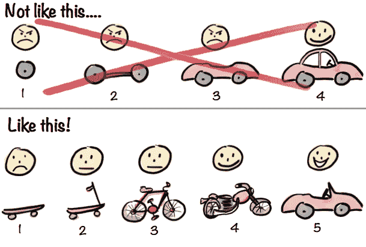
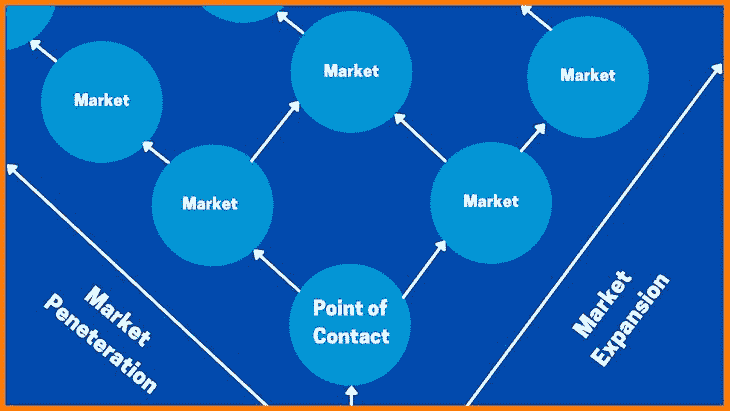
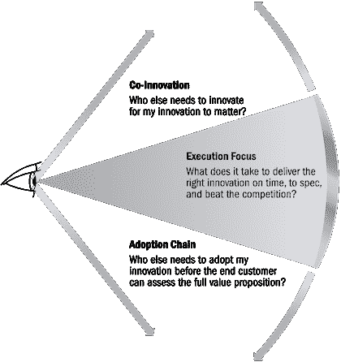

# 如何使用 data - LogRocket 博客传达你的产品策略

> 原文：<https://blog.logrocket.com/product-management/how-to-communicate-product-strategy/>

产品经理之间经常提到的一个问题是向高层领导和组织内的其他团队传达产品战略和路线图。

在本指南中，我们将概述以数据驱动的方式展示您的产品战略的步骤和最佳实践，从而吸引并协调所有利益相关方。我们将参考真实世界的例子来演示这是如何工作的，并提供一些技巧来帮助您克服产品经理面临的一些最常见的沟通挑战。

* * *

## 目录

* * *

## 什么是产品战略？

一个[产品愿景](https://blog.logrocket.com/product-management/what-is-a-product-vision-statement-examples/)阐明了在哪里落地，并植根于让你的客户满意的东西，而一个产品战略将这个想法延伸到下一个执行层面。它有助于制定蓝图，推动愿景的实现。

一个好的[产品战略](https://blog.logrocket.com/product-strategy-frameworks-examples/)必须通过解决以下几个方面来阐明和帮助产品架构、路线图、营销、销售活动和财务需求:

*   从什么开始(MVP)
*   与谁合作(现在和以后)
*   要解决哪些人口统计问题
*   如何快速迭代以保持竞争优势

这说起来容易做起来难。从 A 点到 B 点，产品策略可能是一个模糊的东西，有太多潜在的路径，很难提取出来。

## 为什么产品经理很难沟通战略？

组织有他们自己的议程和动机，这可能与最优路径不一致。沟通并获得领导的认同可能很复杂，尤其是在展示商业案例时，如果对产品的反馈为零。

想象你作为一个团队从森林的一端走到另一端。你有三个选择:

1.  在一条定义明确的路径上绕过森林(低成本、安全、缓慢)
2.  穿过树林(低成本、不安全、快速)
3.  走空中路线(高成本，有点安全，最快)

你如何向利益相关者传达选项和选择？如果他们每一个都给你一个不可取的理由呢？如果他们以排除所有选择的方式这样做呢？

产品策略从来都不是做出完美的决策，而是在数据不足的情况下，通过几个权衡，让你达到最终目标。

我说(当然是幽默地)经济学家和战略家的区别在于他们做同样的功课。前者说，“如果这个，那么那个”，后者必须决定走哪条路。

[播放《碟中谍》的主题音乐。]

[https://www.youtube.com/embed/XAYhNHhxN0A](https://www.youtube.com/embed/XAYhNHhxN0A)

视频

如果你选择接受它，你的任务就是说服每个人从森林的一端到另一端的最佳路线。不是每个人都会快乐，但他们应该相信并听从你的领导。

## 向利益相关者展示你的产品策略

[产品经理](https://blog.logrocket.com/product-management/what-does-a-product-manager-do-role-responsibilities/)必须对每个选项进行连贯的分析，以定义数据驱动的产品战略。该战略需要围绕以下内容阐明(使用可靠但不完善的数据)考虑事项:

*   内部协同作用，如核心竞争力和市场准入
*   最低可行产品(MVP)和产品将首先解决的滩头阵地，随后基于竞争力
*   生态系统战略(即，决定购买/构建什么)
*   通过监控[领先(什么在你的控制之下)和落后(你期望什么)KPI](https://www.forbes.com/sites/bernardmarr/2020/10/23/whats-the-difference-between-lagging-and-leading-indicator/?sh=10e8e3345009)来持续更新流程

## 内部协同作用

在陈述你的战略时，考虑组织的各个部分可能会如何反应是很重要的。研究如何建立核心能力和组织激励机制，并找出阻力最小的途径。

### 核心能力

乘坐飞机可能是从森林的一端到另一端的最佳选择，但是如果没有人知道如何驾驶它呢？试图说服这个团体是徒劳的。我并不是说要抛弃远大的目标，而是要确保你有办法达到目标。

例如，我们有一个非常优秀的嵌入式系统团队。你可能认为重新训练团队开始在 AWS 上开发可能是无缝的，但是说起来容易做起来难。然而，如果使用 AWS 创建解决方案是不可协商的，您可能需要看其他地方并向领导层表达这一点(用数据和潜在的选项)。

### 组织激励

假设您以每份许可证 10，000 美元的价格出售了永久软件许可证。作为一个组织，您后来意识到需要转向“即服务”模式。新产品的定价为每年 5，000 美元，并且您认识到销售团队在相同的长期结构下将获得更高的回报。

销售主管在演示过程中畏缩不前。有什么问题？

首先，服务模式是有风险的，因为客户可能会背叛。第二，他们第一年的佣金较低。为什么他们会有动力去销售你的产品？

再次强调，重点不在于违背理想目标，而在于运用由外向内的观点来达成一致。

### 如何实现内部协同

为了确保一致性，您必须考虑组织内您将接触的每个群体的能力和激励。

* * *

订阅我们的产品管理简讯
将此类文章发送到您的收件箱

* * *

以表格的形式展示您的发现，表格中的列描述了各种选项，行描述了必须参与的几个组。

## 展示 MVP

一旦你知道你能制造什么以及如何把它推向市场，下一步就是阐明[最小可行产品(MVP)](https://blog.logrocket.com/product-management/what-is-minimum-viable-product-mvp-how-to-define/) 。

Source: [Henrik Kniberg](https://blog.crisp.se/2016/01/25/henrikkniberg/making-sense-of-mvp)

这里的关键是有效地展示滩头阵地，它如何从竞争中脱颖而出，以及组织推动发布的超能力。

### 谁需要它？谁准备好了？滩头阵地

你的大目标市场有大量未满足的需求，但是谁是最需要它的呢？更重要的是，谁愿意使用你的产品？展示这一点的一种方法是使用气泡图来快速表达这一概念。

例如，您正在构建一个分析产品来提供实时洞察。向系统提供数据的能力是一个进入标准。如果管道没有准备好，责任就会落在你的产品上。

Source: [StartupTalky](https://startuptalky.com/beachhead-strategy-explained/)

确定滩头阵地的另一个方面是我们自己到达滩头阵地的能力。你有一个切入点来推动意识吗？

### 竞争情报

对于您选择的初始细分市场，展示清晰的差异化至关重要。领导、营销和销售人员希望了解这些信息，以了解如何推动价值获取。

这似乎是显而易见的，但是你会惊讶我经常看到产品经理努力表达“那又怎样？”

您可以设想一个 2×2 的图表，其中 X 轴是价值创造，Y 轴是准备情况。当然，你可以创新气泡的大小和颜色，以获得竞争优势和进入市场的能力。不过，不要太疯狂！

## 生态系统协同

作为罗恩·阿德纳博士和他的工作(和 *[赢得正确的游戏](https://ronadner.com/book/winning-the-right-game/)* )的追随者，我认为生态系统是一个至关重要的功能。

Source: [Ron Adner](https://ronadner.com/the-wide-lens-excerpt/)

组织通常专注于执行，而忽略了共同创新和共同采用的概念。

平衡[购买/制造/合作伙伴战略](https://medium.com/@a_hatami/buy-build-or-partner-40a399c9e528)，确定成功上市还需要谁，以及了解你带来的协同效应，这一点至关重要。

### 平衡购买和构建

假设您构建的产品需要访问来自 DMV 的数据。有两条路。一种是与每一个车管所合作，这将花费更少，但这是一个漫长的过程。另一种是找到准备好这种管道的合作伙伴，这需要你付出更多，但价值实现的时间很快。

### 识别隐形伙伴

用广角镜头中的一个例子，你知道为什么米其林的漏气保用失败了吗？他们没有考虑过有一个网络(有合适的设备)来修理轮胎。他们与制造商建立了正确的合作关系，但却错过了这一点。

在你给管理层的报告中，一定要指出成功所需的明显和不明显的合作伙伴。

### 探索合作伙伴的协同作用

考虑可以访问 DMV 数据的合作伙伴的例子。假设你已经把范围缩小到三个合法伴侣。你选择了哪一个，为什么？

是已经为市场提供服务的供应商，尽管效率低下，还是一个试图渗透的合法来源？你如何向领导表达这一点，尤其是当你的选择是后者，而不是现任？

### 如何实现生态系统协同

确保你有一个连贯的方法来解释以下内容:

*   初始发布所需的合作伙伴
*   下一波合作伙伴计划
*   你用来提炼的标准
*   对购买/制造/合作伙伴决策的每个方面的建议

## 提供数据驱动的更新

既然您已经介绍了该战略的基本原理，现在是时候[定义您将监控的 KPIs】以证明该计划正在起作用(或不起作用)。](https://blog.logrocket.com/product-management/what-metrics-kpis-product-managers-track/)

对于一个相对较新的产品，目标不是捕捉成功/失败，而是分析结果和支点。为此，定义一组前导和尾随 KPI 至关重要。

领先的 KPI 衡量你能控制什么。如果你计划开展五次活动，你可以衡量一下你是否做到了。

跟踪 KPI 是您期望您的活动产生的结果。例如，该活动得到了多少回应？您可以将领先和落后的 KPI 与采用或意识问题的根本原因相关联。

数据驱动战略有助于提高领导层的可信度，并推动与利益相关方就所需的修改进行低阻力的讨论。

### 通过领导力提升可信度

领导应该理解并指导你获取 KPI。当你让他们参与头脑风暴时，这给了你可信度。当利益相关者参与游戏时总是更好。

### 展示什么可行，什么不可行

我们曾经遇到过这样的情况，用户开始一个进程，中途放弃了，再也没有回来。查看数据后，很明显我们的合作伙伴战略是不完整的。

MVP 展示了比我们预期的更快地整合更多合作伙伴的需求。作为回应，我们更新了[产品路线图](https://blog.logrocket.com/product-management/how-to-build-product-roadmap-overview-examples/)、架构和定价。

一些产品经理可能认为这是一个失败，但我不同意。MVP 的目的是寻求反馈并快速转向。沟通至关重要。

### 如何有效地呈现数据驱动的更新

确定您需要衡量的 KPI。仔细检查数据，尤其是在最初的几天。从数据分析团队获得帮助，找到原因。作为一个持续的过程，按要求展示调查结果。每个人都有权知道什么有效，什么无效。

## 传达产品战略的最佳实践

让我们总结一些向领导层和其他利益相关者传达产品战略的要点和最佳实践。

在参加领导会议之前，确保你与最有可能做出不利反应的人达成共识。

先提出你的建议。准备好所有备份信息，以便在必要时双击或双击。我曾经和这样的领导共事过，他们非常关注我们正在开发的产品，以至于他们会问一些你在他们这个层次上不会想到的问题。相信我——当你没有准备好的时候，你会失去所有的可信度。

最后，使用您的组织习惯审查的[产品管理框架](https://blog.logrocket.com/product-management/6-product-management-frameworks-you-should-know/)。我参加过领导会议，会上所有事情都需要写下来，还有一些会议上使用了战略钻石。在罗马，做一个罗马人！

*精选图片来源:[icon scout](https://iconscout.com/icon/presentation-board-435)*

## [LogRocket](https://lp.logrocket.com/blg/pm-signup) 产生产品见解，从而导致有意义的行动

[LogRocket](https://lp.logrocket.com/blg/pm-signup) 确定用户体验中的摩擦点，以便您能够做出明智的产品和设计变更决策，从而实现您的目标。

使用 LogRocket，您可以[了解影响您产品的问题的范围](https://logrocket.com/for/analytics-for-web-applications)，并优先考虑需要做出的更改。LogRocket 简化了工作流程，允许工程和设计团队使用与您相同的[数据进行工作](https://logrocket.com/for/web-analytics-solutions)，消除了对需要做什么的困惑。

让你的团队步调一致——今天就试试 [LogRocket](https://lp.logrocket.com/blg/pm-signup) 。

[Harish Natarahjan Follow](https://blog.logrocket.com/author/harishnatarahjan/) Harish brings 18+ years of product, strategy and technology expertise, delivering solutions in mission-critical environments in public safety, discrete manufacturing, and insurance verticals.