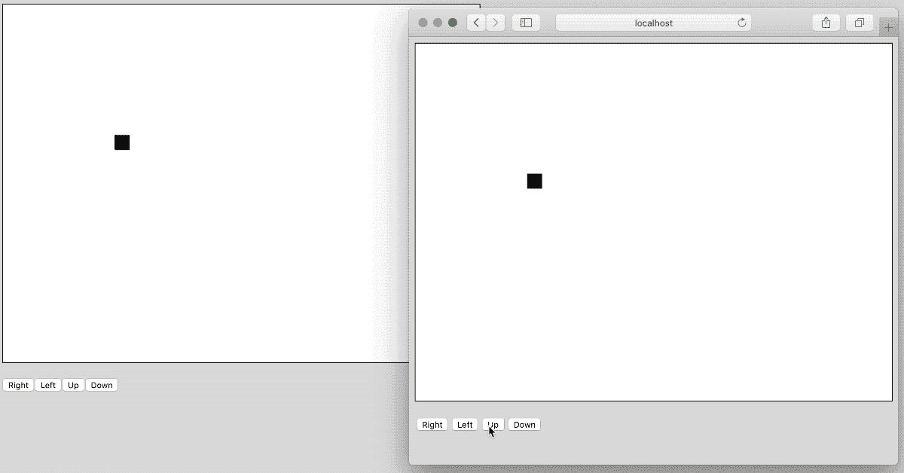

# 如何用 Vue.js 和 Socket.io 创建 2D 多人游戏- LogRocket 博客

> 原文：<https://blog.logrocket.com/how-to-create-a-2d-multiplayer-game-with-vue-js-and-socket-io-174ef2818e65/>

点击此处查看摘要:

 [https://www.youtube.com/embed/JEYEpledOxs?version=3&rel=1&showsearch=0&showinfo=1&iv_load_policy=1&fs=1&hl=en-US&autohide=2&wmode=transparent](https://www.youtube.com/embed/JEYEpledOxs?version=3&rel=1&showsearch=0&showinfo=1&iv_load_policy=1&fs=1&hl=en-US&autohide=2&wmode=transparent)

视频

当涉及到多个客户端和一个服务器之间的实时通信时，RESTful 和 GraphQL APIs 通常不是最好的方法，因为必须不断地轮询它们以了解数据的变化。相反，首选的方法是使用套接字，无论是 web 套接字还是其他。

因为套接字对于实时数据非常有用，所以它们对于在线多人游戏非常有益。玩家可以在他们的游戏中进行交互，数据被发送到服务器，服务器将数据广播给游戏中的其他玩家。这就是我们要举的例子。

在本教程中，我们将使用 Vue.js 探索基于 web 浏览器的游戏，但我们将从多人的角度通过 [Socket.io](https://socket.io/) 包括套接字。

为了了解我们想要实现的目标，请看下面的动画图像:



首先，你会注意到在游戏方面有一个诱饵和开关。是的，这是我们将要探索的游戏的基础，但我们不会制作一个真正的游戏。相反，您会注意到我们打开了两个 web 浏览器窗口，我们对其中一个窗口所做的任何更改都会反映在另一个窗口中。

总而言之，正在发生的事情是，按钮向服务器发送一个消息，我们要在某个方向上移动画布矩形。不是客户端改变盒子的位置，而是服务器用新的盒子位置来响应，所以所有的客户端都是同步的，没有人伪造位置来欺骗。

[](https://logrocket.com/signup/)

### **如何用 Node.js 和简单的 JavaScript 创建游戏服务器**

虽然 Vue.js 是本教程的重点，但所有繁重的工作都由我们的服务器来完成，它将使用 Node.js 来创建。

假设您已经安装了的 [Node.js，创建一个新的目录来表示您的服务器，并执行以下命令来创建一个新项目:](https://nodejs.org/en/)

```
npm init --y
npm install express socket.io --save
touch app.js
```

以上命令将创建一个 **package.json** 文件，并在其中安装我们的两个项目依赖项。上述命令还将为我们所有的服务器端逻辑创建一个 **app.js** 文件。如果你的操作系统不支持 touch 命令，继续创建 **app.js** 文件，不过这是对你最有意义的。

首先，打开 **app.js** 文件，添加以下样本 JavaScript 代码:

```
const Express = require("express")();
const Http = require("http").Server(Express);
const Socketio = require("socket.io")(Http);

var position = {
    x: 200,
    y: 200
};

Http.listen(3000, () => {
    console.log("Listening at :3000...");
});
```

在上面的代码中，我们导入并初始化了之前安装的每个包。我们还在端口 [3000](http://localhost:3000) 上启动我们的服务器。因为在这个例子中我们不会使用数据库，所以只要服务器使用`position`变量运行，对游戏中数据的任何更改都将持续。

这个伪游戏只有一个相关的数据，即`x`和`y`位置数据。

现在，我们可以开始向服务器添加更具定义性的逻辑了:

```
Socketio.on("connection", socket => {
    socket.emit("position", position);
    socket.on("move", data => {
        switch(data) {
            case "left":
                position.x -= 5;
                Socketio.emit("position", position);
                break;
            case "right":
                position.x += 5;
                Socketio.emit("position", position);
                break;
            case "up":
                position.y -= 5;
                Socketio.emit("position", position);
                break;
            case "down":
                position.y += 5;
                Socketio.emit("position", position);
                break;
        }
    });
});
```

在我们的`connection`监听器中，我们正在监听新的客户端连接。当客户端连接时，存储的正方形位置被发出，这样客户端就可以更新画布。虽然职位的副本将保存在客户端本地，但我们永远不会依赖客户端来提供职位。

为任何特定的客户机建立套接字连接后，就会创建一个侦听器。当客户端发送标题为`move`的消息时，与该消息一起发送的数据用于确定位置应如何改变。在位置数据改变之后，它被发送回客户端。

您会注意到我们的消息有一个`position`标题和一个`move`标题。只要你在客户端和服务器端保持一致，你想怎么叫都行。在我们的例子中，`move`表示从客户端发送的移动对象的消息，而`position`表示包含实际位置的消息。

你可能还会注意到`emit`和`Socketio`都被用在了`socket`上。在`socket`的情况下，消息仅被发送到一个特定的客户端，而使用`Socketio`发送的消息被广播到所有连接的客户端。

现在，我们可以启动 Node.js 服务器，开始开发 Vue.js 应用程序。

### **用 Vue.js 和 Socket.io 开发客户端前端**

我们创建了我们的服务器，但我们没有任何东西来呈现我们的游戏或位置的变化。

假设您已经安装了 [Vue CLI](https://cli.vuejs.org/) ，在 Node.js 项目目录之外执行以下命令:

```
vue create client
```

出现提示时，选择使用默认值。在 Vue.js 项目目录中导航，执行以下命令再次安装 Socket.io:

```
npm install socket.io --save
```

记住，我们正在处理两个不同的项目，都使用 Socket.io，因此需要安装 Socket.io 两次。

在 Vue.js 项目中创建一个**src/components/block game . vue**文件来表示我们的游戏组件。该文件应该包含以下样板代码:

```
<template>
    <div>
        <canvas ref="game" width="640" height="480" style="border: 1px solid black;"></canvas>
    </div>
</template>

<script>
    import io from "socket.io-client";
    export default {
        name: 'BlockGame',
        data() {
            return {
                socket: {},
                context: {},
                position: {
                    x: 0,
                    y: 0
                }
            }
        },
        created() { },
        mounted() {
            this.context = this.$refs.game.getContext("2d");
        },
        methods: { }
    }
</script>

<style scoped></style>
```

在上面的代码中，我们为游戏引用的`game`提供了一个 HTML 画布。我们不能在 Vue.js 中直接访问 DOM，所以我们必须使用适当的引用。

在`<script>`标签中，我们导入了 Socket.io 客户端，并且定义了一些在组件中使用的变量。在 HTML 视图有了`mounted`之后，我们可以利用 mounted 方法来获取对我们的 HTML canvas 对象的引用。

这就是我们开始进入套接字的地方。

* * *

### 更多来自 LogRocket 的精彩文章:

* * *

在装载视图之前，我们希望建立一个到之前创建的 Socket.io 服务器的连接。我们可以在`created`方法中这样做:

```
created() {
    this.socket = io("http://localhost:3000");
},
```

一旦我们连接到我们的服务器，我们可以开始监听服务器广播的位置变化，这样我们就可以渲染它们。因为这将是渲染，我们需要确保视图准备好了。因此，我们必须监听`mounted`方法中的变化，如下所示:

```
mounted() {
    this.context = this.$refs.game.getContext("2d");
    this.socket.on("position", data => {
        this.position = data;
        this.context.clearRect(0, 0, this.$refs.game.width, this.$refs.game.height);
        this.context.fillStyle = "#FFFFFF";
        this.context.fillRect(0, 0, this.$refs.game.width, this.$refs.game.width);
        this.context.fillStyle = "#000000";
        this.context.fillRect(this.position.x, this.position.y, 20, 20);
    });
},
```

在上面的代码中，我们有一个用于`position`消息的监听器。记住，我们的服务器正在发送标记为`position`的消息，所以我们需要准备好接收它们。

当我们收到位置信息时，我们清除画布，呈现我们选择的背景，然后根据侦听器中返回的坐标信息绘制一个矩形。每次服务器说我们的位置变了都会这样。

那么我们该如何改变自己的立场呢？让我们为这项工作建立一个方法:

```
methods: {
    move(direction) { this.socket.emit("move", direction); },
}
```

上面的`move`方法期望一个方向。这个方向被发送到服务器。记住，服务器正在监听标记为`move`的消息。在调用了`move`方法后，我们实际上并没有移动矩形。实际上，我们只有在得到服务器关于新位置的响应后才会移动。

让我们创建几个利用这个新的`move`方法的按钮:

```
<template>
    <div>
        <canvas ref="game" width="640" height="480" style="border: 1px solid black;"></canvas>
        <p>
            <button v-on:click="move('right')">Right</button>
            <button v-on:click="move('left')">Left</button>
            <button v-on:click="move('up')">Up</button>
            <button v-on:click="move('down')">Down</button>
        </p>
    </div>
</template>
```

在`<template>`标签中，我们有四个按钮，每个按钮都向`move`方法传递一个方向。我们正在做的事情没有什么新奇的事情发生。

到目前为止，我们有一个区块游戏组件，但是它没有与我们的应用程序挂钩。为此，打开项目的 **src/App.vue** 文件，并包含以下内容:

```
<template>
    <div id="app">
        <BlockGame />
    </div>
</template>

<script>
    import BlockGame from './components/BlockGame.vue'

export default {
        name: 'app',
        components: {
            BlockGame
        }
    }
</script>

<style>
    body {
        background-color: #ddd;
    }
</style>
```

我们的`BlockGame`组件是相当独立的，所以只需导入它，然后在`<template>`块中使用它就足够了。

假设服务器当前正在运行，这可以通过现在运行 Vue.js 客户机来测试。

### **结论**

您刚刚看到了如何使用 Vue.js 和 [Socket.io](https://socket.io/) 来构建一个简单的游戏。这个游戏很简单，因为没有竞技角度。我们用 Node.js 创建了一个游戏服务器，用 Vue.js 创建了一个客户端。服务器向每个客户端发送位置信息，客户端使用该位置信息在屏幕上呈现一个 2D 对象。

如果你想看一个关于 Socket.io 的基本聊天示例，我在几年前用 Angular 创建了一个例子，标题是[用 CEAN 堆栈和 Socket.io](https://www.thepolyglotdeveloper.com/2016/01/create-a-real-time-chat-application-with-the-cean-stack-and-socket-io/) 创建一个实时聊天应用。

## 像用户一样体验您的 Vue 应用

调试 Vue.js 应用程序可能会很困难，尤其是当用户会话期间有几十个(如果不是几百个)突变时。如果您对监视和跟踪生产中所有用户的 Vue 突变感兴趣，

[try LogRocket](https://lp.logrocket.com/blg/vue-signup)

.

[](https://lp.logrocket.com/blg/vue-signup)[https://logrocket.com/signup/](https://lp.logrocket.com/blg/vue-signup)

LogRocket 就像是网络和移动应用程序的 DVR，记录你的 Vue 应用程序中发生的一切，包括网络请求、JavaScript 错误、性能问题等等。您可以汇总并报告问题发生时应用程序的状态，而不是猜测问题发生的原因。

LogRocket Vuex 插件将 Vuex 突变记录到 LogRocket 控制台，为您提供导致错误的环境，以及出现问题时应用程序的状态。

现代化您调试 Vue 应用的方式- [开始免费监控](https://lp.logrocket.com/blg/vue-signup)。