# 如何使用 GitHub Actions 为 Laravel 应用程序创建 CI/CD

> 原文：<https://blog.logrocket.com/how-to-create-a-ci-cd-for-a-laravel-application-using-github-actions/>

## 介绍

不到一年前，GitHub Actions 推出，从那时起，它已经得到了[众多的积极评价](https://twitter.com/hashtag/githubactions?lang=en)。它允许我们将关于项目集成和部署的重要事情放在一个中心位置。换句话说，您的代码可以从 GitHub 构建、测试和部署，而不需要使用外部 CI/CD 服务来完成这项工作。

在本文中，我们将探索一种使用 GitHub Actions 管理 CI/CD 流程的实践方法。

### 先决条件

*   GitHub 账户。如果你还没有，你可以在这里注册
*   具有 SSH 访问权限的服务器
*   写作基础知识有效 [YAML](https://yaml.org)
*   GitHub 和 Git 的基础知识

### 我们的计划

在本文中，我们将讨论构成我们的演示应用程序的基本 CI/CD 设置的主要部分。我们的 CI/CD 设置将监控对我们的存储库的推送和拉取请求。我们希望能够:

*   对推送运行测试
*   当对特定分支进行推送时，对 pull `requestDeploy`运行测试
*   在`staging`分支上推送时部署到临时服务器
*   当发布被标记时，当推送打开时部署到生产服务器

## 示例项目

为了使这篇文章有重点和快捷，我创建了一个将在本文中使用的样本 Laravel 项目。该项目包含一些测试，包括前端测试和后端测试。要克隆项目运行:

```
git clone https://github.com/ichtrojan/deploy_tut
```

## 什么是工作流？

工作流定义了完成 CI/CD 流程所需的步骤。根据 GitHub 的文档:

> 工作流是定制的自动化过程，您可以在存储库中设置它，以便在 Github 上构建、测试、打包、发布或部署任何项目

工作流在存储库中定义，并作为存储库的一部分提交。当您提交工作流并推送到 GitHub 时，GitHub Actions 将自动检测工作流并立即解析工作流，并根据其中定义的指令开始处理您的 CI/CD 流程。工作流是用`YAML`编写的，存储在项目根目录的`.github/workflows`目录中。

## 配置工作流

### 对拉请求工作流运行测试

当大型团队在同一个项目上协作时，此工作流非常有用。每当创建一个 pull 请求时，您都希望运行一些检查，而不是等到它被合并后再进行测试。为此，我们将定义一个工作流，该工作流将在发出拉请求时运行。这种工作流看起来是这样的:

```
name: PR WorkFlow

on:
  pull_request:
    branches:
      - master
      - staging

jobs:
  app-tests:
    runs-on: ubuntu-latest
    services:
      mysql:
        image: mysql:5.7
        env:
          MYSQL_ALLOW_EMPTY_PASSWORD: yes
          MYSQL_DATABASE: test_db
        ports:
          - 3306
        options: --health-cmd="mysqladmin ping" --health-interval=10s --health-timeout=5s --health-retries=3
    steps:
      - uses: actions/[email protected]
      - name: Copy .env
        run: php -r "file_exists('.env') || copy('.env.example', '.env');"
      - name: Install Composer Dependencies
        run: composer install -q --no-ansi --no-interaction --no-scripts --no-suggest --no-progress --prefer-dist
      - name: Install NPM Dependencies
        run: npm install
      - name: Generate key
        run: php artisan key:generate
      - name: Execute tests (Unit and Feature tests) using PHPUnit
        env:
          DB_PORT: ${{ job.services.mysql.ports[3306] }}
        run: ./vendor/bin/phpunit
      - name: Execute tests (Unit and Feature tests) using JEST
        run: node_modules/.bin/jest

```

> 注:
> 以上应作为`pr_workflow.yml`保存在`.github/workflows`目录中。

```
name: Pull Request WorkFlow

on:
  pull_request:
    branches:
      - master
      - staging

```

上面的`YAML`文件的初始部分定义了工作流的名称，然后告诉 GitHub 在向`master`和`staging`分支发出拉请求时运行动作。

我们定义了一个名为`app-tests`的任务，它的目的是使用`Jest`和`PHPUnit`来运行两个测试。我们告诉 Github Actions 在设置动作时将`MySQL`作为服务包含进来。最后，由`steps`标记的另一部分列出了该工作要执行的步骤。

### 对推送工作流运行测试

在大多数情况下，无论何时对源代码进行更改，您都希望确保您的项目是好的。这通常是通过测试来完成的，确保项目的任何部分都不会因为任何变更而中断。为此，我们的初始工作流程如下所示:

```
name: PUSH Workflow

on:
  push:
    branches:
      - master
      - staging

jobs:
  app-tests:
    runs-on: ubuntu-latest
    services:
      mysql:
        image: mysql:5.7
        env:
          MYSQL_ALLOW_EMPTY_PASSWORD: yes
          MYSQL_DATABASE: test_db
        ports:
          - 3306
        options: --health-cmd="mysqladmin ping" --health-interval=10s --health-timeout=5s --health-retries=3
    steps:
      - uses: actions/[email protected]
      - name: Copy .env
        run: php -r "file_exists('.env') || copy('.env.example', '.env');"
      - name: Install Composer Dependencies
        run: composer install -q --no-ansi --no-interaction --no-scripts --no-suggest --no-progress --prefer-dist
      - name: Install NPM Dependencies
        run: npm install
      - name: Generate Key
        run: php artisan key:generate
      - name: Execute tests (Unit and Feature tests) via PHPUnit
        env:
          DB_PORT: ${{ job.services.mysql.ports[3306] }}
        run: vendor/bin/phpunit
      - name: Execute tests (Unit and Feature tests) via JEST
        run: node_modules/.bin/jest
  build-js-production:
    name: Build JavaScript/CSS for PRODUCTION Server
    runs-on: ubuntu-latest
    needs: app-tests
    if: github.ref == 'refs/heads/master'
    steps:
      - uses: actions/[email protected]
      - name: NPM Build
        run: |
          npm install
          npm run prod
      - name: Put built assets in Artifacts
        uses: actions/[email protected]
        with:
          name: assets
          path: public
  build-js-staging:
    name: Build JavaScript/CSS for STAGING Server
    runs-on: ubuntu-latest
    needs: app-tests
    if: github.ref == 'refs/heads/staging'
    steps:
      - uses: actions/[email protected]
      - name: NPM Build
        run: |
          npm install
          npm run dev
      - name: Put built assets in Artifacts
        uses: actions/[email protected]
        with:
          name: assets
          path: public
  deploy-production:
    name: Deploy Project to PRODUCTION Server
    runs-on: ubuntu-latest
    needs: [build-js-production, app-tests]
    if: github.ref == 'refs/heads/master'
    steps:
      - uses: actions/[email protected]
      - name: Fetch built assets from Artifacts
        uses: actions/[email protected]
        with:
          name: assets
          path: public
      - name: Setup PHP
        uses: shivammathur/[email protected]
        with:
          php-version: 7.4
          extension-csv: mbstring, bcmath
      - name: Composer install
        run: composer install -q --no-ansi --no-interaction --no-scripts --no-suggest --no-progress --prefer-dist
      - name: Setup Deployer
        uses: atymic/[email protected]
        with:
          ssh-private-key: ${{ secrets.SSH_PRIVATE_KEY }}
          ssh-known-hosts: ${{ secrets.SSH_KNOWN_HOSTS }}
      - name: Deploy to PRODUCTION Server
        env:
          DOT_ENV: ${{ secrets.DOT_ENV_PRODUCTION }}
        run: dep deploy production --tag=${{ env.GITHUB_REF }} -vvv
  deploy-staging:
    name: Deploy Project to STAGING Server
    runs-on: ubuntu-latest
    needs: [build-js-staging, app-tests]
    if: github.ref == 'refs/heads/staging'
    steps:
      - uses: actions/[email protected]
      - name: Fetch built assets from Artifacts
        uses: actions/[email protected]
        with:
          name: assets
          path: public
      - name: Setup PHP
        uses: shivammathur/[email protected]
        with:
          php-version: 7.4
          extension-csv: mbstring, bcmath
      - name: Composer install
        run: composer install -q --no-ansi --no-interaction --no-scripts --no-suggest --no-progress --prefer-dist
      - name: Setup Deployer
        uses: atymic/[email protected]
        with:
          ssh-private-key: ${{ secrets.SSH_PRIVATE_KEY }}
          ssh-known-hosts: ${{ secrets.SSH_KNOWN_HOSTS }}
      - name: Deploy to Prod
        env:
          DOT_ENV: ${{ secrets.DOT_ENV_STAGING }}
        run: dep deploy staging --tag=${{ env.GITHUB_REF }} -vvv

```

> 注:
> 以上应作为`push_workflow.yml`保存在`.github/workflows`目录下

我们将忽略工作流的`app-tests`部分，因为它与`pr_workflow.yml`中的部分相似，只关注使其不同的部分。

上面的工作流将使用 Jest 运行前端测试，使用 PHPUnit 运行后端测试，每当有对存储库的推送时，使用与发出 pull 请求时相同的方式。这里的不同之处在于，我们向这个工作流添加了另外四个任务—`build-js-production`、`build-js-staging`、`deploy-staging`和`deploy-production`。我们现在将解释这四项其他工作。

`build-js-production`和`build-js-staging`的目的是在我们的项目中构建 JavaScript 资产，然后将它们上传到 GitHub Actions 工件，以便它们可以在部署作业中使用。

需要注意的一件非常重要的事情是这行代码——`if: github.ref == 'refs/heads/master'`，它检查是否对`master`进行了推送，如果是，GitHub actions 将继续运行`steps`中定义的步骤。在`build-js-staging`中，我们用`if: github.ref == 'refs/heads/staging'`代替，它检查是否对`staging`分支进行了推送。换句话说，如果对分段分支进行推送，则`build-js-staging`运行，而如果对主分支进行推送，则`build-js-production`运行:

```
- name: Put built assets in Artifacts
        uses: actions/[email protected]
        with:
          name: assets
          path: public
```

在上面显示的代码中，在运行`npm run dev`或`npm run build`之后，我们将所有生成的静态资产上传到 GitHub Actions 工件。我们将在以后的另一项工作中获取它们。我们这样做是为了让我们可以持久化前一个作业中的一些数据，使其在另一个作业中可用。需要注意的是，生成的数据不会跨作业持续存在。

检查哪个分支进行了推送的相同原理也适用于`deploy-staging`和`deploy-production`作业。因此，`deploy-staging`在对分段进行推送时运行，而`deploy-production`在对主分支进行推送时运行。如果任何检查结果为真，将执行下面的步骤。

工作流的另一个重要部分是`needs: [build-js-staging, app-tests]`(在`deploy-staging`下)和`needs: [build-js-production, app-tests]`(在`deploy-production`下)，它们告诉 GitHub 动作，`deploy-staging`需要`build-js-staging`和`app-tests`作业成功运行才能运行。这意味着`deploy-staging`作业将在`build-js-staging`和`app-tests`运行并无任何错误退出后运行。这是为了确保如果测试或资产构建失败，部署不会发生。同样的道理也适用于`deploy-production`，它的运行依赖于`build-js-production`和`app-tests`。

```
name: Fetch built assets from Artifacts
        uses: actions/[email protected]
        with:
          name: assets
          path: public

```

上面将从工件中下载上传的资产到我们项目的`public`文件夹中:

```
- name: Composer install
        run: composer install -q --no-ansi --no-interaction --no-scripts --no-suggest --no-progress --prefer-dist

```

这将安装 composer 依赖项，这是我们稍后运行 Deployer 所需的步骤:

```
- name: Setup PHP
        uses: shivammathur/[email protected]
        with:
          php-version: 7.4
          extension-csv: mbstring, bcmath
```

工作流的这一部分使用另一个 GitHub 动作(由`shivammathur/[[email protected]](/cdn-cgi/l/email-protection)`标识)来设置要使用的 PHP 版本和我们需要的扩展:

```
- name: Setup Deployer
        uses: atymic/[email protected]
        with:
          ssh-private-key: ${{ secrets.SSH_PRIVATE_KEY }}
          ssh-known-hosts: ${{ secrets.SSH_KNOWN_HOSTS }}

```

这一步使用由`atymic/[[email protected]](/cdn-cgi/l/email-protection)`标识的另一个 GitHub 动作来设置部署器，并与我们稍后将从服务器获得的`SSH_PRIVATE_KEY`和`SSH_KNOWN_HOSTS`一起使用。

```
- name: Deploy to Prod
        env:
          DOT_ENV: ${{ secrets.DOT_ENV_STAGING }}
        run: dep deploy staging --tag=${{ env.GITHUB_REF }} -vvv
```

```
- name: Deploy to Prod
        env:
          DOT_ENV: ${{ secrets.DOT_ENV_PRODUCTION }}
        run: dep deploy staging --tag=${{ env.GITHUB_REF }} -vvv
```

最后，最后一步启动部署过程，从那里，部署者将把项目上传到服务器。这两个部分的区别是`secrets.DOT_ENV_PRODUCTION`和`secrets.DOT_ENV_STAGING`，这允许我们为不同的部署注入不同的`ENVIRONMENT VARIABLES`。在我们的例子中，我们使用不同的`ENVIRONMENT VARIABLES`进行生产和准备。

## 获取服务器凭据

这里的目的是让 GitHub actions 访问我们的服务器来部署更改，您将获得您的服务器的私钥并将其添加到秘密中。为此，您需要生成一个`SSH`密钥(如果您还没有这样做的话),登录到您的服务器并运行:

```
ssh-keygen
```

会有一些提示，您可以接受默认值。确保在提示设置期间没有为您的 SSH 密钥提供密码短语。如果已经生成了 SSH 密钥，可以跳过这一步。运行完提示后，您应该会看到如下内容:

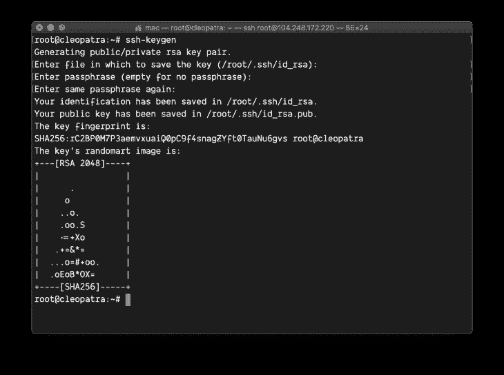

在`~/.ssh`目录下会为你生成两个名为`id_rsa.pub`和`id_rsa`的文件。接下来，复制`id_rsa`的内容，而不是`id_rsa.pub`。`id_rsa.pub`包含您的公钥，而`id_rsa`包含您的私钥:

```
cat ~/.ssh/id_rsa
```

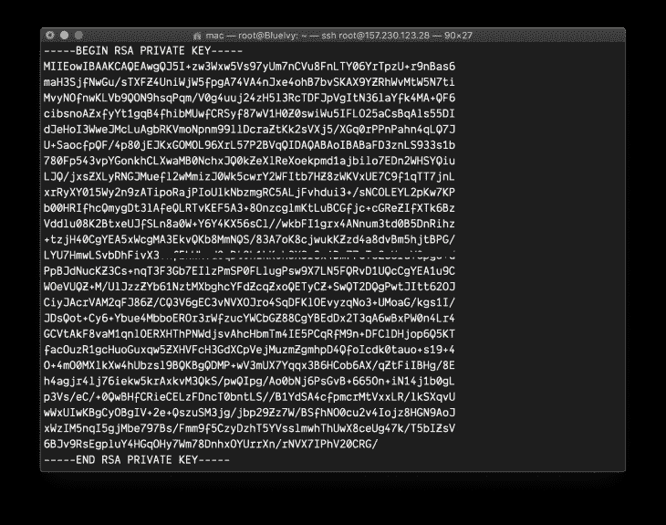

您需要将 SSH keygen 生成的公钥添加到`authorized_keys`中，以便允许任何使用私钥的连接尝试。这可以通过运行以下命令来完成:

```
cat ~/.ssh/id_rsa.pub >> ~/.ssh/authorized_keys
```

上面的命令不会产生任何输出，所以如果运行该命令后什么也没有发生，也不用担心。接下来，您将前往 GitHub，转到项目的`Settings`选项卡。然后点击`Secrets`，如下图所示:

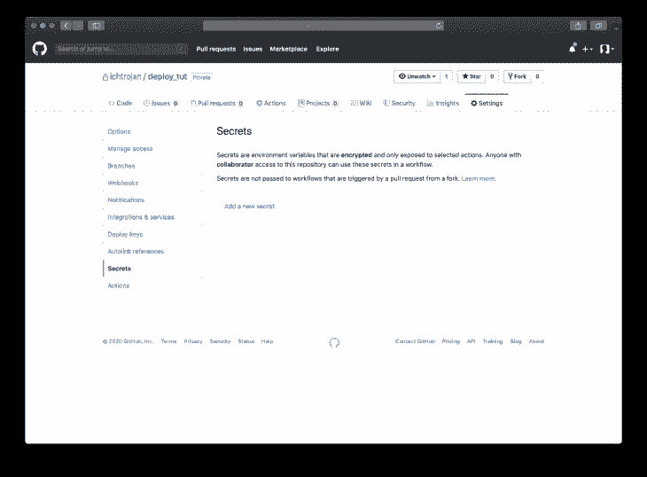

您需要给这个秘密取一个与工作流中定义的内容相对应的名称，即`SSH_PRIVATE_KEY`，然后将您复制的内容作为值，如下所示:

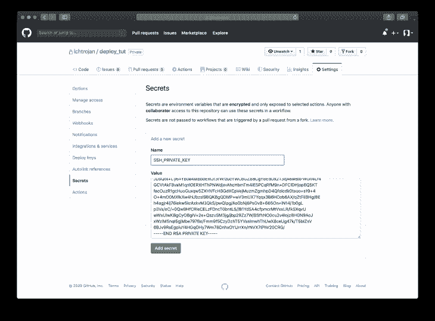

添加秘密后，我们将看到如下视图:

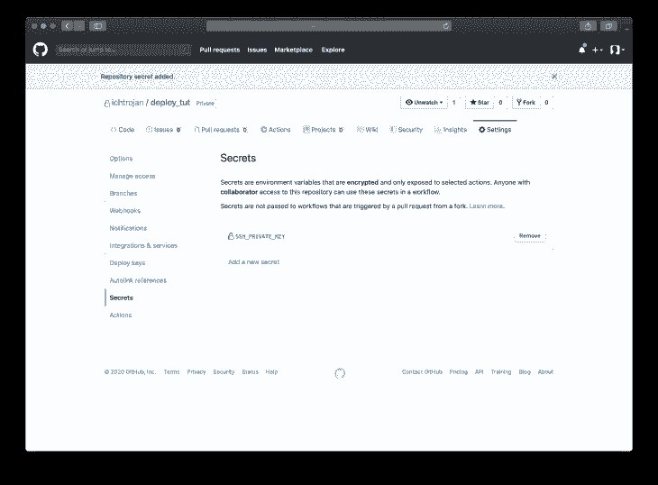

获取服务器的`SSH Known Hosts`，并将其添加到`Secrets`部分。从您的本地机器上，您必须运行以获取 ssh 已知主机:

```
ssh-keyscan rsa -t {server_ip_address}
```

> 注意:
> 用您的服务器公共 IP 地址替换`{server_ip_address}`

复制该命令的输出，并将其添加到名为`SSH_KNOWN_HOSTS`的机密中，内容将被复制。

> 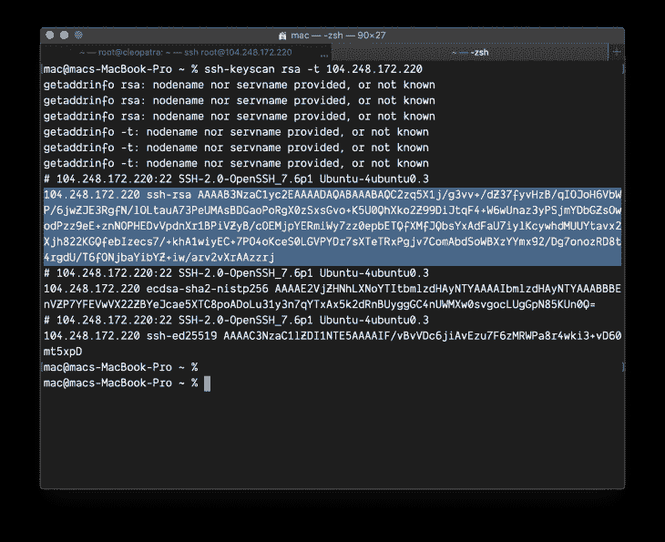
> 
> Note:
> The part to copy begins with `{server_ip_address} sh-rsa`

注意，在这种情况下，并不是所有的内容都被复制。只有突出显示的部分被复制。将它添加到 Github Secrets 后，我们将得到如下内容:

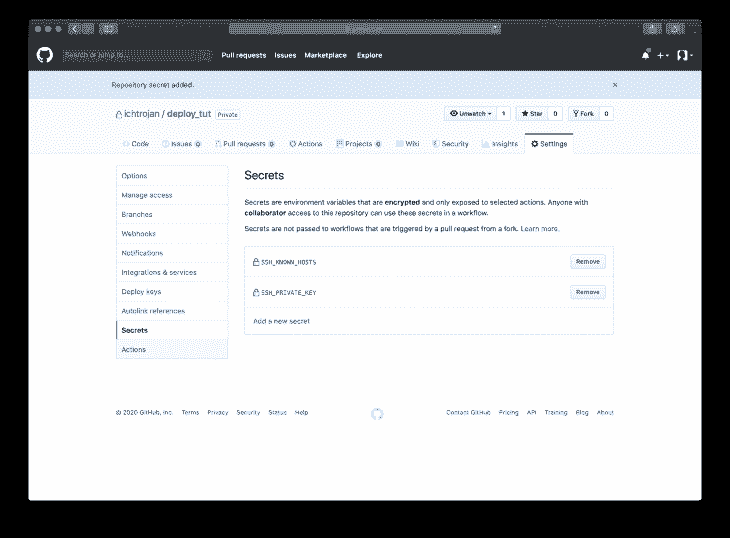

To achieve our plan of deploying to different server appropriately, you will need to repeat this process for the `staging server` and the `production Server` or else you will need to give appropriate names to the secrets you’re adding to the repository. You must ensure that this naming takes effect in the workflow written above since you’re using different servers for your production and staging environments.

## 添加应用程序环境文件

接下来，我们需要像上一节一样在 secret 中添加环境变量。这里的技术是在操作运行时注入环境变量。要做到这一点，我们要把服务器上 app 需要的环境变量编译成一个`.env`文件。

然后，我们将复制该文件的内容，并将其添加到 secrets 中，其名称为:

```
`DOT_ENV_STAGING` and `DOT_ENV_PRODUCTION`
```

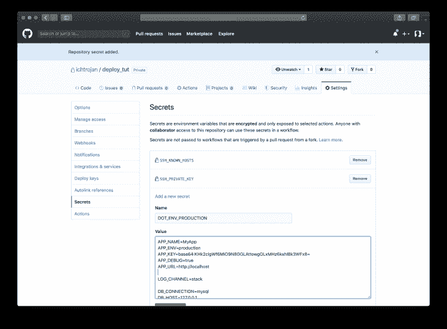

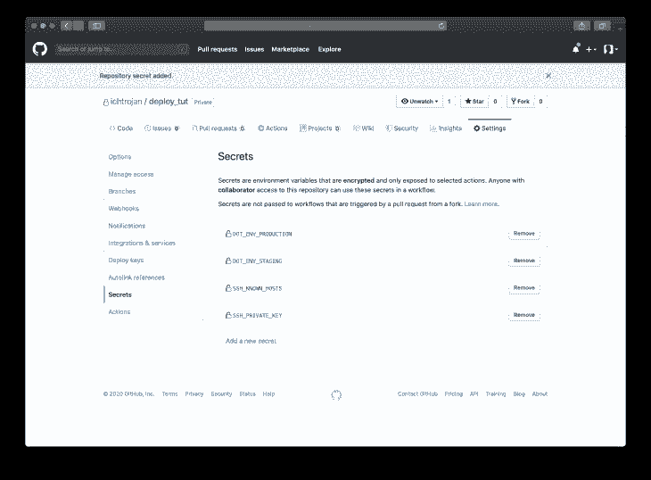

## 设置部署者

为了启动我们的部署，我们将使用 [Deployer](https://deployer.org) 。这是一个用 PHP 编写的部署工具，支持现成的流行框架。要使用它，我们需要在我们的项目中本地设置它，我们通过运行:

```
composer require deployer/deployer deployer/recipes
```

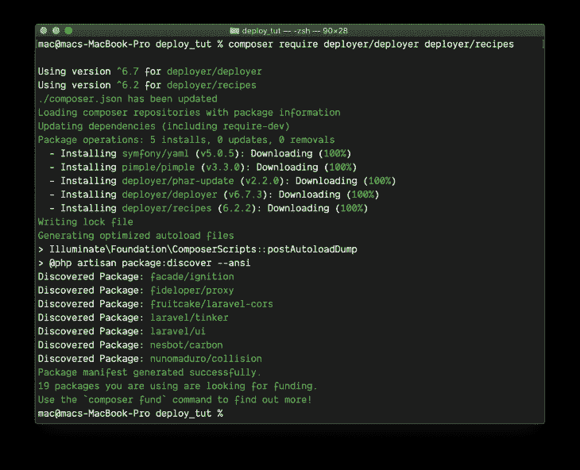

包`deployer/deployer`是主要的 Deployer 项目，而`deployer/recipes`包含的组件将帮助我们为特定的项目和工具配置 Deployer，如 Laravel、Symfony、RSync 等。

接下来，配置部署器，我们将在项目的根目录下创建一个名为`deploy.php`的文件:

```
<?php

namespace Deployer;

require 'recipe/laravel.php';
require 'recipe/rsync.php';

set('application', 'My App');
set('ssh_multiplexing', true);

set('rsync_src', function () {
    return __DIR__;
});

add('rsync', [
    'exclude' => [
        '.git',
        '/.env',
        '/storage/',
        '/vendor/',
        '/node_modules/',
        '.github',
        'deploy.php',
    ],
]);

task('deploy:secrets', function () {
    file_put_contents(__DIR__ . '/.env', getenv('DOT_ENV'));
    upload('.env', get('deploy_path') . '/shared');
});

host('myapp.io')
  ->hostname('104.248.172.220')
  ->stage('production')
  ->user('root')
  ->set('deploy_path', '/var/www/my-app');

host('staging.myapp.io')
  ->hostname('104.248.172.220')
  ->stage('staging')
  ->user('root')
  ->set('deploy_path', '/var/www/my-app-staging');

after('deploy:failed', 'deploy:unlock');

desc('Deploy the application');

task('deploy', [
    'deploy:info',
    'deploy:prepare',
    'deploy:lock',
    'deploy:release',
    'rsync',
    'deploy:secrets',
    'deploy:shared',
    'deploy:vendors',
    'deploy:writable',
    'artisan:storage:link',
    'artisan:view:cache',
    'artisan:config:cache',
    'artisan:migrate',
    'artisan:queue:restart',
    'deploy:symlink',
    'deploy:unlock',
    'cleanup',
]);

```

上面代码中的大多数行都是不言自明的。但是，我将继续解释代码的某些部分:

```
<?php

...

require 'recipe/laravel.php';
require 'recipe/rsync.php';

```

这部分包括来自`deployer/recipes`的两个食谱，第一个是给拉韦尔的，另一个是给 [RSync](https://linux.die.net/man/1/rsync) 的。`'recipe/laravel.php'`允许我们使用一些预定义的特定任务，而`'recipe/rsync.php'`允许我们轻松配置 RSync，因为我们将使用它将文件复制到服务器:

```
<?php

...

set('rsync_src', function () {
    return __DIR__;
});

add('rsync', [
    'exclude' => [
        '.git',
        '/.env',
        '/storage/',
        '/vendor/',
        '/node_modules/',
        '.github',
        'deploy.php',
    ],
]);

```

该部分配置 RSync，它定义了我们将从中复制文件的目录，还定义了在`exclude`数组键中复制时应排除的目录和文件:

```
<?php

...

task('deploy:secrets', function () {
    file_put_contents(__DIR__ . '/.env', getenv('DOT_ENV'));
    upload('.env', get('deploy_path') . '/shared');
});

host('myapp.io')
  ->hostname('104.248.172.220')
  ->stage('production')
  ->user('root')
  ->set('deploy_path', '/var/www/my-app');

host('staging.myapp.io')
  ->hostname('104.248.172.220')
  ->stage('staging')
  ->user('root')
  ->set('deploy_path', '/var/www/my-app-staging');

```

上面的第一个代码块定义了一个任务，该任务复制工作流中配置的`DOT_ENV`的内容，并将其放在部署目录的共享目录中。该代码片段的其余部分是相同的，但略有不同。他们都配置暂存和生产环境以及其他一些东西，如部署路径、IP 等，这些都是特定于任一环境的:

```
<?php

...

after('deploy:failed', 'deploy:unlock');

desc('Deploy the application');

task('deploy', [
    'deploy:info',
    'deploy:prepare',
    'deploy:lock',
    'deploy:release',
    'rsync',
    'deploy:secrets',
    'deploy:shared',
    'deploy:vendors',
    'deploy:writable',
    'artisan:storage:link',
    'artisan:view:cache',
    'artisan:config:cache',
    'artisan:migrate',
    'artisan:queue:restart',
    'deploy:symlink',
    'deploy:unlock',
    'cleanup',
]);

```

上面的代码部分定义了任务，这些任务是按照部署过程中应该执行的顺序定义的。其中一些任务包括 Laravel 特定任务、RSync、编写器任务等。

你可以在这里阅读 Deployer [的官方文档。](https://deployer.org/docs/getting-started.html)

一旦用上面的内容创建了这个文件，提交更改，然后将更改推送到 GitHub 上的`master`分支。转到 GitHub 并继续您的项目，您可以点击`Actions`选项卡来监控正在运行的操作，一旦您点击它，您将看到您的推送已经触发了工作流，并且流程已经开始:

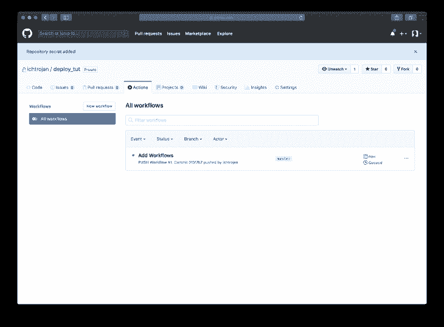

单击工作流将显示有关工作流状态的更多详细信息，如下所示:

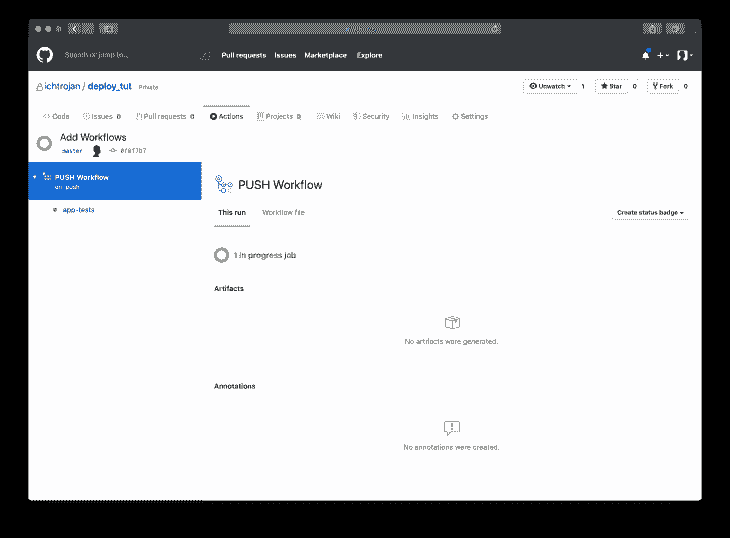

The process will run in stages as defined in the workflow`YAML` file, with that you will see a screen like this result: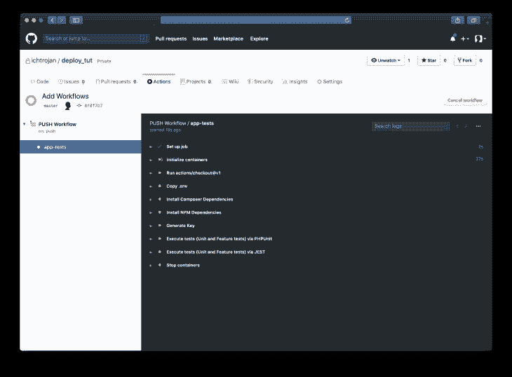

Workflow stage 1

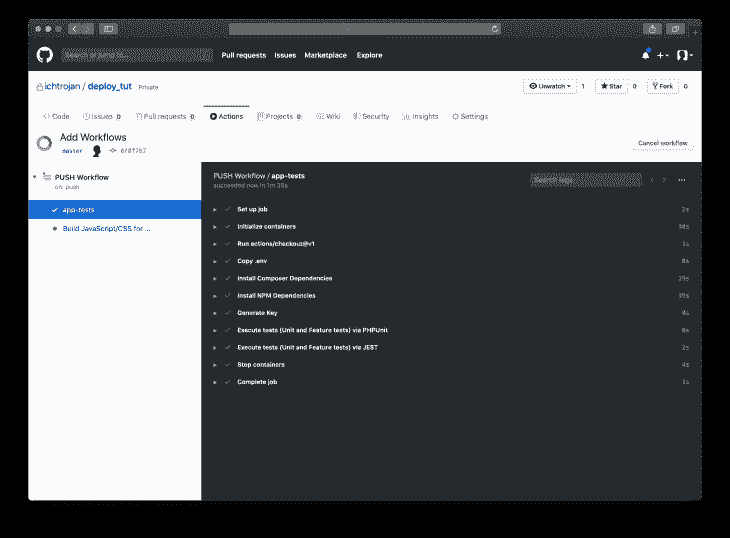

Workflow stage 2

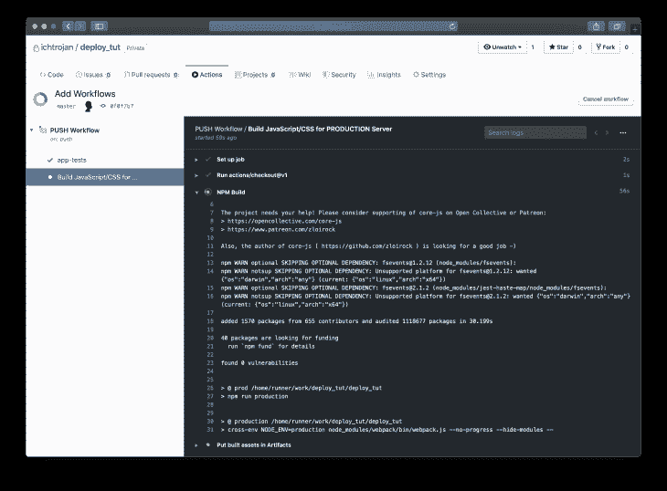

Workflow stage 3

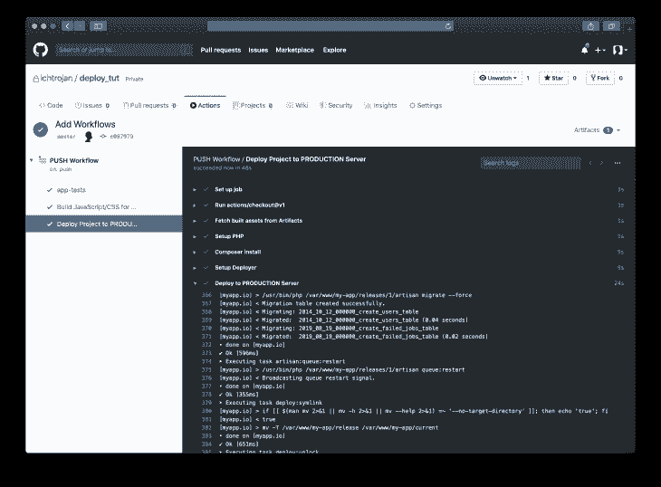

Workflow stage 4

在本文中，我们只讨论了持续集成和部署。让你的网站上线的部分(比如 Nginx 设置)不包括在内。部署的最新版本将在`{deploy_path}/current`中。其中`{deploy_path}`是在`deploy.php`内为`staging`或`production`设置的路径。如果您想对这个路径做一些额外的设置，您可以记下这个路径。

你可以在 [GitHub](https://github.com/ichtrojan/deploy_tut) 上访问这个项目的代码库。

## 结论

在本文中，您能够使用 GitHub 操作设置 CI/CD 流程。许多事情都可以建立在这个基础上，因为它形成了一个基本的设置来自动化您的新项目和现有项目的集成和部署。