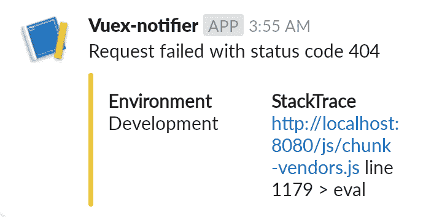
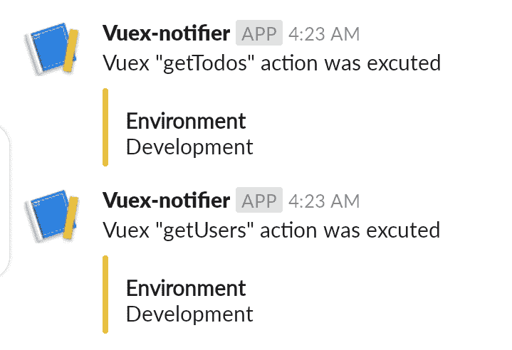

# 如何创建一个定制的 Vuex 插件日志博客

> 原文：<https://blog.logrocket.com/how-to-create-a-custom-vuex-plugin/>

Vuex 插件是 Vuex 中最先进和最有用的概念之一。他们有各种各样的用例，从数据持久性到 [Slack 通知器](https://github.com/Kaperskyguru/vuex-slack-notifier)，再到增强 Vuex 本身。

Vuex 插件只是一个接收商店作为唯一参数的函数。简单来说，插件就是在 Vuex 中调用某种类型的突变或动作时触发/调用的功能。

在本教程中，我们将带你了解如何创建一个定制的 Vuex 插件。

## 订阅突变挂钩

在订阅变异钩子的时候，记住插件是不允许直接变异状态的。它们只能通过 Vuex 突变来引发变化。

突变挂钩公开了两个属性:

1.  `mutation.type`用于确定被触发的突变/动作的名称
2.  `mutation.payload`用于检索要提交的数据

    ```
    export default (store) => { store.subscribe((mutation) => { if (mutation.type === "STORE_ERRORS") { // Alert Slack here console.log(mutation.type, mutation.payload) } }); };
    ```

## 订阅动作挂钩

除了向`type`和`payload`发送关于被调用的 Vuex 动作的信息，而不是变异信息之外，`subscribeAction()`的工作方式与`subscribe()`完全相同。

```
  store.subscribeAction((action) => {
    if (action.type === "getTodos") {
      // Alert Slack here
      console.log(action.type, action.payload)
    }
  });

```

Vuex 3.1.0 中增加了`subscribeAction`。如果你还没有，你可能想升级它。

## 构建松弛通知器 Vuex 插件

让我们结合目前所学的知识来构建一个定制的 Vuex 插件，它将在提交状态时通知 Slack 通道任何错误。

### 创建`plugin`类

在`plugins`文件夹中创建一个文件

```
mkdir plugins

touch SlackNotifier.js
```

### 创造`STORE_ERRORS`突变

接下来，我们将创建一个名为`STORE_ERRORS`的 Vuex 变异。您可以实现这种 Vuex 变异来存储状态中的错误，或者使用各种包(如 sweetalert)来显示错误警报。

在我们的例子中，我们将简单地把错误发送给我们的`ErrorService`来处理并在我们的组件上显示它们。

```
  mutations: {
    // ....

    STORE_ERRORS: (state, error) => {
      // Call Error Service here
      ErrorService.onError(error);

      // Store error to state(optional)
      if (error.response) {
        state.errors = error.response;
      }
    },

    // ...
  },

```

每当这个 Vuex 突变被调用时，我们希望我们的 Vuex 插件触发并发送错误到 Slack。

## 建筑`SlackNotifier`

打开你的`SlackNotifier`类并粘贴下面的代码。请记住修改您的代码，以适应您想要观察的 Vuex 突变和动作的类型。在我们的例子中，是`STORE_ERRORS`突变和我们所有的 Vuex 动作(你可能想也可能不想这么做)。

```
import axios from "axios";
const url = // Your Slack Webhook here;
export default (store) => {
  store.subscribe((mutation) => {
    if (mutation.type === "STORE_ERRORS") {
      // Alert Slack here
      errorSlackAlert(mutation.payload);
    }
  });
  store.subscribeAction((action) => {
    // Alert Slack here
    vuexActionSlackAlert(action.type);
  });
};
function vuexActionSlackAlert(type) {
  const data = {
    username: "Action Notifier",
    icon_emoji: ":bangbang:",
  };
  data.text = `Vuex "${type}" action was excuted`;
  data.attachments = [];
  data.attachments = [
    {
      color: "#eed140",
      fields: [
        {
          title: "Environment",
          value: "Development",
          short: true,
        },
      ],
    },
  ];
  postToSlack(data);
}
function errorSlackAlert(payload) {
  const data = {
    username: "Error Notifier",
    icon_emoji: ":bangbang:",
  };
  data.text = payload.message;
  if (payload.resource) {
    data.text = payload.resource.message;
  }
  data.attachments = [];
  data.attachments = [
    {
      color: "#eed140",
      fields: [
        {
          title: "Environment",
          value: "Development",
          short: true,
        },
        {
          title: "StackTrace",
          value: payload.fileName,
          short: true,
        },
      ],
    },
  ];
  postToSlack(data);
}
function postToSlack(message) {
  axios
    .post(url, JSON.stringify(message))
    .then((result) => console.log(result))
    .catch((error) => console.log(error));
}

```

阅读[官方文档](https://api.slack.com/messaging/webhooks)了解更多关于 Slack API 的信息。

让我们接触到所有的 Vuex 突变。每当调用或执行变异时，检查以确保调用的变异类型与`STORE_ERRORS`匹配。如果是的话，调用`errorSlackAlert`来传递`payload`，它会根据 Slack 的要求格式化消息。然后，调用`postToSlack`将消息发布到 Slack webhook。



同样的事情也发生在`store.subscribeAction(…….)`上，除了这次我们不检查任何特定类型的 Vuex 动作，而是通知 Slack 任何被触发的动作。



## 结论

如果你已经做到这一步，你应该对 Vuex 中的插件有更深的理解。你还应该拥有构建自己的定制 Vuex 插件所需的经验和知识。

如果你想为 Github 上的 [Vuex Slack 通知程序做贡献，](https://github.com/Kaperskyguru/vuex-slack-notifier)发送一个 PR😎

## 像用户一样体验您的 Vue 应用

调试 Vue.js 应用程序可能会很困难，尤其是当用户会话期间有几十个(如果不是几百个)突变时。如果您对监视和跟踪生产中所有用户的 Vue 突变感兴趣，

[try LogRocket](https://lp.logrocket.com/blg/vue-signup)

.

[](https://lp.logrocket.com/blg/vue-signup)[https://logrocket.com/signup/](https://lp.logrocket.com/blg/vue-signup)

LogRocket 就像是网络和移动应用程序的 DVR，记录你的 Vue 应用程序中发生的一切，包括网络请求、JavaScript 错误、性能问题等等。您可以汇总并报告问题发生时应用程序的状态，而不是猜测问题发生的原因。

LogRocket Vuex 插件将 Vuex 突变记录到 LogRocket 控制台，为您提供导致错误的环境，以及出现问题时应用程序的状态。

现代化您调试 Vue 应用的方式- [开始免费监控](https://lp.logrocket.com/blg/vue-signup)。