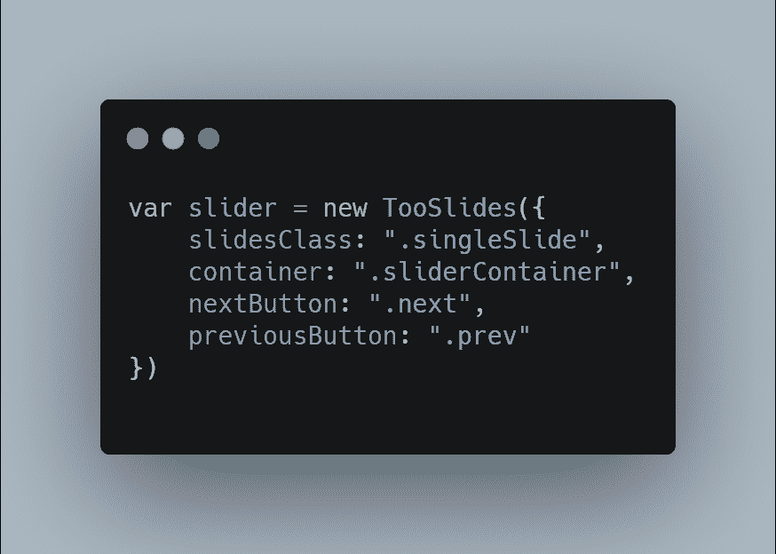
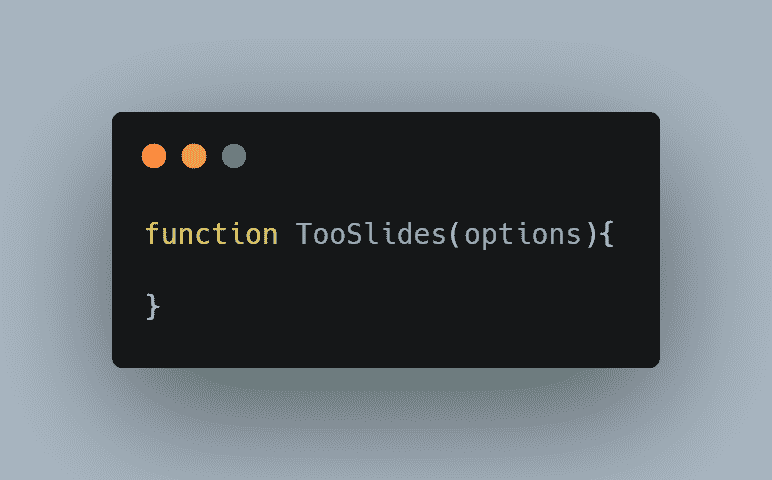
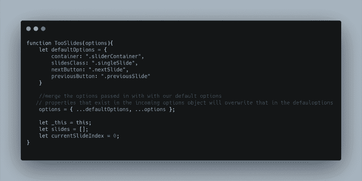
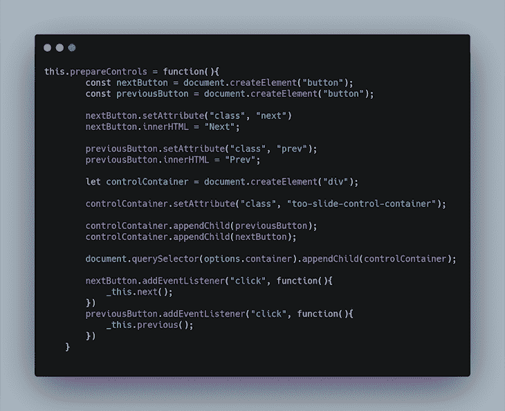
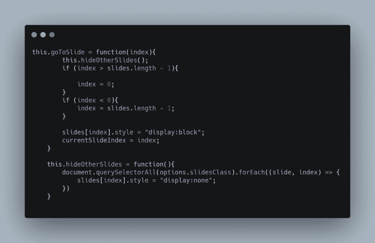
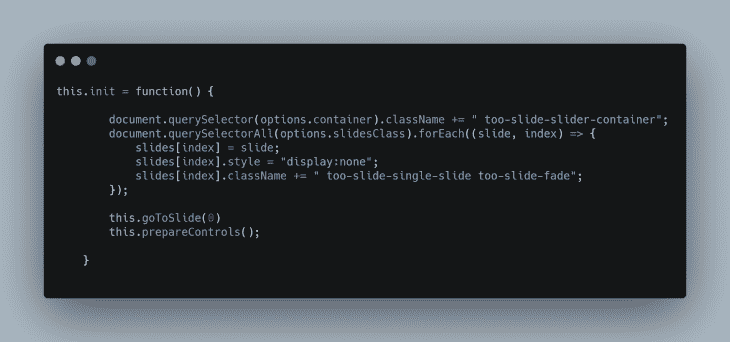
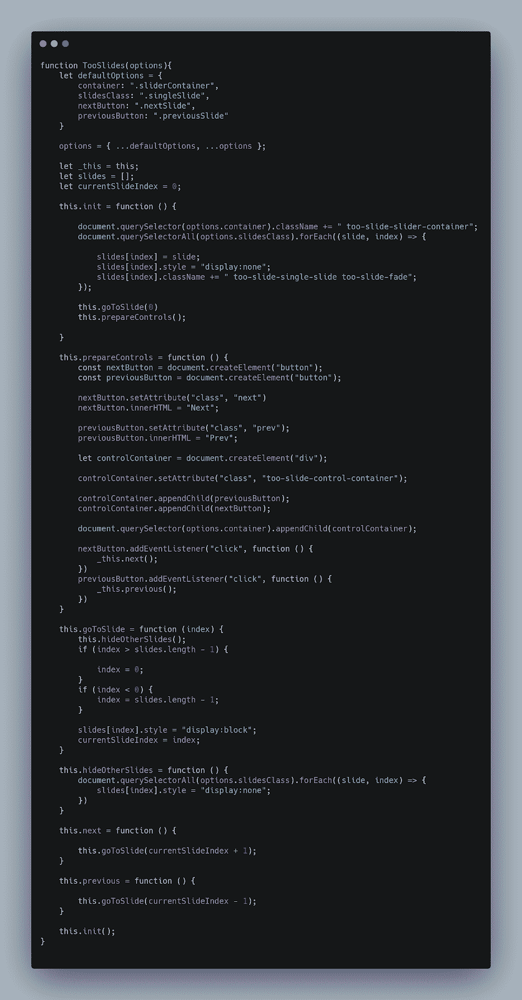
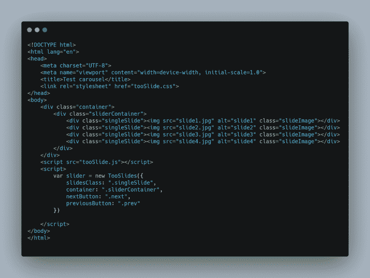
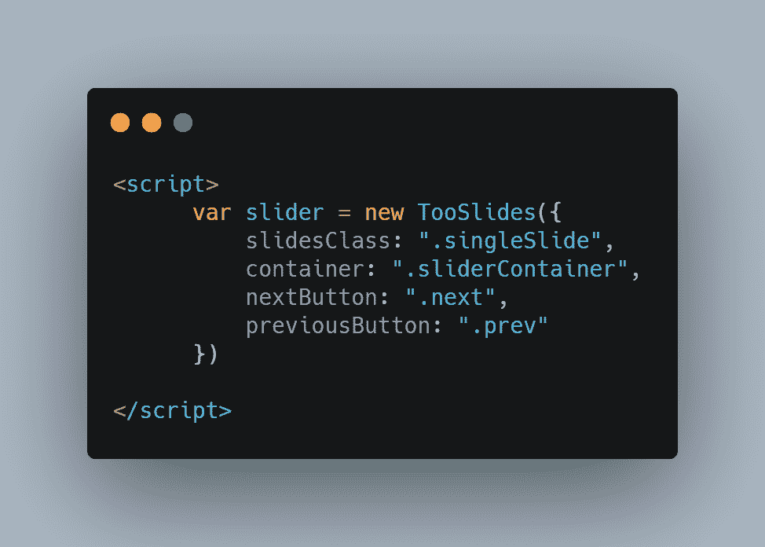
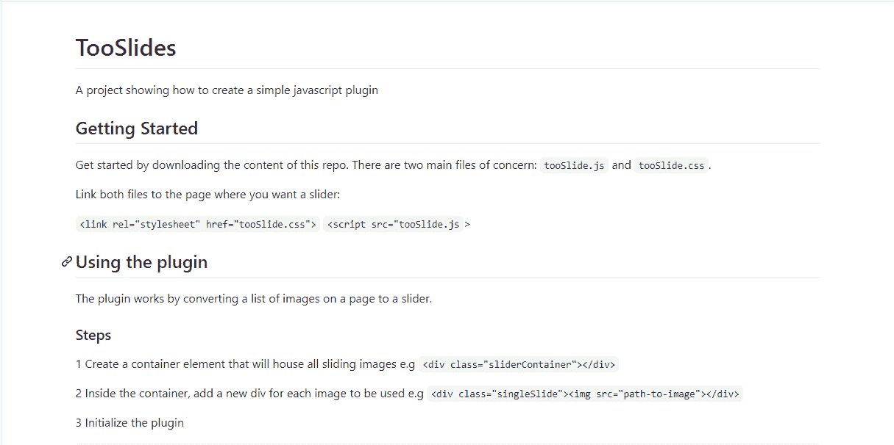

# 如何创建一个框架无关的 JavaScript 插件日志博客

> 原文：<https://blog.logrocket.com/how-to-create-a-framework-agnostic-javascript-plugin/>

## 介绍

JavaScript 中的插件允许我们扩展语言来实现一些我们想要的强大(或不那么强大)的特性。插件/库本质上是打包的代码，让我们不用一遍又一遍地写同样的东西(特性)。

只要插上电源，就可以玩了！

JavaScript 生态系统中有数百个框架，每个框架都为我们提供了一个创建插件的系统，以便为框架添加新的东西。

如果你看一下 npm 注册中心，几乎所有的 JavaScript 插件都在那里发布，你会看到超过一百万个插件作为简单的库和框架发布。

为每个框架创建插件的方式可能会有很大的不同。例如，Vue.js 有自己的插件系统，与你为 React 创建插件的方式不同。然而，这一切都归结为相同的 JavaScript 代码。

因此，能够用普通的 JavaScript 创建插件使您能够创建一个不管框架如何都可以工作的插件。

### 建造图书馆时要记住什么

*   你应该为你的插件设定一个目标——这是你的插件想要达到的关键目标
*   你的插件应该易于使用
*   你的插件应该在很大程度上是可定制的
*   你的插件应该有一个文档来指导将要使用插件的开发者

现在，让我们言归正传，牢记以上几点。

## 我们将创造什么

在这篇文章中，我将向你展示如何创建一个框架无关的插件。出于本教程的目的，我们将创建一个转盘/滑块插件——插件的目标。

这个插件将公开一些方法，插件的用户可以调用这些方法`.next()`和`.prev()`

## 入门指南

*   让我们创建一个新文件夹来存放我们的插件代码和任何其他必要的文件。我将调用我的文件夹`TooSlidePlugin.`
*   在这个文件夹中，用您喜欢的编辑器创建一个新的 JavaScript 文件。这个文件将包含插件的代码。我会叫我的`tooSlide.js`

有时候，在我开始创建插件之前，我喜欢想象插件会被如何使用(从最终开发者的角度)。



如果您查看上面的代码块，它假设有一个名为`TooSlides`的构造函数，它接收一个具有特定属性的对象作为参数。

对象的属性为`slidesClass`、`container`、`nextButton`和`previousButton`。这些是我们希望用户能够定制的属性。

我们首先将插件创建为一个单独的构造函数，这样它就有了自己的名称空间。



### 选择

因为我们的插件`TooSlides`需要一个选项参数，所以我们将定义一些默认属性，这样如果我们的用户没有指定他们自己的属性，就会使用默认属性。



我们创建了一个`defaultOptions`对象来保存一些属性，我们还使用了一个 JavaScript spread 操作符来合并输入选项和默认选项。

我们将`this`赋给了另一个变量，这样我们仍然可以在内部函数中访问它。

我们还创建了两个变量`slides`，它将保存我们想要用作 slider 的所有图像，以及`currentSlideIndex`，它保存当前正在显示的幻灯片的索引。

接下来，由于我们的滑块应该有一些控件，可以用来向前和向后移动滑块，我们将在我们的构造函数中添加下面的方法:



在`.prepareControls()`方法中，我们创建了一个容器 DOM 元素来保存控件按钮。我们创建了下一个和上一个按钮，并将它们附加到`controlContainer`中。

然后我们将事件监听器附加到两个按钮上，这两个按钮分别调用`.next()`和`.previous()`方法。不要担心，我们很快就会创建这些方法。

接下来，我们将添加两个方法:`.goToSlide()`和`.hideOtherSlides()`。



`.goToSlide()`方法接受一个参数`index`，它是我们想要显示的幻灯片的索引。该方法首先隐藏当前正在显示的任何幻灯片，然后只显示我们想要显示的幻灯片。

接下来，我们将添加`.next()`和`.previous()`辅助方法，分别帮助我们前进一步或后退一步(还记得我们之前附加的事件侦听器吗？)


这两个方法基本上都是调用`.goToSlide()`方法，将`currentSlideIndex`移动 1。

我们现在还将创建一个`.init()`方法，它将帮助我们在构造函数被实例化时进行设置



如您所见，`.init()`方法获取所有幻灯片图像，并将它们存储在我们之前声明的幻灯片数组中，并在默认情况下隐藏它们。

然后，它通过调用`.goToSlide(0)`方法显示幻灯片中的第一幅图像，并通过调用`.prepareControls()`设置我们的控制按钮。

为了结束我们的构造函数代码，我们将在构造函数中调用`.init()`方法，这样每当初始化构造函数时，总是会调用`.init()`方法。

最终的代码将如下所示:



## 添加 CSS

在存放插件项目的文件夹中，我们将添加一个 CSS 文件，其中包含滑块的基本样式。我将这个文件称为`tooSlide.css`:

```
* {box-sizing: border-box}

body {font-family: Verdana, sans-serif; margin:0}
.too-slide-single-slide {
    display: none; 
    max-height: 100%;
    width: 100%; 

}

.too-slide-single-slide img{
    height: 100%;
    width: 100%;
}
img {vertical-align: middle;}

/* Slideshow container */
.too-slide-slider-container {
    width: 100%;
    max-width: 100%;
    position: relative;
    margin: auto;
    height: 400px;
}

.prev, .next {
  cursor: pointer;
  position: absolute;
  top: 50%;
  width: auto;
  padding: 10px;
  margin-right: 5px;
  margin-left: 5px;
  margin-top: -22px;
  color: white;
  font-weight: bold;
  font-size: 18px;
  transition: 0.6s ease;
  border-radius: 0 3px 3px 0;
  user-select: none;
  border-style: unset;
  background-color: blue;
}

.next {
  right: 0;
  border-radius: 3px 0 0 3px;
}

.prev:hover, .next:hover {
  background-color: rgba(0,0,0,0.8);
}

.too-slide-fade {
  -webkit-animation-name: too-slide-fade;
  -webkit-animation-duration: 1.5s;
  animation-name: too-slide-fade;
  animation-duration: 1.5s;
}

@-webkit-keyframes too-slide-fade {
  from {opacity: .4} 
  to {opacity: 1}
}

@keyframes too-slide-fade {
  from {opacity: .4} 
  to {opacity: 1}
}

/* On smaller screens, decrease text size */
@media only screen and (max-width: 300px) {
  .prev, .next,.text {font-size: 11px}
}
```

## 测试我们的插件

为了测试我们的插件，我们将创建一个 HTML 文件。我叫我的`index.html`。我们还将添加 4 张图片作为幻灯片，它们都与我们的插件 JavaScript 代码在同一个目录中。

我的 HTML 文件如下所示:



在 HTML 文件的头部分，我调用了`tooSlide.css`文件，而在文件的末尾，我调用了`tooSlide.js`文件。

这样做之后，我们将能够实例化我们的插件构造函数:



你可以在这支笔中查看我们插件的结果:

> 没有描述

记录你的插件

### 你插件的文档和其他部分一样重要。

文档是你如何教人们使用你的插件。因此，它需要你投入一些思考。

对于我们新创建的插件，我将首先在项目的目录中创建一个自述文件。



发布您的插件:

### 写完你的插件后，你很可能希望其他开发者从你的新作品中受益，所以我将向你展示如何做。

您可以通过两种主要方式让其他人使用您的插件:

在 GitHub 上托管。当你这样做时，任何人都可以下载回购，包括文件。js 和。css)，然后马上使用你的插件

*   发布在 npm 上。查看官方 npm 文档来指导你。
*   仅此而已。

结论

## 在这篇文章的过程中，我们构建了一个插件，它只做一件事:幻灯片图像。它也是无依赖性的。现在，我们可以开始用我们的代码帮助其他人，就像我们已经被帮助一样。

这个插件教程的代码是 GitHub 上的[。](https://github.com/sdkcodes/TooSlide-tutorial)

通过理解上下文，更容易地调试 JavaScript 错误

## 调试代码总是一项单调乏味的任务。但是你越了解自己的错误，就越容易改正。

LogRocket 让你以新的独特的方式理解这些错误。我们的前端监控解决方案跟踪用户与您的 JavaScript 前端的互动，让您能够准确找出导致错误的用户行为。

LogRocket 记录控制台日志、页面加载时间、堆栈跟踪、慢速网络请求/响应(带有标题+正文)、浏览器元数据和自定义日志。理解您的 JavaScript 代码的影响从来没有这么简单过！

[](https://lp.logrocket.com/blg/javascript-signup)

.

[Try it for free](https://lp.logrocket.com/blg/javascript-signup)

.