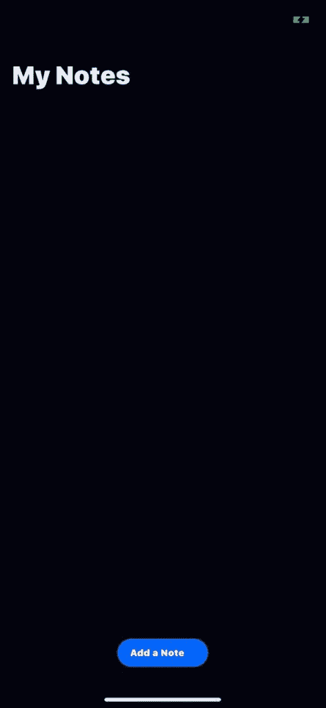
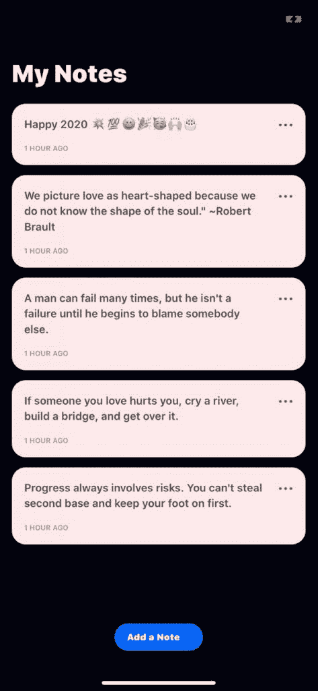
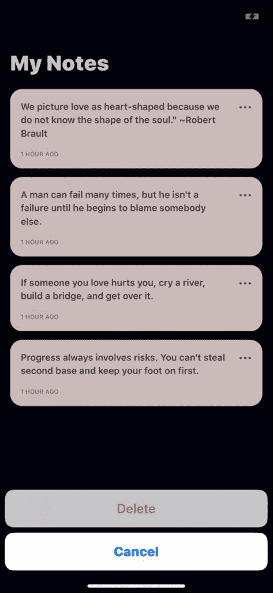
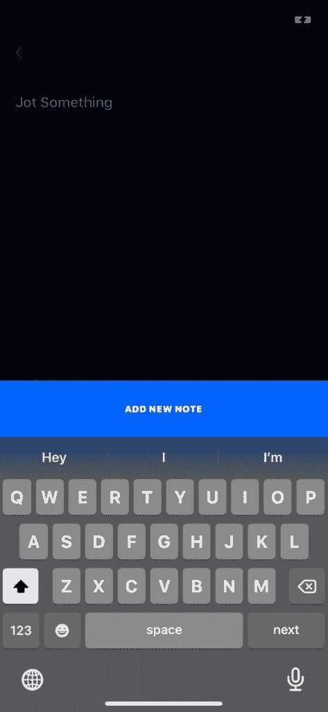

# 如何用 PostgreSQL 和 GraphQL 创建 React 本地应用程序:第 2 部分

> 原文：<https://blog.logrocket.com/how-to-create-a-react-native-app-with-postgresql-and-graphql-part-2/>

在[上一篇文章](https://blog.logrocket.com/create-a-react-native-app-with-postgresql-and-graphql-part-1/)中，我们用 NodeJS 和 Express 创建了一个 GraphQL 服务器。现在，我们将使用 React 本地移动应用程序来消费我们创建的服务器中的端点。React Native 允许我们开发可以在 iOS 和 Android 设备上运行的应用程序。我们将利用[博览会](https://expo.io)来启动我们的应用程序，这也将使我们能够快速构建和部署我们的应用程序。

借助 Expo，我们还可以在移动设备或网络浏览器上运行我们的应用程序。在我们开始之前，需要在全球范围内安装 Expo，为此，运行:

```
npm install expo-cli --global
```

现在你已经准备好开始了。

## 设置应用程序

要创建应用程序，请运行以下命令:

```
expo init apollo-react-native-app
```

这将生成一个示例应用程序，您可以在自己的智能手机上通过 Expo 应用程序访问它，而无需安装它。要做到这一点，你需要从 iOS 版的[苹果应用商店](https://apps.apple.com/app/apple-store/id982107779)或安卓版的[谷歌游戏商店](https://play.google.com/store/apps/details?id=host.exp.exponent&referrer=www)下载应用。

通过在终端中从项目的根目录运行`expo start`来启动应用程序，它会向您显示一个二维码，您可以在 Expo 应用程序中扫描该二维码，并查看 React 原生应用程序的实例。很漂亮，对吧？

现在我们已经为我们的应用程序设置了准系统，让我们通过配置我们的 Apollo 客户机把它连接到 GraphQL。

## 配置 Apollo 客户端和基础应用程序

React 的 [Apollo 客户端是一个完整的状态管理库，它将负责请求、缓存和管理 GraphQL 服务器提供的数据，就像我们在](https://www.apollographql.com/docs/react/)[第 1 部分](https://blog.logrocket.com/create-a-react-native-app-with-postgresql-and-graphql-part-1/)中构建的一样。我们将在应用程序的入口点`App.js`设置客户端。但是首先，我们需要通过运行下面的命令来安装必要的依赖项:

```
npm install apollo-client apollo-cache-inmemory apollo-link-http react-apollo --save
```

### 这些包是做什么的？

*   `apollo-client` —如上所述，这负责与服务器的任何数据交换以及状态管理和缓存
*   `apollo-cache-inmemory` —从 [Apollo Client 2.0](https://www.apollographql.com/docs/react/caching/cache-configuration/) 开始，缓存功能被抽象到`apollo-cache-inmemory`以利用缓存功能，而无需依赖 Redux
*   `apollo-link-http` —处理网络请求，如获取和发送数据
*   `react-apollo` —将提供一个`ApolloProvider`，它将包装应用程序并负责状态管理，类似于 React 的上下文 API

现在我们已经了解了应用程序中每个部分的作用，让我们开始设置。在`App.js`中，导入这些依赖项并如下设置您的客户端:

```
import * as React from "react";
import { Platform, StatusBar, StyleSheet, View } from "react-native";

import { AppLoading } from "expo";

import { Asset } from "expo-asset";
import * as Font from "expo-font";

import { InMemoryCache } from "apollo-cache-inmemory";
import { ApolloClient } from "apollo-client";
import { HttpLink } from "apollo-link-http";
import { ApolloProvider } from "react-apollo";

import AppNavigator from "./navigation/AppNavigator";

//Define your client for your ApolloProvider connecting to your graphql server.
const client = new ApolloClient({
  // initialize cache
  cache: new InMemoryCache(),
  //Assign your link with a new instance of a HttpLink linking to your graphql server
  link: new HttpLink({
    uri: "https://graphql-server-node-js-103.herokuapp.com/graphql"
  })
});

const styles = StyleSheet.create({
  container: {
    flex: 1
  }
});

export default class App extends React.Component {
  state = {
    isLoadingComplete: false
  };

  loadResourcesAsync = async () => {
    await Promise.all([
      Asset.loadAsync([
        // load assets here
      ]),
      Font.loadAsync({
        // load fonts here
      })
    ]);
  };

  handleLoadingError = () => {
    // Any error handling can be done here
  };

  handleFinishLoading = () => {
    this.setState({ isLoadingComplete: true });
  };

  render() {
    const { isLoadingComplete } = this.state;
    const { skipLoadingScreen } = this.props;
    if (!isLoadingComplete && !skipLoadingScreen) {
      return (
        <AppLoading
          startAsync={this.loadResourcesAsync}
          onError={this.handleLoadingError}
          onFinish={this.handleFinishLoading}
        />
      );
    }
    return (
      <ApolloProvider client={client}>
        <View style={styles.container}>
          <AppNavigator />
        </View>
      </ApolloProvider>
    );
  }
}
```

在上面的客户端配置中，我们的`ApolloClient`有两个参数，`cache`是来自`apollo-cache-inmemory`的`inMemoryCache`的一个实例，它处理数据缓存以加速应用程序，而`apollo-link-http`的`link`是一个终止链接，它通过 HTTP 连接从 GraphQL 端点获取 GraphQL 结果。出于本文的目的，我们将它链接到我们后端服务器的一个已部署实例，但是如果您愿意，可以随意地用您自己的本地运行服务器替换它。

客户端配置然后通过`ApolloProvider`高阶组件作为`client`道具传递给应用程序，允许应用程序获得我们上面设置的所有功能。

另外一个组件`AppLoading`也是从 Expo 中导入的，它是一个 React 组件，告诉 Expo 如果它是应用程序中第一个也是唯一一个呈现的组件，就保持应用程序加载屏幕打开。该组件允许应用程序在启动之前加载应用程序所需的任何资产，这创造了更好的用户体验。

在我们的例子中需要三个道具:

*   `startAsync (*func*)`–返回`Promise`的`function`，当应用程序加载完所需的数据和资产时，`Promise`应该会解析
*   `onError (*func*)`–如果`startAsync`抛出一个错误，它被捕获并传递到提供给`onError`的函数中
*   `onFinish (*func*)`–当`startAsync`决定或拒绝时调用。这应该用于设置状态和卸载`AppLoading`组件

您可能已经注意到了上面代码中的一些额外设置，不要担心，我们很快会详细介绍每个部分的作用。

## 创造我们的航海家

我们在上面的设置中有一个`AppNavigator`组件，它负责在我们的应用程序中使用`[react-navigation](https://reactnavigation.org/en/)`进行路由。这是我们接下来要设置的。

为此，我们需要首先安装一些依赖项:

```
npm install react-navigation react-navigation-transistions
```

这两个包一起工作，让我们的应用程序可以在屏幕之间平滑过渡，`react-navigation`处理路由和导航，而`react-navigation-transitions`允许我们在屏幕之间创建自定义过渡。

在项目的根目录下创建一个`navigation`文件夹，并在其中创建三个文件`AppNavigator.js`、`MainTabNavigator.js`和`styles.js`。

就像之前一样，我们首先声明我们的风格:

```
//styled.js
import styled from "styled-components/native";

const MenuStyle = {
  backgroundColor: "#fcfaf7",
  borderBottomWidth: 0,
  elevation: 0
};

const IconStyle = styled.Image`
  height: 24;
  width: 24;
`;

export { MenuStyle, IconStyle };
```

接下来，我们使用来自`react-navigation`的`createStackNavigator`来为你的应用程序提供一种在屏幕之间转换的方法，其中每个新屏幕都放在堆栈的顶部。

它有两个参数，第一个是包含我们的路线配置(`routeConfig`)的对象，第二个是导航器配置(`StackNavigatorConfig`):

```
//MainTabNavigator.js
import React from "react";
import { createStackNavigator } from "react-navigation";
import { fromBottom } from "react-navigation-transitions";
import { TouchableOpacity, View } from "react-native";

import HomeScreen from "../screens/HomeScreen";
import AddNoteScreen from "../screens/AddNoteScreen";
import { Images } from "../constants";
import { MenuStyle, IconStyle } from "./styled";

//Assign your goback navigator to variable call goBackHeader
const goBackHeader = goBack => (
  <TouchableOpacity
    activeOpacity={1}
    style={{ paddingHorizontal: 20 }}
    onPress={() => goBack()}
  >
    <View>
      <IconStyle source={Images.back} style={{ height: 15, width: 9 }} />
    </View>
  </TouchableOpacity>
);

const HomeStack = createStackNavigator(
  {
    Home: {
      screen: HomeScreen,
      navigationOptions: ({ navigation: { goBack } }) => ({
        headerStyle: MenuStyle
      })
    },
    NewNote: {
      screen: AddNoteScreen,
      navigationOptions: ({ navigation: { goBack } }) => ({
        headerStyle: MenuStyle,
        headerLeft: () => goBackHeader(goBack)
      })
    }
  },
  {
    transitionConfig: ({ scenes }) => {
      const nextScene = scenes[scenes.length - 1];
      if (nextScene.route.routeName === "NewNote") return fromBottom(550);
    }
  }
);

export default HomeStack;
```

对于我们的`routeConfig`，我们有两个屏幕`Home`和`NewNote`，我们将很快创建它们。每个屏幕都被声明为一个对象，其中包含`screen`和`navigationOptions`。在这种情况下，`screen`映射到要为该屏幕呈现的 React 组件上，而`navigationOptions`可用于将多个[选项](https://reactnavigation.org/docs/en/stack-navigator.html#navigationoptions-for-screens-inside-of-the-navigator)传递给每个组件。

我们已经通过了以下两个选项，它们是:

*   `headerLeft`–返回 React 元素并显示在表头左侧的函数。当一个函数被使用时，它在呈现时会接收到许多参数(`onPress`、`title`、`titleStyle`等等)
*   `headerStyle`–页眉的样式对象

在`NewNote`屏幕上，我们传递了`headerStyle`和`headerLeft`，在那里我们映射了一个使用`goBackHeader`函数声明的后退按钮组件。这个组件采用了一个`goBack`道具，它是我们从 react-navigation 的`navigate`道具中解构出来的。`goBack`是关闭活动屏幕并在堆栈中向后移动的功能，类似于浏览器上的后退按钮。

我们的`StackNavigatorConfig`只是一个包含`transitionConfig`的对象，我们用它来创建一个定制的过渡，使我们的新屏幕从下向上而不是水平(默认)进入视图。

然后，我们将我们的`HomeStack`传递给`createSwitchNavigator`，并将其传递给`createAppContainer`来创建一个应用程序容器，它将帮助您将顶级导航器链接到应用程序环境。`SwitchNavigator`的目的是一次只显示一个屏幕。

```
//AppNavigator.js
import React from 'react';
import { createAppContainer, createSwitchNavigator } from 'react-navigation';

import MainTabNavigator from './MainTabNavigator';

export default createAppContainer(
  createSwitchNavigator({
    Main: MainTabNavigator,
  })
);
```

你可以在[反应导航文档](https://reactnavigation.org/docs/en/getting-started.html)中读到更多关于`createSwitchNavigator`和`createStackNavigator`的信息。

## 创建组件

我们的应用程序将有几个可重用的组件，这些组件将组成它的各种屏幕，这就是我们在使用 React Native 时引用页面的方式。因此，在构建应用程序的各种屏幕之前，我们会先构建这些组件。

在我们的例子中，我们有四个主要组件将在我们的应用程序中重用，`Button`、`Card`、`TextInput`和`KeyboardWrapper`。在项目的根目录下创建一个`components`文件夹，并在其中为每个组件创建一个文件夹。

我们还有一些资产和常量，将在整个应用程序中使用。资产主要是字体和图像。运行`mkdir assets`在项目根目录下创建一个`assets`文件夹，并将[这个文件夹](https://github.com/jimmykimani/GraphQL-Server-Tutorial-with-Apollo-and-React-Native/tree/setup/apollo-react-native/assets)的内容复制到其中。您现在可以导入它们以在应用程序中使用。

也创建一个`constants`文件夹，它将保存我们在应用程序中可能用到的任何常量变量，并有助于方便参考。

在 constants 文件夹中创建一个`Colors.js`文件，这个文件将保存我们在应用程序中使用的颜色，看起来像这样:

```
const white = "#ffffff";
const darkGray = "#595A5A";
const orange = "#FFA500";
const mediumGray = "#9B9B9B";
const strokeGray = "#E6E6E6";

export { orange, darkGray, white, mediumGray, strokeGray };
```

在 constants 文件夹中，创建一个`Images.js`并添加以下代码:

```
const Images = {
  more: require("../assets/images/more.png"),
  back: require("../assets/images/back.png"),
  menu: require("../assets/images/menu.png")
};
export default Images;
```

这使得导入图像以供使用变得更加容易。

我们还将有一个`Layout.js`文件，我们将在其中设置应用程序的基本布局。

```
import { Dimensions } from 'react-native';

const width = Dimensions.get('window').width;
const height = Dimensions.get('window').height;

export default {
  window: {
    width,
    height,
  },
  isSmallDevice: width < 375,
};
```

通过从目录中的一个`index.js`文件导出声明的常量，可以使从`constants`目录导入变得更加容易。以下是你如何利用这些图像来做到这一点:

```
import Images from "./Images";
export { Images };
```

既然我们已经建立了主要的资源，让我们开始创建我们将要重用的单独的组件。

## 纽扣

让我们创建我们的第一个组件，一个`Button`组件，在`Button`目录中创建两个文件`index.js`和`styled.js`。在`styled.js`中放置以下代码，它将使用[样式组件](https://www.styled-components.com/)处理`Button`组件的基本样式:

```
import styled from "styled-components/native";
const white = "#FFFFFF";

const baseButtonStyles = `
  letter-spacing: 0.5px;
  font-size: 12px;
  color: ${white}
`;

const ButtonStyle = `
  ${baseButtonStyles}
  background-color:#4A4A4A;
    color: ${white}
`;

const StyledButton = styled.TouchableOpacity`
  ${ButtonStyle}
  align-items: center;
`;

const StyledButtonText = styled.Text`
  color: ${white};
  line-height: 19px;
`;

const ButtonText = styled.Text`
  font-family: WorkSans-SemiBold;
  color: ${white};
  line-height: 19px;
  justify-content: center;
  align-items: center;
`;

export { ButtonText, StyledButtonText, StyledButton };
```

现在在`index.js`中添加以下内容:

```
import React from "react";
import { ifIphoneX } from "react-native-iphone-x-helper";

import { StyledButtonText, StyledButton } from "./styled";

const Button = props => {
  const { title, ...rest } = props;
  return (
    <StyledButton
      activeOpacity={0.7}
      color={"#4A4A4A"}
      underlayColor={"#4A4A4A"}
      {...rest}
    >
      <StyledButtonText
        style={{
          ...ifIphoneX(
            {
              paddingTop: 27,
              paddingBottom: 50
            },
            {
              paddingTop: 27,
              paddingBottom: 26
            }
          )
        }}
      >
        {title.toUpperCase()}
      </StyledButtonText>
    </StyledButton>
  );
};

export default Button;
```

我们导入在`styled.js`中声明的样式化组件，并用它们来创建我们的按钮。你还会注意到我们已经从[react-native-iPhone-X-helper](https://github.com/ptelad/react-native-iphone-x-helper)导入了`ifIphoneX`，这有助于我们解释 iPhone X、XS、XS Max & XR 的布局差异。这种方法允许我们在考虑 iPhone X 的情况下创建样式表。接受两个参数，第一个是 iPhone X 上的样式，第二个是常规样式，并相应地应用它们。

## 卡片

接下来，我们将创建我们的`Card`组件，这将是我们的主要显示组件，我们将使用卡片来显示每个笔记。正如我们对按钮所做的一样，我们将首先在一个`styled.js`中创建我们的样式化组件:

```
import styled from "styled-components/native";
import {
  strokeGray,
  darkGray,
  white,
  mediumGray
} from "../../constants/Colors";

const CardContainer = styled.View`
  background-color: #d8d8d8;
  border-style: solid;
  width: 100%;
  padding: 16px 16px 16px 16px;
  text-align: center;
  border-radius: 9px;
  margin-bottom: 20px;
`;

const TimestampContainer = styled.Text`
  font-size: 10px;
  text-transform: uppercase;
  line-height: 12px;
  color: ${mediumGray};
  padding-top: 16px;
`;

const EditWrapper = styled.TouchableOpacity`
  margin-left: auto;
  margin-top: 5px;
`;

const EditIcon = styled.Image`
  height: 4px;
  width: 20px;
`;

const CardText = styled.Text`
  font-weight: 500;
  color: ${darkGray};
  line-height: 23px;
  font-size: 16px;
  width: 90%;
`;

const HeaderContainer = styled.View`
  display: flex;
  flex-direction: row;
`;

export {
  CardContainer,
  TimestampContainer,
  EditWrapper,
  EditIcon,
  CardText,
  HeaderContainer
};

```

然后我们将它们导入到`index.js`中，就像我们对按钮所做的那样:

```
import React from "react";
import PropTypes from "prop-types";
import { Images } from "../../constants";

import {
  CardContainer,
  TimestampContainer,
  EditWrapper,
  EditIcon,
  CardText,
  HeaderContainer
} from "./styled";

const NoteCard = props => {
  const { onOptions, noteText } = props;
  return (
    <CardContainer>
      <HeaderContainer>
        <CardText>{noteText}</CardText>
        <EditWrapper onPress={onOptions}>
          <EditIcon source={Images.more} />
        </EditWrapper>
      </HeaderContainer>
      <TimestampContainer>1 hour ago</TimestampContainer>
    </CardContainer>
  );
};
export default NoteCard;
```

## 键盘包装

该组件触发移动设备上的虚拟键盘，我们使用 React Native 的`[KeyboardAvoidingView](https://facebook.github.io/react-native/docs/keyboardavoidingview)`组件，该组件允许视图通过相应地调整其大小和位置来移动虚拟键盘:

```
import React from "react";
import { KeyboardAvoidingView, Platform } from "react-native";
import { Header } from "react-navigation";
import { ifIphoneX } from "react-native-iphone-x-helper";
import PropTypes from "prop-types";

const KeyboardWrapper = props => {
  const { children } = props;

  return (
    <KeyboardAvoidingView
      behavior={Platform.OS === "android" ? null : "padding"}
      keyboardVerticalOffset={
        ifIphoneX ? Header.HEIGHT + 1 : Header.HEIGHT + 18
      }
      style={{ flex: 1 }}
    >
      {children}
    </KeyboardAvoidingView>
  );
};

KeyboardWrapper.propTypes = {
  children: PropTypes.node.isRequired
};

export default KeyboardWrapper;
```

## TextInput 组件

这个组件正如它的名字所暗示的那样，充当我们文本的输入，并带有一个占位符。首先，让我们在`styled.js`中声明我们的风格:

```
import styled from "styled-components/native";

const BaseStyles = `

  border-width: 1px;
  border-style: solid;
  width: 100%;
  padding: 10px 16px;
`;
const InputStyles = `
  ${BaseStyles}
  font-size: 16px;
`;

const StyledTextArea = styled.TextInput`
  ${InputStyles}
  flex: 1;
  background-color: transparent;
  border-radius: 0;
  padding-left: 0px;
  border-width: 0;
  font-size: 20px;
  margin-bottom: 0;
  color: #ffffff;
  /* font-family: WorkSans-Regular; */
`;

export { StyledTextArea };
```

现在，让我们创建占位符，我们将使用样式化组件创建的`Text`元素包装在以类似方式创建的`TouchableOpacity`元素中。这允许应用程序通过拉起键盘让您键入笔记来响应您触摸占位符:

```
import React from "react";
import styled from "styled-components/native";

const chGray = "#E6E4E3";

const RowContainer = styled.TouchableOpacity`
  flex-direction: row;
  width: 100%;
  background-color: ${chGray};
  border-radius: 30px;
  width: 100%;
  margin-bottom: 24px;
  padding: 8px 16px;
`;

const StyledTextInput = styled.Text`
  /* font-family: WorkSans-Regular; */
  color: #4a4a4a;
  opacity: 0.8;
  font-size: 14px;
  line-height: 22px;
`;

const TextPlaceHolder = props => {
  const { text, onHolderPress } = props;
  return (
    <RowContainer activeOpacity={1} onPress={onHolderPress}>
      <StyledTextInput>{text}</StyledTextInput>
    </RowContainer>
  );
};

export default TextPlaceHolder;
```

现在让我们创建我们的`TextArea`组件，它是我们输入的文本将出现的地方，我们已经在`styled.js`中将它创建为`StyledTextArea`,这里我们只是将一些常量(特别是占位符文本颜色)和一些属性传递给它:

```
import React from "react";
import { mediumGray } from "../../constants/Colors";

import { StyledTextArea } from "./styled";

const TextArea = props => {
  const { ...rest } = props;
  return (
    <StyledTextArea
      keyboardAppearance="dark"
      placeholderTextColor={"#4a4a4a"}
      {...rest}
    />
  );
};

export default TextArea;
```

现在让我们导出`index.js`中的所有内容，以便更清晰地导入其他文件:

```
import TextPlaceHolder from "./Placeholder";
import TextArea from "./TextArea";

export { TextPlaceHolder, TextArea };
```

## 创建屏幕并添加 GraphQL 集成

屏幕是我们应用程序的页面，每个页面都由许多协同工作的组件组成。我们的应用程序有两个主屏幕。就像我们的组件一样，我们将首先使用 styled-components 来定义一个`styled.js`文件中的屏幕元素的样式:

```
import styled from "styled-components/native";

const Container = styled.View`
  flex: 1;
  padding: 20px;
  background-color: #fcfaf7;
`;

const NotesContainer = styled.View`
  flex: 1;
  background-color: #fcfaf7;
`;

const NotesWrapper = styled.View`
  padding: 20px;
`;

const PlaceholdeWrapper = styled.View`
  padding-top: 12px;
`;

const HeaderText = styled.Text`
  font-weight: 900;
  font-size: 36px;
  padding-bottom: 20px;
  color: #b89b72;
`;

export {
  Container,
  PlaceholdeWrapper,
  NotesContainer,
  NotesWrapper,
  HeaderText
};
```

## 主屏幕

主屏幕将是中心屏幕，我们创建的所有笔记都将在这里显示。这是我们查看和删除注释的地方，当它为空(没有添加注释)时，对于 iPhone 用户来说，它看起来像这样:



一旦添加了注释，它将看起来像这样:



在 screens 目录中，创建一个`HomeScreen.js`文件，我们将使用这个文件。

首先，让我们为屏幕导入一些组件和依赖项，并将 GraphQL `query`和`mutation`变量分别定义为`GET_NOTES`和`DELETE_NOTE`。我们这样做是为了告诉 API 我们希望返回哪些数据以供使用:

```
import React, { Component } from "react";
import {
  ScrollView,
  FlatList,
  ActivityIndicator,
  View,
  Alert
} from "react-native";
import ActionSheet from "react-native-actionsheet";
//Import the Query component from react apollo that will responsible for retrieving data from your graphql server.
import { Query, Mutation } from "react-apollo";
//import gql from graphql-tag for making queries to our graphql server.
import gql from "graphql-tag";

import { Container, PlaceholdeWrapper, HeaderText } from "./styled";
import { Button, NoteCard, TextPlaceHolder } from "../components";

//Define your query variable which is the query responsible for retrieving data
//This will query all notes
const GET_NOTES = gql`
  query {
    notes {
      id
      text
    }
  }
`;

const DELETE_NOTE = gql`
  mutation DeleteNote($id: ID!) {
    deleteNote(id: $id) {
      id
      text
    }
  }
`;
```

接下来，让我们定义我们的`HomeScreen`类组件并添加一些实用函数，它们将负责以下目的:

*   `_addNewNote` —将用户导航至`New Note`屏幕
*   `_renderItem` —呈现便笺
*   `_showEditDeleteOptions` —为给定注释选择编辑/删除选项，如下所示:



*   `_deletePostPrompt` —提示用户删除或取消删除注释
*   `_deleteNote` —提示给定音符上的 GraphQL `delete`突变

```
class HomeScreen extends Component {
  constructor(props) {
    super(props);
    this.state = {
      noteId: null
    };
  }

  _addNewNote = () => {
    const { navigation } = this.props;
    navigation.navigate("NewNote", {});
  };

  _renderItem({ item }) {
    //Return the UI
    // It will return a list of all notes
    return (
      <NoteCard
        noteText={item.text}
        onOptions={() => this._showEditDeleteOptions(item.id)}
      />
    );
  }

  _showEditDeleteOptions = async noteId => {
    await this.setState({ noteId });
    this.deleteActionSheet.show();
  };

  _deletePostPrompt = noteId => {
    Alert.alert("Delete Note ?", null, [
      {
        text: "Delete",
        onPress: () => {
          this._deleteNote({ noteId });
        }
      },
      {
        text: "Cancel",
        style: "cancel"
      }
    ]);
  };

  _deleteNote = noteId => {
    <Mutation
      mutation={DELETE_NOTE}
      update={store => {
        const storeNotes = store.readQuery({ query: GET_NOTES });
        const data = storeNotes.notes.filter(note => note.id !== noteId);
        store.writeQuery({
          query: GET_NOTES,
          data: { notes: [...data] }
        });
      }}
    >
    </Mutation>;
  };

 //render here

export default HomeScreen;
```

使用 react-apollo 的`Query`组件获取并显示注释，该组件接受一个`query`属性，该属性是我们希望从 GraphQL API 中获取的数据的描述。然后，根据获取的数据以及错误和加载状态，有条件地将 UI 呈现为其子组件。我们将把它包含在我们的渲染函数中，我们将用这个替换`//render here`注释:

```
render() {
  const { noteId } = this.state;
  return (
    <Container>
      <View>
        <ActionSheet
          ref={o => (this.deleteActionSheet = o)}
          options={["Delete", "Cancel"]}
          cancelButtonIndex={1}
          destructiveButtonIndex={0}
          onPress={index => {
            if (index === 0) this._deletePostPrompt(noteId);
          }}
        />
      </View>
      <ScrollView showsVerticalScrollIndicator={false}>
        <HeaderText>My Notes</HeaderText>
        <PlaceholdeWrapper>
          <TextPlaceHolder
            onHolderPress={() => this._addNewNote()}
            text={"Add new note"}
          />
        </PlaceholdeWrapper>
        <Query query={GET_NOTES}>
          {/* The props.children of the Query will be a callback with a response, and error parameter. */}
          {(response, error, loading) => {
            if (error) {
              return <Text style={styles.errorText}>{error}</Text>;
            }
            if (loading) {
              return <ActivityIndicator />;
            }
            //If the response is done, then will return the FlatList
            if (response) {
              //Return the FlatList if there is not an error.
              return (
                <FlatList
                  data={response.data.notes}
                  renderItem={item => this._renderItem(item)}
                />
              );
            }
          }}
        </Query>
      </ScrollView>
    </Container>
  );
}
}
```

在上面的例子中，从我们的端点获取的包含注释的任何数据都被传递到`FlatList`组件，然后该组件通过`renderItem` prop 呈现一个卡片列表。`renderItem` prop 通常是一个函数，它从一段数据中返回一个要呈现的 React 组件。

使用 react-apollo 的`Mutation`组件删除注释，该组件接受一个`mutation`属性，该属性是一个 GraphQL 文档，描述了要删除的注释的细节。它还需要一个`update`道具，这个函数更新缓存以反映删除一个注释后的变化。

## 添加 NoteScreen

`AddNote`是负责接收用户输入的屏幕，并通过将数据传递给我们的 GraphQL API 来使用它创建新的便笺。我们将在一个文件中创建它:

```
import * as WebBrowser from "expo-web-browser";
import React, { Component } from "react";
import { ScrollView } from "react-native";
//import Mutation component for performing queries.
import { Mutation } from "react-apollo";
// import gql from graphql-tag to define your graphql schema
import gql from "graphql-tag";

import { NotesContainer, NotesWrapper } from "./styled";
import { Button, TextArea, KeyboardWrapper } from "../components";

const CREATE_NOTE = gql`
  mutation CreateNote($text: String!) {
    createNewNote(text: $text) {
      id
      text
    }
  }
`;

const GET_NOTES = gql`
  query {
    notes {
      id
      text
    }
  }
`;

class AddNoteScreen extends Component {
  constructor(props) {
    super(props);
    this.state = {
      note: ""
    };
  }

  _addNote = postAction => {
    const { note } = this.state;
    const { navigation } = this.props;
    return (
      <Button
        onPress={() =>
          postAction({
            variables: { text: note }
          }).then(navigation.goBack())
        }
        title={"Add new note"}
      />
    );
  };

  render() {
    const { note } = this.state;

    return (
      <KeyboardWrapper>
        <NotesContainer>
          <ScrollView>
            <NotesWrapper>
              <TextArea
                autoFocus
                value={note}
                returnKeyType="next"
                placeholder={"Jot Something"}
                //onChangeText is basically a simplified version of onChange,
                //so you can easily use it, without the hassle of going through event.target.value to get changed value.
                onChangeText={text => this.setState({ note: text })}
              />
            </NotesWrapper>
          </ScrollView>
          <Mutation
            mutation={CREATE_NOTE}
            update={(store, { data: { createNewNote } }) => {
              const data = store.readQuery({ query: GET_NOTES });
              store.writeQuery({
                query: GET_NOTES,
                data: { notes: data.notes.concat([createNewNote]) }
              });
            }}
          >
            {(postAction, { loading, error }) => {
              return this._addNote(postAction);
            }}
          </Mutation>
        </NotesContainer>
      </KeyboardWrapper>
    );
  }
}

export default AddNoteScreen;
```

以下是在用户键入任何文本之前，带有占位符的屏幕外观:



我们的`AddNoteScreen`使用 GraphQL 的`Mutation`组件创建一个新的笔记，类似于我们删除笔记的方式。在这种情况下，`mutation`属性是一个 GraphQL 文档，包含要创建的新便笺的详细信息，它接受一个文本参数，即组成便笺内容的文本字符串。

`Mutation`也采用了一个`update`属性，类似于删除一个注释时的做法，该属性负责用新创建的注释更新缓存。

组件之间的一个主要区别是它们的子组件。`Query`将 React 节点作为其子节点，根据运行查询的结果呈现 UI。另一方面，`Mutation`有一个函数作为它的子函数，这个函数触发了我们的 GraphQL API 上的一个突变。

输入文本后，您的`NewNote`屏幕看起来是这样的:


## 结论

React Native 和 GraphQL 配合得非常好，可以创建一个优秀的移动应用程序。React Native 允许开发人员创建“一次编写，随处运行”的应用程序，因为它与 Android 和 iOS 都兼容。GraphQL 允许应用程序只获取它们需要的特定信息，从而使它们更加高效。总的来说，这两种技术是构建移动应用程序时要考虑的很好的选择。您可以利用本文提供的信息，尝试为我们构建的应用程序创建一个编辑特性。

## 使用 LogRocket 消除传统反应错误报告的噪音

[LogRocket](https://lp.logrocket.com/blg/react-signup-issue-free)

是一款 React analytics 解决方案，可保护您免受数百个误报错误警报的影响，只针对少数真正重要的项目。LogRocket 告诉您 React 应用程序中实际影响用户的最具影响力的 bug 和 UX 问题。

[ ](https://lp.logrocket.com/blg/react-signup-general) [  ](https://lp.logrocket.com/blg/react-signup-general) [LogRocket](https://lp.logrocket.com/blg/react-signup-issue-free)

自动聚合客户端错误、反应错误边界、还原状态、缓慢的组件加载时间、JS 异常、前端性能指标和用户交互。然后，LogRocket 使用机器学习来通知您影响大多数用户的最具影响力的问题，并提供您修复它所需的上下文。

关注重要的 React bug—[今天就试试 LogRocket】。](https://lp.logrocket.com/blg/react-signup-issue-free)