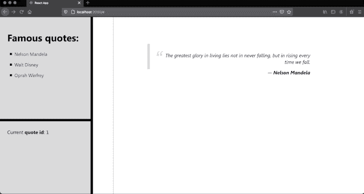
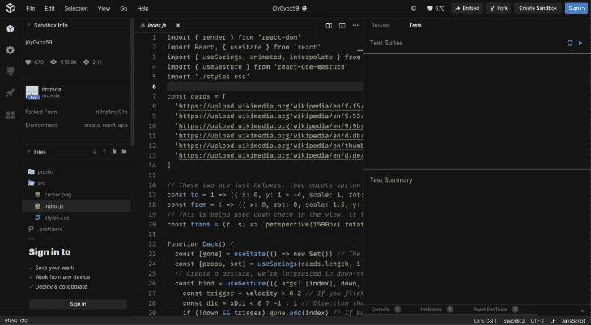

# 如何在 React - LogRocket 博客中创建拆分窗格组件

> 原文：<https://blog.logrocket.com/how-to-create-a-split-pane-component-in-react/>

分割窗格是开发人员生活中不可或缺的一部分。无论是将你喜欢的桌面还是 web IDE 的众多区域进行划分，在屏幕组织方面提升用户体验都是一个很棒的功能。

在本文中，我们将从头开始在 React 中创建一个拆分窗格组件。

我们将构建一个没有外部库的应用程序，只需 React，它在左侧窗格显示预定义的名人列表，同时在右侧窗格显示他们的引用。

下图展示了此应用程序示例的性质:



我们不会简单地演示如何创建组件，我们还将展示如何通过两个分割窗格(一个垂直窗格和一个水平窗格)使组件的维度多样化。

该示例还展示了如何通过 React 的`context`完成面板之间的一些状态交互。通过这种方式，您可以了解如何在更合适的真实场景中使用它。

## 项目设置

为了快速运行，我们将使用 [create-react-app](https://github.com/facebook/create-react-app) 工具。因此，运行以下命令:

```
npx create-react-app splitpane-react

```

在 Visual Studio 代码中打开创建的项目，并再创建几个文件:

```
--| splitpane-react
-----| src
--------| ...
--------| QuoteContext.js
--------| SplitPaneContext.js
--------| SplitPane.js
--------| index.css

```

让我们从上下文文件开始。确保将以下内容粘贴到 *QuoteContext.js* 中:

```
import { createContext } from "react";

const QuoteContext = createContext();

export default QuoteContext;

```

自从 React 16 出现以来，它引入了一个新的[上下文 API](https://reactjs.org/docs/context.html) 来帮助开发人员在不需要`props`的情况下通过组件级别的各个层次传递数据。

这里，我们创建一个上下文存储来保存内存中报价列表的数据，因为我们不会从其他地方检索这样的信息。

以下是 *SplitPaneContext.js* 的内容:

```
import { createContext } from "react";

const SplitPaneContext = createContext();

export default SplitPaneContext;

```

是的，他们实际上是平等的。我们将它们导出到外部文件的原因是这样更容易将上下文导入到其他 JavaScript 文件中。

接下来，让我们继续了解应用程序的结构，以便更好地理解事物是如何相互叠加的。

这是 *App.js* 文件的内容:

```
import SplitPane, {
  Divider,
  SplitPaneBottom,
  SplitPaneLeft,
  SplitPaneRight,
  SplitPaneTop,
} from "./SplitPane";
import QuoteContext from "./QuoteContext";
import { useState } from "react";

import "./App.css";

const quotes = [
  {
    id: 1,
    author: "Nelson Mandela",
    description:
      "The greatest glory in living lies not in never falling, but in rising every time we fall.",
  },
  {
    id: 2,
    author: "Walt Disney",
    description: "The way to get started is to quit talking and begin doing.",
  },
  {
    id: 3,
    author: "Oprah Winfrey",
    description:
      "If you look at what you have in life, you'll always have more. If you look at what you don't have in life, you'll never have enough.",
  },
];

function App() {
  const [currQuote, setCurrQuote] = useState(1);

  return (
    <div className="App">
      <QuoteContext.Provider value={{ quotes, currQuote, setCurrQuote }}>
        <SplitPane className="split-pane-row">
          <SplitPaneLeft>
            <SplitPane className="split-pane-col">
              <SplitPaneTop />
              <Divider className="separator-row" />
              <SplitPaneBottom />
            </SplitPane>
          </SplitPaneLeft>
          <Divider className="separator-col" />

          <SplitPaneRight />
        </SplitPane>
      </QuoteContext.Provider>
    </div>
  );
}

export default App;

```

当您将这段代码导入到项目中时，您可能会看到几个错误。别担心，这是因为我们还没有创建任何拆分窗格组件。

现在让我们把重点放在理解上。

`quotes`数组表示内存中的名言列表，最好放在层次结构的顶层。

它将被直接分配给`QuoteContext`提供者，以便您稍后能够在`SplitPane`组件上访问它的值。

请注意我们是如何将一个窗格分层堆叠在另一个窗格之上的。每个窗格都可以有自己的 CSS 类，我们需要进一步添加一些样式。

到目前为止，一切都很简单。真正的魔法发生在`SplitPane.js`组件中，因为那里有很多代码，让我们一步一步地构建它。

下面列出了该文件的第一个也是最重要的部分:

```
import React, {
  createRef,
  useContext,
  useEffect,
  useRef,
  useState,
} from "react";
import QuoteContext from "./QuoteContext";
import SplitPaneContext from "./SplitPaneContext";

const SplitPane = ({ children, ...props }) => {
  const [clientHeight, setClientHeight] = useState(null);
  const [clientWidth, setClientWidth] = useState(null);
  const yDividerPos = useRef(null);
  const xDividerPos = useRef(null);

  const onMouseHoldDown = (e) => {
    yDividerPos.current = e.clientY;
    xDividerPos.current = e.clientX;
  };

  const onMouseHoldUp = () => {
    yDividerPos.current = null;
    xDividerPos.current = null;
  };

  const onMouseHoldMove = (e) => {
    if (!yDividerPos.current && !xDividerPos.current) {
      return;
    }

    setClientHeight(clientHeight + e.clientY - yDividerPos.current);
    setClientWidth(clientWidth + e.clientX - xDividerPos.current);

    yDividerPos.current = e.clientY;
    xDividerPos.current = e.clientX;
  };

  useEffect(() => {
    document.addEventListener("mouseup", onMouseHoldUp);
    document.addEventListener("mousemove", onMouseHoldMove);

    return () => {
      document.removeEventListener("mouseup", onMouseHoldUp);
      document.removeEventListener("mousemove", onMouseHoldMove);
    };
  });

  return (
    <div {...props}>
      <SplitPaneContext.Provider
        value={{
          clientHeight,
          setClientHeight,
          clientWidth,
          setClientWidth,
          onMouseHoldDown,
        }}
      >
        {children}
      </SplitPaneContext.Provider>
    </div>
  );
};

```

快速浏览一下代码清单的开头，可以看到我们正在大量使用 React 钩子。这也是确保实现尽可能最新的一种方式。

组件是我们应用程序中最重要的组件。

它负责保存窗格的位置、尺寸、鼠标事件及其子组件。是的，每个窗格都有一个或多个内部面板。你可以用递归的方式来考虑这个实现。

* * *

### 更多来自 LogRocket 的精彩文章:

* * *

`SplitPaneContext`负责保存顶部面板及其子面板共有的数据和函数，比如面板的高度和宽度。

窗格拖放的逻辑非常简单。我们必须跟踪鼠标事件`mousedown`和`mouseup`来分别设置鼠标在屏幕上的当前 x 和 y 位置并使它们无效。

这样，我们可以跟踪`mousemove`事件中的这些值，并相应地动态更新窗格的尺寸。

组件的返回构建了上下文提供者以及子面板。

请参见下面的其余代码:

```
export const Divider = (props) => {
  const { onMouseHoldDown } = useContext(SplitPaneContext);

  return <div {...props} onMouseDown={onMouseHoldDown} />;
};

export const SplitPaneTop = (props) => {
  const topRef = createRef();
  const { clientHeight, setClientHeight } = useContext(SplitPaneContext);
  const { quotes, setCurrQuote } = useContext(QuoteContext);

  useEffect(() => {
    if (!clientHeight) {
      setClientHeight(topRef.current.clientHeight);
      return;
    }

    topRef.current.style.minHeight = clientHeight + "px";
    topRef.current.style.maxHeight = clientHeight + "px";
  }, [clientHeight]);

  return (
    <div {...props} className="split-pane-top" ref={topRef}>
      <h1>Famous quotes:</h1>
      <ul>
        {quotes.map((el, i) => {
          return (
            <li key={i}>
              <a href="#" onClick={() => setCurrQuote(el.id)}>
                {el.author}
              </a>
            </li>
          );
        })}
      </ul>
    </div>
  );
};

export const SplitPaneBottom = (props) => {
  const { currQuote } = useContext(QuoteContext);

  return (
    <div {...props} className="split-pane-bottom">
      Current <b>quote id</b>: {currQuote}
    </div>
  );
};

export const SplitPaneLeft = (props) => {
  const topRef = createRef();
  const { clientWidth, setClientWidth } = useContext(SplitPaneContext);

  useEffect(() => {
    if (!clientWidth) {
      setClientWidth(topRef.current.clientWidth / 2);
      return;
    }

    topRef.current.style.minWidth = clientWidth + "px";
    topRef.current.style.maxWidth = clientWidth + "px";
  }, [clientWidth]);

  return <div {...props} className="split-pane-left" ref={topRef} />;
};

export const SplitPaneRight = (props) => {
  const { quotes, currQuote } = useContext(QuoteContext);
  const quote = quotes.find((el) => el.id === currQuote);

  return (
    <div {...props} className="split-pane-right">
      <div className="quote">
        <blockquote>{quote.description}</blockquote>—{" "}
        <span>{quote.author}</span>
      </div>
    </div>
  );
};

export default SplitPane;

```

接下来是其余的组件，从`Divider`开始。这个组件表示一个单独的窗格分隔线，可以是垂直的也可以是水平的，这取决于它所继承的 CSS 类。注意我们是如何从`SplitPane's`上下文对象中检索`mousedown`事件的。

其他组件与每个维度面板相关。例如，`SplitPaneTop`负责根据上下文的值通过 CSS 属性管理窗格的高度。

我们还从上下文中检索并迭代引用列表，以显示作者链接列表。您可能认为这个逻辑不适合这个组件，如果您想将它移到上面的组件中，这也没关系。

`SplitPaneBottom`负责显示当前选择的报价 ID。

反过来，`SplitPaneRight`查找当前选中的报价，以显示其描述和作者。

在测试应用程序之前，您必须在`index.css`文件中填写以下内容:

```
html,
body {
  padding: 0;
  margin: 0;
}

.App {
  font-family: "Segoe UI", sans-serif;
  font-size: 1.2rem;
  text-align: center;
}

.split-pane-col {
  width: 100vw;
  height: 100vh;
  display: flex;
  flex-direction: column;
}

.split-pane-row {
  width: 100vw;
  height: 100vh;
  display: flex;
  flex-direction: row;
}

.split-pane-top,
.split-pane-bottom,
.split-pane-right,
.split-pane-left {
  flex: 1;
  overflow: hidden;
}

.split-pane-right {
  background-color: #fff;
  background-image: linear-gradient(
      90deg,
      transparent 79px,
      #abced4 79px,
      #abced4 81px,
      transparent 81px
    ),
    linear-gradient(#eee 0.1em, transparent 0.1em);
  background-size: 100% 1.2em;
}

.split-pane-top,
.split-pane-bottom {
  background-color: #ccc;
  text-align: left;
  padding: 2%;
}

.separator-col {
  border: 5px solid black;
  cursor: col-resize;
}

.separator-row {
  border: 5px solid black;
  cursor: row-resize;
}

ul {
  margin-left: -2%;
}

ul li {
  margin: 1rem;
  list-style-type: square;
}

ul a {
  text-decoration: none;
  color: darkblue;
  font-size: large;
}

ul a:hover {
  color: black;
}

blockquote {
  border-left: 10px solid #ccc;
  margin: 5.5em 0 0 0;
  quotes: "\201C""\201D""\2018""\2019";
  padding: 2rem 0 1rem;
}

blockquote:before {
  color: #ccc;
  content: open-quote;
  font-size: 4em;
  line-height: 0.1em;
  margin-right: 0.25em;
  vertical-align: -0.4em;
}

blockquote p {
  display: inline;
}

.quote {
  max-width: 60%;
  text-align: right;
  margin: auto;
  font-style: italic;
}

.quote span {
  font-weight: bold;
}

```

要测试应用程序，请确保保存所有文件并运行以下命令:

```
npm run start

```

它将打开您的默认 web 浏览器，并显示我们在上一张图片中看到的正在运行的应用程序。你可以在这里进行测试。

## 结论

你可以在这里找到这个教程的源代码。

我还建议使用更复杂和嵌套的面板，比如你在[https://codesandbox.io/](https://codesandbox.io/)中编码时看到的那些:



更重要的是，通过 React 的`state`和`context`使它们相互结合和互操作。祝你好运！

## [LogRocket](https://lp.logrocket.com/blg/react-signup-general) :全面了解您的生产 React 应用

调试 React 应用程序可能很困难，尤其是当用户遇到难以重现的问题时。如果您对监视和跟踪 Redux 状态、自动显示 JavaScript 错误以及跟踪缓慢的网络请求和组件加载时间感兴趣，

[try LogRocket](https://lp.logrocket.com/blg/react-signup-general)

.

[ ](https://lp.logrocket.com/blg/react-signup-general) [](https://lp.logrocket.com/blg/react-signup-general) 

LogRocket 结合了会话回放、产品分析和错误跟踪，使软件团队能够创建理想的 web 和移动产品体验。这对你来说意味着什么？

LogRocket 不是猜测错误发生的原因，也不是要求用户提供截图和日志转储，而是让您回放问题，就像它们发生在您自己的浏览器中一样，以快速了解哪里出错了。

不再有嘈杂的警报。智能错误跟踪允许您对问题进行分类，然后从中学习。获得有影响的用户问题的通知，而不是误报。警报越少，有用的信号越多。

LogRocket Redux 中间件包为您的用户会话增加了一层额外的可见性。LogRocket 记录 Redux 存储中的所有操作和状态。

现代化您调试 React 应用的方式— [开始免费监控](https://lp.logrocket.com/blg/react-signup-general)。