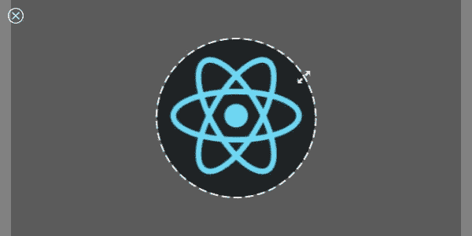

# 如何用 React - LogRocket 博客创建头像功能

> 原文：<https://blog.logrocket.com/how-to-create-avatar-feature-react/>

这些年来，化身已经成为一种提供用户视觉表示的流行方式，尤其是在涉及人与人之间交互的应用中。你有社交媒体应用、聊天应用、GitHub 等等的头像。在这种情况下，头像是代表一个用户的图像(大部分是圆形的),使其他用户可以很容易地识别它们。

如果您试图实现一种方法，让您的用户从零开始在 React 应用程序中上传他们的头像照片，您将不得不担心许多事情，例如接受用户照片，裁剪和调整这些照片的大小，以及可能将它们编码为 base64 这样的格式，以便下载或发送到服务器进行存储。

这可能很耗时，而且在大多数情况下，最好不要重新发明轮子，最好使用现有的库。一个这样的库是 [react-avatar](https://github.com/kirill3333/react-avatar) 。

在本文中，我们将看看这个库，它做什么，并在文章结束时，创建一个简单的 React 应用程序，用户可以在其中从他们的计算机导入图像，用它来制作头像，并将头像下载到他们的计算机。

### 先决条件

为了更好地理解本文，您应该对 React 和 JavaScript 有一个基本的了解。

## react-avatar 库

react-avatar 是一个基于 react 的库，允许你实现头像创建，允许用户预览和裁剪他们喜欢的图像来创建头像。它也是可定制的，因此您可以设计 React 组件的样式以适合应用程序的其余部分。现在我们已经讨论了最基本的内容，让我们来看看一些代码。

### `Avatar`组件

该库唯一的组件是`Avatar`组件，我们用它来为我们的虚拟形象选择和裁剪图像。下面是使用中的`Avatar`组件的一个基本示例:

```
function App() {
  const [preview, setPreview] = useState(null);
  function onClose() {
    setPreview(null);
  }
  function onCrop(pv) {
    setPreview(pv);
  }
  function onBeforeFileLoad(elem) {
    if (elem.target.files[0].size > 71680) {
      alert("File is too big!");
      elem.target.value = "";
    }
  }
  return (
    <div>
      <Avatar
        width={300}
        height={300}
        onCrop={onCrop}
        onClose={onClose}
        onBeforeFileLoad={onBeforeFileLoad}
        src={null}
      />
      {preview && }
    </div>
  );
}
export default App;
```

使用上面的代码，浏览器上的结果应该如下所示:


你现在可以点击这个框，我以后称之为预览框，来选择一张图片作为你的头像。就是这么简单！

在我们继续之前，我想解释一下`Avatar`组件的不同道具。

### `height`和`width`

这些属性定义了预览框的高度和宽度。

### `onCrop`

您可以将`onCrop`视为一个事件监听器，每当头像图像被裁剪时就会被触发。由于`onCrop`是一个函数，它可以带参数；在这种情况下，参数是以 base64 格式编码的裁剪图像。

### `onClose`

选择图像后，预览框的左上角会出现一个取消图标。



点击该图标将触发`onClose`事件监听器，传递给`onClose`道具的函数将运行。在上面的代码中，我们在预览框关闭时将预览状态变量设置为 null。

### `onBeforeFileLoad`

在幕后，预览框包含一个`<input type="file">`元素，这是它能够从用户的计算机中获取文件进行处理的方式。

当用户选择一个图像作为他们的头像时，就会触发`onBeforeFileLoad`,传递给它的参数是文件选择事件的事件对象。从这个对象中，我们可以获得关于所选文件的信息，比如它的大小，并使用这些信息来执行其他操作，比如限制用于化身的图像的大小(就像我们的例子一样)。

还要注意，如果文件大小大于指定的大小，我们将目标元素的`value`属性设置为空字符串。这是因为库检查了`value`属性，如果它是一个空字符串，就停止头像创建过程(这是我们想要的)。

### `onFileLoad`

`onFileLoad`是另一个事件监听器，它几乎在`onBeforeFileLoad`函数运行后立即被调用。它还接受事件的事件对象，因此您可以在这里做您在`onBeforeFileLoad`中会做的任何事情。唯一的区别是，在调用`onFileLoad`函数之前，库确保事件对象的`value`属性不为空。

### `label`和`labelStyle`

`label`定义选择图像前预览框上显示的文本，而`labelStyle`定义该文本的样式。

现在我们已经介绍了大部分的道具，我们可以构建一个简单的应用程序，它允许用户创建头像并下载到他们的设备上。

* * *

### 更多来自 LogRocket 的精彩文章:

* * *

## 设置 React 项目

首先，我们需要建立一个新的 React 项目。您可以使用 create-react-app 轻松做到这一点:

```
npx create-react-app avatar-project
```

一旦我们完成了 React 项目的创建，我们需要安装 react-avatar 库作为依赖项。在您的终端中，安装如下:

```
npm install react-avatar-edit
```

现在我们已经建立了项目，让我们从代码开始。我们可以使用上面第一个代码块中的代码作为起点，因此将其复制到您的代码编辑器中。

既然我们有办法用我们的图像制作头像，我们只需要找到一种方法将头像下载到我们的设备上。我们可以很容易地使用一个锚标签，将`download`属性设置为下载的虚拟角色的名称(可以是我们想要的任何名称)，将`href`属性设置为虚拟角色的 base64 编码格式，这是`preview`状态变量的值。

我们的简单应用程序的代码应该如下所示:

```
import React from "react";
import Avatar from "react-avatar-edit";
import { useState } from "react";

function App() {
  const [preview, setPreview] = useState(null);
  function onClose() {
    setPreview(null);
  }
  function onCrop(pv) {
    setPreview(pv);
  }
  function onBeforeFileLoad(elem) {
    if (elem.target.files[0].size > 2000000) {
      alert("File is too big!");
      elem.target.value = "";
    }
  }
  return (
    <div>
      <Avatar
        width={600}
        height={300}
        onCrop={onCrop}
        onClose={onClose}
        onBeforeFileLoad={onBeforeFileLoad}
        src={null}
      />
      <br/>
      {preview && (
        <>
          
          <a href={preview} download="avatar">
            Download image
          </a>
        </>
      )}
    </div>
  );
}
export default App;
```

现在，用户应该能够根据他们喜欢的图像创建头像，并将这些头像下载到他们的设备上。

## 用户化

您可能会决定自定义预览框，以适应您的应用程序的主题，或者使您的应用程序看起来更有趣。如前所述，在选择图像之前，您可以使用`label`和`labelStyle`来自定义显示在预览框中心的文本。

还有其他的定制道具，像`borderStyle`，我们可以用来定制预览框的边框样式；`backgroundColor`，设置选中图像时预览框的背景颜色；`shadingColor`用于定制所选图像要裁剪部分的颜色；和其他人。

## 结论

就这样，我们结束了！现在，您应该能够在 React 应用程序中实现一个头像创建功能。要了解这个库的更多信息，您可以点击这里查看 GitHub 上的库。

## [LogRocket](https://lp.logrocket.com/blg/react-signup-general) :全面了解您的生产 React 应用

调试 React 应用程序可能很困难，尤其是当用户遇到难以重现的问题时。如果您对监视和跟踪 Redux 状态、自动显示 JavaScript 错误以及跟踪缓慢的网络请求和组件加载时间感兴趣，

[try LogRocket](https://lp.logrocket.com/blg/react-signup-general)

.

[ ](https://lp.logrocket.com/blg/react-signup-general) [](https://lp.logrocket.com/blg/react-signup-general) 

LogRocket 结合了会话回放、产品分析和错误跟踪，使软件团队能够创建理想的 web 和移动产品体验。这对你来说意味着什么？

LogRocket 不是猜测错误发生的原因，也不是要求用户提供截图和日志转储，而是让您回放问题，就像它们发生在您自己的浏览器中一样，以快速了解哪里出错了。

不再有嘈杂的警报。智能错误跟踪允许您对问题进行分类，然后从中学习。获得有影响的用户问题的通知，而不是误报。警报越少，有用的信号越多。

LogRocket Redux 中间件包为您的用户会话增加了一层额外的可见性。LogRocket 记录 Redux 存储中的所有操作和状态。

现代化您调试 React 应用的方式— [开始免费监控](https://lp.logrocket.com/blg/react-signup-general)。