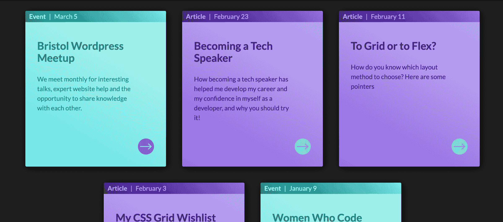

# 如何用 CSS 变量创建更好的主题

> 原文：<https://blog.logrocket.com/how-to-create-better-themes-with-css-variables-5a3744105c74/>



[CSS 变量](https://developer.mozilla.org/en-US/docs/Web/CSS/Using_CSS_custom_properties)(也称为自定义属性)是相对较新的 CSS 规范的一部分，并且由于其[现在广泛的浏览器支持](https://caniuse.com/#search=css%20variables)(有一些例外，我们稍后将访问)而迅速普及。它们允许我们定义在整个 CSS 文件中重用的值——这在以前只能用像 [Sass](https://sass-lang.com/) 和 [LESS](http://lesscss.org/) 这样的[预处理程序](https://sass-lang.com/guide)来实现。在本文中，我们将探索 CSS 变量的特殊之处，以及它们对我们今天的益处。

### 什么是主题化？

CSS 变量的一个很好的用例是主题化。当我们谈到主题化时，我们指的是以不同的方式设计我们网站的各个方面，同时仍然保持整体的外观和感觉。这通常包括改变颜色，但有时也包括字体或图标。

最近变得流行的一个例子是在明暗主题之间切换。用户可以点击一个按钮，将网站的颜色从浅色背景上的深色文本转换成深色背景上的浅色文本。也可能会有细微的变化，比如切换到不同的高光颜色，以保持与背景的足够对比度。

参见 [CodePen](https://codepen.io) 上米歇尔巴克([@米歇尔巴克](https://codepen.io/michellebarker) )
的笔 [CSS 主题切换器](https://codepen.io/michellebarker/pen/GzzrGJ/)。

另一个例子是，你可以用品牌颜色来设计网站的大部分页面，但是特殊事件页面有不同的颜色主题。让我们看看如何使用 CSS 变量来帮助我们处理这样的情况。

[](https://logrocket.com/signup/)

### CSS 变量是由什么构成的？

CSS 变量在许多方面不同于预处理器变量。CSS 变量是*动态*变量:一旦设置，它们的值就不是固定的。它们可以用 CSS 或 Javascript 进行更新——所以在样式表的不同选择器中，同一个变量可以有许多不同的值。这里我们定义了一个变量，我们在三个不同的地方称之为`--primaryColor`。对于`body`和`button`元素，我们将`background-color`属性设置为`--primaryColor`的值。

```
body {
--primaryColor: #d452f2;
background-color: var(--primaryColor);
}
button {
background-color: var(--primaryColor);
}
.my-element {
--primaryColor: #1d00ff; // the button inside `.my-element` will be blue
}
.my-element:nth-child(2n) {
--primaryColor: #82f263; // the button inside the second child will be green
}
```

参见 [CodePen](https://codepen.io) 上米歇尔巴克([@米歇尔巴克](https://codepen.io/michellebarker) )
的 Pen [CSS 变量与继承](https://codepen.io/michellebarker/pen/RdONrg/)。

相比之下，尝试用 Sass 做同样的事情要复杂得多。我们需要定义变量*和*,每次我们想改变值的时候都要显式地使用它。这不*的动态*也一样:

```
$primaryColor: #d452f2; 

body {

background-color: $primaryColor;

}

button {

$primaryColor: #1d00ff;

background-color: $primaryColor;

}
.my-element:nth-child(2n) {

button {

$primaryColor: #82f263;

background-color: $primaryColor;

}

}
```

另一个区别是它们只能用于 CSS 属性值——不像预处理程序变量，例如，预处理程序变量可以用在选择器名称和媒体查询声明中。我们不能对 CSS 变量这样做，例如:

```
@media (min-width: var(--mediumBreakpoint)) {

/* Code here */

}
```

这使得它们被称为自定义属性的原因更加明显。

最大的区别在于，在代码发送到浏览器之前，预处理变量是在预处理阶段编译的。浏览器永远看不到变量本身，只能看到它的计算值。

考虑下面的 Sass 代码:

```
$primaryColor: #82f263;
.box {
background-color: $primaryColor;
}
```

如果我们在浏览器中对此进行检查，我们会看到以下内容:

```
.box {
background-color: #82f263;
}
```

相反，在浏览器解析代码之前，不会计算 CSS 变量的值。改为使用 CSS 变量时检查代码会将值本身显示为变量:

```
.box {
background-color: var(--primaryColor);
}

```

### 如何确定 CSS 变量的范围

我们可以在`:root`元素上定义一个 CSS 变量，如下所示:

```
:root {
--bgColor: hsl(20, 50%, 60%);
}
```

`:root`元素相当于`html`元素，但是具有更高的特异性——使其成为一个全局变量。

然后我们可以在选择器中使用变量:

```
body {
background-color: var(--bgColor);
}
```

在这个例子中，`body`元素的`background-color`将被设置为我们上面定义的变量的值(一个引人注目的桃色)。

参见 [CodePen](https://codepen.io) 上米歇尔巴克([@米歇尔巴克](https://codepen.io/michellebarker) )
的 Pen [基本 CSS 变量使用](https://codepen.io/michellebarker/pen/exXejG/)。

然而，定义变量不一定要在全局范围内完成。我们可以在选择器中定义相同的变量:

```
.my-component {
--bgColor: hsl(20, 50%, 60%);
background-color: var(--bgColor);
}
```

现在我们明确地将变量`--bgColor`限定在`.my-component`类的范围内，所以这个类的一个元素将拥有我们的桃子`background-color`。这里我们在同一个选择器中定义和使用变量，您可能认为这没有多大意义。但这也意味着该元素的子元素将继承该变量。

```
.my-component {
--bgColor: hsl(20, 50%, 60%);
background-color: var(--bgColor);
}
.my-component h2 {
color: var(--bgColor);
}
```

我们已经有了一个主题的开端。也许我们想为我们组件的一个特殊变体更新这个变量:

```
.my-component.special {
--bgColor: hsl(20, 100%, 30%);
}
```

在我们组件的这个变体中，`h2`将继承新的颜色，而不需要我们显式地设置它。

将变量作用于选择器有一些好处:

1.我们可以在 CSS 的其他地方定义和使用`--bgColor`作为一个完全独立的变量(例如，在另一个完全独立的组件上),而不需要担心它的冲突

2.在选择器中定义变量允许所有的子节点继承该变量，除非它在树中被重新定义，同时防止它的值“泄漏”到全局范围

如果你想在整个项目中重用变量，那么在全局范围*中定义变量本身*并没有错。但是在这些情况下，给它们一个比`--bgColor`更独特的名字可能是个好主意，这样可以避免以后遇到问题！

### 如何使用默认值

将变量作用于选择器会增加意外使用尚未定义的变量的可能性。这种情况下会发生什么？

```
.my-component {
/* The `background-color` value here will be `transparent` */
background-color: var(--bgColor);
}
```

如果变量是未定义的，那么属性将不会生效。但是，它将采用属性的 _ initial _ value——在我们这里的`background-color`属性的情况下，将是`transparent`,而不是退回到先前在级联中定义的值。为了避免意外的后果，将默认值设置为第二个参数会很有用:

```
.my-component {
background-color: var(--bgColor, hsl(20, 50%, 60%));
}

.my-component.special {
--bgColor: hsl(20, 100%, 30%);
}
```

现在我们甚至不需要定义变量，直到我们想要更新值的时候，我们的代码更加简洁。我们组件的第一个实例将简单地采用默认值。您甚至可以设置多个默认值:

```
.my-component {
/* Peach color background */
background-color: var( — bgColor, var( — highlight, hsl(20, 50%, 60%)));
}

.my-component.special {
/* Burgundy */
— bgColor: hsl(20, 100%, 30%);
}

.my-component.highlight {
/* Yellow */
— highlight: hsl(50, 100%, 60%);
}
```

使用上面的代码，第一个组件的`background-color`属性值将返回到原来的桃色，因为这两个变量都没有定义。第二个组件变量定义了`--bgColor `变量，而第三个变量只定义了`--highlight `变量，所以是亮黄色。

参见 [CodePen](https://codepen.io) 上米歇尔·巴克([@米歇尔·巴克](https://codepen.io/michellebarker) )
的 [笔基本 CSS 变量使用与默认值](https://codepen.io/michellebarker/pen/LqaeRK/)。

这种方法的一个缺点是可读性较差。如果你预先定义了你的变量，那么浏览代码会更容易，一眼就能看出变量的值是什么。但这只是个人喜好问题。如果浏览器必须解析多个级别的变量，也可能会影响性能，所以如果您正在处理大型代码库，这可能是一个需要考虑的问题。

### 变量和 HSL

这个演示展示了一组以 CSS 变量为主题的卡片。在这里，我为我们的基本颜色定义了三个变量，颜色的深色版本和高亮颜色。然后，我将为卡的第二个变体更新这些变量值:

```
.card {
--th: hsl(259, 72%, 64%);
--thDark: hsl(259, 72%, 38%);
--accent: hsl(259, 72%, 38%);
}
.card--event {
--th: hsl(180, 72%, 64%);
--thDark: hsl(180, 72%, 38%);
}
```

如果你仔细观察，你会发现在我们的变量值中有很多重复。然而，CSS 变量不仅仅有益于整个属性值。它们还可以使我们重用值，从而使我们的代码更加简洁(不要重复)。

您可能会注意到我对我的`--bgColor`变量值使用了`hsl()`函数。HSL(色调、饱和度、明度)可能不太常用，但格式使得以直观的方式调整颜色相对简单。它非常适合处理 CSS 变量。

我们可以在`hsl()`函数中使用变量:

```
.my-component {
background-color: hsl(20, 50%, var(--lightness, 60%));
}
.my-component.dark {
--lightness: 40%;
}
```

这里我们调整了变量`--lightness`来给我们组件一个更暗的变体。

### 如何用 CSS 变量创建主题

有了 HSL，我们可以更有效地应用我们的主题，并在未来更容易添加其他颜色。看完整的演示[这里](https://codepen.io/michellebarker/pen/EMgXdK):

```
.card {
--hue: 259;
--th: hsl(var(--hue), 72%, var(--lightness, 68%));
--thDark: hsl(var(--hue), 72%, 38%);
--accent: hsl(var(--hueAccent, var(--hue)), 72%, 38%);
}
.card--event {
--hue: 180;
--hueAccent: 259;
}
.card:hover {
--lightness: 45%;
}
```

有了新的变量，我们可以简单地更新`--hue`变量，并让我们的颜色主题应用于该卡。我还为`--lightness`使用了一个变量，这使得添加悬停状态变得很容易。

* * *

### 更多来自 LogRocket 的精彩文章:

* * *

### 互补色

我们可以通过为卡片上的强调色选择互补色来突出主题。有了 CSS 变量和`[calc()](https://developer.mozilla.org/en-US/docs/Web/CSS/calc)`,我们可以使用初始的`--hue`值来计算补色——也就是来自色轮另一侧的相反色调。我们需要将色调旋转 180 度。我们不仅可以对 CSS 变量使用`calc()`,我们还可以从其他变量计算变量！

```
.card {
--hue: 259;
--hueComplementary: calc(var(--hue, 20) + 180);
--th: hsl(var(--hue), 72%, 64%);
--thDark: hsl(var(--hue), 72%, 38%);
--accent: hsl(var(--hueComplementary, var(--hue)), 72%, 64%);
}
```

参见 [CodePen](https://codepen.io) 上 Michelle Barker([@ Michelle Barker](https://codepen.io/michellebarker))
的笔 [带有 CSS 变量、HSL、补色](https://codepen.io/michellebarker/pen/gERVZm/)的主题卡。

关于 HSL 的一件很酷的事情是，如果我们选择，我们可以使用`turn`单位来代替*色调*值的度数，这在某些情况下更直观。虽然我在这里坚持使用度数，但是使用`turn`单位表示*色调*值更容易可视化，尤其是当我们得到更高的数值时。这里有一篇关于 CSS 旋转单元的好文章。

### 浏览器支持

本文中使用的技术在现代浏览器中有很好的支持。但是 IE11 及以下不支持 CSS 变量。如果你需要支持旧的浏览器，并且你的颜色主题是你的网站的一个重要部分(例如，为了可访问性，或者遵循严格的品牌指导方针)，那么使用 CSS 变量可能不合适——或者，至少，你应该提供一个用户友好的后备。处理浏览器支持的一种方法是使用特征查询:

```
.my-component {
background-color: #82f263;
}
@supports (--css: variables) {
.my-component {
--myVariable: #ef62e6;
background-color: var(--myVariable);
}
}
```

只要语法匹配，`@supports`声明的值没有太大关系。

当使用较新的 CSS 属性时，您应该始终考虑一种渐进的增强方法。

## 你的前端是否占用了用户的 CPU？

随着 web 前端变得越来越复杂，资源贪婪的特性对浏览器的要求越来越高。如果您对监控和跟踪生产环境中所有用户的客户端 CPU 使用、内存使用等感兴趣，

[try LogRocket](https://lp.logrocket.com/blg/css-signup)

.

[](https://lp.logrocket.com/blg/css-signup)[https://logrocket.com/signup/](https://lp.logrocket.com/blg/css-signup)

LogRocket 就像是网络和移动应用的 DVR，记录你的网络应用或网站上发生的一切。您可以汇总和报告关键的前端性能指标，重放用户会话和应用程序状态，记录网络请求，并自动显示所有错误，而不是猜测问题发生的原因。

现代化您调试 web 和移动应用的方式— [开始免费监控](https://lp.logrocket.com/blg/css-signup)。