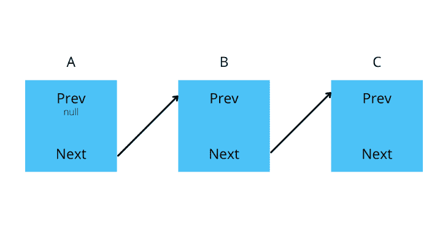

# 如何用 JavaScript 创建自己的加密货币

> 原文：<https://blog.logrocket.com/how-to-create-cryptocurrency-javascript/>

现在，有很多方法可以通过数字方式把钱汇给别人。大多数方式是通过银行或一些钱包，但最近，使用加密货币变得流行起来。

加密货币是一种匿名向他人汇款的好方法。加密货币的另一个优势是它们的网络是分散的，这意味着没有人监管交易，也没有中间人。有些人认为这不好，因为大多数骗子都使用加密货币，但有些人认为这是迈向隐私的又一步。

今天，我们将使用 JavaScript 创建一种加密货币。希望这篇文章能让你对如何创建自己的加密货币有一个基本的了解，你可以继续学习这些技巧来提高你的财务隐私。

## 目录

## 什么是区块链？

在我们开始使用 JavaScript 制作自己的加密货币之前，让我们先讨论一下什么是区块链。

区块链是一个不能被篡改的数据链。在加密货币的情况下，区块链包含相互连接的块(包含关于交易的信息)。每个块都有一个哈希值，可以验证它是否合法，是否被黑客注入。

由于这些块相互连接，现有的块不能改变，因为所有的块都链接在一起。



​​

在上图中，A、B、C 是三个区块。其中包含交易数据(发送的加密货币数量、接收者钱包地址和其他元数据)。正如我们所看到的，每个新块都链接到前一个块。这是通过将前一个块的散列存储在 **Prev** 中并将下一个块的散列存储在 **Next** 中来实现的。

区块链上的交易用这种方法保持在轨道上。要找到任何一个区块，都需要其他区块。因此，不可能删除其中一个数据块或编辑它们，因为它们的哈希已经过验证，恶意更改的数据块很容易被识别出来。区块链是分散的，这意味着没有一个权力机构能控制它。区块链由许多不同的计算机运行，计算散列并检查块是否合法。这个过程被称为挖掘，作为回报，运行这些挖掘操作的人如果成功解决了第一个街区，就会获得一定数量的加密货币作为奖励。

不同的加密货币有不同的挖掘方法，但挖掘确保了区块链的整体安全。虽然在本教程中，我们不会涉及采矿，但您将了解如何开发自己的加密货币的基本概念。JavaScript 可能不是创建你的“生产级”加密货币的最佳语言，但它仍然能够让像 web 开发人员这样的人快速进入这个领域。

## 要求

如果你想看代码，你可以参考 GitHub 库。

## 开始制作 JavaScript 加密货币

让我们从创建一个节点项目开始。导航到一个安全目录，输入以下命令创建一个新项目:

```
npm init -y

```

这会为您生成一个`package.json`文件。如果创建了文件，那么就创建了项目。

现在让我们创建一个名为`index.js`的新文件。首先，导入 [`crypto`](https://nodejs.org/api/crypto.html#crypto) 包，以便我们可以处理项目中的散列。`crypto`包帮助我们处理散列、签名和密钥。它允许我们在节点中执行加密转换。

这是带有 Node 的预安装包，所以不需要单独安装:

```
const crypto = require("crypto");

```

在这些项目中，我们将涉及四门课程。它们是:

*   `Transaction`
*   `Block`
*   `Chain`
*   `Wallet`

首先让我们创建`Transaction`类。

## 创建`Transaction`类

事务的基本属性将是`amount`、`senderPublicKey`和`recieverPublicKey`。因此，让我们为这些属性设置一个构造函数，以便以后使用该类:

```
class Transaction {
  constructor(amount, senderPublicKey, recieverPublicKey) {
    this.amount = amount;
    this.senderPublicKey = senderPublicKey;
    this.recieverPublicKey = recieverPublicKey;
  }
}

```

我们还需要一个方法将类的对象转换成字符串，以便将其转换成散列。因此，我们将创建一个函数来将对象转换为字符串供以后使用:

```
toString() {
  return JSON.stringify(this);
}

```

完整的`Transaction`类应该如下所示:

```
class Transaction {
  constructor(amount, senderPublicKey, recieverPublicKey) {
    this.amount = amount;
    this.senderPublicKey = senderPublicKey;
    this.recieverPublicKey = recieverPublicKey;
  }
  // convert the data of the class to json so that
  // it can be converted into a hash
  toString() {
    return JSON.stringify(this);
  }
}

```

我们现在可以将这些事务存储在一个块中，我们接下来将创建这个块。

## 创建`Block`类

术语“区块链”的意思和它听起来的一样——一连串的街区。该链是相互链接的块(包含事务)的集合，以便我们能够以系统的方式访问它们。

首先，让我们设置将与`Block`类一起使用的构造函数和属性:

```
class Block {
  constructor(previousHash, transaction, timestamp = Date.now()) {
    this.previousHash = previousHash;
    this.transaction = transaction;
    this.timestamp = timestamp;
  }
}

```

在一个块中，我们将有`previousHash`(链上前一个块的散列)`transaction`(类`Transaction`的对象)，和`timestamp`(块被创建的时间)。

现在，让我们创建一个函数来生成块的散列:

```
getHash() {
  const json = JSON.stringify(this);
  const hash = crypto.createHash("SHA256");
  hash.update(json).end();
  const hex = hash.digest("hex");
  return hex;
}

```

首先，我们将对象转换成 JSON 格式。然后，我们创建一个`SHA256` hash，这是一种无法解密的哈希方法。我们稍后使用散列来验证块；一旦散列被验证，它就为块提供合法性。

接下来，我们添加 JSON 作为数据，以便它被转换成一个`SHA256`散列。最后，我们为散列创建一个`HEX`摘要并返回它。

现在，我们再次创建一个函数来将 block 对象转换成 JSON:

```
toString() {
  JSON.stringify(this);
}

```

您的完整的`Block`类现在应该看起来像这样:

```
class Block {
  constructor(previousHash, transaction, timestamp = Date.now()) {
    this.previousHash = previousHash;
    this.transaction = transaction;
    this.timestamp = timestamp;
  }
  getHash() {
    const json = JSON.stringify(this);
    const hash = crypto.createHash("SHA256");
    hash.update(json).end();
    const hex = hash.digest("hex");
    return hex;
  }
  toString() {
    return JSON.stringify(this);
  }
}

```

现在让我们创建`Chain`类。

* * *

### 更多来自 LogRocket 的精彩文章:

* * *

## 创建`Chain`类

现在我们已经准备好了我们的`Block`类，我们可以在`Chain`中填充那些块。一条链保存着发生在区块链的每一笔交易。如前所述，区块链包含所有相互链接的块，我们的项目需要一个`Chain`类来将所有的块放在一起。

因为我们只需要初始化链一次，而不是多次，所以我们将在类本身中立即初始化它:

```
class Chain {
  static instance = new Chain();
}

```

让我们设置我们的构造函数，这样无论程序何时运行，我们都可以准备好链中的第一个块。这也将设置放置块的数组。

我们这样做是为了消除项目中的任何错误，因为我们依赖于部分代码中的前一个块，所以我们需要首先初始化一个虚拟块:

```
constructor() {
  this.chain = [new Block("", new Transaction(100, "temp", "temp"))];
}

```

现在，我们需要一个函数来获取链的最后一个散列，以便使用新块中的信息:

```
getPreviousBlockHash() {
    // sending the entire block itself
    return this.chain[this.chain.length - 1].getHash();
  }

```

接下来，让我们创建一个函数，它将实际创建一个块并将其插入到我们的链数组中:

```
insertBlock(transaction, senderPublicKey, sig) {
  // create verifier
  const verify = crypto.createVerify("SHA256");
  // add the transaction JSON
  verify.update(transaction.toString());
  // Verify it with the sender's public key
  const isValid = verify.verify(senderPublicKey, sig);
  if (isValid) {
    const block = new Block(this.getPreviousBlockHash(), transaction);
    console.log("Block added", block.toString());
    this.chain.push(block);
  }
}

```

这里，我们首先使用来自`crypto`包的`createVerify`函数来验证带有公钥的散列。然后，我们使用来自特定事务的 JSON 的数据，最后通过提供发送者的公钥和签名进行验证。

这将返回一个布尔值，我们可以用它来检查验证是成功还是失败。如果验证成功，我们只需用该信息创建一个新块，并将其添加到链数组中。

现在你的`Chain`类应该是这样的:

```
class Chain {
  static instance = new Chain();
  // initializing our chain with no records
  constructor() {
    this.chain = [new Block("", new Transaction(100, "temp", "temp"))];
  }
  getPreviousBlockHash() {
    // sending the entire block itself
    return this.chain[this.chain.length - 1].getHash();
  }
  insertBlock(transaction, senderPublicKey, sig) {
    // create verifier
    const verify = crypto.createVerify("SHA256");
    // add the transaction JSON
    verify.update(transaction.toString());
    // Verify it with the sender's public key
    const isValid = verify.verify(senderPublicKey, sig);
    if (isValid) {
      const block = new Block(this.getPreviousBlockHash(), transaction);
      console.log("Block added", block.toString());
      this.chain.push(block);
    }
  }
}

```

## 创建`Wallet`类

现在让我们来创建钱包，用户可以用它来向其他人发送加密货币。每个加密钱包都有一对密钥:一个公钥和一个私钥。私钥用于创建新的交易(例如，发送加密货币)，公钥用于验证它们并接收加密货币。

让我们首先设置构造函数，以便我们可以在启动 wallet 时立即生成一个密钥对:

```
constructor() {
  const keys = crypto.generateKeyPairSync("rsa", {
    modulusLength: 2048,
    publicKeyEncoding: { type: "spki", format: "pem" },
    privateKeyEncoding: { type: "pkcs8", format: "pem" },
  });
  this.privateKey = keys.privateKey;
  this.publicKey = keys.publicKey;
}

```

这里，我们对键使用了`PEM`格式。这是一种众所周知的格式，可以保存在用户的 PC 上。`RSA`算法允许我们创建公钥和私钥。

现在，让我们创建一个功能，帮助我们向网络上的其他钱包发送加密货币:

```
send(amount, recieverPublicKey) {
  const transaction = new Transaction(
    amount,
    this.publicKey,
    recieverPublicKey
  );
  const shaSign = crypto.createSign("SHA256");
  // add the transaction json
  shaSign.update(transaction.toString()).end();
  // sign the SHA with the private key
  const signature = shaSign.sign(this.privateKey);
  Chain.instance.insertBlock(transaction, this.publicKey, signature);
}

```

在上面的代码中，我们将`amount`和`recieverPublicKey`作为参数，并使用这些信息从`Transaction`类创建一个新对象。然后，我们创建事务的散列，并用私钥对其进行签名。最后，我们使用`insertBlock`函数将其添加到链中。

## 测试事物

现在一切都准备好了，您可以通过创建钱包并使用它们创建交易来进行测试:

```
const itachi = new Wallet();
const madara = new Wallet();
const orochimaru = new Wallet();

itachi.send(50, madara.publicKey);
madara.send(23, orochimaru.publicKey);
orochimaru.send(5, madara.publicKey);

console.log(Chain.instance);
```

在上面的代码中，我创建了具有随机名称的钱包(不完全随机，它们是火影忍者中的反派)，然后将钱从一个钱包发送到另一个钱包，最后记录链以查看它的外观。

对我来说，我的链看起来像这样(你的可能因为不同的散列而不同):

```
Chain {
  chain: [
    Block {
      previousHash: '',
      transaction: [Transaction],
      timestamp: 1634561976555
    },
    Block {
      previousHash: 'c22300510c923a8ebf4d804f6edb4370731fcfd58f938d255852b4ea2744f20e',
      transaction: [Transaction],
      timestamp: 1634561976623
    },
    Block {
      previousHash: '1799ab15685e086cdb539e1851a759c713b3f71205664286cd4024c9f74d2a69',
      transaction: [Transaction],
      timestamp: 1634561976628
    },
    Block {
      previousHash: '1eb1f51c1b94a18f1c35e0cd81245ea6c69bac0100573cb76f3dac8026132597',
      transaction: [Transaction],
      timestamp: 1634561976629
    }
  ]
}

```

## 下一步是什么？

这只是使用 JavaScript 创建加密货币的基础。你不应该在生产中使用它，因为加密货币涉及很多不同的事情，比如采矿，并且涉及很多安全性。

如果你被困在某个地方，你可以随时访问我的 [GitHub 库](https://github.com/atharvadeosthale/cryptocurrency-blog)来看看代码。

如果你想做更多的实验，我建议在这个项目中加入钱包平衡系统和采矿系统。

## 通过理解上下文，更容易地调试 JavaScript 错误

调试代码总是一项单调乏味的任务。但是你越了解自己的错误，就越容易改正。

LogRocket 让你以新的独特的方式理解这些错误。我们的前端监控解决方案跟踪用户与您的 JavaScript 前端的互动，让您能够准确找出导致错误的用户行为。

[](https://lp.logrocket.com/blg/javascript-signup)

LogRocket 记录控制台日志、页面加载时间、堆栈跟踪、慢速网络请求/响应(带有标题+正文)、浏览器元数据和自定义日志。理解您的 JavaScript 代码的影响从来没有这么简单过！

[Try it for free](https://lp.logrocket.com/blg/javascript-signup)

.