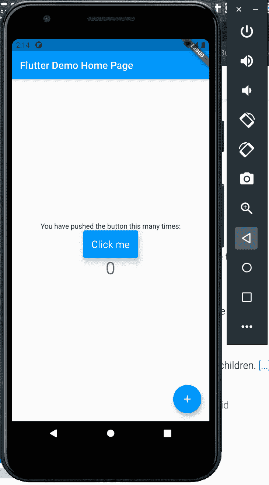
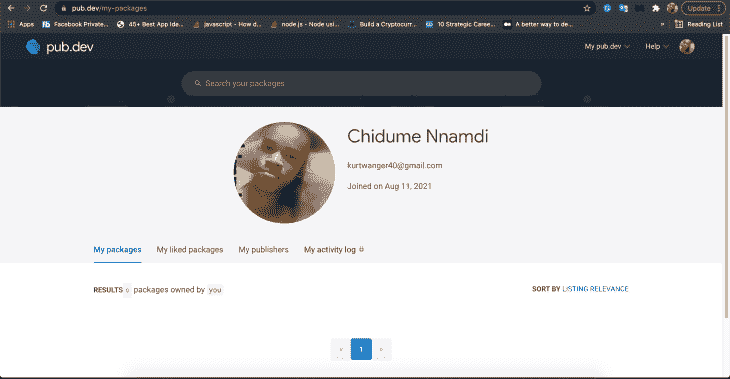
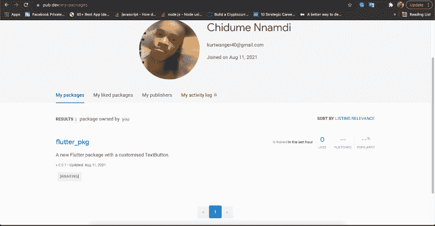
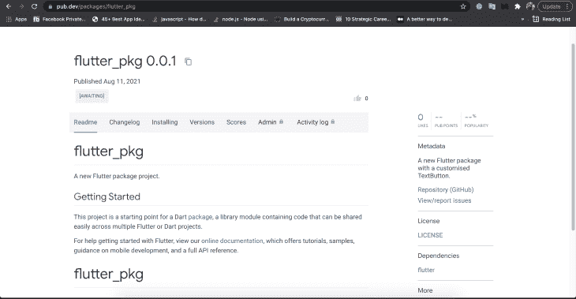

# 如何为 Flutter - LogRocket 博客创建 Dart 包

> 原文：<https://blog.logrocket.com/how-to-create-dart-packages-for-flutter/>

在 Flutter 中，我们使用 Dart 编程语言来构建跨平台应用程序。Dart 包就像您可能习惯于为使用 npm 或 yarn 的 Node.js 项目安装的库。这些包是由 Flutter devs 为 Flutter devs 构建的。

在本教程中，我们将向您展示如何构建 Dart 包，并与世界各地的其他 Flutter 开发者共享它们。

我们将通过实际例子介绍以下内容:

## 什么是飞镖包？

Dart 包帮助我们解决问题并为问题创建解决方案，而无需我们自己从头开始编写代码。

例如，假设我们正在构建一个 Flutter 应用程序，我们发现我们需要从本地文件系统上传一张图片，并在应用程序中显示它。我们自己实施将是乏味和耗时的。

有可能某个地方的某个开发人员已经为 Flutter 构建了一个 Dart 包来为我们处理图像拾取和显示功能。我们所要做的就是安装这个包，然后使用它的方法和类来查找和显示图像。这让我们有更多的时间关注应用程序的核心业务逻辑。

## 颤振项目要求

要跟随本教程，请确保您的机器上安装了 Flutter SDK。

Flutter SDK 用于构建、编译和运行 Flutter 项目。要安装它，请前往[官方 Flutter 网站](https://flutter.dev/docs/get-started/install)并根据您的操作系统下载合适的 SDK:

## Dart 包装类型

Dart 中有两种类型的包:常规 Dart 包和插件包。

*   Dart 包是用 Dart 编写的通用包。它们独立于任何原生平台，比如 Android 和 iOS。这些包是特定于 Flutter 的，只能在 Flutter 框架上使用
*   插件包是特定于平台的，包含用 Dart 代码编写的 API。这些包可以为 Android(使用 [Kotlin 或 Java](https://blog.logrocket.com/kotlin-vs-java-for-android-development/) )、iOS(使用 [Swift](https://blog.logrocket.com/flutter-vs-swift-for-ios-development/) 或 Objective-C)、web、macOS、Windows 或 Linux 编写

在本教程中，我们将演示如何创建一个 Dart 包。

## 创建颤动/飞镖包

要[创建一个颤振包](https://dart.dev/guides/libraries/create-library-packages)，运行以下命令:

```
flutter create --template=package flutter_pkg

```

*   `create`子命令用于创建一个颤振项目或包。在这种情况下，它将创建一个颤振包
*   标志告诉它创建一个抖动包
*   `flutter_pkg`是创建 Flutter 包的文件夹。你可以给它起任何你想要的名字

该命令将如下运行:

```
Creating project flutter_pkg...
  flutter_pkg/LICENSE (created)
  flutter_pkg/test/flutter_pkg_test.dart (created)
  flutter_pkg/flutter_pkg.iml (created)
  flutter_pkg/.gitignore (created)
  flutter_pkg/.metadata (created)
  flutter_pkg/pubspec.yaml (created)
  flutter_pkg/README.md (created)
  flutter_pkg/lib/flutter_pkg.dart (created)
  flutter_pkg/.idea/libraries/Dart_SDK.xml (created)
  flutter_pkg/.idea/modules.xml (created)
  flutter_pkg/.idea/workspace.xml (created)
  flutter_pkg/CHANGELOG.md (created)
Running "flutter pub get" in flutter_pkg...                         5.3s
Wrote 12 files.

All done!
Your package code is in flutter_pkg/lib/flutter_pkg.dart

```

这个包的主文件或者入口文件是`lib/flutter_pkg.dart`。Flutter 将主文件设置为与扩展名为`.dart`的包名相同。我们的包名是`flutter_pkg`，所以主文件将是`flutter_pkg.dart`。如果包名是`modalpicker`，主文件将是`modalpicker.dart`。

让我们看看我们生成的一些文件和文件夹，了解它们各自的功能。

*   包含关于一个 Flutter 包的信息以及该项目的依赖关系。它还使我们能够指定我们想要添加到我们的 Flutter 项目中的资产，比如图像、字体等。
*   `.gitignore`告诉 Git，当把我们的代码推送到一个存储库时，要忽略我们的 Flutter 项目中的哪些文件
*   `README.md`包含关于 Markdown 中所写项目的一般信息。该文件描述了如何安装、运行和参与项目，以及其他内容
*   `CHANGELOG.md`是我们添加项目变更的地方。这个文档也是用 Markdown 写的

## 正在初始化 Git repo

在我们继续之前，我们需要在项目中初始化一个 Git repo。当我们需要将我们的包推送到 pub.dev 时，这很有帮助。

运行以下代码:

```
echo "# flutter_pkg" >> README.md
git init
git add README.md
git commit -m "first commit"
git branch -M main
git remote add origin [email protected]:flutter-prjs/flutter_pkg.git
git push -u origin main

```

我们将在我们的`pubspec.yaml`中包含一个`homepage`或`repository`字段。在`homepage`中，我们将添加包项目的 Git repo URL。我们还将添加一个`description`来向开发者清楚地描述这个包做了什么。

```
name: flutter_pkg
description: A new Flutter package with a customized TextButton.
version: 0.0.1
author: Chidume Nnamdi
homepage: https://github.com/flutter-prjs/flutter_pkg

```

接下来，我们将根据自己的喜好创建一个自定义按钮。

清除`lib/flutter_pkg.dart`中颤振产生的原始代码。然后，添加`CustomButton`小部件:

```
library flutter_pkg;

import 'package:flutter/material.dart';

class CustomButton extends StatelessWidget {
  var onPressed;
  final Widget child;
  var style;
  CustomButton({Key key, @required this.onPressed, this.child, this.style})
      : super(key: key);

  @override
  Widget build(BuildContext context) {
    return TextButton(
      onPressed: onPressed,
      style: TextButton.styleFrom(
        padding: const EdgeInsets.all(16.0),
        primary: Colors.white,
        backgroundColor: Colors.blue,
        elevation: 9.0,
        textStyle: const TextStyle(
          fontSize: 20,
        ),
      ),
      child: child
    );
  }
}

```

`library flutter_pkg`代码将我们的包的名称设置为`flutter_pkg`。

首先，我们导入了 Flutter 材质包——这是所有 Flutter 应用的根。接下来，我们创建了一个扩展了`StatelessWidget`类的`CustomButton`类。这导致我们的`CustomButton`小部件不持有或管理本地状态。

我们有三个属性供`CustomButton`小部件构造器接收:

*   `onPressed` —当按下或点击`CustomButton`小工具时，将调用该函数
*   `style` —该属性将保存用户自定义的按钮样式。用户可能决定根据他们的喜好来设计我们的`CustomButton`小部件，所以他们对样式进行编码，并通过`style`属性将其传递给`CustomButton`小部件
*   `child` —这是`CustomButton`小部件的小部件树。这个树通常是一个在按钮上显示文本的`Text`小部件

`build`方法呈现一个`TextButton`,并对按钮进行如下样式化:

*   `padding` —填充设置为`16.0`单位所有边
*   `primary` —按钮的原色设置为蓝色
*   `backgroundColor` —按钮的背景颜色设置为蓝色
*   `elevation` —按钮的方框阴影提升到`9.0`个单位
*   `textStyle` —字体大小设置为 20 个单位，使按钮看起来更大
*   `child` —该属性呈现`CustomButton`小部件的小部件树

我们的自定义按钮有点像缩小版的`[TextButton](https://blog.logrocket.com/new-material-buttons-in-flutter/#textbutton)`。该按钮呈现一个定制的`TextButton`。在我们的`CustomButton`中，我们增加了`TextButton`的填充、高度、背景颜色和文本样式。

要使用此小部件，请输入以下内容:

```
CustomButton(
    onPressed: _incrementCounter,
    child: const Text("Click me")
),

```

## 测试你的颤振包

我们将需要测试我们的软件包，看看它是否工作。为此，我们必须在项目中创建一个颤振项目:

```
flutter create example

```

在我们的`flutter_pkg`项目中将会创建一个`example`文件夹。

接下来，我们必须在`example`颤振项目中安装我们的`flutter_pkg`。由于这个包还没有发布到 pub.dev，我们将引用本地的路径。

打开`example`项目中的`pubspec.yaml`,添加这一行:

```
dependencies:
  flutter:
    sdk: flutter
  flutter_pkg:
    path: ../

```

`path: ../`告诉 Flutter 从路径`../`中获取`flutter_pkg`依赖项——也就是从它的父文件夹中。

打开`lib/main.dart`并将以下代码添加到`_MyHomePageState`小部件中:

```
class _MyHomePageState extends State<MyHomePage> {
  int _counter = 0;

  void _incrementCounter() {
    setState(() {
      _counter++;
    });
  }

  @override
  Widget build(BuildContext context) {
    return Scaffold(
      appBar: AppBar(
        title: Text(widget.title),
      ),
      body: Center(
        child: Column(
          mainAxisAlignment: MainAxisAlignment.center,
          children: <Widget>[
            Text(
              'You have pushed the button this many times:',
            ),
            CustomButton(
              onPressed: _incrementCounter,
              child: const Text("Click me")
            ),
            Text(
              '$_counter',
              style: Theme.of(context).textTheme.headline4,
            ),
          ],
        ),
      ),
      floatingActionButton: FloatingActionButton(
        onPressed: _incrementCounter,
        tooltip: 'Increment',
        child: Icon(Icons.add),
      ), // This trailing comma makes auto-formatting nicer for build methods.
    );
  }
}

```

我们导入了`flutter_pkg`包，然后我们在两个`Text`部件之间设置了`CustomButton`部件。

通过在命令行中运行`flutter run`来运行`example`项目。如果你使用 VS 代码，右击`lib/main.dart`文件，点击**运行而不调试**。

我们的应用程序将如下所示:



太好了！我们的一揽子计划正在发挥作用。现在我们可以将它发布到 [pub.dev](https://pub.dev/) 上，这样其他开发者就可以使用我们的包了。

## 发布和共享您的 Flutter 包

现在我们知道我们的 Dart 包正在工作，我们现在可以把它发布到 [pub.dev](https://pub.dev/) 上，这样其他开发者就可以使用我们的包了。

在我们发布我们的包之前，让我们给`LICENSE`文件添加一个许可证:

```
Copyright (c) 2021 Chidume Nnamdi
Permission is hereby granted to use this software as deemed fit.

```

接下来，我们将把我们的更改推送到 Git。运行以下代码:

```
git add . && git commit -m "Made some changes" && git push

```

现在是时候发布我们的包了:

```
flutter packages pub publish

```

会出现这样的东西:

```
Publishing flutter_pkg 0.0.1 to https://pub.flutter-io.cn:
|-- .gitignore
|-- .metadata
|-- CHANGELOG.md
|-- LICENSE
|-- README.md
|-- example
...

```

在底部，如果您尚未在 pub.dev 上获得授权，则需要授权。

```
Pub needs your authorization to upload packages on your behalf.
In a web browser, go to https://accounts.google.com/o/oauth2/auth?access_type=offline&...wpFwBAMgkc&code_challenge_method=S256&scope=openid+https%3A%2F%2Fwww.googleapis.com%2Fauth%2Fuserinfo.email
Then click "Allow access".

Waiting for your authorization...

```

然后你必须点击上面终端中的链接(Ctrl + Click)。最后，系统会提示您授权通过您选择的 Gmail 帐户进行访问。



**注** : Flutter 说发布是永久的，意思是包不能被取消发布。

在 [pub.dev](https://pub.dev/packages/flutter_pkg) 上查看与此演示相关的已发布包。





## 结论

我们在本教程中讨论了很多。我们首先介绍 Dart 中的包，它们是什么，以及它们是如何被设计来与其他开发人员共享代码的。

后来，我们学习了如何搭建一个 Flutter 包项目，以及如何编写包代码。接下来，我们学习了如何在本地测试我们的 Flutter 包，最后，如何将我们的 Flutter 包发布到 pub.dev。

## 使用 [LogRocket](https://lp.logrocket.com/blg/signup) 消除传统错误报告的干扰

[](https://lp.logrocket.com/blg/signup)

[LogRocket](https://lp.logrocket.com/blg/signup) 是一个数字体验分析解决方案，它可以保护您免受数百个假阳性错误警报的影响，只针对几个真正重要的项目。LogRocket 会告诉您应用程序中实际影响用户的最具影响力的 bug 和 UX 问题。

然后，使用具有深层技术遥测的会话重放来确切地查看用户看到了什么以及是什么导致了问题，就像你在他们身后看一样。

LogRocket 自动聚合客户端错误、JS 异常、前端性能指标和用户交互。然后 LogRocket 使用机器学习来告诉你哪些问题正在影响大多数用户，并提供你需要修复它的上下文。

关注重要的 bug—[今天就试试 LogRocket】。](https://lp.logrocket.com/blg/signup-issue-free)