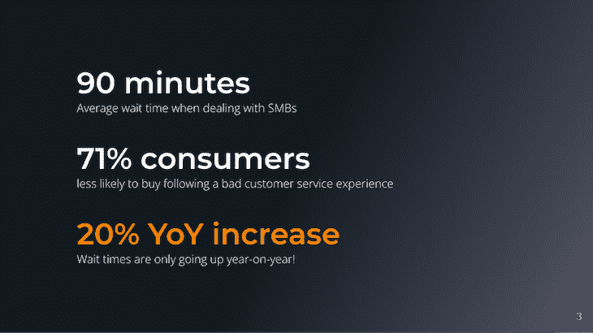
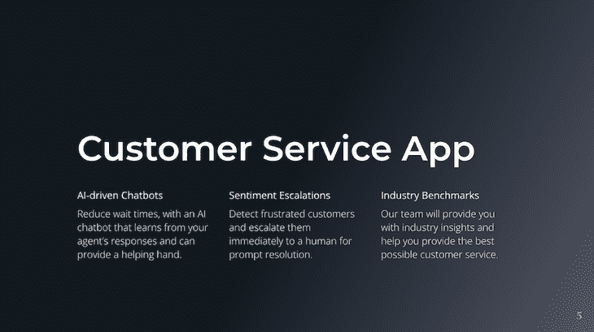
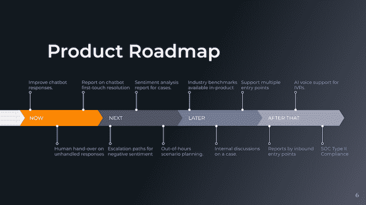

# 如何创建和交付有影响力的产品演示——LogRocket 博客

> 原文：<https://blog.logrocket.com/product-management/how-to-create-deliver-product-presentation/>

作为产品负责人，您工作的一个重要部分是与公司的其他团队(例如，工程团队、销售团队等)进行沟通和演示。).

做到这一点的最好方法之一是进行产品演示。在本指南中，我们将分享一些关于如何准备和交付有效的产品演示的技巧，这些技巧可以切入正题并[让利益相关者认同您的产品方向](https://blog.logrocket.com/product-management/build-consensus-product-direction-5-tips/)。

* * *

## 目录

* * *

## 如何组织你的产品展示

给出一个好的、简短的、清晰的产品展示可以用一种非常直接的方式来完成，这种方式有效地遵循了[痛苦-搅动-解决方案(PAS)](https://app.inkforall.com/pas-copywriting) 框架。

这个三步框架是一个很好的工具，可以帮助你围绕你的[产品战略](https://blog.logrocket.com/product-management/product-strategy-frameworks-examples/)构思一个令人信服的故事，并围绕一个共同的目标团结整个团队。

在此基础上，根据前三部分提供的信息，用适合受众的术语解释您计划做什么来解决客户的问题，以及您计划如何做。

按照这种结构，您的产品演示应该如下进行:

1.  [疼痛](#pain)
2.  [搅动](#agitate)
3.  [解决方案](#solution)
4.  你会怎么做？
5.  你会怎么做？

### 1.疼痛

这是你建立整个演示文稿并创造难忘的第一印象的机会。

你应该让这一部分简明扼要。在某些情况下，这可能是你与团队、高管、投资者、潜在客户或客户的第一次互动，所以一定要珍惜。

从形象地或字面地描述问题的图像开始，并添加一些文字。例如:

*   “这是你吗？”
*   “这是我们的客户”
*   “这是我们下一季度的重点”

痛点的一个很好的例子是人们过去为他们的软件产品寻求支持的方式:他们会发电子邮件或打电话给支持联系人，发送截图和附件，并解释(通常很糟糕)他们采取的步骤，以便代理可以尝试重现问题。

### 2.煽动

一旦你发现了问题，是时候鼓动它了——换句话说，让问题看起来尽可能的大和紧急。

这里的目标是让你的观众思考如果这个问题得到解决，事情会变得多好。

描述如果问题得不到解决的影响:不解决的后果是什么？再次强调，要让你的听众能够理解和理解。

这不是一张张幻灯片接一张幻灯片的[市场洞察和趋势分析](https://blog.logrocket.com/product-management/what-is-go-to-market-strategy-examples-guide/)，而是一个很好的地方，可以加入两三个关键数据来支持你的论点，并强调你要解决的问题。

例如:

### 3.解决办法

最后，是时候介绍你的解决方案了。在这里，您可以谈论您计划如何解决客户的问题。

请务必关注对客户最重要的[功能和优势](https://blog.logrocket.com/product-management/customer-feedback-why-you-should-seek-how-to-obtain/)。是什么让你的产品独一无二？人们为什么要关心？

理想情况下，你应该有一个形象，形象地或真实地描述一个成功的客户是什么样子。如果您引用了真实客户的话，明确表示第一张幻灯片中提到的疼痛已经停止，则加分。

你想要表达的语气是这样的，“不要害怕！有产品有解决方案。以下是它将如何帮助我们的用户解决他们的问题。”

### 4.你会怎么做？

你将如何帮助你的客户解决他们的问题？

使用能引起听众共鸣的语言描述产品的特点和优势。目标是帮助他们了解你的产品将如何改善客户的生活。

### 5.你会怎么做？

最后，你得到了大多数人都在寻找的幻灯片:产品路线图。

向您的听众解释您计划如何实现路线图中概述的目标。今天、明天以及以后，你计划关注什么？

您的演示文稿中的路线图部分也是展示实际产品的机会。

现场演示或视频是一种有效的推广工具，有助于加深理解。通过演示产品的使用，你可以帮助观众理解你的产品是如何解决客户问题的。

## 产品展示的目的是什么？

在创建和交付产品演示时，遵循 PAS 框架将有助于您说服内部利益相关者了解产品的价值，并[获得执行路线图所需的认同](https://blog.logrocket.com/product-management/how-to-build-product-roadmap-overview-examples/)。

一个有效的产品展示清楚地表达了问题，煽动其含义，介绍了解决方案，并概述了你将做什么和你将如何做。该框架旨在帮助产品经理围绕共同的目标团结产品和跨职能团队。

在你完成这些步骤的过程中，使用讲故事的技巧和[引用关键数据点](https://blog.logrocket.com/product-management/how-to-communicate-product-strategy/)有助于你吸引你的听众，并让他们明白关键点。这种产品展示形式适用于产品介绍、产品战略、季度启动会议、推销、[营销简报](https://blog.logrocket.com/product-management/product-marketing-manager-job-description-role-skills/)等等。

## 产品演示模板

[点击此处](https://docs.google.com/presentation/d/1ZGjejQVnwgtrloz1lNktoYveUvIRYZmySTXIpEuo32E/edit?usp=sharing)访问我用来创建本指南中引用的演示示例的模板。

要定制此[产品演示模板](https://docs.google.com/presentation/d/1ZGjejQVnwgtrloz1lNktoYveUvIRYZmySTXIpEuo32E/edit?usp=sharing)，选择**文件>制作一份副本**或将文件下载到您的电脑。

## 如何进行引人入胜的产品展示:4 个技巧

至此，你已经准备好了一份精彩的演示文稿。现在是时候交付了。

以下是一些建议，告诉你如何利用自己制作的令人信服的演示文稿，并让它散发出应有的魅力:

1.  [了解你的受众](#know-your-audience)
2.  从一声巨响开始
3.  [保持简洁](#keep-it-concise)
4.  [吸引你的观众](#engage-with-your-audience)

### 1.了解你的受众

进行有效演讲的第一步是了解你的听众:

*   你要向谁展示？
*   他们的需求和愿望是什么？
*   他们对主题有多了解？

回答这些问题将有助于你调整你的演讲，让它与你的听众产生共鸣。

* * *

订阅我们的产品管理简讯
将此类文章发送到您的收件箱

* * *

例如，如果你要向一群工程师做演示，你会想把重点放在你的产品的[技术方面。如果你要向一群销售人员做演示，你会想把重点放在如何有效地销售你的产品上。](https://blog.logrocket.com/product-management/technical-skills-product-managers-should-possess/)

通过了解谁是你的听众，你可以确保你的谈话要点击中了正确的音符。

### 2.轰轰烈烈地开始

你只有一次机会留下第一印象并吸引观众，所以用强有力、有影响力的词语强调问题，让它变得有价值。你演讲的前几分钟对于确定基调和抓住听众的注意力至关重要。

做到这一点的一个方法是以一个强有力的开场白开始，告诉你的观众从你的演讲中能期待什么。

例如，你可以先说一些有力且雄心勃勃的话，比如:“我们的新产品有可能彻底改变我们做生意的方式。”这会立刻激起你的听众的兴趣，并为你接下来的演讲做好准备。

### 3.保持简洁

说到演示，少就是多。没有人想耐着性子听完一个冗长的报告——他们会在你讲到精彩内容之前就走神了。

上例中使用的[产品演示模板](https://docs.google.com/presentation/d/1ZGjejQVnwgtrloz1lNktoYveUvIRYZmySTXIpEuo32E/edit#slide=id.g35f391192_00)仅包括五张幻灯片；没有必要超出这个范围。该模板非常通用，可以用于许多不同类型的受众。

用尽可能少的话表达你的观点。使用短句和要点代替长段落，抵制包含太多信息的冲动。

记住，如果有必要，你可以在以后提供更多的细节；对于核心的演示文稿，只需专注于击中关键点。

如果需要，添加一个附录，您可以根据受众跳转到该附录。例如，您可能有一个营销支出明细、按团队划分的工程资源，或者关于产品路线图的更多细节。

### 4.吸引你的观众

有效的展示不是单行道；它应该是互动的和吸引人的。

不要只是站在教室的前面给你的观众讲课。相反，试着让他们参与到你所说的话中。提出问题，邀请小组成员参与，鼓励讨论。

你的听众参与得越多，他们就越有可能记住你说的话——并有希望相信你的话。

## 结论

做一场有效的产品展示并不一定很难——只需要一点计划和准备。

遵循这些建议，你可以确保你的下一次产品展示顺利进行！

*精选图片来源:[icon scout](https://iconscout.com/icon/presentation-2166506)*

## [LogRocket](https://lp.logrocket.com/blg/pm-signup) 产生产品见解，从而导致有意义的行动

[LogRocket](https://lp.logrocket.com/blg/pm-signup) 确定用户体验中的摩擦点，以便您能够做出明智的产品和设计变更决策，从而实现您的目标。

使用 LogRocket，您可以[了解影响您产品的问题的范围](https://logrocket.com/for/analytics-for-web-applications)，并优先考虑需要做出的更改。LogRocket 简化了工作流程，允许工程和设计团队使用与您相同的[数据进行工作](https://logrocket.com/for/web-analytics-solutions)，消除了对需要做什么的困惑。

让你的团队步调一致——今天就试试 [LogRocket](https://lp.logrocket.com/blg/pm-signup) 。

[Luke Grimstrup Follow](https://blog.logrocket.com/author/lukegrimstrup/) Building [enform.io](https://www.enform.io/) to help product leaders save time, eliminate surprises, and streamline reporting. Product management leader in Melbourne, Australia.