# 如何在 React apps - LogRocket 博客中使用 Chakra UI 创建表单

> 原文：<https://blog.logrocket.com/how-to-create-forms-with-chakra-ui-in-react-apps/>

[Chakra UI](https://chakra-ui.com/) 是 React 应用的模块化组件库，使用[情感](https://emotion.sh/docs/introduction)和[风格系统](https://styled-system.com/)。在构建 React 应用程序时，利用隔离的 UI 组件来加速构建过程是有益的。

该库提供了一种使用实用工具来设计组件样式的便捷方法。例如，Chakra UI 中的按钮组件可以这样编写:

```
<Button color="primary" textAlign="center />
```

在本帖中，我们将使用 Chakra UI 构建一个登录表单。我在最近的一个项目中使用了这个 UI 库，并认为对它进行更多的探索可能是一个好主意。以下是该演示的最终结果:


## 安装依赖项

要开始使用 Chakra UI，第一步是安装这个组件库的依赖项及其对等依赖项。打开一个终端窗口，创建一个新的 React 项目，并安装这些依赖项:

```
npx create-react-app loginform

cd loginform

yarn add @chakra-ui/[email protected] @emotion/[email protected] @emotion/[email protected] [email protected]
```

## 添加一个`ThemeProvider`

查克拉用户界面提供了一个默认的主题，可以用来在黑暗和光明主题模式之间切换。使用 provider `ColorModeProvider`和`useColorMode` hook，可以轻松处理组件风格在这些主题模式之间的切换。默认主题也是可扩展的。

首先，在`App.js`文件中导入以下语句，并从`App`组件返回一个`ThemeProvider`。确保添加`CSSReset`组件来移除所有浏览器的默认样式。建议按照[官方文件](https://chakra-ui.com/getting-started#injecting-global-styles)这样做:

```
import React from 'react';
import {
  ThemeProvider,
  theme,
  ColorModeProvider,
  CSSReset
} from '@chakra-ui/core';
export default function App() {
  return (
    <ThemeProvider theme={theme}>
      <ColorModeProvider>
        <CSSReset />
      </ColorModeProvider>
    </ThemeProvider>
  );
}
```

`ColorModeProvider`将允许用户在黑暗和光明主题模式之间切换。该库中提供的大多数组件都与黑暗模式兼容。`theme`对象是应用程序的调色板、字体堆栈、字体大小、断点等等可以用自定义值定义的地方。

目前，如果您要运行开发服务器，您将会看到默认的黑暗模式，在浏览器窗口中没有文本。要启动开发服务器，请执行命令`yarn start`:

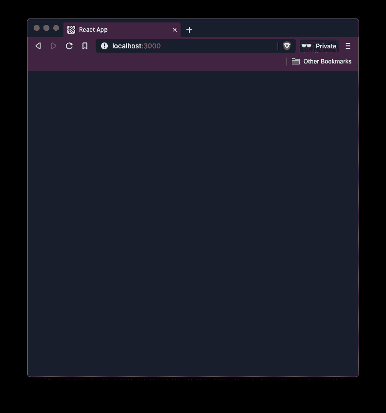

## 在主题之间切换

在本节中，让我们在`src/components/`目录中创建一个名为`ThemeToggler.js`的新组件文件。如果`components/`目录不存在，也创建它。然后，导入以下语句:

```
import React from 'react';
import { useColorMode, Box, IconButton } from '@chakra-ui/core';
```

React 应用中的`useColorMode`挂钩是用来改变颜色模式的。

组件从 HTML 中呈现一个等同于元素的元素。它可以用来创建响应性布局，也可以使用样式将它们作为道具传递。在`ThemeToggler`组件中，`Box`组件用于传递风格道具。

Chakra UI 组件库中的 style props 提供了许多速记变体，这确实增加了一点学习曲线(但哪个组件库没有)。

要找到风格道具的完整参考，请参考官方文档[这里](https://chakra-ui.com/style-props#style-props-reference)。您将使用的一些常用工具:

*   `m`为边距
*   `mt`对于 marginTop
*   `mr`对于边距权
*   `p`用于填充
*   `pt`对于 paddingTop
*   `pr`向右划水
*   `py`用于左填充和右填充

所有这些样式道具的缩写都与间距 CSS 属性有关。

在`ThemeToggler`文件中添加以下函数组件:

```
export default function ThemeToggler() {
  const { colorMode, toggleColorMode } = useColorMode();
  return (
    <Box textAlign="right" py={4} mr={12}>
      <IconButton
        icon={colorMode === 'light' ? 'moon' : 'sun'}
        onClick={toggleColorMode}
        variant="ghost"
      />
    </Box>
  );
}
```

`IconButton`组件是另一种仅呈现图标的便捷方式，但是它具有`Button`组件的功能，在被点击时执行动作。

Chakra UI 有一个默认的图标列表，但是你可以[添加自定义图标](https://chakra-ui.com/icon#adding-custom-icons)。

这里的`IconButton`将根据当前主题模式的状态在两个图标之间切换，这是由来自`useColorMode`钩子的`colorMode`属性决定的。来自同一个钩子的`toggleColorMode`属性帮助 React 应用程序在两种模式之间切换。`IconButton`上的`variant`属性会移除任何默认样式。

下面是一个在`IconButton`上没有`ghost`值的`variant`属性的例子:

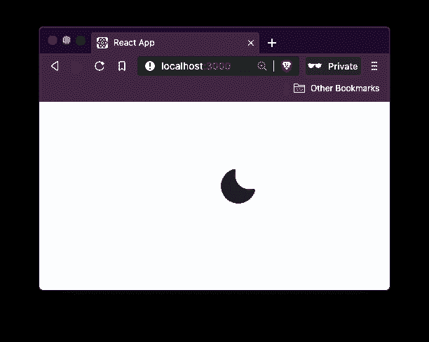

`IconButton`上`ghost`的值为`variant`的属性:

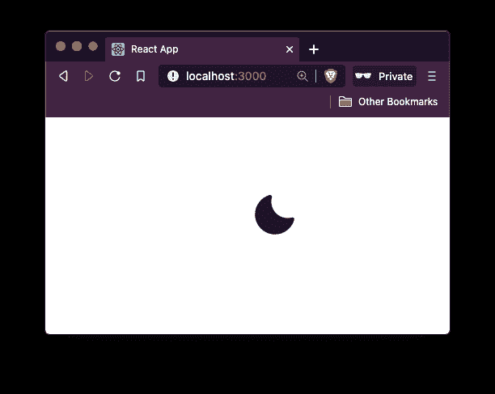

要使用这个主题转换器，在`App`组件中导入它，如下所示:

```
// rest of the import statements
import ThemeToggler from './components/ThemeToggler';
export default function App() {
  return (
    <ThemeProvider theme={theme}>
      <ColorModeProvider>
        <CSSReset />
        <ThemeToggler />
      </ColorModeProvider>
    </ThemeProvider>
  );
}
```

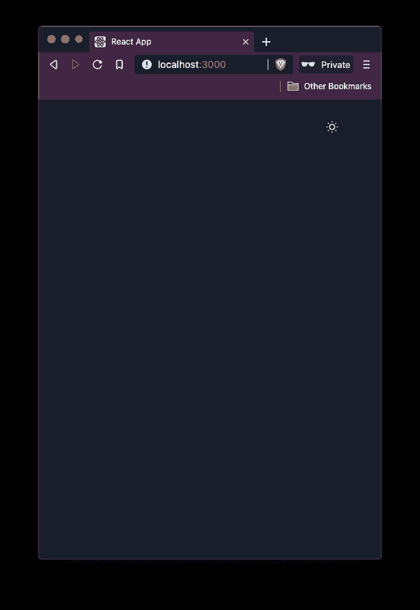

The value of the current theme is stored in the `localStorage` of the browser by the key to `darkMode` and is handled by the Chakra UI on its own:

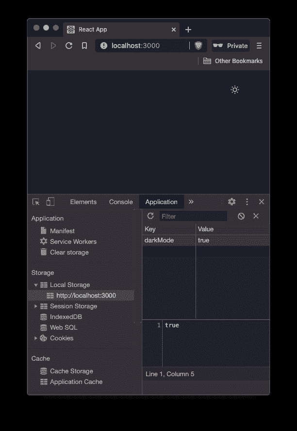

当主题模式切换时，`localStorage`中的值也随之改变:

创建登录表单用户界面

在本节中，让我们在`src/pages/`目录中创建一个名为`LoginForm.js`的新文件。这个功能组件将帮助显示一个用户登录的表单。该表单将包含两个输入字段以及一个按钮。首先导入以下语句:

## 然后，定义一个将要包装整个表单的`Flex`组件。这个组件只是一个已经应用了默认样式属性`display: flex`的`Box`组件。这意味着您可以使用包装器上的所有 flex 属性，如`flexDirection`、`alignItems`、`justifyContent`等等，作为道具。在这个包装器中，定义一个`Heading`组件:

## 现在，在`App.js`中导入这个组件:

使用表单组件，让我们添加一个登录表单:

```
import React from 'react';
import {
  Flex,
  Box,
  Heading,
  FormControl,
  FormLabel,
  Input,
  Button
} from '@chakra-ui/core';
```

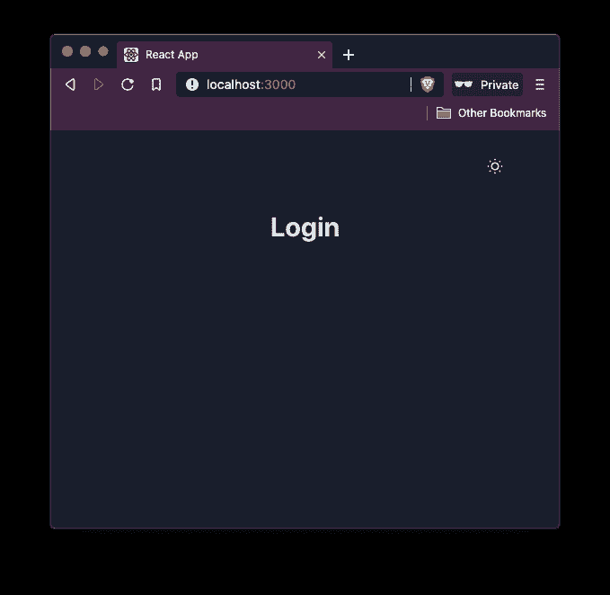

```
export default function LoginForm() {
  return (
    <Flex width="full" align="center" justifyContent="center">
      <Box p={2}>
        <Box textAlign="center">
          <Heading>Login</Heading>
        </Box>
      </Box>
    </Flex>
  );
}
```

`FormControl`组件提供了上下文，比如单个表单字段上的`isDisabled`和`isRequired`布尔值。这有助于创建用户认证表单或使用表单验证库，如 [Formik](https://amanhimself.dev/build-validate-forms-with-react-native-formik-yup/) 。让我们在两个输入字段中添加一个`isRequired`字段，在`FormLabel`上显示红色星号。该属性还将`Input`字段上的`aria-required`属性设置为真:

```
// ...
import LoginForm from './pages/LoginForm';
export default function App() {
  return (
    <ThemeProvider theme={theme}>
      <ColorModeProvider>
        <CSSReset />
        <ThemeToggler />
        <LoginForm />
      </ColorModeProvider>
    </ThemeProvider>
  );
}
```

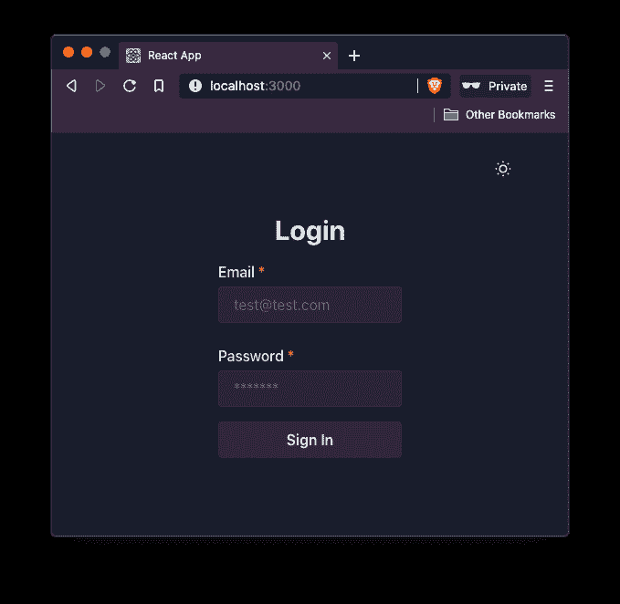

```
export default function LoginForm() {
  return (
    <Flex width="full" align="center" justifyContent="center">
      <Box p={2}>
        <Box textAlign="center">
          <Heading>Login</Heading>
        </Box>
        <Box my={4} textAlign="left">
          <form>
            <FormControl>
              <FormLabel>Email</FormLabel>
              <Input type="email" placeholder="[email protected]" />
            </FormControl>
            <FormControl mt={6}>
              <FormLabel>Password</FormLabel>
              <Input type="password" placeholder="*******" />
            </FormControl>
            <Button width="full" mt={4} type="submit">
              Sign In
            </Button>
          </form>
        </Box>
      </Box>
    </Flex>
  );
}
```

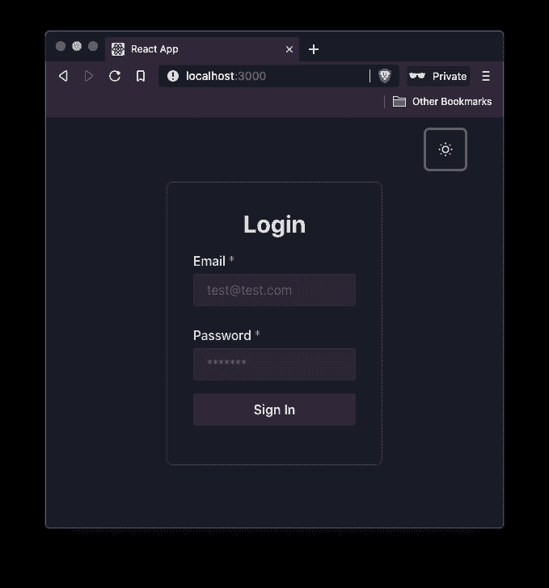

方框阴影速记属性使表单变得有趣。在光线模式下观看，如下:

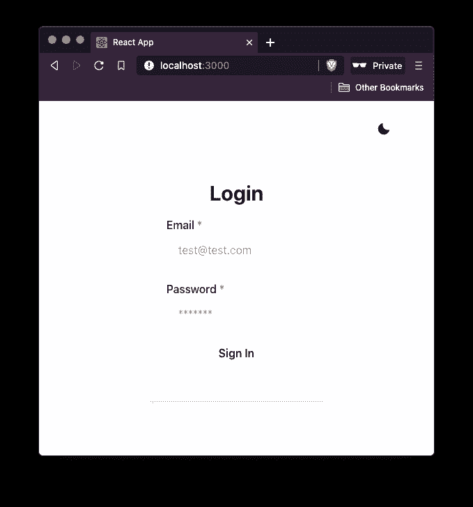

Let’s modify the first `Box` component that wraps the whole form to add some border width, border radius, and box-shadow to make it appear nice:

```
<Box p={8} maxWidth="500px" borderWidth={1} borderRadius={8} boxShadow="lg">
```

您可以使用`variant`和`variantColor`属性更改按钮的外观:

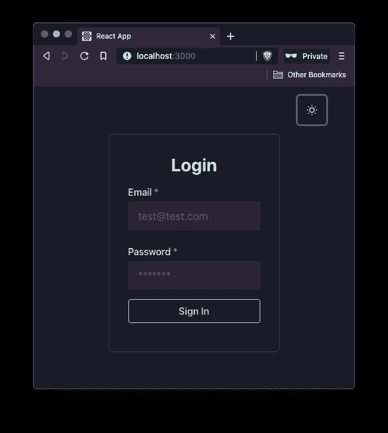

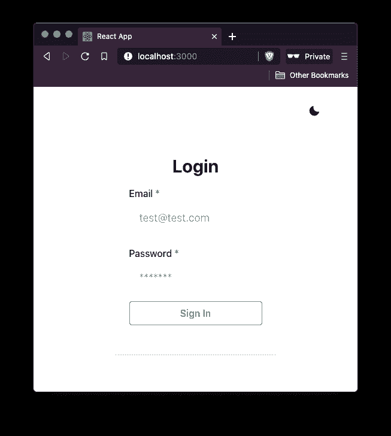

使用 useState 挂钩定义初始状态变量

```
<Button type="submit" variantColor="teal" variant="outline" width="full" mt={4}>
  Sign In
</Button>
```

登录表单现在只包含两个输入字段和一个登录按钮。可以看一下`src/components/Login.js`文件。由于每个`FormControl`组件上都有一个名为`isRequired`的道具来包装每个输入字段，用户现在无法登录 React 应用程序:

Different theme color values and variant values are provided by the Chakra UI library [here](https://chakra-ui.com/theme#colors):

点击登录按钮时会显示默认的工具提示:


## `useState`钩子返回数组中的两个值。第一个值是状态变量的当前值，第二个值是更新第一个值的函数的数组。这就是为什么第二个值以传统的前缀 fo `set`开始。尽管除了这个前缀之外，您可以给它起任何名字，这是 React 世界中的一个常见约定。钩子也接受一个表示初始状态的参数:

此外，定义一个`handleSubmit`方法，该方法理想地进行 API 调用，以查看用户的凭证是否与数据库中的凭证匹配。为了简洁起见，我们现在只在浏览器窗口的警告框中显示它们。稍后，将有一个 mock/fake API 调用来模拟用户的登录尝试。

```
<FormControl isRequired>
```

现在，修改表单。在`for`元素上，用`handleSubmit`方法的值添加`onSubmit`属性。在每个`Input`字段上，添加一个`onChang`道具，使用`event.currentTarget.value`捕捉用户的输入:

To keep track of the values for each input field lets add two state variables for `email` and `password` input field using `useState` hook.

现在返回浏览器窗口，尝试在表单字段中输入值，然后单击登录按钮:

```
// make sure to import the useState hook
import React, { useState } from 'react';
// ...
export default function Login() {
  const [email, setEmail] = useState('');
  const [password, setPassword] = useState('');
  const handleSubmit = event => {
    event.preventDefault();
    alert(`Email: ${email} & Password: ${password}`);
  };
  // ...
}
```

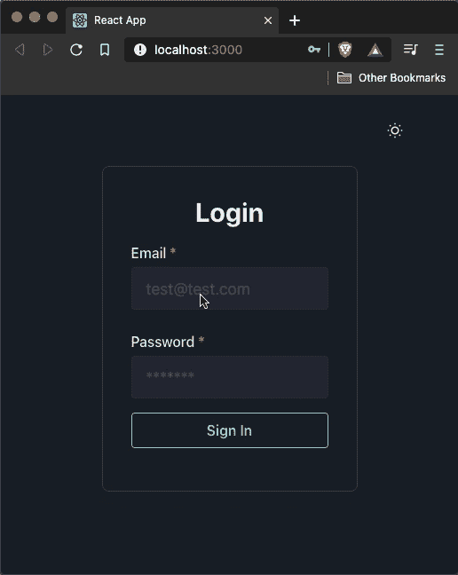

模拟登录 API 调用

```
<form onSubmit={handleSubmit}>
  <FormControl isRequired>
    <FormLabel>Email</FormLabel>
    <Input
      type="email"
      placeholder="[email protected]"
      size="lg"
      onChange={event => setEmail(event.currentTarget.value)}
    />
  </FormControl>
  <FormControl isRequired mt={6}>
    <FormLabel>Password</FormLabel>
    <Input
      type="password"
      placeholder="*******"
      size="lg"
      onChange={event => setPassword(event.currentTarget.value)}
    />
  </FormControl>
  <Button
    variantColor="teal"
    variant="outline"
    type="submit"
    width="full"
    mt={4}
  >
    Sign In
  </Button>
</form>
```

在本文中，让我们模拟一个用户使用异步函数输入有效凭证时的登录调用。这些凭证值的有效性将被硬编码。在`src/utils/`目录下创建一个名为`mockApi.js`的新文件。

函数`userLogin`将返回一个承诺。如果表单中输入的值与硬编码的值匹配，承诺将被解析，否则将失败。`setTimeout`函数将模拟 3 秒钟的 API 调用:

## 创建错误消息显示组件

当用户凭证无效时(即，与当前演示中的硬编码值不匹配)，输入字段上方会显示一个错误。在本节中，让我们创建一个可重用的`ErrorMessage`组件。

在`src/components/`目录中创建一个名为`ErrorMessage.js`的新文件。这个组件将利用`Alert`和来自`@chakra-ui/core`库的对等组件。它还将有一个属性值`message`来显示错误消息。这个道具的值是从`Login`组件传递过来的:

```
export const userLogin = async ({ email, password }) => {
  return new Promise((resolve, reject) => {
    setTimeout(() => {
      if (email === '[email protected]' && password === 'password') {
        resolve();
      } else {
        reject();
      }
    }, 3000);
  });
};
```

## 处理登录表单中的加载状态和错误消息

打开`pages/Login.js`组件，通过导入模拟 API 调用实用程序方法和错误消息组件开始:

接下来，添加两个状态变量来跟踪表单何时处于加载状态(即何时正在模拟 API 调用)以及错误消息本身。

```
import React from 'react';
import { Box, Alert, AlertIcon, AlertDescription } from '@chakra-ui/core';
export default function ErrorMessage({ message }) {
  return (
    <Box my={4}>
      <Alert status="error" borderRadius={4}>
        <AlertIcon />
        <AlertDescription>{message}</AlertDescription>
      </Alert>
    </Box>
  );
}
```

## 加载状态变量的默认值将为 false。当这个值为真时，让我们在表单组件中显示一个加载指示器。因此，也从 Chakra UI 库中导入`CircularProgress`组件:

API 调用模拟部分将在`handleSubmit`方法内部完成。表单一提交，加载状态就被设置为 true。接下来，使用`try-catch`语法可以处理模拟 API 调用。当用户输入与硬编码值相匹配的凭证值时，承诺将被解析。当承诺完成时，`isLoading`的值应该更新为 false。

```
// ...after other import statements
import { userLogin } from '../utils/mockApi';
import ErrorMessage from '../components/ErrorMessage';
```

在`catch`块中，`error`的值被设置为硬编码消息。此外，通过将`isLoading`的值更新回 false 并将电子邮件和密码更新为空字符串来重置表单。在 UI 部分，首先，添加一个条件，在`form`元素的正下方显示错误消息:

然后，更新`Button`组件的内容，以便在进行 API 调用时显示加载指示器:

```
import {
  Flex,
  Box,
  Heading,
  FormControl,
  FormLabel,
  Input,
  Button,
  CircularProgress
} from '@chakra-ui/core';
export default function Login() {
  const [email, setEmail] = useState('');
  const [password, setPassword] = useState('');
  const [error, setError] = useState('');
  const [isLoading, setIsLoading] = useState(false);
  const handleSubmit = async event => {
    event.preventDefault();
    setIsLoading(true);
    try {
      await userLogin({ email, password });
      setIsLoading(false);
    } catch (error) {
      setError('Invalid username or password');
      setIsLoading(false);
      setEmail('');
      setPassword('');
    }
  };
}
```

要查看显示的错误消息，请在每个输入字段中输入随机值:

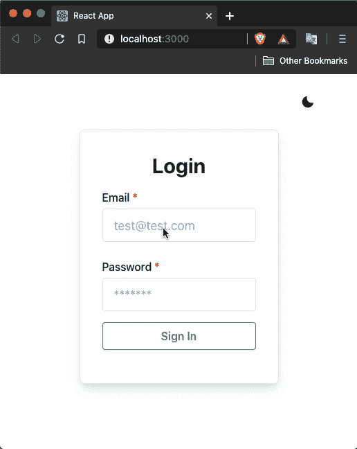

```
<form onSubmit={handleSubmit}>
  {error && <ErrorMessage message={error} />}
  {/* Previous JSX code */}
</form>
```

用户登录时如何处理

```
<Button variantColor="teal" variant="outline" type="submit" width="full" mt={4}>
  {isLoading ? (
    <CircularProgress isIndeterminate size="24px" color="teal" />
  ) : (
    'Sign In'
  )}
</Button>
```

在本节中，让我们跟踪用户的登录状态。当用户成功登录时，将显示一条成功消息和一个注销按钮。

首先从 Chakra UI 库中导入`Text`组件。然后定义一个名为`isLoggedIn`的状态变量来跟踪用户的登录状态。当 API 调用在`handleSubmit`方法中完成模拟时，将其值更新为 true:

## 同时更新表单的 JSX:

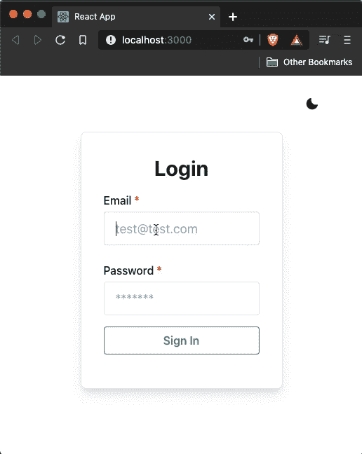

添加密码显示/隐藏功能

```
import {
  // ...
  Text
} from '@chakra-ui/core';
// ...
export default function Login() {
  //...
  const [isLoggedIn, setIsLoggedIn] = useState(false);
  const handleSubmit = async event => {
    event.preventDefault();
    setIsLoading(true);
    try {
      await userLogin({ email, password });
      setIsLoggedIn(true);
      setIsLoading(false);
    } catch (error) {
      setError('Invalid username or password');
      setIsLoading(false);
      setEmail('');
      setPassword('');
    }
  };
  // ...
}
```

Chakra UI 提供了一个`InputGroup`组件，可以用来对与单个输入字段相关的不同组件进行分组。要添加显示/隐藏密码功能，让我们使用这个组件来分组密码的输入字段组件。该组将有一个输入字段，一个右按钮元素，它将显示一个图标，指示密码当前是显示还是隐藏。

```
export default function Login() {
  //...
  return (
    <Flex width="full" align="center" justifyContent="center">
      <Box
        p={8}
        maxWidth="500px"
        borderWidth={1}
        borderRadius={8}
        boxShadow="lg"
      >
        {isLoggedIn ? (
          <Box textAlign="center">
            <Text>{email} logged in!</Text>
            <Button
              variantColor="orange"
              variant="outline"
              width="full"
              mt={4}
              onClick={() => setIsLoggedIn(false)}
            >
              Sign out
            </Button>
          </Box>
        ) : (
          <>
            <Box textAlign="center">
              <Heading>Login</Heading>
            </Box>
            <Box my={4} textAlign="left">
              <form onSubmit={handleSubmit}>
                {error && <ErrorMessage message={error} />}
                <FormControl isRequired>
                  <FormLabel>Email</FormLabel>
                  <Input
                    type="email"
                    placeholder="[email protected]"
                    size="lg"
                    onChange={event => setEmail(event.currentTarget.value)}
                  />
                </FormControl>
                <FormControl isRequired mt={6}>
                  <FormLabel>Password</FormLabel>
                  <Input
                    type="password"
                    placeholder="*******"
                    size="lg"
                    onChange={event => setPassword(event.currentTarget.value)}
                  />
                </FormControl>
                <Button
                  variantColor="teal"
                  variant="outline"
                  type="submit"
                  width="full"
                  mt={4}
                >
                  {isLoading ? (
                    <CircularProgress
                      isIndeterminate
                      size="24px"
                      color="teal"
                    />
                  ) : (
                    'Sign In'
                  )}
                </Button>
              </form>
            </Box>
          </>
        )}
      </Box>
    </Flex>
  );
}
```

从 Chakra UI 导入以下组件:

## 为了跟踪密码当前是否隐藏的布尔状态，让我们添加一个状态变量`showPassword`和一个用初始值`false`更新其值`setShowPassword`的方法到`useState`钩子。

然后，添加一个在密码输入字段的显示和隐藏模式之间切换的方法:

当在密码字段的可见性状态之间切换时，`Icon`值将是`Button`组件的值。同样，根据`showPassword`的值更改`Input`组件的`type`属性。

```
import {
  // ...
  InputGroup,
  InputRightElement,
  Icon
} from '@chakra-ui/core';
```

将密码的表单字段替换为下面的 JSX:

另外，通过手动将密码字段的 visibility 值更新为 false 来更新`handleSubmit`方法，以便当用户注销时，表单处于其重置状态:

```
export default function Login() {
  // ...
  const [showPassword, setShowPassword] = useState(false);
  const handlePasswordVisibility = () => setShowPassword(!showPassword);
  // ...
}
```

这是您将在浏览器窗口中得到的输出:

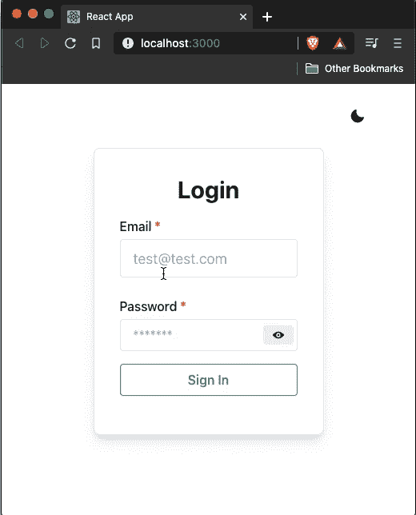

```
<FormControl isRequired mt={6}>
  <FormLabel>Password</FormLabel>
  <InputGroup>
    <Input
      type={showPassword ? 'text' : 'password'}
      placeholder="*******"
      size="lg"
      onChange={event => setPassword(event.currentTarget.value)}
    />
    <InputRightElement width="3rem">
      <Button h="1.5rem" size="sm" onClick={handlePasswordVisibility}>
        {showPassword ? <Icon name="view-off" /> : <Icon name="view" />}
      </Button>
    </InputRightElement>
  </InputGroup>
</FormControl>
```

结论

```
const handleSubmit = async event => {
  event.preventDefault();
  setIsLoading(true);
  try {
    await userLogin({ email, password });
    setIsLoggedIn(true);
    setIsLoading(false);
    setShowPassword(false);
  } catch (error) {
    setError('Invalid username or password');
    setIsLoading(false);
    setEmail('');
    setPassword('');
    setShowPassword(false);
  }
};
```

在利用内置 UI 组件开发 React 应用程序时，任何组件库都有其优势。但我喜欢 Chakra UI 库的地方在于，它提供了一个高度可定制的设计系统，包括创建自己的设计系统的样式实用程序、在主题之间切换的能力和 Flexbox。

这个项目的源代码可以在 [GitHub](https://github.com/amandeepmittal/blog-examples/tree/master/react/loginform-chakra-ui-complete) 获得。

## 链接

## 使用 LogRocket 消除传统反应错误报告的噪音

是一款 React analytics 解决方案，可保护您免受数百个误报错误警报的影响，只针对少数真正重要的项目。LogRocket 告诉您 React 应用程序中实际影响用户的最具影响力的 bug 和 UX 问题。

自动聚合客户端错误、反应错误边界、还原状态、缓慢的组件加载时间、JS 异常、前端性能指标和用户交互。然后，LogRocket 使用机器学习来通知您影响大多数用户的最具影响力的问题，并提供您修复它所需的上下文。

### 关注重要的 React bug—[今天就试试 LogRocket】。](https://lp.logrocket.com/blg/react-signup-issue-free)

## Cut through the noise of traditional React error reporting with LogRocket

[LogRocket](https://lp.logrocket.com/blg/react-signup-issue-free)

is a React analytics solution that shields you from the hundreds of false-positive errors alerts to just a few truly important items. LogRocket tells you the most impactful bugs and UX issues actually impacting users in your React applications.

[ ](https://lp.logrocket.com/blg/react-signup-general) [  ](https://lp.logrocket.com/blg/react-signup-general) [LogRocket](https://lp.logrocket.com/blg/react-signup-issue-free)

automatically aggregates client side errors, React error boundaries, Redux state, slow component load times, JS exceptions, frontend performance metrics, and user interactions. Then LogRocket uses machine learning to notify you of the most impactful problems affecting the most users and provides the context you need to fix it.

Focus on the React bugs that matter — [try LogRocket today](https://lp.logrocket.com/blg/react-signup-issue-free).