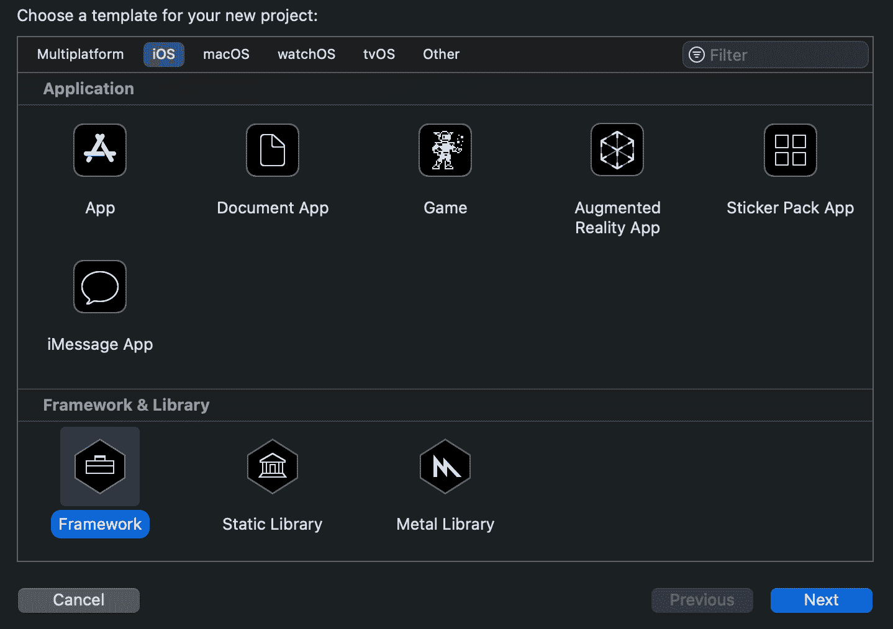
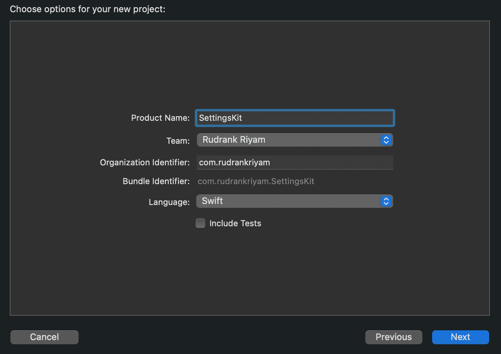
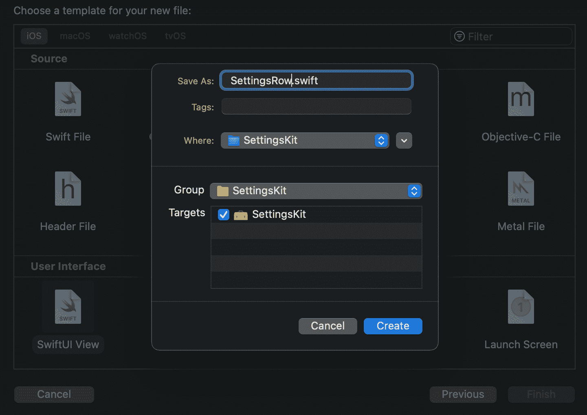
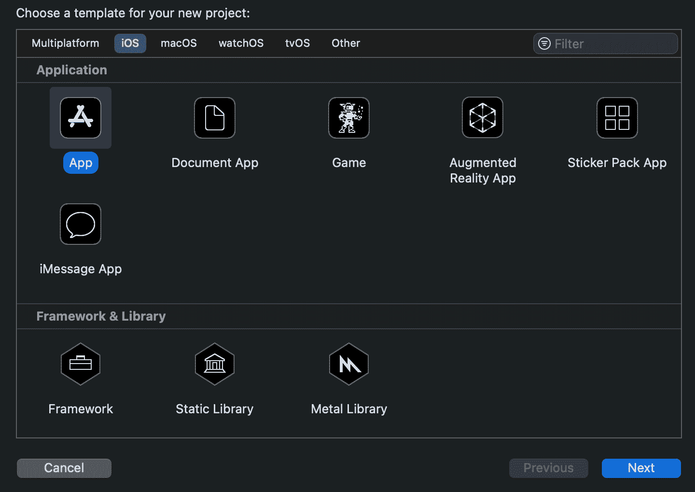
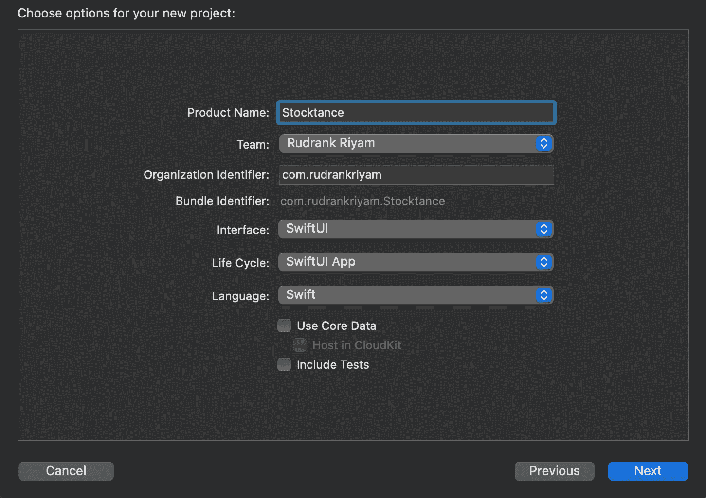
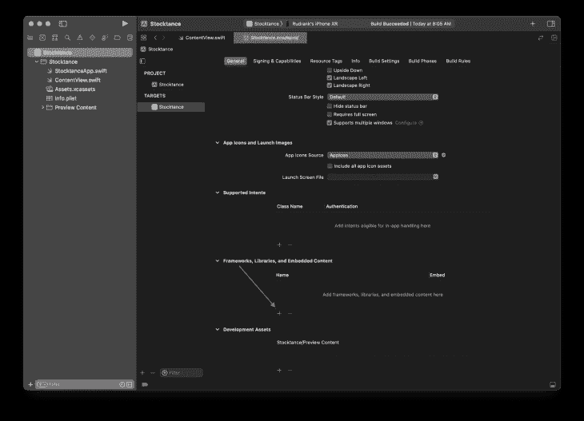
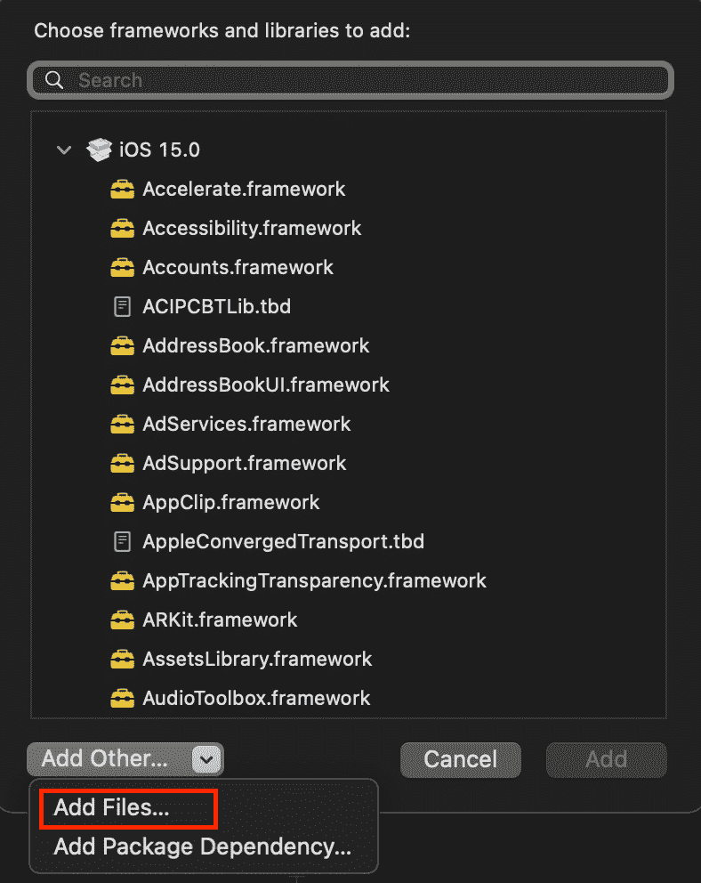
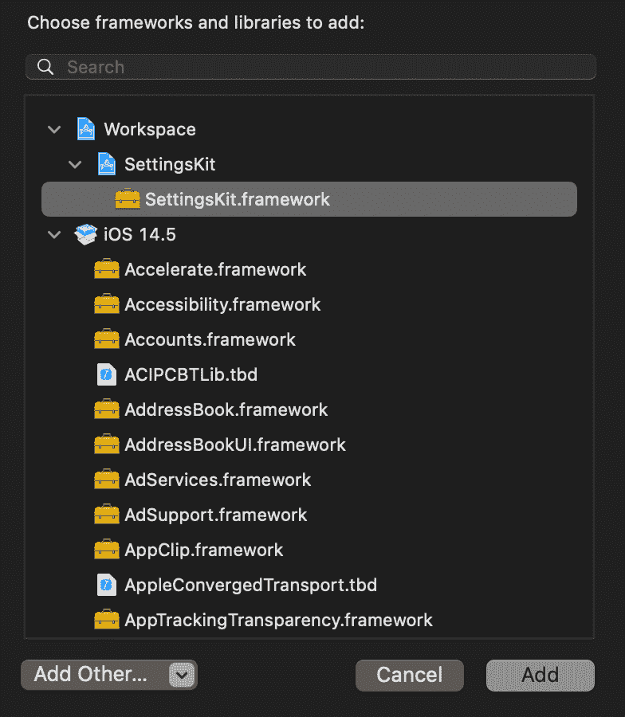
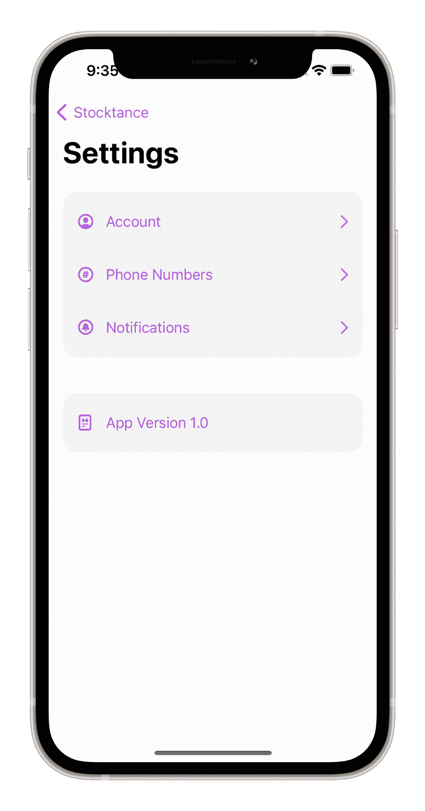
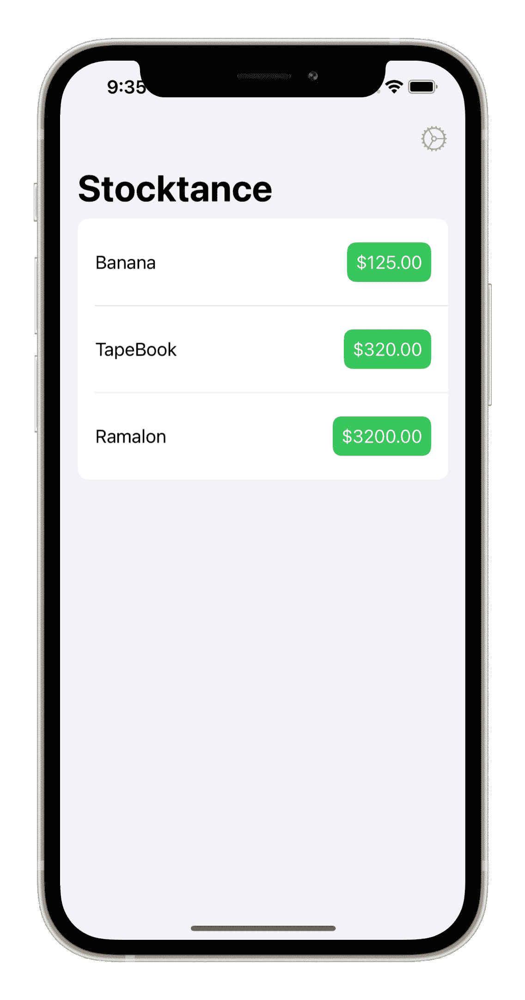

# 如何在 Swift 中创建框架

> 原文：<https://blog.logrocket.com/how-to-create-framework-swift/>

框架非常适合于模块化代码，将可重用的组件分解成单独的代码包。

例如，考虑一个提供录制屏幕功能的应用程序。我们将与记录相关的方法和类移到一个不同的框架中，将其命名为 RecordingKit。这个框架是在考虑可重用性的情况下创建的，也可以用于其他场景。此外，其他工程师可以在其中独立工作。

在本文中，我们将学习这些步骤:

*   创建一个框架
*   将其导入到项目中
*   在项目中使用它

为了跟上进度，您应该具备 Swift 语言的基础知识和使用 Xcode 的经验。

## 介绍

随着最近股市和加密货币的热潮，我们需要一个投资跟踪应用程序。这将分别跟踪证券交易所和一些加密货币的股票价格。

该应用程序需要一个设置屏幕，为了保持一致性，我们不想重复代码。因此，我们将创建一个名为 SettingsKit 的框架，以便在我们的应用程序中重用(将来可能会更多)。

## 创建新框架

打开 Xcode 并创建一个新项目。在 **iOS** 部分选择**框架**。



如下填写模板选项，然后点击**下一个**:

*   产品名称:设置套件
*   组织标识符:您希望用于您的框架的标识符。例如，`com.rudrankriyam.SettingsKit`
*   语言:Swift
*   取消选中**包括测试**选项



选择保存框架的目录，点击**创建**。

现在，创建一个新的 SwiftUI 视图，并将其命名为 SettingsRow.swift。确保检查目标中的框架。



将下面的代码复制到`SettingsRow`文件中:

```
public struct SettingsRow: View {
  private var title: String
  private var image: String
  private var showDisclosure: Bool

  /// A generic settings row which can be customised according to your needs.
  /// - Parameters:
  ///   - title: The title of the row.
  ///   - image: The SF symbol for the row.
  ///   - showDisclosure: Show disclosure icon for action or navigation.
  public init(_ title: String, image: String, showDisclosure: Bool = false) {
    self.image = image
    self.title = title
    self.showDisclosure = showDisclosure
  }

  public var body: some View {
    HStack(spacing: 8) {
      Image(systemName: image)
        .font(.headline)
        .frame(minWidth: 25, alignment: .leading)
        .accessibility(hidden: true)

      Text(title)

      Spacer()

      if showDisclosure {
        Image(systemName: "chevron.right")
          .accessibility(hidden: true)
      }
    }
    .padding(.vertical
    .foregroundColor(.accentColor)
  }
}

```

此视图可用于显示应用版本或版权的地方。在这种情况下，我们默认隐藏显示图标。由于我们想要访问框架本身之外的视图，并在我们自己的应用程序中使用它，我们将`struct`的访问级别更改为`public`。

另一个用例是对一行执行的操作。创建`SettingsActionRow`文件，并添加以下内容:

```
public struct SettingsActionRow: View {
  private var image: String
  private var title: String
  private var action: () -> ()

  /// A generic settings row which can be customised according to your needs.
  /// - Parameters:
  ///   - title: The title of the row.
  ///   - image: The SF symbol for the row.
  ///   - action: The custom action that you want to perform on tapping the row.
  public init(_ title: String, image: String, action: @escaping () -> ()) {
    self.image = image
    self.title = title
    self.action = action
  }

  public var body: some View {
    Button(action: action) {
      SettingsRow(title, image: image, showDisclosure: true)
    }
    .buttonStyle(PlainButtonStyle())
  }
}

```

客户端代码为它提供了一个动作；例如，在商店上查看应用程序或打开应用程序的社交帐户。

为了导航到另一个视图，我们创建了另一个名为`SettingsNavigationRow`的视图:

```
public struct SettingsNavigationRow<Destination: View>: View {
  private var title: String
  private var image: String
  private var destination: Destination

  /// A generic settings row which can be customised according to your needs.
  /// - Parameters:
  ///   - title: The title of the row.
  ///   - image: The SF symbol for the row.
  ///   - destination: The view to navigate to, after tapping the row.
  public init(_ title: String, image: String, destination: Destination) {
    self.image = image
    self.title = title
    self.destination = destination
  }

  public var body: some View {
    NavigationLink(destination: destination) {
      SettingsRow(title, image: image, showDisclosure: true)
    }
    .buttonStyle(PlainButtonStyle())
  }
}

```

在几个相似的行之后，我们使用第二种背景色将它们分组，就像在 iOS 设置屏幕中一样。添加以下修饰符:

```
public extension View {
  func settingsBackground(cornerRadius: CGFloat = 16,
                          innerPadding: CGFloat = 8,
                          outerPadding: CGFloat = 16) -> some View {
    self
      .padding(.horizontal, 16)
      .padding(.vertical, innerPadding)
      .background(RoundedRectangle(cornerRadius: cornerRadius,
                                   style: .continuous)
                    .fill(Color(.secondarySystemBackground)))
      .padding(outerPadding)
  }
}

```

这样，我们就创建了第一个可以在我们的应用中使用的框架！

## 创建新项目

打开 Xcode，选择**新建 Xcode 项目**，选择 **iOS** 表头下的 **App** 模板。



如下填写模板选项，然后点击**下一个**:

*   产品名称:Stocktance
*   组织名称:请随意填写
*   组织标识符:您用于应用程序的标识符
*   界面:SwiftUI
*   生命周期:SwiftUI 应用程序
*   语言:Swift
*   确保您已经取消选中了**使用核心数据**、**包括单元测试**和 **UI 测试**选项



选择一个目录来保存我们的项目，然后点击**创建**。

现在我们已经准备好了项目，我们将框架导入到我们的应用程序中。

## 将框架导入到项目中

有两种方法可以将项目添加到您的应用程序中:

*   将框架拖到项目导航器中，然后将框架添加到目标中
*   将框架添加到项目中，然后将框架添加到目标中

两者类型相似，所以我们倾向于后一种选择。在应用程序中，从项目导航器中选择项目，选择盘点目标，并滚动到**框架、库和嵌入内容**。



点击加号按钮，点击**添加其他…** ，选择**添加文件…**



导航到 SettingsKit 文件夹并选择它。我们已经将框架添加到项目中。要将其添加到我们的目标中，请再次单击加号按钮，您会在顶部找到 SettingsKit.framework。选择它以将其添加到我们的目标中。



现在，我们已经成功地将框架添加到了我们的应用程序中！是时候使用它了！

## 在项目中使用框架

在 Stocktance 中创建一个名为`SettingsView`的新 SwiftUI 文件，并在文件顶部导入我们的框架:

```
import SettingsKit

```

就像我们导入[苹果的 SwiftUI 框架](https://blog.logrocket.com/mastering-swift-fundamentals/)来利用他们所提供的一切一样，我们导入我们的框架来创建设置视图。

将以下内容添加到`SettingsView`:

```
struct SettingsView: View {
  let appVersion = Bundle.main.infoDictionary?["CFBundleShortVersionString"] as! String

  var body: some View {
    NavigationView {
      ScrollView {
        VStack {
          SettingsNavigationRow("Account", image: "person.crop.circle",
                                destination: Text("Accounts Screen"))

          SettingsNavigationRow("Phone Numbers", image: "number.circle",
                                destination: Text("Phone Screen"))

          SettingsNavigationRow("Notifications", image: "bell.circle",
                                destination: Text("Notifications Screen"))
        }
        .settingsBackground()

        VStack {
          SettingsRow("App Version \(appVersion)", image: "doc.append")
        }
        .settingsBackground()
      }
      .navigationTitle("Settings")
    }
  }
}

```

由于我们前面创建的框架，我们用几行代码就为设置屏幕创建了简单的视图。您也可以在任何其他应用程序中使用该框架来保持设置的一致性。

要在应用程序中添加`SettingsView`，请在 ContentView.swift 中复制以下内容:

```
struct Stock {
  var name: String
  var price: Double
}

extension Stock {
  static let testStocks = [Stock(name: "Banana", price: 125),
                           Stock(name: "TapeBook", price: 320),
                           Stock(name: "Ramalon", price: 3200)]
}

struct ContentView: View {
  var body: some View {
    NavigationView {
      List(Stock.testStocks, id: \.name, rowContent: WatchlistRow.init)
        .navigationTitle("Stocktance")
        .toolbar {
          NavigationLink(destination: SettingsView()) {
            Image(systemName: "gear")
          }
        }
    }
    .accentColor(.purple)
  }
}

struct WatchlistRow: View {
  var stock: Stock

  var body: some View {
    HStack {
      Text(stock.name)

      Spacer()

      Text("$" + String(format: "%.2f", stock.price))
        .foregroundColor(.white)
        .padding(8)
        .background(RoundedRectangle(cornerRadius: 8).fill(Color(.systemGreen)))
    }
    .padding(.vertical)
  }
}

```

运行应用程序以查看您的框架代码的运行情况！





## 结论

随着应用程序的扩展，将代码分解成单独的组件并将可重用的块分解成框架是一个很好的计划。例如，您可以将网络层作为一个框架，与主应用程序隔离开来。或者用于处理分析的 AnalyticsKit。如果提供商发生变化，您只需在框架中进行更改，因为主要实现与应用程序是分离的。

为了将您的框架作为开源库共享或与团队内部共享，您可以使用 [Swift Package Manager](https://swift.org/package-manager/) 来管理代码的分发。

## 使用 [LogRocket](https://lp.logrocket.com/blg/signup) 消除传统错误报告的干扰

[](https://lp.logrocket.com/blg/signup)

[LogRocket](https://lp.logrocket.com/blg/signup) 是一个数字体验分析解决方案，它可以保护您免受数百个假阳性错误警报的影响，只针对几个真正重要的项目。LogRocket 会告诉您应用程序中实际影响用户的最具影响力的 bug 和 UX 问题。

然后，使用具有深层技术遥测的会话重放来确切地查看用户看到了什么以及是什么导致了问题，就像你在他们身后看一样。

LogRocket 自动聚合客户端错误、JS 异常、前端性能指标和用户交互。然后 LogRocket 使用机器学习来告诉你哪些问题正在影响大多数用户，并提供你需要修复它的上下文。

关注重要的 bug—[今天就试试 LogRocket】。](https://lp.logrocket.com/blg/signup-issue-free)