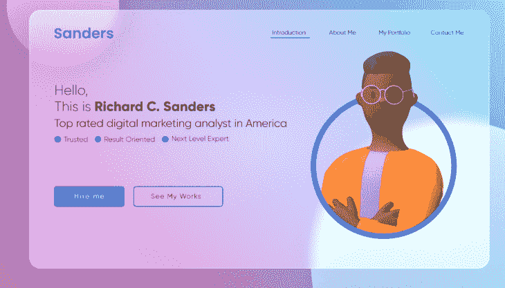
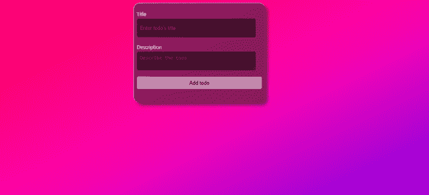
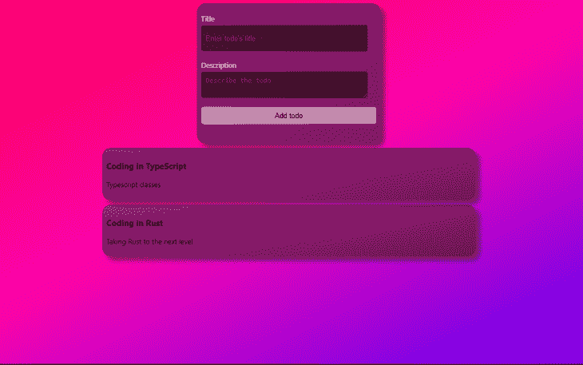

# 如何在 React 中创建玻璃形态效果

> 原文：<https://blog.logrocket.com/how-to-create-glassmorphism-effect-react/>

Glassmorphism 是一个很酷的 UI 设计趋势，它允许你在你的应用程序作品中创建一个令人惊叹的玻璃幻觉。它还可以提供一种冷若冰霜的效果，感觉像一个模糊或浮动的图像。这在你的 UI 中创建了一个视觉层次，允许你将注意力吸引到你想要突出显示的内容上。

这是一个具有玻璃形态效果的作品集网站标题的例子:



[Image source](https://www.behance.net/gallery/113623921/Portfolio-Website-Header-in-Glass-morphism)

Glassmorphism 通过为位于背景上方的对象创建半透明背景的对比来实现这一点。

本指南将讨论 glassmorphism 的概念，并逐步演示如何在 React 应用程序中实现这种效果。我们将实现一个简单的待办事项应用程序，并在表单和每个任务卡上实现 glassmorphism 效果。

## 先决条件

为了理解本文，您应该具备以下条件:

*   React 的工作知识
*   物料界面的工作知识
*   [你电脑上安装的 Node.js](https://blog.logrocket.com/tag/node/) 。

## 使用 Create React App 设置 React 应用程序

[Create React App](https://reactjs.org/docs/create-a-new-react-app.html) 是 React 团队提供的一个工具，允许你在 React 中引导一个单页面应用。

导航到您选择的项目目录，并使用 TypeScript 和以下命令初始化 React 应用程序:

```
npx creat-react-app react-glassmorphism-app --template typescript

```

然后转到新创建的 React 应用程序目录:

```
cd react-glassmorphism-app

```

并启动 React 开发服务器来检查引导的样板文件是否在工作:

```
npm run start 

```

在您的默认浏览器上，样板文件 React 页面将在`[http://localhost:3000/](http://localhost:3000/)`加载，以表明一切正常。

## 实现待办事项表单

要创建一个新任务，我们需要设置一个表单，允许用户添加任务的详细信息，然后将其添加到待办事项列表中。导航到`src/App.tsx`并执行如下图所示的待办事项表单。

在顶部导入`App.css`。我们将使用该文件添加 CSS 类来设计待办事项表单和任务卡的样式:

```
import './App.css';

```

编辑渲染函数，添加一个带有`title`和`description`字段的表单，如下所示:

```
<div className="todos-container">
    <form className="form">
        <div className="form-group">
            <label htmlFor="title">Title</label>
            <input type="text" id="title" placeholder="Enter todo's title" name="title" required />
        </div>
        <div className="form-group">
            <label htmlFor="description">Description</label>
            <textarea id="description" placeholder="Describe the todo" name="description" required />
        </div>
        <div className="form-group">
            <button type="submit" class="form-submit-btn">
                Add todo
            </button>
        </div>
    </form>
</div>

```

这将创建一个具有简单形式的`todos-container`。该表单将有用于添加任务标题的字段`title`，用于添加任务描述的字段`description`，以及用于提交详细信息的按钮`submit`。

下一步是设计这个表单的样式。导航到`src/App.css`文件并添加以下样式。

要设置`todos-container`类的样式:

```
.todos-container{
    /* Entire page width */
    width:100%;
    /* Entire page height */
    height:100vh;
    /* Responsive layout */
    display:flex;
    /* Display on top of the other */
    flex-direction: column; 
    /* Display horizontally at the center */ 
    align-items: center;
    /* Smooth transition to bottom right with different colors */
    background-image: linear-gradient(to bottom right, #fc0345,#fc03b1,#4a03fc);
    /* To cover the entire screen */
    background-size:cover;
    /* Image position */
    background-position:center;
    /* To not repeat the image beyond it's scale */
    background-repeat:no-repeat;
}

```

要设置`form`类的样式:

```
.form{
    /** Sizeable width for the form **/
    width:400px;
    /** Sizeable height for the form **/
    height:300px;
    /** Black color with opacity **/
    background-color:rgba(0,0,0,0.5);
    /** Responsive layout **/
    display:flex;
    /** One element on top of the other **/
    flex-direction:column;
    /** Vertically at the center **/
    justify-content: center;
    /** Smooth corners **/
    border-radius:10px;
    /** Top, bottom, right, and left spacing between form and it's content **/
    padding:20px;
    /** Spacing from the top **/
    margin-top:10px;
}

```

要设置`form-group`类的样式:

```
.form-group{
    /** Bottom space between one form-group and the other **/
    margin-bottom:20px;
    /** Responsive layout **/
    display: flex;
    /** One element on top of the other **/
    flex-direction: column;
}

```

要设计`label`的样式:

```
.form-group label{
    /** Medium font size **/
    font-size:16px;
    /** Visible color **/
    color:white;
    /** Bottom space between it and the input form **/
    margin-bottom:5px;
}

```

要设置表单输入的样式:

```
.form-group input[type="text"],textarea{
    /** Size-able width of the input **/
    width:90%; 
    /** Size-able height of the input **/
    height:40px; 
    /** Smooth corners on all edges **/
    border-radius:5px;
    /** No line sorrounding the input **/ 
    border:none;
    /** Top, right, bottom, right spacing to where content starts **/
    padding:10px;
    /** Medium font **/
    font-size:16px;
    /** Visible color **/
    color:white;
    /** Dark background with some opacity **/
    background-color:rgba(0,0,0,0.5); 
}

```

要设置`submit`表单按钮的样式:

```
.form-group .form-submit-btn{
    /** Take up the entire available width **/
    width:100%; 
    /** Sizeable height **/
    height:40px; 
    /** Smooth corners at all edges **/
    border-radius:5px;
    /** No line on the outline **/
    border:none;
    /** Greyish color **/
    background-color:rgba(255,255,255,0.5);
    /** Color of text **/
    color:black;
    /** Medium sized font **/
    font-size:16px
    /** Display a pointer when mouse is over it **/
    cursor:pointer;
}

```

## 向 React 应用程序添加玻璃形态效果

为了给我们的表单添加 glassmorphism 效果，我们将把以下样式添加到我们的`.form`类中:

作为背景图像的线性渐变:

```
/** Smooth transition to the bottom from a greyish to a less greyish color **/
background-image:linear-gradient(to bottom right, rgba(255,255,255,0.2), rgba(255,255,255,0));

```

背景滤镜:

```
/** A blur effect behind the form **/
backdrop-filter: "blur(10px)"; 

```

箱形阴影:

```
/** Thick box shadow with a greyish background on the right, bottom, with a blurred shadow **/
box-shadow: 10px 10px 10px rgba(30,30,30,0.5);

```

添加这些样式后，刷新您之前打开的`[http://localhost:3000/](http://localhost:3000/)`标签。该表单应应用以下玻璃态效果:



## 使表单具有响应性

为了使表单具有响应性，我们将获取用户输入并将它们存储在组件中的一个状态中。导航到`src/App.tsx`文件并执行以下操作:

从`react`导入`useState`钩子:

```
import {useState} from 'react';

```

为待办事项定义一个界面。一个界面将描述待办事项列表中每个任务的结构:

```
interface Todo {
    title: string;
    description: string;
}

```

定义状态:

```
// our saved todos starting with an empty string
const [todos, setTodos] = useState([] as Todo[]); 
// title of a todo starting as an empty string
const [title, setTitle] = useState('' as string); 
// description of a todo starting as an empty string
const [description, setDescription] = useState('' as string); 

```

向标题字段添加一个`onChange`事件。该事件将获取用户的输入，并将其保存在当前标题的状态中。此外，将标题的值设置为状态中的当前标题:

```
<input type="text" onChange={e => setTitle(e.target.value)} id="title" placeholder="Enter todo's title" name="title" value={title} required/>

```

向描述字段添加一个`onChange`事件。该事件将获取用户的输入，并将其保存在当前描述的状态中。此外，将 description 的值设置为状态的当前描述:

```
<textarea id="description" onChange={e => setDescription(e.target.value) } placeholder="Describe the todo" name="description" value={description} required />

```

构造一个函数来处理表单提交事件:

```
const handleSubmit = (e: React.FormEvent<HTMLFormElement>) => {
    // Prevent executing the default form submission event
    e.preventDefault();
    // Structure our todo from the current state
    const todo = {
    title,
    description,
    };
    // Add the todo to the state
    setTodos([...todos, todo]);
    // Clean the title state
    setTitle('');
    // Clean the description state
    setDescription('');
}; 

```

最后，将函数连接到表单:

```
<form className="form" onSubmit={handleSubmit}>

```

## 显示具有玻璃形态效果的任务卡

保存任务后，我们需要向用户展示它们。我们将检查我们的状态是否保存了任务。如果有，我们就通过它们来绘制地图。如果没有，我们会显示一条消息，说明我们没有保存的任务。

在表单之后，我们将添加一个条件来检查我们是否保存了任务。如果任务已经保存，我们将遍历它们:

```
{
    todos.length > 0 ? (
        <ul className="todos-list">
        {
          todos.map((todo, index) => (
            <li key={index} className="todo-item">
              <h3>{todo.title}</h3>
              <p>{todo.description}</p>
            </li>
          ))            
        }
      </ul>
    ) : (
        <p className="no-todos">No todos yet</p>
    )
}

```

首先，你会看到文本`No todos` `yet`。但是，如果您填写并提交表单，您将能够看到您的任务。您还应该注意，当您刷新页面时，您将看不到之前保存的任务，因为它们存储在状态中。

让我们给`no-todos`类添加一些样式，使其更加可见。导航到`src/App.css`文件并实现以下样式:

```
.no-todos{
    /** White text color **/
    color:white
    /** Medium font **/
    font-size: 20px;
    /** Bold style **/
    font-weight: bold;
}

```

要设置`todos-list`类的样式:

```
.todos-list{
    /** Top and bottom outer spacing of 10px and centered **/
    margin: 10px auto;
    /** No inner spacing **/
    padding:0px; 
    /** No list style **/
    list-style:none;
    /** Half of the parent's width **/
    width: 50%;  
}

```

要设置`todo-item`类的样式:

```
.todo-item{
    /** Black with opacity **/
    background-color:rgba(0,0,0,0.5);
    /** Smooth transition from a greyish to a less greyish color **/
    background-image:linear-gradient(to bottom right, rgba(255,255,255,0.2), rgba(255,255,255,0)); 
    /* A blur effect behind the card */
    backdrop-filter: "blur(10px)"; 
    /** A think greyish shadow for the card to the right, bottom with a blurred shadow **/
    box-shadow: 10px 10px 10px rgba(30,30,30,0.5);
    /** Inner spacing between elements **/
    padding: 10px; 
    /** Smooth corners on all edges **/
    border-radius:20px;
    /** Bottom spacing **/
    margin-bottom:10px; 
}

```

确保您的开发服务器仍在运行，并且您的页面应该类似于下图:



## 结论

一般的 glassmorphism 想法是在物体上有一个半透明的模糊，给人磨砂玻璃的感觉。它主要使用`backdrop-filter`来模糊这些属性。可以修改其他 CSS 属性，如颜色、边框半径、边框和阴影，以适应您的应用程序偏好。glassmorphism 效果补充了独立的设计组件，如内容卡、导航栏和侧边栏。

我希望这篇文章对你有帮助！

## [LogRocket](https://lp.logrocket.com/blg/react-signup-general) :全面了解您的生产 React 应用

调试 React 应用程序可能很困难，尤其是当用户遇到难以重现的问题时。如果您对监视和跟踪 Redux 状态、自动显示 JavaScript 错误以及跟踪缓慢的网络请求和组件加载时间感兴趣，

[try LogRocket](https://lp.logrocket.com/blg/react-signup-general)

.

[ ](https://lp.logrocket.com/blg/react-signup-general) [](https://lp.logrocket.com/blg/react-signup-general) 

LogRocket 结合了会话回放、产品分析和错误跟踪，使软件团队能够创建理想的 web 和移动产品体验。这对你来说意味着什么？

LogRocket 不是猜测错误发生的原因，也不是要求用户提供截图和日志转储，而是让您回放问题，就像它们发生在您自己的浏览器中一样，以快速了解哪里出错了。

不再有嘈杂的警报。智能错误跟踪允许您对问题进行分类，然后从中学习。获得有影响的用户问题的通知，而不是误报。警报越少，有用的信号越多。

LogRocket Redux 中间件包为您的用户会话增加了一层额外的可见性。LogRocket 记录 Redux 存储中的所有操作和状态。

现代化您调试 React 应用的方式— [开始免费监控](https://lp.logrocket.com/blg/react-signup-general)。