# 如何用 JavaScript 创建 NFTs-log rocket 博客

> 原文：<https://blog.logrocket.com/how-to-create-nfts-with-javascript/>

2021 年 2 月，Figma 首席执行官 Dylan Fields 以 750 万美元的价格出售了一件 [NFT 艺术品。同样，Twitter 的联合创始人杰克·多西以 2915835.47 美元](https://www.forbes.com/sites/alexkonrad/2021/03/18/figma-ceo-dylan-field-talks-cryptopunks-nft-beeple-metaverse/?sh=4de05bc85a1d)的价格出售了他作为 [NFT 在 Twitter 上的第一条推文。](https://www.theverge.com/2021/3/22/22344937/jack-dorsey-nft-sold-first-tweet-ethereum-cryptocurrency-twitter)


NFT(不可替代的令牌)是一项迷人的新技术，它以数字方式代表资产的所有权。在本教程中，我们将介绍一些重要的背景信息，设置第三方服务，并最终编码和部署我们自己的 NFT 到 Ropsten Testnet。

我们开始吧！

## 背景资料

在创建我们自己的 NFT 之前，让我们看一下使 NFTs 工作的技术和特性。

### 可替代与不可替代

[可替代性](https://www.investopedia.com/terms/f/fungibility.asp#:~:text=Fungibility%20is%20the%20ability%20of,equal%20value%20between%20the%20assets.)本质上是将一件物品换成相同价值的类似物品的能力。考虑一张五美元的钞票。它总是等于世界上任何地方的相同数量。你可以把五张一美元的钞票换成一张五美元的钞票，它们的价值始终相同。

另一方面，不可替代的项目在相互比较时不具有相同的价值。例如，蒙娜丽莎的精确复制品在价值上与原画不相等，尽管在各方面都是一样的。不可替代项目具有固有的独特性，不能被视为等同于任何其他项目。

物料可以是可替代的，也可以是不可替代的。例如，虽然飞机经济舱的两个座位价值相同，但一个人可能会对靠窗的座位赋予情感价值，从而降低其他座位对这个人的价值。

### 区块链

区块链是一个记录交易的公共数据库或数字分类账。它在作为该链一部分的几个计算机系统中被复制。我们将在以太坊区块链建造我们的 NFT。

### 铸造 ERC721 代币

铸造是首次创造某物的过程，或者在我们的情况下，在区块链上发布我们的 [ERC721 令牌](https://docs.alchemy.com/alchemy/tutorials/how-to-create-an-nft/how-to-mint-a-nft)的唯一实例。 [ERC-721](https://ethereum.org/en/developers/docs/standards/tokens/erc-721/) 是创建 NFT 的标准，ERC721 令牌是发布到区块链以太坊的数字内容的唯一表示。没有两个令牌是完全相同的，所以每次您用相同的代码块创建一个新令牌时，都会生成一个新地址。

### 智能合同和非功能性交易

[智能合约](https://ethereum.org/en/developers/docs/smart-contracts/)是部署在区块链上的简单程序，按原样运行，这意味着它们不受用户控制。我们可以使用智能合约来创建和跟踪我们的令牌。

NFT 是数据的数字存储，符合 ERC-721 标准，位于公共区块链上。NFT 包含关于他们所代表的资产的信息或数据，可以是像 Tweet 这样的数字项目，也可以是像 [hoodie](https://www.theguardian.com/fashion/2021/apr/15/virtual-hoodie-sells-non-fungible-token-nft-overpriced) 这样的物理项目。

如果智能合约实现了 ERC-721 标准，则可以将其视为 NFT，而 NFT 就是智能合约的一个实例。每次我们铸造一个新的 NFT，我们使用智能合同代码已经部署到区块链。

### 公共网络:Mainnet 与 Testnet

以太坊使用多个网络。生产中使用的网络通常称为 Mainnet，其他用于测试的网络称为 Testnet。我们将把我们创建的 NFT 部署到 [Ropsten Testnet](https://ethereum.org/en/developers/docs/networks/) ，这是一个以太坊的工作验证测试网。

请注意，当我们最终将我们的 NFT 部署到生产或 Mainnet 时，我们在 Ropsten Testnet 上的事务历史和余额将不会继续存在。可以把 Testnet 想象成一个公共的登台/开发环境，把 Mainnet 想象成一个生产环境。

### 专用网络

如果网络的节点未连接到公共区块链，则该网络被视为私有网络。您可以在私有网络(如本地机器)或一组机器(如联合体网络)上运行以太坊区块链，但不能在 Mainnet 或 Testnet 上访问。

在像内部网这样的一组机器上运行以太坊区块链将需要使用一个[节点](https://ethereum.org/en/developers/docs/nodes-and-clients/)来验证交易，这是一个运行在客户端上的以太坊软件，用于验证块和交易数据。

HardHat 和 [Ganache](https://www.trufflesuite.com/ganache) 是以太坊区块链开发环境的两个例子，您可以在本地机器上运行它们来编译、测试、部署和调试您的智能合约应用程序。

我们将在公共网络上运行我们的应用程序，这样任何连接到网络的人都可以访问它。

### 龙头

为了测试我们的应用程序，我们需要从一个水龙头中获取以太(ETH)，即以太坊加密货币。水龙头，像 [Ropsten 水龙头](https://faucet.ropsten.be/)，是允许你指定并发送测试 ETH 到一个地址的网络应用，然后你可以用它来完成测试网上的交易。

交易所的 ETH 价格由任何特定时间 Mainnet 上发生的交易决定。如果您选择在私有网络上运行您的以太坊应用程序，您不需要测试 ETH。

### 节点和客户端

如前所述，节点验证数据块和事务数据。你可以使用像 [Geth](https://geth.ethereum.org/downloads/) 和 [OpenEthereum](https://github.com/openethereum/openethereum/releases/) 这样的客户端创建自己的节点，并通过验证区块链上的交易和块来为以太坊区块链做出贡献。

你可以跳过创建自己的节点的过程，转而使用一个托管在云上的节点，它有一个像 [Alchemy](https://www.alchemyapi.io/) 这样的[节点即服务](https://ethereum.org/en/developers/docs/nodes-and-clients/nodes-as-a-service/)平台。我们可以快速地从开发转移到生产，并确保我们获得应用程序的重要指标。

我们将使用 Alchemy API 将我们的应用程序部署到 Ropsten 区块链。Alchemy 被描述为区块链的 AWS，它提供了开发者工具，让我们能够洞察我们的应用程序是如何运行的。

## 建造 NFT

### 先决条件

*   Node.js 和 npm
*   JavaScript 的基础知识

我喜欢摄影，在我的移动设备上拍了很多照片。保护我的作品还有什么比铸造一个 NFT 更好的方法呢？我可以把它转让给任何喜欢我照片的人。然后，他们可以使用 Ropsten Testnet 或 Mainnet 上的 NFT 数据来证明他们拥有原始图像的权利。

我们将创建一个 NFT 来标识我在下面的 [Osun 河](https://en.wikipedia.org/wiki/Osun_river)拍摄的照片，该河被认为具有独特的治疗能力。


### 创建一个炼金术账户

我们将使用[炼金术](https://www.alchemy.com)来编码我们的 NFT，允许我们跳过在本地机器上运行以太坊节点的过程。

导航到 Alchemy dashboard，您会看到一个标题为“创建您的第一个应用程序”的屏幕。我用我的名字作为团队名称，并将应用程序命名为“NFT 奥孙河”。

选择 Ropsten 作为应用程序的测试网络。

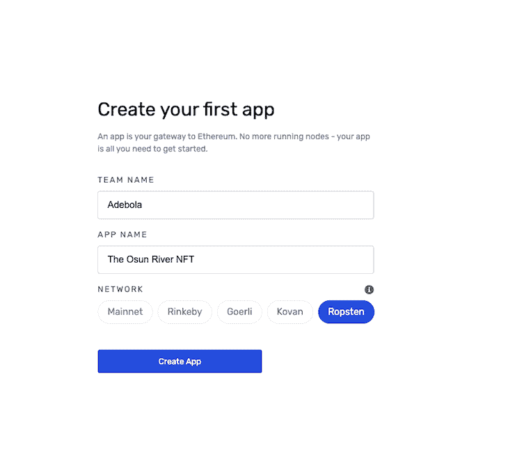

点击**创建应用**按钮继续。

在下一个屏幕上，选择免费计划。在接下来的屏幕上，您可以点击 **Skip for now** 按钮来避免输入付款信息，但您可以选择以后再输入。在最后一个屏幕上，选择**上限容量**选项。

现在，您会看到我们的应用程序列在您的仪表板上。

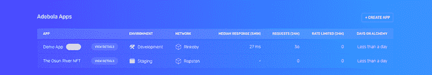

### 创建一个以太坊账户

我们需要创建一个钱包来存放以太坊账户。要将我们的应用程序部署到网络中，我们需要支付一笔以 ETH 为单位的费用，称为汽油费。当测试我们的应用程序时，我们可以使用虚拟 ETH 来完成这个过程，稍后我们将从水龙头中检索它。

我们将使用 [MetaMask](https://metamask.io/) 创建一个以太坊账户，这是一个虚拟钱包，可作为 [Chrome 扩展](https://metamask.io/download.html)使用。

一旦你安装了 MetaMask 并创建了一个帐户，在 Chrome 中打开 MetaMask 扩展并从网络列表中选择 Ropsten 测试网络。

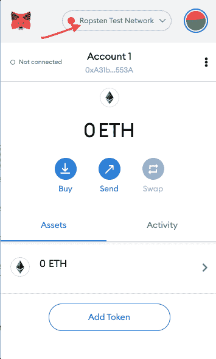

MetaMask 将自动生成一个以 ETH 命名的钱包地址。只需点击**账户 1** 即可复制您的钱包地址。

## 从水龙头里拿水

让我们用 Ropsten 水龙头把乙醚送到我们的新钱包里。首先，输入你的钱包地址，你可以从上面复制，网站将发送 1ETH 到你的钱包。

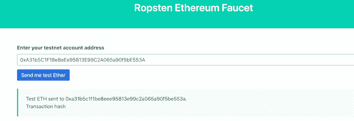

你可以通过查看你的 MetaMask 钱包来确认。

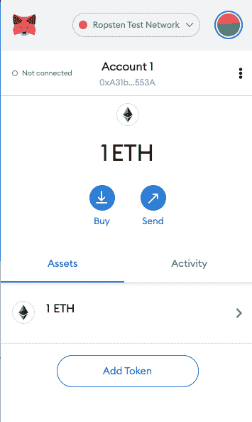

## 设置我们的令牌

让我们开始编码我们的 NFT 令牌！首先，为我们的项目创建一个新目录，并初始化 npm:

```
mkdir the-osun-river-nft && cd the-osun-river-nft
npm init -y

```

我们需要设置 [Hardhat](https://hardhat.org/getting-started/#overview) ，这是一个以太坊的开发环境，允许我们在本地机器上编译应用程序，并在部署到 Ropsten Testnet 之前测试功能。

要将 Hardhat 作为开发依赖项安装在我们的项目中，请运行:

```
npm install -D hardhat

```

现在，使用`npx hardhat`命令初始化 Hardhat:

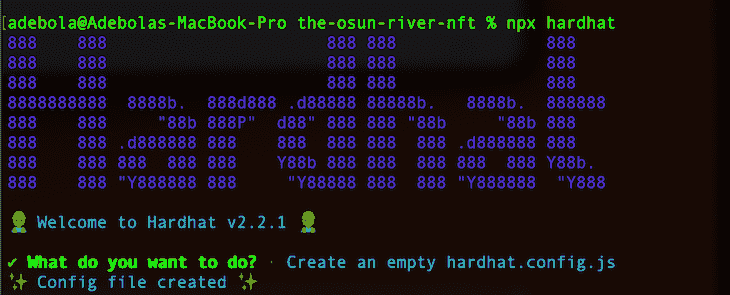

选择**创建一个空的`hardhat.config.js`T2。稍后我们将使用这个文件来为我们的项目设置配置。**

现在，我们将在项目中建立两个新文件夹:一个保存智能合约的代码，另一个保存部署智能合约代码并与之交互的脚本:

```
mkdir contracts && mkdir scripts

```

## 创建智能合同

智能合约只是可以在以太坊区块链上运行的应用程序。它们是用一种叫做 [Solidity](https://docs.soliditylang.org/en/v0.8.4/) 的语言编写的。

我们的智能合约代码将基于 [OpenZeppelin](https://docs.openzeppelin.com/contracts/3.x/erc721) ERC721 实现。ERC721 是表示 NFTs 所有权的标准，OpenZeppelin 契约为我们使用 ERC721 提供了一些灵活性。

安装 OpenZeppelin 合同库:

```
npm i @openzeppelin/[email protected]

```

在您的`contracts`目录中，使用下面的代码创建一个`OsunRiverNFT.sol`文件。我留下了几条注释来澄清每一行:

```
//Contract based on https://docs.openzeppelin.com/contracts/3.x/erc721
// SPDX-License-Identifier: MIT
pragma solidity ^0.7.3;

// implements the ERC721 standard
import "@openzeppelin/contracts/token/ERC721/ERC721.sol";
// keeps track of the number of tokens issued
import "@openzeppelin/contracts/utils/Counters.sol";
import "@openzeppelin/contracts/access/Ownable.sol";

// Accessing the Ownable method ensures that only the creator of the smart contract can interact with it
contract TorNFT is ERC721, Ownable {
    using Counters for Counters.Counter;
    Counters.Counter private _tokenIds;

    // the name and symbol for the NFT
    constructor() public ERC721("TheOsunRiver", "TOR") {}

    // Create a function to mint/create the NFT
   // receiver takes a type of address. This is the wallet address of the user that should receive the NFT minted using the smart contract
    // tokenURI takes a string that contains metadata about the NFT

    function createNFT(address receiver, string memory tokenURI)
        public onlyOwner
        returns (uint256)
    {
        _tokenIds.increment();

        uint256 newItemId = _tokenIds.current();
        _mint(receiver, newItemId);
        _setTokenURI(newItemId, tokenURI);

        // returns the id for the newly created token
        return newItemId;
    }
}

```

要使我们的 NFT 成为有效的 ERC721 令牌，它必须符合所有 ERC721 标准。`import "@openzeppelin/contracts/token/ERC721/ERC721.sol";`通过将 ERC721 标准导入我们的文件来确保这一点。

现在，我们将把 MetaMask 钱包连接到我们的项目。虚拟钱包上的每笔交易都需要一个私钥来完成，所以我们需要获取元掩码私钥。

在你的 Chrome 浏览器中，打开 MetaMask 扩展，点击右上角的三个点，选择**账户详情**选项**。**接下来，点击**导出私钥**按钮。输入您的密码以查看您的私钥，然后复制它。

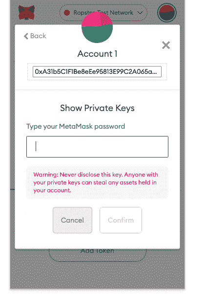

在我们项目的代码库中保护我们的私钥是很重要的，以防止它在使用 GitHub 这样的版本控制平台时被暴露。为了保证密钥的安全，我们将安装 [dotenv](https://www.npmjs.com/package/dotenv) 包:

```
npm i dotenv

```

在项目的根目录下创建一个`.env`文件，然后将之前的元掩码私钥添加到其中。您还将添加您的炼金术`API_URL`，您可以通过导航到您的炼金术仪表板，点击**应用**下拉菜单，选择您之前创建的应用，然后选择**查看键**按钮找到它:

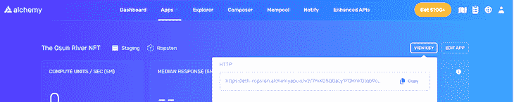

```
METAMASK_PRIVATE_KEY = "yourMetamaskPrivateKey"
API_URL = "https://eth-ropsten.alchemyapi.io/v2/your-api-key"

```

## 设置 Ether.js

Ether.js 是一个简化与以太坊区块链交互的库。我们将为 Hardhat 使用 Ether 插件:

```
npm i -D @nomiclabs/hardhat-ethers '[email protected]^5.0.0'

```

转到我们之前创建的`hardhat.config.js`文件，添加一些我们已经安装的新依赖项:

```
/**
* @type import('hardhat/config').HardhatUserConfig
*/
require('dotenv').config();
require("@nomiclabs/hardhat-ethers");
const { API_URL, METAMASK_PRIVATE_KEY } = process.env;
module.exports = {
   solidity: "0.7.3",
   defaultNetwork: "ropsten",
   networks: {
      hardhat: {},
      ropsten: {
         url: API_URL,
         accounts: [`0x${METAMASK_PRIVATE_KEY}`]
      }
   },
}

```

让我们浏览一下配置文件中的内容:

*   包:让我们在 Node.js 应用程序中使用环境变量
*   在我们的部署脚本中运行 Ether 提供的用户友好的方法
*   `defaultNetwork`:指定在部署我们的应用程序(Ropsten Testnet)时应该使用哪个网络硬件
*   由元掩码生成的私钥，允许我们的应用程序连接到我们的元掩码虚拟钱包以完成交易
*   `url`:指定我们的 Node.js 应用程序所在的 URL(Alchemy 服务器)

我们将通过托管在我们的 URL 上的节点连接到 Ropsten Testnet。你可以在 Hardhat 中阅读更多关于[配置文件的内容。](https://hardhat.org/config/)

现在，让我们运行 Hardhat 提供的 [`compile`任务](https://hardhat.org/getting-started/#running-tasks),以检查一切是否正常工作:

```
npx hardhat compile

```

您应该会看到如下所示的成功消息。您可以忽略出现在终端中的警告。


## 创建部署脚本

既然我们已经包装了智能合约代码，让我们编写必要的脚本来将智能合约部署到以太坊区块链。

在您的`scripts`目录中，创建一个名为`deploy.js`的新文件:

```
async function main() {
    const [deployer] = await ethers.getSigners();
    console.log("Deploying contracts with the account:", deployer.address);

    console.log("Account balance:", (await deployer.getBalance()).toString());
    const TOR = await ethers.getContractFactory("TorNFT");

    // Start deployment, returning a promise that resolves to a contract object
    const tor = await TOR.deploy();
    console.log("Contract deployed to address:", tor.address);
 }

 main()
   .then(() => process.exit(0))
   .catch(error => {
     console.error(error);
     process.exit(1);
   });

```

现在，我们可以运行 Hardhat [部署任务](https://hardhat.org/guides/create-task.html):

```
npx hardhat run scripts/deploy.js --network ropsten

```

我们添加了`--network ropsten`标志来告诉 Hardhat 连接到一个特定的网络，在我们的例子中是 Ropsten。

几秒钟后，我们将看到我们的智能契约已经成功部署到 Ropsten Testnet。从我们的终端日志中，我们可以看到为我们的智能合同新创建的地址。

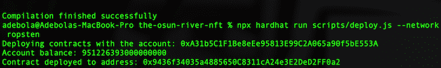

现在，让我们确认我们的智能合约已部署到区块链。前往 [Ropsten Etherscan](https://ropsten.etherscan.io/) ，将您的合同地址粘贴到搜索栏中。你应该在一分钟内看到你的合同细节。

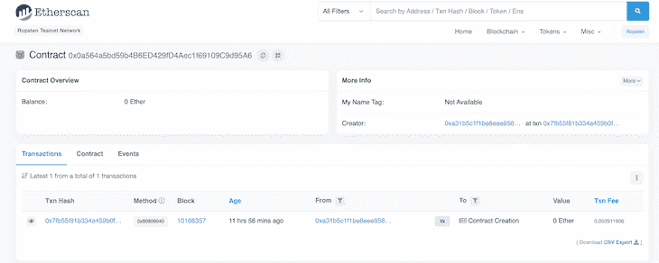

如果你在 MetaMask 上查看你的以太坊钱包，你会注意到，由于处理交易所需的汽油费，你的以太坊数量已经减少。现在，我们已经成功地将我们的智能合同部署到 Ropsten Testnet！

## 铸造 NFT

我们的智能合约代码接受两个参数:接收者地址和一个 tokenURI。tokenURI 链接到我们希望将令牌附加到的数据。要使用接收方地址，只需将它传入您要接收令牌的用户的钱包地址。

存储在区块链上的数据需要跨多个网络进行处理、验证和复制，这使得在区块链上存储数据非常昂贵。不建议将整个影像上传到区块链，您可以只存储 NFT 的元数据。

尽管 NFT 的 URL 可以存储在区块链上，但链接可能会随时离线。此外，任何有权访问某个 URL 上的内容的人都可以更改它。

一个例子是，一名 NFT 艺术家[在 NFTs 上撤掉了他在](https://cointelegraph.com/news/opensea-collector-pulls-the-rug-on-nfts-to-highlight-arbitrary-value) [OpenSea](http://opensea.io) 上出售的地毯，这意味着他改变了他出售给买家的原始图像。这些图片的链接仍然存在于区块链上，但是原始内容已经被完全改变了。

因此，我们需要一种经济、持久、分散和不可变的数据存储方式。

## 使用 IPFS

[IPFS](https://docs.ipfs.io) 是一个用于存储和访问文件的分布式系统，它使用[内容寻址](https://docs.ipfs.io/concepts/content-addressing/)来解决上述问题。上传到 IPFS 的任何数据都将被分配一个唯一的内容标识符(CID)。为一段数据生成 CID 后，该 CID 将始终代表该数据，并且该数据不可更改。

这里有一个 IPFS·URI 的例子:

```
ipfs://bafybeigdyrzt5sfp7udm7hu76uh7y26nf3efuylqabf3oclgtqy55fbzdi

```

要生成 IPFS URI，您只需在 CID 前加上前缀`ipfs://`。在浏览器中，IPFS·URIs 遵循格式:

```
https://ipfs.io/ipfs/{CID}

```

URI 将由您的用户代理(浏览器)解析以显示内容。有几个浏览器能够解析 IPFS URIs，但是我们将使用谷歌 Chrome 浏览器版本 90。

## 设置 web3.js

让我们继续向 NFT 添加元数据。我们将安装 [Alchemy Web3](https://www.npmjs.com/package/@alch/alchemy-web3) 包:

```
npm install @alch/alchemy-web3

```

根据它的文档， [web3.js](https://web3js.readthedocs.io/en/v1.3.4/) 是一个库的集合，允许你使用 HTTP、IPC 或 WebSocket 与本地或远程以太坊节点进行交互。

Alchemy 包装了 Web3.js 库，通过提供自动重试和健壮的 WebSocket 支持来扩展其功能。

## 设置创建 NFT 的脚本

现在，是时候写剧本来铸造我们的 NFT 了。

在您的`scripts`文件夹中，创建一个名为`mint-nft.js`的文件。然后，添加以下代码块:

```
require('dotenv').config();
const API_URL = process.env.API_URL;
const { createAlchemyWeb3 } = require("@alch/alchemy-web3");
const alchemyWeb3 = createAlchemyWeb3(API_URL);
const contract = require("../artifacts/contracts/OsunRiverNFT.sol/TorNFT.json"); 

```

Pinata 是一个使用 IPFS 协议来存储我们的 NFT 元数据的平台。如果您还没有，请创建一个帐户。

登录后，选择蓝绿色**上传**按钮，点击**文件**，然后选择你的 NFT 图片。

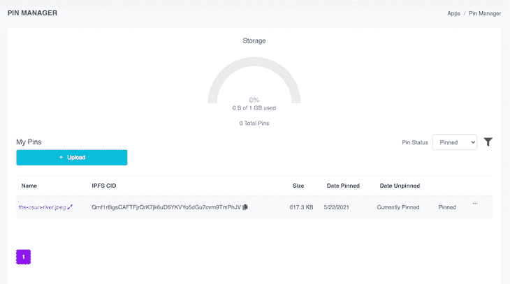

图像成功上传后，您将在仪表板上看到它。确保注意上面 IPFS CID 列下的字母数字字符。我们以后会用到它们。

现在我们已经将图像上传到 Pinata，让我们创建一个 JSON 文件来保存关于我们的 NFT 的信息。当 NFT 铸造出来的时候，我们会把 URI 存放在区块链。

在应用程序的根目录下，创建一个名为`nft-metadata.json`的文件，并添加以下信息。记得更改图像值，以使用将图像上传到 Pinata 时生成的 CID:

```
{
    "description" : "An image of the Osun River captured on the suspended bridge at the Osogbo Sacred Grove.",
    "image" : "https://ipfs.io/ipfs/Qmf1r8igsCAFTFjrQrK7jk6uD6YKVYo5dGu7cvm9TmPhJV",
    "photographer" : "Adebola Adeniran"
}

```

注意，对于 image 属性，我们已经从 Pinata 仪表板添加了带有前缀`[https://ipfs.io/ipfs/](https://ipfs.io/ipfs/)`的 IPFS CID。保存文件，然后返回 Pinata 上传文件。


您应该在我们的仪表板上看到图像和 JSON 文件。

## 创建我们合同的一个实例

要创建 NFT，获取我们的智能契约部署到 Ropsten Testnet 时创建的契约地址。您可以在我们的终端日志中看到这一点。我们的合同地址是[0x 9436 f 34035 a 4885650 c 8311 ca 24 e 3 e 2 ded 2 ff 0 a 2](https://ropsten.etherscan.io/address/0x9436f34035a4885650C8311cA24e3E2DeD2FF0a2)。


回到`scripts/mint-nft.js`文件，添加以下代码:

```
const contractAddress = "0x9436f34035a4885650C8311cA24e3E2DeD2FF0a2";
const nftContract = new alchemyWeb3.eth.Contract(contract.abi, contractAddress);

```

让我们用我们的公共以太坊地址来更新我们的`.env`文件，这个地址就是我们之前复制的账户地址。将地址添加到我们的`.env`文件中:

```
METAMASK_PRIVATE_KEY="Our metamask Private key"
API_URL="Our alchemy API URL"
METAMASK_PUBLIC_KEY="Our metamask public key"

```

接下来，我们需要创建一个事务。

将下面的代码添加到我们的`mint-nft.js`文件中。我添加了注释来解释我们在每一步要做的事情:

```
const METAMASK_PUBLIC_KEY = process.env.METAMASK_PUBLIC_KEY;
const METAMASK_PRIVATE_KEY = process.env.METAMASK_PRIVATE_KEY;

async function mintNFT(tokenURI) {
    // get the nonce - nonce is needed for security reasons. It keeps track of the number of
    // transactions sent from our address and prevents replay attacks.
  const nonce = await alchemyWeb3.eth.getTransactionCount(METAMASK_PUBLIC_KEY, 'latest');
  const tx = {
    from: METAMASK_PUBLIC_KEY, // our MetaMask public key
    to: contractAddress, // the smart contract address we want to interact with
    nonce: nonce, // nonce with the no of transactions from our account
    gas: 1000000, // fee estimate to complete the transaction
    data: nftContract.methods
      .createNFT("0x0d28235B6191a66A3410cc1e3CeBfE53602D7865", tokenURI)
      .encodeABI(), // call the createNFT function from our OsunRiverNFT.sol file and pass the account that should receive the minted NFT.
  };
}

```

我已经创建了一个新的元掩码钱包，并在上面的`tx.data`中传递了钱包地址。如果你愿意，你也可以进入我们的`METAMASK_PUBLIC_KEY`。在生产中，这里传递的钱包地址应该是 NFT 接收者的钱包地址。

既然事务已经创建，我们需要使用我们的`METAMASK_PRIVATE_KEY`来签署事务。

将以下代码块添加到`mintNFT`函数内的`mint-nft.js`文件中:

```
  const signPromise = alchemyWeb3.eth.accounts.signTransaction(
    tx,
    METAMASK_PRIVATE_KEY
  );
  signPromise
    .then((signedTx) => {
      alchemyWeb3.eth.sendSignedTransaction(
        signedTx.rawTransaction,
        function (err, hash) {
          if (!err) {
            console.log(
              "The hash of our transaction is: ",
              hash,
              "\nCheck Alchemy's Mempool to view the status of our transaction!"
            );
          } else {
            console.log(
              "Something went wrong when submitting our transaction:",
              err
            );
          }
        }
      );
    })
    .catch((err) => {
      console.log(" Promise failed:", err);
    });

```

最后，我们需要从之前上传到 Pinata 的`nft-metadata.json` *文件中复制 IPFS CID 散列，并在调用函数`mintNFT`时将其传递给函数:*

```
mintNFT("https://ipfs.io/ipfs/QmdZMtdApdeobM5iCRcWqAMByfG4No8tW4oheb7jQjKgTm") // pass the CID to the JSON file uploaded to Pinata 
```

如果您在我们的浏览器中打开上面的链接，您应该会看到上面带有 CID 的`nft-metadata.json`文件:

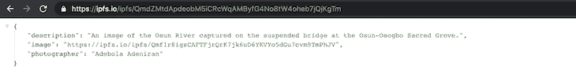

现在，我们可以在终端运行`node scripts/mint-nft.js`来铸造我们的 NFT。等待几秒钟，您应该会在我们的终端中得到如下图所示的响应。

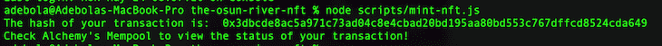

现在，我们将进入 [Alchemy Mempool](https://dashboard.alchemyapi.io/mempool) ，它跟踪我们账户上发生的所有交易的状态，而无需使用 Etherscan。

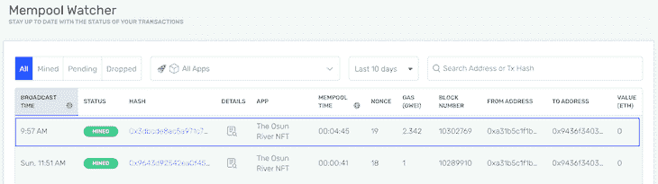

我们可以在以太扫描上看到关于我们新制作的 NFT 的信息，以及链接到我们在以太坊区块链上的`nft-metadata.json`文件的 URL。

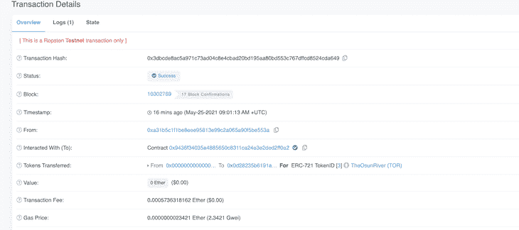

向下滚动到输入数据，然后点击**解码输入数据**按钮。您应该看到我们传递给`contracts/OsunRiverNFT.sol`文件中的`createNFT`函数的数据:接收钱包地址和保存 NFT 元数据的 JSON 文件的 URL。

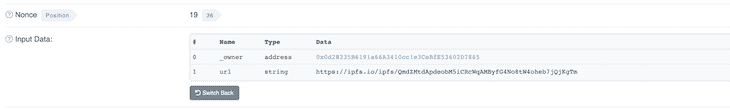

如果您在 Etherscan 上搜索用于创建 NFT 的[合同地址](https://ropsten.etherscan.io/address/0x9436f34035a4885650c8311ca24e3e2ded2ff0a2)，您将看到所有已创建的 NFT 的记录，或者更准确地说，使用该智能合同发生的所有交易的记录。

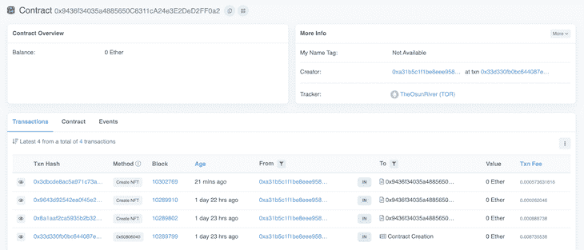

1.  检查与 Ropsten 测试网络的连接
2.  打开 MetaMask wallet 扩展
3.  点击**添加令牌**按钮
4.  从以太网扫描复制新令牌的合同地址，并将其粘贴到元掩码中。元掩码将自动生成令牌的符号。
5.  点击下一步的**将代币添加到您的钱包中**

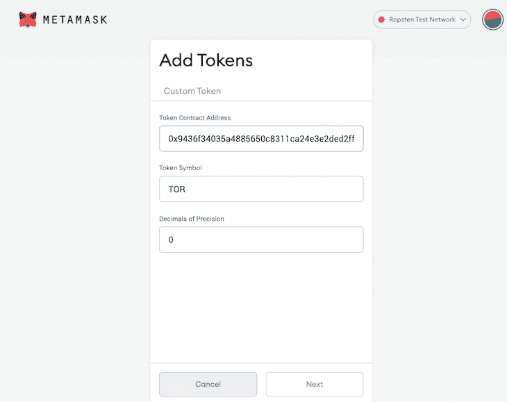

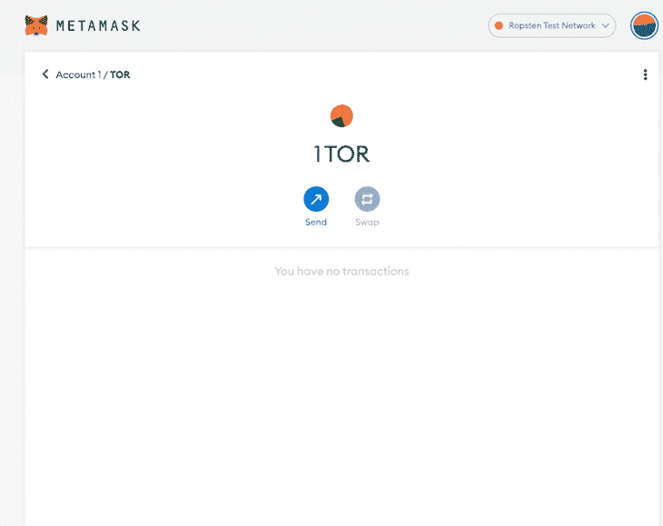

## 结论

因此，我们学会了如何:

*   创建智能协定并将其部署到 Ropsten Testnet
*   通过将智能合约部署到区块链来创建非功能性交易
*   通过 piata 在 IPFS 使用内容寻址协议向我们的 NFT 添加元数据
*   查看 MetaMask 钱包中的 NFT

希望你明白为什么 NFT 会引起这样的骚动。这是一项迷人的技术，可能会持续一段时间。

在生产中，这些步骤与本教程中的步骤完全相同。唯一的区别是，你现在将与主网而不是测试网进行交互。

你可以在我的 [GitHub](https://github.com/onedebos/the-osun-river-nft) 上看到这个项目的所有代码。

## 您是否添加了新的 JS 库来提高性能或构建新特性？如果他们反其道而行之呢？

毫无疑问，前端变得越来越复杂。当您向应用程序添加新的 JavaScript 库和其他依赖项时，您将需要更多的可见性，以确保您的用户不会遇到未知的问题。

LogRocket 是一个前端应用程序监控解决方案，可以让您回放 JavaScript 错误，就像它们发生在您自己的浏览器中一样，这样您就可以更有效地对错误做出反应。

[](https://lp.logrocket.com/blg/javascript-signup)[https://logrocket.com/signup/](https://lp.logrocket.com/blg/javascript-signup)

[LogRocket](https://lp.logrocket.com/blg/javascript-signup) 可以与任何应用程序完美配合，不管是什么框架，并且有插件可以记录来自 Redux、Vuex 和@ngrx/store 的额外上下文。您可以汇总并报告问题发生时应用程序的状态，而不是猜测问题发生的原因。LogRocket 还可以监控应用的性能，报告客户端 CPU 负载、客户端内存使用等指标。

自信地构建— [开始免费监控](https://lp.logrocket.com/blg/javascript-signup)。*