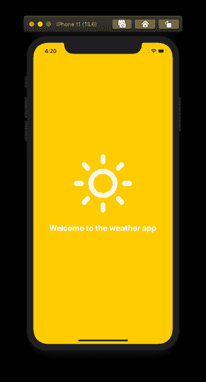
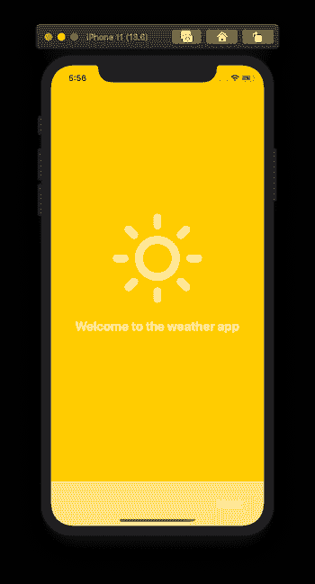
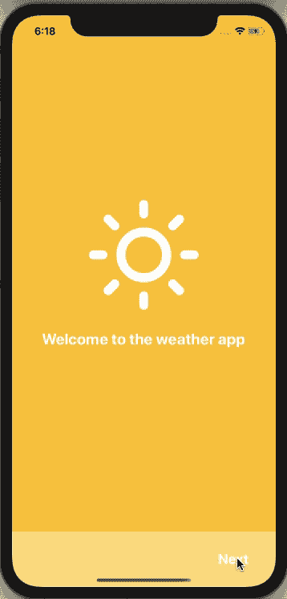
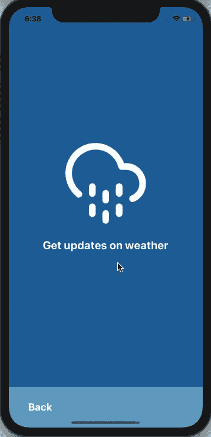
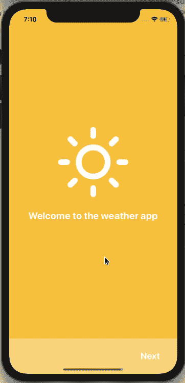

# 如何使用 React 原生视图创建入职界面

> 原文：<https://blog.logrocket.com/how-to-create-onboarding-screens-with-react-native-viewpager/>

在本教程中，我们将了解在 React 原生应用程序中创建 onboarding 屏幕的方法之一。我们将使用一个名为 [react-native-viewpager、](https://github.com/react-native-community/react-native-viewpager)的 React 原生社区包，它允许我们在不同页面之间左右滑动，每个页面都有一些数据要显示。我们将创建一些可重复使用的组件，并模拟一个入职屏幕的基本示例，该屏幕具有一些逻辑来导航到下一个入职页面，返回到上一个入职页面，并导航到应用程序的主要内容。在最后一部分，我们将集成 [react-navigation](https://reactnavigation.org/docs/getting-started) 库。

## 先决条件

开始之前，请确保在本地环境中安装了以下软件:

*   [Node.js](https://nodejs.org/en/) 版本> = `12.x.x`已安装
*   访问一个包装管理器，如 [npm](https://www.npmjs.com/) 或 [yarn](https://classic.yarnpkg.com/en/) 或 [npx](https://www.npmjs.com/package/npx)

请注意，为了演示，我将使用 iOS 模拟器。如果你更喜欢使用 Android 设备或模拟器，这篇文章中分享的代码片段也可以运行。

## 创建一个新的 React 本地项目

首先创建一个新的 React 本机应用程序，并安装构建 onboarding 屏幕所需的依赖项。打开终端窗口并执行以下命令:

```
npx expo-cli onboarding-viewpager-example

# navigate inside the project directory
cd onboarding-viewpager-example

# install the dependency
expo install @react-native-community/viewpager
```

如果您正在使用一个普通的 React Native 项目阅读这篇文章，并且假设您使用的是 React Native 的最新版本，那么安装的组件将是自动链接的。

## 关于 React 本机视图页面

组件 [react-native-viewpager](https://github.com/react-native-community/react-native-viewpager) 最初仅在 Android 设备上受支持。在其当前版本中，该组件支持 iOS 和 Android 设备。

组件库在每个移动平台上使用本地视图实现。在 iOS 上，它使用`UIPageViewController`容器来管理不同页面之间的导航，进一步包含要显示的数据。在 Android 上，它使用`ViewPager`布局管理器，通过在不同页面之间左右滑动来导航:

## 创建入职屏幕

让我们首先创建一个 onboarding 屏幕，它将有不同的子视图，称为页面。每一页都代表要显示的数据的不同状态。

在我们继续之前，让我们创建一个文件和目录的初始结构:

*   `src/screens` —创建所有屏幕的地方
*   `src/screens/Onboarding.js` —为该部分创建的`Onboarding`屏幕
*   `src/screens/components` —创建屏幕中使用的所有组件
*   `src/screens/components/Page.js` —可重用的页面组件
*   `src/screens/components/Footer.js` —保存每页导航按钮的组件
*   `src/screens/components/RoundedButton.js` —导航按钮的组件

让我们从构建一个 onboarding 屏幕开始，这个屏幕将有一个包装在`View`中的`Page`组件。这个视图有一个叫做`key`的道具来区分页面。它被包装在样式为`flex: 1`的`ViewPager`组件中。在文件`OnBoarding.js`中，添加以下代码片段:

```
import React from 'react';
import { View } from 'react-native';
import ViewPager from '@react-native-community/viewpager';

import Page from '../components/Page';

const Onboarding = () => {
  return (
    <View style={{ flex: 1 }}>
      <ViewPager style={{ flex: 1 }}>
        <View key="1">
          <Page
            backgroundColor="#ffc93c"
            iconName="sun"
            title="Welcome to the weather app"
          />
        </View>
      </ViewPager>
    </View>
  );
};

export default Onboarding;
```

`Page`组件接受三个道具。页面的`backgroundColor`，要显示的图标的名称，以及图标下面显示的一些标题。该图标来自`@expo/vector-icons`。它是一个普通的 React 组件，呈现一些 UI。打开`Page.js`并添加以下内容:

```
import React from 'react';
import { View, Text } from 'react-native';
import { Feather as Icon } from '@expo/vector-icons';

const Page = ({ backgroundColor, iconName, title }) => {
  return (
    <View
      style={{
        flex: 1,
        justifyContent: 'center',
        alignItems: 'center',
        backgroundColor
      }}
    >
      <Icon name={iconName} size={172} color="white" />
      <View style={{ marginTop: 16 }}>
        <Text style={{ fontSize: 24, fontWeight: 'bold', color: 'white' }}>
          {title}
        </Text>
      </View>
    </View>
  );
};

export default Page;
```

要查看这个屏幕组件的运行情况，请打开`App.js`文件，并对其进行如下修改:

```
import React from 'react';
import { StatusBar } from 'expo-status-bar';

import Onboarding from './src/screens/Onboarding';

export default function App() {
  return (
    <>
      <StatusBar style="dark" />
      <Onboarding />
    </>
  );
}
```

返回终端窗口，通过运行命令`expo start`启动开发服务器。这是完成此步骤后您将得到的输出:



在前一个组件下面添加另一个`Page`组件，该组件包装在自己的`View`中，并在`Onboarding.j`文件中增加一个`key`值:

```
const Onboarding = () => {
  return (
    <View style={{ flex: 1 }}>
      <ViewPager style={{ flex: 1 }}>
        <View key="1">
          <Page
            backgroundColor="#ffc93c"
            iconName="sun"
            title="Welcome to the weather app"
          />
        </View>
        <View key="2">
          <Page
            backgroundColor="#07689f"
            iconName="cloud-drizzle"
            title="Get updates on weather"
          />
        </View>
      </ViewPager>
    </View>
  );
};
```

我们还需要添加从一个页面组件移动到另一个页面组件的逻辑。

## 为每个页面创建一个页脚组件

为了在`ViewPager`中从一个页面导航到另一个页面，我们需要一个按钮来告诉用户，通过按下按钮，他们可以导航到下一个 onboarding 页面。每个按钮都显示在页面的页脚组件中。让我们先从创建按钮开始。

在组件文件`RoundedButton.js`中，用 React Native 中的`TouchableOpacity`创建一个按钮组件。它是一个包装器组件，通过提供对触摸的响应来帮助制作按钮。使用这个组件来创建一个可按下的按钮，当它被按下时不透明度变暗。

`RoundedButton`接受两个属性，`label`显示为按钮的标题，`onPress`的值稍后在`Onboarding`屏幕中定义:

```
import React from 'react';
import { Text, TouchableOpacity } from 'react-native';

const RoundedButton = ({ label, onPress }) => {
  return (
    <TouchableOpacity
      style={{ alignItems: 'center', justifyContent: 'center' }}
      onPress={onPress}
    >
      <Text style={{ fontSize: 22, color: 'white', fontWeight: 'bold' }}>
        {label}
      </Text>
    </TouchableOpacity>
  );
};

export default RoundedButton;
```

接下来，让我们创建一个显示在页面最底部的`Footer`组件，并显示`RoundedButton`。

页脚组件将由一个包装了`RoundedButton`组件的`View`组成。这个`View`将会有一个与整个`Page`组件背景颜色相同的`opacity`。它接受来自父组件`Onboarding`屏幕的三个道具，应用不透明度的`backgroundColor`，按钮组件被按下时采取行动的`rightButtonPress`，以及在相关按钮上显示标签的`rightButtonLabel`。

对于不需要在页脚显示右键的场景，前缀为`right`的两个属性都将有一个默认值`false`。这为我们的可重用组件增加了一些灵活性。

它还使用 React Native 中的`useWindowDimensions().width` hook 来获取特定屏幕的宽度值。当屏幕尺寸改变时，这个钩子自动更新宽度值。使用该值，可以更容易地确定`Footer`组件的高度，即窗口总宽度的`21%`:

```
import React from 'react';
import { View, useWindowDimensions } from 'react-native';

import RoundedButton from './RoundedButton';

const Footer = ({
  backgroundColor,
  rightButtonLabel = false,
  rightButtonPress = false
}) => {
  const windowWidth = useWindowDimensions().width;
  const HEIGHT = windowWidth * 0.21;
  const FOOTER_PADDING = windowWidth * 0.1;

  return (
    <View
      style={{
        flexDirection: 'row',
        justifyContent: 'flex-end',
        height: HEIGHT,
        backgroundColor,
        opacity: 0.6,
        alignItems: 'center',
        paddingHorizontal: FOOTER_PADDING
      }}
    >
      <RoundedButton label={rightButtonLabel} onPress={rightButtonPress} />
    </View>
  );
};

export default Footer;
```

我们的两个定制组件现在都可以使用了。打开`Onboarding.js`文件，导入`Footer`组件:

```
// ... other import statements
import Footer from '../components/Footer';
```

接下来，修改屏幕组件返回的 JSX，为每个页面添加一个`Footer`:

```
const Onboarding = () => {
  return (
    <View style={{ flex: 1 }}>
      <ViewPager style={{ flex: 1 }}>
        <View key="1">
          <Page
            backgroundColor="#ffc93c"
            iconName="sun"
            title="Welcome to the weather app"
          />
          <Footer
            backgroundColor="#ffc93c"
            rightButtonLabel="Next"
            rightButtonPress={() => true}
          />
        </View>
        <View key="2">
          <Page
            backgroundColor="#07689f"
            iconName="cloud-drizzle"
            title="Get updates on weather"
          />
          <Footer
            backgroundColor="#07689f"
            rightButtonLabel="Next"
            rightButtonPress={() => true}
          />
        </View>
      </ViewPager>
    </View>
  );
};
```

这是此步骤后的输出:



由于`Footer.js`文件中的属性`justifyContent: 'flex-end'`，按钮`Next`显示在页脚的右侧。

## 在不同页面间导航

我们的两个页面现在都设置好了。我们将使用 React 库中的`useRef`钩子来确定`ViewPager`中当前页码的值。使用当前页码的值，我们可以使用页脚中的按钮让用户从一个页面导航到另一个页面。

首先从 React 导入`useRef`钩子，然后用初始值`null`定义一个`pagerRef`。还要确保将这个引用传递给`ViewPager`组件，并在其上定义另一个名为`initialPage`的道具。这个道具将决定应用程序启动时显示的初始页面，这将是`0`。

从一个页面导航到另一个页面，让我们定义一个名为`handlePageChange`的处理程序方法。它将使用`pageRef.current.setPage(pageNumber)`设置当前页码的值。它接收实际页码的值作为参数。基于该值，当前页面发生变化。

```
// modify only the below import statement
import React, { useRef } from 'react';

const Onboarding = () => {
  const pagerRef = useRef(null);

  const handlePageChange = pageNumber => {
    pagerRef.current.setPage(pageNumber);
  };

  return (
    <View style={{ flex: 1 }}>
     <ViewPager style={{ flex: 1 }} initialPage={0} ref={pagerRef}>
    {/* Rest remains same */}
    </ViewPager>
    </View>
  )
```

由于 onboarding 屏幕只有两页，唯一可能的导航方式是从页码`0`到`1`。修改第一个`Page`组件的`Footer`组件上的`rightButtonPress`道具:

```
<Footer
  backgroundColor="#ffc93c"
  rightButtonLabel="Next"
  rightButtonPress={() => {
    handlePageChange(1);
  }}
/>
```

回到 Expo 客户端，从第一页导航到下一页。



### 添加一个按钮以导航到上一页

让我们添加应用程序允许用户从入职页面的当前页面导航回上一个页面时的场景逻辑。这将根据当前页面的值来确定。如果当前页面是第一页，那么没有必要显示后退按钮。

打开`Footer.js`，开始添加另一组将要以`left`为前缀的道具。这两个新道具都将有一个布尔值`false`。

```
const Footer = ({
  backgroundColor,
  leftButtonLabel = false,
  leftButtonPress = false,
  rightButtonLabel = false,
  rightButtonPress = false
}) => {
  //...
};
```

接下来，修改`View`上的`justifyContent`样式的值，动态确定，条件是如果`leftButtonLabel`可用，则在两个不同的按钮之间使用`space-between`的值，否则使用`flex-end`的值。

类似地，有了`leftButtonLabel` prop，添加一个条件来显示一个左按钮:

```
<View
  style={{
    flexDirection: 'row',
    justifyContent: leftButtonLabel ? 'space-between' : 'flex-end',
    height: HEIGHT,
    backgroundColor,
    opacity: 0.6,
    alignItems: 'center',
    paddingHorizontal: FOOTER_PADDING
  }}
>
  {leftButtonLabel && (
    <RoundedButton label={leftButtonLabel} onPress={leftButtonPress} />
  )}
  <RoundedButton label={rightButtonLabel} onPress={rightButtonPress} />
</View>
```

返回到`Onboarding.js`并在第二页添加左按钮:

```
<View key="2">
  <Page
    backgroundColor="#07689f"
    iconName="cloud-drizzle"
    title="Get updates on weather"
  />
  <Footer
    backgroundColor="#07689f"
    leftButtonLabel="Back"
    leftButtonPress={() => {
      handlePageChange(0);
    }}
  />
</View>
```

这是完成此步骤后您将得到的输出:



## 集成 react 导航库

结束这篇文章的一个好方法是从自定义的`Onboarding`屏幕导航到主应用程序，主应用程序可能使用`react-navigation`库作为在不同应用程序屏幕之间导航的事实。

通过从终端窗口执行以下一系列命令，添加 [react-navigation](https://reactnavigation.org/docs/getting-started) 库:

```
yarn add @react-navigation/native @react-navigation/stack

expo install react-native-gesture-handler react-native-reanimated react-native-screens react-native-safe-area-context @react-native-community/masked-view
```

然后，用下面的代码片段在`src/screens/`目录中创建一个名为`Home.js`的模拟屏幕:

```
import React from 'react';
import { View, Text, StyleSheet } from 'react-native';

const Home = () => {
  return (
    <View style={styles.container}>
      <Text style={styles.text}>Home Screen</Text>
    </View>
  );
};

const styles = StyleSheet.create({
  container: {
    flex: 1,
    justifyContent: 'center',
    alignItems: 'center',
    backgroundColor: '#eb8f8f'
  },
  text: {
    fontSize: 20,
    color: 'white'
  }
});

export default Home;
```

接下来，修改`App.js`文件，添加使用堆栈导航模式在`Onboarding`屏幕和`Home`屏幕之间导航的逻辑:

```
import React from 'react';
import { StatusBar } from 'expo-status-bar';
import { NavigationContainer } from '@react-navigation/native';
import { createStackNavigator } from '@react-navigation/stack';

import Onboarding from './src/screens/Onboarding';
import Home from './src/screens/Home';

const AppStack = createStackNavigator();

export default function App() {
  return (
    <>
      <StatusBar style="dark" />
      <NavigationContainer>
        <AppStack.Navigator headerMode="none">
          <AppStack.Screen name="Onboarding" component={Onboarding} />
          <AppStack.Screen name="Home" component={Home} />
        </AppStack.Navigator>
      </NavigationContainer>
    </>
  );
}
```

在`Onboarding`屏幕的最后一页将会有一个可以适当命名的按钮。对于这个例子，我们称它为`Continue`，并将其作为右边的按钮添加到第二页。

使用`navigation.navigate()`方法可以更简单地在主屏幕组件上添加动作。要访问`navigation`对象，让我们从`@react-navigation/native`导入`useNavigation()`钩子，并将其添加到`Onboarding`屏幕:

```
// ...rest of the import statements remain same
// import the hook
import { useNavigation } from '@react-navigation/native';

const Onboarding = () => {
  const navigation = useNavigation();
  // ...

  return (
    <View style={{ flex: 1 }}>
      <ViewPager style={{ flex: 1 }} initialPage={0} ref={pagerRef}>
        {/* ... rest remains same */}
        <View key="2">
          <Page
            backgroundColor="#07689f"
            iconName="cloud-drizzle"
            title="Get updates on weather"
          />
          <Footer
            backgroundColor="#07689f"
            leftButtonLabel="Back"
            leftButtonPress={() => {
              handlePageChange(0);
            }}
            rightButtonLabel="Continue"
            rightButtonPress={() => {
              navigation.navigate('Home');
            }}
          />
        </View>
      </ViewPager>
    </View>
  );
};
```

这是完成此步骤后的完整导航流程:



## 结论

向 React 原生应用添加 onboarding 屏幕有多种方式，本文只介绍了一种方式，但是组件`react-native-viewpager`有许多可以用来在 React 原生应用中实现不同场景的道具。

源代码可以从这个 [GitHub 库](https://github.com/amandeepmittal/react-native-examples/tree/master/onboarding-viewpager)获得。

## [LogRocket](https://lp.logrocket.com/blg/react-native-signup) :即时重现 React 原生应用中的问题。

[](https://lp.logrocket.com/blg/react-native-signup)

[LogRocket](https://lp.logrocket.com/blg/react-native-signup) 是一款 React 原生监控解决方案，可帮助您即时重现问题、确定 bug 的优先级并了解 React 原生应用的性能。

LogRocket 还可以向你展示用户是如何与你的应用程序互动的，从而帮助你提高转化率和产品使用率。LogRocket 的产品分析功能揭示了用户不完成特定流程或不采用新功能的原因。

开始主动监控您的 React 原生应用— [免费试用 LogRocket】。](https://lp.logrocket.com/blg/react-native-signup)