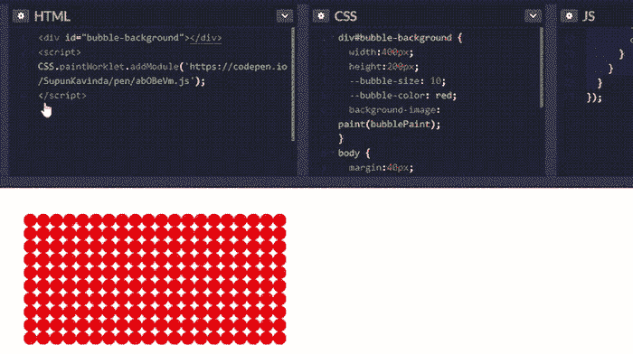
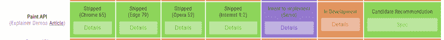

# 如何使用 CSS Paint API 创建随机生成的背景

> 原文：<https://blog.logrocket.com/how-to-create-randomly-generated-backgrounds-with-the-css-paint-api/>

CSS Paint API(又名 CSS Custom Paint)使开发人员能够编写 JavaScript 函数，将图像绘制到 CSS 属性中，如`background-image`、`border-image`等。在本文中，我们将讨论 CSS Paint API 的基础知识，特别是如何创建随机生成的背景。

## 什么是 CSS 画图 API

CSS Paint API 是 CSS Houdini 的一部分，CSS Houdini 是一组低级 API，允许开发人员直接访问 CSS 对象模型(CSSOM)。有了 Houdini，开发人员可以创建他们自己的 CSS 功能，即使他们没有在浏览器中实现。

通常，我们会向元素添加背景图像，如下所示:

```
body {
  background-image: url('path/to/image.jpg');
}

```

这个图像是静态的。如果从技术上考虑，当浏览器解析这段 CSS 代码时，它会向 URL 发送一个 HTTP 请求并获取图像。然后，它将图像显示为身体的背景图像。

与静态图像不同，您可以使用 CSS Paint API 来创建动态背景。请继续阅读，看看是如何做到的。

## CSS 画图 API 入门

要开始使用 CSS Paint API，请从以下步骤开始。

1.  添加 CSS `paint()`函数
2.  编写外部绘制小工具文件
3.  在主线程中调用工作小程序

在创建动态背景之前，我们先从一个简单的由气泡组成的静态背景开始。


首先，我们需要为风格建立一个元素。我们将使用一个简单的`<div>`元素。

```
<!-- index.html -->
<div id="bubble-background"></div>

```

### 步骤 1:添加 CSS `paint()`函数

要将 CSS Paint API 用于背景，请将`paint()`函数添加到元素的`background-image`属性中。

```
div#bubble-background {
  width:400px;
  height:200px;
  background-image: paint(bubblePaint);
}

```

`bubblePaint`是我们将在接下来的步骤中创建的工作流。

### 步骤 2:编写一个外部画图小工具文件

我们需要将工作小程序保存在一个外部 JavaScript 文件中——我们称之为`bubble-paint.js`。

```
// bubble-paint.js
registerPaint('bubblePaint', class {
  paint(ctx, geom) {
    const circleSize = 10; 
    const bodyWidth = geom.width;
    const bodyHeight = geom.height;

    const maxX = Math.floor(bodyWidth / circleSize);
    const maxY = Math.floor(bodyHeight / circleSize); 

    for (let y = 0; y < maxY; y++) {
      for (let x = 0; x < maxX; x++) {
        ctx.fillStyle = '#eee';
        ctx.beginPath();
        ctx.arc(x * circleSize * 2 + circleSize, y * circleSize * 2 + circleSize, circleSize, 0, 2 * Math.PI, true);
        ctx.closePath();
        ctx.fill();
      }
    }
  }
});

```

在这个文件中，`registerPaint()`函数注册了一个画图小工具。第一个参数是小工作程序的名称(与我们在`paint(bubblePaint)`中使用的相同)。下一个参数应该是一个带有`paint()`方法的类。

`paint()`方法是我们编写 JavaScript 代码来呈现图像的地方。这里我们使用了两个论点:

1.  `ctx`类似于`CanvasRenderingContext2D`(`canvas.getContext("2d")`的返回值)，虽然不完全相同。根据[谷歌](https://developers.google.com/web/updates/2018/01/paintapi) :

    > 的说法，一个画板的上下文与`<canvas>`的上下文并不是 100%相同。到目前为止，文本渲染方法还没有出现，而且出于安全原因，您不能从画布上读回像素。

2.  `geom`包含两个元素:绘画元素的`width`和`height`

在函数内部，有一些创建模式的逻辑。`ctx.`函数是我们用来创建画布的。如果你不熟悉画布，我建议你浏览一下这个[画布 API 教程](https://developer.mozilla.org/en-US/docs/Web/API/Canvas_API/Tutorial)。

### 步骤 3:在主线程中调用工作小程序

下一步是调用主 JavaScript 线程中的工作小程序(通常在 HTML 文件中)。

参见 [CodePen](https://codepen.io) 上 Supun Kavinda([@ SupunKavinda](https://codepen.io/SupunKavinda))
的笔 [JjdbQZj](https://codepen.io/SupunKavinda/pen/JjdbQZj) 。

## CSS 画图 API 的动态背景

让我们把上面的泡泡的颜色和大小动态化。使用 [CSS 变量](https://developer.mozilla.org/en-US/docs/Web/CSS/Using_CSS_custom_properties)非常简单。

### 步骤 1:添加 CSS 变量

```
div#bubble-background {
  --bubble-size: 40;
  --bubble-color: #eee;

  // other styles
}

```

### 步骤 2:使用 CSS 变量

为了在`paint()`方法中使用这些 CSS 变量，我们必须首先告诉浏览器我们将要使用它。这是通过向类添加静态属性`inputProperties()`来实现的。

```
// bubble-paint.js
registerPaint('bubblePaint', class {
  static get inputProperties() { return ['--bubble-size', '--bubble-color']; }

  paint() { /* */ }
});

```

我们可以从`paint()`函数的第三个参数中访问这些属性。

```
paint(ctx, geom, properties) {
    const circleSize = parseInt(properties.get('--bubble-size').toString());
    const circleColor = properties.get('--bubble-color').toString(); 

    const bodyWidth = geom.width;
    const bodyHeight = geom.height;

    const maxX = Math.floor(bodyWidth / circleSize);
    const maxY = Math.floor(bodyHeight / circleSize); 

    for (let y = 0; y < maxY; y++) {
      for (let x = 0; x < maxX; x++) {
        ctx.fillStyle = circleColor;
        ctx.beginPath();
        ctx.arc(x * circleSize * 2 + circleSize, y * circleSize * 2 + circleSize, circleSize, 0, 2 * Math.PI, true);
        ctx.closePath();
        ctx.fill();
      }
    }
}

```



这就是使用 CSS Paint API 创建动态背景是多么容易。

在 [CodePen](https://codepen.io/SupunKavinda/full/abOBeVm) 上的这个例子有两种不同的桌面和移动设备背景。

诀窍是改变[媒体查询](https://developer.mozilla.org/en-US/docs/Web/CSS/Media_Queries/Using_media_queries)中的变量值。

```
@media screen and (max-width:600px) {
  div#bubble-background {
    --bubble-size: 20;
    --bubble-color: green; 
  }
}

```

是不是很酷？想象一下静态图像——您需要在一个服务器上托管两个不同的图像来创建这些背景。有了 CSS Paint API，我们可以创建无数漂亮的图形。

## 创建随机生成的背景

现在你已经熟悉了 CSS Paint API，让我们来探索如何使用 CSS Paint API 创建随机生成的背景。

[`Math.random()`](https://developer.mozilla.org/en-US/docs/Web/JavaScript/Reference/Global_Objects/Math/random) 功能是制作随机生成背景的关键。

```
Math.random()
// returns a float number inclusive of 0 and exclusive of 1

```

这里，我们正在执行与之前大致相同的过程；唯一的区别是我们在`paint()`方法中使用了`Math.random`函数。

* * *

### 更多来自 LogRocket 的精彩文章:

* * *

让我们创建一个随机渐变的背景。

```
body {
  width:100%;
  height:100%;
  background-image: paint(randomBackground);
}

registerPaint('randomBackground', class {
  paint(ctx, geom) {
    const color1 = getRandomHexColor();
    const color2 = getRandomHexColor();

    const gradient = ctx.createLinearGradient(0, 0, geom.width, 0);
    gradient.addColorStop(0, color1);
    gradient.addColorStop(1, color2);

    ctx.fillStyle = gradient;
    ctx.fillRect(0, 0, geom.width, geom.height);
  }
})

function getRandomHexColor() {
  return '#'+ Math.floor(Math.random() * 16777215).toString(16)
}

```

`getRandomHexColor`函数执行数学运算来创建一个随机的十六进制颜色。见这个[有用的教程](https://dev.to/akhil_001/generating-random-color-with-single-line-of-js-code-fhj)了解更多关于如何工作的细节。

这是我们随机背景的最终结果。如果您重新载入页面，您将看到随机渐变，您可以使用它来制作独特而有趣的网页。

参见 [CodePen](https://codepen.io) 上 Supun Kavinda([@ SupunKavinda](https://codepen.io/SupunKavinda))
的笔 [MWwEXaX](https://codepen.io/SupunKavinda/pen/MWwEXaX) 。

您还会注意到，当您调整浏览器窗口大小时，颜色会发生变化。这是因为浏览器通过在调整大小时用不同的`geom`值调用`paint()`方法来重新呈现背景。

虽然`Math.random`仅仅产生一个简单的随机数，但它是创建任何随机背景时最重要的函数。使用这种方法，你能做出的令人惊叹的东西的范围只受你想象力的限制。

## 浏览器兼容性

尽管 CSS Paint API 令人惊叹，但浏览器兼容性可能是一个问题。只有最新的浏览器版本支持它。这是来自[的浏览器兼容性数据，胡迪尼准备好了吗？](https://ishoudinireadyyet.com/)撰写本文时。



从这个数据来看，在制作中使用胡迪尼还不是一个好主意。然而，谷歌 Chrome 实验室团队创建了一个 [polyfill](https://github.com/GoogleChromeLabs/css-paint-polyfill) ，使得 CSS Paint API 可以在大多数浏览器中工作。然而，在生产中使用之前，一定要在所有主流浏览器上测试动态背景。

### 检测浏览器支持

以下是如何在 JavaScript 中检测浏览器支持:

```
if ('paintWorklet' in CSS) {
  CSS.paintWorklet.addModule('bubble-paint.js');
}

```

在 CSS 中:

```
@supports (background: paint(id)) {
  div#bubble-background {
    width:400px;
    height:200px;
    background-image: paint(bubblePaint);
  }
}
>
```

### 撤退

CSS 回退属性有助于改进浏览器支持。

```
aside {
  background-image: url('/path/to/static/image');
  background-image: paint(bubblePaint);
}

```

不支持`paint()`功能的浏览器不会识别该语法。因此，它将忽略第二个并加载 URL。支持它的浏览器将理解这两种语法，但是第二种语法将覆盖第一种语法。

## CSS Paint API 的其他有趣用例

下面是使用 CSS Paint API 的一些其他有用和令人兴奋的方法。

### 图像占位符

使用 CSS Paint API，我们可以在加载图像时绘制一个占位符来显示。这需要 Houdini 的新 CSS 属性和 CSS Paint API。

请注意，只有少数浏览器支持 CSS 属性的`<image>`语法，因此它可能在您的浏览器中不起作用。

参见 [CodePen](https://codepen.io) 上 Supun Kavinda([@ SupunKavinda](https://codepen.io/SupunKavinda))
的笔 [RwPKYBQ](https://codepen.io/SupunKavinda/pen/RwPKYBQ) 。

画笔描边背景

### 我见过无数的商业网站用笔触来强调他们的营销关键词。虽然可以使用 canvas 创建笔触，但使用 CSS Paint API 要容易得多。

参见 [CodePen](https://codepen.io) 上 Supun Kavinda([@ SupunKavinda](https://codepen.io/SupunKavinda))
的笔 [VwLPEmd](https://codepen.io/SupunKavinda/pen/VwLPEmd) 。

由于它只是 CSS，你可以根据需要改变变量并重用笔刷笔划。

结论

```
.another-brushstroke {
  --brush-color: #fff;
  background-image: paint(brushstroke);
}

```

## 在本指南中，我们介绍了 CSS Paint API 的基础知识，并通过一些示例探讨了如何使用它。现在，您应该已经有了使用这个新的 API 创建更有创造性和动态图像所需的背景知识。虽然我们关注的是`background-image`，但是您也可以在其他属性中使用`paint()`函数(例如，`border-image`)。CSS 画图 API 和其他 CSS Houdini 特性代表了 CSS 的未来，所以现在是时候开始了。

一旦你掌握了基础知识，了解更多关于胡迪尼的知识，并查看这个可调整和可下载的 [CSS 画板库](https://paintlets.herokuapp.com/)。

你的前端是否占用了用户的 CPU？

## 随着 web 前端变得越来越复杂，资源贪婪的特性对浏览器的要求越来越高。如果您对监控和跟踪生产环境中所有用户的客户端 CPU 使用情况、内存使用情况等感兴趣，

.

[try LogRocket](https://lp.logrocket.com/blg/css-signup)

LogRocket 就像是网络和移动应用的 DVR，记录你的网络应用或网站上发生的一切。您可以汇总和报告关键的前端性能指标，重放用户会话和应用程序状态，记录网络请求，并自动显示所有错误，而不是猜测问题发生的原因。

[](https://lp.logrocket.com/blg/css-signup)[https://logrocket.com/signup/](https://lp.logrocket.com/blg/css-signup)

现代化您调试 web 和移动应用的方式— [开始免费监控](https://lp.logrocket.com/blg/css-signup)。

Modernize how you debug web and mobile apps — [Start monitoring for free](https://lp.logrocket.com/blg/css-signup).