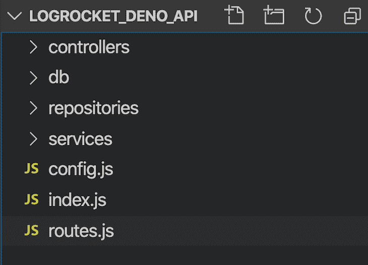
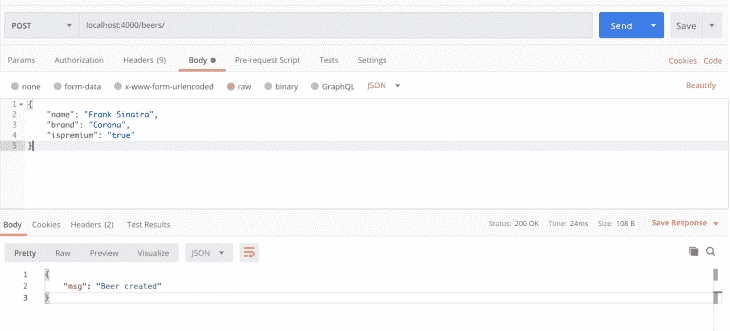
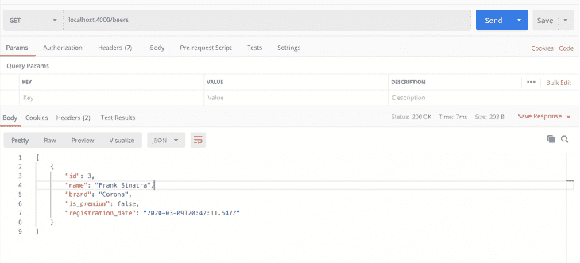

# 如何用 Deno 和 Postgres 创建 REST API-log rocket Blog

> 原文：<https://blog.logrocket.com/how-to-create-rest-api-deno-postgres/>

***编者按:*** *本帖最后更新于 2022 年 7 月 13 日以反映 Deno v1.22.0 和 Node.js v18.x.*

由 Node.js 背后的头脑创造的 JavaScript 运行时 [Deno](https://deno.land/) ，同样在开发者中获得了牵引力。通过提供 Node.js 未能提供的功能，如安全性、模块和依赖性，Deno 被证明与其前身一样强大。

Deno 建立在强大的 Google V8 引擎之上，支持开箱即用的类型脚本，也支持 JavaScript。在本文中，我们将使用 JavaScript 通过 Deno 建立一个简单的应用程序。

## 什么是德诺？

Deno 是在几种情况下产生的。首先，它是安全的，这意味着它的默认执行是基于沙盒环境的。运行时无法访问网络或文件系统之类的东西。当您的代码试图访问这些资源时，系统会提示您允许该操作。

Deno 从 URL 加载模块，就像浏览器一样，允许你使用分散的代码作为模块，直接导入到你的源代码中，而不用担心注册中心。它也是浏览器兼容的，例如，如果你使用 ES 模块。

最后，Deno 是基于类型脚本的。如果您已经使用了 TypeScript，它非常适合您；没有任何额外的设置，非常简单。如果你不使用 TypeScript，这是没有问题的。您也可以将它与普通 JavaScript 一起使用。

你可以在 Deno 的官方文档中读到更多关于 Deno 的信息。在本文中，我们将更多地关注如何做。具体来说，我们将介绍如何仅使用 JavaScript、Deno 和到 Postgres 数据库的连接从头开始创建 REST API。我们将开发的应用程序是一个不同啤酒领域的基本 CRUD。

## 建立 Deno 项目

首先，你需要设置所有需要的工具。对于本文，您需要:

*   您选择的 IDE 我将使用 VS 代码
*   一个 [Postgres](https://www.postgresql.org/) 服务器和你最喜欢的 GUI 工具来管理它
*   Deno 安装在您的机器上

[安装 Deno](https://deno.land/x/install/) 非常简单。然而，因为 Deno 不断进行更新，我们将把这篇文章的重点放在[版本 1.22.0](https://github.com/denoland/deno/releases/tag/v1.22.0) 上，所以无论发布什么新功能，它都会一直工作。

为此，运行以下命令:

```
// With Shell
curl -fsSL https://deno.land/x/install/install.sh | sh -s v1.22.0
// With PowerShell
$v="1.9.2"; iwr https://deno.land/x/install/install.ps1 -useb | iex

```

然后，运行命令`deno --version`检查安装是否有效。您应该会看到类似这样的内容:

```
deno 1.22.0 (release, x86_64-apple-darwin)
v8 10.0.139.17
typescript 4.6.2

```

### Deno 项目结构

接下来，让我们创建项目结构，包括初始文件和文件夹。在您喜欢的文件夹中，创建与下图所示相同的结构:



Rest API Deno Postgres file structure

`controllers`保存 JavaScript 文件，这些文件将处理到达的请求、对下面的服务和层的调用，以及最终响应的交付。所有这些对象都继承自 Deno，所以您不必担心是否需要手动处理请求和响应。

`db`是托管我们的 SQL 创建脚本和 Postgres 数据库直接连接的文件夹。`repositories`是处理数据库操作管理的 JavaScript 文件。每个`create`、`delete`或`update`都将在这个文件夹中按其逻辑发生。

最后，`services`是处理我们操作的业务逻辑的文件，比如验证、数据转换等等。

## 构建应用程序

让我们从第一个也是最重要的文件`index.js`的代码开始。看一下下面的代码:

```
import { Application } from "https://deno.land/x/oak/mod.ts";
import { APP_HOST, APP_PORT } from "./config.js";
import router from "./routes.js";
import _404 from "./controllers/404.js";
import errorHandler from "./controllers/errorHandler.js";

const app = new Application();

app.use(errorHandler);
app.use(router.routes());
app.use(router.allowedMethods());
app.use(_404);

console.log(`Listening on port:${APP_PORT}...`);

await app.listen(`${APP_HOST}:${APP_PORT}`);

```

我们需要一个 web 框架来处理请求和响应处理、线程管理、错误等细节。对于 Node.js，使用 Express 或 Koa 是很常见的[，然而，正如我们所看到的，Deno 不支持 Node.js 库。](https://blog.logrocket.com/comparing-top-node-js-frameworks-frontend-developers/)

我们将使用另一个受 Koa 启发的名为 [Oak](https://github.com/oakserver/oak) 的库，它是 Deno 网络服务器的中间件框架。请注意，我们使用的是 Oak v10.60，这是 Deno 1.0.0 的正确版本。如果你不提供一个版本，Deno 将总是获取最新的版本，这可能会有突破性的变化并搞乱你的项目。所以要小心！

Deno 有一个受 Koa 启发的中间件框架，它的中间件路由器受 [koa-router](https://github.com/alexmingoia/koa-router/) 启发。它的用法非常类似于 Express，从代码清单中可以看出。在第一行，我们直接从`deno.land` URL 导入 TypeScript 模块。

稍后，我们将进一步配置所有的导入。在 Oak 中，`Application`类是一切开始的地方。

我们实例化它并添加错误处理程序、控制器、路由系统，最后，调用`listen()`方法来启动服务器传递 URL、主机和端口。下面是`config.js`的代码；将其放在项目的根目录中:

```
export const APP_HOST = Deno.env.get("APP_HOST") || "127.0.0.1";
export const APP_PORT = Deno.env.get("APP_PORT") || 4000;

```

到目前为止非常熟悉，不是吗？让我们现在开始走路线。与 Express 一样，我们需要建立路由器，将我们的请求重定向到适当的 JavaScript 函数，这些函数将依次处理、存储或搜索数据并返回结果。

看一下`routes.js`的代码，它也在根文件夹中:

```
import { Router } from "https://deno.land/x/oak/mod.ts";;
import getBeers from "./controllers/getBeers.js";
import getBeerDetails from "./controllers/getBeerDetails.js";
import createBeer from "./controllers/createBeer.js";
import updateBeer from "./controllers/updateBeer.js";
import deleteBeer from "./controllers/deleteBeer.js";

const router = new Router();

router
  .get("/beers", getBeers)
  .get("/beers/:id", getBeerDetails)
  .post("/beers", createBeer)
  .put("/beers/:id", updateBeer)
  .delete("/beers/:id", deleteBeer);

export default router;

```

到目前为止，还没有任何东西可以工作。不要担心，在启动之前，我们仍然需要配置项目的其余部分。

最后一个清单显示 Oak 也将为我们处理路由系统。更具体地说，`Router`类将被实例化，以允许对每个 HTTP `GET`、`POST`、`PUT`和`DELETE`操作使用相应的方法。

文件开头的导入对应于将处理相应请求的每个函数。您可以决定是否喜欢这种方式，或者是否希望所有内容都在同一个控制器文件中。

## Deno 和 Postgres 中的数据库和存储库

在我们继续编写更多的 JavaScript 代码之前，我们需要设置数据库。确保在本地主机上安装并运行 Postgres 服务器。连接到它并创建一个名为`logrocket_deno`的新数据库。

在`public`模式中，运行下面的`create`脚本:

```
CREATE TABLE IF NOT EXISTS beers (
    id SERIAL PRIMARY KEY,
    name VARCHAR(50) NOT NULL,
    brand VARCHAR(50) NOT NULL,
    is_premium BOOLEAN,
    registration_date TIMESTAMP
)

```

这个脚本也可以在我的项目版本的`/db`文件夹中找到。它创建了一个名为`beers`的新表来存储 CRUD 的值。

注意，主键是通过关键字`SERIAL`自动递增的，以便于我们使用 ID 生成策略。现在，让我们创建处理 Postgres 连接的文件。在`db`文件夹中，创建`database.js`文件并添加以下代码:

```
import { Client } from "https://deno.land/x/postgres/mod.ts";

class Database {
  constructor() {
    this.connect();
  }

  async connect() {
   this.client = new Client({
      user: "postgres",
      database: "logrocket_deno",
      hostname: "127.0.0.1",
      password: "postgres",
      port: 5432
    });

    await this.client.connect();
  }
}

export default new Database().client;

```

确保根据您的 Postgres 配置调整连接设置。配置非常简单。

deno 基于 [node-postgres](https://node-postgres.com/) 和 [pg](https://github.com/lib/pq) 创建了 [deno-postgres](https://deno-postgres.com/) ，这是 Deno 的 PostgreSQL 驱动程序。如果您是 Node.js 用户，您会对语法很熟悉。请注意，根据您使用的数据库，这些设置会略有不同。

我们将设置对象作为一个`Client`参数传递。然而，在 MySQL 中，它直接进入`connect()`函数。

在`repositories`文件夹中，我们将创建`beerRepo.js`文件，该文件将托管存储库，以便通过我们在上面创建的文件访问数据库:

```
import client from "../db/database.js";

class BeerRepo {
   create(beer) {
      return client.queryArray
         `INSERT INTO beers (name, brand,is_premium,registration_date) VALUES (${beer.name}, ${beer.brand}, ${beer.is_premium},${beer.registration_date})`;
   }

   selectAll() {
      return client.queryArray`SELECT * FROM beers ORDER BY id`;
   }

   selectById(id) {
      return client.queryArray`SELECT * FROM beers WHERE id = ${id}`;
   }

   update(id, beer) {
      const latestBeer = this.selectById(id);

      return client.queryArray`UPDATE beers SET name = ${beer.name !== undefined ? beer.name : latestBeer.name}, brand = ${beer.brand !== undefined ? beer.brand : latestBeer.brand}, is_premium = ${beer.is_premium !== undefined ? beer.is_premium : latestBeer.is_premium} WHERE id = ${id}`;
   }

   delete(id) {
      return client.queryArray`DELETE FROM beers WHERE id = ${id}`;
   }
}

export default new BeerRepo();

```

导入连接到数据库的`database.js`文件。文件的其余部分只是类似数据库的 CRUD 操作。

像所有其他主流数据库框架一样，为了防止 SQL 注入，Deno 允许我们向 SQL 查询传递参数，并使用带标签的模板字符串。`client.QueryArray`将在内部清理输入。

每当我们想要访问或修改数据库中的数据时，我们将使用`queryArray()`函数。我们还将特别关注我们的`update`方法。这是你可以用来只更新用户传递的内容的众多策略之一。

* * *

### 更多来自 LogRocket 的精彩文章:

* * *

首先，我们通过 ID 获取用户，并将其存储在一个局部变量中。然后，当检查每个`beer`属性是否在请求有效负载内时，我们可以决定是使用它还是存储值。

## 创建服务层

既然我们的存储库已经设置好了，我们可以继续到服务层了。在`services`文件夹中，创建`beerService.js`文件并添加以下代码:

```
import beerRepo from "../repositories/beerRepo.js";

export const getBeers = async () => {
   const beers = await beerRepo.selectAll();

   return beers.rows.map(beer => {
      return     beers.rowDescription.columns.reduce((acc,el, i) => {
         acc[el.name] = beer[i];
         return acc
      },{});
   });
};

export const getBeer = async beerId => {
   const beers = await beerRepo.selectById(beerId)
   if(!beers || beers?.length===0) return null
   return beers.rowDescription.columns.reduce((acc,el, i) => {
         acc\[el.name] = beers.rows[0\][i];
         return acc
      },{});
};

export const createBeer = async beerData => {
   const newBeer = {
      name: String(beerData.name),
      brand: String(beerData.brand),
      is_premium: "is_premium" in beerData ? Boolean(beerData.is_premium) : false,
      registration_date: new Date()
   };

   await beerRepo.create(newBeer);

   return newBeer.id;
};

export const updateBeer = async (beerId, beerData) => {
   const beer = await getBeer(beerId);

   if (Object.keys(beer).length === 0 && beer.constructor === Object) {
      throw new Error("Beer not found");
   }

   const updatedBeer = {...beer,...beerData};

   beerRepo.update(beerId, updatedBeer);
};

export const deleteBeer = async beerId => {
   beerRepo.delete(beerId);
};

```

这是最重要的文件之一，我们在这里与存储库交互并接收来自控制器的调用。

每个方法也对应于一个 CRUD 操作。因为 Deno 数据库本质上是异步的，所以它总是返回一个承诺。因此，我们需要`await`直到它在我们的同步代码中完成。

此外，return 是一个与我们确切的业务对象`Beer`不对应的对象，所以我们必须将其转换成一个可理解的 JSON 对象。`getBeers`将总是返回一个数组，`getBeer`将总是返回一个对象。这两种功能的结构非常相似。

`beers`结果是一个数组的数组，因为它封装了我们的查询可能返回的列表。每个返回也是一个数组，假设每个列值都在这个数组中。反过来，`rowDescription`存储结果中每一列的信息，包括名称。

其他一些特性，比如验证，也发生在这里。在`updateBeer`函数中，您可以看到我们总是在继续更新之前检查给定的`beerId`是否存在于数据库中。否则，将会引发错误。随意添加您想要的任何验证或附加代码。

## 创建控制器

现在，我们将创建请求和响应的处理程序。遵守这一层对于我们的输入和输出验证很重要。让我们从`index.js`文件中的错误管理文件开始。

在`controllers`文件夹中，创建文件`404.js`和`errorHandler.js`，并添加下面各自的代码片段:

```
//404.js
export default ({ response }) => {
  response.status = 404;
  response.body = { msg: "Not Found" };
};

//errorHandler.js
export default async ({ response }, nextFn) => {
  try {
    await nextFn();
  } catch (err) {
    response.status = 500;
    response.body = { msg: err.message };
  }
};

```

在第一个代码块中，我们只是导出了一个函数，该函数会在我们抛出业务异常时处理它们，比如 HTTP 404。

第二个代码片段将处理应用程序生命周期中可能发生的任何其他类型的未知错误，像 HTTP 500 一样处理它们，并在响应正文中发送错误消息。

现在，让我们来看看控制器。让我们从吸气剂开始。以下是`getBeers.js`的内容:

```
import { getBeers } from "../services/beerService.js";

export default async ({ response }) => {
  response.body = await getBeers();
};

```

每个控制器操作必须是异步的。每个控制器操作接收一个或两个`request`和`response`对象作为参数，这些参数被 Oak API 截获，并在到达控制器或返回到客户端调用者之前进行预处理。不管你放入哪种类型的逻辑，不要忘记设置响应体，因为它是你的请求的结果。

下面是`getBeerDetails.js`的代码:

```
import { getBeer } from "../services/beerService.js";

export default async ({ params, response }) => {
  const beerId = params.id;

  if (!beerId) {
    response.status = 400;
    response.body = { msg: "Invalid beer id" };
    return;
  }

  const foundBeer = await getBeer(beerId);
  if (!foundBeer) {
    response.status = 404;
    response.body = { msg: `Beer with ID ${beerId} not found` };
    return;
  }

  response.body = foundBeer;
};

```

除了验证之外，这个内容类似于我们的`getBeers.js`内容。因为我们将`beerId`作为参数接收，所以最好检查一下它是否已被填充。如果该参数的值不存在，则在正文中发送相应的消息。接下来，我们将处理创建文件；以下是`createBeer.js`文件的内容:

```
import { createBeer } from "../services/beerService.js";

export default async ({ request, response }) => {
  if (!request.hasBody) {
    response.status = 400;
    response.body = { msg: "Invalid beer data" };
    return;
  }

  const { name, brand, is_premium } = await request.body().value;

  console.log(await request.body({ type: "json" }).value);
  console.log(name);

  if (!name || !brand) {
    response.status = 422;
    response.body = { msg: "Incorrect beer data. Name and brand are required" };
    return;
  }

  const beerId = await createBeer({ name, brand, is_premium });

  response.body = { msg: "Beer created", beerId };
};

```

同样，进行一些验证来保证输入数据对于必填字段是有效的。验证还确认请求附带了一个主体。

对`createBeer`服务函数的调用单独传递每个参数。如果`beer`对象的属性数量增加，维护这样一个函数是不明智的。

相反，您可以提出一个模型对象，它将存储啤酒的每一个属性，并在控制器和服务方法之间传递。下面是我们的`updateBeer.js`文件的代码:

```
import { updateBeer } from "../services/beerService.js";

export default async ({ params, request, response }) => {
  const beerId = params.id;

  if (!beerId) {
    response.status = 400;
    response.body = { msg: "Invalid beer id" };
    return;
  }

  if (!request.hasBody) {
    response.status = 400;
    response.body = { msg: "Invalid beer data" };
    return;
  }

  const { name, brand, is_premium } = await request.body().value;

  await updateBeer(beerId, { name, brand, is_premium });

  response.body = { msg: "Beer updated" };
};

```

如您所见，它具有几乎相同的结构，不同之处在于 params 配置。因为我们不允许更新`beer`对象的每一个属性，所以我们限制了哪些属性将被下放到服务层。`beerId`也必须是第一个参数，因为我们需要确定要更新哪个数据库元素。

最后`deleteBeer.js`的代码如下:

```
import { deleteBeer, getBeer } from "../services/beerService.js";

export default async ({
  params,
  response
}) => {
  const beerId = params.id;

  if (!beerId) {
    response.status = 400;
    response.body = { msg: "Invalid beer id" };
    return;
  }

  const foundBeer = await getBeer(beerId);
  if (!foundBeer) {
    response.status = 404;
    response.body = { msg: `Beer with ID ${beerId} not found` };
    return;
  }

  await deleteBeer(beerId);
  response.body = { msg: "Beer deleted" };
};

```

注意它和其他的是多么的相似。同样，如果您觉得太重复，您可以将这些控制器代码混合到一个控制器文件中。这样做将减少代码量，因为公共代码将一起保存在一个函数中。现在，让我们来测试一下。

要运行 Deno 项目，请进入命令行提示符。在根文件夹中，发出以下命令:

```
deno run --allow-net --allow-env index.js

```

请记住，Deno 使用安全资源。为了允许 HTTP 调用和访问`env`变量，我们需要显式地询问，这可以通过这些各自的标志来实现。

日志将显示下载我们的项目需要的所有依赖项。消息`Listening on port:4000...`必须出现。为了测试 API，我们将使用 [Postman](https://www.postman.com/) 实用工具，但是您可以随意使用您喜欢的工具。

下面是一个`POST`作品的实例:



An example of the POST creation

之后，转到`GET`操作，列出数据库中的所有啤酒:



Listing all beers from database

## 结论

剩下的操作测试就交给你了。您还可以访问数据库，直接检查要插入、更新或删除的值。本教程的最终代码可以在 GitHub repo 中找到[。](https://github.com/anshulrgoyal/logrocket_deno_api)

我们已经完成了一个完整的、功能性的类似 CRUD 的 API，而无需使用 Node.js 或`node_modules`目录，因为 Deno 在缓存中维护依赖关系。每次你想使用一个依赖项的时候，只要通过代码声明，Deno 就会负责下载。不需要一个`package.json`文件。

如果想将 Deno 与 TypeScript 一起使用，也不需要安装 TypeScript。您可以直接开始用 TypeScript 编码。此外，VS Code 为 Deno 提供了一个非常有用的[扩展，以帮助自动完成、模块导入、格式化等等。我希望你喜欢这篇文章，如果你有任何问题，一定要留下评论。](https://marketplace.visualstudio.com/items?itemName=denoland.vscode-deno)