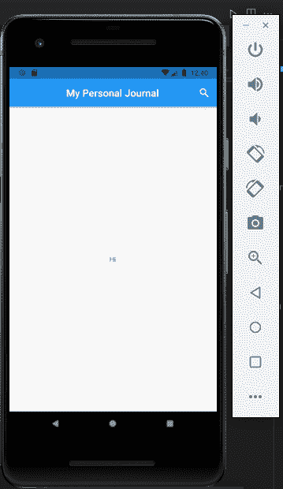
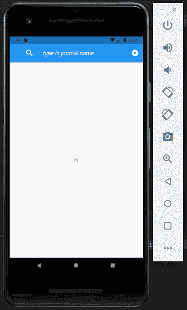

# 如何在 Flutter 中创建搜索栏

> 原文：<https://blog.logrocket.com/how-to-create-search-bar-flutter/>

Flutter 以其为各种各样的程序提供的灵活性而闻名，从电子商务到教育到银行应用等等。所有这些都可以通过使用[小部件](https://blog.logrocket.com/widgets-the-building-blocks-of-flutter-apps/)来实现，这些小部件充当复杂应用程序的简单构件。你可以将每个应用程序分解成不同的组件，其中一些是所有应用程序通用的，而另一些是特定的。

本文基于各种应用程序中使用的一个更通用的组件:搜索栏。搜索栏用于在数据库中查询特定的数据。

在本文中，我们将从头开始构建一个搜索栏，使用 Flutter 的`container`小部件和 box decoration 提供的各种属性。

包含搜索栏的应用程序将是一个基本的期刊应用程序。它将由一个`textField`类组成，当单击示例应用程序中的“搜索”图标时出现，当“取消”时消失。

在我们开始之前，请注意，本文假设您已经建立了 Flutter 开发环境，并且熟悉 Flutter 小部件和开发的基础知识。

## 设置一个示例颤振应用程序

第一步是使用 Flutter create 命令创建一个新项目:

```
flutter create search_bar

```

接下来，我们需要清除`main.dart`文件的内容并创建一个新的`MaterialApp`:

```
import 'package:flutter/material.dart';
void main() => runApp(MyApp());
class MyApp extends StatelessWidget {
 @override
 Widget build(BuildContext context) {
 return const MaterialApp(
  debugShowCheckedModeBanner: false,
  title: 'Material App',
  home: HomeScreen(),
 );
 }
}

```

我们正在为这个应用程序使用[材质设计](https://blog.logrocket.com/new-material-buttons-in-flutter/),以便于设置；我们的主要重点将是创建搜索栏，而不是设计应用程序本身。

现在让我们创建一个名为`HomeScreen`的新的有状态小部件，并将其传递给`MaterialApp`的 home 属性:

```
class HomeScreen extends StatefulWidget {
 const HomeScreen({Key? key}) : super(key: key);
 @override
 _HomeScreenState createState() => _HomeScreenState();
}
class _HomeScreenState extends State<HomeScreen> {
 @override
 Widget build(BuildContext context) {
 return Scaffold(
  appBar: AppBar(
  title: const Text('My Personal Journal'),
  automaticallyImplyLeading: false,
  centerTitle: true,
  ),
  body: Column(
  mainAxisAlignment: MainAxisAlignment.center,
  children: [
   const Center(
   child: Text('Hi'),
   ),
  ],
  ),
 );
 }
}

```

你会注意到我在上面的代码中添加了一些细节，包括一个`appBar`和一个`title`。同样，这些都是不太重要的附加功能，我们可以忽略，专注于创建搜索栏，但如果你在本教程中练习应用程序构建技巧，它们可能会派上用场。

## 创建搜索按钮

下一步是创建搜索按钮。`AppBar`为我们提供了一个名为`actions`的属性，我们可以使用这个集合来列出各种活动:

```
 appBar: AppBar(
  title: const Text('My Personal Journal'),
  automaticallyImplyLeading: false,
  actions: [
   IconButton(
   onPressed: () {},
   icon: const Icon(Icons.search),
   )
  ],
  centerTitle: true,
  ),

```

因为我们正在制作一个按钮，当它被点击时会显示一些东西(搜索栏)，所以我们将使用`IconButton`小部件。这个小部件在按下时会生成一个小动画，表明用户的选择被应用程序注册了。我们将名称传递给`icon`参数；你可以在下图中看到，我选择了放大镜图标来代表“搜索”

下图描述了我们的应用程序的当前状态:



我们需要实现`onPressed`功能来触发显示文本字段的状态重建。一旦显示文本字段，我们还必须将当前的放大镜搜索图标更改为“取消”图标。顾名思义，cancel 按钮将用于取消搜索操作。

下一步是在`HomeScreen`小部件中创建两个变量:第一个是图标，第二个是小部件。他们将持有默认的搜索按钮以及`AppBar`的标题。

我们不再像前面那样对它们进行硬编码，而是将它们传递到变量中，然后将变量传递到任何需要它们的地方:

```
 @override
 _HomeScreenState createState() => _HomeScreenState();
}
class _HomeScreenState extends State<HomeScreen> {
 Icon customIcon = const Icon(Icons.search);
 Widget customSearchBar = const Text('My Personal Journal');
 @override
 Widget build(BuildContext context) {
 return Scaffold(
  appBar: AppBar(
  title: customSearchBar,
  automaticallyImplyLeading: false,
  actions: [
   IconButton(
   onPressed: () {},
   icon: customIcon,
   )
  ],
  centerTitle: true,
  ),

```

## 管理国家

因为我们希望在搜索按钮被按下时在应用程序栏中显示文本字段，所以我们必须更新应用程序的状态。对于本文，我们将使用`setState({})`函数来更新状态。

在`IconButton`的`onPressed`函数中，我们调用`setState`函数来更新我们之前声明的变量(即`customIcon`变量和`customSearchBar`变量)的状态。

然后，我们运行 if-else 条件来检查当前图标并做出正确的决定:

```
 onPressed: () {
    setState(() {
    if (customIcon.icon == Icons.search) {
     // Perform set of instructions.
    } else {
     customIcon = const Icon(Icons.search);
     customSearchBar = const Text('My Personal Journal');
    }
    });
   },

```

目前，它检查`customIcon`是否是一个`searchIcon`，然后根据结果执行一些指令。如果不是搜索图标，它会将变量更新为它们的`defaults/original`值:

```
if (customIcon.icon == Icons.search) {
   customIcon = const Icon(Icons.cancel);
   customSearchBar = const ListTile(
   leading: Icon(
    Icons.search,
    color: Colors.white,
    size: 28,
   ),
   title: TextField(
    decoration: InputDecoration(
    hintText: 'type in journal name...',
    hintStyle: TextStyle(
     color: Colors.white,
     fontSize: 18,
     fontStyle: FontStyle.italic,
    ),
    border: InputBorder.none,
    ),
    style: TextStyle(
    color: Colors.white,
    ),
   ),
   );
  } 

```

在 if-else 逻辑块中，我们传递我们想要调用的新状态值:`customIcon`被赋予取消图标(`Icon.cancel`),`customSearchBar`被赋予包含`TextField`的`ListTile`。

在上面的代码中，搜索图标被传递给应用程序的前导参数，`TextField`被赋予`title`小部件。通过`InputDecoration`小部件调整`hintText`和样式，使用`InputBorder.none`属性移除`InputBorder`。

最后，我们的搜索栏已经完全实现了！



## 结论

有些组件对于 [Flutter 应用](https://blog.logrocket.com/why-flutter-is-overtaking-react-native/)是通用的，不管它们是什么类型的应用，其中之一就是搜索栏。在数据库中查询特定的信息是大量移动应用程序都需要的工具。根据本文所学，现在可以在 Flutter 应用程序中构建和定制搜索栏。