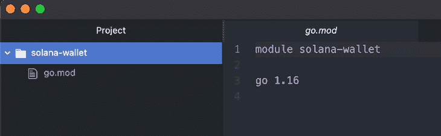
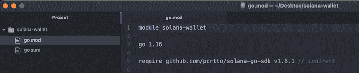
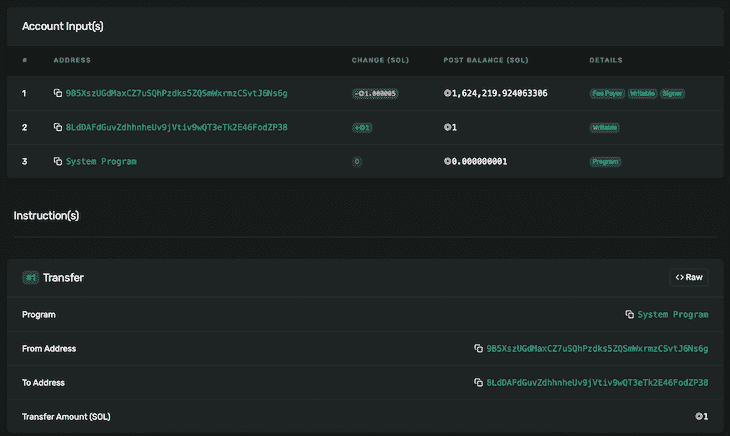

# 如何用 Go - LogRocket 博客创建一个 Solana 钱包

> 原文：<https://blog.logrocket.com/how-to-create-solana-wallet-go/>

你有没有想过用围棋探索区块链的发展？或者想要构建由 Solana 网络支持的 Go 应用程序？如果你有，这篇文章是给你的。

区块链是推动加密货币和去中心化应用的技术。它仍处于早期阶段，并在几个行业获得大量采用，带来新的工作角色和机会。根据 ZipRecruiter 的数据，区块链开发人员的平均年收入为 154，550 美元。

开始区块链开发的最简单方法是建立一个加密货币钱包来存储代币和创建交易。有几个现有的区块链，我最喜欢的一个是 Solana，因为它有丰富的生态系统、速度和开发人员友好性。

在本文中，我们将学习如何使用 Go 与 Solana 网络交互，并从头开始构建一个加密钱包来存储、接收和转移硬币。

## 先决条件

要跟随并理解本教程，您需要以下内容:

## 索拉纳是什么？

Solana(＄SOL)是全球最快的分散式区块链，强调速度、可伸缩性和用户友好性。它还拥有加密领域发展最快的生态系统，有超过 400 个项目，包括 Defi、NFTs、Web3、[和更多的](https://solana.com/ecosystem)。

Solana 在众多区块链中脱颖而出，提供了以下内容:

*   简单高效的可扩展性
*   微薄的交易成本(总是低于 0.01 美元)
*   快速的网络和数据块速度(每秒处理高达 50，000 个事务)
*   审查阻力(索拉纳应用程序将永远自由运行)

领先的网络安全公司 Kudelski Security 对 Solana 的软件架构进行了审计，审计结果可在此处获得。你也可以在[索拉纳海滩](https://solanabeach.io/)查看索拉纳网络统计数据。

## Go 和 Solana 入门

安装 [solana-go-sdk](https://pkg.go.dev/github.com/portto/solana-go-sdk#section-readme) 包，这是 solana 的 go 软件开发包(sdk)。它允许 Go 应用程序与 Solana 网络交互，包括使用 Solana [JSON RPC API](https://docs.solana.com/developing/clients/jsonrpc-api) 提供的所有方法。

### 步骤 1:设置您的开发环境

在您的文本编辑器或 IDE 中创建一个新的 Go 项目，并初始化您的`go.mod`文件。您可以自由地为您的包使用任何名称:

```
go mod init solana-wallet

```



### 步骤 2:为 Go 安装 Solana SDK

在您的项目中安装 solana-go-sdk 包。在终端中，键入以下内容:

```
go get -u github.com/portto/solana-go-sdk

```



### 步骤 3:连接到 Solana 网络

将 Solana SDK 包导入您的应用程序，然后创建一个连接到 Solana Mainnet 网络的 RPC 客户端实例。

创建一个名为`main.go`的文件，并将以下代码保存在其中:

```
package main

import (
        "context"
        "fmt"
        "github.com/portto/solana-go-sdk/client"
        "github.com/portto/solana-go-sdk/client/rpc"
)

func main() {
        // create a RPC client
        c := client.NewClient(rpc.MainnetRPCEndpoint)

        // get the current running Solana version
        response, err := c.GetVersion(context.TODO())
        if err != nil {
                panic(err)
        }

        fmt.Println("version", response.SolanaCore)
}

```

在这段代码中，我们将 Solana SDK 中的`client`和`client/rpc`模块导入到应用程序中，以创建一个 RPC 客户端并连接到 Solana 网络。

然后，我们使用`GetVersion()`方法检索当前在节点上运行的 Solana 版本，方法是使用`context.TODO()`提供一个请求上下文供服务器接受。

最后，我们使用从`GetVersion()`返回的`err`变量检查操作中的错误，并显示来自`response`变量的网络版本。如果代码运行没有任何错误，这意味着您已经成功地用 Go 连接到了 Solana Mainnet 网络。

> 如果 Go 由于`"missing go.sum entry"`错误而无法运行`main.go`文件，您需要在终端中运行`go mod tidy`命令来修复丢失的模块条目。

## 使用 Go 与 Solana 网络交互

### 打造全新 Solana 钱包

Solana SDK 提供了一个`types.NewAccount()`函数，该函数返回一个新生成的 Solana wallet。让我们看看如何使用它:

```
package main

import (
        "fmt"
        "github.com/portto/solana-go-sdk/types"
)

func main() {
        // create a new wallet using types.NewAccount()
        wallet := types.NewAccount()

        // display the wallet public and private keys
        fmt.Println("Wallet Address:", wallet.PublicKey.ToBase58())
        fmt.Println("Private Key:", wallet.PrivateKey)
}

```

这里，我们使用了 Solana SDK 中的`types.NewAccount()`函数来生成新的钱包，然后打印出它的钱包地址(base58 中的公钥)和私钥(字节片)。

### 导入 Solana 钱包

Solana SDK 提供了三个导入 Solana 钱包的函数。它们都返回一个代表 Solana 钱包的`types.Account`对象，使用不同形式的私钥(base58、字节片和十六进制值):

```
// import a wallet with base58 private key
types.AccountFromBase58("")

// import a wallet with bytes slice private key
types.AccountFromBytes([]byte{})

// import a wallet with hex private key
types.AccountFromHex("")

```

让我们看看如何从 Solana 钱包的私钥中恢复钱包:

```
package main

import (
        "fmt"
        "github.com/portto/solana-go-sdk/types"
)

func main() {
        // create a new wallet
        wallet := types.NewAccount()
        fmt.Println("Wallet Address:", wallet.PublicKey.ToBase58())

        // import the wallet using its private key
        importedWallet, err := types.AccountFromBytes(wallet.PrivateKey)

        // check for errors
        if err != nil {
                panic(err)
        }

        // display the imported wallet public and private keys
        fmt.Println("Imported Wallet Address:", importedWallet.PublicKey.ToBase58())
}

```

这里，我们使用`types.NewAcccount()`函数创建了一个新的钱包，然后使用`types.AccountFromBytes()`函数导入钱包并比较它们的地址。如果相等，则钱包导入成功。

### 取出索拉纳钱包的余额

因为我们正在创造新的钱包，他们的余额将永远是零。Solana 在其 JSON RPC API 中提供了一个 [requestAirdrop()](https://docs.solana.com/developing/clients/jsonrpc-api#requestairdrop) 方法来请求用于开发目的的硬币。让我们看看如何使用它:

```
package main

import (
        "context"
        "fmt"
        "github.com/portto/solana-go-sdk/client"
        "github.com/portto/solana-go-sdk/client/rpc"
        "github.com/portto/solana-go-sdk/types"
)

func main() {
        // create a RPC client
        c := client.NewClient(rpc.DevnetRPCEndpoint)

        // create a new wallet
        wallet := types.NewAccount()

        // request for 1 SOL airdrop using RequestAirdrop()
        txhash, err := c.RequestAirdrop(
                context.TODO(), // request context
                wallet.PublicKey.ToBase58(), // wallet address requesting airdrop
                1e9, // amount of SOL in lamport
        )

        // check for errors
        if err != nil {
                panic(err)
        }

        fmt.Println("Transaction Hash:", txhash)
}

```

我们使用了`RequestAirdrop()`函数，通过提供请求上下文、钱包公钥(base58)和 lamport 金额来请求 Solana 钱包的 Devnet 硬币。

> `RequestAirdrop()`函数接受 [lamport](https://docs.solana.com/introduction#what-are-sols) 中的`amount`参数，这是 SOL 的最小分数单位，类似于比特币的 satoshi。
> 
> 1 lamport ~ 0.000000001 SOL.

您可以使用 [Solana Devnet Explorer](https://explorer.solana.com/?cluster=devnet) 来跟踪您的交易状态。



接下来，使用 Solana SDK 提供的`GetBalance()`方法，从 Solana wallet 的 wallet 地址获取 SOL 的数量。让我们看看如何使用它:

```
package main

import (
        "context"
        "fmt"
        "github.com/portto/solana-go-sdk/client"
        "github.com/portto/solana-go-sdk/client/rpc"
)

func main() {
        // create a RPC client
        c := client.NewClient(rpc.DevnetRPCEndpoint)

        // fetch the balance using GetBalance()
        balance, err := c.GetBalance(
                context.TODO(), // request context
                "8LdDAFdGuvZdhhnheUv9jVtiv9wQT3eTk2E46FodZP38", // wallet to fetch balance for
        )

        // check for errors
        if err != nil {
                panic(err)
        }

        fmt.Println("Wallet Balance in Lamport:", balance)
        fmt.Println("Wallet Balance in SOL:", balance/1e9)
}

```

### 将索拉纳转移到另一个钱包

在 Solana 上进行转帐之前，您必须遵循四个步骤来确保您的交易是在网络上创建的。

首先，使用`GetRecentBlockhash()`函数从网络中检索最新的块散列:

```
response, err := c.GetRecentBlockhash(context.TODO())

```

然后，使用检索到的块哈希和事务签名者的公钥生成传输消息:

```
message := types.NewMessage(
        wallet.PublicKey, // public key of the transaction signer
        []types.Instruction{
                sysprog.Transfer(
                        wallet.PublicKey, // public key of the transaction sender
                        common.PublicKeyFromString(to), // wallet address of the transaction receiver
                        1e9, // transaction amount in lamport
                ),
        },
        response.Blockhash, // recent block hash
)

```

传输消息包含交易发送者、接收者和金额的公钥。也可以在一次交易中进行多次转账。

使用传输消息和事务签名者创建事务:

```
tx, err := types.NewTransaction(message, []types.Account{wallet, wallet})

```

交易签名者是为该交易付费的账户。可以让另一个账户支付交易费用，但该账户也必须签署交易。

接下来，将事务发送到网络，如下所示:

```
txhash, err := c.SendTransaction2(context.TODO(), tx)

```

将交易发送到网络后，您将收到它的散列，我们可以用它来跟踪交易。以下是完整的转账代码:

```
package main

import (
        "context"
        "fmt"
        "github.com/portto/solana-go-sdk/client"
        "github.com/portto/solana-go-sdk/client/rpc"
        "github.com/portto/solana-go-sdk/common"
        "github.com/portto/solana-go-sdk/program/sysprog"
        "github.com/portto/solana-go-sdk/types"
)

func main() {
        // create a RPC client
        c := client.NewClient(rpc.DevnetRPCEndpoint)

        // import a wallet with Devnet balance
        wallet, _ := types.AccountFromBytes([]byte{})

        // fetch the most recent blockhash
        response, err := c.GetRecentBlockhash(context.TODO())
        if err != nil {
                panic(err)
        }

        // make a transfer message with the latest block hash
        message := types.NewMessage(
                wallet.PublicKey, // public key of the transaction signer
                []types.Instruction{
                        sysprog.Transfer(
                                wallet.PublicKey, // public key of the transaction sender
                                common.PublicKeyFromString("8t88TuqUxDMVpYGHcVoXnBCAH7TPrdZ7ydr4xqcNu2Ym"), // wallet address of the transaction receiver
                                1e9, // transaction amount in lamport
                        ),
                },
                response.Blockhash, // recent block hash
        )

        // create a transaction with the message and TX signer
        tx, err := types.NewTransaction(message, []types.Account{wallet, wallet})
        if err != nil {
                panic(err)
        }

        // send the transaction to the blockchain
        txhash, err := c.SendTransaction2(context.TODO(), tx)
        if err != nil {
                panic(err)
        }

        fmt.Println("Transaction Hash:", txhash)
}

```

## 用 Go 打造 Solana 钱包

现在，您已经了解了如何与 Solana 网络交互，让我们扩展我们之前创建的代码块，使用 Go 构建一个功能完整的加密货币钱包。

让我们首先为钱包创建一个自定义类型。将以下代码保存在您的`main.go`文件中:

```
package main

import (
        "context"
        "github.com/portto/solana-go-sdk/client"
        "github.com/portto/solana-go-sdk/common"
        "github.com/portto/solana-go-sdk/program/sysprog"
        "github.com/portto/solana-go-sdk/types"
)

type Wallet struct {
        account types.Account
        c       *client.Client
}

```

我们需要一个函数来生成`Wallet`类型的新实例，这样我们就可以使用它了。将以下代码添加到`main.go`文件中:

```
func CreateNewWallet(RPCEndpoint string) Wallet {
        return Wallet{
                types.NewAccount(),
                client.NewClient(RPCEndpoint),
        }
}

```

我们可以用我们的应用程序创建新的钱包，方法是添加一个函数，使用它们的私钥导入现有的 Solana 钱包。将以下代码添加到`main.go`文件中:

```
func ImportOldWallet(privateKey []byte, RPCEndpoint string) (Wallet, error) {
        wallet, err := types.AccountFromBytes(privateKey)
        if err != nil {
                return Wallet{}, err
        }

        return Wallet{
                wallet,
                client.NewClient(RPCEndpoint),
        }, nil
}

```

现在我们有了创建和导入 Solana 钱包帐户的工作代码。让我们为`Wallet`类型创建一些方法。

我们将首先添加一个请求 SOL 空投并检索钱包余额的函数。将以下代码添加到`main.go`文件中:

```
func (w Wallet) RequestAirdrop(amount uint64) (string, error) {
        // request for SOL using RequestAirdrop()
        txhash, err := w.c.RequestAirdrop(
                context.TODO(),                 // request context
                w.account.PublicKey.ToBase58(), // wallet address requesting airdrop
                amount,                         // amount of SOL in lamport
        )
        if err != nil {
                return "", err
        }

        return txhash, nil
}

func (w Wallet) GetBalance() (uint64, error) {
        // fetch the balance using GetBalance()
        balance, err := w.c.GetBalance(
                context.TODO(),                 // request context
                w.account.PublicKey.ToBase58(), // wallet to fetch balance for
        )
        if err != nil {
                return 0, nil
        }

        return balance, nil
}

```

接下来，我们将创建一个函数，将 SOL 从我们的钱包转移到 Solana 网络上的其他钱包。将以下代码添加到`main.go`文件中:

```
func (w Wallet) Transfer(receiver string, amount uint64) (string, error) {
        // fetch the most recent blockhash
        response, err := w.c.GetRecentBlockhash(context.TODO())
        if err != nil {
                return "", err
        }

        // make a transfer message with the latest block hash
        message := types.NewMessage(
                w.account.PublicKey, // public key of the transaction signer
                []types.Instruction{
                        sysprog.Transfer(
                                w.account.PublicKey,                  // public key of the transaction sender
                                common.PublicKeyFromString(receiver), // wallet address of the transaction receiver
                                amount,                               // transaction amount in lamport
                        ),
                },
                response.Blockhash, // recent block hash
        )

        // create a transaction with the message and TX signer
        tx, err := types.NewTransaction(message, []types.Account{w.account, w.account})
        if err != nil {
                return "", err
        }

        // send the transaction to the blockchain
        txhash, err := w.c.SendTransaction2(context.TODO(), tx)
        if err != nil {
                return "", err
        }

        return txhash, nil
}

```

现在我们已经为`Wallet`类型创建了所有的方法。让我们来测试一下:

```
// create a new wallet
wallet := CreateNewWallet(rpc.DevnetRPCEndpoint)

// request for an airdrop
fmt.Println(wallet.RequestAirdrop(1e9))

// make transfer to another wallet
fmt.Println(wallet.Transfer("8t88TuqUxDMVpYGHcVoXnBCAH7TPrdZ7ydr4xqcNu2Ym", 5e8))

// fetch wallet balance
fmt.Println(wallet.GetBalance())

```

# 结论

通过使用 Solana 和 Go 探索区块链开发的世界，您不费吹灰之力就构建了一个加密货币钱包。我们看到了如何使用`solana-go-sdk`包创建和检索 Solana 钱包、存储、接收和转移硬币。

Solana 钱包的源代码可以通过 GitHub Gist 获得。此外，您可以访问 Solana 和 solana-go-sdk 的官方文档，用您新获得的知识探索和构建令人惊奇的东西。

## 加入像 Bitso 和 Coinsquare 这样的组织，他们使用 LogRocket 主动监控他们的 Web3 应用

影响用户在您的应用中激活和交易的能力的客户端问题会极大地影响您的底线。如果您对监控 UX 问题、自动显示 JavaScript 错误、跟踪缓慢的网络请求和组件加载时间感兴趣，

[try LogRocket](https://lp.logrocket.com/blg/web3-signup)

.

[](https://lp.logrocket.com/blg/web3-signup)[https://logrocket.com/signup/](https://lp.logrocket.com/blg/web3-signup)

LogRocket 就像是网络和移动应用的 DVR，记录你的网络应用或网站上发生的一切。您可以汇总和报告关键的前端性能指标，重放用户会话和应用程序状态，记录网络请求，并自动显示所有错误，而不是猜测问题发生的原因。

现代化您调试 web 和移动应用的方式— [开始免费监控](https://lp.logrocket.com/blg/web3-signup)。