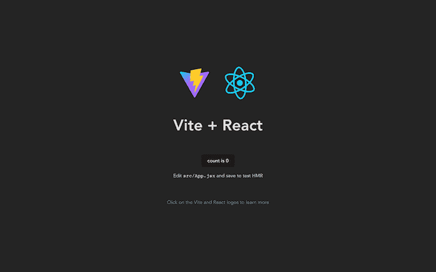
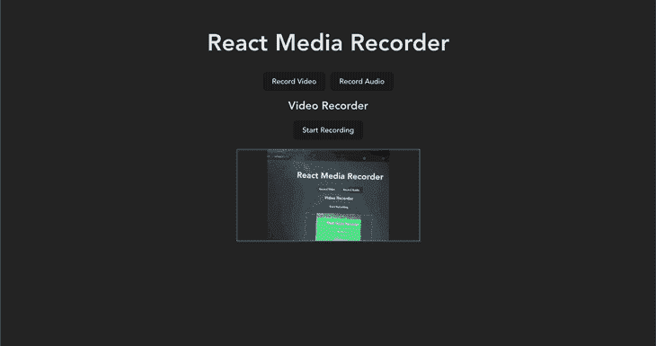

# 如何在 React 中创建视频和音频记录器

> 原文：<https://blog.logrocket.com/how-to-create-video-audio-recorder-react/>

在当今世界，远程和混合工作越来越受欢迎，组织需要在日常运营中采用异步通信形式。这些包括记录或做会议笔记，使用更多的文本交流形式等。有许多应用程序具有这些功能，使得异步通信更容易采用。

在本文中，您将了解如何使用 [MediaRecorder API](https://developer.mozilla.org/en-US/docs/Web/API/MediaRecorder) 为 React 应用程序添加视频和音频录制功能。

向前跳:

## 先决条件

*   安装在计算机上的 Node.js
*   JavaScript 和 React 的工作知识

## 搭建新的 React 应用

首先，我们将使用 [Vite](https://blog.logrocket.com/getting-started-with-vite/) 搭建一个新的 React 应用程序，这是一个超快速的 JavaScript 构建工具:

```
npm create [email protected]

```

要回答命令后的提示，请执行以下操作:

*   键入项目名称(`react-recorder`)
*   选择`React`作为框架
*   选择`Javascript`变量

接下来，让我们导航到新创建的项目目录，安装所需的依赖项，并使用以下命令运行开发服务器:

```
cd react-recorder && npm i && npm run dev

```

一旦完成，服务器将在`[http://localhost:5173/](http://localhost:5173/)`启动。让我们在网络浏览器上打开 URL。我们应该看到以下内容:



要在浏览器上录制音频或视频，需要`MediaStream`。`MediaStream`是表示媒体内容的界面，由音频和视频轨道组成。

要获得一个`MediaStream`对象，可以使用`MediaStream()`构造函数或者调用以下函数:`[MediaDevices.getUserMedia()](https://developer.mozilla.org/en-US/docs/Web/API/MediaDevices/getUserMedia)`、`[MediaDevices.getDisplayMedia()](https://developer.mozilla.org/en-US/docs/Web/API/MediaDevices/getDisplayMedia)`或者`[HTMLCanvasElement.captureStream()](https://developer.mozilla.org/en-US/docs/Web/API/HTMLCanvasElement/captureStream)`。

出于本教程的考虑，我们将关注于`MediaDevices.getuserMedia`函数来创建一个视频和音频记录器。

## 创建演示应用程序界面

在本节中，我们将创建演示应用程序的界面。

### 录音机组件

首先，在`src`目录中创建一个名为`AudioRecorder.jsx`的文件，并将以下代码块的内容粘贴到其中:

```
import { useState, useRef } from "react";
const AudioRecorder = () => {
    const [permission, setPermission] = useState(false);
    const [stream, setStream] = useState(null);

    const getMicrophonePermission = async () => {
        if ("MediaRecorder" in window) {
            try {
                const streamData = await navigator.mediaDevices.getUserMedia({
                    audio: true,
                    video: false,
                });
                setPermission(true);
                setStream(streamData);
            } catch (err) {
                alert(err.message);
            }
        } else {
            alert("The MediaRecorder API is not supported in your browser.");
        }
    };
    return (
        <div>
            <h2>Audio Recorder</h2>
            <main>
                <div className="audio-controls">
                    {!permission ? (
                        <button onClick={getMicrophonePermission} type="button">
                            Get Microphone
                        </button>
                    ): null}
                    {permission ? (
                        <button type="button">
                            Record
                        </button>
                    ): null}
                </div>
            </main>
        </div>
    );
};
export default AudioRecorder;

```

上面的代码块执行以下操作:

*   声明录音机组件的用户界面
*   使用`getMicrophonePermission`功能从浏览器接收麦克风许可
*   将从`navigator.mediaDevices*.*getUserMedia`函数接收的`MediaStream`设置为`stream`状态变量(我们很快就会用到它)

### 录像机组件

接下来，让我们为录像机组件创建接口。

仍然在`src`目录中，创建另一个名为`VideoRecorder.jsx`的文件，并粘贴以下代码块的内容:

```
import { useState, useRef } from "react";
const VideoRecorder = () => {
    const [permission, setPermission] = useState(false);
    const [stream, setStream] = useState(null);

    const getCameraPermission = async () => {
        if ("MediaRecorder" in window) {
            try {
                const streamData = await navigator.mediaDevices.getUserMedia({
                    audio: true,
                    video: true,
                });
                setPermission(true);
                setStream(streamData);
            } catch (err) {
                alert(err.message);
            }
        } else {
            alert("The MediaRecorder API is not supported in your browser.");
        }
    };

    return (
        <div>
            <h2>Video Recorder</h2>
            <main>
                <div className="video-controls">
                    {!permission ? (
                        <button onClick={getCameraPermission} type="button">
                            Get Camera
                        </button>
                    ):null}
                    {permission ? (
                        <button type="button">
                            Record
                        </button>
                    ):null}
                </div>
            </main>
        </div>
    );
};
export default VideoRecorder;

```

与录音机组件类似，上面的代码块实现了以下功能:

*   声明录像机组件的用户界面
*   使用`getCameraPermission`功能从浏览器接收麦克风许可
*   将从`getUserMedia`方法接收的`MediaStream`设置为`stream`状态变量

### 设计我们的应用程序

我们不需要编写太多的代码来设计应用程序的样式，因为大部分的样式都是在应用程序搭建过程中完成的。

在位于`src`目录的`index.css`文件中，在底部添加以下样式:

```
...
.button-flex {
  display: flex;
  justify-content: center;
  align-items: center;
  gap: 10px;
}
.audio-controls,
.video-controls {
    margin-bottom: 20px;
}
.audio-player,
.video-player {
    display: flex;
    flex-direction: column;
    align-items: center;
}
.audio-player,
.video-player,
.recorded-player {
    display: flex;
    flex-direction: column;
    align-items: center;
}
.live-player {
    height: 200px;
    width: 400px;
    border: 1px solid #646cff;
    margin-bottom: 30px;
}
.recorded-player video {
    height: 400px;
    width: 800px;
}

```

然后，将`body`元素样式对象上的`place-items`的值从`center`更改为`start`:

```
...
body {
  margin: 0;
  display: flex;
  place-items: start;
  min-width: 320px;
  min-height: 100vh;
}
...

```

### 渲染组件

要显示新创建的组件，导航到`App.jsx`并用以下代码块替换其内容:

```
import "./App.css";
import { useState, useRef } from "react";
import VideoRecorder from "../src/VideoRecorder";
import AudioRecorder from "../src/AudioRecorder";

const App = () => {
    let [recordOption, setRecordOption] = useState("video");
    const toggleRecordOption = (type) => {
        return () => {
            setRecordOption(type);
        };
    };
    return (
        <div>
            <h1>React Media Recorder</h1>
            <div className="button-flex">
                <button onClick={toggleRecordOption("video")}>
                  Record Video
                </button>
                <button onClick={toggleRecordOption("audio")}>
                  Record Audio
                </button>
            </div>
            <div>
                {recordOption === "video" ? <VideoRecorder /> : <AudioRecorder />}
            </div>
        </div>
    );
};
export default App;

```

上面的代码块根据所选的选项呈现了`VideoRecorder`或`AudioRecorder`组件。

回到浏览器，您应该会得到以下结果:


现在已经完成了，让我们把重点放在增强组件的功能上。

## 组件增强:录音机

为了使录音机完整，它需要满足以下要求:

*   停止/开始录音
*   播放和音频下载

### 停止/开始录音

让我们从声明变量和状态值开始。

首先，就在组件的函数范围之外(因为我们不需要它在组件状态更新时重新呈现)，让我们声明变量`mimeType`:

```
...
const mimeType = "audio/webm";
...

```

该变量设置所需的文件类型。点击了解更多关于 [MIME 类型的信息。](https://developer.mozilla.org/en-US/docs/Glossary/MIME_type)

接下来，让我们在`AudioRecorder`组件范围内声明以下状态变量:

```
const [permission, setPermission] = useState(false);
const mediaRecorder = useRef(null);
const [recordingStatus, setRecordingStatus] = useState("inactive");
const [stream, setStream] = useState(null);
const [audioChunks, setAudioChunks] = useState([]);
const [audio, setAudio] = useState(null);

```

*   `permission`使用一个布尔值来表示是否已经给予用户权限
*   `mediaRecorder`保存着来自创建一个新的 [`MediaRecorder`](https://developer.mozilla.org/en-US/docs/Web/API/MediaRecorder) 对象的数据，给出一个`MediaStream`来记录
*   `recordingStatus`设置记录仪的当前记录状态。三个可能的值是`recording`、`inactive`和`paused`
*   `stream`包含从`getUserMedia`方法接收的`MediaStream`
*   `audioChunks`包含录音的编码片段(组块)
*   `audio`包含已完成录音的 blob URL

既然已经解决了这个问题，让我们来定义允许我们开始和停止记录的函数。

先说`startRecording`函数。就在`getMicrophonePermission`函数之后，添加以下代码:

```
...
const startRecording = async () => {
  setRecordingStatus("recording");
  //create new Media recorder instance using the stream
  const media = new MediaRecorder(stream, { type: mimeType });
  //set the MediaRecorder instance to the mediaRecorder ref
  mediaRecorder.current = media;
  //invokes the start method to start the recording process
  mediaRecorder.current.start();
  let localAudioChunks = [];
  mediaRecorder.current.ondataavailable = (event) => {
     if (typeof event.data === "undefined") return;
     if (event.data.size === 0) return;
     localAudioChunks.push(event.data);
  };
  setAudioChunks(localAudioChunks);
};
...

```

接下来，在`startRecording`函数下面创建一个`stopRecording`函数:

```
const stopRecording = () => {
  setRecordingStatus("inactive");
  //stops the recording instance
  mediaRecorder.current.stop();
  mediaRecorder.current.onstop = () => {
    //creates a blob file from the audiochunks data
     const audioBlob = new Blob(audioChunks, { type: mimeType });
    //creates a playable URL from the blob file.
     const audioUrl = URL.createObjectURL(audioBlob);
     setAudio(audioUrl);
     setAudioChunks([]);
  };
};

```

接下来，让我们用`"audio-controls"`的`className`修改`<div>`，以根据`recordingStatus`的状态有条件地呈现开始和停止记录按钮:

```
<div className="audio-controls">
    {!permission ? (
    <button onClick={getMicrophonePermission} type="button">
        Get Microphone
    </button>
    ) : null}
    {permission && recordingStatus === "inactive" ? (
    <button onClick={startRecording} type="button">
        Start Recording
    </button>
    ) : null}
    {recordingStatus === "recording" ? (
    <button onClick={stopRecording} type="button">
        Stop Recording
    </button>
    ) : null}
</div>

```

### 播放和音频下载

为了回放录制的音频文件，我们将使用 HTML `audio`标签。

在`"audio-controls"`的`<div>`与`className`下面，我们添加以下代码:

```
...
{audio ? (
  <div className="audio-container">
     <audio src={audio} controls></audio>
     <a download href={audio}>
        Download Recording
     </a>
   </div>
) : null}
...

```

将 blob 从记录链接到锚元素并添加`download`属性使其成为“可下载的”

现在，录音机应该是这样的:


## 组件增强:录像机

为了使录像机完整，它需要满足以下要求:

*   实时视频输入
*   停止/开始视频录制
*   播放和视频下载

### 实时视频输入

我们需要查看相机活动时的视野，以了解记录中捕捉到的区域。

首先，让我们将所需的文件`mimeType`设置在`VideoRecorder`组件的功能范围之外:

```
...
const mimeType = "video/webm";
...

```

接下来，让我们定义所需的状态变量。我们将返回到之前创建的`VideoRecorder.jsx`文件:

```
const [permission, setPermission] = useState(false);
const mediaRecorder = useRef(null);
const liveVideoFeed = useRef(null);
const [recordingStatus, setRecordingStatus] = useState("inactive");
const [stream, setStream] = useState(null);
const [videoChunks, setVideoChunks] = useState([]);
const [recordedVideo, setRecordedVideo] = useState(null);

```

*   `permission`使用一个布尔值来表示是否已经给予用户权限
*   `liveVideoFeed`包含用户摄像机的实时视频流
*   `recordingStatus`设置记录仪的当前记录状态。三个可能的值是`recording`、`inactive`和`paused`
*   `stream`包含从`getUserMedia`方法接收的`MediaStream`
*   `videoChunks`包含视频记录的编码片段(组块)
*   `recordedVideo`包含已完成视频录制的 blob URL

让我们也将`getCameraPermission`函数修改如下:

```
...
const getCameraPermission = async () => {
    setRecordedVideo(null);
    if ("MediaRecorder" in window) {
        try {
            const videoConstraints = {
                audio: false,
                video: true,
            };
            const audioConstraints = { audio: true };
            // create audio and video streams separately
            const audioStream = await navigator.mediaDevices.getUserMedia(
                audioConstraints
            );
            const videoStream = await navigator.mediaDevices.getUserMedia(
                videoConstraints
            );
            setPermission(true);
            //combine both audio and video streams
            const combinedStream = new MediaStream([
                ...videoStream.getVideoTracks(),
                ...audioStream.getAudioTracks(),
            ]);
            setStream(combinedStream);
            //set videostream to live feed player
            liveVideoFeed.current.srcObject = videoStream;
        } catch (err) {
            alert(err.message);
        }
    } else {
        alert("The MediaRecorder API is not supported in your browser.");
    }
};
...

```

为了防止麦克风在录音过程中产生回声，我们将分别为音频和视频创建两个独立的媒体流，然后将这两个媒体流合并为一个。最后，设置`liveVideoFeed`只包含视频流。

### 停止和开始录像

类似于我们之前创建的录音机，我们将从在`getCameraPermission`函数下面创建`startRecording`函数开始:

```
...
const startRecording = async () => {
    setRecordingStatus("recording");
    const media = new MediaRecorder(stream, { mimeType });
    mediaRecorder.current = media;
    mediaRecorder.current.start();
    let localVideoChunks = [];
    mediaRecorder.current.ondataavailable = (event) => {
        if (typeof event.data === "undefined") return;
        if (event.data.size === 0) return;
        localVideoChunks.push(event.data);
    };
    setVideoChunks(localVideoChunks);
};
...

```

接下来，我们将在`startRecording`函数下面创建函数`stopRecording`来停止视频记录:

```
...
const stopRecording = () => {
    setPermission(false);
    setRecordingStatus("inactive");
    mediaRecorder.current.stop();
    mediaRecorder.current.onstop = () => {
        const videoBlob = new Blob(videoChunks, { type: mimeType });
        const videoUrl = URL.createObjectURL(videoBlob);
        setRecordedVideo(videoUrl);
        setVideoChunks([]);
    };
};
...

```

### 播放和视频下载

为了启用回放和视频下载，以及查看我们到目前为止所做的所有更改，让我们更新组件文件的 HTML 部分:

```
...
<div>
    <h2>Audio Recorder</h2>
    <main>
        <div className="audio-controls">
            {!permission ? (
            <button onClick={getMicrophonePermission} type="button">
                Get Microphone
            </button>
            ) : null}
            {permission && recordingStatus === "inactive" ? (
            <button onClick={startRecording} type="button">
                Start Recording
            </button>
            ) : null}
            {recordingStatus === "recording" ? (
            <button onClick={stopRecording} type="button">
                Stop Recording
            </button>
            ) : null}
        </div>
        {audio ? (
        <div className="audio-player">
            <audio src={audio} controls></audio>
            <a download href={audio}>
                Download Recording
            </a>
        </div>
        ) : null}
    </main>
</div>
...

```

现在，录像机应该是这样的:



## 创建自己的视频和音频记录器的替代方法

与其编写所有这些代码来在应用程序中实现音频和视频录制，不如考虑使用一个针对您要实现的目标而优化的外部库。

一个流行的例子是 [RecordRTC](https://www.npmjs.com/package/recordrtc) ，这是一个灵活的 JavaScript 库，提供了广泛的定制选项。其他例子还有[反应媒体录像机](https://www.npmjs.com/package/react-media-recorder)、[反应录像机](https://www.npmjs.com/package/react-video-recorder)等。

*N **。**B*T4。请记得在使用这些软件包之前做好调查。

## 结论

在本教程中，我们学习了如何使用原生 HTML MediaRecorder API 和 MediaStream API 在 React 中构建自定义的音频和视频记录器。

这个项目的所有源代码都可以在这个 [GitHub 库](https://github.com/codiini/react-audio-video-recorder)中找到。您可以随意派生存储库并使用代码。我很想看看你能做些什么🙂

干杯！

## 使用 LogRocket 消除传统反应错误报告的噪音

[LogRocket](https://lp.logrocket.com/blg/react-signup-issue-free)

是一款 React analytics 解决方案，可保护您免受数百个误报错误警报的影响，只针对少数真正重要的项目。LogRocket 告诉您 React 应用程序中实际影响用户的最具影响力的 bug 和 UX 问题。

[ ](https://lp.logrocket.com/blg/react-signup-general) [  ](https://lp.logrocket.com/blg/react-signup-general) [LogRocket](https://lp.logrocket.com/blg/react-signup-issue-free)

自动聚合客户端错误、反应错误边界、还原状态、缓慢的组件加载时间、JS 异常、前端性能指标和用户交互。然后，LogRocket 使用机器学习来通知您影响大多数用户的最具影响力的问题，并提供您修复它所需的上下文。

关注重要的 React bug—[今天就试试 LogRocket】。](https://lp.logrocket.com/blg/react-signup-issue-free)