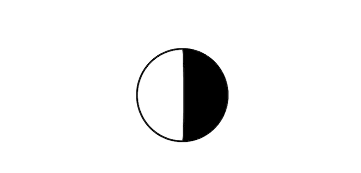
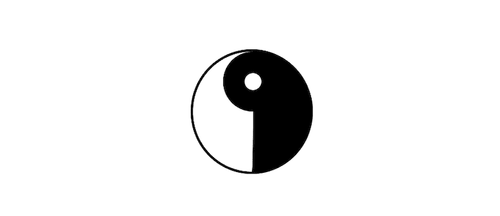
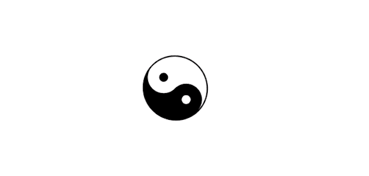

# 如何用纯 CSS 创建一个阴阳符号

> 原文：<https://blog.logrocket.com/how-to-create-yin-yang-symbol-pure-css/>

作为开发人员，我们经常花很多时间设计元素。无论是一个简单的网站还是一个复杂的应用程序，如果没有大量的 CSS，我们就不能把它做得很好。事情并不总是看起来那么简单，有些任务相当复杂。然而，如果你有正确的技巧，你可以相对容易地想出解决这些问题的方法。这就是为什么熟能生巧。

练习 CSS 的一个方法是用纯 CSS 重新创建图片、图标或绘图。在本教程中，我们将用纯 CSS 和一行 HTML 创建一个阴阳符号。我们将回顾一下[伪类](https://css-tricks.com/pseudo-class-selectors/)和不同边界属性的用法，如果您磨练自己的技能并经常练习，您将会看到这样的任务是多么简单。

参见 [CodePen](https://codepen.io) 上马克斯·阿克曼科([@马克西马科](https://codepen.io/maximakymenko) )
的笔 [GRgWWKb](https://codepen.io/maximakymenko/pen/GRgWWKb) 。

1.创建一个形状

## 先说我们阴阳的形状。正如我之前提到的，这个练习只需要一行 HTML 代码:

现在让我们开始设计风格。

```
<div class="yinyang"></div>

```

我们需要创建一个圆形，并添加黑色和白色来区分我们阴阳身体的两侧。为此，我们将对`border-width`属性使用一个简单的技巧:

我们将使用`position: relative`在我们的身体内部添加更多的形状。然而，棘手的是，我们将我们的`width`指定为一个`50px`，并将`border-width`设置为`2px 50px 2px 2px`。

```
.yinyang {
  position: relative;
  background: #fff;
  height: 100px;
  border-color: #000;
  border-style: solid;
  width: 50px; 
  border-width: 2px 50px 2px 2px;
  border-radius: 50%;
} 

```

属性允许我们指定每条边的宽度:上、右、下和左。你会看到我们将右边设置为`50px`，加上宽度，加起来总共是`100px`，等于我们的`height`属性。

现在我们有了一个正方形，所以我们将设置`border-radius`到`50%`来使它成为一个圆。

左边因为`background`属性是白色的，白边是黑色的因为`border-color`设置为黑色。



专业提示:要使形状水平居中，只需使用`body`上的 [`flex`](https://developer.mozilla.org/en-US/docs/Web/CSS/CSS_Flexible_Box_Layout) 属性，如下所示。

2.建立核心圈子

```
 body {
  display: flex;
  justify-content: center;
}

```

## 两个圈子背后的理念是一样的。为此，我们将使用 CSS 伪元素，如`:before`和`:after`。伪元素允许您创建不在 [DOM](https://www.w3schools.com/js/js_htmldom.asp) 上的元素，并对元素内容的特定部分进行样式化。最重要的是，它们可以让你在不添加额外标记的情况下给网站添加额外的样式。

先从 [`:before`](https://developer.mozilla.org/en-US/docs/Web/CSS/border-width) 说起吧。

记住，总是添加一个`content`属性来让伪元素工作。

```
.yinyang:before {
  content: '';
  position: absolute;
  top: 0;
  left: 50%;
  background: #fff;
  border: 18px solid #000;
  border-radius: 50%;
  width: 14px;
  height: 14px;
}

```

我们绝对定位了第一个内圈，因为我们的父圈有`position: relative`，所以属性`top`和`left`是相对于它设置的。这让我们可以将第一个内圈居中。如果你仔细看，你会发现它只是一个白色的圆圈，周围有一个加粗(18px)的边框。



下一步是对我们的底圈做同样的操作。唯一的区别是，我们将使用 [`:after`](https://developer.mozilla.org/en-US/docs/Web/CSS/::after) 伪元素反转颜色，生成一个带有白色边框的黑色圆圈。

正如你所看到的，样式看起来几乎相同，唯一的区别是颜色。

```
.yinyang:after {
  content: '';
  position: absolute;
  top: 50%;
  left: 50%;
  background: #000;
  border: 18px solid #fff;
  border-radius: 50%;
  width: 14px;
  height: 14px;
}

```


3.添加简单动画

## 现在，我们将创建一个简单的动画，使我们的工作更具互动性。例如，如果我们想让它成为一个旋转器，我们可以使用`[@keyframes](https://www.w3schools.com/cssref/css3_pr_animation-keyframes.asp)`添加一些滚动动画。

我们只需要两行代码就能让符号滚动。我们将调用我们的动画`roll`，并在其中定义两个属性:`from`作为起始点，`to`作为结束点。

显然，我们从`0deg`开始，我们不希望我们的动画永远停止。庞大的数字保证了我们的阴阳师永远滚动。

```
@keyframes roll {
  from {
    transform:rotate(0deg);
  }
  to {
    transform:rotate(3600000deg);
  }
}

```

最后一步是给我们的元素添加 [`animation`](https://www.w3schools.com/cssref/css3_pr_animation.asp) 属性，其实是很多不同属性的简写，比如`animation-name`、`animation-duration`等。所以让我们将动画添加到我们的`.yinyang`类中。



```
animation: roll 40000s infinite;

```

结论

## 现在你有了一个完整的、连续滚动的阴阳 CSS。更重要的是，你从这个练习中学到了一些新东西，提高了你的 CSS 样式技能。

你可以随意修改这个元素，或者以它为基础来创造更酷的东西。这是另一种提高 CSS 技能的有趣而有效的方法。如果你知道这些基础知识，你在处理复杂的项目时会感觉更舒服。

你的前端是否占用了用户的 CPU？

## 随着 web 前端变得越来越复杂，资源贪婪的特性对浏览器的要求越来越高。如果您对监控和跟踪生产环境中所有用户的客户端 CPU 使用、内存使用等感兴趣，

.

[try LogRocket](https://lp.logrocket.com/blg/css-signup)

LogRocket 就像是网络和移动应用的 DVR，记录你的网络应用或网站上发生的一切。您可以汇总和报告关键的前端性能指标，重放用户会话和应用程序状态，记录网络请求，并自动显示所有错误，而不是猜测问题发生的原因。

[](https://lp.logrocket.com/blg/css-signup)[https://logrocket.com/signup/](https://lp.logrocket.com/blg/css-signup)

现代化您调试 web 和移动应用的方式— [开始免费监控](https://lp.logrocket.com/blg/css-signup)。

Modernize how you debug web and mobile apps — [Start monitoring for free](https://lp.logrocket.com/blg/css-signup).