# 如何在 Chrome 中调试 TypeScript

> 原文：<https://blog.logrocket.com/how-to-debug-typescript-chrome/>

软件缺陷是一种编程错误或软件程序的意外行为。调试是指检查和消除软件系统中的错误的过程。程序员使用各种技术进行调试；一些开发人员将输出写入终端，而其他人则使用调试器工具来执行和监控源代码。

Google Chrome 网络浏览器提供了一个内置的调试器，带有用于调试 JavaScript 的 DevTools 模块。Chrome DevTools 实现了对源映射的支持，可以检查 Node.js 和 Deno 调试器实例。因此，无论您是在客户端应用程序(即基于 TypeScript 的 React 应用程序)中使用 TypeScript，还是在服务器端应用程序中使用 TypeScript，您都可以使用 Chrome 进行调试。

在本教程中，我将解释如何在 Chrome 中调试客户端和服务器端的 TypeScript 代码。我们将涵盖:

Web 浏览器内置了对 JavaScript 和 WebAssembly 的支持，但不支持 TypeScript。那么，如果 Chrome 不原生执行 TypeScript，我们如何在 Chrome 中调试 TypeScript 呢？Chrome 和所有标准的网络浏览器都支持处理 JavaScript [源码图](https://firefox-source-docs.mozilla.org/devtools-user/debugger/how_to/use_a_source_map/index.html)。

JavaScript 源代码映射通常将特定 JavaScript 源代码的特定形式映射到浏览器执行的 JavaScript 源代码。例如，很难在浏览器中调试一个缩小的 JavaScript 文件，但是如果您使用一个源地图，您可以在执行其缩小版本时轻松地调试可读的 JavaScript 文件。类似地，当在 Chrome 中运行 TypeScript 文件的 transpiled JavaScript 版本时，可以调试该文件。

官方的 TypeScript 编译器`tsc`可以在 trans 编译过程中生成源码图，所以现在我们可以编写 TypeScript 代码，随同源码图一起 transpile 到 JavaScript，在浏览器中调试 TypeScript 代码，同时执行 transpiled 的 JavaScript 代码。

像 Node 和 [Deno](https://blog.logrocket.com/what-is-deno/) 这样的服务器端运行时，我们可以运行 JavaScript/TypeScript，通过 v8 监听 Chrome DevTools 调试器事件。这就是我们如何在 Chrome 中调试服务器端 TypeScript 代码！

## 调试任何类型脚本文件:手动配置

当您使用前端框架构建应用程序时，它们的 TypeScript 模板通常会附带预包含的 TypeScript 编译器配置，并自动为您生成源映射。但是在某些场景中，我们必须配置 TypeScript 编译器，生成我们自己的源映射，并使用 HTML `script`标签手动链接我们的 transpiled TypeScript 文件。

这是学习如何在 Chrome 中调试 TypeScript 的好方法，因为手动配置和设置有助于我们理解 TypeScript 调试的内部机制。让我们准备一个开发环境来调试 Chrome 中的任何客户端 TypeScript 文件。

首先，在您喜欢的任何目录中创建新的 npm 项目，如下所示:

```
npm init
# --- or ---
yarn init

```

接下来，安装`typescript`包:

```
npm install typescript
# --- or ---
yarn install typescript

```

现在，生成 TypeScript 编译器配置文件:

```
npx tsc --init

```

默认配置不会启用源映射生成，因此我们需要编辑自动生成的配置文件。取消对`tsconfig.json`中以下行的注释，以启用源映射生成:

```
"sourceMap": true,

```

添加一个 npm 脚本，通过修改您的`package.json`来生成 JavaScript:

```
"scripts": {
  "build": "npx tsc"
},

```

现在，我们可以使用`npm run build`或`yarn build`命令来传输类型脚本文件。我们将调试以下类型脚本代码:

```
function sayHello(name: string): void {
    let message = `Hello ${name}!`;
    console.log(message);
    if(name == 'TypeScript') {
        console.log('.ts');
    }
    else if(name == 'JavaScript') {
        console.log('.js');
    }
}

sayHello('TypeScript');
sayHello('JavaScript');

```

将上述代码添加到`main.ts`中。接下来，使用`index.html`中的`main.js`:

```
<script src="./main.js"></script>

```

使用以下命令生成`main.js`和`main.js.map`(我们的源地图):

```
npm run build
# --- or ---
yarn build

```

使用以下命令提供`[http://localhost:3000](http://localhost:3000)`中的网页内容:

```
npx serve

```

上面的代码在端口`3000`启动一个静态服务器(Vercel 的[服务器](https://github.com/vercel/serve))。在 Chrome 中打开网址，打开 DevTools，点击**源**标签。您将看到如下`main.ts`:

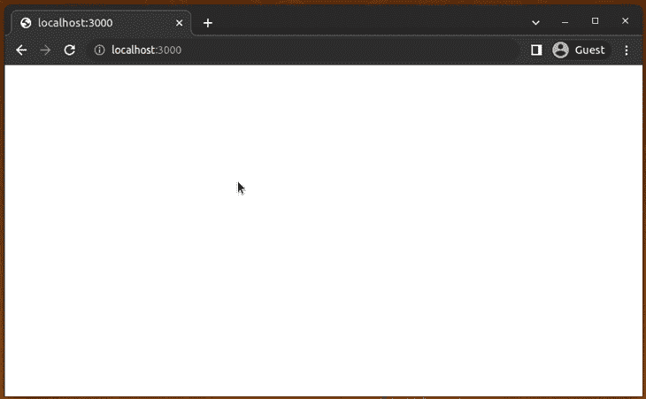

Opening a TypeScript source file in Chrome DevTools

尝试添加断点并重新加载应用程序。您可以像在 Chrome 中调试 JavaScript 一样调试 TypeScript:

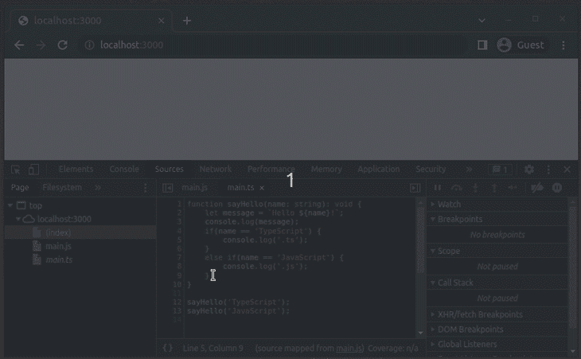

Setting a breakpoint in a TypeScript source file

Chrome 会自动加载源映射，因为 TypeScript 编译器会将源映射文件名附加到`main.js`:

```
//# sourceMappingURL=main.js.map

```

`debugger`关键字也适用于 TypeScript 调试。在`console.log(message);`语句后添加`debugger`并重新加载应用程序:

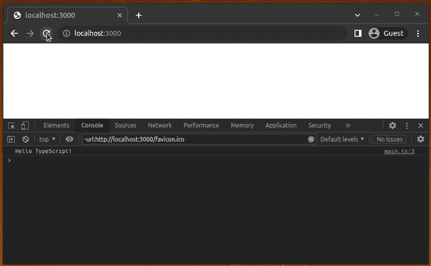

Using the `debugger` keyword in a TypeScript file

出于实验目的，尝试移除源映射文件(`main.js.map`)并调试`main.ts`。因为 TypeScript 调试是基于源映射工作的，所以`main.ts`文件将从源代码面板中消失。

使用这种方法，可以调试与 [webpack](https://blog.logrocket.com/tag/webpack/) 或 [Rollup](https://blog.logrocket.com/using-rollup-package-library-typescript-javascript/) 捆绑在一起的类型脚本代码。通过向 web 目录添加自动生成的源映射，可以在 Chrome 中启用调试 TypeScript。

## 前端框架中的调试:自动配置

之前，我们通过手动配置了解了 Chrome 中的 TypeScript 调试是如何工作的。但是正如我们提到的，几乎所有的前端框架/库都提供了预实现的 TypeScript 模板，它们通常包含编译器配置来生成源映射。这使得当你在开发者模式下运行应用时，Chrome 会自动启用 TypeScript 调试。

现在，我们将使用 Create React app 的[官方 TypeScript 模板](https://github.com/facebook/create-react-app/tree/main/packages/cra-template-typescript)创建一个 React App，以了解如何调试使用现代前端框架构建的 TypeScript 应用。运行以下命令创建新的 TypeScript-React 应用程序:

```
npx create-react-app my-app --template typescript
#--- or --- 
yarn create react-app my-app --template typescript

```

现在，将以下代码添加到您的`App.tsx`文件中:

```
import React, { useState } from 'react';
import './App.css';

function App(): JSX.Element {
  const [message, setMessage] = useState('');

  function generateMessage(name: string): string {
    let message: string = `Hello ${name}!`;
    return message;
  }

  function handleClick(): void {
    setMessage(generateMessage('TypeScript'));
  }

  return (
    <div>
      <div>{message}</div>
      <button onClick={handleClick}>Say hello</button>
    </div>
  );
}

export default App;

```

当我们单击 **Say hello** 按钮时，上面的代码呈现一条问候消息。使用以下命令运行项目，开始调试 TypeScript:

```
npm start
# --- or ---
yarn start

```

假设需要为`App.tsx`的第 8 行设置断点。由于我们有多个源文件，我们可以通过按 Control+P 轻松导航到`App.tsx`:

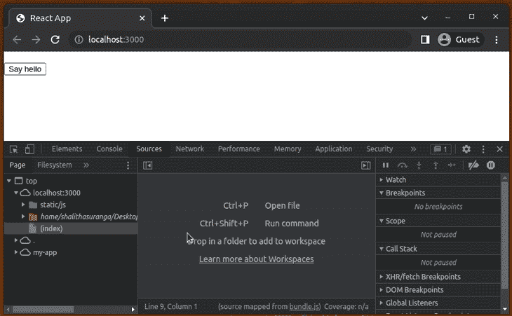

Searching for a specific file in the Chrome debugger

现在，设置断点并单击按钮。对于 TypeScript，DevTools 调试器按预期工作:

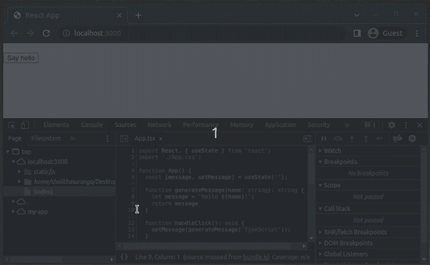

Setting a breakpoint for a TypeScript-based React app in Chrome

尝试使用**调用堆栈**部分来监控 TypeScript 函数调用:

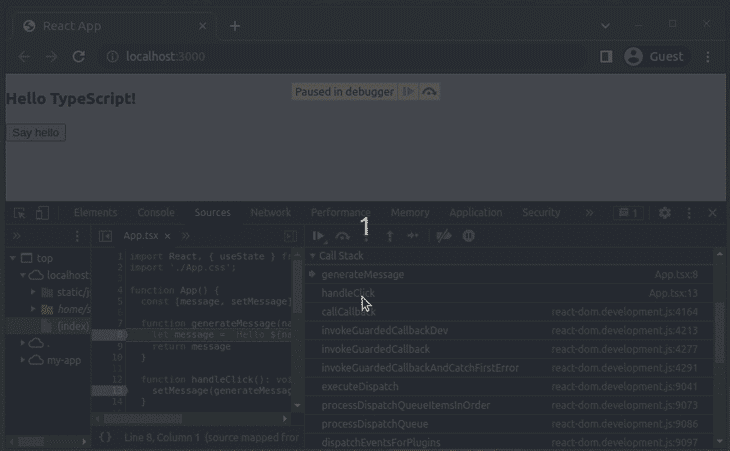

Inspecting TypeScript function names in Call stack

由于源代码映射，每个调试器功能都适用于 TypeScript 调试。React scripts 模块进行实时的 TypeScript 编译，因此您可以通过检查 Chrome 或您的终端来修复 TypeScript 编程错误。

出于实验目的，让我们向`generateMessage`函数发送一个整数:

```
function handleClick(): void {
  setMessage(generateMessage(1));
}

```

现在，你会在 Chrome 和终端上看到 TypeScript 编译错误:

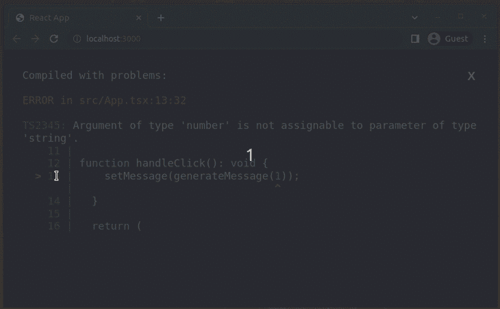

The React development environment shows TypeScript compilation issues

所有流行的前端框架，比如 Angular，Vue，Svelte 等。，提供 TypeScript 开发支持，自动生成 JavaScript 源码图。因此，当使用前端框架工具时，调试 TypeScript 变得非常容易。

## 集成 VS 代码进行前端调试

如果用 VS 代码写代码，可以用编辑器 UI 代替 Chrome DevTools 作为调试器接口。VS 代码通过预装的 [JavaScript 调试器](https://marketplace.visualstudio.com/items?itemName=ms-vscode.js-debug)扩展为调试 JavaScript/TypeScript 提供了内置支持。

启动您的 web 开发服务器(即 webpack 开发服务器)并使用以下`launch.json`设置启动 Chrome:

```
{
    "version": "0.2.0",
    "configurations": [
        {
            "type": "chrome",
            "name": "Chrome",
            "request": "launch",
            "url": "http://localhost:3000"
        }
    ]
}

```

当您按 F5 并开始调试时，可以从编辑器中设置断点。例如，参见我如何调试`App.tsx`:

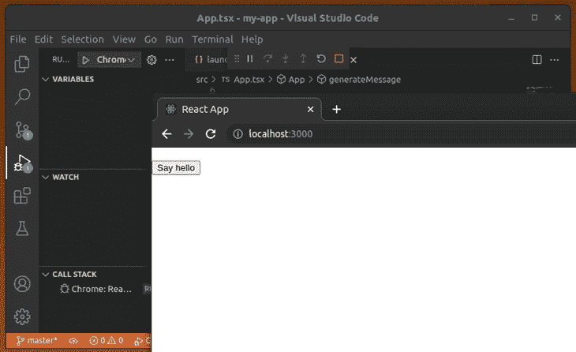

Debugging a TypeScript-based React app with VS Code and Chrome

## 调试 TypeScript 后端代码

您可以使用 TypeScript 编写 Node.js 和 Deno 后端项目。我们来讨论一下如何使用 Chrome 来调试它们。

### 调试基于 TypeScript 的 Node.js 应用程序

与客户端 TypeScript 开发一样，在使用 Node.js 运行时执行项目之前，我们必须将 TypeScript 转换成 JavaScript。客户端 JavaScript 执行使用 Chrome 内置的 v8 JavaScript 引擎，因此我们可以像以前一样直接使用 DevTools 调试器，但 Node.js 运行时使用自己的 v8 实例，因此它提供了内置的调试器工具，因为它不能直接使用 Chrome 的调试器/JavaScript 执行环境。

使用我们在客户端调试中遵循的相同步骤创建一个新的 npm 项目和一个 TypeScript 配置文件(启用了源映射)。接下来，将以下代码添加到`main.ts`:

```
function sayHello(name: string): void {
    let message: string = `Hello ${name}!`;
    console.log(message);
    if(name == 'TypeScript') {
        console.log('.ts');
    }
    else if(name == 'JavaScript') {
        console.log('.js');
    }
}

sayHello('TypeScript');
sayHello('JavaScript');

```

将以下脚本添加到您的`package.json`文件中:

```
"scripts": {
  "build": "npx tsc",
  "debug": "node inspect main.js"
},

```

生成 JavaScript 文件和源映射:

```
npm run build
# --- or ---
yarn build

```

接下来，使用以下命令启动 Node.js 调试器:

```
npm run debug
# --- or ---
yarn debug

```

上面的 npm 脚本初始化内置的 Node.js 调试器实用程序，并开始通过 WebSockets 监听 Chrome DevTools 协议消息。因此，我们既可以通过命令行使用内置的 Node.js 调试器工具，也可以通过 Chrome DevTools 使用 GUI 调试器。

运行上述命令后，调试器会自动为第一条可执行语句设置断点，如下所示:

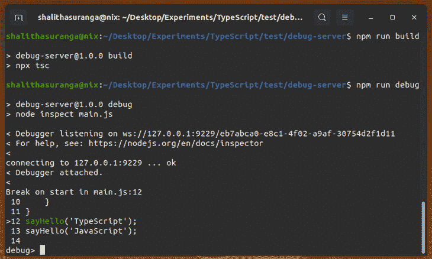

The inbuilt Node.js debugger utility stopped at a breakpoint

内置调试器不支持 TypeScript 调试，因为它不理解源代码映射——它只是一个带有几个命令的最小调试器。例如，您可以使用以下命令在第 5 行设置一个断点，并在新添加的断点处停止代码执行:

```
sb(5)
c

```

你可以在官方文档中找到所有内置的调试器命令。我们不会进一步讨论内置调试器，因为在本教程中我们的重点是 Chrome 调试器。

让我们在 Chrome 中调试这个 TypeScript 项目。使用`debug` npm 脚本运行项目，并转到 Chrome 上的以下 URL:

```
chrome://inspect

```

现在，打开 DevTools 调试器 GUI，如下所示:

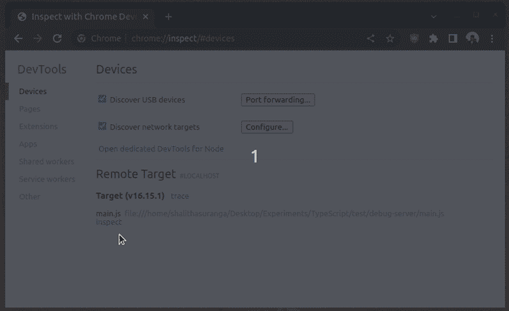

Opening the DevTools debugger for Node.js

您可以通过 Chrome DevTools 接口调试 TypeScript 文件。调试器实用程序反映了您在终端上的调试操作。看下面的预告:

早些时候，样本 React 项目在代码更改期间重新编译了修改过的类型脚本代码。可以用`tsc --watch`[`nodemon`](https://blog.logrocket.com/configuring-nodemon-with-typescript/)或者 [`ts-node-dev`](https://github.com/wclr/ts-node-dev) 对服务器端的 TypeScript 项目做同样的操作。

### 调试 Deno 应用程序

Deno 是一个安全的 TypeScript 运行时，我们可以使用它作为 Node.js 运行时的替代。在 Deno 中调试 TypeScript 不需要像基于 TypeScript 的 Node.js 应用程序那样进行手动配置，因为 Deno 本身就支持 TypeScript。

首先，确保您的计算机上已经安装了 Deno。如果没有，根据[官方安装指南](https://deno.land/manual/getting_started/installation)安装最新的 Deno 运行时版本。

在我们之前创建的基于 TypeScript 的 Node.js 项目目录中，使用以下命令启动 Deno 调试器:

```
deno run --inspect-brk main.ts

```

然后，打开 DevTools 并开始调试:

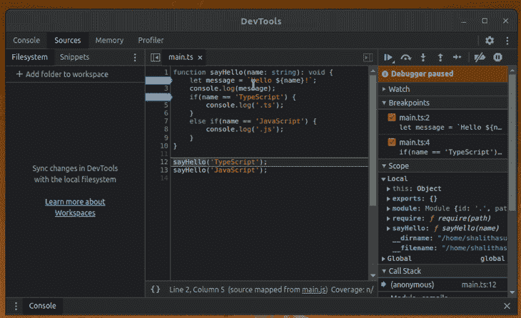

Debugging a TypeScript-based Node.js project in Chrome

## 集成 VS 代码进行后端调试

您可以按 F5 并调试 Node.js 应用程序，而无需额外的扩展，因为内置的调试器扩展支持 Node.js 调试。

对于 Deno，您可以安装 [Deno 扩展](https://marketplace.visualstudio.com/items?itemName=denoland.vscode-deno)进行自动`launch.json`配置，或者手动使用以下`launch.json`设置:

```
{
    "version": "0.2.0",
    "configurations": [
      {
        "name": "Deno",
        "type": "node",
        "request": "launch",
        "cwd": "${workspaceFolder}",
        "runtimeExecutable": "deno",
        "runtimeArgs": ["run", "--inspect-brk", "-A", "${file}"],
        "attachSimplePort": 9229
      }
    ]
 }

```

查看我如何用 VS 代码调试 TypeScript 文件:


Debugging Deno apps in TypeScript with Chrome DevTools

## 结论

调试的主要目标是通过监控源代码执行和手动审查代码来识别软件缺陷。在大多数 web 开发调试活动中，我们可以通过阅读代码和使用众所周知的调试器实用工具来识别 bug。但是，在一些复杂的场景中，我们必须生成许多测试用例，并使用高级调试器功能。

大多数 web 开发人员使用标准控制台 API(即`console.log`)进行调试；其他人从 Chrome DevTools 调试器或 VS 代码的调试器 UI 开始。当你开始追踪一个 bug 时，从从上到下分析代码开始。如果您还没有发现错误，那么如果逻辑流程不复杂，就尝试记录运行时值。如果逻辑流程复杂，从 Chrome 调试器或 VS 代码调试器 UI 开始可以节省时间。

在本教程中，我们讨论了如何使用 Chrome 调试用 TypeScript 编写的浏览器、Node.js 和 Deno 应用程序。我们还讨论了如何使用 VS 代码的调试器 UI。

您可以根据自己的需求和个人偏好定制和使用这些调试技术。类似于前端框架的 TypeScript 模板，您可以使用 [`node-typescript-boilerplate`模板](https://github.com/jsynowiec/node-typescript-boilerplate)通过预配置的调试环境更快地创建基于 TypeScript 的 Node.js 项目。或者，您可以按照我们在本教程中讨论的步骤创建自己的模板。

## [LogRocket](https://lp.logrocket.com/blg/typescript-signup) :全面了解您的网络和移动应用

[](https://lp.logrocket.com/blg/typescript-signup)

LogRocket 是一个前端应用程序监控解决方案，可以让您回放问题，就像问题发生在您自己的浏览器中一样。LogRocket 不需要猜测错误发生的原因，也不需要向用户询问截图和日志转储，而是让您重放会话以快速了解哪里出错了。它可以与任何应用程序完美配合，不管是什么框架，并且有插件可以记录来自 Redux、Vuex 和@ngrx/store 的额外上下文。

除了记录 Redux 操作和状态，LogRocket 还记录控制台日志、JavaScript 错误、堆栈跟踪、带有头+正文的网络请求/响应、浏览器元数据和自定义日志。它还使用 DOM 来记录页面上的 HTML 和 CSS，甚至为最复杂的单页面和移动应用程序重新创建像素级完美视频。

[Try it for free](https://lp.logrocket.com/blg/typescript-signup)

.