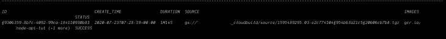
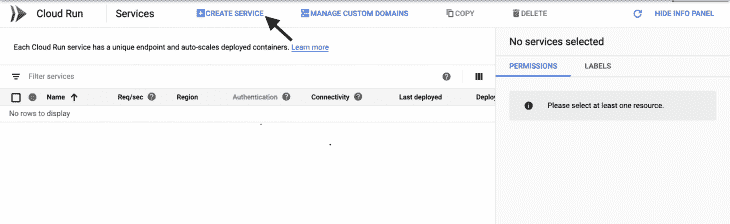
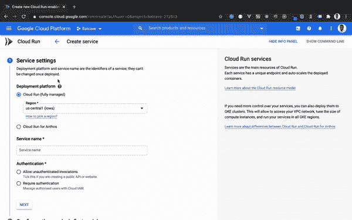
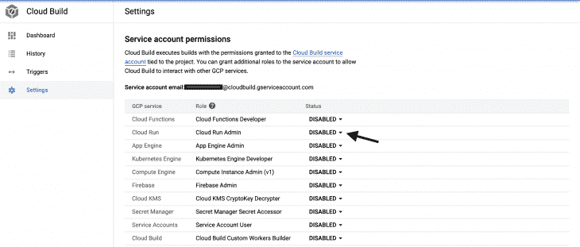
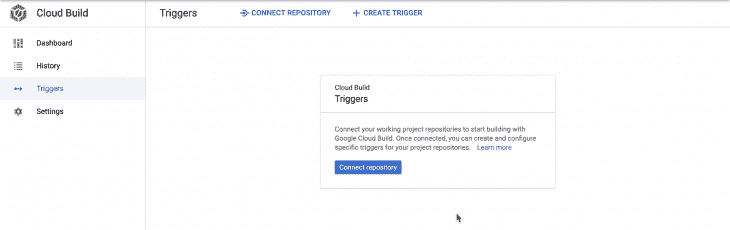
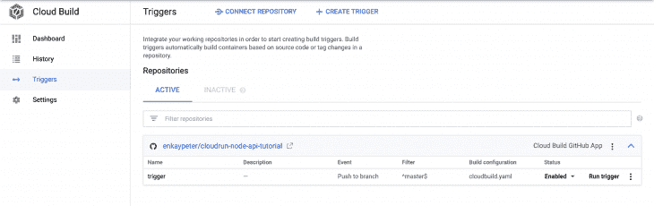
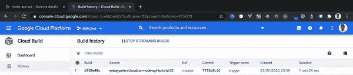
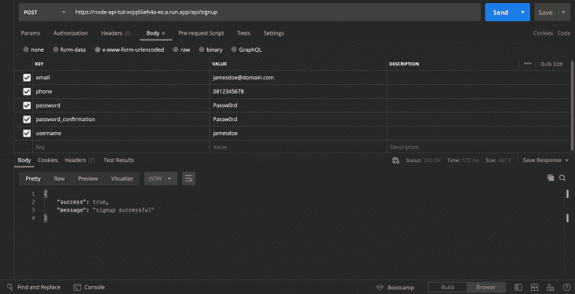
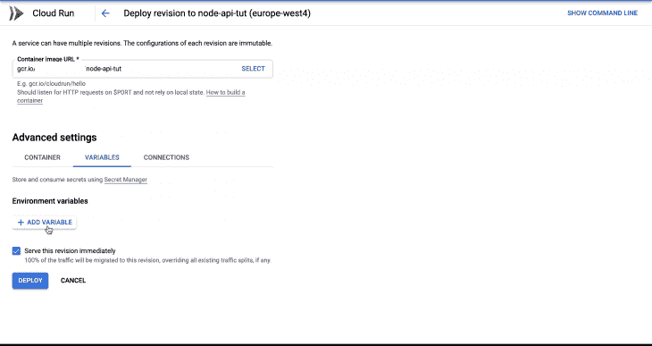
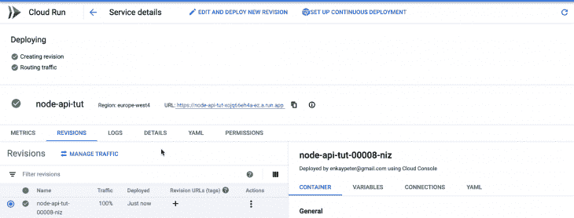

# 如何在 Google Cloud Run 上部署节点 API

> 原文：<https://blog.logrocket.com/how-to-deploy-a-node-api-on-google-cloud-run/>

随着时间的推移，将应用程序部署到生产环境变得越来越容易。随着无运营平台数量的增加，为中小型项目建立复杂且相对昂贵的云基础设施变得很容易。云运行就是其中的一个平台。Cloud Run 构建于 [Knative](https://knative.dev/) 之上，是一个完全托管的无服务器平台，用于部署容器化的应用程序，并具有开箱即用的自动扩展配置。在本教程中，我们将介绍如何使用 Docker 打包一个节点 API，并将其部署在配置了 CI/CD 的 Cloud Run 上。

## 先决条件

要完成本教程，您需要以下内容:

1.  Node.js 的基础知识
2.  拥有关于 [MongoDB](https://www.mongodb.com/) 的基础知识是很好的
3.  Git 的基础知识
4.  [安装纱线](https://yarnpkg.com/lang/en/docs/install/)或 [NPM](https://www.npmjs.com/) (我们将使用纱线)
5.  安装了 Git
6.  [谷歌云 SDK](https://cloud.google.com/sdk/docs) 已安装
7.  [邮递员](https://www.postman.com/downloads/)安装完毕
8.  一个 [MongoDB atlas](https://www.mongodb.com/) 账户
9.  一个[谷歌账户](https://support.google.com/accounts/answer/27441?hl=en)
10.  配置为运行 Node.js 的开发计算机

## 装置

在选择的任何终端中运行以下命令来初始化项目目录:

```
$ git clone -b boilerplate https://github.com/enkaypeter/cloudrun-node-api-tutorial.git
$ cd cloudrun-node-api-tutorial && yarn
```

样板分支包含一个简单的 API 和一个 docker 文件，我们将使用它来构建 API 的 docker 映像。

## 构建 API 映像

云运行使得运行几乎任何语言构建的应用成为可能。这是通过应用程序打包/容器化实现的。在本教程中，我们将使用谷歌[云构建器](https://cloud.google.com/cloud-build/docs/cloud-builders)来打包和封装我们的 API。为此，我们将打开项目目录根目录中的`Dockerfile`,并添加以下代码:

```
# Pull in the official lightweight version of Node 12.
FROM node:12-slim

# Create and change to the app directory.
WORKDIR /app

COPY package.json .
COPY yarn.lock .

# Install production dependencies.
RUN yarn install --production

# Copy local codebase into the container image
COPY . .

# Compile down to ES5 with Babel
RUN yarn build-server

# Remove unused src directory
RUN rm -rf src/

# Start the api server
CMD [ "yarn", "start" ]
```

在上面的代码片段中，我们引入了 Node.js 的轻量级版本(版本 12 ),这将帮助我们运行我们的节点 API。我们还复制了依赖清单(`package.json`和`yarn.lock`)，这将帮助我们安装 API 依赖项。当我们完成依赖项的安装后，我们将把我们的代码库从本地机器复制到容器映像中，用 babel 把我们的代码从 ES6 编译到 ES5，通过删除未使用的文件做一些整理工作，并启动我们的 API 服务器。

现在我们已经在`Dockerfile`中定义了我们的映像规范，我们现在将通过运行以下命令来构建我们的容器映像:

```
$ gcloud builds submit --tag gcr.io/PROJECT-ID/node-api-tut
```

> 其中`PROJECT_ID`是您的谷歌云项目 id

如果成功，您应该会看到如下图所示的成功消息:



现在我们已经将 API 打包和容器化，我们将前往 [Google Cloud Console](https://console.cloud.google.com/) 来创建我们的云运行服务。

## 将我们的容器映像部署到云运行

为了部署我们的容器映像，我们将通过访问[此链接](https://console.cloud.google.com/run)在云控制台上运行云。当页面完全加载时，您应该会看到类似下图的内容:



点击`CREATE SERVICE`按钮将弹出一个窗口，在这里我们将指定我们的服务名，它来自 [GCR](https://cloud.google.com/container-registry) (谷歌容器注册)的容器图像，并使它对外界公开:



当所有必需的参数都满足时，点击`CREATE`将提供一个可公开访问的 URL，并且启用了现成的 SSL，如上面的 gif 所示。在下一节中，我们将了解如何在云运行时自动部署对节点 API 所做的更改。

## 使用云构建设置 CI/CD

每当我们想要部署对我们的 API 所做的更改时，重复上面列出的步骤将会是一种艰难的生活。Cloud Build 使我们的生活变得更加轻松，因为它使得每次我们选择的分支在源代码控制中更新时，都可以为我们的项目存储库定义部署规则。为此，我们将做两件事:

1.  创建一个 cloudbuild.yaml 文件
2.  配置连续部署(CD)构建触发器

### 创建一个 cloudbuild.yaml 文件

为了创建 cloudbuild.yaml 文件，我们将运行下面的命令`$ touch cloudbuild.yaml`。完成后，我们应该有一个如下所示的项目目录:

```
.
├── Dockerfile
├── README.md
├── cloudbuild.yaml
├── node_modules
├── package.json
├── src
│   ├── app.js
│   ├── config.js
│   ├── controllers
│   ├── helpers
│   ├── middleware
│   ├── models
│   └── routes
└── yarn.lock
```

我们现在将通过添加以下代码来定义部署规则:

```
steps:
    # build the container image
    - name: 'gcr.io/cloud-builders/docker'
      args: [ 'build', '-t', 'gcr.io/${_PROJECT_ID}/node-api-tut', '.' ]
    # push the container image to gcr
    - name: 'gcr.io/cloud-builders/docker'
      args: [ 'push', 'gcr.io/${_PROJECT_ID}/node-api-tut']
      # Deploy container image to Cloud Run
    - name: "gcr.io/cloud-builders/gcloud"
      args: ['run', 'deploy', 'node-api-tut', '--image', 'gcr.io/${_PROJECT_ID}/node-api-tut', '--region', 'europe-west4', '--platform', 'managed', '--allow-unauthenticated']
```

> _PROJECT_ID 是一个触发器变量，它将在我们创建构建触发器时定义

上面的 YAML 片段展示了云构建如何构建、打包和部署我们的 API。让我们回顾一下下面的步骤:

*   步骤 1:这里是我们的云构建器(Google Cloud Build)使用在项目目录的根目录中找到的 Dockerfile 来构建我们的 API 容器映像的地方，如最后一个参数(来自 LHS)所指定的
*   步骤 2:构建完成后，我们的容器映像被发送到 GCR 进行存储
*   步骤 3:在这一步中，我们为云运行服务指定一些基本参数
    *   这是我们的云运行服务名称
    *   `--region europe-west4`:这指定了将托管我们服务的[计算区域](https://cloud.google.com/compute/docs/regions-zones)
    *   `--platform managed`:这告诉 Cloud Build 将我们的容器映像部署到一个完全托管的平台上(云运行)
    *   这个标志公开了我们的云运行服务

在我们将`cloudbuild.yaml`文件提交到源代码控制之前，我们必须给予云构建服务帐户权限来触发云运行修订。这可以通过导航到[云构建设置控制台](https://console.cloud.google.com/cloud-build/settings/service-account)并启用`Cloud Run Admin`角色来完成，如下图所示:



完成后，我们现在可以继续将`cloudbuild.yaml`文件提交给源代码控制。

### 配置连续交付构建触发器

每当源代码控制中的节点 API 发生变化时，构建触发器使云构建能够自动启动我们在`cloudbuild.yaml`文件中定义的构建过程。为了进行配置，我们将前往谷歌云控制台的[触发器页面](https://console.cloud.google.com/cloud-build/triggers?_ga=2.218397840.82179932.1595308408-808517244.1593885543)，并连接我们的存储库:



当我们连接完节点 API 的项目存储库后，我们将在终端中运行以下代码:

```
$ gcloud beta builds triggers create github \
--repo-name=[REPO_NAME] \
--repo-owner=[GITHUB_USERNAME] \
--branch-pattern="^master$" \
--substitutions=_PROJECT_ID=[PROJECT-ID] \
--build-config=cloudbuild.yaml \
```

如果成功，您应该会看到类似这样的屏幕:


现在我们已经设置好了一切，是时候测试我们的构建触发器了。我们可以这样更新`src/controllers/base-controller.js`中的`index`方法:

```
// src/controllers/base-controller.js
...

  index: (req, res) => {
    return res.status(200).json({
      success: true,
      message: "Hey there :)",
    })
  }

...
```

在更新了`index`方法之后，我们将把变更提交给我们的源存储库。如果一切顺利，您导航到`{HOST_URL}\api`，您应该会看到类似这样的屏幕:



> 其中{主机 URL}是云运行调配的 URL

在下一节中，我们将看看如何使用环境变量部署我们的 API。

## 处理环境`.env`变量

除了托管基础设施，环境变量是我们本地开发环境与生产环境的区别。在这一节中，我们将看看我们可以用环境变量部署 API 的两种主要方式。

第一种方法是存储我们的。Google 存储桶(GCS)中的 env 变量。这可以通过创建一个名为`secrets-locker`的存储桶并使用`gsutil`(一个从命令行访问云存储的实用工具)将我们的 env 变量复制到桶中来实现，如下所示:

```
$ gsutil mb gs://secrets-locker/
$ gsutil cp .prod.env gs://secrets-locker/
```

> 这个包(gsutil)是随 Google Cloud SDK 一起安装的。然而，如果你不能运行后续命令，请访问[官方文档](https://cloud.google.com/storage/docs/gsutil)来单独安装`gsutil`。

其中`.prod.env`是包含您的生产环境变量的文件，在我们的例子中，它是 MongoDB 的数据库连接变量:

```
//.prod.env
DB_CON_STRING=[MONGO_DB_CONNECTIONSTRING]
```

> `[MONGO_DB_CONNECTIONSTRING]`是您的 mongodb 连接字符串。

为了将这个环境文件添加到我们的云运行 API 中，我们将向我们的`cloudbuild.yaml`文件添加一个额外的构建步骤，如下所示:

```
steps:
    # Download .env file
    - name: "gcr.io/cloud-builders/gsutil"
      args: ["cp", "gs://secrets-locker/.prod.env", ".env"]
    # build the container image
    - name: 'gcr.io/cloud-builders/docker'
      args: [ 'build', '-t', 'gcr.io/${_PROJECT_ID}/node-api-tut', '.' ]
    # push the container image to gcr
    - name: 'gcr.io/cloud-builders/docker'
      args: [ 'push', 'gcr.io/${_PROJECT_ID}/node-api-tut']
      # Deploy container image to Cloud Run
    - name: "gcr.io/cloud-builders/gcloud"
      args: ['run', 'deploy', 'node-api-tut', '--image', 'gcr.io/${_PROJECT_ID}/node-api-tut', '--region', 'europe-west4', '--platform', 'managed', '--allow-unauthenticated']
```

上面的代码片段仍然与我们为云运行服务配置连续部署时创建的`cloudbuild.yaml`文件相同。这里唯一的区别是我们将生产环境变量(`.prod.env`)复制到容器映像`.env`文件中。

在将云构建文件提交到源代码控制之前，我们将取消对`src/app.js`中的`mongoose.connect()`方法的注释，如下所示:

```
// src/app.js

...
// Connect to mongodb
mongoose.connect(
    process.env.DB_CON_STRING,
    {
        useNewUrlParser: true,
        useUnifiedTopology: true
    },
    (err) => {
        if (err) {
            console.log(err);
        } else {
            console.log('Successfully Connected to the database');
        }
    }
);

...
```

完成后，我们现在可以将我们的更改提交到源代码控制中。

> 记得把 `.prod.env` 添加到你的 `.gitignore` 文件中，或者有意识地努力让它不被 git 跟踪。

为了在 CR 中测试我们的环境变量，我们将使用 Postman 向我们的节点 API 端点发出一个`POST`请求:



使用云运行部署环境变量的第二种方式是在[云运行控制台](https://console.cloud.google.com/run/)上手动定义，如下图所示:



单击`DEPLOY`按钮从我们的节点 API 容器映像部署一个新的云运行版本。如果成功，您应该会看到如下所示的屏幕:



## 结论

在本教程中，我们学习了如何在有和没有环境变量的情况下在 Google Cloud Run 上部署节点 API。我们还学习了如何为我们的云运行服务配置连续交付。要了解更多关于云运行以及如何利用其技术来处理工作负载的信息，请查看官方文档。

本教程的源代码也可以在 GitHub 上找到。你可以随意复制它，叉它，或者提交一个问题。

## 200 只显示器出现故障，生产中网络请求缓慢

部署基于节点的 web 应用程序或网站是容易的部分。确保您的节点实例继续为您的应用程序提供资源是事情变得更加困难的地方。如果您对确保对后端或第三方服务的请求成功感兴趣，

[try LogRocket](https://lp.logrocket.com/blg/node-signup)

.

[](https://lp.logrocket.com/blg/node-signup)[https://logrocket.com/signup/](https://lp.logrocket.com/blg/node-signup)

LogRocket 就像是网络和移动应用程序的 DVR，记录下用户与你的应用程序交互时发生的一切。您可以汇总并报告有问题的网络请求，以快速了解根本原因，而不是猜测问题发生的原因。

LogRocket 检测您的应用程序以记录基线性能计时，如页面加载时间、到达第一个字节的时间、慢速网络请求，还记录 Redux、NgRx 和 Vuex 操作/状态。

[Start monitoring for free](https://lp.logrocket.com/blg/node-signup)

.