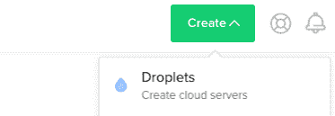
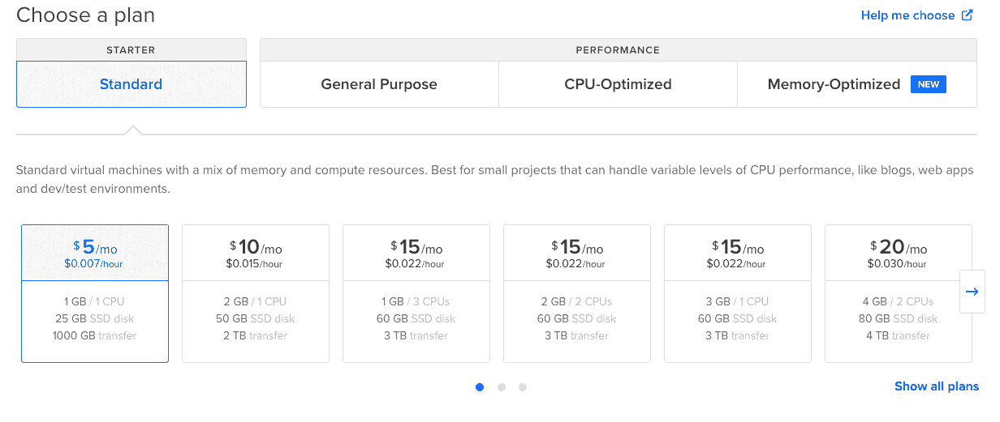
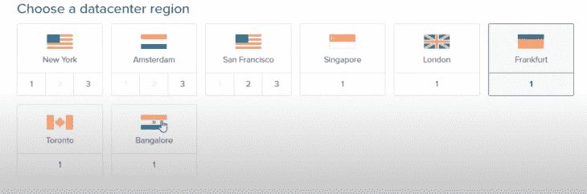
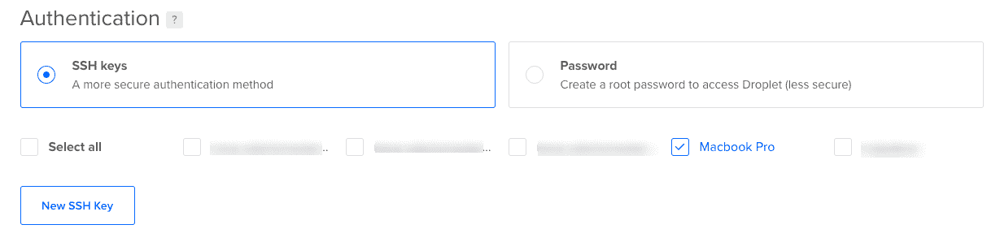
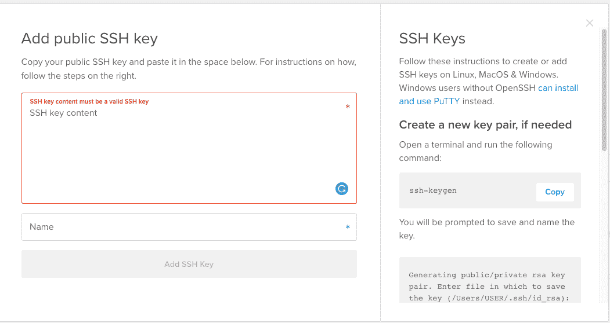

# 如何将 AdonisJs 应用程序部署到 DigitalOcean - LogRocket 博客

> 原文：<https://blog.logrocket.com/how-to-deploy-an-adonis-js-application-to-digitalocean/>

AdonisJs 框架高度关注速度和稳定性，是作为 Node.js 生态系统中其他框架的替代方案而创建的。

有了集成系统的力量，开发人员工效学就有了目标，而不是耦合库。

DigitalOcean 是一家云基础设施提供商，提供按需云平台，可以托管和管理您的应用程序。在本教程中，我们将介绍在 DigitalOcean 上设置服务器和配置数据库的步骤。我还在 AdonisJs 中创建了一个[演示](https://github.com/Vectormike/adonis_blogApi)应用程序，我们将把它部署到 DigitalOcean。

DigitalOcean 还提供其他选项。请随意检查或使用它们中的任何一个。为了即将到来的开发者，我们将使用这个技术栈。

### 先决条件

在我们继续本教程之前，您必须具备以下条件:

*   对 Node.js(尤其是 AdonisJs)有基本的了解
*   Git 的基础知识
*   安装了 npm 或纱线。
*   数字海洋账户

### 创建一个液滴

水滴是服务器。当您登录到您的 DigitalOcean 帐户时，您必须首先创建一个服务器。点击屏幕顶部的创建按钮，我们将创建一个 Droplet。



从分布中选择一个图像。分发列表下有多个选项。因此，我们将使用 Ubuntu 20.04 (LTS)，因为它很常见。


然后，我们选择一个计划。我建议我们选择最小的计划，因为我们将部署一个非常基本的应用程序。如果需要，您可以随时扩大规模。请记住，未来缩小内存是不可能的。



选择数据中心区域。选择一个离你近的或者你认为用户主要居住的地方。



接下来，我们需要将 SSH 密钥添加到 droplet 中。这是一个非常重要的部分，有混淆的余地。SSH 允许我们从我们的计算机直接连接到远程服务器(DigitalOcean)。

如果您已经将 SSH 密钥添加到 DigitalOcean，您可以选择:



如果您没有添加它，那么您必须生成一个。复制并粘贴您的 SSH 密钥，并为其命名。您可以使用 [Github 的指南](https://help.github.com/articles/generating-a-new-ssh-key-and-adding-it-to-the-ssh-agent/)来生成一个并将其复制到我们的 droplet 中。



通过更改您的主机名来完成它，这样它就不会为您生成一个随机的名称，然后单击`Create Droplet`。

### 配置服务器

接下来，我们将 SSH 添加到我们的服务器中继续。但是我们需要管理权限，所以让我们创建一个新用户并授予权限。

使用我们服务器的 IP 地址以 root 用户身份登录:

```
ssh [email protected]
```

现在添加用户并记下您使用的密码:

```
adduser dominic
```

现在，让我们将这个用户添加到 sudo 组，这样它就可以使用关键字`sudo`运行`root`命令。

所以，运行这个:

```
usermod -aG sudo dominic
```

现在，我们已经将 dominic 添加到具有管理权限的 sudo 组中，我们还希望将 SSH 密钥添加到用户中，以便我们可以登录到服务器。

```
su - dominic
```

接下来，创建一个名为`.ssh`的目录，创建一个存储 SSH 密钥的文件`authorized_keys`，并更改目录的权限，使其访问隐藏起来。

```
mkdir ~/.ssh touch .ssh/authorized_keys chmod 700 .ssh
```

我们还需要更改文件的权限，这样它就可以被所有人读取，并且只能被用户`domininc`更改。

现在接下来最重要的步骤是将我们复制的 SSH 密钥粘贴到这个文件中。如果你没有复制，回到你的电脑上复制。

打开文件并将内容粘贴到文件中。保存文件，点击`esc`停止编辑，`:wq`写入(保存)并按`ENTER`。

现在限制文件并退出:

```
chmod 600 ~/.ssh/authorized_keys exit
```

让我们通过 SSH 回到我们的服务器，但是使用我们新创建的用户。如果成功了，我们就可以开始下一步了。

* * *

### 更多来自 LogRocket 的精彩文章:

* * *

```
ssh [email protected]
```

### 安装和设置 MYSQL

看看我们的演示应用程序，我们使用 MYSQL 作为它的数据库，所以我们需要在我们的服务器上安装和配置它。

```
sudo apt install mysql-server sudo mysql_server_installation
```

接下来，我们需要登录 MYSQL 服务器并创建一个新的用户和数据库。

```
mysql -u root -p
```

更换`USERNAME`、`localhost`和`PASSWORD`。

```
CREATE USER 'USERNAME'@'localhost' IDENTIFIED BY 'PASSWORD';
```

运行下面的命令，允许我们在连接 MySQL 时使用密码。

```
ALTER USER 'USERNAME'@'LOCALHOST'IDENTIFIED WITH mysql_native_password BY 'PASSWORD';
```

然后，我们用相关用户创建一个数据库:

```
CREATE DATABASE adonis_userAuth;
```

然后，我们授予所有权限，刷新以使其工作，并退出:

```
GRANT ALL ON adonis_userAuth.* TO 'USERNAME'@'localhost'; FLUSH PRIVILEGES; exit
```

### 在我们的服务器上克隆我们的应用

我们最后的任务是使用 git 将我们的 AdonisJs 应用程序从 Github 克隆到我们的服务器中。因此，让我们再次 SSH 到我们的服务器并克隆我们的 repo。您可以随时使用 SSL 来克隆它。

```
https://github.com/Vectormike/adonis_blogApi
```

转到克隆的目录并安装依赖项:

```
cd adonis_blogApi npm install
```

我们仍然需要在一个文件中修改我们的环境变量。AdonisJs 通过一个`.env`文件读取所有变量。这些变量是我们的配置设置。

我们创建了文件`.env`,这样它可以包含 AdonisJs 应用程序的变量。

```
touch .env
```

创建后，我们生成应用程序密钥`APP_KEY`。没有它，我们的应用程序将无法运行。

```
adonis key:generate
```

这会产生一些随机数。复制密钥并打开`.env`文件，这样我们可以粘贴所有变量，包括应用密钥。

```
vim .env
```

然后，粘贴以下变量:

```
HOST=127.0.0.1
PORT=3333
NODE_ENV=production
APP_NAME=AdonisJs
APP_URL=http://${HOST}:${PORT}
CACHE_VIEWS=false
APP_KEY=mAqOZJTaXhbcvxPGVckSyUI1UeCeYIUM
DB_CONNECTION=mysql
DB_HOST=127.0.0.1
DB_PORT=3306
DB_USER=root
DB_PASSWORD=
DB_DATABASE=adonis_userAuth
HASH_DRIVER=bcrypt
```

我们需要运行迁移来创建我们的表。如果您的环境是生产环境，您可能需要添加`--force flag`，否则它不会创建表。

```
node ace migration:run --force
```

最后，我们开始运行我们的应用程序。但是如果它崩溃了呢？这就是为什么我们必须美国 PM2，使它自动重启时，它崩溃了。

如果`NODE_ENV`正在生产，运行该命令:

```
pm2 start server.js
```

### 配置 Nginx

我们将需要使用 Nginx 来设置反向代理。这将允许我们从外部访问我们的应用程序，而不是通过我们的本地服务器网络进行访问。这样我们可以通过 IP 地址或域名访问它，而不仅仅是通过`PORT`。

因此，我们打开 Nginx 配置文件并编辑:

```
sudo vim /etc/nginx/sites-available/default
```

粘贴下面的配置。这将告诉 Nginx 监听一个传入的相关域，并将所有请求转发给本地服务器网络中的`PORT`。

```
server_name DOMAIN_NAME_OR_IP_ADDRESS;

location / {
    proxy_pass http://localhost:3333;
    proxy_http_version 1.1;
    proxy_set_header Connection "upgrade";
    proxy_set_header Host $host;
    proxy_set_header Upgrade $http_upgrade;
    proxy_set_header X-Real-IP $remote_addr;
    proxy_set_header X-Forwarded-For $proxy_add_x_forwarded_for;
}
```

用您的 IP 地址或域名(如果已设置)替换`server_name`。为了让我们的更改生效，我们必须重启 Nginx。

```
sudo service nginx restart
```

我们的应用程序现在可以通过点击我们的服务器的 IP 来访问。

## 结论

在本教程中，我们学习了如何将 AdonisJs 应用程序部署到 DigitalOcean。我们还学习了如何配置 Nginx，以便设置反向代理，配置我们的 droplet，并在 DigitalOcean 上设置我们的数据库。

本文应该已经解释了部署我们的应用程序所需的每个步骤。

我们可以在流程中添加一个自动部署脚本。这将从我们的存储库中提取最近的代码，安装依赖项，运行迁移，并重启应用程序。

要了解更多关于数字海洋的信息，请前往[数字海洋](https://www.digitalocean.com/community/tutorials)获取更多教程。

用作本教程演示的源代码在 [Github](https://github.com/Vectormike/adonis_blogApi) 上。随意克隆它。

## 200 只显示器出现故障，生产中网络请求缓慢

部署基于节点的 web 应用程序或网站是容易的部分。确保您的节点实例继续为您的应用程序提供资源是事情变得更加困难的地方。如果您对确保对后端或第三方服务的请求成功感兴趣，

[try LogRocket](https://lp.logrocket.com/blg/node-signup)

.

[](https://lp.logrocket.com/blg/node-signup)[https://logrocket.com/signup/](https://lp.logrocket.com/blg/node-signup)

LogRocket 就像是网络和移动应用程序的 DVR，记录下用户与你的应用程序交互时发生的一切。您可以汇总并报告有问题的网络请求，以快速了解根本原因，而不是猜测问题发生的原因。

LogRocket 检测您的应用程序以记录基线性能计时，如页面加载时间、到达第一个字节的时间、慢速网络请求，还记录 Redux、NgRx 和 Vuex 操作/状态。

[Start monitoring for free](https://lp.logrocket.com/blg/node-signup)

.