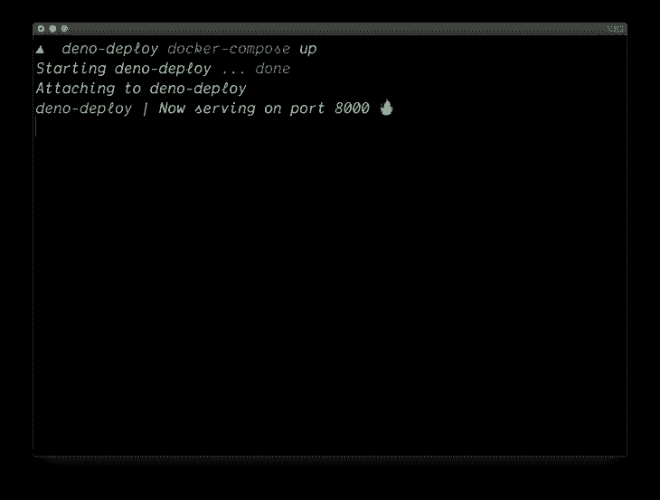
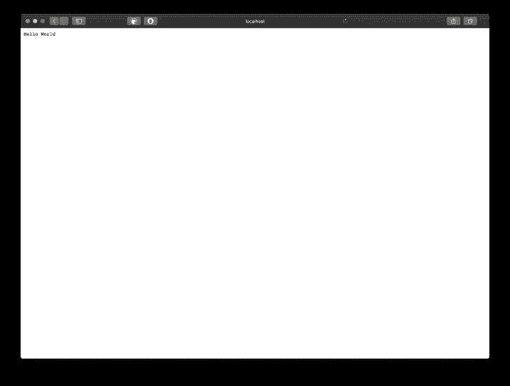
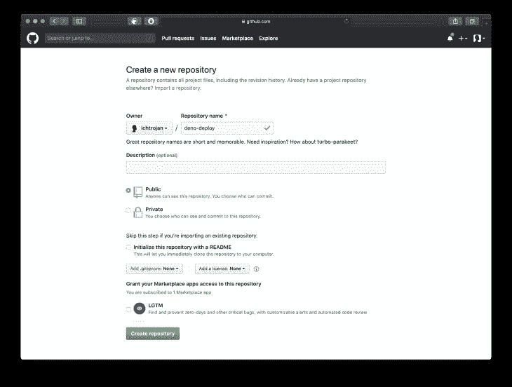
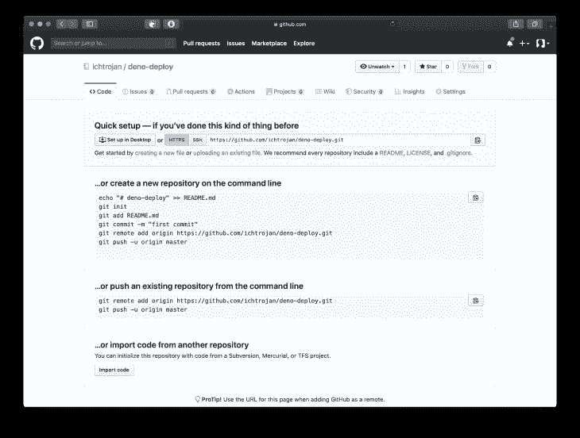
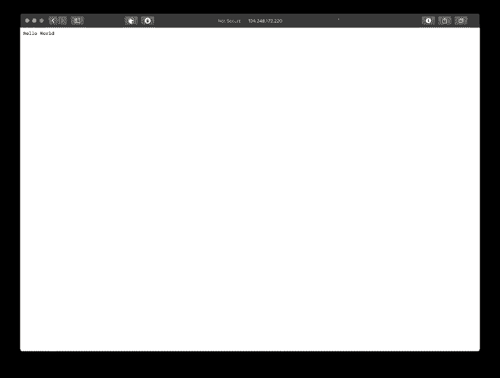

# 如何将 Deno 应用程序部署到生产日志

> 原文：<https://blog.logrocket.com/how-to-deploy-deno-applications-to-production/>

## 先决条件

*   [Docker](https://www.docker.com) 安装在你的服务器和本地机器上
*   一个 Ubuntu 服务器，你可以从 [DigitalOcean](https://Digitalocean.com) 得到一个
*   对 [git](https://git-scm.com) 的基本了解
*   对命令行界面的基本了解

在这一步中，您将创建一个简单的 Deno 应用程序来显示 hello world 。与 NodeJS 不同，您不需要运行 `npm init` 来创建新的应用程序。您可以简单地创建一个 TypeScript 文件并开始编码。

首先，在本地机器上创建一个名为`deno-deploy`的新目录，运行:

```
mkdir deno-deploy
```

通过运行以下命令将目录更改为`deno-deploy`:

```
cd deno-deploy
```

通过运行以下命令，在`deno-deploy`目录下创建一个名为`server.ts`的新文件:

```
touch server.ts
```

> 注意:或者，你可以使用你最喜欢的编辑器来创建这个文件。

用您喜欢的编辑器打开`server.ts`,粘贴并保存以下代码片段:

```
import { serve } from "https://deno.land/[email protected]/http/server.ts";

const server = serve({ port: 8000 });

console.log("Now serving on port 8000 🔥");

for await (const req of server) {
    req.respond({ body: "Hello World"});
}

```

上面的代码片段将创建一个 Deno 服务器，并在端口`8000`上提供内容`Hello World`。

## 创建 Docker 配置

### 创建 Dockerfile 文件

在这一步中，您将为 Deno 应用程序设置 Docker 配置。首先，您将通过终端运行以下命令创建一个名为`Dockerfile`的新文件:

```
touch Dockerfile
```

用您喜欢的文本编辑器打开`Dockerfile`,然后粘贴并保存以下代码片段:

```
FROM hayd/deno:latest

EXPOSE 8000

WORKDIR /app

ADD . /app

RUN deno cache server.ts

CMD ["run", "--allow-net", "server.ts"]

```

让我们分解一下`Dockerfile`中的这些行在执行时会做什么:

### 来自 hayd/deno:最新

从 Docker hub 获取最新版本的`hayd/deno`图像。

### 暴露 8000

构建时在我们的容器上公开端口`8000`。

### WORKDIR /app

在我们的容器中创建工作目录`/app`。

### 补充。/应用程序

将根目录的内容复制到 Docker 容器中的`/app`目录。

### 运行 deno cache server.ts

编译`server.ts`,这样它就不需要在每次启动时都被编译。

### CMD ["run "，"–allow-net "，" server.ts"]

这将运行`server.ts`文件并启用网络。

### 创建 dock-compose . yml

在这一步中，您将创建一个`docker-compose.yml`文件，该文件将用于将所有内容拼凑在一起并为我们的应用程序服务。要创建一个`docker-compose.yml`文件，运行:

```
touch docker-compose.yml
```

用您喜欢的文本编辑器打开`docker-compose.yml`,然后粘贴并保存以下代码片段:

```
version: '3'

services:
  web:
    build: .
    container_name: deno-deploy
    ports:
      - "8000:8000"

```

让我们来分解一下`docker-compose.yml`中的这些行在执行时会做什么。`version: '3'`指定文件中包含的`YAML`的版本:

```
web:
    build: .
    container_name: deno-deploy
    ports:
      - "8000:8000"
```

这个部分包含了`web`服务。

### `build: .`

这表明我们想要构建的`Dockerfile`在当前目录中。

### `container_name: deno-deploy`

这将确保构建中的容器名称是`deno-deploy`。

### `ports: - "8000:8000"`

将把容器端口`8000`映射到主机服务器端口`8000`。

## 构建并运行容器

要在本地构建 Docker 容器，请运行:

```
docker-compose up
```



您可以通过首选的网络浏览器在`[http://localhost:8000](http://localhost:8000)`上访问您的应用程序。



## 部署到生产环境

### 推送至 GitHub

Docker 使在任何地方快速部署应用程序变得容易。首先，你需要让你的代码在 git 版本控制上可用，GitHub 是一个很好的提供者。[创建一个名为`deno-deploy`的新存储库](https://github.com/new)。




打开终端，同时仍在`deno-deploy`目录中。运行:

```
git init
```

这将启动一个新的 git 存储库。接下来，通过运行以下命令转移所有文件:

```
git add .
```

使用提交消息`"deno deploy"`提交暂存文件:

```
git commit -m "deno deploy"
```

通过运行以下命令推送至主分支:

```
git push -u origin master
```

这将把代码库和 Docker 配置一起推送到 Github 库的主分支。

## 在服务器上部署

在这一步中，您将使您的源代码在服务器上可用，并且可以通过互联网访问它。
SSH 进入您的服务器:

```
ssh {SERVER_USER}@{SERVER_IP}
```

*   `SERVER_USER`是服务器的用户

*   `SERVER_IP`是服务器的 IP 地址

克隆存储库:

```
git clone https://github.com/{GITHUB_USERNAME}/deno-deploy.git
```

> 注意:`GITHUB_USERNAME`是您实际的 GitHub 用户名

将目录更改为克隆的存储库:

```
cd deno-deploy
```

执行`docker-compose`命令:

```
docker-compose up -d
```

与您在本地机器上执行`docker-compose`的方式不同，这里有一个`-d`标志，它使您的 docker 容器能够以分离模式运行。简单来说，它允许你的 docker 容器在后台运行。


您将能够在`[http://](http://){SERVER_IP}:8000`访问您的应用程序。我这种情况，可以去参观`[http://104.248.172.220:8000](http://104.248.172.220:8000)`。



## 结论

在本文中，我们学习了如何创建一个简单的 Deno web 服务器，如何为 Deno web 服务器创建 Docker 配置，如何将您的代码推送到 GitHub，以及如何使您的 Deno 应用程序在互联网上可用。编码快乐！

## 使用 [LogRocket](https://lp.logrocket.com/blg/signup) 消除传统错误报告的干扰

[](https://lp.logrocket.com/blg/signup)

[LogRocket](https://lp.logrocket.com/blg/signup) 是一个数字体验分析解决方案，它可以保护您免受数百个假阳性错误警报的影响，只针对几个真正重要的项目。LogRocket 会告诉您应用程序中实际影响用户的最具影响力的 bug 和 UX 问题。

然后，使用具有深层技术遥测的会话重放来确切地查看用户看到了什么以及是什么导致了问题，就像你在他们身后看一样。

LogRocket 自动聚合客户端错误、JS 异常、前端性能指标和用户交互。然后 LogRocket 使用机器学习来告诉你哪些问题正在影响大多数用户，并提供你需要修复它的上下文。

关注重要的 bug—[今天就试试 LogRocket】。](https://lp.logrocket.com/blg/signup-issue-free)